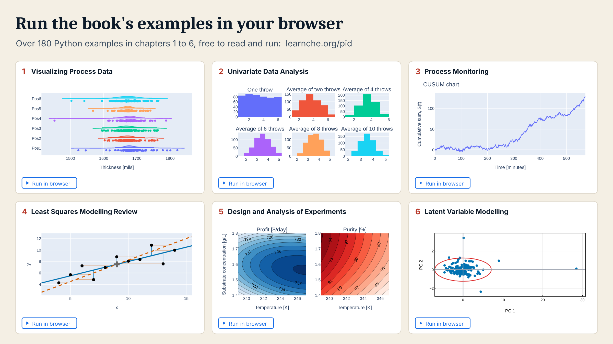
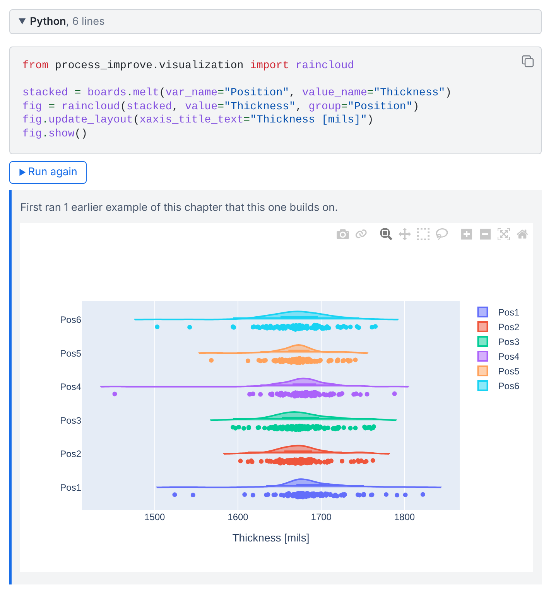

# Process Improvement using Data

**A free, open textbook on using data to improve processes. Read it online or as a PDF, and
run its Python examples in your browser.**

Written by Kevin G. Dunn, and taught and refined in university and industry courses since 2010.

  <a href="https://learnche.org/pid">
    <picture>
      <source media="(prefers-color-scheme: dark)" srcset="_static/banner-dark.png">
      
    </picture>
  </a>

  <a href="https://learnche.org/pid"><b>Read online</b></a>
  &nbsp;&middot;&nbsp;
  <a href="https://learnche.org/pid/PID.pdf"><b>Download the PDF</b></a>
  &nbsp;&middot;&nbsp;
  <a href="https://learnche.org/pid/data-visualization/box-plots"><b>Run an example in your browser</b></a>

You do not need this repository to read the book. It holds the book's source, for anyone who
wants to report a problem, suggest a correction, or build the book themselves (see
[Contributing](#contributing)).

## What the book gives you

- **The whole book, free.** Every chapter is online and in the PDF, with no sign-up. You may
  copy, adapt and teach from it under the
  [CC BY-SA 4.0](https://creativecommons.org/licenses/by-sa/4.0/) license.
- **Examples you run where you read them.** Chapters 1 to 6 have over 180 Python examples, each
  with a **Run in browser** button: Python starts in your browser tab, with nothing to install.
- **Real data.** The examples and exercises draw on over 30 data sets, free to download from
  [openmv.net](https://openmv.net).
- **Practice.** Over 100 exercises, most with worked solutions, and 65 videos placed in the
  sections they explain.
- **One library for your own data.** The examples use
  [`process-improve`](https://github.com/kgdunn/process-improve), the book's open-source Python
  package, so the methods you read about are the ones you can apply to your own process data.

## Run the examples in your browser

  

Click **Run in browser** under an example and Python starts inside your browser tab. It reads
the data set, runs the code, and draws the figure under it, as in the raincloud plot shown
here from the [box plots](https://learnche.org/pid/data-visualization/box-plots) section.
Nothing is installed, and nothing you run leaves your computer.

The first click on a page can take half a minute while Python and its libraries download;
later examples on that page run straight away. When an example builds on an earlier one, the button
runs the earlier example first and says so. When the book quotes a number that the example
prints, the page tells you whether your run reproduced it.

## What's inside

| Chapter | What it covers |
|:-:|---|
| 1 | [**Visualizing process data**](https://learnche.org/pid/data-visualization/index): time-series, bar, box and scatter plots, and tables: how to look at data before modelling it. |
| 2 | [**Univariate data analysis**](https://learnche.org/pid/univariate-review/index): variability, probability distributions, confidence intervals, and tests for differences. |
| 3 | [**Process monitoring**](https://learnche.org/pid/process-monitoring/index): Shewhart, CUSUM and EWMA charts, process capability, and how monitoring is used in industry. |
| 4 | [**Least squares modelling**](https://learnche.org/pid/least-squares-modelling/index): correlation, simple and multiple linear regression, and how to check a model's residuals and predictions. |
| 5 | [**Design and analysis of experiments**](https://learnche.org/pid/design-analysis-experiments/index): factorial and fractional factorial designs, response surface methods, optimal, definitive screening and OMARS designs, mixture experiments, and how to compare designs before running them. |
| 6 | [**Latent variable modelling**](https://learnche.org/pid/latent-variable-modelling/index): principal component analysis (PCA), principal component regression, and projection to latent structures (PLS). |
| 7 | [**Applications**](https://learnche.org/pid/product-development-product-improvement/index): case studies in troubleshooting, multivariate monitoring, soft sensors, batch processes, image analysis and product development. |

Most textbooks cover one of these topics in depth. Process problems often need several of them
together, so this book covers all of them in one volume, using a shared set of data sets. It
suits upper-undergraduate and introductory graduate courses, and self-study by engineers and
scientists with a basic statistics background.

## Companion software: `process-improve`

The book's Python examples use the open-source package
[`process-improve`](https://github.com/kgdunn/process-improve). It provides PCA and PLS with
outlier diagnostics and prediction intervals, control charts, designed experiments, and batch
process monitoring. Install it with `pip install 'process-improve[all]'` to run the examples and
exercises in any Jupyter notebook.

The [designed-experiments app](https://kgdunn.github.io/process-improve/app/) runs the
package in your browser, with nothing to install: design an experiment, download the run
sheet, fill in your results, and upload it for the analysis.

## Who's using this book

The book is adopted in university courses, cited in graduate research, and
used inside companies as internal training material. A few course adoptions:

- **Western University, Canada**: required text for the graduate course
  *CBE 9190: Advanced Statistical Process Analysis*.
- **UNSW Sydney, Australia**: recommended text for *CEIC6789: Data-driven
  Decision Making in Chemical Engineering and Food Science*.
- **McMaster University, Canada**: *IBEHS 4C03: Statistical Methods for
  Biomedical Engineering* is built on the book's foundations and adapts them
  into JupyterLab notebooks.

It is also cited in graduate theses and peer-reviewed research across a range
of fields, from chemometrics and semiconductor manufacturing to public health
and tribology.

Teaching or training with the book? Tell us via
[Discussions](https://github.com/kgdunn/pid-book/discussions). We'd be glad
to list your course here.

## For instructors

You're welcome to use this book, and the course materials below, for your
own teaching. Everything is licensed under
[CC BY-SA 4.0](https://creativecommons.org/licenses/by-sa/4.0/), so you can
share, adapt, and even commercialize derivative work as long as you attribute
the original and license the result under the same terms. No permission
needed.

Course materials live on the original
[Learning Chemical Engineering: Courses](https://learnche.org/4C3/Main_Page)
site:

- [Suggested course structure](https://learnche.org/4C3/Course_outlines)
- [PDF slides](https://learnche.org/4C3/Main_Page) covering every section of
  the book
- [Assignments (with solutions)](https://learnche.org/4C3/Assignments_from_prior_years)
- [Midterms / tests](https://learnche.org/4C3/Midterms_from_prior_years)
- [Final exams](https://learnche.org/4C3/Final_exams_from_prior_years)
- Projects for
  [response surface optimization](https://learnche.org/4C3/Response_surface_project_from_prior_years)
  and
  [design of experiments](https://learnche.org/4C3/Designed_experiments_projects_from_prior_years)
- A [tutorial to learn R](https://learnche.org/4C3/Software_tutorial)
- [Video recordings](https://learnche.org/4C3/Course_videos_and_audio_from_previous_years)
  of the course on YouTube
- [Sample datasets](https://openmv.net/) for assignments, tests, and practice

**Teaching at a company?** Ask via
[GitHub Discussions](https://github.com/kgdunn/pid-book/discussions) for
additional slides, worksheets, and tips.

Questions, comments, or "how did you make that figure?" enquiries are all
welcome there too.

## License and citation

The book is licensed under the
[Creative Commons Attribution-ShareAlike 4.0 International (CC BY-SA 4.0)](https://creativecommons.org/licenses/by-sa/4.0/)
license. You are free to copy, adapt, and redistribute it (including for
courses you teach) provided you attribute the original author and license
your derivative work under the same terms.

Suggested attribution:

> Dunn, K. G. (2010–2026). *Process Improvement using Data* (CC BY-SA 4.0). Zenodo. https://doi.org/10.5281/zenodo.20284934

Each tagged release is archived on Zenodo. The DOI above is the concept DOI:
it always resolves to the latest archived edition. Machine-readable citation
metadata, including the DOI, is in [`CITATION.cff`](CITATION.cff).

## Privacy and readership data

The HTML edition at <https://learnche.org/pid> records aggregate,
cookieless pageview and search-query signal so the maintainer can tell
which sections need attention. No cookies are set, no IP addresses are
stored, no third-party trackers are loaded, and the browser
*Do Not Track* setting is honoured. Self-hosted copies of this book do
not phone home.

The reader-facing summary lives at <https://learnche.org/pid/privacy>
(source: [`privacy.rst`](privacy.rst)). The aggregated dashboards (top
pages, per-page 90-day sparklines, search queries) are themselves
public at <https://learnche.org/_stats/> in keeping with the open
spirit of the book. Engineering and operations docs are under
[`docs/telemetry/`](docs/telemetry/).

## Contributing

Contributions, corrections, and exercises are welcome from anyone: students,
instructors, and practitioners alike. The book has been improved continuously
since 2010 thanks to readers like you. The fastest channels:

1. **Open an [issue](https://github.com/kgdunn/pid-book/issues)** for typos,
   technical errors, broken links, or build problems.
2. **Open a pull request** for content changes.
3. **Use [Discussions](https://github.com/kgdunn/pid-book/discussions)** for
   adoption stories, teaching ideas, and long-form feedback, or
   [this Google Form](https://docs.google.com/forms/d/1IpO-bvJwQwhK64eid4YXwJBvGxN5cfyYDv81G-YgWrM/viewform)
   if you prefer.

[CONTRIBUTING.md](CONTRIBUTING.md) has everything a contributor needs: the
contribution workflow, how to build the book locally, the repository layout,
the RST style notes, and how the book is published.
