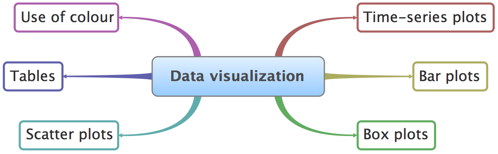
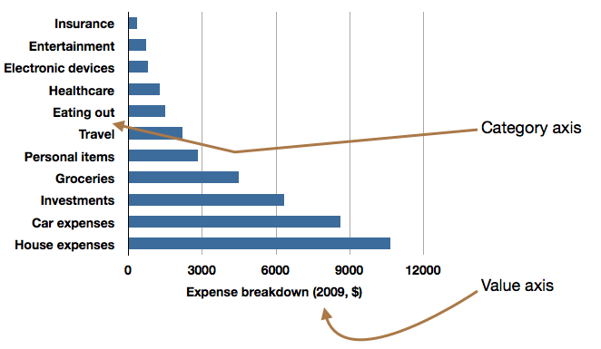
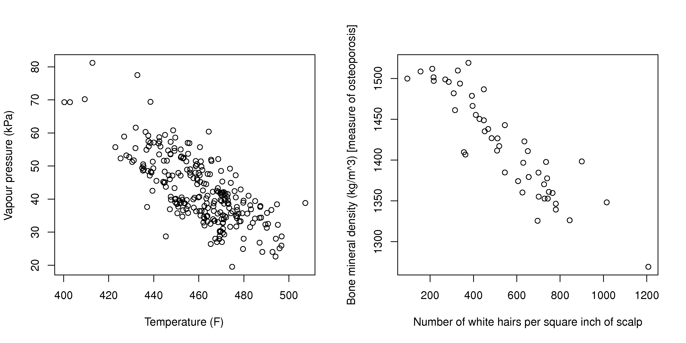

In context
==========

This is the first chapter in the book. **Why**?  Every engineer has heard the phrase *"plot your data"* but seldom are we shown what appropriate plots look like.

In this section we consider quantitative plots -- plots that show numbers.  We cover different plots that will help you effectively learn more from your data. We end with a list of tips for effective data visualization.

Usage examples
==============

.. index::
	pair: usage examples; Data visualization

The material in this section is used when you must learn more about your system from the data:

	* *Co-worker*: Here are the yields from a batch system for the last 3 years (1256 data points), can you help me:

		* understand more about the time-trends in the data?
		* efficiently summarize the batch yields?

	* *Manager*:  how can we effectively summarize the (a) number and (b) types of defects on our 17 aluminium grades for the last 12 months?

	* *Yourself*: we have 24 different measurements against time (5 readings per minute, over 300 minutes) for each batch we produce; how can we visualize these 36,000 data points?

What we will cover
==================

References and readings
=======================

.. index::
	pair: references and readings; Data visualization

#. Edward Tufte, *Envisioning Information*, Graphics Press, 1990. (10th printing in 2005)
#. Edward Tufte, *The Visual Display of Quantitative Information*, Graphics Press, 2001.
#. Edward Tufte, *Visual Explanations: Images and Quantities, Evidence and Narrative*, 2nd edition, Graphics Press, 1997.
#. Stephen Few, *Show Me the Numbers*, Analytics Press, 2004.
#. William Cleveland, *Visualizing Data*, Hobart Press; 1st edition, 1993.
#. William Cleveland, *The Elements of Graphing Data*, Hobart Press; 2nd edition, 1994.
#. Su, `It's Easy to Produce Chartjunk Using Microsoft Excel 2007 but Hard to Make Good Graphs <http://dx.doi.org/10.1016/j.csda.2008.03.007>`_, *Computational Statistics and Data Analysis*, **52** (10), 4594-4601, 2008.

Time-series plots
=================

.. index::
	pair: time-series plots; Data visualization

We start off considering a plot most often seen in engineering applications: the time-series plot.  It is a 2-dimensional plot where one axis, the time-axis, shows graduations at an appropriate scale (seconds, minutes, weeks, quarters, years), while the other axis shows the data.  Usually the time-axis is displayed horizontally, but this is not a requirement: some interesting analysis can be done with time running vertically.  The time-series plot is a univariate plot (shows only one variable).

Many statistical packages will call this a line plot, as it can be used quite generally to display any sort of sequence, whether it is along time, or some other ordering.  They are excellent plots for visualizing long sequences of data.  They tell a visual story along the sequence axis and the human brain is incredibly adept at absorbing this high density of data,  locating patterns in the data such as sinusoids, spikes, outliers, and separating noise from signal.

Here are some tips for effective plots:

1.	The software should have horizontal and vertical zooming ability.  Once zoomed in, there must be tools to scroll up, down, left and right.

2.	Always label the x-axis appropriately with (time) units that make sense.  

	.. _visualization-bad-labels:

	.. image:: images/CPU-temperature_-_from_www_aw_org_on_26_Dec_2009.png
		:width: 750px
		:align: center
		:scale: 50

	This plot found on the internet, shows a computer's CPU temperature with time.  There are several problems with the plot, but the key issue here is the x-axis.  This plot is probably the result of poor default settings in the software; but as you will start to realize, bad defaults are very common in most software packages.  They waste your time when you have to repeatedly modify the charts.  Good software will sensibly label the time-based axis for you.
	

3.	When plotting more than one trajectory (a vector of values) against time, it is helpful if the lines do not cross and jumble too much.  This allows you to clearly see the relationship with other variables.  The use of a second x-axis is helpful, on the left hand side is helpful when plotting two trajectories, but when plotting 3 or more trajectories that are in the same numeric range, rather use several parallel axes as shown later.

	.. _visualization-cluttered-trajectories:

	.. image:: images/3_correlated_variables_-_badly_displayed_in_Numbers.png
		:width: 750px

	As shown here, even using differently coloured lines and/or markers may work in selected instances, but this still leads to a clutter of lines and markers. The chart here shows this principle, created with the default settings from Apple iWork's *Numbers* (2009).

	Using different markers, improving the axis labelling and tightening up the axis ranges, and thinning out the ink improves the chart slightly.  This took about 3 minutes extra in the software, because I had not used the software before and had to find the settings.

	.. figure:: images/3_correlated_variables_-_slightly_better.png
		:width: 750px

	This final example with parallel axes, is greatly improved, but took about 10 minutes to assemble, and would likely take a similar amount of time to format in MATLAB, Excel, Python or other packages.  The results are clearer to interpret: variables "Type A" and "Type B" move up and down together, while variable "Type C" moves in the opposite direction.  Note how the y-axis for "Type C" is rescaled to start from its minimum value, rather than a value of zero.  One should always use "tight" limits on the y-axis

	.. _visualization-cleaned-trajectories:

	.. image:: images/3_correlated_variables_-_better.png
		:width: 750px

4.	Continuing on with the some data, a much improved visualization technique is to use sparklines to represent the sequence of data.

		.. _visualization-sparkline-trajectories:

		.. figure:: images/3-correlated-variables-as-sparklines.png
			:scale: 30

.. index::
	single: sparklines

Sparklines are small graphics that carry a high density of information.  The human eye is easily capable of absorbing about 250 dots (points) per linear inch and 650 points per square inch.  These lines convey the same amount of information as the previous plots, and are easy to consume on handheld devices such as iPhones, cellphones, and tablet computing devices which are common in chemical plants and other engineering facilities.  Read more about them from `this hyperlink <http://www.edwardtufte.com/bboard/q-and-a-fetch-msg?msg_id=0001OR>`_.

Some further tips:

-	When plotting money values over time (e.g. sales of polymer composite over the past 10 years), adjust for inflation effects by dividing through by the consumer price index, or an appropriate factor.  Distortions due to the time value of money can be very misleading as this `example of car sales shows <http://www.duke.edu/~rnau/411infla.htm>`_.   A `Canadian inflation calculator <http://www.bankofcanada.ca/en/rates/inflation_calc.html>`_ is available from the Bank of Canada.

-	If you ever get the feeling "why are we being shown so little", then you must request more data before and after the time period or current sequence shown. A typical example is with stock-price data (see :ref:`example figure of Apple's stock <visualization-apple-stock>`). There are numerous graphical "lies" in magazines and reports where the plot shows a drastic change in trend, however in the context of prior data, that trend is a small aberration.  Again, this brings into play the brain's remarkable power to discern signal from noise, but to do this our brains require context.

	.. _visualization-apple-stock:

	.. figure:: images/AAPL-stock-prices.png
		:width: 750px
		:scale: 80
		:align: center

.. raw:: latex
	
	\clearpage

Bar plots
=========

.. index::
	pair: bar plots; Data visualization

The bar plot is another univariate plot on a two dimensional axis.  The axes are not called x- or y-axes with bar plots, instead, one axis is called the category axis, while the other axis shows the value of each bar.

Some advice related to bar plots:

-	Use a bar plot when there are many categories, and interpretation of the plot does not differ if the category axis is reshuffled.  (It might be easier to interpret the plot with a particular ordering, however the interpretation won't be different with a different ordering).

-	A time-series plot is more appropriate than a bar plot when there is a time based ordering to the categories, because usually you want to imply some sort of trend with time-ordered data.

	.. image:: images/quarterly-profit-barplot-vs-lineplot.png
		:alt:	images/quarterly-profit-barplot.R
		:width: 750px
		:align: center
		:scale: 100

-	Bar plots can be wasteful as each data point is repeated several times:

	#. left edge (line) of each bar
	#. right edge (line) of each bar
	#. the height of the colour in the bar
	#. the number's position (up and down along the y-axis)
        #. the top edge of each bar, just below the number
	#. the number itself

        .. note::

	    Maximize data ink ratio within reason.

	.. math::

		\text{Maximize data ink ratio} &= \frac{\text{total ink for data}}{\text{total ink for graphics}}     \\
		                              &= 1 - \text{proportion of ink that can be erased without loss of data information}

-	Rather use a table for a handful of data points:

    .. image:: images/profit-by-region.png
		:alt:	images/profit-by-region.numbers
		:width: 750px
		:align: center
		:scale: 100

-	Don't use cross-hatching, textures, or unusual shading in the plots: this creates distracting visual vibrations.

	.. image:: images/hatched-barplot.png
		:alt:	images/hatched-barplot.R
		:width: 600px
		:align: center
		:scale: 45

.. COMMENTS
  Stack bar plots are OK, they show breakdowns quite nicely, even though one has to read the accompanying text carefully to make sure the break down is what you think it is.  Never underestimate the audience's intelligence.
  - My preference is to avoid stacked bar plots.  I'm never sure, until I read the text carefully, or the plot annotations, whether the bars represent a cumulative amount or an incremental amount.  Is the blue region showing 25% or 15%?

-	Use horizontal bars if:

	- there is a some ordering to the categories (it is often easier to read these from top-to-bottom), or
	- the labels do not fit side-by-side: don't make the reader have to rotate the page to interpret the plot, rotate the plot for the reader.

-	You can place the labels inside the bars.

-	You should start the non-category axis at zero: the bar's area shows the magnitude.  Starting bars at a non-zero value distorts the meaning.

..
  Exception to starting at zero: todo Few, p 189 (ranges)

Box plots
==========

.. index::
	pair: box plots; Data visualization

Box plots are an efficient summary of one variable (univariate chart), but can also be used effectively to compare like variables that are in the same units of measurements.

The box plot shows the so-called *five-number summary* of a univariate data series: 

- minimum sample value
- 25th `percentile <http://en.wikipedia.org/wiki/Percentile>`_ (1st `quartile <http://en.wikipedia.org/wiki/Quartile>`_)
- 50th percentile (median)
- 75th percentile (3rd quartile)
- maximum sample value

The 25th percentile is the value below which 25 percent of the observations in the sample are found. The distance from the 3rd to the 1st quartile is also known as the interquartile range (IQR) and represents the data's spread, similar to the standard deviation.

The following data are thickness measurements of 2-by-6 boards, taken at 6 locations around the edge.  Here is a sample of the measurements, and a summary of the first hundred boards (created in ``R``):

.. code-block:: text

	    Pos1 Pos2 Pos3 Pos4 Pos5 Pos6
	1   1761 1739 1758 1677 1684 1692
	2   1801 1688 1753 1741 1692 1675
	3   1697 1682 1663 1671 1685 1651
	4   1679 1712 1672 1703 1683 1674
	5   1699 1688 1699 1678 1688 1705
        ....
	96  1717 1708 1645 1690 1568 1688
	97  1661 1660 1668 1691 1678 1692
	98  1706 1665 1696 1671 1631 1640
	99  1689 1678 1677 1788 1720 1735
	100 1751 1736 1752 1692 1670 1671

  > summary(boards[1:100, 2:7])
         Pos1           Pos2           Pos3           Pos4           Pos5           Pos6
    Min.   :1524   Min.   :1603   Min.   :1594   Min.   :1452   Min.   :1568   Min.   :1503
    1st Qu.:1671   1st Qu.:1657   1st Qu.:1654   1st Qu.:1667   1st Qu.:1662   1st Qu.:1652
    Median :1680   Median :1674   Median :1672   Median :1678   Median :1673   Median :1671
    Mean   :1687   Mean   :1677   Mean   :1677   Mean   :1679   Mean   :1674   Mean   :1672
    3rd Qu.:1705   3rd Qu.:1688   3rd Qu.:1696   3rd Qu.:1693   3rd Qu.:1685   3rd Qu.:1695
    Max.   :1822   Max.   :1762   Max.   :1763   Max.   :1788   Max.   :1741   Max.   :1765

The following boxplot is a graphical summary of these numbers.

.. _visualization-boxplot-example:

.. image:: images/boxplot-for-two-by-six-100-boards.png
	:align: left
	:width: 700px
	:scale: 55

Variations for the box plot are possible:

- use the mean instead of the median
- outliers shown as dots, where an outlier is most commonly defined as any point 1.5 IQR distance units above and below the median (the upper and lower hinges).
- using the 2% and 95% percentile rather than the upper and lower hinge values.

Relational graphs: scatter plots
================================

.. index::
	pair: scatter plots; Data visualization
	
This is a plot many people are comfortable with using.  It helps one understand the relationship between two variables - a bivariate plot - as opposed to the previous charts that are univariate.  A scatter plot is a collection of points shown inside a box formed by 2 axes, at 90 degrees to each other.  The marker's position is located at the intersection of the values shown on the horizontal (x) axis and vertical (y) axis.

The unspoken intention of a scatter plot is usually to ask the reader to draw a causal relationship between the two variables.  However, not all scatter plots actually show causal phenomenon.

Strive for graphical excellence by:

- making each axis as tight as possible
- avoid heavy grid lines
- use the least amount of ink
- do not distort the axes

There is an unfounded fear that others won't understand your 2D scatter plot.  Tufte (*Visual Display of Quantitative Information*, p 83) shows that there are no scatter plots in a sample (1974 to 1980) of US, German and British dailies, despite studies showing that 12 year olds can interpret such plots.  (Japanese newspapers frequently use them).

You will see this in industrial settings as well.  Next time you go into the control room, try finding any scatter plots.  The audience is not to blame: it is the producers of these charts that assume the audience is incapable of interpreting these plots.

.. note::

	Assume that if you can understand the plot, so will your audience.

Further improvements can be made to your scatter plots:

-	Extend the frames only as far as your data

	.. image:: images/scatterplot-figures-with-regression-lines.png
		:width: 750px
		:scale: 75

-	One can add box plots and histograms to the side of the axes to aide interpretation

	.. image:: images/scatterplot-with-histograms-updated.png
		:width: 750px
		:scale: 42

- Add a third variable to the plot by adjusting the marker size and add a fourth variable with the use of colour:

    .. _reference-to-use-of-colour:

	.. image:: images/scatterplot-with-2-extra-dimensions.png
		:scale: 80

    This example, from `http://gapminder.org <http://graphs.gapminder.org/world/#$majorMode=chart$is;shi=t;ly=2003;lb=f;il=t;fs=11;al=30;stl=t;st=t;nsl=t;se=t$wst;tts=C$ts;sp=6;ti=2007$zpv;v=0$inc_x;mmid=XCOORDS;iid=phAwcNAVuyj1jiMAkmq1iMg;by=ind$inc_y;mmid=YCOORDS;iid=phAwcNAVuyj0TAlJeCEzcGQ;by=ind$inc_s;uniValue=30;iid=phAwcNAVuyj0XOoBL_n5tAQ;by=ind$inc_c;uniValue=255;gid=CATID0;iid=phAwcNAVuyj2tPLxKvvnNPA;by=ind$map_x;scale=log;dataMin=194;dataMax=96846$map_y;scale=log;dataMin=0.855;dataMax=8.7$map_s;sma=49;smi=1.85$map_c;scale=lin$cd;bd=0$inds=>`_, shows data as of 2007 for income per person against fertility.  The size of each data point is proportional to the country's population and the marker colour shows life expectancy at birth (years).  The GapMinder website allows you to "play" the graph over time, effectively adding a 5th dimension to the 2D plot.  Use the hyperlink above to see how richer countries move towards lower fertility and higher income over time.

Tables 
======

.. index::
	pair: tables; Data visualization

The table is an efficient format for comparative data analysis on categorical objects.  Usually the items being compared are placed in a column, while the categorical objects are in the rows.   The quantitative value is then placed in the intersection of the row and column: called the *cell*.  The following examples demonstrate this.

*	Compare monthly payments for buying or leasing various cars (categories).  The first two columns are being compared; the other columns contain additional, secondary information.

	.. figure:: images/table-car-payments.png
		:alt:	images/table-examples.numbers
		:align: center
		:scale: 75

*	Compare defect types (number of defects) for different product grades (categories):

	.. figure:: images/table-defect-counts.png
		:alt:	images/table-examples.numbers
		:align: center
		:scale: 50

	This particular table raises more questions:

	-	Which defects cost us the most money?
	-	Which defects occur most frequently?  The table does not contain any information about production rate.  For example, if there are 1850 lots of grade A4636 (first row) produced, then defect A occurs at a rate of 37/1850 = 1/50.  And if 250 lots of grade A2610 (last row) were produced, then again, defect A occurs at a rate of 1/50.  Redrawing the table on a production rate basis would be useful if we are making changes to the process and want to target the most problematic defect.
	-	If we are comparing a type of defect over different grades, then we are now comparing down the table, instead of across the table.  In this case, the fraction of defects for each grade would be a more useful quantity to display.
	-	If we are comparing defects within a grade, then we are comparing across the table.  Here again, the fraction of each defect type, weighted according to the cost of that defect, would be more appropriate.

Three common pitfalls to avoid:

#.	Using pie charts when tables will do

	Pie charts are tempting when we want to graphically breakdown a quantity into components.  I have used them erroneously myself (here is an example on a website that I helped with: http://macc.mcmaster.ca/graduate-students/where-do-they-work).  We won't go into details here, but I strongly suggest you read the convincing evidence of Stephen Few in: `"Save the pies for dessert" <http://www.perceptualedge.com/articles/08-21-07.pdf>`_,   The key problem is that the human eye cannot adequately decode angles, however we have no problem with linear data.

#.	Arbitrary ordering along the first column; usually alphabetically or in time order

	Listing the car types alphabetically is trivial: rather list them by some other 3rd criterion of interest: perhaps minimum down payment required, or typical lease duration, or total amount of interest paid on the loan.  That way you get some extra context to the table for free.

#.	Using excessive grid lines

	Tabular data should avoid vertical grid lines, except when the columns are so close that mistakes will be made.  The human eye will use the visual white space between the numbers to create its own columns.

	.. image:: images/table-grid-comparison.png
		:scale: 65

To wrap up this section is a demonstration of tabular data in a different format, based on an idea of Tufte in *The Visual Display of Quantitative Information*, page 158.  Here we compare the corrosion resistance and roughness of a steel surface for two different types of coatings, A and B. 

A layout that you expect to see in a standard engineering report:

	+----------+-----------+-----------+-----------+-----------+
	| Product  | Corrosion | resistance| Surface   |roughness  |
	+----------+-----------+-----------+-----------+-----------+
	|          | Coating A |Coating B  | Coating A | Coating B |
	+==========+===========+===========+===========+===========+
	| K135     | 0.30      | 0.22      | 30        |   42      |
	+----------+-----------+-----------+-----------+-----------+
	| K136     | 0.45      | 0.39      | 86        |   31      |
	+----------+-----------+-----------+-----------+-----------+
	| P271     | 0.22      | 0.24      | 24        |   73      |
	+----------+-----------+-----------+-----------+-----------+
	| P275     | 0.40      | 0.44      | 74        |   52      |
	+----------+-----------+-----------+-----------+-----------+
	| S561     | 0.56      | 0.36      | 70        |   75      |
	+----------+-----------+-----------+-----------+-----------+
	| S567     | 0.76      | 0.51      | 63        |   70      |
	+----------+-----------+-----------+-----------+-----------+

And the layout advocated by Tufte:

	.. image:: images/tables-recast-as-plots-both.png
	   :width: 750px
	   :scale: 75

Note how the slopes carry the information about the effect of changing the coating type.  And the rearranged row ordering shows the changes as well. This idea is effective for 2 treatments, but could be extended to 3 or 4 treatments by adding extra "columns".

Topics of aesthetics and style
==============================

We won't cover these topics, however Tufte's books contain remarkable examples that discuss effective use of colour for good contrast, varying line widths, and graph layout (use more horizontal than vertical - an aspect ratio of about 1.4 to 2.0; and flow the graphics into the location in the text where discussed).

Data frames (axes)
===================

Frames are the basic containers that surround the data and give context to our numbers.  Here are some tips:

#.	Use round numbers
#.	Generally tighten the axes as much as possible, except ...
#.	When showing comparison plots: then all axes must have the same minima and maxima (see the exercise regarding the :ref:`Economist figure <economist-question>`).

Colour
======

.. index::
	pair: colour; Data visualization
	
Colour is very effective in all graphical charts, however you must bear in mind that your readers might be colour-blind, or the document might be read from a grayscale print out.  

Note also that a standard colour progression does *not* exist.  We often see dark blues and purples representing low numbers and reds the higher numbers, with greens, yellows, and orange in between.  Also, there are several such colour schemes - there isn't a universal standard.  The only safest colour progression is the grayscale axis, ranging from blacks to white at each extreme: this satisfies both colour-blind readers and users of your grayscale printed output.

See the :ref:`section on scatter plots <reference-to-use-of-colour>` for an example of the effective use of colour.

General summary: revealing complex data graphically
======================================================

One cannot provide generic advice that applies in every instance.  These tips are useful though in most cases:

-	If the question you want answered is to understand causality, then show causality (the most effective way is with bivariate scatter plots).  If trying to answer a question with alternatives: show comparisons (with tiles of plots, or a simple table).

-	Words and graphics belong together: add labels to plots for outliers and explain interesting points; add equations and even small summary tables on top of your plots.  Remember a graph should be like a paragraph of text, not necessarily just a graphical display of numbers which are discussed later on.

-	Avoid obscure coding on the graph: don't label points as "A", "B", "C", .... and then put a legend: "A: grade TK133", "B: grade RT231", "C: grade TK134".  Just put the labels directly on the plot.

-	Do not assume your audience is ignorant and won't understand a complex plot.  Conversely, don't try to enliven a plot with decorations and unnecessary graphics (flip through a copy of almost any weekly news magazine to examples of this sort of embellishment).  As Tufte mentions more than once in his books: "*If the statistics are boring, then you've got the wrong numbers.*".  The graph should stand on its own.

-	When the graphics involve money and time, make sure you adjust the money for inflation.

-	Maximize the data-ink ratio = (ink for data) / (total ink for graphics).  Maximizing this ratio, within reason, means you should (a) eliminate non-data ink and (b) erase redundant data-ink.

-	Maximize data density: humans can interpret data displays of 250 data points per linear inch, and 625 data points per square inch.

Exercises
=========

.. index::
	pair: exercises; Data visualization

.. question::

	The data shown here are the number of visits to a university website for a particular statistics course.  There are 90 students in the, however the site is also publicly available.

	.. figure:: images/course-website-visits.png
		:align: center
		:width: 750px

	#.	What are the names (type) of the 2 plots shown?
	#.	List any 2 interesting features in these data.

.. answer::
	:fullinclude: no 
	:short: Time-series and sparkline.

	#.	The plots are a time-series plot and a sparkline.  The sparkline shows exactly the same data, just a more compact form (without the labelling on the axes).

	#.	Features shown in the data are:

		-	A noticeable weekly cycle; probably assignments are due the next day!
		-	A sustained, high level of traffic in the first week February - maybe a midterm test.
		-	Some days have more than 90 visits, indicating that students visit the site more than once per day, or due to external visitors to the site.

.. question::

	.. _economist-question:

	The following graphics were shown in the print issue of *The Economist* in the 28 November 2009 issue, page 85. The article attempts to argue that there are enough similarities between Japan's stagnant economic experience in the 1990's (known as "Japan's Lost Decade"), and the current experience in the "rich world" western countries to give their policymakers pause for concern.  You can `read the full article here <http://www.economist.com/node/14973163?story_id=14973163>`_.  What problems do you notice with the graphics?

	.. image:: images/economist-figure-story-id-14973163.png
		:align: center
		:scale: 40

.. answer::
	:fullinclude: no 

	There are several problems with this graphical comparison, but the main concerns are with showing time trends as bar plots, and the alignment of the time trends.

	- The purpose of the plot is to show the similarities between Japan in the 1990's to the current trends (2000's) in Britain and USA.  The data from 2000 onwards for Japan is therefore irrelevant in this case.
	- The data are time-based: a bar-plot is a poor choice to show time-based trends.
	- Notice the symmetry above and below the zero line: in colours: "light blue + grey = dark blue", i.e. "General government balance + Net capital inflow = Private financial balance".  Given this constraint, only 2 of the 3 variables are required.  As I'm not an economics expert, I have no idea which 2 of the 3 would be most relevant.
	- The data for Japan from the 1990's should be shown on the same plot for USA and Britain for the 2000's, since that was the purpose - to show a comparison between Japan's experience and the USA/Britain experience. One way to do this: plot three lines on a time-series chart: one for each of Japan, Britain and USA for "General government balance".  The have a second plot, similar to the first, showing the "Private financial balance".

	Minor problems are:

	- The colour scheme is poor: four different shades of blue are used (two background shades, and two of the time-based parameters)
	- The use of stacked bar plots is almost always problematic: the user is never sure if the bars are cumulative or additive, unless they know the subject matter or read the accompanying text.

.. question::

	This figure is a screen shot from a `Toronto Star article <http://www.yourhome.ca/homes/realestate/article/742160--mortgage-rate-roulette>`_ about mortgage payments as a function of the interest rate.  Redraw the same information in a more suitable form.

	.. image:: images/Toronto-Star-Mortgage-Rates.png
		:align: center
		:scale: 80

.. answer::
	:fullinclude: no 
	
	The data from this article are needlessly embellished with a picture of a house, a $20,000 bill and a stake in the ground.

	A simple annotated table will show the data well enough.  A bar chart, horizontally or vertically aligned is not suitable.

	.. image:: images/mortgage-repayment-table.png
		:align: center
		:scale: 60

	Some people have suggested using a scatter plot - I never thought of that, but it works.  It shows a straight line relationship between interest rate and the monthly payment.  I suppose the advantage of that plot is that you can see (a) the relationship is linear, which is should be, and (b) you can visually *interpolate* the monthly payment given any interest rate between 2 and 5%.

	A key point though: the mortgage amount and the amortization rate must be shown with the plot or table.  The cost of the house and the downpayment are actually irrelevant.  You are paying interest on the mortgage amount, where :math:`\text{mortgage amount} = \text{cost of the house} + \text{mortgage insurance} - \text{downpayment}`.  The table or the plot will change if either of those two variables change.  Your monthly payment is higher for shorter amortization periods, and for larger mortgage amounts.

.. question::

	Using the `Website traffic data set <http://datasets.connectmv.com/info/website-traffic>`_

	#.	Create a chart that shows the variation in website traffic for each day of the week.
	#.	Use the same data set to describe any time-based trends that are apparent.

.. answer::
	:fullinclude: no 

	#.	A boxplot is an effective way to summarize and compare the data for each day of the week.

		.. code-block:: s

		    web <- read.csv('http://datasets.connectmv.com/file/website-traffic.csv')

		    # Re-order the factors in this order
		    day.names <- c("Saturday", "Sunday", "Monday", "Tuesday", "Wednesday","Thursday", "Friday" )
		    days <- factor(web$DayOfWeek, level=day.names)
		    boxplot(web$Visits ~ days)

		.. figure:: images/website-traffic-boxplot.png
			:width: 500px
			:scale: 60

		The boxplot shows:

			- Much less website traffic on Saturdays and Sundays, especially Sunday which has less spread than Saturday.
			- Visits increase during the weekday, peaking on Wednesday and then dropping down by Friday.
			- This is a website of academic interest, so these trends are expected.

	#.	A time-series plot of the data shows increased visits in September and October, and declining visits in November and December.  This coincides with the phases of the academic term.  Some people use a plot of the total number of visits within each month, which shows this effect in a nice way.

		.. image:: images/website-traffic-sequence-and-timeseries.png
			:width: 750px
			:align: center

	The best way to draw the time-series plot is to use proper time-based labelling on the x-axis, but we won't cover that topic here.  If you are interested, read up about the ``xts`` package (`see the R tutorial <http://connectmv.com/tutorials/r-tutorial>`_) and it's plot command.  See how it is used in the code below::

		web <- read.csv('http://datasets.connectmv.com/file/website-traffic.csv')

		layout(matrix(c(1,2), 1, 2))
		plot(web$Visits, type="o")

		# A better plot using the xts library
		library(xts)
		date.order <- as.Date(web$MonthDay, format=" %B %d")
		web.visits <- xts(web$Visits, order.by=date.order)
		plot(web.visits, major.format="%b")

.. todo:: another scatter plot example
.. todo:: spectral data example
.. todo:: batch data example

.. question::

	.. image:: images/kidnappings-question.png
		:scale: 30

	#.	What type of plot is shown here?
	#.	Describe the phenomenon displayed.
	#.	Which plot type asks you to draw a cause and effect relationship?
	#.	Use rough values from the given plot to construct an approximate example of the plot you proposed in part 3.
	#.	What advantage is there to the plot given here, over the type in your answer to part 3.
	

..	question:: 

	*Enrichment*:

	*	Watch `this 20 minute video <http://www.ted.com/index.php/talks/hans_rosling_shows_the_best_stats_you_ve_ever_seen.html>`_ that shows how a 2-dimensional plot comes alive to show 5 dimensions of data.  What are the 5 dimensions?
	*	A condensed version from this, `4 minute YouTube video <http://www.youtube.com/v/jbkSRLYSojo>`_ shows Hans Rosling giving a new perspective on the same data.  This `Economist article <http://www.economist.com/node/17663585>`_ has some interesting background on Dr. Rosling, as does this page, `giving a selection of his work <http://www.economist.com/node/21013330>`_.
