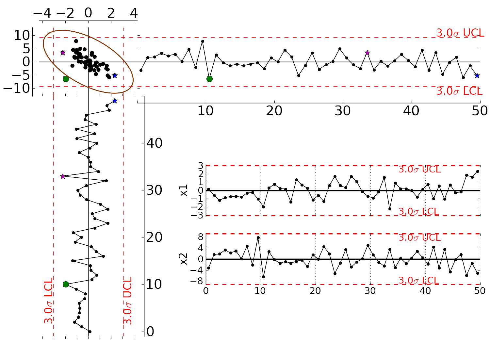
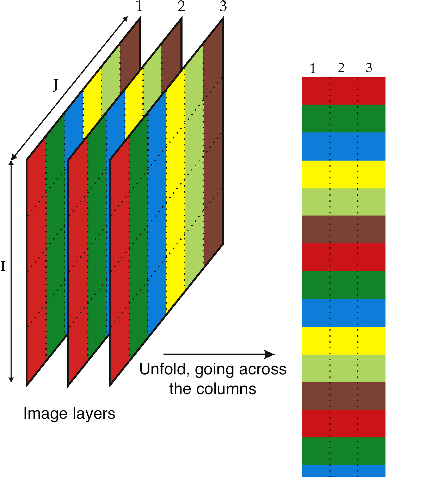

References and readings
========================

.. index::
	pair: references and readings; Applications of latent variable models
	
* **Process monitoring**: John MacGregor and Theodora Kourti "`Statistical Process Control of Multivariate Processes <http://dx.doi.org/10.1016/0967-0661(95)00014-L>`_", *Control Engineering Practice*, **3**, p 403-414, 1995.

* **Process monitoring**: J.V. Kresta, T.E. Marlin, and J.F. MacGregor "`Multivariate Statistical Monitoring of Process Operating Performance <http://dx.doi.org/10.1002/cjce.5450690105>`_", *Canadian Journal of Chemical Engineering*, **69**, 35-47, 1991.

* **Contribution plots**: P Miller, RE Swanson, CE Heckler, "Contribution Plots: a Missing Link in Multivariate Quality Control, *Applied Mathematics and Computer Science*, *8* (4), 775-792, 1998. (*hard to obtain, but available on request, by email to papers@connectmv.com*)

* **Soft sensors**: J.V. Kresta, T.E. Marlin, and J.F. MacGregor, "`Development of Inferential Process Models Using PLS <http://dx.doi.org/10.1016/0098-1354(93)E0006-U>`_". *Computers and Chemical Engineering*, **18**, 597-611, 1994.

* **Industrial applications**: Ivan Miletic, Shannon Quinn, Michael Dudzic, Vit Vaculik and Marc Champagne, "`An Industrial Perspective on Implementing On-Line Applications of Multivariate Statistics <http://dx.doi.org/10.1016/j.jprocont.2004.02.001>`_", *Journal of Process Control*,  **14**, p. 821-836, 2004.

* **Batch modelling and monitoring**: S. Wold, N. Kettaneh-Wold, J.F. MacGregor, K.G. Dunn, "`Batch Process Modeling and MSPC <http://dx.doi.org/10.1016/B978-044452701-1.00108-3>`_". *Comprehensive Chemometrics*, **2**, 163-197, 2009.  (*available from the author on request, by email to papers@connectmv.com*)

* **Image analysis**: M. Bharati, and J.F. MacGregor "`Multivariate Image Analysis for Real Time Process Monitoring and Control <http://dx.doi.org/10.1021/ie980334l>`_", *Industrial and Engineering Chemistry Research*, **37**, 4715-4724, 1998

.. * Many other applications of latent variables are described here: http://macc.mcmaster.ca/research/publications

Improved process understanding
==========================================

.. TODO: another example: http://dx.doi.org/10.1016/S0169-7439(02)00088-6

:ref:`Interpreting the loadings plot <LVM_interpreting_loadings>` from a model is well worth the time spent.  At the very least, one will confirm what you already know about the process, but sometimes there are unexpected insights that are revealed. Guide your interpretation of the loadings plot with contributions in the scores, and cross-referencing with the raw data, to verify your interpretation.

There are :math:`A` loadings and score plots. In many cases this is far fewer than the :math:`K` number of original variables.  Furthermore, these :math:`A` variables have a much higher signal and lower noise than the original data.  They can also be calculated if there are missing data present in the original variables.

In the example shown here the company was interested in how their product performed against that of their competitor.  Six variables called A to F were measured on all the product samples, (codes are used, because the actual variables measured are proprietary). The loadings for these 6 variables are labelled below, while the remaining points are the scores. The scores have been scaled and superimposed on the loadings plot, to create what is called a :index:`biplot`. The square, green points were the competitor's product, while the smaller purple squares were their own product.  

.. figure:: ../figures/examples/competitor-product/competitor-product.png
	:alt:	process-understanding.key
	:scale: 80
	:width: 750px
	:align: center
	
.. This figure was from an earlier project on plastic pellets (around 2006?).
.. The keynote presentation was used to disguise the original variable names.

From this single figure the company learned that:

	*	The quality characteristics of this material is not six-dimensional; it is two-dimensional.  This means that based on the data used to create this model, there is no apparent way to independently manipulate the 6 quality variables. Products produced in the past land up on a 2-dimensional latent variable plane, rather than a 6-dimensional space.

	*	Variables D, E and F in particular are very highly correlated, while variable C is also somewhat correlated with them. Variable A and C are negatively correlated, as are variables B and C.  Variables A and B are positively correlated with each other.
	
	*	This company' competitor was able to manufacture the product with much lower variability than they were: there is greater spread in their own product, while the competitor's product is tightly clustered.
	
	*	The competitors product is characterized as having lower values of C, D, E, and F, while the values of A and B are around the average.
	
	*	The company had produced product similar to their competitor's only very infrequently, but since their product is spread around the competitor's, it indicates that they could manufacture product of similar characteristics to their competitor. They could go query the score values close those of those of the competitors and using their company records, locate the machine and other process settings in use at that time.
	
		However, it might not just be *how* they operate the process, but also which raw materials and their consistency, and the control of outside disturbances on the process.  These all factor into the final product's variability.

It it is not shown here, but the competitor's product points are close to the model plane (low SPE values), so this comparison is valid.  This analysis was tremendously insightful, and easier to complete on this single plot, rather than using plots of the original variables.

.. _LVM_troubleshooting:

Troubleshooting process problems
==========================================

We already saw a troubleshooting example in the section on :ref:`interpreting scores <LVM_interpreting_scores>`.  In general, troubleshooting with latent variable methods uses this approach:

#.	Collect data from all relevant parts of the process: do not exclude variables that you think might be unimportant; often the problems are due to unexpected sources.  Include information on operators, weather, equipment age (e.g. days since pump replacement), raw material properties being processed at that time, raw material supplier (indicator variable).  Because the PCA model disregards unimportant or noisy variables, these can later be pruned out, but they should be kept in for the initial analysis.  (Note: this does not mean the uninformative variables are not important - they might only be uninformative during the period of data under observation).

#.	Structure the data so that the majority of the data is from normal, common-cause operation. The reason is that the PCA model plane should be oriented in the directions of normal operation.  The rest of the |X| matrix should be from when the problem occurs and develops.  

	.. figure:: ../figures/concepts/troubleshooting/troubleshooting-a-process.png
		:alt:	../figures/concepts/troubleshooting/troubleshooting-a-process.svg
		:scale: 45
		:width: 500px
		:align: center	

#.	Given the wealth of data present on many processes these days, it is helpful to prune the |X| matrix so that it is only several hundred rows in length.  Simply subsample, or using averages of time; e.g. hourly averages.  Later we can come back and look at a higher resolution.  Even as few as 50 rows can often work well.

#.	Build the PCA model.  You should observe the abnormal operation appearing as outliers in the score plots and SPE plots.  If not, use colours or different markers to highlight the regions of poor operation in the scores: they might be clustered in a region of the score plot, but not appear as obvious outliers.

#.	Interrogate and think about the model.  Use the loadings plots to understand the general trends between the variables.  Use contribution plots to learn why clusters of observations are different from others.  Use contribution plots to isolate the variables related to large SPE values.

#.	It should be clear that this is all iterative work; the engineer has to be using her/his brain to formulate hypotheses, and then verify them in the data.  The latent variable models help to reduce the size of the problem down, but they do not remove the requirement to think about the data and interpret the results.

.. SHOW VARIOUS EXAMPLES HERE; even made up ones.

Here is an example where the yield of a company's product was declining. They suspected that their raw material was changing in some way, since no major changes had occurred on their process.   They measured 6 characteristic values on each lot (batch) of raw materials: 3 of them were a size measurement on the plastic pellets, while the other 3 were the outputs from thermogravimetric analysis (TGA), differential scanning calorimetry (DSC) and thermomechanical analysis (TMA), measured in a laboratory.  Also provided was an indication of the yield: "Adequate" or "Poor".  There were 24 samples in total, 17 batches of adequate yield and the rest the had poor yield.  

The score plot (left) and loadings plot (right) help isolate potential reasons for the reduced yield.  Batches with reduced yield have high, positive :math:`t_2` values and low, negative :math:`t_1` values.  What factors lead to batches having score values with this combination of :math:`t_1` and :math:`t_2`?  It would take batches with a combination of low values of TGA and TMA, and/or above average size5, size10 and size15 levels, and/or high DSC values to get these sort of score values.  These would be the *generally expected* trends, based on an interpretation of the scores and loadings.

.. image:: ../figures/examples/raw-material-outcome/process-troubleshooting.png
	:alt:	../figures/examples/raw-material-outcome/process-troubleshooting.R
	:scale: 100
	:width: 750px
	:align: center

We can investigate *specific* batches and look at the contribution of each variable to the score values.  Let's look at the contributions for batch 8 for both the :math:`t_1` and :math:`t_2` scores.

.. math::
	
	\begin{array}{rcccccccccccc}
	         t_{8,a=1} &=& x_{\text{s5}} \,\, p_{\text{s5},1} &+& x_{\text{s10}} \,\, p_{\text{s10},1} &+& x_{\text{s15}} \,\, p_{\text{s15},1} &+& x_{\text{TGA}} \,\, p_{\text{TGA},1} &+& x_{\text{DSC}} \,\, p_{\text{DSC},1} &+& x_{\text{TMA}} \,\, p_{\text{TMA},1}\\
	         t_{8,a=1} &=& -0.85 &-& 0.74 &-& 0.62 &+& 0.27 &+& 0.12 &+& 0.10 \\
	         t_{8,a=2} &=& x_{\text{s5}} \,\, p_{\text{s5},2} &+& x_{\text{s10}} \,\, p_{\text{s10},2} &+& x_{\text{s15}} \,\, p_{\text{s15},2} &+& x_{\text{TGA}} \,\, p_{\text{TGA},2} &+& x_{\text{DSC}} \,\, p_{\text{DSC},2} &+& x_{\text{TMA}} \,\, p_{\text{TMA},2} \\
	         t_{8,a=2} &=& 0.39 &+& 0.44 &+& 0.14 &+& 0.57 &+& 0.37 &+& 0.24
	\end{array}

Batch 8 is at its location in the score plot due to the low values of the 3 size variables (they have strong negative contributions to :math:`t_1`, and strong positive contributions to :math:`t_2`); and also because of its very large DSC value (the 0.57 contribution in :math:`t_2`).

Batch 22 on the other hand had very low values of TGA and TMA, even though its size values were below average. Let's take a look at the :math:`t_2` value for batch 22 to see where we get this interpretation:

.. math::
	
	
	\begin{array}{rcccccccccccc}
		t_{22,a=2} &=& x_{\text{s5}} \,\, p_{\text{s5},2} &+& x_{\text{s10}} \,\, p_{\text{s10},2} &+& x_{\text{s15}} \,\, p_{\text{s15},2} &+& x_{\text{TGA}} \,\, p_{\text{TGA},2} &+& x_{\text{DSC}} \,\, p_{\text{DSC},2} &+& x_{\text{TMA}} \,\, p_{\text{TMA},2} \\
		t_{22,a=2} &=& -0.29 &-& 0.17 &-& 0.08 &+& 0.84 &-&0.05 &+& 1.10 
	\end{array}

This illustrates that the actual contribution values are a more precise diagnostic tool that just interpreting the loadings.

Optimizing: new operating point and/or new product development
====================================================================================

.. Mention latent variable control of processes (MacGregor et al paper 2005 has a section on this)

This application area is rapidly growing in importance. Fortunately it is fairly straightforward to get an impression of how powerful this tool is.  Let's return back to the :ref:`food texture example considered previously <LVM_food_texture_example>`, where data from a biscuit/pastry product was considered.  These 5 measurements were used:

	#.	Percentage oil in the pastry
	#.	The product's density (the higher the number, the more dense the product)
	#.	A crispiness measurement, on a scale from 7 to 15, with 15 being more crispy.
	#.	The product's fracturability: the angle, in degrees, through which the pasty can be slowly bent before it fractures.
	#.	Hardness: a sharp point is used to measure the amount of force required before breakage occurs.

The scores and loadings plot are repeated here again:

.. figure:: ../figures/examples/food-texture/pca-on-food-texture-scores-and-loadings.png
	:alt:	../figures/examples/food-texture//pca-on-food-texture-data.R
	:scale: 80
	:width: 750px
	:align: center
		
Process optimization follows the principle that certain regions of operation are more desirable than others.  For example, if all the pastry batches produced on the score plot are of acceptable quality, there might be regions in the plot which are more economically profitable than others. 

For example, pastries produced in the lower right quadrant of the score plot (high values of :math:`t_1` and low values of :math:`t_2`), require more oil, but might require a lower cooking time, due to the decreased product density.  Economically, the additional oil cost is offset by the lower energy costs.  All other things being equal, we can optimize the process by moving production conditions so that we consistently produce pastries in this region of the score plot.  We could cross-reference the machine settings for the days when batches 17, 49, 36, 37 and 30 were produced and ensure we always operate at those conditions.

New product development follows a similar line of thought, but uses more of a "what-if" scenario.  If market research or customer requests show that a pastry product with lower oil, but still with high crispiness is required, we can initially guess from the loadings plot that this is not possible: oil percentage and crispiness are positively correlated, not negatively correlated.

But if our manager asks, can we readily produce a pastry with the 5 variables set at [Oil=14%, Density=2600, Crispy=14, Fracture can be any value, Hardness=100].  We can treat this as a new observation, and following the steps described in the earlier :ref:`section on using a PCA model <LVM-using-a-PCA-model>`, we will find that :math:`\mathbf{e} = [2.50, 1.57, -1.10,  -0.18,  0.67]`, and the SPE value is 10.4. This is well above the 95% limit of SPE, indicating that such a pastry is not consistent with how we have run our process in the past.  So there isn't a quick solution.  

Fortunately, there are systematic tools to move on from this step, but they are beyond the level of this introductory material.  They involve the inversion and optimization of latent variable models.  This paper is a good starting point if you are interested in more information: Christiane Jaeckle and John MacGregor, "`Product design through multivariate statistical analysis of process data <http://dx.doi.org/10.1002/aic.690440509>`_". *AIChE Journal*, **44**, 1105-1118, 1998. 

The general principle in model inversion problems is to manipulate the any degrees of freedom in the process (variables that can be manipulated in a process control sense) to obtain a product as close as possible to the required specification, but with low SPE in the model.  A PLS model built with these manipulated variables, and other process measurements in |X|, and collecting the required product specifications in |Y| can be used for these model inversion problems.

.. _LVM_inferential_sensors:

Predictive modelling (inferential sensors)
====================================================================================

This section will be expanded soon, but we give an outline here of what inferential sensors are, and how they are built.  These sensors also go by the names of software sensors or just soft sensors.

The intention of an inferential sensor is to infer a hard-to-measure property, usually a lab measurement or an expensive measurement, using a combination of process data and software-implemented algorithms.  

Consider a distillation column where various automatic measurements are used to predict the vapour pressure.  The actual vapour pressure is a lab measurement, usually taken 3 or 4 times per week, and takes several hours to complete.  The soft sensor can predict the lab value from the real-time process measurements with sufficient accuracy.  This is a common soft sensor on distillation columns.  The lab values are used to build (train) the software sensor and to update in periodically.

Other interesting examples use camera images to predict hard-to-measure values.  In the paper by `Honglu Yu, John MacGregor, Gabe Haarsma and Wilfred Bourg <http://dx.doi.org/10.1021/ie020941f>`_ (*Ind. Eng. Chem. Res.*, **42**, 3036–3044, 2003), the authors describe how machine vision is used to predict, in real-time, the seasoning of various snack-food products.  This sensors uses the colour information of the snacks to infer the amount of seasoning dispensed onto them.  The dispenser is controlled via a feedback loop to ensure the seasoning is at target.

Once validated, a soft sensor can also reduce costs of a process by allowing for rapid feedback control of the inferred property, so that less off-specification product is produced.  They also often have the side-effect that reduced lab sampling is required; this saves on manpower costs.

Soft sensors using latent variables will almost always be PLS models. Once the model has been built, it can be applied in real-time. The |T2| and SPE value for each new observation is checked for consistency with the model before a prediction is made.  Contribution plots are used to diagnose unusual observations.  

It is an indication that the predictive models need to be updated if the SPE and/or |T2| values are consistently above the limits.  This is a real advantage over using an MLR-based model, which has no such consistency checks.

.. _LVM_monitoring:

Process monitoring using latent variable methods
====================================================================================

Any variable can be monitored using control charts, as we saw in the earlier section on :ref:`process monitoring <SECTION-process-monitoring>`.  The main purpose of these charts is to rapidly distinguish between two types of operation: in-control and out-of-control.  We also aim to have a minimum number of false alarms (type I error: we raise an alarm when one isn't necessary) and the lowest number of false negatives possible (type II error, when an alarm should be raised, but we don't pick up the problem with the chart). We used Shewhart charts, CUSUM and EWMA charts to achieve these goals.

Consider the case of two variables, called :math:`x_1` and :math:`x_2`, shown on the right, on the two horizontal axes. These could be time-oriented data, or just measurements from various sequential batches of material. The main point is that each variable's :math:`3\sigma` Shewhart control limits indicate that all observations are within control.  It may not be apparent, but these two variables are negatively correlated with each other: as :math:`x_1` increases, the :math:`x_2` value decreases.

Rearranging the axes at 90 degrees to each other, and plotting the joint scatter plot of the two variables in the upper left corner reveals the negative correlation, if you didn't notice it initially.  Ignore the ellipse for now.  It is clear that sample 10 (green closed dot, if these notes are printed in colour) is very different from the other samples.  It is not an outlier from the perspective of :math:`x_1`, nor of :math:`x_2`, but jointly it is an outlier.  This particular batch of materials would result in very different process operation and final product quality to the other samples.  Yet a producer using separate control charts for :math:`x_1` and :math:`x_2` would not pick up this problem.

While using univariate control charts is *necessary* to pick up problems, univariate charts are not *sufficient* to pick up all quality problems if the variables are correlated.  The key point here is that **quality is a multivariate attribute**.  All our measurements on a system must be jointly within in the limits of common operation.  Using only univariate control charts will raise the type II error: an alarm should be raised, but we don't pick up the problem with the charts.

Let's take a look at how process monitoring can be improved when dealing with *many attributes* (many variables).  We note here that the same charts are used: Shewhart, CUSUM and EWMA charts, the only difference is that we replace the variables in the charts with variables from a *latent variable model*.  We monitor instead the:
	
	*	scores from the model, :math:`t_1, t_2, \ldots, t_A`
	*	Hotelling's :math:`T^2 = \displaystyle \sum_{a=1}^{a=A}{\left(\dfrac{t_{a}}{s_a}\right)^2}`
	*	SPE value

The last two values are particularly appealing: they measure the on-the-plane and off-the-plane variation respectively, compressing :math:`K` measurements into 2 very compact summaries of the process.

There are a few other good reasons to use latent variables models:

	*	The scores are orthogonal, totally uncorrelated to each other.  The scores are also unrelated to the SPE: this means that we are not going to inflate our type II error rate, which happens when using correlated variables.
	
	*	There are far fewer scores than original variables on the process, yet the scores capture all the essential variation in the original data, leading to fewer monitoring charts on the operators' screens.
	
	*	We can calculate the scores, |T2| and SPE values even if there are missing data present; conversely, univariate charts have gaps when sensors go off-line.
	
	*	Rather than waiting for laboratory final quality checks, we can use the automated measurements from our process.  There are many more of these measurements, so they will be correlated -- we have to use latent variable tools.  The process data are usually measured with greater accuracy than the lab values, and they are measured at higher frequency (often once per second).  Furthermore, if a problem is detected in the lab values, then we would have to come back to these process data anyway to uncover the reason for the problem.
	
	*	But by far, one of the most valuable attributes of the process data is the fact that they are measured in real-time. The residence time in complex processes can be in the order of hours to days, going from start to end.  Having to wait till much later in time to detect problems, based on lab measurements can lead to monetary losses as off-spec product must be discarded or reworked.  Conversely, having the large quantity of data available in real-time means we can detect faults as they occur (making it much easier to decode what went wrong).  But we need to use a tool that handles these highly correlated measurements.

A paper that outlines the reasons for multivariate monitoring is by John MacGregor, "`Using on-line process data to improve quality: Challenges for statisticians <http://dx.doi.org/10.1111/j.1751-5823.1997.tb00311.x>`_", *International Statistical Review*, **65**, p 309-323, 1997. 

We will look at the steps for phase I (building the monitoring charts) and phase II (using the monitoring charts).

Phase I: building the control chart
~~~~~~~~~~~~~~~~~~~~~~~~~~~~~~~~~~~~~~~~~~~~

The procedure for building a multivariate monitoring chart, i.e. the phase I steps:

	*	Collect the relevant process data for the system being monitored.  The preference is to collect the measurements of all attributes that characterize the system being monitored.  Some of these are direct measurements, others might have to be calculated first.
	
	*	Assemble these measurements into a matrix |X|.  
	
	*	As we did with univariate control charts, remove observations (rows) from |X| that are from out-of control operation, then build a latent variable model (either PCA or PLS).  The objective is to build a model using only data that is from in-control operation.
	
	*	In all real cases the practitioner seldom knows which observations are from in-control operation, so this is an iterative step.
	
		*	Prune out observations which have high |T2| and SPE (after verifying they are outliers).
		
		*	Prune out variables in |X| that have low :math:`R^2`.
	
	*	The observations that are pruned out are excellent testing data that can be set aside and used later to verify the detection limits for the scores, |T2| and SPE.
	
	*	The control limits depend on the type of variable:
	
		*	Each score has variance of :math:`s_a^2`, so this can be used to derive the Shewhart or EWMA control limits.  Recall that Shewhart limits are typically placed at :math:`\pm 3 \sigma/\sqrt{n}`, for subgroups of size :math:`n`.  
		
		*	Hotelling's |T2| and SPE have limits provided by the software (we do not derive here how these limits are calculated, though its not difficult).
		
		However, do not feel that these control limits are fixed.  Adjust them up or down, using your testing data to find the desirable levels of type I and type II error.
		
	*	Keep in reserve some "known good" data to test what the type I error level is; also keep some "known out-of-control" data to assess the type II error level.
	
Phase II: using the control chart
~~~~~~~~~~~~~~~~~~~~~~~~~~~~~~~~~~~~~~~~~~~~

The phase II steps, when we now wish to apply this quality chart on-line, are similar to the phase II steps for :ref:`univariate control charts <monitoring_general_approach>`.  Calculate the scores, SPE and Hotelling's :math:`T^2` for the new observation, :math:`\mathbf{x}'_\text{new}`, as described in the :ref:`section on using an existing PCA model <LVM-using-a-PCA-model>`.  Then plot these new quantities, rather than the original variables.  The only other difference is how to deal with an alarm.  

The usual phase II approach when an alarm is raised is to investigate the variable that raised the alarm, and use your engineering knowledge of the process to understand why it was raised.  When using scores, SPE and |T2|, we actually have a bit more information, but the approach is generally the same: use your engineering knowledge, in conjunction with the relevant contribution plot.

	*	A score variable, e.g. :math:`t_a` raised the alarm.  We :ref:`derived earlier <LVM_interpreting_scores>` that the contribution to each score was :math:`t_{\text{new},a} = x_{\text{new},1} \,\, p_{1,a} + x_{\text{new},2} \,\, p_{2,a} + \ldots + x_{\text{new},k} \,\, p_{k,a} + \ldots + x_{\text{new},K} \,\, p_{K,a}`.  It indicates which of the original :math:`K` variables contributed most to the very high or very low score value.
		
	*	SPE alarm.  The contribution to SPE for a new observation was derived in an :ref:`earlier section <LVM-interpreting-SPE-residuals>` as well; it is conveniently shown using a barplot of the :math:`K` elements in the vector below.  These are the variables most associated with the broken correlation structure.

		.. math::
			\mathbf{e}'_{\text{new}} &= \mathbf{x}'_\text{new} - \hat{\mathbf{x}}'_\text{new} = \mathbf{x}'_\text{new} - \mathbf{t}'_\text{new} \mathbf{P}'\\
			  				&= \begin{bmatrix}(x_{\text{new},1} - \hat{x}_{\text{new},1}) & (x_{\text{new},2} - \hat{x}_{\text{new},2}) & \ldots & (x_{\text{new},k} - \hat{x}_{\text{new},k}) &  \ldots & (x_{\text{new},K} - \hat{x}_{\text{new},K})\end{bmatrix}
		
	*	|T2| alarm: an alarm in |T2| implies one or more scores are large. In many cases it is sufficient to go investigate the score(s) that caused the value of :math:`T^2_\text{new}` to be large.  Though as long as the SPE value is below its alarm level, many practitioners will argue that a high |T2| value really isn't an alarm at all; it indicates that the observation is multivariately in-control (on the plane), but beyond the boundaries of what has been observed when the model was built.  My advice is to consider this point tentative: investigate it further (it might well be an interesting operating point that still produces good product).

Dealing with higher dimensional data structures
=================================================

This section just gives a impression how 3-D and higher dimensional data sets are dealt with.  Tools such as PCA and PLS work on two-dimensional matrices.  When we receive a 3-dimensional array, such as an image, or a batch data set, then we must unfold that array into a (2D) matrix if we want to use PCA and PLS in the usual manner.

The following illustration shows how we deal with an image, such as the one taken from a colour camera.  Imagine we have :math:`I` rows and :math:`J` columns of pixels, on 3 layers (red, green and blue wavelengths).  Each entry in this array is an intensity value, a number between 0 and 255.  For example, a pure red pixel is has the following 3 intensity values in layer 1, 2 and 3: (255, 0, 0), because layer 1 contains the intensity of the red wavelengths.  A pure blue pixel would be (0, 0, 255), while a pure green pixel would be (0, 255, 0) and a pure white pixel is (255, 255, 255).  In other words, each pixel is represented as a triplet of 3 intensity values.

In the unfolded matrix we have :math:`IJ` rows and 3 columns.  In other words, each pixel in the image is represented in its own row.  A digital image with 768 rows and 1024 columns, would therefore be unfolded into a matrix with 786,432 rows and 3 columns.  If we perform PCA on this matrix we can calculate score values and SPE values: one per pixel.  Those scores can be refolded back into the original shape of the image.  It is useful to visualize those scores and SPE values in this way.

.. figure:: images/lumber-example-combine.png
	:alt:	images/lumber-example-combine.py
	:scale: 100
	:width: 750px
	:align: center
	
You can learn more about using PCA on image data in the manual that accompanies the interactive software that is freely available from http://macc.mcmaster.ca/research/software/maccmia.
	

.. 
.. Multivariate characterization
.. ============================================
.. 
.. Still to come.
.. 
.. .. See chapters 5, 15, 16, 17, 18 and 19

.. 
.. Learning from data: classification
.. ======================================
.. 
.. Classification is a form of learning from data, but in classification problems there are two types of learning going on: you are learning more about the system that generated the data, and your computer model is "learning" (building a model) so that it can make some sort of predictions in the future about that system.
.. 
.. We use the term "learning" very loosely when it comes to models: researchers in this area anthropomorphize their tools and use phrases such as "the model is learning", "the generalizing capability", and "training a model".  When a model is learning or being trained, it is being built: we are calculating the parameters used in the model.  If a model has good generalization capability, then it has low prediction error on future, new data.
.. 
.. .. EXAMPLES: electronic noses
.. 
.. .. PAPER: Classifications: Oldtimers and Newcomers, DOI = 10.1002/cem.1180030304
.. 
.. What is classification?
.. ~~~~~~~~~~~~~~~~~~~~~~~~~~~~~~~~~~~
.. 
.. Classification is a statistical tool used to predict whether a sample (a new observation, or row) belongs to a particular *category* (also called a *group* or a *class*). Some examples:
.. 
.. 	*	We measure a variety of features on an email, such as the number of words, their capitalization, the presence of certain words and proximity to each other, and so on.  Using these features, quantified and collected in a row vector, we make a prediction whether the email is ``spam`` or ``not spam`` (sometimes called the ``spam`` *vs*. ``ham`` problem).
.. 	*	If we measure a variety of raw material properties on an unknown, new sample of material, can we classify how that raw material will be processed in our reactor?  The categories might be "leads to rapid fouling of the heat exchanger", "causes excessive frothing", or "leads to acceptable product".
.. 	*	We measure absorbance values at several hundred wavelengths using a near infrared probe on a sample of seeds.  From this vector of absorbance values we classify the seed as belonging to one of 5 major types (classes, family) of seed.
.. 	*	Using the data collected during a batch process, as well as the data at the start of the batch (raw material properties and recipe information), we make a prediction of whether the batch should be released to the next processing step, or held back for more intensive laboratory testing.  In other words we designate the batch output without waiting for the laboratory results.
.. 	*	Similar to the batch example above, one might be able to use various features extracted from `ECG signals <http://en.wikipedia.org/wiki/Electrocardiography>`_ to designate the status of a patient, based on their heart rhythms.
.. 
.. 	.. figure:: images/12leadECG.jpg
.. 		:alt:	http://upload.wikimedia.org/wikipedia/commons/b/bd/12leadECG.jpg
.. 		:scale: 85
.. 		:width: 750px
.. 		:align: center
.. 
.. How are classification models built and tested?
.. ~~~~~~~~~~~~~~~~~~~~~~~~~~~~~~~~~~~~~~~~~~~~~~~~~~
.. 
.. The purpose of classification model building is to find the boundaries that separate one class from another class.  These boundaries are computed using previous data from the system under investigation.  For example, one form of classification is to build a PCA model on the data, then create boundaries in the score space to separate the classes.
.. 
.. Classification is also no different to tools such as multiple linear regression, principal component regression (PCR) and projection to latent structure (PLS): we are making a prediction, the only different is that classification models predict a category, rather than a continuous variable.
.. 
.. As you might suspect, the tools used to test these models are exactly the same as those used when building other predictive models. For example, when we tested a MLR model we resorted to the standard error and the root mean squared error of prediction on new data.  For PCR and PLS models we used cross-validation to quantify the prediction error variance.  But as always, the best type of testing data would be new, unseen data not used when building the model.
.. 
.. Concepts that are applied when testing a model's performance are:
.. 
.. 	*	The model's complexity, i.e. how many parameters, or latent variables are used in the model: we would like this to be small, so we have a parsimonious model.
.. 	*	The prediction's variance to be small: the model's standard error, a function of :math:`(y - \widehat{y})^2`, should be small.
.. 	*	The model's bias, a function of :math:`y - \widehat{y}`, should be small.
.. 
.. Supervised or unsupervised?
.. ~~~~~~~~~~~~~~~~~~~~~~~~~~~~~~~~~~~
.. 
.. Classification problems are broken down into two types: unsupervised and supervised.  This nomenclature refers only to the way the classification model is built, not to how it is used later on.
.. 
.. *Supervised* classification uses the category information when building the model. *Unsupervised* classification has no upfront knowledge of the categories (or if that information is available, it is simply not used to build the model).  Supervised classification is often compared to having a teacher available when the model is "learning": the model (student) makes a prediction, and the model's objective function (teacher) provides an indication of the model's performance.  
.. 
.. With unsupervised classification there is no teacher to provide guidance, rather some other objective function is used to fit the model and it is assumed (hoped) that this objective will provide similar predictive performance to a supervised classifier.  This also makes judging an unsupervised classification model very hard, because there is no measure of prediction accuracy if the true prediction is unknown.
.. 
.. Using multivariate methods for classification
.. ~~~~~~~~~~~~~~~~~~~~~~~~~~~~~~~~~~~~~~~~~~~~~~~~~~~~~~~~~~~~~~~~~~~~~~
.. 
.. Unsupervised classification: PCA
.. ^^^^^^^^^^^^^^^^^^^^^^^^^^^^^^^^^^^^^^
.. 
.. Unsupervised classification relies on the observations (the data) to separate themselves into the various categories.  There are `various tools for this <http://www-stat.stanford.edu/~tibs/ElemStatLearn/>`_, but PCA is a natural latent variable method that achieves this objective.
.. 
.. After build the PCA model we look for clusters in the score plots to find groupings among the observations.  If the true category is known for each observation, then it is helpful to colour-code the score plots with that information.  Then classification boundaries are drawn manually, by the modeller, once the groupings are found.  Tools such as three-dimensional score plots can sometimes be useful to separate classes. 
.. 
.. There is much freedom available in deciding where these boundaries are placed.  The modeller can make straight boundary lines, or used curved lines.  One should also take other soft constraints into account when placing the boundaries.  In the example below there are two groups, L and S. An observation in group L means the product needs further lab testing, while group S means the product can be shipped immediately to the customer. 
.. 
.. There are two types of misclassification possible:
.. 
.. 	* An observation, which really is of type S, is placed into group L: this has low penalty - we would rather be "*safe than sorry*".
.. 	* An observation, which really is of type L, is placed into group S: this has high penalty - we ship the product and later the customer realizes the product is of poor quality and ships it back at our expense.
.. 
.. 	.. figure:: images/classification-in-the-score-space.png
.. 		:alt:	images/classification-in-the-score-space.svg
.. 		:scale: 60
.. 		:width: 600px
.. 		:align: center
.. 
.. In this example a good location for the boundary is one where we are more likely to make the first type of misclassification than the second type.  A possible boundary is the one shown with dashed lines (red) in the illustration.
.. 	
.. In the next example below, which has :ref:`been covered before <LVM-using-indicator-variables>`, the model-building data (:math:`K=6` raw material properties) was designated as leading to either an adequate or poor yield.  After building a PCA model on these 6 properties, the score plot can be manually separated into regions here; the modeller chose a straight line for the class boundaries.
.. 
.. .. figure:: images/unsupervised-classification-process.png
.. 	:alt:	images/process-troubleshooting.R
.. 	:scale: 80
.. 	:width: 750px
.. 	:align: center
.. 
.. 
.. The reason PCA works as an unsupervised classifier is because it is a very reasonable assumption that each observation *within a class* is similar to the others in that class. That is why observations cluster together.
.. 
.. In the future, when testing a new observation, first preprocess the vector of new data, then calculate its score values.  As long as the observation's SPE value is below the confidence limit (e.g. the 95% limit), then one can use the region within which the observation lies as a good prediction.  If the SPE value for an observation is high, then we have an indication that the observation is not like any of the previous observations used to build the model.
.. 
.. **The advantages** of using PCA for unsupervised classification:
.. 
..  	* We do not need to know ahead of time how many classes we have in the data.  PCA is a good tool when starting to learn more about one's data and finding out how many categories we might be dealing with.
.. 
.. 	* The other advantage is that the modeller learns a great deal about *why* the categories exist in the first place.  Using the loadings plot from the previous example, we realize that poor yield from the process is related to high ``Size5``, ``Size10`` and ``Size15`` values and also to small ``TMA`` and ``TGA`` values.  The other tool to use is the group-to-group contribution plot to learn what separates one group from another.	
.. 
.. What PCA is doing of course is to compress the many |K| variables down to a smaller number of |A| variables.  Then the modeller is left to find the class boundaries in this smaller dimensional space.
.. 
.. **The disadvantages** of using PCA in this way:
.. 
..  	* Many classes cannot be handled easily: locating robust boundaries when there are many classes can be quite time-consuming.  Sometimes there just aren't clear boundaries between two classes: there is a blurred transition between them, especially if categories are determined by a human.  For example, various sheets of metal are graded by their types of defects.  But a human grader will make mistakes, incorrectly labelling (grading) the sheet of metal into the wrong class.  Trying to define boundaries that separate the classes exactly becomes frustrating - there will be a high number of false positives and false negatives.
.. 
.. 	* Having a single model for all the data is an advantage, as just described above.  But it is also a disadvantage: remember that PCA's objective is merely to find directions of greatest variance, which is the same thing as best explaining all the data.  This single model will do a mediocre job of explaining all the data if the *between group differences* are very large.  The principal components describing all the groups cannot be expected to explain all groups equally well.  Additional components will be required, leading to the next disadvantage.
.. 
.. 	* It is quite cumbersome to build classification boundaries across many components.  There are clustering tools, such as |K|-nearest neighbours (KNN), self-organizing maps (SOM), and support vector machines (SVM) which can work on the score values from PCA, together with a class or category label, to help find an "optimal" boundary.  But this results in a two-step approach: build the PCA first to get the scores, then find which class those score values belong to using a second tool.  This is similar to how principal components regression was a two-step regression model.
.. 
.. The implicit assumption in the previous bullet point is that one knows from the beginning, when *building the model*, what the class designation was for each observation.  In these cases it is often more efficient to use that information when building the model.  This leads to supervised classifiers.
.. 
.. Supervised classification: PCA (a.k.a SIMCA)
.. ^^^^^^^^^^^^^^^^^^^^^^^^^^^^^^^^^^^^^^^^^^^^^^^
.. 
.. If one knows which group each observation belongs to, then an improved classification model can be had by building a *separate PCA model for each group*.  Each of the :math:`G` models can have a different number of components.
.. 
.. .. figure:: images/SIMCA-classification.png
.. 	:alt:	images/SIMCA-classification.svg
.. 	:scale: 70
.. 	:width: 750px
.. 	:align: center
.. 
.. **Using these models** later on for a new observation is straightforward, but a little tedious by hand.  Bring the new observation into every one of the :math:`G` models; if the SPE and |T2| values are below the limits for that observation, then it is likely the observation belongs to that class.  If, after projecting the observation onto each model, there are no groups to which the new observation belongs, then it belongs to a new, unknown group.
.. 
.. This strategy is called SIMCA: soft independent modelling of class analogy.  The disadvantage, apart from the tedious nature of testing each observation (though modern computer software helps), is that learning *why each category is different* from the others is quite hard.  Each PCA model explains only the dominant variation for that category.  Each of the models may have certain components in common, but usually in a different order, or will almost certainly have different components not in common with any other models.  The human learning from the SIMCA strategy is hard.
.. 
.. One also has to plan for the case when two or more models work satisfactorily for a new observation.  Which class does it belong to if more than class has low SPE and |T2| values?  These decision systems quickly become quite elaborate, with various voting strategies and tie-breaking strategies that can be applied.  For example, low SPE counts as 2 votes, low |T2| counts as 1 vote, and if tied, the class with the lowest SPE model claims the observation. 
.. 
.. .. _LVM-supervised-classification-PLSDA:
.. 
.. Supervised classification: PLS-DA
.. ^^^^^^^^^^^^^^^^^^^^^^^^^^^^^^^^^^^^^^^^^^^^^^^
.. 
.. The latent variable directions calculated from a single PCA model (unsupervised classification) on all the data are oriented along the directions of greatest variance.  What if we could re-orient those directions so that they are also in the directions that maximally separate the categories from each other?
.. 
.. This is exactly the premise of PLS-DA, projection to latent structures for discriminant analysis.  Recall how PLS latent variables are oriented so that they explain the |X|-space, the |Y|-space and maximize the relationship between these spaces.   PLS-DA uses a very structured |Y|-space to re-orient these latent variables.  Once the |Y|-space is created, as shown in the figure, then we build an ordinary PLS model, using the fact that PLS can build a model for multiple |y| columns. In other words a PLS-DA model is just a PLS model, with a specially constructed |Y|-space.  
.. 
.. .. figure:: images/PLSDA-classification.png
.. 	:alt:	images/PLSDA-classification.svg
.. 	:scale: 80
.. 	:width: 750px
.. 	:align: center
.. 
.. We first create :math:`G` columns in |Y|, one for every group.  Notice how the |Y|-space is orthogonal, and since one part of the PLS objective function is to explain the |Y|-space using orthogonal latent variables, we can expect that these classes will be separated as much as possible, while still meeting the other objectives of PLS. The case when  :math:`G=2`, is special: only a single column is required for |Y|, though the results are the same if two columns are used.
.. 
.. Using a PLS-DA classification model:
.. 
.. 	*	The tools to learn from and interrogate the PLS-DA model are exactly the same as the ordinary PLS tools.  There is a single model to interpret why the :math:`G` groups are separated.  
.. 	*	To test a new observation, we first preprocess the raw data, to obtain the :math:`\mathbf{x}_\text{new}` vector.  Then we calculate the |A| score values as :math:`\mathbf{t}'_\text{new} = \mathbf{x}'_\text{new} \mathbf{W*}`.  From the scores we calculate the predicted :math:`\widehat{\mathbf{x}}'_\text{new} = \mathbf{t}'_\text{new} \mathbf{P}'`, and then the SPE value.  If the SPE is below its limit, then we may proceed with confidence, knowing that the PLS-DA model is relevant to the new observation.  One must also check the |T2| value to ensure the new observation is reasonable.  Then we may use any class boundaries in the score plot to find which group the new observation belongs to.   
.. 
.. 		But more commonly, we use the observed against predicted plots to make a decision.  Since this is a PLS model, we can calculate what the predicted |y|-value is for every column in |Y|, using: :math:`\widehat{\mathbf{y}}' = \mathbf{t}'_\text{new}\mathbf{C}'`.  Since the original |Y| space was either a zero or one, the predicted values are usually close to these values, but there is no guarantee.  The following figure illustrates a hypothetical example
.. 	
.. 		.. figure:: images/PLSDA-classification-observed-vs-predicted.png
.. 			:alt:	images/PLSDA-classification-observed-vs-predicted.svg
.. 			:scale: 60
.. 			:width: 600px
.. 			:align: center
.. 	
.. 		The ideal prediction vector would be :math:`\widehat{\mathbf{y}} = \left[0, 0, \ldots, 0, 1, 0, \ldots 0 \right]`, with only a single one, in the column corresponding to that observation's group.  But actual predictions are often below 0.0, or exceed 1.0, and may be any value in between.  Here again, modellers start to apply various rules to the score values and predicted values to select the final classified group.
.. 	
.. 	*	Another strategy sometimes used when :math:`G>2` is to build :math:`G(G-1)/2` PLS-DA models, each one a binary discriminator.  The reasoning is that these PLS-DA models are only modelling the variability between the two groups each time, instead of having a single PLS-DA model trying to model all :math:`G` groups.  Much like the SIMCA approach described earlier, a new, unclassified sample is tested in every combination of the PLS-DA models.  Then voting strategies and rules are used to make the class decision.
.. 
.. 		This system can be fairly complex, yet powerful.  But the usual cautions of not overfitting must be taken: since the model parameters now consist of not only of the PLS-DA model parameters, but also the parameters used to define the boundaries and rules to make the class decision.  Using proper model building and model validation strategies becomes crucial to avoid overfitting.
.. 	
.. 	
.. .. FIGURE HERE OF THE POOR/ADEQUATE classifier example (K=6, M=1)
.. 
.. Exercises on classification
.. ============================
.. 
.. Classifying the process yield: ``Adequate`` or ``Poor``
.. ~~~~~~~~~~~~~~~~~~~~~~~~~~~~~~~~~~~~~~~~~~~~~~~~~~~~~~~~~
.. 
.. We have considered this data set twice before.  In fact, you have already built a PLS-DA model on this data.  We will revisit this data set though to emphasize some of the points just learned.
.. 
.. * :math:`N = 24`
.. * :math:`K = 6` 
.. * :math:`G = 2`: two groups, ``Adequate`` or ``Poor``
.. * Web address: http://datasets.connectmv.com/info/raw-material-characterization
.. * Description: The designation of ``Adequate`` or ``Poor`` reflects the process engineer's opinion of the yield from that lot of materials.
.. 
.. #.	Build a PCA model only on the data from the ``Adequate`` group using :math:`K=6` variables.  
.. 
.. 	*	How many components are required?
.. 	*	How do these components differ from the previous PCA model you built when you included all rows (i.e. when the ``Poor`` group was included also).  Is the interpretation of this PCA model very different?
.. 
.. #.	Specify the prediction set to be all observations; pretend this PCA model is one of the SIMCA models. (A true SIMCA model would test each observation on all PCA models; we will test against only one PCA model here). 
.. 
.. 	*	Does the model correctly identify observations from the ``Adequate`` and ``Poor`` category?  Use the contribution tool to find out why ``Poor`` samples are considered unusual.  Are any ``Adequate`` samples classified as ``Poor``?
.. 
.. #.	Now (re)build a PLS model, where the |Y|-variable is the 0-1 process outcome variable that indicates whether the row belongs to the ``Poor`` (0) category or the ``Adequate`` (1) category.  You have already investigated the loadings from this model.  
.. 
.. 	*	Explain how you would use this PLS-DA model if we had some new testing data.
.. 	*	For this PLS-DA model: how and where would you define the boundary that separates the two groups?  How does the PLS-DA classification performance compare to the PCA performance?	
.. 
.. Chemical analysis of 3 groups
.. ~~~~~~~~~~~~~~~~~~~~~~~~~~~~~~~~~~~~~~~~~~~~~~~~~~~~~~~~~
.. 
.. * :math:`N = 22`
.. * :math:`K = 18` 
.. * :math:`M = 3`
.. * :math:`G = 3`: three groups, ``F``, ``S`` and ``C``.
.. * Web address: 
.. * Description: There are 9 chemical compositions taken on samples: Fe, Cu, P, Mn, V, Co, Zn, Cr, and Ca.  These are repeated to give :math:`K=18` columns, but the repeats use a different measurement technique.  There are three types of samples (categories), labelled as  ``F``, ``S`` and ``C``.
.. 
.. Please exclude the 3 last columns (``YF``, ``YS`` and ``YC``) for all the PCA models.
.. 
.. #.	Build a PCA model for all data from all categories.  How would you build a classification tool using this model? 
.. 
.. 	*	What separates category ``F`` from ``C``?
.. 
.. #.	Now create a testing data set that contains all the observations (:math:`N=22`).
.. 
.. #.	Next build a PCA model for each category.
.. 
.. 	*	How many components for each of the PCA models?  How does this contrast with the overall PCA model built in step 1?
.. 	*	Describe to your partner how you would decide if the testing observations (step 2) belong to each category.
.. 	*	Now try out your method just described and see if it works.
.. 
.. #.	Build a PLS-DA from all observations using the ``YF``, ``YS`` and ``YC`` columns as your 3 |Y|-variables.
.. 
.. 	*	Check: were the |Y|-variables correctly created?
.. 	*	How many components for the overall PLS-DA model?  How does this contrast with the overall PCA model built in step 1?
.. 	*	Again, describe to your partner how you would decide if the testing observations belong to each category.
.. 	*	Now try out your method just described and see if it works.  In particular, does the model give adequate prediction for observations in group ``S``?
.. 
.. 
.. Modelling time series data with latent variables models
.. ========================================================================
.. 
.. .. NOTE: there is a placeholder for lagging in the PCA section
.. .. NOTE: I think the illustration for lagging is incorrect.
.. 
.. This section provides some points regarding analysis of time series data using latent variable methods.
.. 
.. Consider first what we mean by time series data.  Any engineering system can be modelled as an unknown box with inputs and outputs.  The vector of system inputs, given by :math:`\mathbf{x}(t)`, leads to a response in one or more outputs, :math:`\mathbf{y}(t)`.  The aim of this system is to learn more about the process using the measured inputs and outputs.  The branch of statistics that deals rigorously with these sort of models is called **time series analysis**.  Time series models are widely used in engineering and economics for forecasting and control of complex systems.  Time series modelling also addresses issues of correct experimental design to adequately create process inputs the excite (perturb) the process output.
.. 
.. Latent variables models are not always an appropriate substitute for proper time series modelling. But there are some points to be aware of when modelling highly correlated, time-based process data with latent variable methods.
.. 
.. Let's introduce this topic with an example, a first order system, which is a useful model for a wide variety of practical systems.  The differential equation model in Laplace transfer function form is :math:`\dfrac{y(s)}{x(s)} = \dfrac{G}{\tau s + 1}` where :math:`G` is the process gain, and :math:`\tau` is the process time constant.  Converting this to the continuous-time domain, and then sampling the model at equally-spaced intervals of :math:`\Delta t`:
.. 
.. .. math::
.. 	\tau \dfrac{dy}{dt} + y(t) &= Gx(t) \\
.. 					 	  y(t) &= \delta y(t-1) + G(1-\delta)x(t-1)
.. 					
.. where :math:`\delta = e^{-\tfrac{\Delta t}{\tau}}`.  So we see that the first order system is a function of the previous input to the system, :math:`x(t-1)`, and a function of the previous output, :math:`y(t-1)`.  Many engineering systems can be modelled using this generic format:
.. 
.. .. math::
.. 	y(t) = a_1 y(t-1) + a_2 y(t-2) + \ldots + a_m y(t-m) + b_1 x(t-1) + b_2 x(t-2) + \ldots + b_n x(t-n)
.. 
.. Recall now that latent variable models such as PCA and PLS consider the data in each row of |X| as one unit.  The latent variable model shows how variables within each row are related. In fact, if you arbitrarily reorder the rows in |X| and |Y|, you will always get the same model. This indicates that relationships between the rows are not of interest.  Yet, with time series models it is precisely the time-based (row-to-row) information that is of interest.
.. 
.. So to introduce this time-based information into the model we have to add additional *columns* to the |X| matrix.  Consider this example of a first order system with an additive time-based disturbance, :math:`d(t)`:
.. 
.. .. math::
.. 	y(t) = a_1 y(t-1) + b_1 x(t-1) + d(t-1)
.. 
.. Since we measure :math:`x` and :math:`d`, we might use them to predict :math:`y` in the following PLS model on the left-hand side.  However, including the lagged information, :math:`y(t-1)`, in the |X| matrix will improve the model's predictive ability.  This concept, illustrated on the right-hand side, is known as lagging.
.. 
.. .. figure:: images/incorporating-lags-of-Y.png
.. 	:alt:	images/incorporating-lags-of-Y.svg
.. 	:scale: 35
.. 	:width: 750px
.. 	:align: center
.. 
.. Lagging introduces time-dependency among the columns in |X|.  How many lags should we include for the |Y| variable?  The :ref:`autocorrelation function <LS-autocorrelation-test>` can offer some insight. It is a plot of how :math:`y(t)` is associated with :math:`y(t-k)`.  Below we show the autocorrelation for the Kappa number, the |y|-variable from a system that we will consider in more detail shortly.
.. 
.. .. figure:: images/kappa-number-autocorrelation.png
.. 	:alt:	images/kamyr-modelling.R
.. 	:scale: 60
.. 	:width: 750px
.. 	:align: center
.. 
.. The autocorrelation function shows significant lags up to the 3rd sample in the past: i.e. :math:`y(t)` is dependent on itself at least up to :math:`y(t-3)`.  There are also small significant lags at :math:`k=6, 7, 13, 14` and :math:`15`.  Now if we build a PLS model where |Y| = Kappa number, and in the |X|-space we place :math:`y(t-1), y(t-2), \ldots, y(t-20)`, then we obtain the following weights in the :math:`\mathbf{w}_1` vector. As expected, these weights from PLS match the autocorrelation function's pattern.
.. 
.. 
.. .. figure:: images/plot-PLS-lags.png
.. 	:alt:	images/plot-PLS-lags.R
.. 	:scale: 50
.. 	:width: 750px
.. 	:align: center
.. 
.. We can also lag the |X| variables.  Consider the case where a single |x| variable is related to the |y| variable: :math:`y(t) = b_1 x(t-1) + b_2 x(t-2) + b_3 x(t-3)`.  The data structure in the PLS model for such a system is illustrated below.
.. 
.. .. figure:: images/incorporating-lags-of-X.png
.. 	:alt:	images/incorporating-lags-of-X.svg
.. 	:scale: 50
.. 	:width: 750px
.. 	:align: center
.. 
.. The PLS loadings might look as shown below (the figure here is from an actual case where 10 lags were used).  The variable at ``L0`` is the actual variable that was recorded at the same time as the |y| variable.  The variable at ``L1`` is the same as ``L0``, just shifted up by one row.
.. 
.. We can see from the weights that the |x|-variable has the greatest relationship with |y| at lags 3 and 4.  
.. 
.. .. figure:: images/plot-PLS-lags-x-y.png
.. 	:alt:	images/kamyr-modelling.R
.. 	:scale: 60
.. 	:width: 750px
.. 	:align: center
.. 
.. The next question is of course how many lags, and which lags do we use?  One approach that is often recommended is to added *many* lags of the variable.  As shown above, once we identify that lags 3 and 4 are important, using the coefficient plots and/or the :math:`\mathbf{w*c}` plots, then we omit the other lags and rebuild the model.
.. 
.. .. Another alternative is to use the cross-correlation function.  This function is exactly like the autocorrelation function learned about earlier in the course, which shows how related the same variable is to itself at various lags in time.  The cross-correlation function, ``ccf(x,y)`` shows, at lag :math:`k`, how related :math:`x(t+k)` is to :math:`y(t)`.  The ``ccf(x,y)`` function in ``R`` and only focus on the negative lags.  The positive lags are also shown, but they are not useful here.
.. 
.. .. R help output: "The lag k value returned by ccf(x,y) estimates the correlation between x[t+k] and y[t]"
.. 
.. 
.. Empirical models: notes and cautions
.. ====================================
.. 
.. .. Using data from simulators: must include feedback control or control systems that closely match behaviour of actual systems (e.g. MPC with contraints); must include realistic disturbances
.. 
.. A natural use of PLS is for soft-sensors.  The benefit of PLS over ordinary regression methods is that it handles the correlated data in |X|, and provides an indication, via SPE and |T2| whether or not the incoming new data is appropriate.
.. 
.. Three cautions are appropriate (1) inferring causality (2) the use of feedback control and (3) building models from simulation systems to be applied to real systems.
.. 
.. Inferring causality: dealing with correlation in the data
.. ~~~~~~~~~~~~~~~~~~~~~~~~~~~~~~~~~~~~~~~~~~~~~~~~~~~~~~~~~~~~~
.. 
.. Consider a system such as the :ref:`Cheddar Cheese case study <LVM-cheddar-cheese-example>`. In that system there were 3 measures that were predictive of the cheese's taste (|y|-variable): level of acetic acid, level of :math:`\text{H}_2\text{S}`, and level of lactic acid.  Scatterplot matrices of the 4 variables, taste and the other 3, showed positive correlations with each other.  
.. 
.. A least squares empirical model that predicts taste can be built using all data points:
.. 
.. .. math::
.. 	\widehat{y} = -28.9 + \underbrace{0.31 x_\text{acetic}\,}_{-8.9 \leq \beta_\text{acetic} \leq 9.5} + \underbrace{3.9 x_\text{H2S}\,}_{1.4 \leq \beta_\text{H2S} \leq 6.5} + \underbrace{20 x_\text{lactic}\,}_{1.9 \leq \beta_\text{lactic} \leq 37}
.. 
.. indicating that the acetic acid term is statistically insignificant and the lactic acid term in barely significant.  The root mean square error of estimation (RMSEE) was 9.5 (in the same units as the ``Taste`` variable).  
.. 
.. Rebuilding the least squares model, omitting the acetic and lactic acid terms leads to a model:
.. 
.. .. math::
.. 	\widehat{y} = -9.8 + \underbrace{5.8 x_\text{H2S}\,}_{3.8 \leq \beta_\text{H2S} \leq 7.7} 
.. 
.. which has a tighter confidence interval for the :math:`\text{H}_2\text{S}` variable, and a small increase in RMSEE,  to 10.5 units.  This model saves our laboratory from having to measure the two acid levels at the cost of minor decrease in the predictive performance of the model.  In fact, we could build least squares models with any of the 3 variables and get a reasonable predictive model for taste.
.. 
.. A principal components regression (PCR) can also be built using this data, but we will go directly to a PLS model.  The PLS model on these same data has a single component, so we can look at this component's :math:`\mathbf{w*c}` vector, or the coefficient vector, :math:`\boldsymbol{\beta}`.  The model shows all 3 coefficients are significant:
.. 
.. .. math::
.. 	\widehat{y} = 24.5 + 4.0 x_\text{acetic} + 5.5 x_\text{H2S} + 5.2 x_\text{lactic}
.. 
.. and the RMSEE value is 10.2 units.  So the PLS model gives roughly equal weight to all 3 variables and gives similar performance to the MLR model.  For reference, a PCR model with 1 component gives similar coefficients and performance to the PLS model.
.. 
.. Now imagine a cheese maker could create a cheddar cheese with high lactic acid and acetic acid, and low levels of :math:`\text{H}_2\text{S}`, by what ever means. That cheese's taste would not be predicted well by these models.  The least squares model would give some predicted taste value, while the PCR and PLS models would show high SPE values, indicating the prediction should not be used.  The reason is that the new cheese is not consistent with the data used to *build the model*: the correlation structure has changed.
.. 
.. So from a cause an effect point of view, which model is correct?  None of them are correct.  The taste variable can be predicted well by any of these models, but none of them are necessarily a causal model to predict taste. 
.. 
.. The only way to generate a causal model would be to run a designed experiment in these 3 variables, creating a new cheese for every experiment (:math:`2^3` = 8 run factorial).  These 8 cheeses would be very different to the 30 cheeses used to build the previous empirical models.  Those 30 cheeses had their levels of acetic acid, lactic acid and :math:`\text{H}_2\text{S}` in the same proportion: all 3 levels moved up and down together.  The 8 cheeses required for the designed experiment may not even taste like cheddar cheese.   But this would be the only certain way to tell how the 3 variables "cause" or influence taste.  Such a model would also be very powerful, allowing us to independently adjust these 3 levels and predict, with high certainty, what the taste would be.
.. 
.. So a summary of points we can learn from this example and apply in general:
.. 
.. 	*	A latent variable model, like any other empirical model, is only a model of the correlation structure in the data.
.. 	*	If the correlation structure changes after the model is built, then the model is not valid and predictions from the model should not be used.
.. 	*	The collinearity in the data is a result of how the system is run.  The data just happen to be collected from the measurable (collinear) variables; we are almost never measure independent pieces of information on a system.
.. 	*	These empirical models cannot be used to infer causality; we can only say that the variables are *related* to each other.
.. 
.. 		.. figure:: images/LDPE-wstar-c-scatterplot.png
.. 			:alt:	images/LDPE-wstar-c-scatterplot.R
.. 			:scale: 80
.. 			:width: 750px
.. 			:align: center
.. 		
.. 		The above is a further example of this point.  The loadings plot here, one we have :ref:`studied in the LDPE case study<LVM-LDPE-case-study>`, is used to understand the relationships between the variables in the |X| space, |Y| space and the relationship between the two spaces.  For example, for the |y| variable called ``Conv``, the conversion, we cannot say that increasing the ``Tmax2`` variable will cause an increase in conversion.  We can say that these two variables move together though.  And also that ``z2`` moves opposite these two variables.  
.. 	
.. 		So if these 3 variables are related, how can we cause an increase in conversion?  We have to use our engineering judgement.  For this particular system it happens that an increase in ``Fi2`` leads to a decrease in ``z2`` and also an increase in ``Tmax2`` and ``Tout2``.  In these circumstances we obtain a higher conversion, and also a higher ``LCB`` value.  So the causal path is from our engineering knowledge, using the loadings plot as a guide to the relationships among the variables.
.. 	
.. 		In other systems the true causal variable(s) may not even be included in the |X|-space.  As with all models we can never emphasize enough the importance of having a good knowledge of the engineering or first-principles that govern the system under investigation.
.. 	
.. 		If causality is required, then we must use our engineering knowledge, or add observations to our model that come from designed experiments.
.. 
.. 	*	Empirical models are useful if the system remains operating in the way when the model was built.  Models will need to be rebuilt as changes occur in the correlation structure over time.  This point also leads into the next issue of feedback control.
.. 
.. 
.. .. NOTE: the feedback section has been moved further down: revise the above text
.. 
.. Building models from simulation systems then applied to real systems
.. ~~~~~~~~~~~~~~~~~~~~~~~~~~~~~~~~~~~~~~~~~~~~~~~~~~~~~~~~~~~~~~~~~~~~~~~
.. 
.. In the paper by `Kresta, Marlin and MacGregor <http://dx.doi.org/doi:10.1016/0098-1354(93)E0006-U>`_, the authors describe how a PLS model should be built under the same conditions as it will be used later on.   The example provided in the paper is from a distillation column that is under feedback control.  A simulator for a methanol-acetone-water column was used and a data set created when only variation in the manipulated variables was present.
.. 
.. Later on, the model was applied to a data set generated with variation in both the manipulated and disturbance variables.  The model's predictive ability was poor, because when building the model, no important weights were placed on the variables associated with disturbance effects.  
.. 
.. **Conclusion**: always include as much relevant *variation* in the variables used to build the model.  The model-building data set should represent the conditions under which it will be applied.  This conclusion applies equally well to models built from real-world measurements.
.. 
.. Another point related to simulated data is the use of noise in the variables.  In a real-plant the measurement noise is substantial in many measurements.  In the same paper Kresta *et al*. show that if noise is omitted, then the PLS model weights can be much larger than what they would be if noise is included.  
.. 
.. **Conclusion**: The practical use of this point is that using PLS models built from simulation systems are going to have different weights to those built from actual systems.  The PLS model places less weight on the noisy variables, since there is less signal in them.
.. 
.. Dealing with feedback control
.. ~~~~~~~~~~~~~~~~~~~~~~~~~~~~~~
.. 
.. Feedback control alters the correlation structure among the variables in a system as described in the paper `mentioned in the previous section <http://dx.doi.org/doi:10.1016/0098-1354(93)E0006-U>`_.  Three models were built when the system was operating under open loop, with feedback control, and with cascade control.
.. 
.. Some of the PLS coefficients from the open loop case changed their sign when compared to the two other cases under feedback control.  This might seem surprising at first, but is expected, when considering the relationship between the controlled variable (CV) and the manipulated variable (MV).  
.. 
.. Consider a process with a positive process gain.  In open loop, an increase in the manipulated variable leads to an increase in the controlled, or output, variable.  But in closed loop, if that CV is below (above) its set point, then the manipulated variable is increased (decreased).  This would show as a negative correlation between the manipulated variable and the controlled variable in an empirical model.
.. 
.. **Conclusion**: this is a further indication that empirical models cannot be used to infer cause-and-effect.  The true cause-and-effect path in systems under feedback control can actually be *opposite* to what one expects. The empirical model, whether it is least squares, PLS, a neural network, or anything else is actually modelling the system *and* the feedback control loop.
.. 
.. The other important implication is that if you build an empirical soft-sensor model for feedback control, then that system should already be under feedback control!  This may not be too helpful if the system is initially under open loop control and you are building the model to use in a feedback control scheme.  The solution is to use the crude, inaccurate soft sensor in  feedback mode, collect more data under closed loop now, then refit the model with the newer data.  Kresta *et al*. point out that usually only two iterations are required.
.. 
.. Exercise
.. ============
.. 
.. Kamyr digester case study
.. ~~~~~~~~~~~~~~~~~~~~~~~~~~~~~~~~~~~~~~~~~~
.. 
.. *	:math:`N = 301`
.. *	:math:`K = 21` 
.. *	:math:`M = 1` 
.. *	Web address: http://datasets.connectmv.com/info/kamyr-digester
.. *	Description: A digester is an piece of equipment in paper making processes that cooks the woods chips for several hours.  This cooking processes softens the chips using an alkali medium, known as liquor  The process is operated in counter-current, with wood chips flowing one direction and leaving as pulp, and the fresh liquor (alkali medium) entering at the opposite end of the digester.  The key quality characteristic in the process is the Kappa number, a measure of the whiteness of the paper (bleachability of the pulp)
.. 
.. 	Several of the variables in the data set have already been lagged based on process knowledge.  For example, ``ChipMass-4`` indicates that the chip mass feed rate has been lagged by 4 hours (approximately the residence time in the digester).  Other variables with a numeric ending have also been lagged by 1, 2 or 4 hours.
.. 
.. 
.. #.	Open the CSV file in ``R`` and plot the autocorrelation function for the Kappa variable.  Duplicate the figures from earlier that show the number of significant autocorrelation lags in the Kappa variable.
.. #.	Now build a PLS model where the |X| space contains 20 lags of the |y| variable, Kappa number. Plot the :math:`\mathbf{w*c}_1` vector and compare it to the autocorrelation plot from ``R``.
.. #.	Next build a predictive model of Kappa number using all 21 of the |X| variables and the Kappa number.
.. 
.. 	*	Investigate the loadings plot.  Which variables are most associated with changes in the Kappa number?
.. 	*	Plot a coefficient plot also; does this match the interpretation from the loadings plot?
.. 	*	Plot an observed against predicted plot to determine how the model performs.  Plot this data also as two superimposed time-series plots.
.. 
.. #.	The data on the website was pre-lagged.  However the ``UCZAA`` and ``ChipRate`` variables were "unlagged" and their numeric ending stripped off.  Add various levels of lags to these variables and refit the PLS predictive model.  
.. 
.. 	*	How many lags, at most, are required for each of these |X| variables?  
.. 	*	Add these lags and rebuild the model.  Does the model's predictive performance improve?
.. 	*	Plot the coefficient plot and the observed vs predicted plot again to see the change in the model.
.. 
.. #.	Finally, add some lags of the Kappa |y|-variable to the |X|-space and rebuild the PLS model.
.. 
.. 	*	By doing this, what would be required of you if you want to use this PLS model in real-time for the process?
.. 	*	By how much does the model's predictive performance improve from the previous PLS model?
.. 	*	Plot the coefficient plot and the loadings plots.  Can you see how these lags are related to the Kappa number |y| variable?
.. 
.. .. * DOE study: to add square and cross terms?
.. .. * Soft sensor study: add transformations to the data
.. 
.. 
.. 
.. .. PCR and PLS comparison: more components in PCR
.. 
.. .. Soft-sensor case study
.. .. ~~~~~~~~~~~~~~~~~~~~~~~~~~~~~~~~~~~~~~~~~~~~~~~~~~~~~~~~~~~~~~~
.. 
.. .. Modelling of dynamic, time-based systems
.. .. =========================================
.. .. 	- how batch data analysis is just lagging
.. 
.. .. Soft-sensors
.. .. ==============
.. .. Batch classification examples:
.. 	- predict stability
.. 	- predict bio-availability
.. 	- predict tableting success
