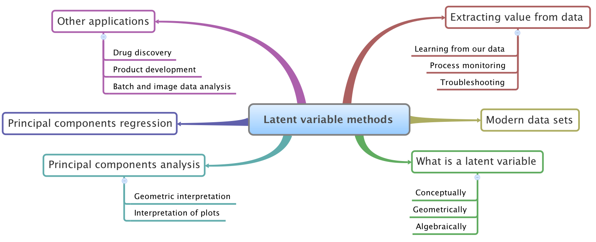
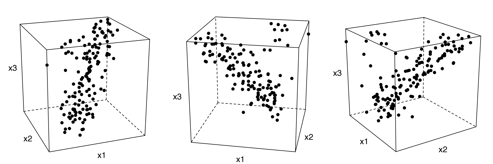
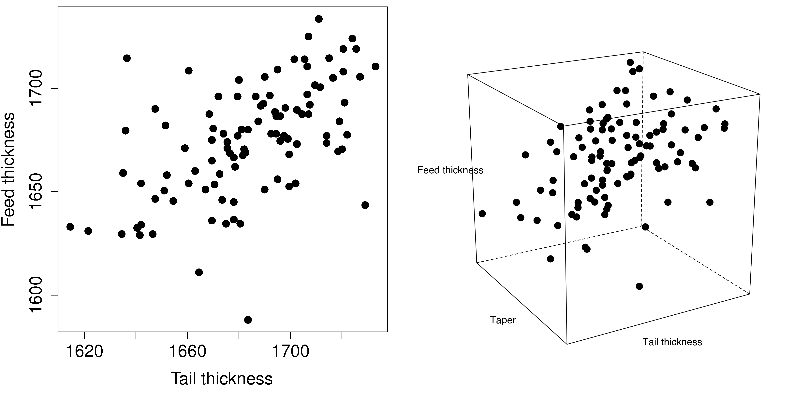

.. TODO
	=====
	~~~~~
	^^^^^
	-----
	
	* Add a multiblock references
	* Cross-validation: must be covered, as promised in the training/testing section in the least squares notes
	* Illustration of correlation problem: p 491 of BHH1
	
	* Describe what multiblock PCA does; its advantages of single PCA
	* Importance of variation in your training PLS model (Kresta soft sensors paper as reference)
	* Example of distillation column adding calculated variable and improving PLS model
 	
	Data sets
	===========

	See June's email on 22 Feb 2010
	* GRINDER.DIF,
	* Pulp digester.xls
	* THICKNES.DIF
	See Honglu's email on 1 March 2010: faulty reactor data set
	Look at the MediBIC data: how does it compare to your made-up pastry data?
	Board thickness

      
.. FUTURE

	Reduce resolution of all images for the website, but not for the PDF
	
	2d plot of taper vs feed thickness: should show no correlation
	Scatter plot matrix for section on visualizing multivariate data
	
	Use 3 variables instead of 4 for the temperature example: easier to visualize in a 3d cube.
	Interpreting loadings and scores: have to have examples for each type that show what you are referring to: e.g. unimportant variables
	Preprocessing: add examples also
	
	Introduce a discussion about how much variance is captured in each latent variable early on (e.g. in the food texture example).  The students are assuming LV1 explains variable 1.
	
	When explaining t1p2 + t2p2+ ... : use a time-series example, like the room temperature example with the blip in the oscillations.   See the course email to Richard on 22 April 2010.
	
	Optimizing process: moving in score space while staying below SPE. Give it as an optimization formulation; example from Jaeckle.
	
	Illustrate over-fitting: picture and equations
	
	Eigenvalue:
		* are you sure about lambda_1 = t1' t1?
		* add notes for kernel method
		
	Read/enhance Esbensen notes on calibration
	
	
	Add the poyurethane example in the learning from data section (http://dx.doi.org/10.1016/S0169-7439(02)00088-6)
	Discuss ridge regression in the PCR section.  see p 59 of Tibshirani and Friedman
	PCR contains MLR as special case
	Discuss about computing the number of components: use the CAMO book for extra help; Joliffe?  Eigenvector?
	
	Mention how centering and scaling is like calculating z-values in the univariate section.

.. Plots to draw

	Add "spectral-data-illustrate-residuals.svg" into the notes.\
	Add "any other new illustrations not here, but in slides", e.g. geometric-interpretation-of-PCA-Hotellings-T2.png
	
	Draw a picture of the geometric interpretation of SPE, showing a 3rd vector off the model plane.  See email to David Gerardi on 29 June 2010.
	
	Enhance the support on the other correlated illustration.  Show numerically how small changes in highly correlated X's can lead to a rotated plane (and illustrate it: add the slope coefficient to the illustration)

	.. TODO: contribution plot here: add text
	Link to foods data on course website
	Mark points, in black, in pastry example which are used in the notes (e.g. 33, 36, 44)
	.. TODO lagging picture here
	.. page 30 of pencil notes
	.. PLOTS OF T2 with limit; plots of an ellipse.
	Re-export the competitor model 
	SPE section: show contribution plot to SPE
	
	Image unfolding

	Multiblock picture
	Wood thickness data (simulated)
	
	Temperature example: show the dip in blue, show the spike in red. 
	
	
.. FUTURE DEMO:
	Have an SPE "colorbar" slider
	Clickable points: (double)-click on a point and it resets the slides to to that point's X-values
	Revert button is instantaneous
	Show SPE contributions as bar plot that is constantly updated
	Show score contributions (for a given score/score combo - dropdown selected), as the point is moved around
	Dropdowns to select score combination
	Import an arbitrary PCA model

.. Exercises to embed

	The temperature example in the section called "More about the direction vectors (loadings)"
	
.. Examples

	* Google's translation
	* bridge sensor network (Bridge in France)
	* aircraft sensor network
	
.. First class outline

	Modern data sets
	Value from data: what are we looking for from our data?
	What is a latent variable

		- averaging process from 4 temperatures
		- pick up the average trends
		- spinning cube

	How are latent variables calculated

		- axes
		- spinning cube

	PCA as a latent variables model

		- specific equations for PCA
		- X = TP' + E
		- data = information + error

	Interpreting latent variable models

		- loadings plot
		- score plot
		- residuals 
		- SPE
		- T2
		- VIP (PCA)
		- hat value for the n-th row: t_row \times (T'T)^{-1} t_row'
		- clusters and outliers

			- scores outlier
			- SPE outlier
			- T2 outlier

	Extracting information from the latent variable model

		- residuals
		- contribution plot for errors
		- contribution plot for scores
		- Hat values
		- Influence plot

	Fitting a latent variable model in practice

		- Eigenvalue or SVD
		- NIPALS
		- Missing data methods
		- Q2 and R2

	How PCA addresses issues raised earlier

		- missing data
		- signal to noise increase

	In-class exercises (with R)

		- PCA model on the temperature data
		- Model on the thickness data (boards): 4 components
		- Model on the quality data
		- Foods data set
	
.. Next class:

	How to calculate the model
	Number of components?
	A taste of the 5 areas:
		- Monitoring
		- Troubleshooting
		- etc
	Calculating the model limits (SPE and T2): use a qq-plot to test if they really are F-distributed.
	
	
.. Topics for future classes

	Indicator variables: how to setup: e.g. raw material suppliers
	
	More on contribution plots and how to use them effectively.

	Clustering and classification:
		* clusters in a score plot might indicate the need for a separate model for each cluster (they are so dissimilar)

	Correlation and collinearity
		CAMO book: p 6
		Multivariate correlation: 

			-	XtX is a measure of covariance
			-	If we scale the columns in X: XtX is a measure of correlation
			-	Show an example of orthogonal X's: spinning cube
			-	Show an example of highly correlated X's: spinning cube
			-	Show how in the extreme we cannot invert X'X

	SIMPLS before PLS
	Block scaling: e.g. adding spectral data next to other measurements ()
	PCR contains MLR as special case
	Cover ridge least squares (regression) here:  see p 59 of Tibshirani and Friedman
	Time-series modelling:
		- lagging
		- how batch data analysis is just lagging
		
	* To mention: latent variable control
	
		- particle size distribution prediction: access to real-time measurement of the PSD shape is the bottleneck: predict t_1 and t_2 of the shape in real-time
		- see Sal's thesis, Jesus's theis, Tracy Clarke-Pringle
		-
	Trajectory control: must be consistent with previous operation: operators can actually implement it; they will feel comfortable implementing it
	
		
	Experimental analysis: record all data from an experiment; analyze multivariately
	Classification:
		- multiple PCA model (SIMCA)
		- PLS-DA
		
	Limits for various statistics
		
	Multiway data sets
	
		- images and batch and 4D medical imaging data
		- unfolding principle: 
			- what do you want to model?  that goes in the row-dimension
			- what does centering and scaling mean in this context?
		
		- kernel algorithms
		
		MIA references: 
			- Esbensen and Geladi, 1989, CILS, 7, 67-86: "Strategy of MIA"
			- Geladi and Wold, 1989, CILS, 5, 209-220: "PCA of multivariate images"
		
	The problem of compression
	
	Multiblock
		- Consensus PCA
		- Multiblock PLS
		
		- Readings: Wold Frankfurt paper, Wanger and Kowalski, Slama theis, JFM papers
		
	Application areas:
	
		- troubleshooting a batch process
		- monitoring
		- soft sensors
		- classification
		- QSAR, lead finding
		- product development
		- image analysis
		- model inversion
		- multivariate specifications
	
.. Plots to draw

	brushing-illustration: get the colour version to have a white background
	barplot-for-R2-and-Q2.png: add the R2 and Q2 values on top of each bar
	
.. To add/fix up

	* mention: 45 degree line between t_a and u_a
	* mention: no independent and dependent variables
	* mention: coefficient plots
	* mention: observed against predicted plots	
	* mention: NIPALS for PLS: how arrows 1 and 3, had the pointed to their respective spaces, PLS would be like calculating PCA on X and Y separately; but the cross-over in the arrows shows how PLS calculates the LVs from both X and Y simultaneously.
	
	* mention: deflation: doi:10.1002/cem.652

.. Topics for future classes
	
	
	Multivariate specifications
	==============================

	Multi-block data analysis (data fusion)
	========================================

	- Consensus PCA
	- Multiblock PLS
	- Block scaling: e.g. adding spectral data next to other measurements ()
	- Readings: Wold Frankfurt paper, Wanger and Kowalski, Slama theis, JFM papers

	Topics for future classes
	============================

	* Data compression in process historians (databases)
	see pencil notes in thin black binder's front cover
	
	
	Hat values: how to calculate; what they mean; plot of hats vs SPE (like influence plot in least squares)
	
	More on contribution plots and how to use them effectively.

	Correlation and collinearity
		CAMO book: p 6
		Multivariate correlation: 

			-	XtX is a measure of covariance
			-	If we scale the columns in X: XtX is a measure of correlation
			-	Show an example of orthogonal X's: spinning cube
			-	Show an example of highly correlated X's: spinning cube
			-	Show how in the extreme we cannot invert X'X
	
	Add in cross-validation: requires a criterion for goodness of fit.  Other criterion possible: median absolute value in E?  (sum of squares, is like minimizing variance).  Apparently Martens and Naes (NIR technology for the Agricultural and Food Industries, "Multivariate calibration by data compression" chapter, 1987), consider leverage corrected mean square error as the X-val criterion.
	
	Cross-validation: explain it clearer; cross-ref the Bro paper on it; show an illustration.
	
	Generating orthogonal data (for testing):
	
		1.	Create A latent variables from a normal random number generator: each column should have less variance than the other: var(t_1) > var(t_2) > etc
		2.	These columns won't be exactly orthogonal: cov(T) has non-zero off-diagnonals
		3.	Induce orthogonality between the columns:
				- Regress t_i on t_j (i > j)
				- Calculate the (small) regression coefficient (the only systematic relationship between t_i and t_j)
				- Predict t_i_hat from the regression model: using that coefficient and t_j: t_i_hat = b_0 + b_reg t_j
				- Let the new t_i <- t_i - t_i_hat  (note: we intentionally use the *residuals* as t_i, because we don't expect much relationship between t_i and t_j)
				- The variance of t_i may not be exactly what was required: so scale it up or down as necessary, and re-center it
				- Let i <- i + 1 and let j <- j + 1
				
		4.	Now you may create the raw data, from which these scores would have come: X_hat = TP'
		
				- Select your own loading matrix
				- Make sure the columns in P are orthogonal and of unit length
				- This can be done in exactly the same was as described above for the scores, T.
		
		5.	Once you have generated X_hat, you can add some noise to it to obtain X = X_hat + E
	
	PCR contains MLR as special case
	Cover ridge least squares (regression) here:  see p 59 of Tibshirani and Friedman
	
	* To mention: latent variable control
	
	Batch classification examples:

		- predict stability
		- predict bio-availability
		- predict tableting success
		
	
	Confidence Limits for various statistics
	* Test them with a qq-plot
	
	Add notes about overfitting
	
	The paper by Helland (Comm. Stat. Simula. 17(2), p581-607, 1988): explains why PLS has A=1 for DOE type data, despite the fact that the X-space is totally orthogonal.  PCR on this sort of data would require A=K, yet PLS achieves the same performance with A=1.  It is to do with when the eigenvalues of X'X are proportional to the identity matrix that PLS has A=1.
		
	Multiway data sets
	
		- images and batch and 4D medical imaging data
		- unfolding principle: 
			- what do you want to model?  that goes in the row-dimension
			- what does centering and scaling mean in this context?
		
		- kernel algorithms
		
		MIA references: 
			- Esbensen and Geladi, 1989, CILS, 7, 67-86: "Strategy of MIA"
			- Geladi and Wold, 1989, CILS, 5, 209-220: "PCA of multivariate images"
		
	The problem of compression
		
	Application areas to expand on
	
		- troubleshooting a batch process
		- monitoring
		- soft sensors
		- classification
		- QSAR, lead finding
		- product development
		- image analysis
		- model inversion
		- multivariate specifications

In context
===========

This final section of the course considers the important area of latent variable modelling.  These models have been shown, about 20 to 30 years ago, to be very powerful tools in dealing with the very data that (chemical) engineers face frequently.  Our main goal of this section is to show how one can extract value from these data.  But we first introduce the concept of a latent variable, and specifically the principal component analysis (PCA) model: the cornerstone of all latent variable models.  Then we consider different ways to use our databases for interesting applications such as troubleshooting, soft-sensors, process monitoring, and new product development.

.. TODO: more questions/answers here

What we will cover
~~~~~~~~~~~~~~~~~~

	
.. index::
	pair: references and readings; Latent variable modelling

References and readings
========================

These readings cover a variety of topics in the area of latent variable methods: 

* **General**: John MacGregor, Honglu Yu, Salvador García-Muñoz, Jesus Flores-Cerrillo, "`Data-Based Latent Variable Methods for Process Analysis, Monitoring and Control <http://dx.doi.org/10.1016/j.compchemeng.2005.02.007>`_". *Computers and Chemical Engineering*, **29**, 1217-1223, 2005.

* **General**: Ericsson, Johansson, Kettaneth-Wold, Trygg, Wikström, Wold:  "Multivariate and Megavariate Data Analysis" (Parts I and II): chapters 1 to 8 of Part I are particularly relevant to this course.

.. Others:

	Reading: http://matlabdatamining.blogspot.com/2010/02/principal-components-analysis.html  (shows MATLAB code)
	Camo book
	Eigenvector webpage
	MacGregors 1997 paper on MSPC
	Cross-validation: Svante Wold, "Cross-validatory estimation of the number of components in factor and principal components models", *Technometrics*, **20**, 397-405, 1978. 
	Contribution plots: P Miller, RE Swanson, CE Heckler, "Contribution plots: a missing link in multivariate quality control, *Applied Mathematics and Computer Science*, *8* (4), 775-792, 1998.
	
Extracting value from data
===================================================

There are five main areas where engineers use large quantities of data.

	#.	**Improved process understanding**
	
		This is an implicit goal in any data analysis: either we confirm what we know about the process, or we see something unusual show up and learn from it.  Plots that show, in one go, how a complex set of variables interact and relate to each other are required for this step.
		
	#.	**Troubleshooting process problems**
	
		Troubleshooting occurs after a problem has occurred.  There are many potential sources that could have caused the problem.  Screening tools are required that will help isolate the variables most related to the problem. These variables, combined with our engineering knowledge, are then used to troubleshoot why the problem occurred.
		
	#.	**Improving, optimizing and controlling processes**
	
		We have already introduced the concept of :ref:`designed experiments and response surface methods <design-analysis-experiments-chapter>` in this course.  These are excellent tools to intentionally manipulate your process so that you can find a more optimal operating point, or even develop a new product.  We will show how latent variable tools can be used on a large historical data set to improve process operation, and to move to a new operating point.  There are also tools for latent variable control of processes, but we won't go into detail on this topic. 
		
	#.	**Predictive modelling** (inferential sensors)
	
		The section on :ref:`least squares modelling <least-squares-modelling-chapter>` provided you with a tool for making predictions. We will show some powerful examples of how a "difficult-to-measure" variable can be predicted in real-time, using other easy-to-obtain process data.  Least squares modelling is a good tool, but it lacks some of the advantages that latent variable methods provide, such as the ability to handle highly collinear data, and data with missing values. 
	
	#.	**Process monitoring**
	
		Once a process is running, we require monitoring tools to ensure that it maintains and stays at optimal performance.  We have already considered :ref:`process monitoring charts <process-monitoring-chapter>` for univariate process monitoring.  In this section we extend that concept to monitoring multiple variables.
		
The types of data engineers deal with now
~~~~~~~~~~~~~~~~~~~~~~~~~~~~~~~~~~~~~~~~~~~

When industrial manufacturing and chemical engineering started to develop around the 1920's to 1950's, data collected from a process were, at most, just a handful of columns.

The tools required to visualize and processes these datasets are scatter plots, time-series plots, Shewhart charts and EWMA charts for process monitoring, and multiple linear regression (MLR) least-squares models; all the tools which we have already learned about in this course.

If we have to represent this data as a single matrix, called |X|, we would have each row in |X| containing values from an *object* of some sort.  These rows, or *observations* could be a collection of measurements at a particular point in time, various properties of a final product, or a raw material from a supplier.  The columns in |X| are the values recorded for each observation.  We call these the *variables*. 

	.. figure:: images/X-matrix-long-and-thin.png
		:alt:	images/X-matrix-long-and-thin.svg
		:align: center
		:scale: 18
		:width: 400px

These data sets from the 1950's frequently had many more rows than columns, because it was expensive and time-consuming to measure additional columns.  The choice of which columns to measure was carefully thought out, so that they didn't unnecessarily duplicate the same measurement.  As a result:

	* the columns of X were often independent
	* the variables were measured in a controlled environment, with a low amount of error

These data sets meet all the assumptions required to use the above-mentioned tools, especially least squares modelling.  Data sets that engineers currently deal with though can be of any configuration with both large and small :math:`N` and large and small :math:`K`, but more likely we have many columns for each observation.

**Small N and small K**

	These cases are mostly for when we have expensive measurements, and they are hard to obtain frequently.  Methods to visualize and analyze these data will work well: scatterplots, linear regression, *etc*.
	
**Small N and large K**

	This case is common for laboratory instrumentation, particularly spectroscopic devices. In the recent past it was hard to obtain frequent measurements, but advances now allow for routine collection of large quantities of data.  This is especially true with near-infrared probes embedded at-line.  These probes record a spectral response at around 1000 to 2000 different wavelengths each second.  The data are represented in |X| using one wavelength per column and each sample appears in a row. The illustration here shows data from :math:`N=460` samples, with data recorded every 2 nm (:math:`K=650`).
	
	.. figure:: images/pharma-spectra.png
		:alt:	images/pharma-spectra.py
		:scale: 70
		:width: 750px
		:align: center

	Obviously not all the columns in this matrix are important; some regions are more useful than others, and columns immediately adjacent to each other are extremely similar.
	
	Notable here is that regression methods cannot deal with this case when :math:`K > N`, since we are then estimating more unknowns than we have data for.
	
**Large N and small K**

	This was the most common case in the past, and still holds for many situation today; except that both :math:`N` and :math:`K` have increased.  A current-day refinery would record one or two observations each second on around 2000 to 5000 variables (called tags); generating in the region of 50 to 100 Mb of data per second.
	
	For example, a modest size distillation column would have about 35 temperature measurements, 5 to 10 flow rates, 10 or so pressure measurements, and then about 5 more measurements derived from these recorded values.
	
	.. figure:: images/Distillation_column_correlation.png
		:alt:	images/Distillation_column_correlation.svg
		:scale: 45
		:width: 500px
		:align: center

**N approximately equal to K**
	
	The case of squarish matrices is obtained in systems where the variables are computed, obtained from laboratory robotics, or there just happen to be as roughly the same number of attributes as samples.

**X and Y matrices**

	This situation arises when we would like to predict one or more variables from another group of variables.  We have already seen this data structure in the least squares section where :math:`M = 1`, but more generally we would like to predict several values from the same data in |X|.  We will investigate this data structure in-depth in the sections on PCR and PLS.
	
	.. figure:: images/X-and-Y-matrices.png
		:alt:	images/X-and-Y-matrices.svg
		:scale: 30
		:width: 500px
		:align: center

**3D data sets and higher dimensions**	

	These data tables are becoming very common, especially in the past 10 years.  The illustration shows the data structure for a single image, taken at a point in time.  There are 6 wavelengths, and the spatial directions (top-to-bottom and left-to-right) are often called the :math:`x` and :math:`y` directions.  This example might have come from a relatively simply camera recording a red, green and blue wavelength, as well as two near infrared wavelengths and an ultraviolet wavelength.  An good digital camera will record 3 wavelengths.
	
	.. figure:: images/image-data.png
		:alt:	images/image-data.svg
		:scale: 30
		:width: 500px
		:align: center
		
	A fourth dimension can be added if we record images over time.  Such systems generate between 1 and 5 Mb of data per second.  As with the spectral data set mentioned earlier, these camera systems generate large quantities of redundant data, because neighbouring pixels, both in time and spatially, are so similar.	

**Batch data sets**	

	Batch systems are common with high-value products: pharmaceuticals, fine-chemicals, and polymers.  The :math:`Z` matrix below contains data that describes how the batch is prepared and also contains data that is constant over the duration of the whole batch.  The :math:`X` matrix contains the recorded values for each variable over the duration of the batch.  For example, temperature ramp-up and ramp-down, flow rates of coolant, agitator speeds and so on. The final product properties, recorded at the end of the batch, are collected in matrix :math:`Y`.
	
	.. figure:: images/Batch-data-layers-into-the-page.png
		:alt:	images/Batch-data-layers-into-the-page.svg
		:scale: 50
		:width: 750px
		:align: center
		
**Data fusion**	

	This is a recent buzz-word that simply means we collect and use data from multiple sources. Imagine the batch system above: we already have data in :math:`Z` recorded by manual entry, data in :math:`X` recorded by sensors on the process, and then :math:`Y`, typically from lab measurements.  We might even have a near infrared probe in the reactor that provides a complete spectrum (a vector) at each point in time.  The process of combining these data sets together is called data fusion.
		
		
Issues faced with engineering data
~~~~~~~~~~~~~~~~~~~~~~~~~~~~~~~~~~~~~~~~~~~

**Size of the data**

	The most outstanding feature of the above data sets is their large size, both in terms of the number of rows and columns.  This is primarily because data acquisition and data storage is very cheap.
	
	The number of rows isn't too big of a deal: we can sub-sample the data, use parallel processors on our computers or distributed computing (a.k.a. cloud computing) to deal with this.  The bigger problem is the number of columns in the data arrays.  A data set with :math:`K` columns can be visualized using :math:`K(K-1)/2` pairs of scatterplots;  this is manageable for :math:`K < 8`, but the quadratic number of combinations prevents us from using scatterplot matrices to visualize this data, especially when :math:`K>10`.
	
**Lack of independence**

	The lack of independence is a big factor - it is problematic for example with MLR where the :math:`\mathbf{X}'\mathbf{X}` becomes singular as the data become more dependent. Sometimes we can make our data more independent by selecting a reduced number of columns, but this requires good knowledge of the system being investigated, is time-consuming, and we risk omitting important variables.  
	
**Low signal to noise ratio**

	Engineering systems are usually kept as stable as possible: the ideal being a flat line.  Data from such systems have very little signal and high noise.  Even though we might record 50 Mb per second from various sensors, computer systems can, and actually do, "throw away" much of the data.  This is not advisable from a multivariate data analysis perspective, but the reasoning behind it is hard to fault: much of the data we collect is not very informative. A lot of it is just from constant operation, noise, slow drift or error.  This everyday, routine data is also called happenstance data.
		
**Non-causal data**

	This happenstance data is also non-causal.  The opposite case is when one runs a designed experiment; this intentionally adds variability into a process, allowing us to conclude cause-and-effect relationships, if we properly block and randomize.  
	
	But happenstance data just allows us to draw inference based on correlation effects.  Since correlation is a prerequisite for causality, we can often learn a good deal from the correlation patterns in the data.  Then we use our engineering knowledge to validate any correlations, and we can go on to truly verify causality with a randomized designed experiment, if it is an important effect.
	
**Errors in the data**

	Tools, such as least squares analysis, assume the recorded data has no error.  But most engineering systems have error in their measurements, some of it quite large.  
	
**Missing data**

	Missing data are very common in engineering applications.  Sensors go off-line, are damaged, or it is simply not possible to record all the variables (attributes) on each observation.

.. OMIT FOR NOW
		:alt:	images/Missing-data.png
		:scale: 50
		:width: 750px
		:align: center

**Unaligned data**

	Increasingly common, especially with data fusion and batch systems, is that we have to pre-align the data.  Not every batch will have the same duration, since they are run according to a recipe that is not time-based (e.g. ramp up the temperature until it reaches 425K).  

**In conclusion**, we require methods that:

	*	are able to rapidly extract the relevant information from a large quantity of data
	*	deal with missing data
	*	deal with 3-D and higher dimensional data sets
	*	be able to combine data on the same object, that is stored in different data tables
	*	handle collinearity in the data (low signal to noise ratio)
	*	assume measurement error in all the recorded data.

Latent variable methods are a suitable tool that meet these requirements.

.. index::
	single: latent variable, what is a

What is a latent variable?
===================================================

We will take a look at what a latent variable is conceptually, geometrically, and mathematically.

Your health
~~~~~~~~~~~~~~~~~~~~~~~~

Your overall health is important.  But there isn't a single measurement of "*health*" that can be measured - it is a rather abstract concept.  Instead we measure physical properties from our bodies, such as blood pressure, cholesterol level, weight, various distances (waist, hips, chest), blood sugar, temperature, and a variety of other measurements.  These separate measurements can be used by a trained person to judge your health.  

In this example, your *health* is a latent, or hidden variable.  If we had a sensor for health, we could measure and use that variable, but since we don't, we use other measurements which all contribute in some way to assessing health.

.. _LVM-room-temperature-example:

Room temperature
~~~~~~~~~~~~~~~~~~~~~~~~

**Conceptually**

Imagine the room you are in has 4 temperature probes that sample and record the local temperature every 30 minutes.  Here is an example of what the four measurements might look like over 3 days.

.. figure:: images/room-temperature-plots.png
	:alt:	images/room-temperature-plots.py
	:scale: 80
	:width: 700px
	:align: center
	
In table form, the first few measurements are:

.. csv-table:: 
   :header: Date, :math:`x_1`, :math:`x_2`, :math:`x_3`, :math:`x_4`
   :widths: 50, 30, 30, 30, 30

	Friday 11:00, 295.2,     297.0,     295.8,     296.3
	Friday 11:30, 296.2,     296.4,     296.2,     296.3
	Friday 12:00, 297.3,     297.5,     296.7,     297.1
	Friday 12:30, 295.9,     296.7,     297.4,     297.0
	Friday 13:00, 297.2,     296.5,     297.6,     297.4
	Friday 13:30, 296.6,     297.7,     296.7,     296.5

.. Some questions that come to mind are what are fluctuations due to in the data; what is the sharp spike in the 3rd measurement due to; and why is there an unusual dip in the first temperature measurement?

The general up and down fluctuations are due to the daily change in the room's temperature.  The single, physical phenomenon being recorded in these four measurements is just the variation in room temperature.   

If we added two more thermometers in the middle of the room (left and right hand side), we would expect these new measurements to show the same pattern as the other four. In that regard we can add as many thermometers as we like to the room, but we won't be recording some new, independent piece of information with each thermometer.  There is only one true variable that drives all the temperature readings up and down: it is a latent variable.  

Notice that we don't necessarily have to know what *causes* the latent variable to move up and down (it could be the amount of sunlight on the building; it could be the air-conditioner's settings).  All we know is that these temperature measurements just reflect the underlying phenomenon that drives the up-and-down movements in temperature; they are *correlated* with the latent variable.

.. Notice also the sharp spike recorded at the back-left corner of the room could be due to an error in the temperature sensor.  And the front part of the room showed a dip, maybe because the door was left open for an extended period; but not long enough to affect the other temperature readings.   These two events go against the general trend of the data, so we expect these periods of time to *stand out* in some way, so that we can detect them.  We will come back to this.

**Mathematically**

If we wanted to summarize the events taking place in the room we might just use the average of the recorded temperatures.  Let's call this new, average variable :math:`t_1`, which summarizes the other four original temperature measurements :math:`x_1, x_2, x_3` and :math:`x_4`.

.. math:: t_1 &= \begin{bmatrix} x_1 & x_2 & x_3 & x_4 \end{bmatrix}\begin{bmatrix} p_{1,1} \\ p_{2,1} \\ p_{3,1} \\ p_{4,1} \end{bmatrix} = x_1 p_{1,1} + x_2 p_{2,1} + x_3 p_{3,1} + x_4 p_{4,1} 

and suitable values for each of the weights are :math:`p_{1,1} = p_{2,1} = p_{3,1} = p_{4,1} = 1/4`.

Mathematically the correct way to say this is that :math:`t_1` is a *linear combination* of the raw measurements (:math:`x_1, x_2, x_3` and :math:`x_4`) given by the weights (:math:`p_{1,1}, p_{2,1}, p_{3,1}, p_{4,1}`).

**Geometrically**

We can visualize the data from this system in several ways, but we will simply show a 3-D representation of the first 3 temperatures: :math:`x_1, x_2, x_3`.

The 3 plots show the same set of data, just from different points of view.  Each observation is a single dot, the location of which is determined by the recorded values of temperature, :math:`x_1, x_2` and :math:`x_3`.  We will use this representation in the next section again.

Thickness of wood boards
~~~~~~~~~~~~~~~~~~~~~~~~~~~~~~~~~~~~~~~~~~~~~~~~~~~~

Wood boards (for example 2 by 4 boards) are measured for thickness at 6 locations prior to leaving the lumber mill (see the illustration).  Three important quality variables are derived from these 6 measurements:

	* :math:`x_1` = average tail thickness: average of thickness 1 and 4
	* :math:`x_2` = average feed thickness: average of thickness 3 and 6
	* :math:`x_3` = average taper: average of thickness 1, 2 and 3 subtracted from average thickness 4, 5, and 6

	.. figure:: images/board_measurement_locations.png
		:alt:	images/board_measurement_locations.svg
		:scale: 50
		:width: 500px
		:align: center

Imagine that we have data from 100 boards, so we could represent this raw data a matrix where each row are the 3 measurements from one board.

.. math:: 
	\underbrace{\mathbf{X}_\text{raw}}_{100 \times 3}
	
The plots of these different thicknesses are 

It is not surprising that the feed and tail thickness are related to each other.  They are expected to have a positive correlation, because if the board is thicker, it will be thick at all locations.  The taper measurement is unrelated to the boards thickness, since it doesn't matter if the board is thick or thin: it can still be tapered.

So there are two latent variables in this system: 

	#.	The fact that the entire board is thicker or thinner is captured by the feed and tail thickness measurements.   These measurements are correlated with whatever physical phenomenon causes that average thickness to increase or decrease (e.g. spacing of the saw blades).
	#.	The third measurement, taper of the board, is capturing a different phenomenon in the system; possibly caused by how much the blades are skewed out of alignment.  
	
	.. But unless we perform an experiment where we change the saw alignment and measure the taper, we won't be sure that this is a causal relationship. 

The main points from this section so far:

	*	Latent variables capture, in some way, an underlying phenomenon in the system being investigated.
	*	The actual measurements we take on the system are *correlated* with the latent variable.
	*	Latent variables that are unrelated to to each other are said to be independent, or orthogonal to each other.

Latent variable modelling is concerned with how we can reduce the number of values we measure on each observation, but still retain the important features.  In this example of the board thickness, we could use an average of the feed and tail measurements as one of the summary variables, called :math:`t_1`.  And since the taper is independent of thickness, we would retain a second latent variable, called :math:`t_2`, that captures the taper measurement.

	.. math::
	
		t_1 &= \begin{bmatrix} x_1 & x_2 & x_3 \end{bmatrix}\begin{bmatrix} p_{1,1} \\ p_{2,1} \\ p_{3,1} \end{bmatrix} = x_1 p_{1,1} + x_2 p_{2,1} + x_3 p_{3,1}  \\
		t_2 &= \begin{bmatrix} x_1 & x_2 & x_3 \end{bmatrix}\begin{bmatrix} p_{1,2} \\ p_{2,2} \\ p_{3,2} \end{bmatrix} = x_1 p_{1,2} + x_2 p_{2,2} + x_3 p_{3,2}

So using the measurements from each board, :math:`\begin{bmatrix} x_1, & x_2, & x_3 \end{bmatrix}` we obtain two derived values, :math:`\begin{bmatrix} t_1, & t_2 \end{bmatrix}`.  These two values are intended to capture the essence of the original measurements.  The weights :math:`p_{k,a}` are selected so that we meet that objective.

What values would be suitable for the weights?  One option might be that:

.. math::	
		t_1 &= \begin{bmatrix} x_1 & x_2 & x_3 \end{bmatrix}\begin{bmatrix} 1/2 \\ 1/2 \\ 0 \end{bmatrix} = \dfrac{x_1}{2} + \dfrac{x_2}{2} + 0 \\
		t_2 &= \begin{bmatrix} x_1 & x_2 & x_3 \end{bmatrix}\begin{bmatrix} 0 \\ 0 \\ \,1\, \end{bmatrix} = 0 + 0 + x_3
		
or more compactly:

.. math::
		\mathbf{t}' = \begin{bmatrix} t_1 & t_2 \end{bmatrix} &=
		\begin{bmatrix} x_1 & x_2 & x_3 \end{bmatrix} 
		\begin{bmatrix}  0.5 & 0 \\ 0.5 & 0 \\ 0  & 1  \end{bmatrix} =
		\begin{bmatrix} x_1 & x_2 & x_3 \end{bmatrix}
		\begin{bmatrix} p_{1,1} & p_{1,2}\\ p_{2,1} & p_{2,2} \\ p_{3,1} & p_{3,2} \end{bmatrix} =
		 \underbrace{\mathbf{x}_\text{raw}}_{1 \times 3} \underbrace{\mathbf{P}}_{3 \times 2} = \underbrace{\begin{bmatrix} t_1 & t_2 \end{bmatrix}}_{1 \times 2}
		
The matrix |P| can now be used to take any vector of board measurements, represented as vector :math:`\mathbf{x}`, and calculate a summary vector, |t|, from it.

At this stage you likely have more questions, such as "*how did you know to calculate 2 latent variables*" and "*how were the values in* |P| *chosen*", and "*how do we know this is a good summary of the original data*"?

We address these issues more formally in the next section on :ref:`principal component analysis <SECTION-PCA>`.
