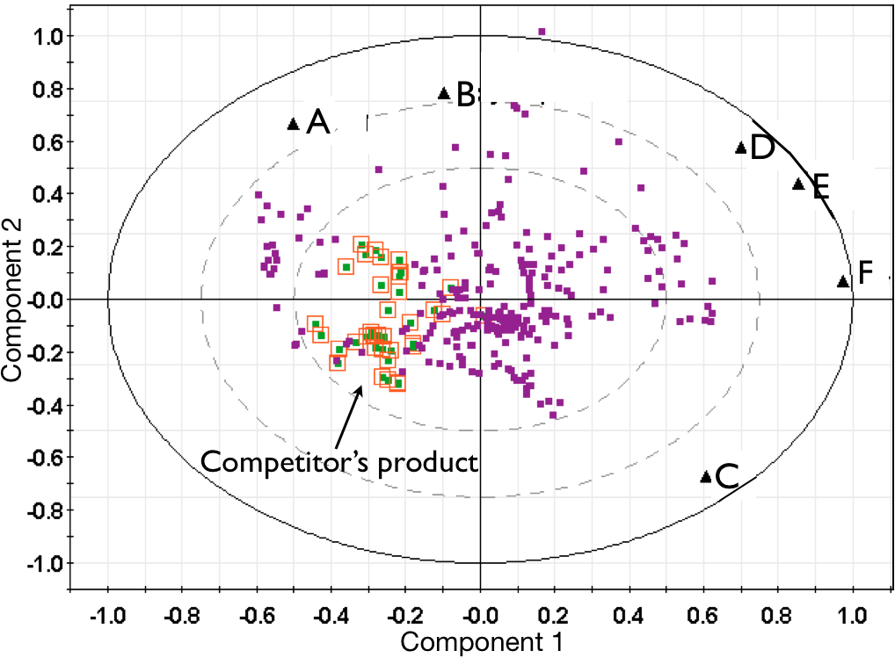
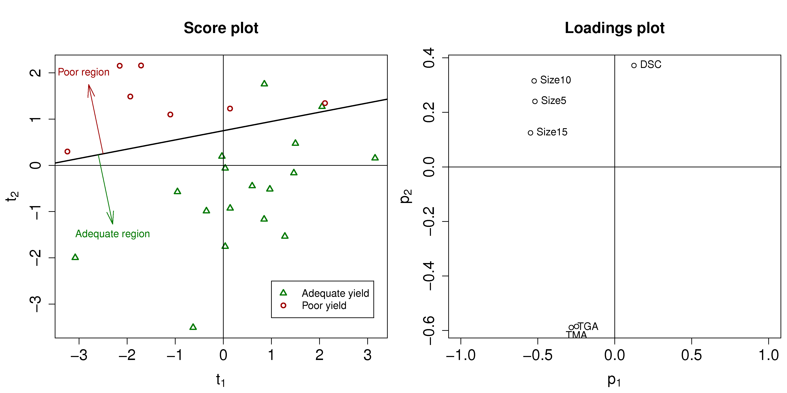
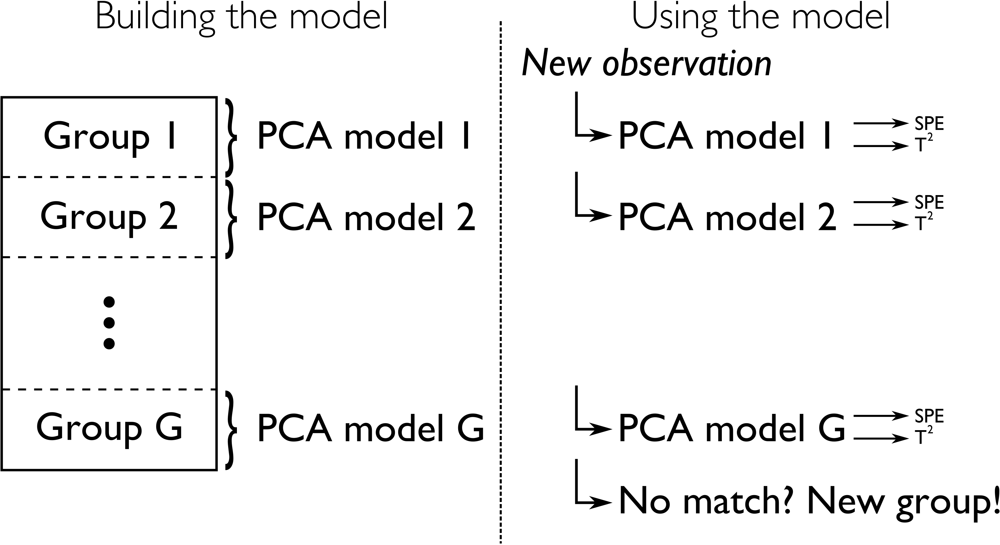
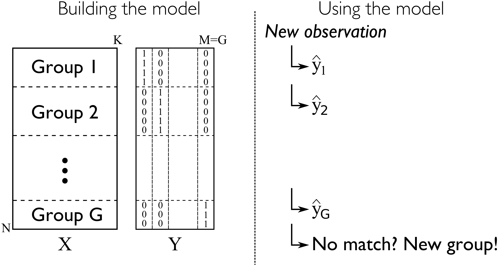
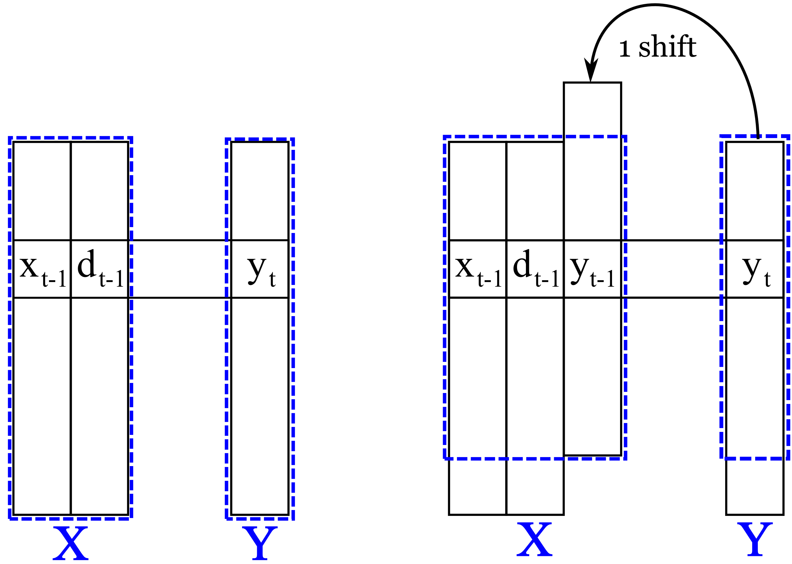
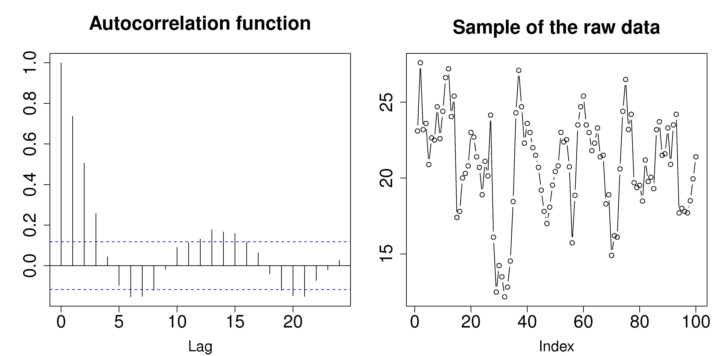
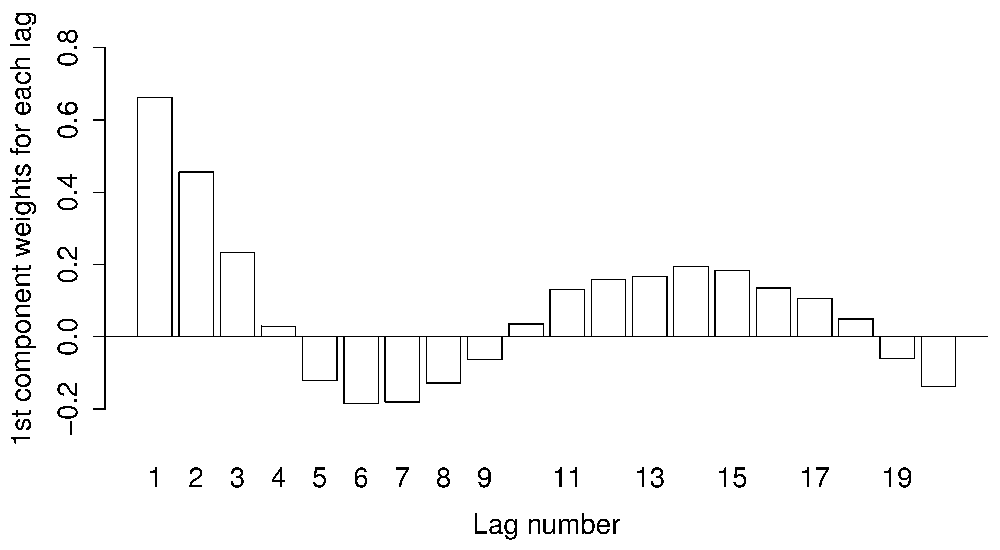
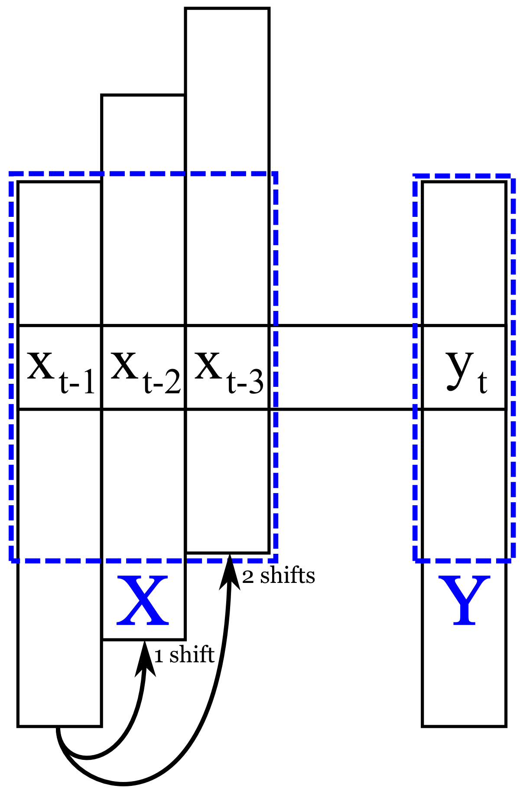
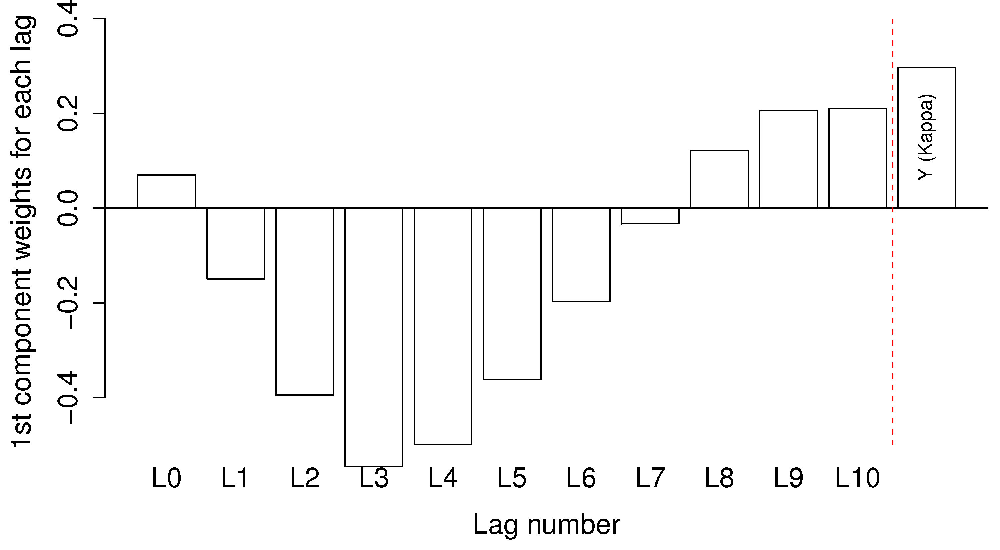

.. TODO
	=====
	~~~~~
	^^^^^
	-----
	
	* Add a multiblock references
	* Cross-validation: must be covered, as promised in the training/testing section in the least squares notes
	* Illustration of correlation problem: p 491 of BHH1
	
	* Describe what multiblock PCA does; its advantages of single PCA
	* Importance of variation in your training PLS model (Kresta soft sensors paper as reference)
	* Example of distillation column adding calculated variable and improving PLS model
 	
	Data sets
	===========

	See June's email on 22 Feb 2010
	* GRINDER.DIF,
	* Pulp digester.xls
	* THICKNES.DIF
	See Honglu's email on 1 March 2010: faulty reactor data set
	Look at the MediBIC data: how does it compare to your made-up pastry data?
	Board thickness

      
.. FUTURE

	Reduce resolution of all images for the website, but not for the PDF
	
	2d plot of taper vs feed thickness: should show no correlation
	Scatter plot matrix for section on visualizing multivariate data
	
	Use 3 variables instead of 4 for the temperature example: easier to visualize in a 3d cube.
	Interpreting loadings and scores: have to have examples for each type that show what you are referring to: e.g. unimportant variables
	Preprocessing: add examples also
	
	Introduce a discussion about how much variance is captured in each latent variable early on (e.g. in the food texture example).  The students are assuming LV1 explains variable 1.
	
	When explaining t1p2 + t2p2+ ... : use a time-series example, like the room temperature example with the blip in the oscillations.   See the course email to Richard on 22 April 2010.
	
	Optimizing process: moving in score space while staying below SPE. Give it as an optimization formulation; example from Jaeckle.
	
	Illustrate over-fitting: picture and equations
	
	Eigenvalue:
		* are you sure about lambda_1 = t1' t1?
		* add notes for kernel method
		
	Read/enhance Esbensen notes on calibration
	
	
	Add the poyurethane example in the learning from data section (http://dx.doi.org/10.1016/S0169-7439(02)00088-6)
	Discuss ridge regression in the PCR section.  see p 59 of Tibshirani and Friedman
	PCR contains MLR as special case
	Discuss about computing the number of components: use the CAMO book for extra help; Joliffe?  Eigenvector?
	
	Mention how centering and scaling is like calculating z-values in the univariate section.

.. Plots to draw

	Add "spectral-data-illustrate-residuals.svg" into the notes.\
	Add "any other new illustrations not here, but in slides", e.g. geometric-interpretation-of-PCA-Hotellings-T2.png
	
	Draw a picture of the geometric interpretation of SPE, showing a 3rd vector off the model plane.  See email to David Gerardi on 29 June 2010.
	
	Enhance the support on the other correlated illustration.  Show numerically how small changes in highly correlated X's can lead to a rotated plane (and illustrate it: add the slope coefficient to the illustration)

	.. TODO: contribution plot here: add text
	Link to foods data on course website
	Mark points, in black, in pastry example which are used in the notes (e.g. 33, 36, 44)
	.. TODO lagging picture here
	.. page 30 of pencil notes
	.. PLOTS OF T2 with limit; plots of an ellipse.
	Re-export the competitor model 
	SPE section: show contribution plot to SPE
	
	Image unfolding

	Multiblock picture
	Wood thickness data (simulated)
	
	Temperature example: show the dip in blue, show the spike in red. 
	
	
.. FUTURE DEMO:
	Have an SPE "colorbar" slider
	Clickable points: (double)-click on a point and it resets the slides to to that point's X-values
	Revert button is instantaneous
	Show SPE contributions as bar plot that is constantly updated
	Show score contributions (for a given score/score combo - dropdown selected), as the point is moved around
	Dropdowns to select score combination
	Import an arbitrary PCA model

.. Exercises to embed

	The temperature example in the section called "More about the direction vectors (loadings)"
	
.. Examples

	* Google's translation
	* bridge sensor network (Bridge in France)
	* aircraft sensor network
	
.. First class outline

	Modern data sets
	Value from data: what are we looking for from our data?
	What is a latent variable

		- averaging process from 4 temperatures
		- pick up the average trends
		- spinning cube

	How are latent variables calculated

		- axes
		- spinning cube

	PCA as a latent variables model

		- specific equations for PCA
		- X = TP' + E
		- data = information + error

	Interpreting latent variable models

		- loadings plot
		- score plot
		- residuals 
		- SPE
		- T2
		- VIP (PCA)
		- hat value for the n-th row: t_row \times (T'T)^{-1} t_row'
		- clusters and outliers

			- scores outlier
			- SPE outlier
			- T2 outlier

	Extracting information from the latent variable model

		- residuals
		- contribution plot for errors
		- contribution plot for scores
		- Hat values
		- Influence plot

	Fitting a latent variable model in practice

		- Eigenvalue or SVD
		- NIPALS
		- Missing data methods
		- Q2 and R2

	How PCA addresses issues raised earlier

		- missing data
		- signal to noise increase

	In-class exercises (with R)

		- PCA model on the temperature data
		- Model on the thickness data (boards): 4 components
		- Model on the quality data
		- Foods data set
	
.. Next class:

	How to calculate the model
	Number of components?
	A taste of the 5 areas:
		- Monitoring
		- Troubleshooting
		- etc
	Calculating the model limits (SPE and T2): use a qq-plot to test if they really are F-distributed.
	
	
.. Topics for future classes

	Indicator variables: how to setup: e.g. raw material suppliers
	
	More on contribution plots and how to use them effectively.

	Clustering and classification:
		* clusters in a score plot might indicate the need for a separate model for each cluster (they are so dissimilar)

	Correlation and collinearity
		CAMO book: p 6
		Multivariate correlation: 

			-	XtX is a measure of covariance
			-	If we scale the columns in X: XtX is a measure of correlation
			-	Show an example of orthogonal X's: spinning cube
			-	Show an example of highly correlated X's: spinning cube
			-	Show how in the extreme we cannot invert X'X

	SIMPLS before PLS
	Block scaling: e.g. adding spectral data next to other measurements ()
	PCR contains MLR as special case
	Cover ridge least squares (regression) here:  see p 59 of Tibshirani and Friedman
	Time-series modelling:
		- lagging
		- how batch data analysis is just lagging
		
	* To mention: latent variable control
	
		- particle size distribution prediction: access to real-time measurement of the PSD shape is the bottleneck: predict t_1 and t_2 of the shape in real-time
		- see Sal's thesis, Jesus's theis, Tracy Clarke-Pringle
		-
	Trajectory control: must be consistent with previous operation: operators can actually implement it; they will feel comfortable implementing it
	
		
	Experimental analysis: record all data from an experiment; analyze multivariately
	Classification:
		- multiple PCA model (SIMCA)
		- PLS-DA
		
	Limits for various statistics
		
	Multiway data sets
	
		- images and batch and 4D medical imaging data
		- unfolding principle: 
			- what do you want to model?  that goes in the row-dimension
			- what does centering and scaling mean in this context?
		
		- kernel algorithms
		
		MIA references: 
			- Esbensen and Geladi, 1989, CILS, 7, 67-86: "Strategy of MIA"
			- Geladi and Wold, 1989, CILS, 5, 209-220: "PCA of multivariate images"
		
	The problem of compression
	
	Multiblock
		- Consensus PCA
		- Multiblock PLS
		
		- Readings: Wold Frankfurt paper, Wanger and Kowalski, Slama theis, JFM papers
		
	Application areas:
	
		- troubleshooting a batch process
		- monitoring
		- soft sensors
		- classification
		- QSAR, lead finding
		- product development
		- image analysis
		- model inversion
		- multivariate specifications
	
.. Plots to draw

	brushing-illustration: get the colour version to have a white background
	barplot-for-R2-and-Q2.png: add the R2 and Q2 values on top of each bar
	
.. To add/fix up

	* mention: 45 degree line between t_a and u_a
	* mention: no independent and dependent variables
	* mention: coefficient plots
	* mention: observed against predicted plots	
	* mention: NIPALS for PLS: how arrows 1 and 3, had the pointed to their respective spaces, PLS would be like calculating PCA on X and Y separately; but the cross-over in the arrows shows how PLS calculates the LVs from both X and Y simultaneously.
	
	* mention: deflation: doi:10.1002/cem.652

.. Topics for future classes
	
	
	Multivariate specifications
	==============================

	Multi-block data analysis (data fusion)
	========================================

	- Consensus PCA
	- Multiblock PLS
	- Block scaling: e.g. adding spectral data next to other measurements ()
	- Readings: Wold Frankfurt paper, Wanger and Kowalski, Slama theis, JFM papers

	Topics for future classes
	============================

	* Data compression in process historians (databases)
	see pencil notes in thin black binder's front cover
	
	
	Hat values: how to calculate; what they mean; plot of hats vs SPE (like influence plot in least squares)
	
	More on contribution plots and how to use them effectively.

	Correlation and collinearity
		CAMO book: p 6
		Multivariate correlation: 

			-	XtX is a measure of covariance
			-	If we scale the columns in X: XtX is a measure of correlation
			-	Show an example of orthogonal X's: spinning cube
			-	Show an example of highly correlated X's: spinning cube
			-	Show how in the extreme we cannot invert X'X
	
	Add in cross-validation: requires a criterion for goodness of fit.  Other criterion possible: median absolute value in E?  (sum of squares, is like minimizing variance).  Apparently Martens and Naes (NIR technology for the Agricultural and Food Industries, "Multivariate calibration by data compression" chapter, 1987), consider leverage corrected mean square error as the X-val criterion.
	
	Cross-validation: explain it clearer; cross-ref the Bro paper on it; show an illustration.
	
	Generating orthogonal data (for testing):
	
		1.	Create A latent variables from a normal random number generator: each column should have less variance than the other: var(t_1) > var(t_2) > etc
		2.	These columns won't be exactly orthogonal: cov(T) has non-zero off-diagnonals
		3.	Induce orthogonality between the columns:
				- Regress t_i on t_j (i > j)
				- Calculate the (small) regression coefficient (the only systematic relationship between t_i and t_j)
				- Predict t_i_hat from the regression model: using that coefficient and t_j: t_i_hat = b_0 + b_reg t_j
				- Let the new t_i <- t_i - t_i_hat  (note: we intentionally use the *residuals* as t_i, because we don't expect much relationship between t_i and t_j)
				- The variance of t_i may not be exactly what was required: so scale it up or down as necessary, and re-center it
				- Let i <- i + 1 and let j <- j + 1
				
		4.	Now you may create the raw data, from which these scores would have come: X_hat = TP'
		
				- Select your own loading matrix
				- Make sure the columns in P are orthogonal and of unit length
				- This can be done in exactly the same was as described above for the scores, T.
		
		5.	Once you have generated X_hat, you can add some noise to it to obtain X = X_hat + E
	
	PCR contains MLR as special case
	Cover ridge least squares (regression) here:  see p 59 of Tibshirani and Friedman
	
	* To mention: latent variable control
	
	Batch classification examples:

		- predict stability
		- predict bio-availability
		- predict tableting success
		
	
	Confidence Limits for various statistics
	* Test them with a qq-plot
	
	Add notes about overfitting
	
	The paper by Helland (Comm. Stat. Simula. 17(2), p581-607, 1988): explains why PLS has A=1 for DOE type data, despite the fact that the X-space is totally orthogonal.  PCR on this sort of data would require A=K, yet PLS achieves the same performance with A=1.  It is to do with when the eigenvalues of X'X are proportional to the identity matrix that PLS has A=1.
		
	Multiway data sets
	
		- images and batch and 4D medical imaging data
		- unfolding principle: 
			- what do you want to model?  that goes in the row-dimension
			- what does centering and scaling mean in this context?
		
		- kernel algorithms
		
		MIA references: 
			- Esbensen and Geladi, 1989, CILS, 7, 67-86: "Strategy of MIA"
			- Geladi and Wold, 1989, CILS, 5, 209-220: "PCA of multivariate images"
		
	The problem of compression
		
	Application areas to expand on
	
		- troubleshooting a batch process
		- monitoring
		- soft sensors
		- classification
		- QSAR, lead finding
		- product development
		- image analysis
		- model inversion
		- multivariate specifications

In context
===========

This final section of the course considers the important area of latent variable modelling.  These models have been shown, about 20 to 30 years ago, to be very powerful tools in dealing with the very data that (chemical) engineers face frequently.  Our main goal of this section is to show how one can extract value from these data.  But we first introduce the concept of a latent variable, and specifically the principal component analysis (PCA) model: the cornerstone of all latent variable models.  Then we consider different ways to use our databases for interesting applications such as troubleshooting, soft-sensors, process monitoring, and new product development.

.. TODO: more questions/answers here

What we will cover
~~~~~~~~~~~~~~~~~~~~~~~~~~~~~~~~~~~~~~~~~~~~~~~~~~~~~~~~~~~~

.. figure:: images/latent-variable-modelling-section-mapping.png
	:width: 750px 
	:align: center
	:scale: 90%

References and readings
~~~~~~~~~~~~~~~~~~~~~~~~

These readings cover a variety of topics in the area of latent variable methods:

* **About PCA**: Svante Wold, Kim Esbensen, Paul Geladi: "`Principal component analysis <http://dx.doi.org/10.1016/0169-7439(87)80084-9>`_", *Chemometrics and Intelligent Laboratory Systems*, **2**, 37-52, 1987.

* **About PLS**: Svante Wold, Michael Sjöström, Lennart Eriksson: "`PLS-regression: a basic tool of chemometrics <http://dx.doi.org/10.1016/S0169-7439(01)00155-1>`_", *Chemometrics and Intelligent Laboratory Systems*, **58**, 109-130, 2001.

* **On PLS**: S. Wold, S. Hellberg, T. Lundstedt, M. Sjöström and H. Wold, "`PLS modeling with latent variables in two or more dimensions <http://stats4.eng.mcmaster.ca/papers/Wold_-_PLS_modeling_with_latent_variables_in_two_or_more_dimensions.pdf>`_", Frankfurt PLS meeting, 1987.

* **Another PLS paper**: Paul Geladi and Bruce Kowalski, "`Partial least-squares regression: a tutorial <http://dx.doi.org/10.1016/0003-2670(86)80028-9>`_", *Analytica Chimica Acta*, **185**, 1-17, 1986.

* **General**: John MacGregor, Honglu Yu, Salvador García-Muñoz, Jesus Flores-Cerrillo, "`Data-based latent variable methods for process analysis, monitoring and control <http://dx.doi.org/10.1016/j.compchemeng.2005.02.007>`_". *Computers and Chemical Engineering*, **29**, 1217-1223, 2005.

* **General**: Ericsson, Johansson, Kettaneth-Wold, Trygg, Wikström, Wold:  "Multivariate and Megavariate Data Analysis" (Parts I and II): chapters 1 to 8 of Part I are particularly relevant to this course.

* **Process monitoring**: John MacGregor and Theodora Kourti "`Statistical process control of multivariate processes <http://dx.doi.org/10.1016/0967-0661(95)00014-L>`_", *Control Engineering Practice*, **3**, p 403-414, 1995.

* **Process monitoring**: J.V. Kresta, T.E. Marlin, and J.F. MacGregor "`Multivariate statistical monitoring of process operating performance <http://dx.doi.org/10.1002/cjce.5450690105>`_", *Canadian Journal of Chemical Engineering*, **69**, 35-47, 1991.

* **Contribution plots**: P Miller, RE Swanson, CE Heckler, "Contribution plots: a missing link in multivariate quality control, *Applied Mathematics and Computer Science*, *8* (4), 775-792, 1998.

* **Soft sensors**: J.V. Kresta, T.E. Marlin, and J.F. MacGregor, "`Development of inferential process models using PLS <http://dx.doi.org/10.1016/0098-1354(93)E0006-U>`_". *Computers and Chemical Engineering*, **18**, 597-611, 1994.

* **Industrial applications**: Ivan Miletic, Shannon Quinn, Michael Dudzic, Vit Vaculik and Marc Champagne, "`An industrial perspective on implementing on-line applications of multivariate statistics <http://dx.doi.org/10.1016/j.jprocont.2004.02.001>`_", *Journal of Process Control*,  **14**, p. 821-836, 2004.

* **Batch modelling and monitoring**: S. Wold, N. Kettaneh-Wold, J.F. MacGregor, K.G. Dunn, "`Batch process modeling and MSPC <http://dx.doi.org/10.1016/B978-044452701-1.00108-3>`_". *Comprehensive Chemometrics*, **2**, 163-197, 2009. 

* **Image analysis**: M. Bharati, and J.F. MacGregor "`Multivariate image analysis for real time process monitoring and control <http://dx.doi.org/10.1021/ie980334l>`_", *Industrial and Engineering Chemistry Research*, **37**, 4715-4724, 1998

* Many other applications of latent variables are described here: http://macc.mcmaster.ca/research/publications

.. Others:

	Reading: http://matlabdatamining.blogspot.com/2010/02/principal-components-analysis.html  (shows MATLAB code)
	Camo book
	Eigenvector webpage
	MacGregors 1997 paper on MSPC
	Cross-validation: Svante Wold, "Cross-validatory estimation of the number of components in factor and principal components models", *Technometrics*, **20**, 397-405, 1978. 
	Contribution plots: P Miller, RE Swanson, CE Heckler, "Contribution plots: a missing link in multivariate quality control, *Applied Mathematics and Computer Science*, *8* (4), 775-792, 1998.
	

Extracting value from data
===================================================

There are five main areas where engineers use large quantities of data.

	#.	**Improved process understanding**
	
		This is an implicit goal in any data analysis: either we confirm what we know about the process, or we see something unusual show up and learn from it.  Plots that show, in one go, how a complex set of variables interact and relate to each other are required for this step.
		
	#.	**Troubleshooting process problems**
	
		Troubleshooting occurs after a problem has occurred.  There are many potential sources that could have caused the problem.  Screening tools are required that will help isolate the variables most related to the problem. These variables, combined with our engineering knowledge, are then used to troubleshoot why the problem occurred.
		
	#.	**Improving, optimizing and controlling processes**
	
		We have already introduced the concept of :ref:`designed experiments and response surface methods <design-analysis-experiments-chapter>` in this course.  These are excellent tools to intentionally manipulate your process so that you can find a more optimal operating point, or even develop a new product.  We will show how latent variable tools can be used on a large historical data set to improve process operation, and to move to a new operating point.  There are also tools for latent variable control of processes, but we won't go into detail on this topic. 
		
	#.	**Predictive modelling** (inferential sensors)
	
		The section on :ref:`least squares modelling <least-squares-modelling-chapter>` provided you with a tool for making predictions. We will show some powerful examples of how a "difficult-to-measure" variable can be predicted in real-time, using other easy-to-obtain process data.  Least squares modelling is a good tool, but it lacks some of the advantages that latent variable methods provide, such as the ability to handle highly collinear data, and data with missing values. 
	
	#.	**Process monitoring**
	
		Once a process is running, we require monitoring tools to ensure that it maintains and stays at optimal performance.  We have already considered :ref:`process monitoring charts <process-monitoring-chapter>` for univariate process monitoring.  In this section we extend that concept to monitoring multiple variables.
		
The types of data engineers deal with now
~~~~~~~~~~~~~~~~~~~~~~~~~~~~~~~~~~~~~~~~~~~

When industrial manufacturing and chemical engineering started to develop around the 1920's to 1950's, data collected from a process were, at most, just a handful of columns.

The tools required to visualize and processes these datasets are scatter plots, time-series plots, Shewhart charts and EWMA charts for process monitoring, and multiple linear regression (MLR) least-squares models; all the tools which we have already learned about in this course.

If we have to represent this data as a single matrix, called |X|, we would have each row in |X| containing values from an *object* of some sort.  These rows, or *observations* could be a collection of measurements at a particular point in time, various properties of a final product, or a raw material from a supplier.  The columns in |X| are the values recorded for each observation.  We call these the *variables*. 

	.. figure:: images/X-matrix-long-and-thin.png
		:alt:	images/X-matrix-long-and-thin.svg
		:align: center
		:scale: 18%
		:width: 400px

These data sets from the 1950's frequently had many more rows than columns, because it was expensive and time-consuming to measure additional columns.  The choice of which columns to measure was carefully thought out, so that they didn't unnecessarily duplicate the same measurement.  As a result:

	* the columns of X were often independent
	* the variables were measured in a controlled environment, with a low amount of error

These data sets meet all the assumptions required to use the above-mentioned tools, especially least squares modelling.  Data sets that engineers currently deal with though can be of any configuration with both large and small :math:`N` and large and small :math:`K`, but more likely we have many columns for each observation.

**Small N and small K**

	These cases are mostly for when we have expensive measurements, and they are hard to obtain frequently.  Methods to visualize and analyze these data will work well: scatterplots, linear regression, *etc*.
	
**Small N and large K**

	This case is common for laboratory instrumentation, particularly spectroscopic devices. In the recent past it was hard to obtain frequent measurements, but advances now allow for routine collection of large quantities of data.  This is especially true with near-infrared probes embedded at-line.  These probes record a spectral response at around 1000 to 2000 different wavelengths each second.  The data are represented in |X| using one wavelength per column and each sample appears in a row. The illustration here shows data from :math:`N=460` samples, with data recorded every 2 nm (:math:`K=650`).
	
	.. figure:: images/pharma-spectra.png
		:alt:	images/pharma-spectra.py
		:scale: 70%
		:width: 750px
		:align: center

	Obviously not all the columns in this matrix are important; some regions are more useful than others, and columns immediately adjacent to each other are extremely similar.
	
	Notable here is that regression methods cannot deal with this case when :math:`K > N`, since we are then estimating more unknowns than we have data for.
	
**Large N and small K**

	This was the most common case in the past, and still holds for many situation today; except that both :math:`N` and :math:`K` have increased.  A current-day refinery would record one or two observations each second on around 2000 to 5000 variables (called tags); generating in the region of 50 to 100 Mb of data per second.
	
	For example, a modest size distillation column would have about 35 temperature measurements, 5 to 10 flow rates, 10 or so pressure measurements, and then about 5 more measurements derived from these recorded values.
	
	.. figure:: images/Distillation_column_correlation.png
		:alt:	images/Distillation_column_correlation.svg
		:scale: 45%
		:width: 500px
		:align: center

**N approximately equal to K**
	
	The case of squarish matrices is obtained in systems where the variables are computed, obtained from laboratory robotics, or there just happen to be as roughly the same number of attributes as samples.

**X and Y matrices**

	This situation arises when we would like to predict one or more variables from another group of variables.  We have already seen this data structure in the least squares section where :math:`M = 1`, but more generally we would like to predict several values from the same data in |X|.  We will investigate this data structure in-depth in the sections on PCR and PLS.
	
	.. figure:: images/X-and-Y-matrices.png
		:alt:	images/X-and-Y-matrices.svg
		:scale: 30%
		:width: 500px
		:align: center

**3D data sets and higher dimensions**	

	These data tables are becoming very common, especially in the past 10 years.  The illustration shows the data structure for a single image, taken at a point in time.  There are 6 wavelengths, and the spatial directions (top-to-bottom and left-to-right) are often called the :math:`x` and :math:`y` directions.  This example might have come from a relatively simply camera recording a red, green and blue wavelength, as well as two near infrared wavelengths and an ultraviolet wavelength.  An good digital camera will record 3 wavelengths.
	
	.. figure:: images/image-data.png
		:alt:	images/image-data.svg
		:scale: 30%
		:width: 500px
		:align: center
		
	A fourth dimension can be added if we record images over time.  Such systems generate between 1 and 5 Mb of data per second.  As with the spectral data set mentioned earlier, these camera systems generate large quantities of redundant data, because neighbouring pixels, both in time and spatially, are so similar.	

**Batch data sets**	

	Batch systems are common with high-value products: pharmaceuticals, fine-chemicals, and polymers.  The :math:`Z` matrix below contains data that describes how the batch is prepared and also contains data that is constant over the duration of the whole batch.  The :math:`X` matrix contains the recorded values for each variable over the duration of the batch.  For example, temperature ramp-up and ramp-down, flow rates of coolant, agitator speeds and so on. The final product properties, recorded at the end of the batch, are collected in matrix :math:`Y`.
	
	.. figure:: images/Batch-data-layers-into-the-page.png
		:alt:	images/Batch-data-layers-into-the-page.svg
		:scale: 50%
		:width: 750px
		:align: center
		
**Data fusion**	

	This is a recent buzz-word that simply means we collect and use data from multiple sources. Imagine the batch system above: we already have data in :math:`Z` recorded by manual entry, data in :math:`X` recorded by sensors on the process, and then :math:`Y`, typically from lab measurements.  We might even have a near infrared probe in the reactor that provides a complete spectrum (a vector) at each point in time.  The process of combining these data sets together is called data fusion.
		
		
Issues faced with engineering data
~~~~~~~~~~~~~~~~~~~~~~~~~~~~~~~~~~~~~~~~~~~

**Size of the data**

	The most outstanding feature of the above data sets is their large size, both in terms of the number of rows and columns.  This is primarily because data acquisition and data storage is very cheap.
	
	The number of rows isn't too big of a deal: we can sub-sample the data, use parallel processors on our computers or distributed computing (a.k.a. cloud computing) to deal with this.  The bigger problem is the number of columns in the data arrays.  A data set with :math:`K` columns can be visualized using :math:`K(K-1)/2` pairs of scatterplots;  this is manageable for :math:`K < 8`, but the quadratic number of combinations prevents us from using scatterplot matrices to visualize this data, especially when :math:`K>10`.
	
**Lack of independence**

	The lack of independence is a big factor - it is problematic for example with MLR where the :math:`\mathbf{X}'\mathbf{X}` becomes singular as the data become more dependent. Sometimes we can make our data more independent by selecting a reduced number of columns, but this requires good knowledge of the system being investigated, is time-consuming, and we risk omitting important variables.  
	
**Low signal to noise ratio**

	Engineering systems are usually kept as stable as possible: the ideal being a flat line.  Data from such systems have very little signal and high noise.  Even though we might record 50 Mb per second from various sensors, computer systems can, and actually do, "throw away" much of the data.  This is not advisable from a multivariate data analysis perspective, but the reasoning behind it is hard to fault: much of the data we collect is not very informative. A lot of it is just from constant operation, noise, slow drift or error.  This everyday, routine data is also called happenstance data.
		
**Non-causal data**

	This happenstance data is also non-causal.  The opposite case is when one runs a designed experiment; this intentionally adds variability into a process, allowing us to conclude cause-and-effect relationships, if we properly block and randomize.  
	
	But happenstance data just allows us to draw inference based on correlation effects.  Since correlation is a prerequisite for causality, we can often learn a good deal from the correlation patterns in the data.  Then we use our engineering knowledge to validate any correlations, and we can go on to truly verify causality with a randomized designed experiment, if it is an important effect.
	
**Errors in the data**

	Tools, such as least squares analysis, assume the recorded data has no error.  But most engineering systems have error in their measurements, some of it quite large.  
	
**Missing data**

	Missing data are very common in engineering applications.  Sensors go off-line, are damaged, or it is simply not possible to record all the variables (attributes) on each observation.

.. OMIT FOR NOW
		:alt:	images/Missing-data.png
		:scale: 50%
		:width: 750px
		:align: center

**Unaligned data**

	Increasingly common, especially with data fusion and batch systems, is that we have to pre-align the data.  Not every batch will have the same duration, since they are run according to a recipe that is not time-based (e.g. ramp up the temperature until it reaches 425K).  

**In conclusion**, we require methods that:

	*	are able to rapidly extract the relevant information from a large quantity of data
	*	deal with missing data
	*	deal with 3-D and higher dimensional data sets
	*	be able to combine data on the same object, that is stored in different data tables
	*	handle collinearity in the data (low signal to noise ratio)
	*	assume measurement error in all the recorded data.

Latent variable methods are a suitable tool that meet these requirements.

What is a latent variable?
===================================================

We will take a look at what a latent variable is conceptually, geometrically, and mathematically.

Your health
~~~~~~~~~~~~~~~~~~~~~~~~

Your overall health is important.  But there isn't a single measurement of "*health*" that can be measured - it is a rather abstract concept.  Instead we measure physical properties from our bodies, such as blood pressure, cholesterol level, weight, various distances (waist, hips, chest), blood sugar, temperature, and a variety of other measurements.  These separate measurements can be used by a trained person to judge your health.  

In this example, your *health* is a latent, or hidden variable.  If we had a sensor for health, we could measure and use that variable, but since we don't, we use other measurements which all contribute in some way to assessing health.

.. _LVM-room-temperature-example:

Room temperature
~~~~~~~~~~~~~~~~~~~~~~~~

**Conceptually**

Imagine the room you are in has 4 temperature probes that sample and record the local temperature every 30 minutes.  Here is an example of what the four measurements might look like over 3 days.

.. figure:: images/room-temperature-plots.png
	:alt:	images/room-temperature-plots.py
	:scale: 80%
	:width: 700px
	:align: center
	
In table form, the first few measurements are:

.. csv-table:: 
   :header: Date, :math:`x_1`, :math:`x_2`, :math:`x_3`, :math:`x_4`
   :widths: 50, 30, 30, 30, 30

	Friday 11:00, 295.2,     297.0,     295.8,     296.3
	Friday 11:30, 296.2,     296.4,     296.2,     296.3
	Friday 12:00, 297.3,     297.5,     296.7,     297.1
	Friday 12:30, 295.9,     296.7,     297.4,     297.0
	Friday 13:00, 297.2,     296.5,     297.6,     297.4
	Friday 13:30, 296.6,     297.7,     296.7,     296.5

.. Some questions that come to mind are what are fluctuations due to in the data; what is the sharp spike in the 3rd measurement due to; and why is there an unusual dip in the first temperature measurement?

The general up and down fluctuations are due to the daily change in the room's temperature.  The single, physical phenomenon being recorded in these four measurements is just the variation in room temperature.   

If we added two more thermometers in the middle of the room (left and right hand side), we would expect these new measurements to show the same pattern as the other four. In that regard we can add as many thermometers as we like to the room, but we won't be recording some new, independent piece of information with each thermometer.  There is only one true variable that drives all the temperature readings up and down: it is a latent variable.  

Notice that we don't necessarily have to know what *causes* the latent variable to move up and down (it could be the amount of sunlight on the building; it could be the air-conditioner's settings).  All we know is that these temperature measurements just reflect the underlying phenomenon that drives the up-and-down movements in temperature; they are *correlated* with the latent variable.

.. Notice also the sharp spike recorded at the back-left corner of the room could be due to an error in the temperature sensor.  And the front part of the room showed a dip, maybe because the door was left open for an extended period; but not long enough to affect the other temperature readings.   These two events go against the general trend of the data, so we expect these periods of time to *stand out* in some way, so that we can detect them.  We will come back to this.

**Mathematically**

If we wanted to summarize the events taking place in the room we might just use the average of the recorded temperatures.  Let's call this new, average variable :math:`t_1`, which summarizes the other four original temperature measurements :math:`x_1, x_2, x_3` and :math:`x_4`.

.. math:: t_1 &= \begin{bmatrix} x_1 & x_2 & x_3 & x_4 \end{bmatrix}\begin{bmatrix} p_{1,1} \\ p_{2,1} \\ p_{3,1} \\ p_{4,1} \end{bmatrix} = x_1 p_{1,1} + x_2 p_{2,1} + x_3 p_{3,1} + x_4 p_{4,1} 

and suitable values for each of the weights are :math:`p_{1,1} = p_{2,1} = p_{3,1} = p_{4,1} = 1/4`.

Mathematically the correct way to say this is that :math:`t_1` is a *linear combination* of the raw measurements (:math:`x_1, x_2, x_3` and :math:`x_4`) given by the weights (:math:`p_{1,1}, p_{2,1}, p_{3,1}, p_{4,1}`).

**Geometrically**

We can visualize the data from this system in several ways, but we will simply show a 3-D representation of the first 3 temperatures: :math:`x_1, x_2, x_3`.

.. figure:: images/room-temperature-plots-combine.png
	:alt:	images/room-temperature-plots-combine.py
	:scale: 100%
	:width: 750px
	:align: center

The 3 plots show the same set of data, just from different points of view.  Each observation is a single dot, the location of which is determined by the recorded values of temperature, :math:`x_1, x_2` and :math:`x_3`.  We will use this representation in the next section again.

Thickness of wood boards
~~~~~~~~~~~~~~~~~~~~~~~~~~~~~~~~~~~~~~~~~~~~~~~~~~~~

Wood boards (for example 2 by 4 boards) are measured for thickness at 6 locations prior to leaving the lumber mill (see the illustration).  Three important quality variables are derived from these 6 measurements:

	* :math:`x_1` = average tail thickness: average of thickness 1 and 4
	* :math:`x_2` = average feed thickness: average of thickness 3 and 6
	* :math:`x_3` = average taper: average of thickness 1, 2 and 3 subtracted from average thickness 4, 5, and 6

	.. figure:: images/board_measurement_locations.png
		:alt:	images/board_measurement_locations.svg
		:scale: 50%
		:width: 500px
		:align: center

Imagine that we have data from 100 boards, so we could represent this raw data a matrix where each row are the 3 measurements from one board.

.. math:: 
	\underbrace{\mathbf{X}_\text{raw}}_{100 \times 3}
	
The plots of these different thicknesses are 

.. figure:: images/board-thickness-2d-and-3d-plot.png
	:alt:	images/board-thickness-data-combine.py
	:scale: 70%
	:width: 750px
	:align: center

It is not surprising that the feed and tail thickness are related to each other.  They are expected to have a positive correlation, because if the board is thicker, it will be thick at all locations.  The taper measurement is unrelated to the boards thickness, since it doesn't matter if the board is thick or thin: it can still be tapered.

So there are two latent variables in this system: 

	#.	The fact that the entire board is thicker or thinner is captured by the feed and tail thickness measurements.   These measurements are correlated with whatever physical phenomenon causes that average thickness to increase or decrease (e.g. spacing of the saw blades).
	#.	The third measurement, taper of the board, is capturing a different phenomenon in the system; possibly caused by how much the blades are skewed out of alignment.  
	
	.. But unless we perform an experiment where we change the saw alignment and measure the taper, we won't be sure that this is a causal relationship. 

The main points from this section so far:

	*	Latent variables capture, in some way, an underlying phenomenon in the system being investigated.
	*	The actual measurements we take on the system are *correlated* with the latent variable.
	*	Latent variables that are unrelated to to each other are said to be independent, or orthogonal to each other.

Latent variable modelling is concerned with how we can reduce the number of values we measure on each observation, but still retain the important features.  In this example of the board thickness, we could use an average of the feed and tail measurements as one of the summary variables, called :math:`t_1`.  And since the taper is independent of thickness, we would retain a second latent variable, called :math:`t_2`, that captures the taper measurement.

	.. math::
	
		t_1 &= \begin{bmatrix} x_1 & x_2 & x_3 \end{bmatrix}\begin{bmatrix} p_{1,1} \\ p_{2,1} \\ p_{3,1} \end{bmatrix} = x_1 p_{1,1} + x_2 p_{2,1} + x_3 p_{3,1}  \\
		t_2 &= \begin{bmatrix} x_1 & x_2 & x_3 \end{bmatrix}\begin{bmatrix} p_{1,2} \\ p_{2,2} \\ p_{3,2} \end{bmatrix} = x_1 p_{1,2} + x_2 p_{2,2} + x_3 p_{3,2}

So using the measurements from each board, :math:`\begin{bmatrix} x_1, & x_2, & x_3 \end{bmatrix}` we obtain two derived values, :math:`\begin{bmatrix} t_1, & t_2 \end{bmatrix}`.  These two values are intended to capture the essence of the original measurements.  The weights :math:`p_{k,a}` are selected so that we meet that objective.

What values would be suitable for the weights?  One option might be that:

.. math::	
		t_1 &= \begin{bmatrix} x_1 & x_2 & x_3 \end{bmatrix}\begin{bmatrix} 1/2 \\ 1/2 \\ 0 \end{bmatrix} = \dfrac{x_1}{2} + \dfrac{x_2}{2} + 0 \\
		t_2 &= \begin{bmatrix} x_1 & x_2 & x_3 \end{bmatrix}\begin{bmatrix} 0 \\ 0 \\ \,1\, \end{bmatrix} = 0 + 0 + x_3
		\intertext{or more compactly:}
		\mathbf{t}' = \begin{bmatrix} t_1 & t_2 \end{bmatrix} &=
		\begin{bmatrix} x_1 & x_2 & x_3 \end{bmatrix} 
		\begin{bmatrix}  0.5 & 0 \\ 0.5 & 0 \\ 0  & 1  \end{bmatrix} =
		\begin{bmatrix} x_1 & x_2 & x_3 \end{bmatrix}
		\begin{bmatrix} p_{1,1} & p_{1,2}\\ p_{2,1} & p_{2,2} \\ p_{3,1} & p_{3,2} \end{bmatrix} =
		 \underbrace{\mathbf{x}_\text{raw}}_{1 \times 3} \underbrace{\mathbf{P}}_{3 \times 2} = \underbrace{\begin{bmatrix} t_1 & t_2 \end{bmatrix}}_{1 \times 2}
		
The matrix |P| can now be used to take any vector of board measurements, represented as vector :math:`\mathbf{x}`, and calculate a summary vector, |t|, from it.

At this stage you likely have more questions, such as "*how did you know to calculate 2 latent variables*" and "*how were the values in* |P| *chosen*", and "*how do we know this is a good summary of the original data*"?

We address these issues more formally in the next section.

Principal component analysis (PCA)
=====================================

Visualizing multivariate data
~~~~~~~~~~~~~~~~~~~~~~~~~~~~~

Principal component analysis considers a single matrix of data, called |X|.  Each row in |X| contains values that represent an *object* of some sort.  We usually call this an *observation*. The observations in |X| could be a collection of measurements from a chemical process at a particular point in time, various properties of a final product, or a raw material from a supplier.  The columns in |X| are the values recorded for each observation.  We call these the *variables*. 

Which variables should you use, and how many observations do you require? We address this issue later.  For now though we consider that you have your data organized in this manner:

.. figure:: images/X-matrix.png
	:alt:	images/X-matrix.svg
	:align: center
	:scale: 35%
	:width: 400px

Consider the case of 2 variables, :math:`K=2` (left) and :math:`K=3` variables (right) for the room thermometers example :ref:`from earlier <LVM-room-temperature-example>`:

.. figure:: images/temperature-2d-and-3d-plot.png
	:alt:	images/temperature-data-combine.py
	:scale: 100%
	:width: 750px
	:align: center

Each point in the plot represents one *object*, also called an *observation*.  There are about 150 observations in each plot here.  We sometimes call these plots *data swarms*, but they are really just ordinary scatterplots that we saw at the :ref:`start of these notes <data-visualization-chapter>`. Notice how the variables are correlated with each other, there is a definite trend.  If we want to explain this trend, we could draw a line through the cloud swarm that *best explains* the data.   This line now represents our best estimate of what the data points are describing.

.. _LVM-PCA-geometric-interpretation:

Geometric explanation of PCA
~~~~~~~~~~~~~~~~~~~~~~~~~~~~~

We refer to a :math:`K`-dimensional space when referring to the data in |X|.  We will start by looking at the geometric interpretation of PCA when |X| has 3 columns, in other words a 3-dimensional space, using measurements: :math:`[x_1, x_2, x_3]`.

.. figure:: images/geometric-PCA-1-and-2-swarm-with-mean.png
	:alt: 	images/geometric-interpretation-of-PCA.svg
	:width: 900px
	:scale: 100%
	:align: center

The raw data in the cloud swarm show how the 3 variables move together.  The first step in PCA is to move the data to the center of the coordinate system.  This is called mean-centering and removes the arbitrary bias humans use when taking measurements.  We also scale the data, usually to unit-variance.  This removes the fact that the variables are in different units of measurement.  Additional discussion on centering and scaling is :ref:`in the section on data preprocessing <LVM-preprocessing>`.

After centering and scaling we have moved our raw data to the center of the coordinate system and each variable has equal scaling.

The best-fit line is drawn through the swarm of points.  The more correlated the original data, the better this line will explain the actual values of the observed measurements. This best-fit line will *best explain* all the observations with minimum residual error.   Another, but equivalent, way of expressing this is that the line goes in the direction of *maximum variance of the projections onto the line*.  Let's take a look at what that phase means.

.. figure:: images/geometric-PCA-3-and-4-centered-with-first-component.png
	:alt: 	images/geometric-interpretation-of-PCA.svg
	:width: 900px
	:scale: 100%
	:align: center

When the direction of the best-fit line is found we can mark the location of each observation along the line.  We find the 90 degree projection of each observation onto the line (see the next illustration).  The distance from the origin to this projected point along the line is called the *score*.  Each observation gets its own score value.  When we say the best-fit line is in the direction of maximum variance, what we are saying is that the variance of these scores will be maximal. (There is one score for each observation, so there are :math:`N` score values; the variance of these :math:`N` values is at a maximum).  Notice that some score values will be positive and others negative.  

After we have added this best-fit line to the data, we have calculated the first principal component.  Each principal component consists of two parts:

	*	The direction vector that defines the best-fit line.  This is a :math:`K`-dimensional vector that tells us which direction that best-fit line points, in the :math:`K`-dimensional coordinate system.  We call this direction vector |p1|, it is a :math:`K \times 1` vector.  This vector starts at the origin and moves along the best-fit line.  Since vectors have both magnitude and direction, we chose to rescale this vector so that it has magnitude of exactly 1, making it a unit-vector.
	*	The collection of :math:`N` score values along this line.  We call this our score vector, :math:`\mathbf{t}_1`, and it is an :math:`N \times 1` vector.

.. figure:: images/geometric-PCA-5-and-6-first-component-with-projections-and-second-component.png
	:alt: 	images/geometric-interpretation-of-PCA.svg
	:width: 900px
	:scale: 100%
	:align: center

This first component is fixed and we now add a second component to the system.  We find the second component so that it is perpendicular to the first component's direction.  Notice that this vector also starts at the origin, and can point in any direction as long as it remains perpendicular to the first component.  We keep rotating that vector around until we find the direction that gives the greatest variance in the score values when projected on this new direction vector.

.. figure:: images/geometric-PCA-7-and-8-second-component-and-both-components.png
	:alt: 	images/geometric-interpretation-of-PCA.svg
	:width: 900px
	:scale: 100%
	:align: center

What that means is that once we have settled on a direction for the second component, we calculate the scores values by perpendicularly projecting each observation towards this second direction vector.  The score values for the second component are the locations along this line.  As before, there will be some positive and some negative score values.  This completes our second component:

	* This second direction vector, called :math:`\mathbf{p}_2`, is also a :math:`K \times 1` vector.  It is a unit vector that points in the direction of next-greatest variation.
	* The scores, collected in the vector called :math:`\mathbf{t}_2` are found by taking a perpendicular projection from each observation onto the :math:`\mathbf{p}_2` vector.
	
Notice that the |p1| and :math:`\mathbf{p}_2` vectors jointly define a plane.  This plane is the *latent variable model* with two components.  With one component the latent variable model is just a line, with two components, the model is a plane, and with 3 or more components, the model is defined by a hyperplane.  We will use the letter :math:`a` to identify the number of components.  The PCA model is said to have :math:`A` components, where :math:`a = 1, 2, 3, \ldots A`.

This hyperplane is really just the best approximation we can make of the original data.  The perpendicular distance from each point onto the plane is called the *residual distance*.  So what a principal component model does is break down our raw data into two parts:

 	#.	a latent variable model (given by vectors :math:`\mathbf{p}` and :math:`\mathbf{t}`), and 
 	#.	a residual error.

A principal component model is one type of latent variable model.  A PCA model is computed in such a way that the latent variables are oriented in the *direction that gives greatest variance* of the scores.   There are other latent variable models, but they are computed with different objectives.

.. _LVM-mathematical-geometric-derivation:

Mathematical derivation for PCA
~~~~~~~~~~~~~~~~~~~~~~~~~~~~~~~~

Geometrically, when finding the best-fit line for the swarm of points, our objective was to minimize the error, i.e. the residual distances from each point to the best-fit line is the smallest possible.  This is also mathematically equivalent to maximizing the variance of the scores, :math:`\mathbf{t}_a`.

We briefly review here what that means.  Let :math:`\mathbf{x}'_i` be a row from our data, so :math:`\mathbf{x}'_i` is a :math:`1 \times K` vector.  We defined the score value for this observation as the distance from the origin, along the direction vector, |p1|, to the perpendicular projection onto |p1|.   This is illustrated below, where the score value for observation :math:`\mathbf{x}_i` has a value of :math:`t_{i,1}`.

.. figure:: images/component-along-a-vector.png
	:alt:	images/component-along-a-vector.svg
	:align: center
	:width: 500px
	:scale: 50%

Recall from geometry that the cosine of an angle in a right-angled triangle is the ratio of the adjacent side to the hypotenuse. But the cosine of an angle is also used to define the  dot-product.  Mathematically:

.. math::	
	\cos \theta = \dfrac{\text{adjacent length}}{\text{hypotenuse}} = \dfrac{t_{i,1}}{\| \mathbf{x}_i\|} \qquad &\text{and also} \qquad \cos \theta = \dfrac{\mathbf{x}'_i \mathbf{p}_1}{\|\mathbf{x}_i\| \|\mathbf{p}_1\|} \\
	\dfrac{t_{i,1}}{\| \mathbf{x}_i\|} &= \dfrac{\mathbf{x}'_i \mathbf{p}_1}{\|\mathbf{x}_i\| \|\mathbf{p}_1\|} \\
	t_{i,1} &= \mathbf{x}'_i \mathbf{p}_1 \\
	(1 \times 1) &= (1 \times K)(K \times 1)
		
where :math:`\| \cdot \|` indicates the length of the enclosed vector, and the length of the direction vector, |p1| is 1.0, by definition.

This is exactly the definition of a linear combination:

.. math:: 
	t_{i,1} = x_{i,1} p_{1,1} + x_{i,2} p_{2,1} + \ldots + x_{i,k} p_{k,1}  + \ldots + x_{i,K} p_{K,1}

The score value for the :math:`i^\text{th}` observation along the first component, :math:`t_{i,1}`, is a linear combination of the data, :math:`\mathbf{x}_i` and the direction vector |p1|.  This is the score value for the first component.

We can calculate the second score value for the :math:`i^\text{th}` observation in a similar way:

.. math:: 
	t_{i,2} = x_{i,1} p_{1,2} + x_{i,2} p_{2,2} + \ldots + x_{i,k} p_{k,1}  + \ldots + x_{i,K} p_{K,2}

And so on, for the third and subsequent components.  In matrix form we write more compactly for the :math:`i^\text{th}` observation that:

.. math::
	\mathbf{t}'_i &= \mathbf{x}'_i \mathbf{P} \\
	(1 \times A)   &= (1 \times K)(K \times A)

This is exactly what we derived earlier in the example with the 4 thermometers in the room, and the case of the thickness of the boards.

Finally, for an entire matrix of data, |X|, we have that:

.. math::
	\mathbf{T}   &= \mathbf{X} \mathbf{P} \\
	(N \times A) &= (N \times K)(K \times A)
	:label: LVM-score-values

.. _LVM-geometric-predictions:

Predicted values for each observation
~~~~~~~~~~~~~~~~~~~~~~~~~~~~~~~~~~~~~~~~~~~~~~~~~~~~~~~~~~~~~~~~

An interesting aspect of a PCA model is that it provides an estimate of each observation in the data set.  Recall the latent variable model was oriented to create the best-fit plane to the data.  This plane was oriented to minimize the error, which implies the best estimate of each observation is its *perpendicular projection* onto the model plane.

Returning back to our illustration with a single component, the best estimate of observation :math:`\mathbf{x}_i` is the point along the direction vector, |p1|, where the original observation is projected.  Recall that the distance along that direction vector was :math:`t_{i,1}`, but the actual point along |p1| is a vector, and it is our best estimate of the original observation.  We will call that estimate :math:`\hat{\mathbf{x}}_{i,1}`, indicating that it is an estimate of :math:`\mathbf{x}_i` along the first component.

.. figure:: images/prediction-along-a-vector.png
	:alt:	images/prediction-along-a-vector.svg
	:align: center
	:scale: 50%
	:width: 500px

So if the magnitude of :math:`\hat{\mathbf{x}}_i` is :math:`t_i` in the direction of |p1| (which is a unit vector), then mathematically we can write:

.. math::
	\widehat{\mathbf{x}}_{i,1}' &= t_{i,1} \mathbf{p}'_1 \\
	(1 \times K) &= (1 \times 1)(1 \times K)
		
This is the best prediction of the original observation using one component.  If we use a second component, then our estimate improves:

.. math::
	\widehat{\mathbf{x}}_{i,2}' &= t_{i,1} \mathbf{p}'_1 + t_{i,2} \mathbf{p}'_2 \\
	(1 \times K) &= (1 \times K) + (1 \times K)

With multiple components, we write:

.. math::
	\widehat{\mathbf{x}}_{i,A}' &= \begin{bmatrix}t_{i,1} & t_{i,2}, \,\ldots, \, t_{i,A} \end{bmatrix} \mathbf{P}'\\
	\widehat{\mathbf{x}}_{i,A}' &= \mathbf{t}'_i \mathbf{P}'\\
	(1 \times K) &= (1 \times A) (A \times K)

This is interesting: :math:`\hat{\mathbf{x}}_{i,A}` is a prediction of every variable in the :math:`i^\text{th}` observation.  We only require the score values for that :math:`i^\text{th}` observation in order to get this prediction.  We multiply the scores :math:`\mathbf{t}_i` by the direction vectors in matrix |P| to get the prediction.  

.. TODO: image here showing vector arms

We can write the preceding equation in a way that handles the entire matrix |X|:

.. math:: 
	\widehat{\mathbf{X}} &= \mathbf{T}\mathbf{P}'\\
	(N \times K) &= (N \times A) (A \times K)
	:label: LVM-X-hat-prediction-PCA

Once we have the predicted value for an observation, we are also interested in the residual vector between the actual and predicted observation:

.. math::
	\mathbf{e}'_{i,A} &= \mathbf{x}'_i - \widehat{\mathbf{x}}'_{i,A} \\
	(1 \times K) &= (1 \times K) - (1 \times K)

.. You can add this to the above, but it doesn't advance the concepts for this particular section.  Rather leave it out for now.		
	\mathbf{e}_{i,A}'  &= \mathbf{x}'_i - \mathbf{t}'_i \mathbf{P}' \\
					   &= \mathbf{x}'_i - \mathbf{x}'_i \mathbf{P} \mathbf{P}' \\
					   &= \mathbf{x}'_i \left(I_{K \times K} - \mathbf{P} \mathbf{P}' \right)

The residual *distance* is the sum of squares of this residual, then we take the square root to form a distance.  Technically the *squared prediction error* (SPE) is just the sum of squares for each observation, but often we refer to the square root of this quantity as the SPE as well.  Some software packages will scale the root of the SPE by some value; you will see this referred to as the DModX, distance to the model plane for |X|. 

.. math::
	\text{SPE}_i &= \sqrt{\mathbf{e}'_{i,A} \mathbf{e}_{i,A}} \\
	(1 \times 1) &= (1 \times K)(K \times 1)
	
where :math:`\mathbf{e}_{i,A}` is the residual vector of the :math:`i^\text{th}` observation using :math:`A` components.

More about the direction vectors (loadings)
~~~~~~~~~~~~~~~~~~~~~~~~~~~~~~~~~~~~~~~~~~~~~~~~~~~~

The direction vectors |p1|, :math:`\mathbf{p}_2` and so on, are each :math:`K \times 1` unit vectors.  These are vectors in the original coordinate space (the :math:`K`-dimensional real-world) where the observations are recorded.

But these direction vectors are also our link to the latent-variable coordinate system.  These direction vectors create a (hyper)plane that is embedded inside the :math:`K`-dimensional space.  You will see the terminology of *loadings* - this is just another name for these direction vectors:

.. math::
	\text{Loadings, a $K \times A$ matrix:}\qquad\qquad \mathbf{P} = \begin{bmatrix} \mathbf{p}_1 & \mathbf{p}_2 & \ldots & \mathbf{p}_A \end{bmatrix}

Once this hyperplane is mapped out, then we start to consider how each of the observations lie on this hyperplane. We start to be more and more interested in this reduced dimensional plane, because it is an :math:`A`-dimensional plane, where :math:`A` is often much smaller than :math:`K`.  Returning back to the case of the thermometers in a room.  We had 4 thermometers (:math:`K=4`), but only one latent variable, :math:`A=1`.  Rather than concern ourself with the original 4 measurements, we only focus on the single column of score values.

How do we get the score value(s): we just use equation :eq:`LVM-score-values` and multiply the data by the loadings vectors.  That equation, repeated here:

.. math::
	\mathbf{T}   &= \mathbf{X} \mathbf{P} \\
	(N \times A) &= (N \times K)(K \times A)

shows how the loadings are our link from the :math:`K`-dimensional, real-world, coordinate system to the :math:`A`-dimensional, latent variable-world, coordinates.

Let's return to the :ref:`example of the 4 temperatures <LVM-room-temperature-example>`.  We derived there that a plausible summary of the 4 temperatures could be found from:

.. math::
	t_1 &= \begin{bmatrix} x_1 & x_2 & x_3 & x_4 \end{bmatrix}\begin{bmatrix} p_{1,1} \\ p_{2,1} \\ p_{3,1} \\ p_{4,1} \end{bmatrix} = \begin{bmatrix} x_1 & x_2 & x_3 & x_4 \end{bmatrix}\begin{bmatrix} 0.25 \\ 0.25 \\ 0.25 \\ 0.25 \end{bmatrix}  = \mathbf{x}_i \mathbf{p}_1

So the loading vector for this example points in the direction :math:`\mathbf{p}'_1 = [0.25, 0.25, 0.25, 0.25]`.  This isn't a unit vector though; but we can make it one:

	* Current magnitude of vector = :math:`\sqrt{0.25^2 + 0.25^2 + 0.25^2 + 0.25^2} = 0.50`
	* Divide current vector by current magnitude: :math:`\mathbf{p}_1 = \dfrac{1}{0.5} \cdot [0.25, 0.25, 0.25, 0.25]`
	* New unit vector = :math:`\mathbf{p}_1 = [0.5, 0.5, 0.5, 0.5]`
	* Check new magnitude = :math:`\sqrt{0.5^2 + 0.5^2 + 0.5^2 + 0.5^2} = 1.0`

What would be the elements of the |p1| loading vector if we have 6 thermometers? (*Ans* = 0.41; in general, for :math:`K` thermometers, :math:`1/\sqrt{K}`).

This is very useful, because now instead of dealing with :math:`K` thermometers we can reduce the columns of data down to just a single, average temperature. This isn't a particularly interesting case though; you would have likely done this anyway as an engineer facing this problem.  But the next example will illustrate a more realistic case.

.. _LVM-food-texture-example:

Food texture example
~~~~~~~~~~~~~~~~~~~~~~~~~~~~~~~~~~~~~~~~~~~~~~~~~~~~~~~~~~

Let's take a look at an example to consolidate and extend the ideas introduced so far.  This data set is from a food manufacturer making a pastry product.  Each sample (row) in the data set is taken from a batch of product where 5 quality attributes are measured:

	#.	Percentage oil in the pastry
	#.	The product's density (the higher the number, the more dense the product)
	#.	A crispiness measurement, on a scale from 7 to 15, with 15 being more crispy.
	#.	The product's fracturability: the angle, in degrees, through which the pasty can be slowly bent before it fractures.
	#.	Hardness: a sharp point is used to measure the amount of force required before breakage occurs. 
	
A scatter plot matrix of these :math:`K = 5` measurements is shown for the :math:`N=50` observations.

.. figure:: images/pca-on-food-texture-scatterplot-matrix.png
	:alt:	images/pca-on-food-texture-data.R
	:scale: 100%
	:width: 750px
	:align: center

We can get by with this visualization of the data because :math:`K` is small in this case.  This is also a good starting example, because you can refer back to these scatterplots to confirm your findings.

**Preprocessing the data**

The first step with PCA is to center and scale the data.  The boxplots show how the raw data are located at different levels and have arbitrary units.  

.. figure:: images/pca-on-food-texture-centering-and-scaling.png
	:alt:	images/pca-on-food-texture-data.R
	:scale: 100%
	:width: 750px
	:align: center

Centering removes any bias terms from the data by subtracting the mean value from each column in the matrix |X|. For the :math:`k^\text{th}` column: :math:`\mathbf{x}_{k,\text{center}} = \mathbf{x}_{k,\text{raw}} - \text{mean}\left(\mathbf{x}_{k,\text{raw}}\right)`

Scaling removes the fact that the raw data could be in diverse units: :math:`\mathbf{x}_{k} = \dfrac{\mathbf{x}_{k,\text{center}}}{ \text{standard deviation}\left(\mathbf{x}_{k,\text{center}}\right) }`

Then each column :math:`\mathbf{x}_{k}` is collected back to form matrix |X|.  This preprocessing is so common it is called autoscaling: center each column to zero mean and then scale it to have unit variance.  After this preprocessing each column will have a mean of 0.0 and a variance of 1.0.  (Note the boxplots don't quite show this final result, because they use the median instead of the mean, and show the interquartile range instead of the standard deviation).

Centering and scaling does not alter the overall interpretation of the data: if two variables were strongly correlated before preprocessing they will still be strongly correlated after preprocessing.

For reference, the mean and standard deviation of each variable is recorded here:

.. csv-table:: 
   :header: Variable, Mean, Standard deviation
   :widths: 30, 30, 30

	Oil,      17.2,      1.59
	Density,  2857.6,  124.5
	Crispy,   11.52,     1.78
	Fracture, 20.86,     5.47
	Hardness,  128.18,   31.13

**Loadings:** :math:`\,\mathbf{p}_1`

We will discuss how to determine the number of components to use :ref:`in a future section <LVM-number-of-components>`, and :ref:`how to compute them <LVM-algorithms-for-PCA>`, but for now we accept there are two important components, |p1| and :math:`\mathbf{p}_2`.  They are:

.. math:: 
	\mathbf{p}_1 = \begin{bmatrix} +0.46 \\  -0.47 \\ +0.53 \\ -0.50 \\ +0.15 \end{bmatrix} \qquad \text{and} \qquad 
	\mathbf{p}_2 = \begin{bmatrix} -0.37 \\  +0.36 \\ +0.20 \\ -0.22 \\ +0.80 \end{bmatrix}

.. figure:: images/pca-on-food-texture-pc1-loadings.png
	:alt:	images/pca-on-food-texture-data.R
	:scale: 60%
	:width: 750px
	:align: center

This plot shows the first component.  All variables, except for hardness have large weights.  If we write out the equation for :math:`t_1` for an observation :math:`i`:

.. math::
	t_{1,i} = 0.46 x_\text{oil} - 0.47 x_\text{density} + 0.53 x_\text{crispy} - 0.50 x_\text{fracture}  + 0.15 x_\text{hardness}

Once we have centered and scaled the data, remember that a negative :math:`x`-value is a value below the average, and that a positive :math:`x`-value lies above the average.

For a pastry product to have a high :math:`t_1` value would require it to have some combination of above-average oil level, low density, and/or be crispy and/or only have a small angle by which it can be bent before it fractures, i.e. low fracturability.  So pastry observations with high :math:`t_1` values sound like they are brittle, flaky and light.  Conversely, a product with low :math:`t_1` value would have the opposite sort of conditions: it would be a heavier, more chewy pastry (higher fracture angle) and less crispy.

**Scores:** :math:`\,\mathbf{t}_1`

Let's examine the score values calculated.  As shown above, the scores are linear combinations of the data, :math:`\mathbf{x}`, given by the weights in the loadings matrix, |P|.  For the first component, :math:`\mathbf{t}_1 = \mathbf{X} \mathbf{p}_1`.  The plot here shows the values in vector :math:`\mathbf{t}_1` (an :math:`N \times 1` vector):

.. figure:: images/pca-on-food-texture-pc1-scores.png
	:alt:	images/pca-on-food-texture-data.R
	:scale: 80%
	:width: 750px
	:align: center
	
The samples appear to be evenly spread, some high and some low on the :math:`t_1` scale.  Sample 33 has a :math:`t_1` value of -4.2, indicating it was much denser than the other pastries, and had a high fracture angle (it could be bent more than others).  In fact, if we refer to the raw data (available on the course website) we can confirm these findings: :math:`\mathbf{x}_{i=33} = [15.5, 3125, 7, 33, 92]`.  Refer back to the scatterplot matrix and mark the point which has density of 3125, and fracture angle of 33.  This pastry also has a low oil percentage (15.5%) and low crispy value (7).

We can also investigate sample 36, with a :math:`t_1` value of 3.6.  The raw data again confirm that this pastry follows the trends of other, high :math:`t_1` value pastries.  It has a high oil level, low density, high crispiness, and a low fracture angle: :math:`x_{36} = [21.2, 2570, 14, 13, 105]`.  Locate again on the scatterplot matrices the point where oil level is 21.2 and the crispiness is 14.  Also mark the point where density = 2570 and the fracture value = 13.

We note here that this component explains 61% of the original variability in the data.  It's hard to say whether this is high or low, because we are unsure of the degree of error in the raw data, but the point is that a single variable summarizes about 60% of the variability from all 5 columns of raw data.

.. TODO: summarize here the correlation vs causality effects

**Loadings:** :math:`\,\mathbf{p}_2`

The second loading vector is shown below in the figure.

.. figure:: images/pca-on-food-texture-pc2-loadings.png
	:alt:	images/pca-on-food-texture-data.R
	:scale: 55%
	:width: 750px
	:align: center

This direction is aligned mainly with the hardness variable. A high :math:`t_2` value is straightforward to interpret: it would imply the pastry has a high value on the hardness scale.  Also, this component explains an additional 26% of the variability in the dataset. 

Because this component is orthogonal to the first component, we can be sure that this hardness variation is independent of the other variables.  One valuable way to interpret and use this information is that you can adjust the process conditions that affect the pastry's hardness without affecting the other pastry properties.

**Combined loadings and scores** 

.. figure:: images/pca-on-food-texture-scores-and-loadings.png
	:alt:	images/pca-on-food-texture-data.R
	:scale: 90%
	:width: 750px
	:align: center

Use these two plots to characterize what values the 5 measurements would have been for these observations:

	* sample 8:	
	* sample 20:	
	* sample 35:	
	* sample 42:

.. _LVM-interpreting-scores:

Interpreting score plots
~~~~~~~~~~~~~~~~~~~~~~~~~~~~~

Before summarizing some points about how to interpret a score plot, let's quickly repeat what a score value is.  There is one score value for each observation (row) in the data set, so there are are :math:`N` score values for the first component, another :math:`N` for the second component, and so on.

The score value for an observation, for say the first component, is the distance from the origin, along the direction (loading vector) of the first component, up to the point where that observation projects onto the direction vector.  We repeat :ref:`an earlier figure here <LVM-PCA-geometric-interpretation>`, which shows the projected values for 2 of the observations.

.. figure:: images/geometric-PCA-5-first-component-with-projections.png
	:alt:	images/geometric-interpretation-of-PCA.svg
	:scale: 34%
	:width: 750px
	:align: center

We used :ref:`geometric concepts in another section <LVM-mathematical-geometric-derivation>` that showed we can write: :math:`\mathbf{T} = \mathbf{X}\mathbf{P}` to get all the scores value in one go.  In this section we are plotting values from the columns of :math:`\mathbf{T}`.  In particular, for a single observation, for the :math:`a^\text{th}` component:

.. math:: 
	t_{i,a} = x_{i,1} p_{1,a} + x_{i,2} p_{2,a} + \ldots + x_{i,k} p_{k,a} + \ldots + x_{i,K} p_{K,a}

The first score explains the greatest variation in the data; it is considered the most important score from that point of view, at least when we look at a data set for the first time.  (After that we may find other scores that are more interesting).  Then we look at the second score, which explains the next greatest amount of variation in the data, then the third score, and so on.  Most often we will plot:

	* Time-series plots of the scores, or sequence order plots, depending on how the rows of |X| are ordered.
	* Scatter plots of one score against another score
	
An important point with PCA is that because the matrix |P| is orthonormal (see the :ref:`later section on PCA properties <LVM-PCA-properties>`), any relationships that were present in |X| are still present in :math:`\mathbf{T}`.  We can see this quite easily using the previous equation. Imagine two observations taken from a process at different points in time.  It would be quite hard to identify those similar points by looking at the :math:`K` columns of raw data, especially when the two rows are not close to each other.  But with PCA, these two similar rows are multiplied by the same coefficients in |P| and will therefore give similar values of :math:`t`.  We can more easily identify these similarities in the smaller number of :math:`A` score variables.

So when we examine plots of the scores, the points which are geometrically close to each other are from similar process operation.  (Aside: note though that if there are :math:`A=3` scores, for example, the points must be close for all 3 score values).

When investigating score plots we look for *clustering*, *outliers*, time-based *patterns*.  We can also colour-code our plots to be more informative.  Let's take a look at each of these.

**Clustering**

We usually start by looking at the :math:`(\mathbf{t}_1, \mathbf{t}_2)` scatterplot of the scores, the two directions of greatest variation in the data. As just previously explained, observations in the rows of |X| that are similar will fall close to each other, i.e. they cluster together, in these score plots.  Here is an example of a score plot, calculated from data from a fluidized catalytic cracking (FCC) process [Taken from the thesis of Carol Slama (McMaster University, p 78, 1991)].
	
.. figure:: images/slama-thesis-screenshot-score-plot.png
	:alt:	images/slama-thesis-screenshot-score-plot.png
	:scale: 52%
	:width: 750px
	:align: center
		
It shows how the process was operating in region A, then moved to region B and finally region C. This provides a 2-dimensional window into the movements from the :math:`K=147` original variables.

**Outliers**

Outliers are readily detected in a score plot, and using the equation below we can see why.  Recall that the data in |X| have been centered and scaled, so the x-value for a variable that is operating at the mean level will be roughtly zero.  An observation that is at the mean value for all :math:`K` variables will have a score vector of :math:`\mathbf{t}_i = [0, 0, \ldots, 0]`.  An observation where many of the variables have values far from their average level is called a multivariate outlier.  It will have score values that are far from zero, and will land on the outer edges of the score plots.  

Sometimes all it takes is for one variable, :math:`x_{i,k}` to be far away from its average to cause :math:`t_{i,a}` to be large:

.. math:: 
	t_{i,a} = x_{i,1} p_{1,a} + x_{i,2} p_{2,a} + \ldots + x_{i,k} p_{k,a} + \ldots + x_{i,K} p_{K,a} 
	
But usually it is a combination of more than one x-variable.  There are :math:`K` terms in this equation, each of which *contribute* to the score value.  A bar plot of each of these :math:`K` terms, :math:`x_{i,k} p_{k,a}`, is called a contribution plot.  It shows which variable(s) most contribute to the large score value.

As an example from the :ref:`food texture data <LVM-food-texture-example>` from earlier, we saw that observation 33 had a large negative value for :math:`\mathbf{t}_1 = -4.2`.  The :math:`K=5` terms that contribute to this value are illustrated here:

.. figure:: images/pca-on-food-texture-score-t1-contribution-for-obs-33.png
	:alt:	images/pca-on-food-texture-data.R
	:scale: 55%
	:width: 750px
	:align: center

This gives a more accurate indication of exactly how the low :math:`t_i` value was achieved. Previously we had said that pastry 33 was denser than the other pastries, and had a higher fracture angle; now we can see the relative contributions from each variable more clearly.

In the figure from the FCC process (in the preceding subsection on *Clustering*), the cluster marked C was far from the origin, relative to the other observations.  This indicates problematic process behaviour around that time.  Normal process operation is expected to be in the center of the score plot.  These outlying observations can be investigated as to why they are unusual by constructing contribution plots for a few of the points in cluster C.

**Time-based or sequence-based trends**

Any time-based or sequence-order trends in the raw data will be reflected in the scores also.  Visual observation of each score vector may show interesting phenomena such as oscillations, spikes or other patterns of interest.  As just described, contribution plots can be used to see which of the original variables in |X| are most related with these phenomena.

**Colour-coding**

Plotting any two score variables on a scatter plot provides good insight into the relationship between those independent variables.  Additional information can be provided by colour-coding the points on the plot by some other, 3rd variable of interest.  For example, a binary colour scheme could denote success of failure of each observation.  A continuous 3rd variable can be implied using a varying colour scheme, going from reds to oranges to yellows to greens and then blue, together with an accompanying legend. For example profitability of operation at that point, or some other process variable, or the size of the residual error (SPE) - we will also explain this SPE more thoroughly in the section on interpreting :ref:`SPE plots <LVM-interpreting-SPE-residuals>`.  A 4th dimension could be inferred by plotting smaller or larger points.  We saw an example of this in the first section on :ref:`visualizing data <data-visualization-chapter>`.

**Summary**

* Points close the average appear at the origin of the score plot.  
* Scores further out are either outliers or naturally extreme observations.  
* We can infer why a point is at the outer edge of the score plot by cross-referencing with the loadings.  This is because the scores are a linear combination of the data in |X| as given by the coefficients in |P|.  
* A contribution plot can be used to investigate which of the original variables in |X| are most related with a score.  This provides a more precise indication of exactly why a score is at its given position.
* Original observations in |X| that are similar to each other will be similar in the score plot, while observations much further apart are dissimilar.  This comes from the way the scores are computed: they are found so that span the greatest variance possible.  But it is much easier to detect this similarity in an :math:`A`-dimensional space than the original :math:`K`-dimensional space.

.. _LVM-interpreting-loadings:

Interpreting loading plots
~~~~~~~~~~~~~~~~~~~~~~~~~~~~~

Recall that the loadings plots are a plot of the direction vectors that define the model.  Returning back to a previous illustration:

.. figure:: images/geometric-PCA-8-noth-components-with-plane.png
	:alt:	images/geometric-interpretation-of-PCA.svg
	:scale: 40%
	:width: 750px
	:align: center

In this system the first component is oriented primarily in the :math:`x_2` direction, with smaller amounts in the other directions. A loadings plot would show a large coefficient (negative or positive) for the :math:`x_2` variable and smaller coefficients for the others. Imagine this were the only component in the model, i.e. it is a one-component model.  We would then correctly conclude the other variables measured have little importance in understanding the variability in the system.  Say these 3 variables represented the quality of our product, and we had been getting complaints about the variability of it.  This model indicates we should focus on whatever aspect causes in variance in :math:`x_2`, rather than other variables.

Let's consider another visual example where two variables, :math:`x_1` and :math:`x_2`, are the predominant directions in which the observations vary; the :math:`x_3` variable is only "noise".

.. figure:: images/two-variable-geometric-interpretation-of-loadings.png
	:alt:	images/two-variable-geometric-interpretation-of-loadings.svg
	:scale: 50%
	:width: 750px
	:align: center

The loading vector has roughly equal weight in the :math:`+x_1` direction as it has in the :math:`-x_2` direction.  The direction could be represented as :math:`p_1 = [+1,\, -1,\, 0]`, or rescaled as a unit vector:  :math:`p_1 = [+0.707,\, -0.707,\, 0]`.

This illustrates two points: 

	* Variables which have little contribution to a direction have almost zero weight in that loading.  
	* Strongly correlated variables, will have approximately the same weight value when they are positively correlated. In a loadings plot of :math:`p_i` vs :math:`p_j` they will appear near each other, while negatively correlated variables will appear diagonally opposite each other.
	
This is why they are called loadings: the show how the original variables load, (contribute), to creating the component.
	
Another issue to consider is the case when one has many highly correlated variables.  Consider the :ref:`room temperature example <LVM-room-temperature-example>` where the four temperatures are highly correlated with each other.  The first component from the PCA model is shown here:

.. figure:: images/temperatures-first-loading.png
	:alt:	images/temperature-data.R
	:scale: 75%
	:width: 750px
	:align: center

Notice how the model spreads the weights out evenly over all the correlated variables.  Each variable is individually important. The model could well have assigned a weight of 1.0 to one of the variables and 0.0 to the others; or 0.707  to one variable and 0.707 to another.   This is a common feature in latent variable models: variables which have roughly equal influence on defining a direction are correlated with each other and will have equal numeric weights.

Finally, one way to locate unimportant variables in the model is by finding which variables which have small weights in all components.  These variables can generally be removed, as they show no correlation to any of the components or with other variables.

.. Combining loading and score plots
.. ~~~~~~~~~~~~~~~~~~~~~~~~~~~~~~~~~~~~~~~~~~~~~~~~

Interpreting the residuals
~~~~~~~~~~~~~~~~~~~~~~~~~~~~~~~~~~~~~~~~~~~~~~~~~~~~~~~~~~~~~~~~~~~~~~~~~~~~~~

We consider three types of residuals: residuals within each row of |X|, called squared prediction errors (SPE); residuals for each column of |X|, called :math:`R^2_k` for each column, and finally residuals for the entire matrix |X|, usually just called :math:`R^2` for the model.

.. _LVM-interpreting-SPE-residuals:

Residuals for each observation: the square prediction error
^^^^^^^^^^^^^^^^^^^^^^^^^^^^^^^^^^^^^^^^^^^^^^^^^^^^^^^^^^^^^^

We have already introduced the :ref:`squared prediction error geometrically <LVM-geometric-predictions>`. We showed in that section that the residual distance from the actual observation to the model plane is given by:

.. math:: 
	\mathbf{e}'_{i,A} 	&= \mathbf{x}'_i - \widehat{\mathbf{x}}'_{i,A} \\
	\mathbf{e}'_{i,A} 	&= \mathbf{x}'_i - \mathbf{t}'_i \mathbf{P}'

Turning this equation around we have:
	
.. math:: 
	\mathbf{x}'_i &= \mathbf{t}'_i \mathbf{P}' + \mathbf{e}'_{i,A} \\
	(1 \times K) &= (1 \times A)(A \times K)  + (1 \times K) 

Or in general, for the whole data set

.. math::
	\mathbf{X} &= \mathbf{T} \mathbf{P}' + \mathbf{E} =  \widehat{\mathbf{X}} + \mathbf{E} \\
		(N \times K) &= (N \times A)(A \times K)  + (N \times K) 

This shows that each observation (row in |X|) can be split into two portions: a vector on-the-plane and a vector perpendicular to the plane, :math:`\mathbf{e}'_{i,A}`.  This residual vector can be summarized into a single number, a distance value called SPE.  For the :math:`i^\text{th}` observation: :math:`\text{SPE}_i = \sqrt{\mathbf{e}'_i \mathbf{e}_i}`.

.. figure:: images/SPE-illustration.png
	:alt:	images/SPE-illustration.svg
	:scale: 100%
	:width: 750px
	:align: center

An observation in |X| that has :math:`\text{SPE}_i = 0` is exactly on the plane and follows the model structure exactly; this is the smallest SPE value possible.  For a given data set we have a distribution of SPE values.  We can calculate a confidence limit below which we expect to find a certain fraction of the data, e.g. a 95% confidence limit.  We won't go into how this limit is derived, suffice to say that most software packages will compute it and show it.

The most convenient way to visualize these SPE values is as sequence plot, or a line plot, where the y-axis has a lower limit of 0.0, and the 95% and/or 99% SPE limit is also shown.  Remember that we would expect 5 out of 100 points to naturally fall above the 95% limit.

If we find an observation that has a large squared prediction error, i.e. the observation is far off the model plane, then we say this observation is *inconsistent with the model*.  For example, if you have data from a chemical process, taken over several days, your first 300 observations show SPE values below the limit.  Then on the 4th day you notice a persistent trend upwards in SPE values: this indicates that those observations are inconsistent with the model.

We would like to know why, specifically which variable(s) in |X|, are most related with this deviation off the model plane.  As we did in the section on :ref:`interpreting scores <LVM-interpreting-scores>`, we can generate a contribution plot.

.. math:: 
	\mathbf{e}'_{i,A} 	&= \mathbf{x}'_i - \widehat{\mathbf{x}}'_{i,A}
		
Dropping the :math:`A` subscript for convenience we can write the :math:`1 \times K` vector as:

.. math::
	\mathbf{e}'_{i} 	&= \mathbf{x}'_i - \widehat{\mathbf{x}}'_{i} \\
	(1 \times K)		&= \begin{bmatrix}(x_{i,1} - \hat{x}_{i,1}) & (x_{i,2} - \hat{x}_{i,2}) & \ldots & (x_{i,k} - \hat{x}_{i,k}) &  \ldots & (x_{i,K} - \hat{x}_{i,K})\end{bmatrix}

The SPE is just the sum of the squares of these :math:`K` terms, so a residual contribution plot, shown as a bar chart of these :math:`K` terms, indicates which of the original :math:`K` variable(s) are most associated with the deviation off the model plane.  We say that the *correlation structure among these variables has been broken*. This is because PCA provides a model of the correlation structure in the data table.  When an observation has a large residual, then that observation is said to break the correlation structure.

Looking back at the room-temperature example: if we fit a model with one component, then the residual distance, shown with the 95% limit, appears as follows:

.. figure:: images/temperatures-SPE-after-one-PC.png
	:alt:	images/temperature-data.R
	:scale: 80%
	:width: 750px
	:align: center

Using the raw data for this example, repeated below, can you explain all of the unusual points in the SPE plot?

.. figure:: images/room-temperature-plots.png
	:alt:	images/room-temperature-plots.py
	:scale: 90%
	:width: 700px
	:align: center

Finally, the SPE value is a complete summary of the residual vector.  As such, it is sometimes used to colour-code  score plots, as we mentioned back in the section on :ref:`score plots <LVM-interpreting-scores>`.   Another interesting way people sometimes display SPE is to plot a 3D data cloud, with :math:`\mathbf{t}_1` and :math:`\mathbf{t}_2` against the SPE on the third axis.  This gives a fairly complete picture of the major dimensions in the model: the explained variation on-the-plane, and the residual distance off-the-plane.

Residuals for each column (:math:`R^2` for each column in |X|)
^^^^^^^^^^^^^^^^^^^^^^^^^^^^^^^^^^^^^^^^^^^^^^^^^^^^^^^^^^^^^^

Using the residual matrix :math:`\mathbf{E} = \mathbf{X} - \mathbf{T} \mathbf{P}' = \mathbf{X} - \widehat{\mathbf{X}}`, we can calculate the residuals for each column in the original matrix.  This gives an indication of how well the PCA model describes the data from that column.

.. figure:: images/column-residuals-PCA.png
	:alt:	images/column-residuals-PCA.svg
	:scale: 100%
	:width: 750px
	:align: center

As we showed in the section on :ref:`least squares modelling <least-squares-modelling-chapter>`, the :math:`R^2` number is merely the ratio between the variance we can explain with the model over the total variance we started off with.  Using the notation in the previous illustration:

.. math::
	R^2_k = \dfrac{\text{Var}(\widehat{\mathbf{x}}_k)}{\text{Var}(\mathbf{x}_k)} = \dfrac{\text{Var}(\mathbf{x}_k - \mathbf{e}_k)}{\text{Var}(\mathbf{x}_k)}

The :math:`R^2_k` value for each variable will increase with every component that is added to the model.  The minimum value is 0.0 when there are no components, and the maximum value is 1.0, when the maximum number of components have been added.  This latter extreme is usually not reached, because such a model would be fitting the noise inherent in :math:`\mathbf{x}_k` as well.

Residuals for the whole matrix X (:math:`R^2` for |X|)
^^^^^^^^^^^^^^^^^^^^^^^^^^^^^^^^^^^^^^^^^^^^^^^^^^^^^^^^^^^^^^

Finally, we can calculate an :math:`R^2` value for the entire matrix |X|.  This is the ratio between the variance of |X| we can explain with the model over the ratio of variance initially present in |X|.

.. math::
	R^2 = \dfrac{\text{Var}(\widehat{\mathbf{X}})}{\text{Var}(\mathbf{X})} = \dfrac{\text{Var}(\mathbf{X} - \mathbf{E})}{\text{Var}(\mathbf{X})}

The variance of a matrix |X| is taken as the sum of squares of every element in |X|.  The example in the next section illustrates how to interpret these residuals.  The smallest value of  :math:`R^2` value is :math:`R^2_{a=0} = 0.0` when there are no components.  After the first component is added we can calculate :math:`R^2_{a=1}`.  Then after fitting a second component we get :math:`R^2_{a=2}`.  Since each component is extracting new information from |X|, we know that :math:`R^2_{a=0} > R^2_{a=1} > R^2_{a=2} > \ldots > R^2_{a=A} = 1.0`.

Example: spectral data
~~~~~~~~~~~~~~~~~~~~~~~~~~~~~~~~~~~~~~~~~~~~~~~~~~~~~~~~~~

A data set, `available on the course website <http://stats4.eng.mcmaster.ca/wiki/Data_sets#Tablet_spectral_data:_NIR>`_, contains data on 460 tablets, measured at 650 different wavelengths.

.. figure:: images/pharma-spectra.png
	:alt:	images/pharma-spectra.py
	:scale: 95%
	:width: 750px
	:align: center
	
The following R code will calculate principal components for this data:

.. code-block:: s

	> spectra <- read.csv('tablet-spectra.csv', header=FALSE)
	> model.pca <- prcomp(spectra, scale=TRUE)
	> summary(model.pca)
	Importance of components:
	                          PC1    PC2    PC3    PC4 ... 
	Standard deviation     21.883 10.975 3.6008 3.2708 ...
	Proportion of Variance  0.737  0.185 0.0199 0.0165 ...
	Cumulative Proportion   0.737  0.922 0.9420 0.9585

These are the :math:`R^2_a` values: the first component explains 73.7% of the variability in |X|, the second explains an additional 18.5%, and the third component explains 1.99%.  These three components together explain 94.2% of all the variation in X.  This means we have reduced |X| from a :math:`460 \times 650` matrix to the :math:`460 \times 3` matrix of scores, |T|, and the :math:`650 \times 3` matrix of loadings, |P|.  

Let's visually show what the :math:`R^2` values are for each column.  Shown below are these values for the first 3 components.  The first component (green thin line) explains the certain regions of the spectra very well, particularly the region around 1100nm.  Wavelengths beyond 1800 nm are not well explained at all.  The second component is primarily responsible for explaining additional variability in the 700 to 1100nm region.  The third component only seems to explain the additional variability from 1700 to 1800nm.  Fitting a fourth component is only going to start fitting the noisy regions of the spectrum.

.. figure:: images/spectral-data-R2-per-variable.png
	:alt:	images/spectral-data.R
	:scale: 80%
	:width: 750px
	:align: center

Finally, we can show the SPE plot for each observation. These SPE values for each tablet become smaller and smaller as each successive component is added. There don't appear to be any major outliers off the model's plane.

.. figure:: images/spectral-data-SPE-per-tablet.png
	:alt:	images/spectral-data.R
	:scale: 80%
	:width: 750px
	:align: center

.. _LVM-Hotellings-T2:

Hotelling's |T2|
~~~~~~~~~~~~~~~~~~~~~~~~~~~~~~~~~~~~~~~~~~~~~~~~~~~~~~~~~~~~~~~~~~~~~~~~~~~~~~

The final quantity from a PCA model that we need to consider is called Hotelling's |T2| value.  Some PCA models will have many components, :math:`A`, so an initial screening of these components using score scatterplots will require reviewing :math:`A(A-1)/2` scatterplots.  The |T2| value for the :math:`i^\text{th}` observation is defined as:

.. math::
	T^2 = \sum_{a=1}^{a=A}{\left(\dfrac{t_{i,a}}{s_a}\right)^2}
	
where the :math:`s_a^2` values are constants, and are the variances of each component.  The easiest interpretation is that |T2| is a scalar number that summarizes all the score values.  Some other properties regarding |T2|:

*	It is a positive number, greater than or equal to zero.
*	It is the distance from the center of the (hyper)plane to the projection of the observation onto the (hyper)plane.
*	An observation that projects onto the model's center (usually the observation where every value is at the mean), has :math:`T^2 = 0`.
*	The |T2| statistic is distributed according to the :math:`F`-distribution and is calculated by the multivariate software package being used.  For example, we can calculate the 95% confidence limit for |T2|, below which we expect, under normal conditions, to locate 95% of the observations.

	.. figure:: images/spectral-data-T2-lineplot.png
		:alt:	images/spectral-data.R
		:scale: 80%
		:width: 750px
		:align: center

*	It is useful to consider the case when :math:`A=2`, and fix the |T2| value at its 95% limit, for example, call that :math:`T^2_{A=2, \alpha=0.95}`.  Using the definition for |T2|:

	.. math::
		T^2_{A=2, \alpha=0.95} = \dfrac{t^2_{1}}{s^2_1} + \dfrac{t^2_{2}}{s^2_2}
		
	On a scatterplot of :math:`t_1` vs :math:`t_2` for all observations, this would be the equation of an ellipse, centered at the origin.  You will often see this ellipse shown on :math:`t_i` vs :math:`t_j` scatterplots of the scores.  Points inside this elliptical region are within the 95% confidence limit for |T2|. 
	
*	The same principle holds for :math:`A>2`, except the ellipse is called a hyper-ellipse (think of a rugby-ball shaped object for :math:`A=3`).  The general interpretation is that if a point is within this ellipse, then it is also below the |T2| limit, if |T2| were to be plotted on a line.

.. figure:: images/spectral-data-t1-t2-scoreplot.png
	:alt:	images/spectral-data.R
	:scale: 80%
	:width: 750px
	:align: center

.. The PCA model as a way to extract information from noise
	~~~~~~~~~~~~~~~~~~~~~~~~~~~~~~~~~~~~~~~~~~~~~~~~~~~~~~~~~~

..	We saw model is fit by minimizing error.  Large error, poorer fit of the data:

		- little systematic (repeatable) variation in the data
		- we inspect the residuals to learn more about the system
			-structure in the residuals?
		

	X = TP' + E
	- data = information + error

.. _LVM-preprocessing:

Preprocessing the data before building a model
~~~~~~~~~~~~~~~~~~~~~~~~~~~~~~~~~~~~~~~~~~~~~~~~

There are 3 major steps to building a PCA model for engineering applications: 

	#.	Preprocessing the data 
	#.	Building the latent variable model
	#.	Testing the model, including testing for the number of components to use

There are a number of possibilities for data preprocessing.  We mainly discuss centering and scaling in this section, but outline a few other tools first. These steps are usually univariate, i.e. they are applied separately to each column in the raw data matrix |Xraw|.  We call the matrix of preprocessed data |X|, this is the matrix that is then presented to the algorithm to build the PCA model.  PCA algorithms seldom work on the raw data.

**Transformations**

	The columns in |Xraw| can be transformed: log, square-root and various powers (-1, -0.5, 0.5, 2) are popular options.  These are used to reduce the effect of extreme measurements (e.g. log transforms), or because the transformed variable is known to be more correlated with the other variables.  An example of this is in a distillation column: the inverse temperature is known to more correlated to the vapour pressure, which we know from first-principles modelling.  Using the untransformed variable will lead to an adequate model, but the transformed variable can lead to a better model.
	
	The tools we considered at the start of this course on visualization and univariate distributions (histograms) can help assess which variables require transformation.  But one's knowledge of the system is often the most useful guide for knowing which transformations to apply.

**Expanding the X-matrix**

	Additional columns can be added to the |X|-matrix.   This is frequently done in engineering systems where we can augment |Xraw| with columns containing heat, mass, and energy balances.  It might be useful to add certain dimensionless numbers or other quantities that can be derived from the raw data.  

	Another step that is applied, usually to experimental data, is to add square and cross terms. For example, if 3 of the columns in |Xraw| were from a factorial designed experiment with center-points, then augment |Xraw| with columns containing interaction terms: :math:`x_1x_2, x_1x_3, x_2x_3`.  If face points or axial points (such as from a central composite design) were used, then also add the square terms to estimate the quadratic effects: :math:`x_1^2, x_2^2, x_3^2`.  When studying experimental data with PCA (or PLS), also add columns related to disturbance variables and blocking variables - you won't know if they are important if they are not included.

	The *general rule* is: add as many columns into |Xraw| as possible for the initial analysis.  You can always prune out the columns later on if they are shown to be uninformative.

	..	** Shifting rows: lagging **

		COME BACK TO THIS LATER

		Recall that latent variable models such as PCA consider the data in each row of |Xraw| as one unit. But when considering data from chemical plants or larger scale systems, it is not uncommon that there are time-delays.  This means that certain columns in |Xraw| will have 

		.. TODO lagging picture here

**Dealing with outliers**

	Users often go through a phase of pruning outliers prior to building a latent variable model.   There are often *uninteresting* outliers, for example when a temperature sensor goes off-line and provides a default reading of 0.0 instead of its usual values in the range of 300 to 400K.   The automated tools used to do this are known by names such as trimming and winsorizing.  These tools remove the upper and lower :math:`\alpha` percent of the column's tails on the histogram. But care should be taken with these automated approaches, since the most interesting observations are often in the outliers. 

	The course of action when removing outliers is to always mark their values as missing just for that variable in |Xraw|, rather than removing the entire row in |Xraw|.  We do this because we can use the algorithms to calculate the PCA model when missing data are present within a row.

**Centering**

	Centering moves the coordinate system to a new reference point, usually the origin of the coordinate system in :math:`K` variables (i.e. in :math:`K`-dimensional space).  Mean centering is effective and commonly used: after mean centering the mean of every column in |Xraw| will be exactly 0.0.

	But as we learned in the section on :ref:`univariate data analysis <univariate-review-chapter>`, the mean has a low resistance to outliers: any large outlier will distort the value of the mean.  So users often resort to trimming their data and then mean centering.  In this regard, centering each column around its median is a better choice.  It is my preference to do this as it avoids the trimming step, and simultaneously highlights the outliers.
	
**Scaling**

	Scaling is an important important step in latent variable modelling. Scaling can be seen as a way of assigning weights, or relative importance, to each column in |Xraw|.  If we don't know much about our data, then it is common to assign an equal weight to each column.  We can do this by simply dividing each column by its standard deviation.  After this scaling each column will have variance (and standard deviation) of exactly 1.0.  This allows each column an equal opportunity of contributing to the model.

	This sort of scaling is called unit-variance scaling.  When combined with mean centering you will see the terminology that the data have been *autoscaled*.  

	Imagine a variable that is mostly constant, just noise.  It will have a small standard deviation.  When dividing by the standard deviation we artificially inflate its variance to the level of the other, truly-varying variables.  These noisy, uninformative variables can be removed from |Xraw|, or they can simply be multiplied by a smaller weight, so that their variance after preprocessing is less than 1.0. 

	In the paper by `Bro and Smilde on centering and scaling <http://dx.doi.org/10.1002/cem.773>`_ they show how centering is far more influential on the model than scaling.  Centering can be seen as adding a new principal component to the model, while scaling has much less of an effect.  Once could use the median absolute deviation (MAD) instead of the standard deviation to scale the columns, but it most cases, any approximate scaling vector will work adequately.

.. _LVM-algorithms-for-PCA:

Algorithms to build a PCA model
~~~~~~~~~~~~~~~~~~~~~~~~~~~~~~~~~~~~~~~~~~~~~~~~~~~~

The different algorithms used to build a PCA model provide a different insight into the model's structure and how to interpret it.  These algorithms are a reflection of how PCA has been used in different disciplines: PCA is called by different names in each areas.

.. _LVM-eigenvalue-decomposition:

Eigenvalue decomposition
^^^^^^^^^^^^^^^^^^^^^^^^^^^

.. Note:: The purpose of this section is not the theoretical details, but rather the interesting interpretation of the PCA model that we obtain from an eigenvalue decomposition.

Recall that the latent variable directions (the loading vectors) were oriented so that the variance of the scores in that direction were maximal.  We can cast this as an optimization problem.  For the first component:

.. math:: 
	  \max        \quad & \phi = \mathbf{t}'_1 \mathbf{t}_1 = \mathbf{p}'_1\mathbf{X}' \mathbf{X} \mathbf{p}_1 \\
	  \text{s.t.} \quad &  \mathbf{p}'_1 \mathbf{p}_1 = 1

This is equivalent to :math:`\max \quad \phi = \mathbf{p}'_1 \mathbf{X}' \mathbf{X} \mathbf{p}_1 - \lambda \left(\mathbf{p}'_1 \mathbf{p}_1 - 1\right)`, because we can move the constraint into the objective function with a Lagrange multiplier, :math:`\lambda_1`.

The maximum value must occur when the partial derivatives with respect to :math:`\mathbf{p}_1`, our search variable, are zero:

.. math::
	  \dfrac{\partial \phi}{\partial \mathbf{p}_1} &= \mathbf{0} = \mathbf{p}'_1 \mathbf{X}' \mathbf{X} \mathbf{p}_1 - \lambda_1\left(\mathbf{p}'_1 \mathbf{p}_1 - 1\right) \\
										\mathbf{0} &= 2 \mathbf{X}' \mathbf{X} \mathbf{p}_1 - 2\lambda_1 \mathbf{p}_1 \\
										\mathbf{0} &= (\mathbf{X}' \mathbf{X} - \lambda_1 I_{K\times K}) \mathbf{p}_1 \\
										\mathbf{X}' \mathbf{X}\mathbf{p}_1  &= \lambda_1 \mathbf{p}_1

which is just the eigenvalue equation, indicating that :math:`\mathbf{p}_1` is the eigenvector of :math:`\mathbf{X}' \mathbf{X}` and :math:`\lambda_1` is the eigenvalue. One can show that :math:`\lambda_1 = \mathbf{t}'_1 \mathbf{t}_1`, the variance of the first component.

In a similar manner we can calculate the second eigenvalue, but this time we add the additional constraint that :math:`\mathbf{p}_1 \perp \mathbf{p}_2`.  This eventually leads to :math:`\mathbf{X}' \mathbf{X}\mathbf{p}_2 = \lambda_2 \mathbf{p}_2`.  

From this we learn that:

	* The loadings are the eigenvalues of :math:`\mathbf{X}'\mathbf{X}`.
	* Sorting the eigenvalues in order from largest to smallest gives the order of the corresponding eigenvectors, the loadings.
	* We know from the theory of eigenvalues that if there are distinct eigenvalues, then their eigenvectors are linearly independent (orthogonal).
	* We also know the eigenvalues of :math:`\mathbf{X}'\mathbf{X}` must be real values and positive; this matches with the interpretation that the eigenvalues are the variance of each score vector.
	* Also, the sum of the eigenvalues must add up to sum of the diagonal entries of :math:`\mathbf{X}'\mathbf{X}`, which represents of the total variance of the :math:`\mathbf{X}` matrix.
	  So plotting the eigenvalues is equivalent to showing the proportion of variance explained.  This is not necessarily a good way to judge the number of components to use, but it is a rough guide.  Use a Pareto plot of the eigenvalues (though in the context of eigenvalue problems, this plot is called a Scree plot).

		.. figure:: images/eigenvalue-scree-plot.png
			:alt:	images/eigenvalue-scree-plot.R
			:align: center
			:scale: 70%
			:width: 700px

The general approach to using the eigenvalue decomposition would be:

	#.	Preprocess the raw data, particularly centering and scaling, to create a matrix :math:`\mathbf{X}`.
	#.	Calculate the correlation matrix :math:`\mathbf{X}'\mathbf{X}`.
	#.	Calculate the eigenvectors and eigenvalues of this square matrix and sort the results from largest to smallest eigenvalue.
	#.	A rough guide is to retain only the first :math:`A` eigenvectors (loadings), using a Scree plot of the eigenvalues as a guide.  A better method is introduced later to determine the number of components.

..	Some R-code
	X <- as.matrix(X)
	X.mean <- apply(X, 2, mean, na.rm=TRUE)
	X.mc <- sweep(X, 2, X.mean)
	X.scale <- apply(X.mc, 2, sd, na.rm=TRUE)
	X.mcuv <- sweep(X.mc, 2, X.scale, FUN='/')
	XtX <- t(X.mcuv) %*% X.mcuv
	ev <- eigen(XtX, symmetric=TRUE)
	ev$sum <- sum(ev$values)
	K <- 10
	library(lattice)
	barchart(as.matrix(ev$values[1:K] / ev$sum * 100), horizontal=FALSE, col=0, ylab = "Proportion of variance explained (%)", xlab="Component number", scales=list(x=list(labels=seq(1,K))))

However, we should note that calculating the PCA model using an eigenvalue algorithms is usually not recommended, since it calculates all eigenvectors (loadings), even though only the first few will be used.  The maximum number of components possible is :math:`A_\text{max} = \min(N, K)`.  The eigenvalue algorithm cannot handle missing data.
	
Singular value decomposition
^^^^^^^^^^^^^^^^^^^^^^^^^^^^^^

.. TODO: Provide additional insight here on how this is equivalent to rotation, scaling, rotation: break down the data into these 3 SVD components

The singular value decomposition (SVD), in general, decomposes a given matrix |X| into three other matrices:

.. math::
	\mathbf{X} = \mathbf{U} \mathbf{\Sigma} \mathbf{V}'
	
Matrices :math:`\mathbf{U}` and :math:`\mathbf{V}` are orthonormal (each column has unit length and each column is orthogonal to the others), while :math:`\mathbf{\Sigma}` is a diagonal matrix.  The relationship to principal component analysis is that:

.. math::
	\mathbf{X} = \mathbf{T}  \mathbf{P}'
	
where matrix :math:`\mathbf{P}` is also orthonormal.  So taking the SVD on our preprocessed matrix |X| allows us to get the PCA model by setting :math:`\mathbf{P} = \mathbf{V}`, and :math:`\mathbf{T} = \mathbf{U} \mathbf{\Sigma}`.  The diagonal terms in :math:`\mathbf{\Sigma}` are related to the variances of each principal component and can be plotted as a scree plot, as was done for the :ref:`eigenvalue decomposition <LVM-eigenvalue-decomposition>`. 

Like the eigenvalue method, the SVD method calculates all principal components possible, :math:`A=\min(N, K)`, and also cannot handle missing data.  

Non-linear iterative partial least-squares (NIPALS)
^^^^^^^^^^^^^^^^^^^^^^^^^^^^^^^^^^^^^^^^^^^^^^^^^^^^^^^^

The NIPALS algorithm is a sequential method of computing the principal components.  The calculation may be terminated early, when the user deems that enough components have been computed.

We won't go through the algorithm here, but only mention a few points of interest:

	*	The NIPALS algorithm computes one component at a time.  The first component computed is equivalent to the :math:`\mathbf{t}_1` and |p1| vectors that would have been found from an eigenvalue or singular value decomposition.
	*	The algorithm can handle missing data in |X|.
	*	The algorithm always converges, but the convergence can sometimes be slow.
	*	It is also known as the Power algorithm to calculate eigenvectors and eigenvalues.
	*	It works well for very large data sets.
	*	It is used by most software packages, especially those that handle missing data.
	*	Of interest: it is well known that Google used this algorithm for their first search engine (`called PageRank <http://ilpubs.stanford.edu:8090/422/>`_).
	
Kernel methods for PCA
^^^^^^^^^^^^^^^^^^^^^^^^^^^^^^^^^^^^^^^^^^^^^^^^^^^^^^^^

Still to come.

..	We will also mention here, but not go into the details of kernel algorithms.  For example, when we have long and narrow |X| matrix of size :math:`N \times K` we can calculate a kernel matrix, :math:`\mathbf{X}'\mathbf{X}` which then has size :math:`K \times K`.  This is a much, much smaller matrix to work with than the original :math:`N \times N` matrix.  The eigenvalue decomposition on :math:`\mathbf{X}'\mathbf{X}` will yield eigenvectors which are just the loadings :math:`\mathbf{P}`.  Once we have the loadings, then we can calculate the scores: :math:`\mathbf{T}=\mathbf{X}\mathbf{P}`.

	For short and wide matrices where :math:`N << K` we can form the matrix of squares and cross-products, :math:`\mathbf{X}\mathbf{X}'`, an :math:`N \times N` matrix.  Had we calculated the singular value decomposition on matrix |X|, where we have set :math:`A = \min(N,K)`,  we would have obtained:

	.. math::
		\mathbf{X}   &= \mathbf{U} \mathbf{\Sigma} \mathbf{V}'
		(N \times K) &= (N \times A)(A \times A)(A \times K)

	and we showed earlier that :math:`\mathbf{V}' = \mathbf{P}'`, which is an orthonormal matrix.  Now write:

	.. math::
		\mathbf{X}\mathbf{X}' &= \mathbf{U} \mathbf{\Sigma} \mathbf{V}' (\mathbf{U} \mathbf{\Sigma} \mathbf{V}')' \\
		\mathbf{X}\mathbf{X}' &= \mathbf{U} \mathbf{\Sigma} \mathbf{V}' \mathbf{V} \mathbf{\Sigma}' \mathbf{U}' \\
		\mathbf{X}\mathbf{X}' &= \mathbf{U} (\mathbf{\Sigma} \mathbf{\Sigma}') \mathbf{U}' \\
		(N \times N)          &= (N \times A)(N \times A)(A \times N) 
		
	This indicates that if we take the singular value decomposition on the small matrix :math:`\mathbf{X}\mathbf{X}'` that the left singular vectors in :math:`\mathbf{U}` are the scores.
	How do we get the loadings?  
		If we have calculated all the scores (A = N): X = TP' + 0; inv(T)X = inv(T)TP' = P' ?
		p'_i = t'_i X, and normalize p_i to unit length
	
	Lindgren, Geladi, Wold; J Chemo, 1993
	Rannar, Lingren and Geladi, J Chemo, 1994
	DeJong and TerBraak, J Chemo, 1994
	Dayal and MacGregor, J Chemo 1997: deflate only one
	

Testing the model
~~~~~~~~~~~~~~~~~~~~~~~~~~~~~~~~~~~~~~~~~~~~~~~~~~~~

As mentioned previously there are 3 major steps to building a PCA model for engineering applications: 

	#.	Preprocessing the data 
	#.	Building the latent variable model
	#.	Testing the model, including testing for the number of components to use

This last step of testing, interpreting and using the model is where one will spend the most time.  Preparing the data can be time-consuming the first time, but generally the first two steps are less time-consuming.  In this section we investigate how to determine the number of components that should be used in the model and how to use an existing PCA model.  The issue of interpreting a model has been addressed in the section on :ref:`interpreting scores <LVM-interpreting-scores>` and :ref:`interpreting loadings <LVM-interpreting-loadings>`.

.. _LVM-number-of-components:

How many components to use in the model
^^^^^^^^^^^^^^^^^^^^^^^^^^^^^^^^^^^^^^^^^^^^^^^^^^^^^^^^

..	Any recorded values we have from a system, in |X|, can be broken down into 2 parts: the data structure that is systematic, :math:`\mathbf{TP}'`, and an error component, :math:`\textbf{E}`.

Still to come. 

.. The problem of determining "*how many components*" is related to knowing when we have extracted all the systematic variables from the data, |X|, into the latent variable model, :math:`\mathbf{TP}'`.  Step back for a minute and think what that means: it says we should stop adding latent variables to the model when there is no more systematic correlation remaining between the variables in |X|.  That's all the PCA does: extract the variability in |X|.  We should stop adding components when we have extracted, *reproducibly*, all systematic variation.

..	- scree plot
	- size of eigenvalue: :math:`\sum_a^{a=K}{\lambda_a} = K`
	- cross-validation: page 49 of pencil notes
	
.. _LVM-using-a-PCA-model:

Using an existing PCA model
^^^^^^^^^^^^^^^^^^^^^^^^^^^^^^^^^^^^^^^^^^^^^^^^^^^^^^^^

In this section we outline the workflow required to use an existing PCA model.  What this means is that you have already calculated the model and validated its usefulness.  Now you would like to use the model on a new observation, which we call :math:`\mathbf{x}_{\text{new, raw}}`.

	#.	Preprocess your vector of new data in the same way as you did when you built the model.  For example, if you took the log transform of a certain variable, then you must do so for the corresponding entry in :math:`x'_{\text{new, raw}}`.  Also apply mean centering and scaling, using the mean centering and scaling information you calculated when you originally built the model.
	
	#.	Call this preprocessed vector :math:`\mathbf{x}_{\text{new}}` now; it has size :math:`K \times 1`, so :math:`\mathbf{x}'_{\text{new}}` is a :math:`1 \times K` vector.
	
	#.	Calculate the location, on the model (hyper)plane, where the new observation would project.  In other words, we are calculating the scores: 
	
		.. math::
			\mathbf{t}'_\text{new} = \mathbf{x}'_{\text{new}} \mathbf{P}
			
		where |P| is your :math:`K \times A` matrix of loadings calculated when building the model, and :math:`\mathbf{t}'_\text{new}` is a :math:`1 \times A` vector of scores for the new observation.
	
	#.	Calculate the residual distance off the model plane.  To do this, we require the vector called :math:`\widehat{\mathbf{x}}'_\text{new}`, the point on the plane, a :math:`1 \times K` vector:
	
	 	.. math::
			\widehat{\mathbf{x}}'_\text{new} = \mathbf{t}'_\text{new} \mathbf{P}'
			
	
	#.	The residual vector is the difference between the actual observation and its projection onto the plane.  The individual entries inside this residual vector are also the called the *contributions* to the error.
	
		.. math:: 
			\mathbf{e}'_\text{new} = \mathbf{x}'_{\text{new}} - \widehat{\mathbf{x}}'_\text{new}
	
	#.	And the residual distance is the sum of squares of the entries in the residual vector, followed by taking a square root.  
	
		.. math::
			\text{SPE}_\text{new} = \sqrt{\mathbf{e}'_\text{new} \mathbf{e}_\text{new}}
	
	
		This is called the squared prediction error, SPE, even though it is more accurately a distance.
	
	
	#.	Another quantity of interest is Hotelling's :math:`T^2` value for the new observation:
	
		.. math::
			T^2_\text{new} = \sum_{a=1}^{a=A}{\left(\dfrac{t_{\text{new},a}}{s_a}\right)^2}
			
		where the :math:`s_a` values are the standard deviations for each component's scores, calculated when the model was built.
		
The above outline is for the case when there is no missing data in a new observation. When there are missing data present in :math:`\mathbf{x}'_{\text{new}}`, then we require a method to estimate the score vector, :math:`\mathbf{t}_\text{new}` in step 3.  Methods for doing this are outlined and compared in the paper by `Nelson, Taylor and MacGregor <http://dx.doi.org/10.1016/S0169-7439(96)00007-X>`_ and the paper by `Arteaga and Ferrer <http://dx.doi.org/10.1002/cem.750>`_.  After that, the remaining steps are the same, except of course that missing values do not contribute to the residual vector.

.. _LVM-PCA-properties:

Some properties of PCA models
~~~~~~~~~~~~~~~~~~~~~~~~~~~~~~~~~~~~~~~~~~~~~~~~~~~~

..	Show the 3D to 2D projection

We summarize various properties of the PCA model, most have been described in the previous sections.  Some are only of theoretical interest, but others are more practical.

*	The model is defined by the direction vectors, or loadings vectors, called :math:`\mathbf{p}_1, \mathbf{p}_2, \ldots, \mathbf{p}_A`; each are a :math:`K \times 1` vector, and can be collected into a single matrix, :math:`\mathbf{P}`, a :math:`K \times A` loadings matrix.
*	These vectors form a line for one component, a plane for 2 components, and a hyperplane for 3 or more components.
*	These loadings vectors are of unit length: :math:`\| \mathbf{p}_a \| = \sqrt{\mathbf{p}'_a \mathbf{p}_a} = 1.0`
*	They are independent or orthogonal to one another: :math:`\mathbf{p}'_i \mathbf{p}_j  = 1.0` for :math:`i \neq j`; in other words :math:`\mathbf{p}_i \perp \mathbf{p}_j` 
*	These last two properties imply that :math:`\mathbf{P}` is an orthonormal matrix.  From matrix algebra and geometry you will recall that this means |P| is a rigid rotation matrix.  We are rotating our real-world data in |X| to a new set of values, scores, using the rotation matrix |P|.  But a rigid rotation implies that distances and angles between observations are preserved.  Practically, this means that by looking at our data in the score space, points which are close together in the original :math:`K` variables will be close to each other in the scores, :math:`\mathbf{T}`.
*	Orthonormal matrices have the property that :math:`\mathbf{P}'\mathbf{P} = \mathbf{I}_A`, an identity matrix of size :math:`A \times A`.
*	This plane is calculated with respect to a given data set, |X|, an :math:`N \times K` matrix, so that the direction vectors best-fit the data.  We can say then that with one component, the best estimate of the original matrix |X| is:

	.. math::
		\widehat{\mathbf{X}}_1 = \mathbf{t}_1 \mathbf{p}_1 \qquad \text{or equivalently:} \qquad \mathbf{X}_1 = \mathbf{t}_1 \mathbf{p}_1 + \mathbf{E}_1
		
	where :math:`\mathbf{E}_1` is the residual matrix after fitting one component.  The estimate for |X| will have smaller residuals if we fit a second component:
	
	.. math::
		\widehat{\mathbf{X}}_2 = \mathbf{t}_1 \mathbf{p}_1 + \mathbf{t}_2 \mathbf{p}_2 \qquad \text{or equivalently:} \qquad \mathbf{X}_2 = \mathbf{t}_1 \mathbf{p}_1 + \mathbf{t}_1 \mathbf{p}_1 + \mathbf{E}_2
		
	In general we can illustrate this:
	
		.. figure:: images/decomposition-of-PCA-X-matrix.png
			:alt:	images/decomposition-of-PCA-X-matrix.svg
			:scale: 75%
			:width: 750px
			:align: center
	
*	An equivalent interpretation of the model plane is that these direction vectors are oriented in such a way that the scores have maximal variance for that component.  No other direction of the loading vector will give a greater variance.
*	The variance of the :math:`\mathbf{t}_1` vector must be greater than the variance of the :math:`\mathbf{t}_2` vector.  This is because we intentionally find the components in this manner.  In our notation: :math:`s_1 > s_2 > \ldots > s_A`.
*	The maximum number of components that can be extracted is the smaller of :math:`N` or :math:`K`; but usually we will extract only :math:`A << K` number of components.  If we do extract all components, :math:`A^* = \min(N, K)`, then our loadings matrix, |P|, merely rotates our original coordinate system to a new system without error.
* 	The singular value decomposition of X is given by :math:`\mathbf{X} = \mathbf{U \Sigma V}'`, so :math:`\mathbf{V}' = \mathbf{P}'` and :math:`\mathbf{U\Sigma} = \mathbf{T}`, showing the equivalence between PCA and this method.
*	The eigenvalue decomposition of :math:`\mathbf{X}'\mathbf{X}` gives the loadings, |P|, as the eigenvectors, and the eigenvalue for each eigenvector is the variance of the score vector.
*	If there are no missing values in |X|, then the mean of each score vector is 0.0, which allows us to calculate the variance of each score simply from :math:`\mathbf{t}'_a \mathbf{t}_a`.
*	Notice that some score values are positive and others negative.  Each loading direction, :math:`\mathbf{p}_a`, must point in the direction that best explains the data; but this direction is not unique, since :math:`-\mathbf{p}_a` also meets this criterion.  If we did select :math:`-\mathbf{p}_a` as the direction, then the scores would just be :math:`-\mathbf{t}_a` instead.  This does not matter too much, because :math:`(-\mathbf{t}_a)(-\mathbf{p}'_a) = \mathbf{t}_a \mathbf{p}'_a`, which is used to calculate the predicted |X| and the residuals.  But this phenomena can lead to a confusing situation for newcomers when different computer packages give different-looking loading plots and score plots for the same data set.  

.. Next sections must address:

	Which variables should you use, and how many observations do you require?

.. _LVM-PCR:

Principal component regression (PCR)
=====================================

Principal component regression (PCR) is an alternative to multiple linear regression (MLR) and has many advantages over MLR.

In multiple linear regression we have two matrices: :math:`\mathbf{X}`, an :math:`N \times K` matrix whose columns we relate to the single vector, :math:`\mathbf{y}`, an :math:`N \times 1` vector, using a model of the form: :math:`\mathbf{y} = \mathbf{Xb}`.  The solution vector :math:`\mathbf{b}` is found by solving :math:`\mathbf{b} = \left(\mathbf{X'X}\right)^{-1}\mathbf{X'y}`.  The variance of the estimated solution is given by :math:`\mathcal{V}(\mathbf{b}) = \left(\mathbf{X'X}\right)^{-1}S_E^2`.

In the section on :ref:`factorial experiments <DOE-two-level-factorials>` we intentionally set our process to generate a matrix :math:`\mathbf{X}` that has independent columns.  This means that each column is orthogonal to the others, you cannot express one column in terms of the other, and it results in a diagonal :math:`\mathbf{X'X}` matrix.

On most data sets though the columns in |X| are correlated.  Correlated columns are not too serious if they are mildly correlated.  But the illustration here shows the problem with strongly correlated variables, in this example :math:`x_1` and :math:`x_2`, which are being used to create a predictive model for :math:`y`.  The model plane, :math:`\hat{y}=b_0 + b_1x_1 + b_2x_2` is found so that it minimizes the residual error. There is a unique minimum for the sum of squares of the residual error (i.e. the objective function).  But very small changes in the raw data in these cases will lead to almost no change in the objective function, but will show large fluctuations in the solution for :math:`\mathbf{b}`.  This can be visualized in this illustration.

.. figure:: images/correlated-x-variables.png
	:alt:	images/correlated-x-variables.svg
	:scale: 50%
	:width: 750px
	:align: center

The plane will rotate around the axial, dashed line if we make small changes in the raw data.  At each new rotation we will get very different values of :math:`b_1` and :math:`b_2`, but the objective function's minimum value does not change very much.  This phenomena shows up in the least squares solution as wide confidence intervals for the coefficients, since the off-diagonal elements in :math:`\mathbf{X'X}` will be large. This has important consequences when you are trying to learn about your process from this model: you have to use caution.  A model with low or uncorrelated variables is well-supported by the data, and cannot be arbitrarily rotated.

The common "solution" to this problem of collinearity is to revert to variable selection.  The modeller selects a subset of uncorrelated columns from |X| rather than using the full matrix.  When :math:`K` is large, then this becomes a large computational burden.

We face another problem with MLR: the assumption that the variables in |X| are measured without error, which we know to be untrue in many practical engineering situations.  Furthermore, MLR cannot handle missing data. 

The main idea with principal component regression is to replace the many columns in |X| with their uncorrelated score vectors from PCA. 

.. figure:: images/PCR-data-structure-compared-to-MLR.png
	:alt:	images/PCR-data-structure-compared-to-MLR.svg
	:scale: 100%
	:width: 750px
	:align: center

In other words, we replace the :math:`N \times K` matrix of raw data with a smaller :math:`N \times A` matrix of data that summarizes the original |X| matrix.  Then we relate these scores to the |y| variable.  Mathematically it is a two-step process:

.. math::
	1.&\qquad \mathbf{T} = \mathbf{XP}\\
	2.&\qquad \widehat{\mathbf{y}} = \mathbf{Tb} \qquad \text{and can be solved as}\qquad \mathbf{b} = \left(\mathbf{T'T}\right)^{-1}\mathbf{T'y}

This has a number of advantages:

#.	The columns in |T|, the scores from PCA, are orthogonal to each other.
#.	These scores can be calculated even if there are missing data in |X|.
#.	We have removed the assumption of errors in X, since :math:`\widehat{\mathbf{X}} = \mathbf{TP' + E}`.  We have replaced it with the assumption that there is no error in |T|, a more realistic assumption, since PCA separates the noise from the systematic variation in |X|.  The :math:`\mathbf{T}`'s are expected to have much less noise than the  :math:`\mathbf{X}`'s.
#.	The relationship of each score column in |T| to vector |y| can be interpreted independently of each other.
#.	Using MLR requires that :math:`N > K`, but with PCR this changes to :math:`N > A`; an assumption that is easily met for short and wide |X| matrices with many correlated columns.
#.	There is much less need to resort to selecting variables in |X|; the general approach is to use the entire |X| matrix to fit the PCA model.  We actually use the correlated columns in |X| to stabilize the PCA solution, much in the same way that extra data improves the estimate of a mean (recall the central limit theorem).
#.	To me one of the greatest advantages of MLR though is the free consistency check that one gets on the raw data, which you don't have for MLR.  Always check the SPE and Hotelling's |T2| value for an observation in |X| in the first step. If SPE is close to the model plane, and |T2| is within the range of the previous |T2| values, then the prediction from the second step should be reasonable.

Illustrated as follows we see the misleading strategy that is regularly seen with MLR.  The modeller has build a least squares model relating :math:`x_1` and :math:`x_2` to :math:`y`, over the given ranges of :math:`x`. The closed circles represent the actual data, while the open circles are the projections of the :math:`x_1` and :math:`x_2` values on that plane. The predictive model works adequately.

.. figure:: images/correlated-x-variables-related-to-y.png
	:alt:	images/correlated-x-variables-related-to-y.svg
	:scale: 60%
	:width: 750px
	:align: center

But the misleading strategy often used by engineers is to say that the model is valid as long as :math:`-5 \leq x_1 \leq +6` and :math:`-2 \leq x_2 \leq +1`.  If the engineer wants to use the model at the points marked with \*, the results will be uncertain, even though those marked points obey the given constraints.  The problem is that the engineer has not taken the correlation between the variables into account.  With PCR we would immediately detect this: the points marked as * would have a large SPE values, indicating they are not consistent with the model.

Here then is the procedure for **building** a principal component regression model.

#.	Collect the |X| and |y| data required for the model.
#.	Build a PCA model on the data in |X|, fitting :math:`A` components. We usually set :math:`A` by cross-validation, but often components beyond this will be useful.  Iterate back to this point after the initial model to assess if :math:`A` should be increased.
#.	Examine the SPE and |T2| plots from the PCA model to ensure the model is not biased by unusual outliers.
#.	Use the columns in |T| from PCA as your data source for the usual multiple linear regression model (i.e. they are now the |X|-variables in an MLR model).
#.	Solve for the MLR model parameters, :math:`\mathbf{b} = \left(\mathbf{T'T}\right)^{-1}\mathbf{T'y}`, an :math:`A \times 1` vector.

**Using** the principal component regression model for a new observation:

#.	Obtain your vector of new data, :math:`\mathbf{x}'_\text{new, raw}`, a :math:`1 \times K` vector.
#.	Preprocess this vector in the same way that was done when building the PCA model (usually just mean centering and scaling) to obtain :math:`\mathbf{x}'_\text{new}`
#.	Calculate the scores for this new observation: :math:`\mathbf{t}'_\text{new} = \mathbf{x}'_{\text{new}} \mathbf{P}`.
#.	Find the predicted value of this observation: :math:`\widehat{\mathbf{x}}'_\text{new} = \mathbf{t}'_\text{new} \mathbf{P}'`.
#.	Calculate the residual vector: :math:`\mathbf{e}'_\text{new} = \mathbf{x}'_{\text{new}} - \widehat{\mathbf{x}}'_\text{new}`.
#.	Then compute the residual distance from the model plane: :math:`\text{SPE}_\text{new} = \sqrt{\mathbf{e}'_\text{new} \mathbf{e}_\text{new}}`
#.	And the Hotelling's |T2| value for the new observation: :math:`T^2_\text{new} = \displaystyle \sum_{a=1}^{a=A}{\left(\dfrac{t_{\text{new},a}}{s_a}\right)^2}`.
#.	Before calculating the prediction from the PCR model, first check the :math:`\text{SPE}_\text{new}` and :math:`T^2_\text{new}` value against their 95% or 99% limits.  If the new observation is below these limits, then go on to calculate the prediction: :math:`\widehat{y}_\text{new} = \mathbf{t}'_\text{new}\mathbf{b}`.
#.	If either of the limits is exceeded, then one should investigate the contributions to SPE, |T2| or the individuals scores to see why the new observation is unusual.

Multiple linear regression, though relatively simpler to implement, has no such consistency check on the new observation's x-values.  It simply calculates a direct prediction for :math:`\widehat{y}_\text{new}`.

One of the main applications in engineering for PCR is in the use of software sensors, also called :ref:`inferential sensors <LVM-inferential-sensors>`.
	
..	* page 52 of pencil notes

	Linear regression:
		* Assumes no noise in X 
		* No missing data
		* Correlation: resort to variable selection
		* Correlation in X inflates regression coefficient’s confidence interval
		* Single Y-variable only

	Projection to latent structures:
		* No such assumptions 
		* Handles missing data 
		* No need for variable selection
		* Handles correlated data 
		* Handles multiple correlated Y’s

	X-space model: allows us to judge if the X-data are reasonable:
		*	Hotelling’s T2 (on-the-plane metric)
		*	SPE (off-the-plane metric)
		*	If T2 and SPE value are below their limits, then we go ahead and make our prediction with confidence from the new X-vector.
	
	* MLR shortcomings
	

Projection to Latent Structures (PLS)
======================================
	
Still to come.

..	From Carlos' paper:
		
	Projection to Latent Structures (PLS) is a multivariate regression 
	tool that helps to reveal correlation amongst input-variables or
	predictors (X-space) and also their impact on several responses
	(Y-space). This is done by separating regularities from noise in
	the data. PLS handles data with strong collinearity, noise and miss-
	ing values in both the X- and Y-spaces. This tool reduces the
	dimension of the system to smaller number of ‘‘latent variables”
	(referred to as principal components or scores) that can simultaneously explain the signifiant variance in X, and also predict Y.
	The higher the correlation in the data the fewer the principal components that are computed. The scores are independent of each
	other and are a linear combination of the original predictors. The
	weight of each predictor that is used to calculate the scores is directly related to their level of influence on the measured Y-space
	properties. An important aspect of PLS is the ability to show the
	interrelationship among all predictors, the relationship among all
	responses, and simultaneously the predictors’ influence on the
	measured responses, all of them in a single plot, the w*c plot. All
	these calculations are usually carried out by first centering the data
	to have a mean of zero and then scaling to unit variance. This process of mean centering and scaling is done in order to give each
	variable the same weight and importance prior to the analysis. This
	is done to counteract the effect of scaling in different measurements units, and to allow each variable to contribute equally to
	the model. As a regression tool, PLS provides a measure of the
	goodness of fit, R2. R2 is an indication of how much variance in
	the data is explained by the model. R2, for any regression tool,
	including PLS, can always be increased by adding more terms
	(complexity) to the hypothesized model. A far better metric to
	gauge model performance is by using the so-called Q2 metric. Q2
	is an indicator that measures how well the regression model can
	predict new data. One technique to estimate Q2 is by cross-validation. This method consists of dividing the data into a number of
	groups. Models are built with a group of data left out – one group
	at a time. With each model, the corresponding omitted data are
	predicted and the total prediction error sum of squares calculated.
	Q2, like R2, varies between 0 and 1, where values closer to 1 indicate better prediction ability. The Q2 value will always be smaller
	than R2. Finally, Q2 is used to select the number of principal components (model complexity) to avoid over-fitting.
	PLS models can be converted to a standard linear regression
	form as given by the following equation:
	
	:math:`\hat{y} = b_0 + \sum{b_i x_i}`
	
	where k is a constant, bn is the coefficient corresponding to the pre-
	dictor xn and y is the predicted y-property. Details of the PLS calcu-
	^
	lations can be found elsewhere [Wold S, Sjöström M, Eriksson L. PLS-regression: a basic tool of chemometrics.
	Chemom Intell Lab Syst 2001;58(2):109–30.
	]. Several software packages are
	available to create PLS models. The SIMCA-P software by Umetrics
	was used in this work.
	
	

Dealing with higher dimensional data structures
=================================================

This section just gives a impression for how 3-D and higher dimensional data sets are dealt with.  Tools such as PCA and PLS work on two-dimensional matrices.  When we receive a 3-dimensional array, such as an image, or a batch data set, then we must unfold that array into a (2D) matrix if we want to use PCA and PLS in the usual manner.

The following illustration shows how we deal with an image, such as the one taken from a colour camera.  Imagine we have :math:`I` rows and :math:`J` columns of pixels, on 3 layers (red, green and blue wavelengths).  Each entry in this array is an intensity value, a number between 0 and 255.  For example, a pure red pixel is has the following 3 intensity values in layer 1, 2 and 3: (255, 0, 0), because layer 1 contains the intensity of the red wavelengths.  A pure blue pixel would be (0, 0, 255), while a pure green pixel would be (0, 255, 0) and a pure white pixel is (255, 255, 255).  In other words, each pixel is represented as a triplet of 3 intensity values.

.. figure:: images/image-unfolding.jpg
	:alt:	images/image-unfolding.jpg
	:scale: 55%
	:width: 750px
	:align: center

In the unfolded matrix we have :math:`IJ` rows and 3 columns.  In other words, each pixel in the image is represented in its own row.  A digital image with 768 rows and 1024 columns, would therefore be unfolded into a matrix with 786,432 rows and 3 columns.  If we perform PCA on this matrix we can calculate score values and SPE values: one per pixel.  Those scores can be refolded back into the original shape of the image.  It is useful to visualize those scores and SPE values in this way.

.. figure:: images/lumber-example-combine.png
	:alt:	images/lumber-example-combine.py
	:scale: 100%
	:width: 750px
	:align: center
	
You can learn more about using PCA on image data in the manual that accompanies the interactive software that is freely available from http://macc.mcmaster.ca/research/software/maccmia.
	
Applications of latent variable models
===================================================

Improved process understanding
~~~~~~~~~~~~~~~~~~~~~~~~~~~~~~~~~~~~~

.. TODO: another example: http://dx.doi.org/10.1016/S0169-7439(02)00088-6

Interpreting the loadings plot from a model is well worth the time spent.  At the very least, one will confirm what one knows about the process, but sometimes there are unexpected insights that are revealed.  Always verify your interpretations from the loadings plot with the actual data in the score plot and with scatterplots of the original data.

There are :math:`A` loadings and score plots, in many cases this is far fewer than the :math:`K` number of original variables.  Furthermore, these :math:`A` variables have a much higher signal and lower noise than the original data.  They can also be calculated if there are missing data present in the original variables.

In the example shown here the company was interested in how their product performed against that of their competitor.  Six variables called A to F were measured on all the product samples, (codes are used, because the actual variables measured are proprietary).  These variables are for the loadings, while the remaining points are the scores.  The scores have been scaled and superimposed on the loadings plot.  A plot that superimposed the loadings and scores is called a biplot, but it is not very common is software packages. The square, green points were the competitor's product, while the smaller purple squares were their own product.  

From this single figure the company learned that:

	*	The quality characteristics of this material is not six-dimensional; it is two-dimensional.  This means that one cannot manipulate these 6 variables independently, they must be adjusted simultaneously.
	*	Variables D, E and F in particular are very highly correlated, while variable C is also somewhat correlated with them. Variable A and C are negatively correlated, as are variables B and C.  Variables A and B are correlated with each other.
	*	Their competitor was able to manufacture this product with much lower variability than they were: there is much greater spread in their own product, while the competitor's product is tightly clustered.
	*	The competitors product is characterized as having lower values of C, D, E, and F, while the values of A and B are around the average.
	*	The company had produced product similar to their competitor's only very infrequently, but since their product is spread around the competitor's, it indicates that they could manufacture product of similar characteristics. They could go query the score values close those of those of the competitors and using their company records, locate the machine and other process settings in use at that time.

It it is not shown here, but the competitor's product points are close to the model plane (low SPE values), so this comparison is valid.  This analysis was tremendously insightful, and easier to complete on this single plot, rather than plots of the original variables.

.. _LVM-troubleshooting:

Troubleshooting process problems
~~~~~~~~~~~~~~~~~~~~~~~~~~~~~~~~~~~~~

We already saw a troubleshooting example in the section on :ref:`interpreting scores <LVM-interpreting-scores>`.  In general, troubleshooting with latent variable methods uses this flow:

#.	Collect data from all relevant parts of the process: do not exclude variables that you think might be unimportant; often the problems are due to the most unexpected sources.  Include information on operators, weather, equipment age (e.g. days since pump replacement), raw material properties being processed at that time, raw material supplier (indicator variable).  Because the PCA model disregards unimportant or noisy variables, these can later be pruned out, but they should be kept in for the initial analysis.  (Note: this does not mean the uninformative variables are not important - they might only be uninformative during the period of data under observation).

#.	Structure the data so that the majority of the data is actually from normal, common-cause operation. The reason is that the PCA model plane should be oriented in the directions of normal operation.  The rest of the |X| matrix should be from when the problem occurs and develops.  

	.. figure:: images/troubleshooting-a-process.png
		:alt:	images/troubleshooting-a-process.svg
		:scale: 45%
		:width: 500px
		:align: center	

#.	Given the wealth of data present on many processes these days, it is helpful to prune the |X| matrix so that it is only several hundred rows in length.  Simply subsample, or using averages of time; e.g. hourly averages.  Later we can come back and look at a higher resolution.  Even as few as 25 to 50 rows can often work well.

#.	Build the PCA model.  You should observe the abnormal operation appearing as outliers in the score plots and SPE plots.  If not, use colours or different markers to highlight the regions of poor operation.

#.	Interrogate and think about the model.  Use the loadings plots to understand the general trends between the variables.  Use contribution plots to learn why clusters of observations are different from others.  Use contribution plots to isolate the variables related to large SPE values.

#.	It should be clear that this is all iterative work; the engineer has to be using her/his brain to formulate hypotheses, and then verify them in the data.  The latent variable models help to reduce the size of the problem down, but they do not remove the requirement to think about the data.

.. SHOW VARIOUS EXAMPLES HERE; even made up ones.

Here is an example where the yield of a company's product was declining. They suspected that their raw material was changing in some way, since no major changes had occurred on their process.   They measured 6 characteristic values on each lot (batch) of raw materials: 3 of them were a size measurement on the plastic pellets, while the other 3 were the outputs from thermogravimetric analysis (TGA), differential scanning calorimetry (DSC) and thermomechanical analysis (TMA), measured in a laboratory.  Also provided was an indication of the yield: "Adequate" or "Poor".  There were 24 samples in total, 17 batches of adequate yield and the rest the had poor yield.  

The score plot (left) and loadings plot (right) help isolate potential reasons for the reduced yield.  Batches with reduced yield have high, positive :math:`t_2` values and low, negative :math:`t_1` values.  What factors lead to batches having score values with this combination of :math:`t_1` and :math:`t_2`?  It would take batches with a combination of low values of TGA and TMA, and/or above average size5, size10 and size15 levels, and/or high DSC values to get these sort of score values.  These would be the *generally expected* trends.

.. figure:: images/process-troubleshooting.png
	:alt:	images/process-troubleshooting.R
	:scale: 100%
	:width: 750px
	:align: center

We can investigate *specific* batches and look at the contribution of each variable to the score values.  Let's look at the contributions for batch 8 for both the :math:`t_1` and :math:`t_2` scores.

.. math::
	t_{8,a=1} &= x_{\text{size5}}p_{\text{size5},1} + x_{\text{size10}}p_{\text{size10},1} + x_{\text{size15}}p_{\text{size15},1} + x_{\text{TGA}}p_{\text{TGA},1} + x_{\text{DSC}}p_{\text{DSC},1} + x_{\text{TMA}}p_{\text{TMA},1} \\
	t_{8,a=1} &= -0.85 - 0.74 - 0.62 + 0.27 + 0.12 + 0.10=-1.72\\
	t_{8,a=2} &= x_{\text{size5}}p_{\text{size5},2} + x_{\text{size10}}p_{\text{size10},2} + x_{\text{size15}}p_{\text{size15},2} + x_{\text{TGA}}p_{\text{TGA},2} + x_{\text{DSC}}p_{\text{DSC},2} + x_{\text{TMA}}p_{\text{TMA},2} \\
	t_{8,a=2} &= 0.39 + 0.44 + 0.14 + 0.57 + 0.37 + 0.24 = 2.15

Batch 8 is at its location in the score plot due to the low values of the 3 size variables (they have strong negative contributions to :math:`t_1`, and strong positive contributions to :math:`t_2`); and also because of its very large DSC value (the 0.57 contribution in :math:`t_2`).

Batch 22 on the other hand had very low values of TGA and TMA, even though its size values were below average.  This illustrates why we should use the actual contribution values used to calculate each score.  Let's take a look at the :math:`t_2` value for batch 22:

.. math::
	t_{22,a=2} &= x_{\text{size5}}p_{\text{size5},2} + x_{\text{size10}}p_{\text{size10},2} + x_{\text{size15}}p_{\text{size15},2} + x_{\text{TGA}}p_{\text{TGA},2} + x_{\text{DSC}}p_{\text{DSC},2} + x_{\text{TMA}}p_{\text{TMA},2} \\
	t_{22,a=2} &= -0.29 - 0.17 - 0.08 + 0.84 -0.05 + 1.10 = 1.35

Optimizing: new operating point and/or new product development
~~~~~~~~~~~~~~~~~~~~~~~~~~~~~~~~~~~~~~~~~~~~~~~~~~~~~~~~~~~~~~~~~~~~~~~~~~

.. Mention latent variable control of processes (MacGregor et al paper 2005 has a section on this)

This application area is rapidly growing in importance. Fortunately it is fairly straightforward to get an impression of how powerful this tool is.  Let's return back to the :ref:`food texture example considered previously <LVM-food-texture-example>`, where data from a biscuit/pastry product was considered.  These 5 measurements were used:

	#.	Percentage oil in the pastry
	#.	The product's density (the higher the number, the more dense the product)
	#.	A crispiness measurement, on a scale from 7 to 15, with 15 being more crispy.
	#.	The product's fracturability: the angle, in degrees, through which the pasty can be slowly bent before it fractures.
	#.	Hardness: a sharp point is used to measure the amount of force required before breakage occurs.

The scores and loadings plot are repeated here again:

.. figure:: images/pca-on-food-texture-scores-and-loadings.png
	:alt:	images/pca-on-food-texture-data.R
	:scale: 80%
	:width: 750px
	:align: center
		
Process optimization follows the principle that certain regions of operation are more desirable than others.  For example, if all the pastry batches produced on the score plot are of acceptable quality, there might be regions in the plot which are more economically profitable than others. 

For example, pastries produced in the lower right quadrant of the score plot (high values of :math:`t_1` and low values of :math:`t_2`), require more oil, but might require a lower cooking time, due to the decreased product density.  Economically, the additional oil cost is offset by the lower energy costs.  All other things being equal, we can optimize the process by moving production conditions so that we consistently produce pastries in this region of the score plot.  We could cross-reference the machine settings for the days when batches 17, 49, 36, 37 and 30 were produced and ensure we always operate at those conditions.

New product development follows a similar line of thought, but uses more of a "what-if" scenario.  If market research or customer requests show that a pastry product with lower oil, but still with high crispiness is required, we can initially guess from the loadings plot that this is not possible: oil percentage and crispiness are positively correlated, not negatively correlated.

But if our manager asks, can we readily produce a pastry with the 5 variables set at [Oil=14%, Density=2600, Crispy=14, Fracture can be any value, Hardness=100].  We can treat this as a new observation, and following the steps described in the earlier :ref:`section on using a PCA model <LVM-using-a-PCA-model>`, we will find that :math:`\mathbf{e} = [2.50, 1.57, -1.10,  -0.18,  0.67]`, and the SPE value is 10.4. This is well above the 95% limit of SPE, indicating that such a pastry is not consistent with how we have run our process in the past.  So there isn't a quick solution.  

Fortunately, there are systematic tools to move on from this step, but they are beyond the level of this introductory material.  They involve the inversion and optimization of latent variable models.  This paper is a good starting point if you are interested in more information: Christiane Jaeckle and John MacGregor, "`Product design through multivariate statistical analysis of process data <http://dx.doi.org/10.1002/aic.690440509>`_". *AIChE Journal*, **44**, 1105-1118, 1998. 

.. _LVM-inferential-sensors:

Predictive modelling (inferential sensors)
~~~~~~~~~~~~~~~~~~~~~~~~~~~~~~~~~~~~~~~~~~~~

This section will be expanded further in the coming weeks, but we give an outline here of what inferential sensors are, and how they are built.  These sensors also go by the names of software sensors or just soft sensors.

The intention of an inferential sensor is to infer a hard-to-measure property, usually a lab measurement or an expensive measurement, using a combination of process data and software-implemented algorithms.  

You have already seen in class the example where various measurements on a distillation column are used to predict the vapour pressure.  The actual vapour pressure is a lab measurement, usually taken 3 or 4 times per week, and takes several hours to complete.  The soft sensor predicts the lab value from the real-time process measurements with sufficient accuracy.  This is a common soft sensor on distillation columns.

Other interesting examples use camera images to predict hard-to-measure values.  In the paper by `Honglu Yu, John MacGregor, Gabe Haarsma and Wilfred Bourg <http://dx.doi.org/10.1021/ie020941f>`_ (*Ind. Eng. Chem. Res.*, **42**, 3036–3044, 2003), the authors describe how machine vision is used to predict, in real-time, the seasoning of various snack-food products.  This sensors uses the colour information of the snacks to infer the amount of seasoning dispensed onto them.  The dispenser is controlled via a feedback loop to ensure the seasoning is at target.

Once validated, a soft sensor can also reduce costs of a process by allowing for rapid feedback control of the inferred property, so that less off-specification product is produced.  They also often have the side-effect that reduced lab sampling is required; this saves on manpower costs.

Soft sensors using latent variables will almost always be PLS models.  So far in the course we have only learned about predictive PCR models.  The approach to build and use a soft sensor is exactly as described in :ref:`the section on PCR <LVM-PCR>`.  Once the model has been built, it can be applied in real-time. The |T2| and SPE value for each new observation is checked for consistency with the model before a prediction is made.  Contribution plots are used to diagnose unusual observations.  

It is an indication that the predictive models need to be updated if the SPE and/or |T2| values are consistently above the limits.  This is a real advantage over using an MLR-based model, which has no such consistency checks.

Process monitoring using latent variable methods
~~~~~~~~~~~~~~~~~~~~~~~~~~~~~~~~~~~~~~~~~~~~~~~~~~~~~~~~~~~~~~~~~~~~~~~~~~~

Any variable can be monitoring using control charts, as we saw in the earlier section on :ref:`process monitoring <process-monitoring-chapter>`.  The main purpose of these charts is to rapidly distinguish between two types of operation: in-control and out-of-control.  We also aim to have a minimum number of false alarms (type I error: we raise an alarm when one isn't necessary) and the lowest number of false negatives possible (type II error, when an alarm should be raised, but we don't pick up the problem with the chart). We used Shewhart charts, CUSUM and EWMA charts to achieve this goal.

Consider the case of these two variables, called :math:`x_1` and :math:`x_2`, shown on the right, on the two horizontal axes. These could be time-oriented data, or just measurements from various batches of material. The main point is that each variable's :math:`3\sigma` Shewhart control limits indicate that all 50 observations are within control.  It may not be apparent, but these two variables are negatively correlated with each other: as :math:`x_1` increases, the :math:`x_2` value decreases.

.. figure:: images/two-axis-monitoring-plot.png
	:alt:	images/two-axis-monitoring-plot.py
	:scale: 90%
	:width: 750px
	:align: center

Rearranging the axes at 90 degrees to other, and plotting the joint scatter plot of the two variables in the upper left corner reveals the negative correlation, if you didn't notice it initially.  Ignore the ellipse for now.  It is clear that the point at position 10 (green closed dot, if these notes are printed in colour) is very different from the other 49.  It is not an outlier from the perspective of :math:`x_1`, nor of :math:`x_2`, but jointly it is an outlier.  This particular batch of materials would have very different properties to the other 49 batches.  Yet a producer using separate control charts for :math:`x_1` and :math:`x_2` would not pick up this problem.

While using univariate control charts is *necessary* to pick up problems, univariate charts are not *sufficient* to pick up all quality problems if the variables are correlated.  The key point here is that **quality is a multivariate attribute**.  All our measurements on a system must be jointly within in the limits of common operation.  Using only univariate control charts will raise the type II error: an alarm should be raised, but we don't pick up the problem with the charts.

Let's take a look at how process monitoring can be improved when dealing with *many attributes* (many variables).  We note here that the same charts are used: Shewhart, CUSUM and EWMA charts, the only difference is that we replace the variables in the charts with variables from a *latent variable model*.  We monitor instead the:
	
	*	scores from the model, :math:`t_1, t_2, \ldots, t_A`
	*	Hotelling's :math:`T^2 = \displaystyle \sum_{a=1}^{a=A}{\left(\dfrac{t_{a}}{s_a}\right)^2}`
	*	SPE value

The last two values are particularly appealing: they measure the on-the-plane and off-the-plane variation respectively, compressing :math:`K` measurements into 2 very compact summaries of the process.

There are a few other good reasons to use latent variables models:

	*	The scores are orthogonal, totally uncorrelated to each other.  The scores are also unrelated to the SPE: this means that we are not going to inflate our type II error rate.
	*	There are far fewer scores than original variables on the process, yet the scores capture all the essential variation in the original data.
	*	We can calculate the scores, |T2| and SPE values even if there are missing data present; conversely, univariate charts have gaps when sensors go off-line.
	*	Rather than waiting for laboratory final quality checks, we can use the automated measurements from our process, called process data.  There are many more of these measurements, so they will be correlated -- we have to use latent variable tools.  The process data are usually measured with greater accuracy than the lab values, and they are measured at higher frequency (often once per second).  Furthermore, if a problem is detected in the lab values, then we would have to come back to these process data anyway to uncover the reason for the problem.
	*	But by far, one of the most valuable attributes of the process data is the fact that they are measured in real-time. The residence time in complex processes can be in the order of hours to days, going from start to end.  Having to wait till much later in time to detect problems, based on lab measurements can lead to monetary losses as off-spec product must be discarded or reworked.  Conversely, having the large quantity of data available in real-time means we can detect faults as they occur (making it much easier to decode what went wrong).  But we need to use a tool that handles these highly correlated measurements.

A paper that outlines the reasons for multivariate monitoring is by John MacGregor, "`Using on-line process data to improve quality: Challenges for statisticians <http://dx.doi.org/10.1111/j.1751-5823.1997.tb00311.x>`_", *International Statistical Review*, **65**, p 309-323, 1997. 

We will look at the steps for phase I (building the monitoring charts) and phase II (using the monitoring charts).

Phase I: building the control chart
^^^^^^^^^^^^^^^^^^^^^^^^^^^^^^^^^^^^^^^

The procedure for building a multivariate monitoring chart, i.e. the phase I workflow, is:

	*	Collect the relevant process data for the system being monitored.  The preference is to collect the measurements of all attributes that characterize the system being monitored.  Some of these are direct measurements, others might have to be calculated first.
	*	Assemble these measurements into a matrix |X|.  
	*	As we did with univariate control charts, remove observations (rows) from |X| that are from out-of control operation, then build a latent variable model (either PCA or PLS).  The objective is to build a model using only data that is from in-control operation.
	*	In all real cases the practitioner seldom knows which observations are from in-control operation, so this is an iterative step.
	
		*	Prune out observations which have high |T2| and SPE (after verifying they are outliers).
		*	Prune out variables in |X| that have low :math:`R^2`.
	
	*	The observations that are pruned out are excellent testing data that can be used to verify the detection limits for the scores, |T2| and SPE.
	*	The control limits depend on the type of variable.
	
		*	Each score has variance of :math:`s_a^2`, so this can be used to derive the Shewhart or EWMA control limits.  Recall that Shewhart limits are typically placed at :math:`\pm 3 \sigma/\sqrt{n}`, for subgroups of size :math:`n`.  
		*	Hotelling's |T2| and SPE have limits provided by the software (we do not derive here how these limits are calculated, though its not difficult).
		
		However, do not feel that these control limits are fixed.  Adjust them up or down, using your testing data to find the desirable levels of type I and type II error.
		
	*	Keep in reserve some "known good" data to test what the type I error level is; also keep some "known out-of-control" data to assess the type II error level.
	
Phase II: using the control chart
^^^^^^^^^^^^^^^^^^^^^^^^^^^^^^^^^^^^^^^	

The phase II workflow, when we now wish to apply this quality chart on-line, is similar to the phase II workflow for univariate control charts.  Calculate the scores, SPE and Hotelling's :math:`T^2` for the new observation, :math:`\mathbf{x}'_\text{new}`, as described in the :ref:`section on using an existing PCA model <LVM-using-a-PCA-model>`.  Then plot these new quantities, rather than the original variables.  The only other difference in phase II is how to deal with an alarm.  

The usual phase II approach when an alarm is raised is to investigate the variable that raised the alarm, and use your engineering knowledge of the process to understand why it was raised.  When using scores, SPE and |T2|, we actually have a bit more information, but the approach is the same: use your engineering knowledge, in conjunction with the relevant contribution plot.

	*	A score variable, e.g. :math:`t_a` raised the alarm.  We :ref:`derived earlier <LVM-interpreting-scores>` that the contribution to each score was :math:`t_{\text{new},a} = x_{\text{new},1} p_{1,a} + x_{\text{new},2} p_{2,a} + \ldots + x_{\text{new},k} p_{k,a} + \ldots + x_{\text{new},K} p_{K,a}`.  It indicates which of the original :math:`K` variables contributed most to the very high or very low score value.
		
	*	SPE alarm.  The contribution to SPE for a new observation was derived in an :ref:`earlier section <LVM-interpreting-SPE-residuals>` as well; it is conveniently shown using a barplot of the :math:`K` elements in the vector below.  These are the variables most associated with the broken correlation structure.

		.. math::
			\mathbf{e}'_{\text{new}} &= \mathbf{x}'_\text{new} - \hat{\mathbf{x}}'_\text{new} = \mathbf{x}'_\text{new} - \mathbf{t}'_\text{new} \mathbf{P}'\\
			  				&= \begin{bmatrix}(x_{\text{new},1} - \hat{x}_{\text{new},1}) & (x_{\text{new},2} - \hat{x}_{\text{new},2}) & \ldots & (x_{\text{new},k} - \hat{x}_{\text{new},k}) &  \ldots & (x_{\text{new},K} - \hat{x}_{\text{new},K})\end{bmatrix}
		
	*	|T2| alarm: an alarm in |T2| implies one or more scores are large. In many cases it is sufficient to go investigate the score(s) that caused the value of :math:`T^2_\text{new}` to be large.  Though as long as the SPE value is below its alarm level, many practitioners will argue that a high |T2| value really isn't an alarm at all; it indicates that the observation is multivariately in-control (on the plane), but beyond the boundaries of what has been observed when the model was built.  My advice is to consider this point tentative: investigate it further (it might well be an interesting operating point that still produces good product).

Empirical models: notes and cautions
====================================

Still to come.

In context
===========

These notes are an extension of the main course notes on `Latent Variable Methods and Applications <http://stats4.eng.mcmaster.ca/wiki/Latent_variable_methods_and_applications>`_.  

These notes will cover some extra theoretical topics, which will be supplemented with computer-based exercises in class.

More on principal component models
============================================

Visualization topic: Linking and Brushing
~~~~~~~~~~~~~~~~~~~~~~~~~~~~~~~~~~~~~~~~~

*Linking* is when the same data point(s), are highlighted in two or more plots.  This is used to highlight outliers or interesting points in a multivariate data set.  The points could be highlighted in terms of colour and/or shape.

*Brushing* is the same as linking, except it is done in real-time as the user moves a mouse over a plot.  This concept was described by Becker and Cleveland in their original article called `Brushing Scatterplots <http://www.jstor.org/stable/1269768>`_, *Technometrics*, **29**, 127-142, 1987.

.. figure:: images/brushing-illustration.png
	:alt:	images/brushing-illustration.R
	:scale: 50%
	:width: 750px
	:align: center

In this illustration we are considering the well-known iris data set, a multivariate data set consisting of the 4 length measurements taken on 3 species of iris.  There are 150 observations (50 for each species).  Linking is used to mark each iris species with a different marker shape (a different colour could also have been used).  Brushing cannot be illustrated, but as shown in the paper by Becker and Cleveland, it would amount to dynamically changing the marker shape or colour of points in one plot, while the user selects those same observations in another plot.

We will use this concept extensively in the software package to learn from and interrogate the model.  For example, when we see interesting observations in the score plot, we can brush through the scores, while having a time series plot of the raw data open alongside.  This would highlight what that score feature means in the context of the raw data.

.. _LVM-PCA-NIPALS-algorithm:

Calculating the principal components model
~~~~~~~~~~~~~~~~~~~~~~~~~~~~~~~~~~~~~~~~~~~~~~~~~~~~~~~~~~~~~~~~

While we learned in an earlier class that the PCA model can be calculated with either the eigenvalue or the singular value decomposition, most computer packages will use the NIPALS algorithm.  The non-linear iterative partial least squares algorithm has the two main advantages of being able to handle missing data and calculating the components sequentially.

.. rubric:: The NIPALS algorithm

.. Add MATLAB, R and Python code 

The original name for this technique was non-linear iterative partial least squares (NIPALS) algorithm. The algorithm extracts each component sequentially, starting with the first component (direction of greatest variance), and then the second component, and so on.

The purpose of considering this algorithm here is three-fold:  it gives additional insight into what the loadings and scores mean; it shows how each component is independent of (orthogonal to) the other components, and it shows how the algorithm can handle missing data.

We will show the algorithm here for the :math:`a^\text{th}` component, where :math:`a=1` for the first component.  The matrix |X| that we deal with below is the preprocessed (usually centered and scaled) matrix, not the raw data.

#.	The NIPALS algorithm starts by arbitrarily creating an initial column for :math:`\mathbf{t}_a`.  You can use a column of random numbers, or some people use a column from the |X| matrix; anything can be used as long as it is not a column of zeros.

#.	Then we take every column in |X|, call it :math:`\mathbf{x}_k`, and regress it onto this initial column :math:`\mathbf{t}_a`;  store the regression coefficient as the entry in :math:`p_{k,a}``.  What this means, and it is illustrated below, is that we perform an ordinary least squares regression (:math:`\mathbf{y} = \boldsymbol{\beta} \mathbf{x}`), except our |x|-variable is this column of :math:`\mathbf{t}_a` values, and our |y|-variable is the particular column from |X|, i.e. :math:`\mathbf{x}_k`.

	.. figure:: images/NIPALS-iterations-PCA-columns.png
		:alt:	images/NIPALS-iterations-PCA.svg
		:scale: 35%
		:width: 750px
		:align: center

	For ordinary least squares, you will remember that the solution for :math:`\widehat{\boldsymbol\beta} = \dfrac{\mathbf{x'y}}{\mathbf{x'x}}`.  Using our notation, this means:

	.. math::
		p_{k,a} = \dfrac{\mathbf{t}'_a \mathbf{x}_k}{\mathbf{t}'_a\mathbf{t}_a}

	This is repeated for each column in |X| until we fill the entire vector :math:`\mathbf{p}_k`.  In practice we don't do this one column at time; we can regress all columns in |X| in go: :math:`\mathbf{p}'_a = \dfrac{1}{\mathbf{t}'_a\mathbf{t}_a} \cdot \mathbf{t}'_a \mathbf{X}_a`, where :math:`\mathbf{t}_a` is an :math:`N \times 1` column vector, and :math:`\mathbf{X}_a` is an :math:`N \ times K` matrix, explained more clearly in step 6.

#.	The loading vector :math:`\mathbf{p}'_a` won't have unit length (magnitude).  So we simply rescale it to have magnitude of 1.0:

	.. math::
		\mathbf{p}'_a = \dfrac{1}{\sqrt{\mathbf{p}'_a \mathbf{p}_a}} \cdot \mathbf{p}'_a  

#.	The next step is to regress every row in |X| onto this normalized loadings vector.  As illustrated below, in our linear regression the rows in |X| are our |y|-variable each time, while the loadings vector is our |x|-variable.  The regression coefficient becomes the score value for that :math:`i^\text{th}` row:

	.. figure:: images/NIPALS-iterations-PCA-rows.png
		:alt:	images/NIPALS-iterations-PCA.svg
		:scale: 35%
		:width: 750px
		:align: center

	.. math::
		t_{i,a} = \dfrac{\mathbf{x}'_i \mathbf{p}_a}{\mathbf{p}'_a\mathbf{p}_a}
		
	where :math:`\mathbf{x}_i` is an :math:`N \times 1` column vector.  We can combine these :math:`N` separate least-squares models and calculate them in one go to get the entire vector, :math:`\mathbf{t}_a = \dfrac{1}{\mathbf{p}'_a\mathbf{p}_a} \cdot \mathbf{X} \mathbf{p}_a`, where :math:`\mathbf{p}_a` is a :math:`K \times 1` column vector.

#.	We keep iterating steps 2, 3 and 4 until the change in vector :math:`\mathbf{t}_a` from one iteration to the next is small (usually around :math:`1 \times 10^{-6}` to :math:`1 \times 10^{-9}`).  Most data sets require no more than 200 iterations before achieving convergence.

#.	On convergence, the score vector and the loading vectors, :math:`\mathbf{t}_a` and :math:`\mathbf{p}_a` are stored is the column in matrix :math:`\mathbf{T}` and :math:`\mathbf{P}` respectively.  We also now deflate the |X| matrix.  This crucial step removes the variability captured in this component (:math:`\mathbf{t}_a` and :math:`\mathbf{p}_a`) from |X|:

	.. math::
		\mathbf{E}_a &= \mathbf{X}_{a} - \mathbf{t}_a \mathbf{p}'_a \\
		\mathbf{X}_{a+1} &= \mathbf{E}_a
		
	For the first component, :math:`\mathbf{X}_{a}` is just the preprocessed raw data.  So we can see that the second component works is actually being calculated on the residuals after the first component, :math:`\mathbf{E}_1`.  
	
	This is called *deflation*, and nicely shows why each component is orthogonal to the other.  Each subsequent component is only seeing variation remaining after removing all the others; there is no possibility that two components can explain the same type of variability.
	
	After deflation we go back to step 1 and repeat the entire process for the next component.  Just before accepting the new component we can use cross-validation (described next) to decide whether to keep that component or not.
	
The final reason for outlining the NIPALS algorithm is to show one way in which data can be handled.  All that step 2 and step 4 are doing is a series of regressions.  Let's take step 2 to illustrate, but the same idea holds for step 4.  In step 2, we were regression columns from |X| onto the score :math:`\mathbf{t}_a`.  We can visualize this for a hypothetical system with :math:`N = 15` observations, below.

There are 3 missing observations (open circles), but despite this, the regression's slope can still be adequately determined.  The slope is unlikely to change by very much if we did have the missing values.  In practice though we have no idea where these open circles would fall, but the principle is the same: we calculate the slope coefficient just ignoring any missing entries.

.. figure:: images/NIPALS-with-missing-values.png
	:alt:	images/NIPALS-with-missing-values.svg
	:scale: 50%
	:width: 750px
	:align: center

.. _LVM-PCA-cross-validation:

Determining the number of components by cross-validation
~~~~~~~~~~~~~~~~~~~~~~~~~~~~~~~~~~~~~~~~~~~~~~~~~~~~~~~~~~~~

.. Review the ICS-L newsgroup postings around September 2009.

.. Check Q2 values: in ProMV they keep increasing, never decreasing.

Cross-validation is a general tool that helps to avoid over-fitting - it can be applied to any model.  As we add successive components to a model we are increasing the size of the model, |A|, and we are explaining the model-building data, |X|, better and better.  The model's :math:`R^2` value will increase with every component.  As the following equation shows, the variance of the :math:`\widehat{\mathbf{X}}` matrix increases with every component, while the residual variance in matrix :math:`\mathbf{E}` must decrease.

.. math::
	\mathbf{X} &= \mathbf{TP'} + \mathbf{E}  \\
	\mathbf{X} &= \widehat{\mathbf{X}} + \mathbf{E}  \\
	\mathcal{V}(\mathbf{X}) &= \mathcal{V}(\widehat{\mathbf{X}}) + \mathcal{V}(\mathbf{E})

since the :math:`\widehat{\mathbf{X}}` and :math:`\mathbf{E}` matrices are completely orthogonal to each other: :math:`\widehat{\mathbf{X}}'\mathbf{E} = \mathbf{0}` (a matrix of zeros).

.. Also see "images/testing-orthogonality-of-Xhat-and-E.R" for a quick test of this

There comes a point for any real data set where the number of components, |A| = the number of columns in :math:`\mathbf{T}` and :math:`\mathbf{P}`, extracts all systematic variance from :math:`\mathbf{X}`, leaving unstructured residual variance in :math:`\mathbf{E}`.  Fitting any further components will start to fit this noise, and unstructured variance, in :math:`\mathbf{E}`.

Cross-validation for multivariate data sets was originally described by Svante Wold in his paper on `Cross-validatory estimation of the number of components in factor and principal components models <http://www.jstor.org/stable/1267639>`_, in *Technometrics*, **20**, 397-405, 1978.  

The general idea is to divide the matrix |X| into :math:`G` groups of rows.  These rows should be selected randomly, but are often selected in order: row 1 goes in group 1, row 2 goes in group 2, and so on.  We can collect the rows belonging to the first group into a new matrix called :math:`\mathbf{X}_{(1)}`, and leave behind all the other rows from all other groups, which we will call group :math:`\mathbf{X}_{(-1)}`.  So in general, for the :math:`g^\text{th}` group, we can split matrix |X| into :math:`\mathbf{X}_{(g)}` and :math:`\mathbf{X}_{(-g)}`.

Wold's cross-validation procedure asks to build the PCA model on the data in :math:`\mathbf{X}_{(-1)}` using |A| components. Then use data in :math:`\mathbf{X}_{(1)}` as new, testing data.  In other words, we preprocess the :math:`\mathbf{X}_{(1)}` rows, calculate their score values, :math:`\mathbf{T}_{(1)} = \mathbf{X}_{(1)} \mathbf{P}`, calculate their predicted values, :math:`\widehat{\mathbf{X}}_{(1)} = \mathbf{T}_{(1)} \mathbf{P'}`, and their residuals, :math:`\mathbf{E}_{(1)} = \mathbf{X}_{(1)} - \widehat{\mathbf{X}}_{(1)}`.   We repeat this process, building the model on :math:`\mathbf{X}_{(-2)}` and testing it with :math:`\mathbf{X}_{(2)}`, to eventually obtain :math:`\mathbf{E}_{(2)}`.

After repeating this on :math:`G` groups, we gather up :math:`\mathbf{E}_{1}, \mathbf{E}_{2}, \ldots, \mathbf{E}_{G}` and assemble a type of residual matrix, :math:`\mathbf{E}_{A,\text{CV}}`, where the |A| represents the number of components used in each of the :math:`G` PCA models. The :math:`\text{CV}` subscript indicates that this is not the usual error matrix, :math:`\mathbf{E}`. From this we can calculate a type of :math:`R^2` value.  We won't call this :math:`R^2`, but it follows the same definition for an :math:`R^2` value.  We will call it :math:`Q^2_A` instead, where |A| is the number of components used to fit the :math:`G` models.

.. math::
	Q^2_A = 1 - \dfrac{\text{Var}(\mathbf{E}_{A, \text{CV}})}{\text{Var}(\mathbf{X})}
	
We also calculate the usual PCA model on all the rows of |X| using |A| components, then calculate the usual residual matrix, :math:`\mathbf{E_A}`.  This model's :math:`R^2` value is:

.. math::
	R^2_A = 1 - \dfrac{\text{Var}(\mathbf{E}_A)}{\text{Var}(\mathbf{X})}
	
The :math:`Q^2_A` behaves exactly as :math:`R^2`, but with two important differences.  Like :math:`R^2`, it is a number less than 1.0 that indicates how well the testing data, in this case testing data that was generated by the cross-validation procedure, are explained by the model.  The first difference is that :math:`Q^2_A` is always less than the :math:`R^2` value.  The other difference is that :math:`Q^2_A` will not keep increasing with each successive component, it will, after a certain number of components, start to decrease.  This decrease in :math:`Q^2_A` indicates the new component just added is not systematic: it is unable to explain the cross-validated testing data.  We often see plots such as this one:

.. figure:: images/barplot-for-R2-and-Q2.png
	:alt:	images/barplot-for-R2-and-Q2.R
	:scale: 100%
	:width: 750px
	:align: center

This is for a real data set, so the actual cut off for the number of components could be either :math:`A =2` or :math:`A=3`, depending on what the 3rd component shows to the user and how interested they are in that component.  Likely the 4th component, while boosting the :math:`R^2` value from 66% to 75%, is not really fitting any systematic variation.  The :math:`Q^2` value drops from 32% to 25% when going from component 3 to 4.  The fifth component shows :math:`Q^2` increasing again.  Whether this is fitting actual variability in the data or noise is for the modeller to determine, by investigating that 5th component.  These plots show that for this data set we would use between 2 and 5 components, but not more.

Cross-validation, as this example shows is never a precise answer to the number of components that should be retained.  Many studies try to find the "true" or "best" number of components. I consider this fruitless; each data set means something different to the modeller. The number of components to use should be judged by the relevance of each component.  Use cross-validation as guide, and always look at a few extra components and step back a few components; then make a judgement that is relevant to your intended use of the model.

Contribution plots
~~~~~~~~~~~~~~~~~~~~~~~~~~~~~~~~~~~~~~~~~~~~~~~~~~~~~~~~~~~~~~~~

We have previously seen how contribution plots are constructed for a score value, for the SPE and for |T2|.  We breakdown the value, such as SPE, into its individual terms, one from each variable.  Then we plot these |K| contribution values as a bar chart. 

For a score: :math:`t_{i,a} = \mathbf{x}_{i} \mathbf{p}_a`

.. math::
	\begin{bmatrix}x_{i,1} p_{1,a} & x_{i,2} p_{2,a} & \ldots & x_{i,k} p_{k,a} & \ldots & x_{i,K} p_{K,a} \end{bmatrix}

The contribution to |T2| is similar to a score contribution, except we calculate the weighted summation over all the scores, :math:`t_{i,a}`, where the weights are the variances of the :math:`a^\text{th}` score.

For SPE = :math:`\sqrt{\mathbf{e}'_{i}\mathbf{e}_{i}}`, where :math:`\mathbf{e}'_{i} = \mathbf{x}'_i - \widehat{\mathbf{x}}'_{i}`, the bars in the contribution plots are:

.. math::
	\begin{bmatrix}(x_{i,1} - \hat{x}_{i,1}) & (x_{i,2} - \hat{x}_{i,2}) & \ldots & (x_{i,k} - \hat{x}_{i,k}) &  \ldots & (x_{i,K} - \hat{x}_{i,K})\end{bmatrix}
	
The SPE contributions are usually shown as the square of the values in brackets, accounting for the sign, as in :math:`e_{i,k} = (x_{i,k} - \hat{x}_{i,k})`, and then plot each bar: :math:`\text{sign}(e_{i,k}) \times e^2_{i,k}`.  The squared values is more a more realistic indicator of the contribution, while the sign information might be informative in some cases.
	
The other point to mention here is that contributions are calculated *from* one point *to* another point.  Most often, the *from* point is the model center or the model plane.  So for SPE, the contributions are *from* the model plane *to* the :math:`i^\text{th}` observation off the model plane.  The score contributions are *from* the model center *to* the observation's projection on the (hyper)plane.  

But sometimes we would like to know, as in the figure below, what are the contribution from one point to another.  And these start and end points need not be an actual point; for a group of points we can use a suitable average of the points in the cluster.  So there are point-to-point, point-to-group, group-to-point, and group-to-group contributions in the scores.

.. figure:: images/contribution-plots-in-the-scores.png
	:alt:	images/contribution-plots-in-the-scores.svg
	:scale: 100%
	:width: 750px
	:align: center

The calculation procedure is actually the same in all cases: for a group of points, collapse it down to the center point in the group, then calculate the point-to-point contribution.  If the starting point is not specified, then the contribution will be from the model center, i.e. :math:`(t_i, t_j) = (0, 0)` to the point.

.. _LVM-using-indicator-variables:

Using indicator variables
~~~~~~~~~~~~~~~~~~~~~~~~~~~~~~~~~~~~~~~~~~~~~~~~~~~~~~~~~~~~~~~~

Indicator variables, also called dummy variables, are most often a binary variable that indicates the presence or absences of a certain effect.  For example, a variable that shows if reactor A or reactor B was used.  Its value is either a 0 or a 1 in the data matrix |X|.  It is quite valid to include these sort of variables in a principal component analysis model.

Sometimes these variables are imported into the computer software, but *not used in the model*.  They are only used to display the results, where the indicator variable is then shown in a different colour or a different marker shape.  We have seen :ref:`an example of this before <LVM-troubleshooting>`:

.. figure:: images/process-troubleshooting.png
	:alt:	images/process-troubleshooting.R
	:scale: 100%
	:width: 750px
	:align: center
	
If the variable is included in the model then it is centered and scaled (preprocessed) like any other variable.  Care must be taken to make sure this variable is reasonably balanced.  There is no guide to exactly how balanced it needs to be, but there should be a good number of observations of both zeros and ones. The extreme case is where there are :math:`N` observations, and only 1 of them is a zero or a one, and the other :math:`N-1` observations are the rest.  You are not likely to learn much from this variable in any case; furthermore, the scaling for this variable will be poor (the variance will be small, so dividing by this small variance will inflate that variable's variance).

Interpreting these sort of variables in a loading plot is also no different; strong correlations with this variable are interpreted in the usual way.

.. Multivariate characterization
.. ============================================

.. See chapters 5, 15, 16, 17, 18 and 19

Exercises for PCA
======================

We will use the following exercises in class; please work in groups of 2 people.   Each exercise introduces a new topic or highlights some interesting aspect of PCA.

Room temperature data
~~~~~~~~~~~~~~~~~~~~~~~~~~

* :math:`N = 144`
* :math:`K = 4` + 1 column containing the date and time at which the 4 temperatures were recorded
* Web address: http://stats4.eng.mcmaster.ca/datasets/room-temperature.csv
* Description: Temperature measurements from 4 corners of a room

.. figure:: images/room-temperature-plots.png
	:alt:	images/room-temperature-plots.R
	:scale: 60%
	:width: 750px
	:align: center

**Objectives**

Before even fitting the model:

#.	How many latent variables do you expect to use in this model?  Why?
#.	What do you expect the first loading vector to look like?

Now build a PCA model in the software. 

#.	How many latent variables were found using cross-validation?
#.	Plot a time series plot (also called a line plot) of :math:`t_1`.  Did this match your expectations?  Why/why not?
#.	Plot a bar plot of the loadings for the second component.  Given this bar plot, what do you expect the characteristics do you expect an observation with a large, positive value of :math:`t_2` to have; and a large, negative :math:`t_2` value?
#.	Now plot the time series plot for :math:`t_2`.  Again, does this plot match your expectations?

Now we use the concept of brushing to interrogate and learn from the model.

#.	Plot a score plot of :math:`t_1` against :math:`t_2`.
#.	Also plot the time series plot of the raw data.
#.	Select a cluster of interest in the score plot and see the brushed values in the raw data.  Are these the values you expected to be highlighted?
#.	Next plot the Hotelling's |T2| line plot.  We learned about the Hotelling's |T2| value :ref:`in a previous section <LVM-Hotellings-T2>`, where we explained how this is the distance across the model's plane from the center, to the projection of each observation.  Does the 95% limit in the Hotelling's |T2| line plot correspond to the 95% limit in the score plot?
#.	Also plot the SPE line plot.  Brush the outlier in the SPE plot and find its location in the score plot.  
#.	Why does this point have a large SPE value?
#.	Describe to your partner how a 3-D scatter plot would look with :math:`t_1` and :math:`t_2` as the :math:`(x,y)` axes, and SPE as the :math:`z`-axis.

.. figure:: images/3d-example-empty.png
	:alt:	images/3d-example.R
	:scale: 50%
	:width: 750px
	:align: center

What have we learned?

*	Interpreted that a latent variable is often a true driving force in the system under investigation.
*	How to interpret a loadings vector and its corresponding score vector.
*	Brushing multivariate and raw data plots to confirm our understanding of the model.
*	Learned about Hotelling's |T2|, whether we plot it as a line plot, or as an ellipse on a scatter plot.
*	We have confirmed how the scores are on the model plane, and the SPE is the distance from the model plane to the actual observation.

Food texture data set
~~~~~~~~~~~~~~~~~~~~~~~~~~

* :math:`N = 50`
* :math:`K = 5` + 1 column containing the labels for each batch
* Web address: http://stats4.eng.mcmaster.ca/datasets/food-texture.csv
* Description: Data from a food manufacturer making a pastry product.  Each row contains the 5 quality attributes of a batch of product.

#.	Fit a PCA model; use auto-fit (cross-validation feature) to calculate the number of components.
#.	Add an extra component; by how much does :math:`R^2` increase; and :math:`Q^2`?  Use a table of numbers to get the exact values of :math:`R^2` and :math:`Q^2`, no just reading the values off a graph.
#.	Plot the loadings plot as a bar plot for :math:`p_1`.  Does this match the values from the class notes?  Interpret what kind of pastry would have a large positive :math:`t_1` value?
#.	What feature(s) of the raw data does the second component explain?  Plot sequence-ordered plots of the raw data to confirm your answer.
#.	Look for any observations that are unusual.  Are there any unusual scores? SPE values?  Plot a contribution plot for the unusual observations and interpret it.

Food consumption data set
~~~~~~~~~~~~~~~~~~~~~~~~~~

This data set has become a classic data set when learning about multivariate data analysis.  It consists of 

* :math:`N=16` countries in the European area
* :math:`K=20` food items
* Missing data: yes
* Web address: http://stats4.eng.mcmaster.ca/datasets/food-consumption.csv
* Description: The data table lists for each country the relative consumption of certain food items, such as tea, jam, coffee, yoghurt, and others.

.. figure:: images/food-consumption.png
	:alt:	images/food-consumption.numbers
	:scale: 100%
	:width: 750px
	:align: center

#.	Fit a PCA model to the data; use cross-validation to determine the number of components.
#.	Plot a loadings plot of :math:`p_1` against :math:`p_2`.  Which are the important variables in the first component? And the second component?
#.	Since each column represents food consumption, how would you interpret a country will a high (positive or negative) :math:`t_1` value?  Find countries that meet this criterion.   Verify that this country does indeed have this interpretation (*hint*: use a contribution plot to help you).
#.	Now plot SPE after 2 components (don't plot the default SPE, make sure it is the SPE only after two components).  Please use the contribution tool to interpret any interesting outliers.
#.	Now plot SPE after 3 components.  What has happened to the observations you identified in the previous question?  Investigate the loadings plot for the third component now (as a bar plot)  and see which variables are heavily loaded in the 3rd component.
#.	Also plot the :math:`R^2` values for each variable, after two components, and after 3 components.  Which variables are modelled by the 3rd component?  Does this match with your interpretation of the loadings bar plot in the previous question?
#.	Now plot a score plot of the 3rd component against the 1st component.  Generate a contribution plot in the score from the interesting observation(s) you selected in part 4.  Does this match up with your interpretation of what the 3rd component is modelling?

What we learned:

* Further practice of our skills in interpreting score plots and loading plots.
* How to relate contribution plots to the loadings and the :math:`R^2` values for a particular component.

Silicon wafer thickness
~~~~~~~~~~~~~~~~~~~~~~~~~~

* :math:`N=184`
* :math:`K=9`
* Web address: http://stats4.eng.mcmaster.ca/datasets/silicon-wafer-thickness.csv
* Description: These are nine thickness measurements recorded from various batches of silicon wafers.  One wafer is removed from each batch and the thickness of the wafer is measured at the nine locations, as shown in the illustration. 

.. figure:: images/silicon-wafer-thickness-locations.png
	:alt:	images/silicon-wafer-thickness-locations.svg
	:scale: 50%
	:width: 500px
	:align: center

#.	Build a PCA model on all the data.
#.	Plot the scores for the first two components.  What do you notice?  Investigate the outliers, and the raw data for each of these unusual observations.  What do you conclude about those observations?
#.	Exclude the unusual observations and refit the model.  
#.	Now plot the scores plot again; do things look better?  Record the :math:`R^2` and :math:`Q^2` values for the first three components.  Are the :math:`R^2` and :math:`Q^2` values close to each other; what does this mean?
#.	Plot a loadings plot for the first component.  What is your interpretation of :math:`p_1`?  Given the :math:`R^2` and :math:`Q^2` values for this first component (previous question), what is your interpretation about the variability in this process?
#.	And the interpretation of :math:`p_2`?  From a quality control perspective, if you could remove the variability due to :math:`p_2`, how much of the variability would you be removing from the process?
#.	Also plot the corresponding time series plot for :math:`t_1`.  What do you notice in the sequence of score values?
#.	Repeat the above question for the second component.
#.	Finally, plot both the :math:`t_1` and :math:`t_2` values on the same plot, but in time-order, to see the smaller variance that :math:`t_2` explains.

What we learned:

* Identifying outliers; removing them and refitting the model.
* Variability in a process can very often be interpreted.  The :math:`R^2` and :math:`Q^2` values for each component show which part of the variability in the system is due the particular phenomenon modelled by that component.

	
.. _LVM-process-troubleshooting-plastic-pellets:

Process troubleshooting
~~~~~~~~~~~~~~~~~~~~~~~~~~

Recent trends show that the yield of your company's flagship product is declining. You are uncertain if the supplier of a key raw material is to blame, or if it is due to a change in your process conditions. You begin by investigating the raw material supplier.

The data available has:

* :math:`N = 24`
* :math:`K = 6` + 1 designation of process outcome.
* Web address: http://stats4.eng.mcmaster.ca/datasets/raw-material-characterization.csv
* Description: 3 of the 6 measurements are size values for the plastic pellets, while the other 3 are the outputs from thermogravimetric analysis (TGA), differential scanning calorimetry (DSC) and thermomechanical analysis (TMA), measured in a laboratory. These 6 measurements are thought to adequately characterize the raw material. Also provided is a designation ``Adequate`` or ``Poor`` that reflects the process engineer's opinion of the yield from that lot of materials.

Import the data, and set the ``Outcome`` variable as a secondary identifier for each observation, as shown in the illustration below.  The observation's primary identifier is its batch number.

.. figure:: images/raw-material-characterization.png
	:alt:	Screenshot from software
	:scale: 80%
	:width: 750px
	:align: center

#. Build a latent variable model for all observations and use auto-fit to determine the number of components. 
#. Interpret component 1, 2 and 3 separately (using the loadings bar plot).
#. Now plot the score plot for components 1 and 2, and colour code the score plot with the ``Outcome`` variable.  Interpret why observations with ``Poor`` outcome are at their locations in the score plot (use a contribution plot). 
#. What would be your recommendations to your manager to get more of your batches classified as ``Adequate`` rather than ``Poor``?

What we learned so far:

* How to use an indicator variable in the model to learn more from our score plot.
* How to build a data set, and bring in new observations as testing data.

#. Now build a model only on the observations marked as ``Adequate`` in the Outcome variable.
#. Re-interpret the loadings plot for :math:`p_1` and :math:`p_2`.  Is there a substantial difference between this new loadings plot and the previous one?

Principal properties of surfactants
~~~~~~~~~~~~~~~~~~~~~~~~~~~~~~~~~~~~

* :math:`N=38`
* :math:`K=19`
* :math:`M=4`
* Missing data: yes
* Web address: http://stats4.eng.mcmaster.ca/datasets/surfactants.csv
* Description: These 38 non-ionic surfactants, ingredients for making a detergent, were characterized (described) by taking 19 measurements (the other 4 columns will be used in a future study).  The first purpose of this data set was to understand how these 19 properties are related to each other, and to find a representative sub-sample from the rows in |X| which could be selected for further study.

#.	Import the data, making sure you exclude the ``YDet``, ``YConc``, ``YTemp``, and ``YTox`` variables.  Build a PCA model on the 19 columns in remaining in |X|.
#.	Study the first two components.  What do you notice in the score plot?  Investigate this feature that seems interesting and try to explain why it occurs.
#.	Exclude the cluster (they were related to surfactants which were too lipophilic) for the rest of the study.
#.	Rebuild the model.  
#.	Since the purpose of the original data set was to find a smaller group of samples that are representative of all surfactants, which samples would you select for further study and why?
#.	Save the :math:`t_1` *vs* :math:`t_2` score plot to a figure (e.g. BMP) and mark these samples on it to show your colleagues/manager.

Projection to Latent Structures (PLS)
========================================================

Projection to Latent Structures (PLS) is the first step we will take to extending latent variable methods to using more than one block of data.  In the PLS method we divide our variables (columns) into two blocks: called |X| and |Y|.  

We will :ref:`cover later on <LVM-PLS-what-in-X-and-Y>` how to choose which variables go in each block, but for now you can use the rule of thumb that says |X| takes the variables which are always available when using the model.  Both |X| and |Y| must be available when building the model, but later, when using the model, only |X| is required.  As you can guess, one of the major uses of PLS is for predicting variables in |Y| using variables in |X|, but this is not its only purpose as a model.

PLS can be used for process monitoring and for optimizing the performance of a process.  It is also widely used for new product development, or for improving existing products.  In all these cases the |Y| block most often contains the outcome, or quality properties.

However, PLS is most commonly used for prediction.  And this is also a good way to introduce PLS.  In (chemical) engineering processes we use it to develop software sensors (also known as inferential sensors) that predict time-consuming lab measurement in real-time, using the on-line data from our processes.  In laboratories we use spectral data (e.g. NIR spectra) to predict the composition of a liquid; this is known as the calibration problem; once calibrated with samples of known composition we can predict the composition of future samples.

So for predictive uses, a PLS model is very similar to :ref:`principal component regression <LVM-PCR>` (PCR) models.  And PCR models were a big improvement over using multiple linear regression (MLR).  In brief, PCR was shown to have these advantages:

* It handles the correlation among variables in |X| by building a PCA model first, then using those orthogonal scores, |T|, instead of |X| in an ordinary multiple linear regression.  This prevents us from having to resort to variable selection.
* It extracts these scores |T| even if there are missing values in |X|.
* We reduce, but don't remove, the severity of the assumption in MLR that the predictor's, |T| in this case, are noise-free.  This is because the PCA scores are less noisy than the raw data |X|.
* With MLR we require that :math:`N > K` (number of observations is greater than the number of variables), but with PCR this is reduced to :math:`N > A`, and since :math:`A<<K` this requirement is often true, especially for spectral data sets.
* We get the great benefit of a consistency check on the raw data, using SPE and |T2| from PCA, before moving to the second prediction step.

An important point is that PCR is a two-step process:

.. figure:: images/PCR-data-structure-compared-to-MLR.png
	:alt:	images/PCR-data-structure-compared-to-MLR.svg
	:scale: 100%
	:width: 750px
	:align: center

In other words, we replace the :math:`N \times K` matrix of raw data with a smaller :math:`N \times A` matrix of data that summarizes the original |X| matrix.  Then we relate these scores to the |y| variable.  Mathematically it is a two-step process:

.. math::
	1.&\qquad \mathbf{T} = \mathbf{XP}\\
	2.&\qquad \widehat{\mathbf{y}} = \mathbf{Tb} \qquad \text{and can be solved as}\qquad \mathbf{b} = \left(\mathbf{T'T}\right)^{-1}\mathbf{T'y}

The PLS model goes a bit further and introduces some additional advantages over PCR:

* A single PLS model can be built for multiple, correlated |Y| variables.  The eliminates having to build |M| PCR models, one for each column in |Y|.
* The PLS model directly assumes that there is error in |X| and |Y|.  We will return to this important point of an |X|-space model later on.
* PLS is more efficient than PCR in two ways: with PCR, one or more of the score columns in |T| may only have a small correlation with |Y|, so these scores are needlessly calculated.  Or as is more common, we have to extract many PCA components, going beyond the level of what would normally be calculated (essentially overfitting the PCA model), in order to capture sufficient predictive columns in |T|.  This augments the size of the PCR model, and makes interpretation harder, which is already strained by the two-step modelling required for PCR.

Like PCR, PLS also extracts sequential components, but it does so, simultaneously using the data in |X| and |Y|. So it can be seen to be very similar to PCR, but that it calculates the model in one go.  From the last point just mentioned, it is not surprising that PLS often requires fewer components than PCR to achieve the same level of prediction.  In fact when compared to several regression methods, MLR, ridge regression and PCR, a PLS model is often the most "compact" model.

We will get into the details shortly, but as a starting approximation, you can visualize PLS as a method that extracts a single set of scores, |T|, from both |X| and |Y| simultaneously.

.. figure:: images/PLS-data-structure.png
	:alt:	images/PLS-data-structure.svg
	:scale: 50%
	:width: 750px
	:align: center

From an engineering point of view this is quite a satisfying interpretation.  After all, the variables we chose to be in |X| and in |Y| come from the same system.  That system is driven (moved around) by the *same underlying latent variables*. 

.. _LVM-PLS-conceptual-interpretation:

A conceptual explanation of PLS
~~~~~~~~~~~~~~~~~~~~~~~~~~~~~~~~~~~~

Now that you are comfortable with the concept of a latent variable using PCA and PCR, you can interpret PLS as a latent variable model, but one that has a different objective function.  In PCA the objective function was to calculate each latent variable so that it best explains the available variance in :math:`\mathbf{X}_a`.  In case you are wondering what the subscript |A| refers to: it is the matrix :math:`\mathbf{X}` before extracting the :math:`a^\text{th}` component.

In PLS, we also find these latent variables, but we find them so they best explain :math:`\mathbf{X}_a` and best explain :math:`\mathbf{Y}_a`, and so that these latent variables have the strongest possible relationship between :math:`\mathbf{X}_a` and :math:`\mathbf{Y}_a`.

In other words, there are three simultaneous objectives with PLS:

	#. The best explanation of the |X|-space.
	#. The best explanation of the |Y|-space.
	#. The greatest relationship between the |X|- and |Y|-space.

.. _LVM-PLS-mathematical-interpretation:

A mathematical/statistical interpretation of PLS 
~~~~~~~~~~~~~~~~~~~~~~~~~~~~~~~~~~~~~~~~~~~~~~~~~~~~

We will get back to the :ref:`mathematical details later on <LVM-PLS-calculation>`, but we will consider our conceptual explanation above in terms of mathematical symbols.

In PCA, the objective was to best explain |X|.  To do this we calculated scores, |T|, and loadings |P|, so that each component, :math:`\mathbf{t}_a`, had the greatest variance, while keeping the loading direction, :math:`\mathbf{p}_a`, constrained to a unit vector.

.. math::
	\max : \mathbf{t}'_a \mathbf{t}_a \qquad \text{subject to}\quad \mathbf{p}'_a \mathbf{p}_a = 1.0

The above was shown to be a concise mathematical way to state that these scores and loadings best explain |X|; no other loading direction will have greater variance of :math:`\mathbf{t}'_a`.  (The scores have mean of zero, so their variance is proportional to :math:`\mathbf{t}'_a \mathbf{t}_a`).

For PCA, for the :math:`a^\text{th}` component, we can calculate the scores as follows (we are projecting the values in :math:`\mathbf{X}_a` onto the loading direction :math:`\mathbf{p}_a`):

.. math::
	\mathbf{t}_a &= \mathbf{X}_a \mathbf{p}_a
	

Now let's look at PLS.  Earlier we said that PLS extracts a single set of scores, |T|, from |X| and |Y| simultaneously.  That wasn't quite true, but it is still an accurate statement!  PLS actually extracts two sets of scores, one set for |X| and another set for |Y|.  We write these scores for each space as:

.. math::
	\begin{array}{rcl}
	\mathbf{t}_a &= \mathbf{X}_a \mathbf{w}_a \qquad &\text{for the $\mathbf{X}$-space} \\
	\mathbf{u}_a &= \mathbf{Y}_a \mathbf{c}_a \qquad &\text{for the $\mathbf{Y}$-space}
	\end{array}
	
The objective of PLS is to extract these scores so that they have *maximal covariance*.  Let's take a look at this.  Covariance was shown to be:
	
.. math::
	\text{Cov}\left(\mathbf{t}_a, \mathbf{u}_a\right) = \mathcal{E}\left\{ (\mathbf{t}_a - \overline{\mathbf{t}}_a) (\mathbf{u}_a - \overline{\mathbf{u}}_a)\right\} 
	
Using the fact that these scores have mean of zero, the covariance is proportional (with a constant scaling factor of :math:`N`) to :math:`\mathbf{t}'_a \mathbf{u}_a`.  So in summary, each component in PLS is maximizing that covariance, or the dot product: :math:`\mathbf{t}'_a \mathbf{u}_a`.

Now covariance is a hard number to interpret; about all we can say with a covariance number is that the larger it is, the greater the relationship, or *correlation*, between two vectors. So it is actually more informative to consider the correlation of :math:`\mathbf{t}'_a` with :math:`\mathbf{u}_a`.

.. math::
	\text{Cov}\left(\mathbf{t}_a, \mathbf{u}_a\right) &= \text{Correlation}\left(\mathbf{t}_a, \mathbf{u}_a\right) \times \sqrt{\text{Var}\left(\mathbf{t}_a\right)}\times \sqrt{\text{Var}\left(\mathbf{u}_a\right)} \\
	\text{Cov}\left(\mathbf{t}_a, \mathbf{u}_a\right) &= \text{Correlation}\left(\mathbf{t}_a, \mathbf{u}_a\right) \times \sqrt{\mathbf{t}'_a \mathbf{t}_a}  \times \sqrt{\mathbf{u}'_a \mathbf{u}_a} \\

As this shows then, maximizing the covariance between :math:`\mathbf{t}'_a` and :math:`\mathbf{u}_a` is actually maximizing the 3 simultaneous objectives mentioned earlier:

	#. The best explanation of the |X|-space: given by :math:`\mathbf{t}'_a \mathbf{t}_a`
	#. The best explanation of the |Y|-space. given by :math:`\mathbf{u}'_a \mathbf{u}_a`
	#. The greatest relationship between the |X|- and |Y|-space: given by :math:`\text{correlation}\left(\mathbf{t}_a, \mathbf{u}_a\right)`

These scores, :math:`\mathbf{t}'_a` and :math:`\mathbf{u}_a`, are found subject to the constraints that :math:`\mathbf{\mathbf{w}'_a \mathbf{w}_a} = 1.0` and :math:`\mathbf{\mathbf{c}'_a \mathbf{c}_a} = 1.0`.  This is similar to PCA, where the loadings :math:`\mathbf{p}_a` were constrained to unit length.  In PLS we constrain the loadings for |X|, called :math:`\mathbf{w}_a`, and the loadings for |Y|, called :math:`\mathbf{c}_a`, to unit length.

The above is a description of one variant of PLS, `known as SIMPLS <http://dx.doi.org/10.1016/0169-7439(93)85002-X>`_ (simple PLS).  

.. _LVM-PLS-geometric-interpretation:

A geometric interpretation of PLS 
~~~~~~~~~~~~~~~~~~~~~~~~~~~~~~~~~~~~

:ref:`As we did with PCA <LVM-PCA-geometric-interpretation>`, let's take a geometric look at the PLS model space.  In the illustration below we happen to have :math:`K=3` variables in |X|, and :math:`M=3` variables in |Y|.  Once the data are centered and scaled we have just shifted our coordinate system to the origin.  Notice that there is one dot in |X| for each dot in |Y|.  Each dot represents the row from the corresponding |X| and |Y| matrix.

.. figure:: images/geometric-interpretation-of-PLS-step1.png
	:alt:	images/geometric-interpretation-of-PLS.svg
	:scale: 100%
	:width: 750px
	:align: center

We assume here that you understand how the scores are the perpendicular projection of each data point onto direction vector (if not, please review the :ref:`relevant section <LVM-PCA-geometric-interpretation>` in the PCA notes).  In PLS though, the direction vectors, :math:`\mathbf{w}_1` and :math:`\mathbf{c}_1`, are found and each observation is projected onto the direction.  The point at which each observation lands is called the |X|-space score, :math:`t_i`, or the |Y|-space score, :math:`u_i`.  These scores are found so that the covariance between the :math:`t`-values and :math:`u`-values is maximized.

.. figure:: images/geometric-interpretation-of-PLS-step3.png
	:alt:	images/geometric-interpretation-of-PLS.svg
	:scale: 100%
	:width: 750px
	:align: center

As :ref:`explained above <LVM-PLS-conceptual-interpretation>`, this means that the latent variable directions are  oriented so that they best explain |X|, and best explain |Y|, and have the greatest possible relationship between |X| and |Y|.

The second component is then found so that it is orthogonal to the first component in the |X| space (the second component is not necessarily orthogonal in the |Y|-space, though it often is close to orthogonal).

.. figure:: images/geometric-interpretation-of-PLS-step4.png
	:alt:	images/geometric-interpretation-of-PLS.svg
	:scale: 90%
	:width: 750px
	:align: center

Interpreting the scores in PLS
~~~~~~~~~~~~~~~~~~~~~~~~~~~~~~~~~

Like in PCA, our |T| scores in PLS are a summary of the data from *both* blocks.  The reason for saying that, even though there are two sets of scores, |T| and |U|, for each of |X| and |Y| respectively, is that they have maximal covariance.  We can interpret one set of them.  In this regard, the |T| scores are more readily interpretable, since they are always available.  The |U| scores are not available until |Y| is known.  We have the |U| scores during model-building, but when we use the model on new data (e.g. when making predictions using PLS), then we only have the |T| scores.  We will revisit this point again :ref:`later on <LVM-PLS-on-new-data>`.

The scores for PLS are interpreted in exactly the :ref:`same way as for PCA <LVM-interpreting-scores>`.  Particularly, we look for clusters, outliers and interesting patterns in the line plots of the scores.

The only difference that must be remembered is that these scores have a different orientation to the PCA scores.  As illustrated below, the PCA scores are found so that only explain the variance in |X|; the PLS scores are calculated so that they also explain |Y| and have a maximum relationship between |X| and |Y|.  Most time these directions will be close together.

.. figure:: images/geometric-comparison-PCA-PLS.png
	:alt:	images/geometric-comparison-PCA-PLS.svg
	:scale: 60%
	:width: 750px
	:align: center

Interpreting the loadings in PLS
~~~~~~~~~~~~~~~~~~~~~~~~~~~~~~~~~

:ref:`Like with the loadings from PCA <LVM-interpreting-loadings>`, :math:`\mathbf{p}_a`,we interpret the loadings :math:`\mathbf{w}_a` from PLS in the same way.  Highly correlated variables have similar weights in the loading vectors and appear close together in the loading plots of all dimensions.  

We tend to refer to the PLS loadings, :math:`\mathbf{w}_a`, as weights; this is for reasons that will be explained soon.

There are two important difference though when plotting them.  The first is that we superimpose the loadings plots for the |X| and |Y| space simultaneously.  This is very powerful, because we not only see the relationship between the |X| variables (from the :math:`\mathbf{w}` vectors), we also see the relationship between the |Y| variables (from the :math:`\mathbf{c}` vectors), and even more usefully, the relationship between all these variables.

This agrees again with our (engineering) intuition that the |X| and |Y| variables are from the same system, they have just been, some what arbitrarily, put into different blocks.  The variables in |Y| could just have easily been in |X|, but they are usually not available at a high enough rate, or at a low enough cost.  So it makes sense to consider the :math:`\mathbf{w}_a` and :math:`\mathbf{c}_a` weights simultaneously.

The second important difference is that we don't actually look at the :math:`\mathbf{w}` vectors directly, we consider rather what is called a :math:`\mathbf{w*}` vector (w-star).  The |w*| vectors show the effect of each of the original variables, in undeflated form, rather that using the :math:`\mathbf{w}` vectors which are the deflated vectors.  This is explained next.

.. _LVM-PLS-calculation:

How the PLS model is calculated
~~~~~~~~~~~~~~~~~~~~~~~~~~~~~~~~~~~~~~

This section assumes that you are comfortable with the :ref:`NIPALS algorithm for calculating a PCA model <LVM-PCA-NIPALS-algorithm>` from |X|.  The NIPALS algorithm proceeds in exactly the same way for PLS, except we iterate through both blocks of |X| and |Y|.

.. figure:: images/NIPALS-iterations-PLS.png
	:alt:	images/NIPALS-iterations-PLS.svg
	:scale: 75%
	:width: 750px
	:align: center

The algorithm starts by selecting a column from :math:`\mathbf{Y}_a` as our estimate for :math:`\mathbf{u}_a`.  The :math:`\mathbf{X}_a` and  :math:`\mathbf{Y}_a` matrices are just the preprocessed version of the raw data when :math:`a=1`. 

   **Arrow 1**
      Perform |K| regressions, regressing each column from :math:`\mathbf{X}_a` onto the vector :math:`\mathbf{u}_a`.  The slope coefficients are stored as the entries in :math:`\mathbf{w}_a`. Columns in :math:`\mathbf{X}_a` which are strongly correlated with :math:`\mathbf{u}_a` will have large weights in :math:`\mathbf{w}_a`, while unrelated columns will have small, close to zero, weights.  We can perform these regression in one go:

      .. math::
			\mathbf{w}_a = \dfrac{1}{\mathbf{u}'_a\mathbf{u}_a} \cdot \mathbf{X}'_a\mathbf{u}_a
		
      Normalize the weight vector to unit length: :math:`\mathbf{w}_a = \dfrac{1}{\sqrt{\mathbf{w}'_a}\mathbf{w}_a} \cdot \mathbf{w}_a`.

   **Arrow 2**
      Regress every row in :math:`\mathbf{X}_a` onto the weight vector.  The slope coefficients are stored as entries in :math:`\mathbf{t}_a`.  This means that rows in :math:`\mathbf{X}_a` that have a similar pattern to that described by the weight vector will have large values in :math:`\mathbf{t}_a`.  Observations that are totally different to :math:`\mathbf{w}_a` will have near-zero score values.  These :math:`N` regressions can be performed in one go:

	.. math::
			\mathbf{t}_a = \dfrac{1}{\mathbf{w}'_a\mathbf{w}_a} \cdot \mathbf{X}_a\mathbf{w}_a

   **Arrow 3**
      Regress every column in :math:`\mathbf{Y}_a` onto this score vector now.  The slope coefficients are stored in :math:`\mathbf{c}`.   We can calculate all |M| slope coefficients:

      .. math::
			\mathbf{c}_a = \dfrac{1}{\mathbf{t}'_a\mathbf{t}_a} \cdot \mathbf{Y}'_a\mathbf{t}_a
			
   **Arrow 4**
      And finally, regress each of the :math:`N` rows in :math:`\mathbf{Y}_a` onto this weight vector, :math:`\mathbf{c}_a`.  Observations in :math:`\mathbf{Y}_a` that are strongly related to :math:`\mathbf{c}_a` will have large positive or negative slope coefficients in vector :math:`\mathbf{u}`:

      .. math::
		\mathbf{u}_a = \dfrac{1}{\mathbf{c}'_a\mathbf{c}_a} \cdot \mathbf{Y}_a\mathbf{c}_a

This is one round of the NIPALS algorithm.  We iterate through these 4 arrow steps until the :math:`\mathbf{u}_a` vector does not change much.  On convergence, we store these 4 vectors: :math:`\mathbf{w}_a, \mathbf{t}_a, \mathbf{c}_a`, and :math:`\mathbf{u}_a`.

.. Research topic: if we deflate |X| using the u's, predicted from |Y| and |c|, then how does the second component look?  Can we calculate all the |P| loadings after NIPALS has completed all components? 

Then we deflate.  Deflation removes variability already explained from :math:`\mathbf{X}_a` and :math:`\mathbf{Y}_a`.  Deflation proceeds as follows:

   **Step 1: Calculate a loadings vector for the X space**
      We calculate the loadings for the |X| space, called :math:`\mathbf{p}_a`, using the |X|-space scores: :math:`\mathbf{p}_a = \dfrac{1}{\mathbf{t}'_a\mathbf{t}_a} \cdot \mathbf{X}'_a\mathbf{t}_a`. This loadings vector is actually just a regression of every column in :math:`\mathbf{X}_a` onto the scores, :math:`\mathbf{t}_a` (in this regression the |x|-variable is the score vector, and the |y| variable is the column from :math:`\mathbf{X}_a`).

      If this is your first time reading through the notes, you should probably skip ahead to the next step in deflation.  Come back to this section after reading about how to use a PLS model on new data, then it will make more sense.

      Because it is a regression, it means that if we have a vector of scores, :math:`\mathbf{t}_a`, in the future, we can predict each column in :math:`\mathbf{X}_a` using the slope coefficients in :math:`\mathbf{p}_a`.  So for the :math:`k^\text{th}` column, our prediction of column :math:`\mathbf{X}_k` is the product of the slope coefficient, :math:`p_{k,a}`, and the score vector, :math:`\mathbf{t}_a`.  Or, we can simply predict the entire matrix in one operation: :math:`\widehat{\mathbf{X}} = \mathbf{t}_a\mathbf{p}'_a`.

      Notice that the loading vector :math:`\mathbf{p}_a` was calculated *after* convergence of the 4-arrow steps.  In other words, these regression coefficients in :math:`\mathbf{p}_a` are not really part of the PLS model, they are merely calculated to later predict the values in the |X|-space.  But why can't we use the :math:`\mathbf{w}_a` vectors to predict the :math:`\mathbf{X}_a` matrix?  Because after all, in arrow step 1 we were regressing columns of :math:`\mathbf{X}_a` onto :math:`\mathbf{u}_a` in order to calculate regression coefficients :math:`\mathbf{w}_a`.  That would imply that a good prediction of :math:`\mathbf{X}_a` would be :math:`\widehat{\mathbf{X}} = \mathbf{u}_a \mathbf{w}'_a`.

      OK, but that means we require the scores :math:`\mathbf{u}_a`.  How can we calculate these?  We get them from :math:`\mathbf{u}_a = \dfrac{1}{\mathbf{c}'_a\mathbf{c}_a} \cdot \mathbf{Y}_a\mathbf{c}_a`.  And there's the problem: the values in :math:`\mathbf{Y}_a` are not available when the PLS model is being used in the future, on new data.  In the future we will only have the new values of :math:`\mathbf{X}`.  This is why we would rather predict :math:`\mathbf{X}_a` using the :math:`\mathbf{t}_a` scores, since those scores are available in the future from new values of :math:`\mathbf{X}`.

      This whole discussion might also leave you asking why we even bother to have predictions of the :math:`\mathbf{X}`.  We do this primarily to ensure orthogonality among the |t|-scores, by removing everything from :math:`\mathbf{X}_a` that those scores explain (see the next deflation step).

      These predictions of :math:`\widehat{\mathbf{X}}` are also used to calculate the squared prediction error, a very important consistency check when using the PLS model on new data.  

   **Step 2: Remove the predicted variability from X and Y**
      Using the loadings, :math:`\mathbf{p}_a` just calculated above, we remove from :math:`\mathbf{X}_a` the best prediction of :math:`\mathbf{X}_a`, in other words, remove everything we can explain about it.  

      .. math::
          \widehat{\mathbf{X}}_a &= \mathbf{t}_a \mathbf{p}'_a \\
          \mathbf{E}_a &= \mathbf{X}_a - \widehat{\mathbf{X}}_a = \mathbf{X}_a - \mathbf{t}_a \mathbf{p}'_a  \\
          \mathbf{X}_{a+1} &= \mathbf{E}_a

      For the first component, the :math:`\mathbf{X}_{a=1}` matrix contains the preprocessed raw data.  By convention, :math:`\mathbf{E}_{a=0}` is the residual matrix *before*  fitting the first component and is just the same matrix as :math:`\mathbf{X}_{a=1}`.

      We also remove any variance explained from :math:`\mathbf{Y}_a`:

      .. math::
          \widehat{\mathbf{Y}}_a &= \mathbf{t}_a \mathbf{c}'_a \\
          \mathbf{F}_a &= \mathbf{Y}_a - \widehat{\mathbf{Y}}_a = \mathbf{Y}_a - \mathbf{t}_a \mathbf{c}'_a  \\
          \mathbf{Y}_{a+1} &= \mathbf{F}_a

      For the first component, the :math:`\mathbf{Y}_{a=1}` matrix contains the preprocessed raw data.  By convention, :math:`\mathbf{F}_{a=0}` is the residual matrix *before*  fitting the first component and is just the same matrix as :math:`\mathbf{Y}_{a=1}`.

      Notice how in both deflation steps we only use the scores, :math:`\mathbf{t}_a`, to deflate.  The scores, :math:`\mathbf{u}_a`, are not used.

The algorithm repeats all over again using the deflated matrices for the subsequent iterations.

Variability explained with each component
~~~~~~~~~~~~~~~~~~~~~~~~~~~~~~~~~~~~~~~~~~~~~~~

We can calculate :math:`R^2`-like values, since PLS explains both the |X|-space and the |Y|-space.  We use the :math:`\mathbf{E}_a` matrix to calculate the cumulative variance explained for the |X|-space.  

.. math::
	R^2_{\mathbf{X}, a, \text{cum}} = 1 - \dfrac{\text{Var}(\mathbf{E}_a)}{\text{Var}(\mathbf{X}_{a=1})}
	
Before the first component is extracted we have :math:`R^2_{\mathbf{X}, a=0} = 0.0`, since :math:`\mathbf{E}_{a=0} = \mathbf{X}_{a=1}`.  After the second component, the residuals, :math:`\mathbf{E}_{a=1}`, will have decreased, so :math:`R^2_{\mathbf{X}, a}` would have increased.

We can construct similar :math:`R^2` values for the |Y|-space using :math:`\mathbf{Y}_a` and :math:`\mathbf{F}_a` matrices.  Furthermore, we construct in an analogous manner the :math:`R^2` values for each column of :math:`\mathbf{X}_a` and :math:`\mathbf{Y}_a`.  

These :math:`R^2` values help us understand which components best explain different sources of variation.  Bar plots of the :math:`R^2` values for each column in |X| and |Y|, after a certain number of |A| components are one the best ways to visualize this information.

Common questions about PLS models
~~~~~~~~~~~~~~~~~~~~~~~~~~~~~~~~~~~~~~

.. _LVM-PLS-what-in-X-and-Y:

What goes in |X| and what goes in |Y| ?
^^^^^^^^^^^^^^^^^^^^^^^^^^^^^^^^^^^^^^^^^

.. Still to come.

.. 	* handles collinear variables
.. 	* handles multiple Y
.. 	* PLS1 vs PLS2
.. 
.. Uses:
.. 
.. 	* Predictive modelling; QSAR
.. 	* Monitoring
	

One Y or many Y's?
^^^^^^^^^^^^^^^^^^^^^^^^^^^^^^^^^^^^^^^^^

.. Still to come.

.. Do PLS2 first, then do PLS1 if the Y's are relatively orthogonal.

.. Wold 2001, p 116

	
.. _LVM-PLS-number-of-components:

How many components?
^^^^^^^^^^^^^^^^^^^^^^^^^^^^^^^^^^^^^^^^^

.. Still to come.

..  One technique to estimate Q2 is by cross-validation. This method consists of dividing the data into a number of groups. Models are built with a group of data left out – one group at a time. With each model, the corresponding omitted data are predicted and the total prediction error sum of squares calculated. Q2, like R2, varies between 0 and 1, where values closer to 1 indicate better prediction ability. The Q2 value will always be smaller than R2. Finally, Q2 is used to select the number of principal components (model complexity) to avoid over-fitting. PLS models can be converted to a standard linear regression form as given by the following equation:

.. Almost all software packages will use cross-validation for PLS to determine the number of components.  The cross-validation for PLS only considers the predictive capability of |Y|; in other words the cross-validation criterion stops adding components once the variance explained in |Y| starts to drop off.

.. This is perfectly adequate in many cases; but is certain instances we would also like the |X|-space to be well explained.  For example, when building a monitoring model, we would like to also monitor the SPE from the |X|-space.  Fortunately, in many cases, just adding one or two components manually, beyond the number from cross-validation will achieve the objective of additionally modelling the |X|-space.

.. * Wold 2001, p 116
.. * Why can we have more than 1 PC when there is only a single y?

.. _LVM-PLS-on-new-data:
	
How do I use a PLS model on new data?
^^^^^^^^^^^^^^^^^^^^^^^^^^^^^^^^^^^^^^^^^^^^

.. Still to come.

.. _LVM-PLS-W-and-Wstar: 

What is the difference between |W| and |W*|?
^^^^^^^^^^^^^^^^^^^^^^^^^^^^^^^^^^^^^^^^^^^^

After reading about the :ref:`NIPALS algorithm for PLS <LVM-PLS-calculation>` you should be aware that we deflate the |X| matrix after every component is extracted.  This means that :math:`\mathbf{w}_1` are the weights that best predict the :math:`\mathbf{t}_1` score values, our summary of the data in :math:`\mathbf{X}_{a=1}` (the preprocessed raw data).  Mathematically we can write the following, dropping the subscript for :math:`\mathbf{X}_{a=1}`, since that is just our preprocessed data.

.. math::
	\mathbf{t}_1 &= \mathbf{X}_{a=1} \mathbf{w}_1 = \mathbf{X} \mathbf{w}_1 

The problem comes once we deflate.  The :math:`\mathbf{w}_2` vector is calculated from the deflated matrix :math:`\mathbf{X}_{a=2}`, so  interpreting these scores is a quite a bit harder.

.. math::
	\mathbf{t}_2 &= \mathbf{X}_{a=2} \mathbf{w}_2 = \left(\mathbf{X} - \mathbf{t}_1 \mathbf{p}_1 \right) \mathbf{w}_2 

The :math:`\mathbf{w}_2` is not really giving us insight into the relationships between the score, :math:`\mathbf{t}_2`, and the data, :math:`\mathbf{X}`, but rather between the score and the *deflated* data, :math:`\mathbf{X}_{a=2}`.  

Ideally we would like a set of vectors we can interpret directly; something like:

.. math::
	\mathbf{t}_a &= \mathbf{X} \mathbf{w*}_a
	
One can show, using repeated substitution, that a matrix |W*|, whose columns contain :math:`\mathbf{w*}_a`, can be found from: :math:`\mathbf{W*} = \mathbf{W}\left(\mathbf{P}'\mathbf{W}\right)^{-1}`.  The first column, :math:`\mathbf{w*}_1 = \mathbf{w}_1`.

In the SIMPLS algorithm mentioned earlier, the |W*| matrix is called :math:`\mathbf{R}`, a slightly better notation that doesn't confuse the asterisk for multiplication.  Unfortunately |W*| is so well entrenched in computer software that it is unlikely to change.

So our preference is to rather interpret the |W*| weights than the |W| weights when interpreting the relationships in a PLS model.

What is the difference between |W| and |P|?
^^^^^^^^^^^^^^^^^^^^^^^^^^^^^^^^^^^^^^^^^^^^

This question is best answered by first reading the subsection above called ":ref:`How do I use a PLS model on new data <LVM-PLS-on-new-data>`".  After that, please read the description of deflation in the section on the :ref:`NIPALS algorithm for PLS <LVM-PLS-calculation>`.

Comparison to MLR (using R)
~~~~~~~~~~~~~~~~~~~~~~~~~~~~~~~~~~~~~~

.. Still to come.

The properties of PLS
~~~~~~~~~~~~~~~~~~~~~~~~

For reference, we list some properties of the PLS model structure:

*	The |A| vectors in the columns on :math:`\mathbf{W}` are orthogonal to each other: :math:`w_i \perp w_j` where :math:`i \neq j`, and :math:`i, j = 1, 2, \ldots, A`.
*	The vectors :math:`t_i` in the scores, |T|, are mutually orthogonal.
*	The vectors :math:`w_i` are orthogonal to the vectors :math:`p_j`, only for :math:`i \leq j`.

More still to come.

..	u't = (c'c)^{-1}(c'Y') t
.. * Is c'c = 1 for each component?  I.e. can we see the u's as an orthogonal projection onto the loadings for Y?  They are not unit length and they are not orthogonal.  So we cannot make that claim.

Exercises
==========

.. _LVM-cheddar-cheese-example:

The taste of cheddar cheese
~~~~~~~~~~~~~~~~~~~~~~~~~~~~~~~~~~~~~~~~~~~~~~~~~

* :math:`N=30`
* :math:`K=3`
* :math:`M=1`
* Web address: http://stats4.eng.mcmaster.ca/datasets/cheddar-cheese.csv
* Description: This very simple case study considers the taste of mature cheddar cheese.  There are 3 measurements taken on each cheese: lactic acid, acetic acid and :math:`\text{H}_2\text{S}`. 

#.	Import the data into ``R``: ``cheese <- read.csv('cheddar-cheese.csv')``
#.	Use the ``car`` library and plot a scatter plot matrix of the raw data: 

	* ``library(car)``
	* ``scatterplot.matrix(cheese[,2:5])``
	
	.. figure:: images/cheese-plots.png
		:alt:	images/cheese-plots.R
		:scale: 60%
		:width: 750px
		:align: center

#.	Using this figure, how many components do you expect to have in a PCA model on the 3 |X| variables: ``Acetic``, ``H2S`` and ``Lactic``?
#.	What would the loadings look like?
#.	Build a PCA model now to verify your answers.
#.	Before building the PLS model, how many components would you expect?  And what would the weights look like (:math:`\mathbf{w*}_1`, and :math:`\mathbf{c}_1`)?
#.	Build a PLS model and plot the :math:`\mathbf{w*c}_1` bar plot. Interpret it.
#.	Now plot the SPE plot; these are the SPE values for the projections onto the |X|-space.  Any outliers apparent?
#.	In ``R``, build a least squares model that regresses the ``Taste`` variable on to the other 3 |X| variables.  

	*	``model.lm <- lm(cheese$Taste ~ cheese$Acetic + cheese$H2S + cheese$Lactic)``
	*	Report each coefficient :math:`\pm 2 S_E(b_i)`.  Which coefficients does ``R`` find important?
	
		.. math::
			\beta_\text{Acetic} &= \qquad \qquad \pm \\
			\beta_\text{H2S} &= \qquad  \qquad \pm \\
			\beta_\text{Lactic} &= \qquad  \qquad \pm
			
	*	Report the standard error and the :math:`R^2_y` value for this model.
	
#.	Now build a PCR model in ``R`` using firstly 1 component, then using 2 components.  Again calculate the standard error and :math:`R^2_y` values.

	*	``model.pca <- prcomp(cheese[,2:4], scale=TRUE)``
	*	``T <- model.pca$x``
	*	``model.pcr.1 <- lm(cheese$Taste ~ T[,1])``
	*	``model.pcr.2 <- lm(cheese$Taste ~ T[,1:2])``

#.	Compare this to the PLS model's :math:`R^2_y` value.
#.	Plot the observed |y| values against the predicted |y| values for the PLS model.
#.	PLS models do not have a standard error, since the degrees of freedom are not as easily defined.  But you can calculate the RMSEE (root mean square error of estimation) = :math:`\sqrt{\dfrac{\mathbf{e}'\mathbf{e}}{N}}`.  Compare the RMSEE values for all the models just built.

Obviously the best way to test the models is to retain a certain amount of testing data (e.g. 10 observations), then calculate the root mean square error of prediction (RMSEP) on those testing data.  I will leave this for you to do outside class.

Comparing the loadings from a PCA model to a PLS model
~~~~~~~~~~~~~~~~~~~~~~~~~~~~~~~~~~~~~~~~~~~~~~~~~~~~~~~~~

PLS explains both the |X| and |Y| spaces, as well as building a predictive model between the two spaces.  In this question we explore two models: a PCA model and a PLS model on the same data set.

The data are from the :ref:`plastic pellets troubleshooting example <LVM-process-troubleshooting-plastic-pellets>`.  

* :math:`N = 24`
* :math:`K = 6 + 1` designation of process outcome.
* Web address: http://stats4.eng.mcmaster.ca/datasets/raw-material-characterization-with-binary-outcome.xls  (this is an Excel data file)
* Description: 3 of the 6 measurements are size values for the plastic pellets, while the other 3 are the outputs from thermogravimetric analysis (TGA), differential scanning calorimetry (DSC) and thermomechanical analysis (TMA), measured in a laboratory. These 6 measurements are thought to adequately characterize the raw material. Also provided is a designation ``Adequate`` or ``Poor`` that reflects the process engineer's opinion of the yield from that lot of materials.

#.	Build a PCA model on all seven variables, including the 0-1 process outcome variable in the |X| space.  Previously we omitted that variable from the model, this time include it.
#.	How do the loadings look for the first, second and third components?  
#.	Now build a PLS model, where the |Y|-variable is the 0-1 process outcome variable.  In the previous PCA model the loadings were oriented in the directions of greatest variance.  For the PLS model the loadings must be oriented so that they *also* explain the |Y| variable and the relationship between |X| and |Y|.  
#.	How many components were required by cross-validation for the PLS model?
#.	Explain why the PLS loadings are different to the PCA loadings.

.. _LVM-LDPE-case-study:

Predicting final quality from on-line process data: LDPE system
~~~~~~~~~~~~~~~~~~~~~~~~~~~~~~~~~~~~~~~~~~~~~~~~~~~~~~~~~~~~~~~

* :math:`N = 54`
* :math:`K = 14`
* :math:`K = 5`
* Web address: http://stats4.eng.mcmaster.ca/datasets/LDPE.csv
* Description: Fourteen process measurements are taken on a reactor

#.	Build a PCA model on the 14 |X|-variables and the first 49 observations.
#.	Build a PCA model on the 5 |Y|-variables: ``Conv``, ``Mn``, ``Mw``, ``LCB``, and ``SCB``.  Use only the first 49 observations
#.	Build a PLS model relating the |X| variables to the |Y| variables (using :math:`N=49`).  How many components are required for each of these 3 models?
#.	Compare the loadings plot from PCA on the |Y| space to the weights plot (:math:`\mathbf{c}_1` vs :math:`\mathbf{c}_2`) from the PLS model.
#.	What is the :math:`R^2_X` (not for |Y|) for the first few components?
#.	Now let's look at the interpretation between the |X| and |Y| space.  Which plot would you use?
	
	*	Which variable(s) in |X| are strongly related to the conversion of the product (``Conv``)?  In other words, as an engineer, which of the 14 |X| variables would you consider adjusting to improve conversion.
	*	Would these adjustments affect any other quality variables? How would they affect the other quality variables?
	*	How would you adjust the quality variable called ``Mw`` (the weight average molecular weight)?

Principal properties of surfactants (continued)
~~~~~~~~~~~~~~~~~~~~~~~~~~~~~~~~~~~~~~~~~~~~~~~~~

* :math:`N=38`
* :math:`K=19`
* :math:`M=4`
* Missing data: yes
* Web address: http://stats4.eng.mcmaster.ca/datasets/surfactants.csv
* Description: These 38 non-ionic surfactants, ingredients for making a detergent, were characterized (described) by taking 19 measurements.  4 columns will be used in a future study).  The first purpose of this data set was to understand how these 19 properties are related to each other, and to find a representative sub-sample from the rows in |X| which could be selected for further study.

An earlier exercise had you build a PCA model on the 19 properties of the 38 surfactants; then 10 of the surfactants were chosen and studied in depth to calculate their washing efficiency:

	*	``YDet``: the percentage soil removed from clothes
	*	``YConc``: the optimal concentration required when using that surfactant 
	*	``YTemp``: the optimal washing temperature required when using that surfactant
	*	``YTox``: the surfactant's toxicity

#.	Write down the number of PCA components required to model only the |X| data (this was from a previous exercise).
#.	Build a *PCA model* on these 4 |Y| variables first.
#.	What is the dimensionality of the |Y|-space?
#.	What are the relationships between these four variables?
#.	Now build a PLS model on the 10 observations: the |X|-space will have 10 rows and 19 columns, while the |Y| space will have 10 rows and 4 columns.  You should build this from the previous model, using the ``New model as ...`` feature in the software.
#.	Answer these questions:
	
	* What portion of the variance for |X| and |Y| do the first 3 components explain?
	* Which variables are well/poorly explained in |X|? 
	* And for |Y|?
	
#.	Plot the scores for the |X|-space against the scores for the |Y|-space.  What can you say about the covariance (correlation) between these scores?
#.	Now repeat this plot for the other two components.
#.	Next consider the weights plot: plot :math:`\mathbf{c}_1` for the |Y| space; compare it against :math:`\mathbf{p}_1` from the PCA on the |Y|-variables.
#.	Also plot :math:`\mathbf{w*}_1` and :math:`\mathbf{w*}_2` as bar plots.  Compare these two weight vectors against the PCA loadings vectors that you built earlier.

Learning from data: classification
======================================

Classification is a form of learning from data, but in classification problems there are two types of learning going on: you are learning more about the system that generated the data, and your computer model is "learning" (building a model) so that it can make some sort of predictions in the future about that system.

We use the term "learning" very loosely when it comes to models: researchers in this area anthropomorphize their tools and use phrases such as "the model is learning", "the generalizing capability", and "training a model".  When a model is learning or being trained, it is being built: we are calculating the parameters used in the model.  If a model has good generalization capability, then it has low prediction error on future, new data.

.. EXAMPLES: electronic noses

.. PAPER: Classifications: Oldtimers and Newcomers, DOI = 10.1002/cem.1180030304

What is classification?
~~~~~~~~~~~~~~~~~~~~~~~~~~~~~~~~~~~

Classification is a statistical tool used to predict whether a sample (a new observation, or row) belongs to a particular *category* (also called a *group* or a *class*). Some examples:

	*	We measure a variety of features on an email, such as the number of words, their capitalization, the presence of certain words and proximity to each other, and so on.  Using these features, quantified and collected in a row vector, we make a prediction whether the email is ``spam`` or ``not spam`` (sometimes called the ``spam`` *vs*. ``ham`` problem).
	*	If we measure a variety of raw material properties on an unknown, new sample of material, can we classify how that raw material will be processed in our reactor?  The categories might be "leads to rapid fouling of the heat exchanger", "causes excessive frothing", or "leads to acceptable product".
	*	We measure absorbance values at several hundred wavelengths using a near infrared probe on a sample of seeds.  From this vector of absorbance values we classify the seed as belonging to one of 5 major types (classes, family) of seed.
	*	Using the data collected during a batch process, as well as the data at the start of the batch (raw material properties and recipe information), we make a prediction of whether the batch should be released to the next processing step, or held back for more intensive laboratory testing.  In other words we designate the batch output without waiting for the laboratory results.
	*	Similar to the batch example above, one might be able to use various features extracted from `ECG signals <http://en.wikipedia.org/wiki/Electrocardiography>`_ to designate the status of a patient, based on their heart rhythms.
	
	.. figure:: images/12leadECG.jpg
		:alt:	http://upload.wikimedia.org/wikipedia/commons/b/bd/12leadECG.jpg
		:scale: 85%
		:width: 750px
		:align: center

How are classification models built and tested?
~~~~~~~~~~~~~~~~~~~~~~~~~~~~~~~~~~~~~~~~~~~~~~~~~~

The purpose of classification model building is to find the boundaries that separate one class from another class.  These boundaries are computed using previous data from the system under investigation.  For example, one form of classification is to build a PCA model on the data, then create boundaries in the score space to separate the classes.

Classification is also no different to tools such as multiple linear regression, principal component regression (PCR) and projection to latent structure (PLS): we are making a prediction, the only different is that classification models predict a category, rather than a continuous variable.

As you might suspect, the tools used to test these models are exactly the same as those used when building other predictive models. For example, when we tested a MLR model we resorted to the standard error and the root mean squared error of prediction on new data.  For PCR and PLS models we used cross-validation to quantify the prediction error variance.  But as always, the best type of testing data would be new, unseen data not used when building the model.

Concepts that are applied when testing a model's performance are:

	*	The model's complexity, i.e. how many parameters, or latent variables are used in the model: we would like this to be small, so we have a parsimonious model.
	*	The prediction's variance to be small: the model's standard error, a function of :math:`(y - \widehat{y})^2`, should be small.
	*	The model's bias, a function of :math:`y - \widehat{y}`, should be small.

Supervised or unsupervised?
~~~~~~~~~~~~~~~~~~~~~~~~~~~~~~~~~~~

Classification problems are broken down into two types: unsupervised and supervised.  This nomenclature refers only to the way the classification model is built, not to how it is used later on.

*Supervised* classification uses the category information when building the model. *Unsupervised* classification has no upfront knowledge of the categories (or if that information is available, it is simply not used to build the model).  Supervised classification is often compared to having a teacher available when the model is "learning": the model (student) makes a prediction, and the model's objective function (teacher) provides an indication of the model's performance.  

With unsupervised classification there is no teacher to provide guidance, rather some other objective function is used to fit the model and it is assumed (hoped) that this objective will provide similar predictive performance to a supervised classifier.  This also makes judging an unsupervised classification model very hard, because there is no measure of prediction accuracy if the true prediction is unknown.

Using multivariate methods for classification
~~~~~~~~~~~~~~~~~~~~~~~~~~~~~~~~~~~~~~~~~~~~~~~~~~~~~~~~~~~~~~~~~~~~~~

Unsupervised classification: PCA
^^^^^^^^^^^^^^^^^^^^^^^^^^^^^^^^^^^^^^

Unsupervised classification relies on the observations (the data) to separate themselves into the various categories.  There are `various tools for this <http://www-stat.stanford.edu/~tibs/ElemStatLearn/>`_, but PCA is a natural latent variable method that achieves this objective.

After build the PCA model we look for clusters in the score plots to find groupings among the observations.  If the true category is known for each observation, then it is helpful to colour-code the score plots with that information.  Then classification boundaries are drawn manually, by the modeller, once the groupings are found.  Tools such as three-dimensional score plots can sometimes be useful to separate classes. 

There is much freedom available in deciding where these boundaries are placed.  The modeller can make straight boundary lines, or used curved lines.  One should also take other soft constraints into account when placing the boundaries.  In the example below there are two groups, L and S. An observation in group L means the product needs further lab testing, while group S means the product can be shipped immediately to the customer. 

There are two types of misclassification possible:

	* An observation, which really is of type S, is placed into group L: this has low penalty - we would rather be "*safe than sorry*".
	* An observation, which really is of type L, is placed into group S: this has high penalty - we ship the product and later the customer realizes the product is of poor quality and ships it back at our expense.

	.. figure:: images/classification-in-the-score-space.png
		:alt:	images/classification-in-the-score-space.svg
		:scale: 60%
		:width: 600px
		:align: center

In this example a good location for the boundary is one where we are more likely to make the first type of misclassification than the second type.  A possible boundary is the one shown with dashed lines (red) in the illustration.
		
In the next example below, which has :ref:`been covered before <LVM-using-indicator-variables>`, the model-building data (:math:`K=6` raw material properties) was designated as leading to either an adequate or poor yield.  After building a PCA model on these 6 properties, the score plot can be manually separated into regions here; the modeller chose a straight line for the class boundaries.

	
	
The reason PCA works as an unsupervised classifier is because it is a very reasonable assumption that each observation *within a class* is similar to the others in that class. That is why observations cluster together.

In the future, when testing a new observation, first preprocess the vector of new data, then calculate its score values.  As long as the observation's SPE value is below the confidence limit (e.g. the 95% limit), then one can use the region within which the observation lies as a good prediction.  If the SPE value for an observation is high, then we have an indication that the observation is not like any of the previous observations used to build the model.

**The advantages** of using PCA for unsupervised classification:

 	* We do not need to know ahead of time how many classes we have in the data.  PCA is a good tool when starting to learn more about one's data and finding out how many categories we might be dealing with.

	* The other advantage is that the modeller learns a great deal about *why* the categories exist in the first place.  Using the loadings plot from the previous example, we realize that poor yield from the process is related to high ``Size5``, ``Size10`` and ``Size15`` values and also to small ``TMA`` and ``TGA`` values.  The other tool to use is the group-to-group contribution plot to learn what separates one group from another.	
	
What PCA is doing of course is to compress the many |K| variables down to a smaller number of |A| variables.  Then the modeller is left to find the class boundaries in this smaller dimensional space.

**The disadvantages** of using PCA in this way:

 	* Many classes cannot be handled easily: locating robust boundaries when there are many classes can be quite time-consuming.  Sometimes there just aren't clear boundaries between two classes: there is a blurred transition between them, especially if categories are determined by a human.  For example, various sheets of metal are graded by their types of defects.  But a human grader will make mistakes, incorrectly labelling (grading) the sheet of metal into the wrong class.  Trying to define boundaries that separate the classes exactly becomes frustrating - there will be a high number of false positives and false negatives.

	* Having a single model for all the data is an advantage, as just described above.  But it is also a disadvantage: remember that PCA's objective is merely to find directions of greatest variance, which is the same thing as best explaining all the data.  This single model will do a mediocre job of explaining all the data if the *between group differences* are very large.  The principal components describing all the groups cannot be expected to explain all groups equally well.  Additional components will be required, leading to the next disadvantage.
	
	* It is quite cumbersome to build classification boundaries across many components.  There are clustering tools, such as |K|-nearest neighbours (KNN), self-organizing maps (SOM), and support vector machines (SVM) which can work on the score values from PCA, together with a class or category label, to help find an "optimal" boundary.  But this results in a two-step approach: build the PCA first to get the scores, then find which class those score values belong to using a second tool.  This is similar to how principal components regression was a two-step regression model.

The implicit assumption in the previous bullet point is that one knows from the beginning, when *building the model*, what the class designation was for each observation.  In these cases it is often more efficient to use that information when building the model.  This leads to supervised classifiers.

Supervised classification: PCA (a.k.a SIMCA)
^^^^^^^^^^^^^^^^^^^^^^^^^^^^^^^^^^^^^^^^^^^^^^^

If one knows which group each observation belongs to, then an improved classification model can be had by building a *separate PCA model for each group*.  Each of the :math:`G` models can have a different number of components.

**Using these models** later on for a new observation is straightforward, but a little tedious by hand.  Bring the new observation into every one of the :math:`G` models; if the SPE and |T2| values are below the limits for that observation, then it is likely the observation belongs to that class.  If, after projecting the observation onto each model, there are no groups to which the new observation belongs, then it belongs to a new, unknown group.

This strategy is called SIMCA: soft independent modelling of class analogy.  The disadvantage, apart from the tedious nature of testing each observation (though modern computer software helps), is that learning *why each category is different* from the others is quite hard.  Each PCA model explains only the dominant variation for that category.  Each of the models may have certain components in common, but usually in a different order, or will almost certainly have different components not in common with any other models.  The human learning from the SIMCA strategy is hard.

One also has to plan for the case when two or more models work satisfactorily for a new observation.  Which class does it belong to if more than class has low SPE and |T2| values?  These decision systems quickly become quite elaborate, with various voting strategies and tie-breaking strategies that can be applied.  For example, low SPE counts as 2 votes, low |T2| counts as 1 vote, and if tied, the class with the lowest SPE model claims the observation. 

.. _LVM-supervised-classification-PLSDA:

Supervised classification: PLS-DA
^^^^^^^^^^^^^^^^^^^^^^^^^^^^^^^^^^^^^^^^^^^^^^^

The latent variable directions calculated from a single PCA model (unsupervised classification) on all the data are oriented along the directions of greatest variance.  What if we could re-orient those directions so that they are also in the directions that maximally separate the categories from each other?

This is exactly the premise of PLS-DA, projection to latent structures for discriminant analysis.  Recall how PLS latent variables are oriented so that they explain the |X|-space, the |Y|-space and maximize the relationship between these spaces.   PLS-DA uses a very structured |Y|-space to re-orient these latent variables.  Once the |Y|-space is created, as shown in the figure, then we build an ordinary PLS model, using the fact that PLS can build a model for multiple |y| columns. In other words a PLS-DA model is just a PLS model, with a specially constructed |Y|-space.  

We first create :math:`G` columns in |Y|, one for every group.  Notice how the |Y|-space is orthogonal, and since one part of the PLS objective function is to explain the |Y|-space using orthogonal latent variables, we can expect that these classes will be separated as much as possible, while still meeting the other objectives of PLS. The case when  :math:`G=2`, is special: only a single column is required for |Y|, though the results are the same if two columns are used.

Using a PLS-DA classification model:

	*	The tools to learn from and interrogate the PLS-DA model are exactly the same as the ordinary PLS tools.  There is a single model to interpret why the :math:`G` groups are separated.  
	*	To test a new observation, we first preprocess the raw data, to obtain the :math:`\mathbf{x}_\text{new}` vector.  Then we calculate the |A| score values as :math:`\mathbf{t}'_\text{new} = \mathbf{x}'_\text{new} \mathbf{W*}`.  From the scores we calculate the predicted :math:`\widehat{\mathbf{x}}'_\text{new} = \mathbf{t}'_\text{new} \mathbf{P}'`, and then the SPE value.  If the SPE is below its limit, then we may proceed with confidence, knowing that the PLS-DA model is relevant to the new observation.  One must also check the |T2| value to ensure the new observation is reasonable.  Then we may use any class boundaries in the score plot to find which group the new observation belongs to.   
	
		But more commonly, we use the observed against predicted plots to make a decision.  Since this is a PLS model, we can calculate what the predicted |y|-value is for every column in |Y|, using: :math:`\widehat{\mathbf{y}}' = \mathbf{t}'_\text{new}\mathbf{C}'`.  Since the original |Y| space was either a zero or one, the predicted values are usually close to these values, but there is no guarantee.  The following figure illustrates a hypothetical example
		
		.. figure:: images/PLSDA-classification-observed-vs-predicted.png
			:alt:	images/PLSDA-classification-observed-vs-predicted.svg
			:scale: 60%
			:width: 600px
			:align: center
		
		The ideal prediction vector would be :math:`\widehat{\mathbf{y}} = \left[0, 0, \ldots, 0, 1, 0, \ldots 0 \right]`, with only a single one, in the column corresponding to that observation's group.  But actual predictions are often below 0.0, or exceed 1.0, and may be any value in between.  Here again, modellers start to apply various rules to the score values and predicted values to select the final classified group.
		
	*	Another strategy sometimes used when :math:`G>2` is to build :math:`G(G-1)/2` PLS-DA models, each one a binary discriminator.  The reasoning is that these PLS-DA models are only modelling the variability between the two groups each time, instead of having a single PLS-DA model trying to model all :math:`G` groups.  Much like the SIMCA approach described earlier, a new, unclassified sample is tested in every combination of the PLS-DA models.  Then voting strategies and rules are used to make the class decision.
	
		This system can be fairly complex, yet powerful.  But the usual cautions of not overfitting must be taken: since the model parameters now consist of not only of the PLS-DA model parameters, but also the parameters used to define the boundaries and rules to make the class decision.  Using proper model building and model validation strategies becomes crucial to avoid overfitting.
		
		
.. FIGURE HERE OF THE POOR/ADEQUATE classifier example (K=6, M=1)

Exercises
=============

Classifying the process yield: ``Adequate`` or ``Poor``
~~~~~~~~~~~~~~~~~~~~~~~~~~~~~~~~~~~~~~~~~~~~~~~~~~~~~~~~~

We have considered this data set twice before.  In fact, you have already built a PLS-DA model on this data.  We will revisit this data set though to emphasize some of the points just learned.

* :math:`N = 24`
* :math:`K = 6` 
* :math:`G = 2`: two groups, ``Adequate`` or ``Poor``
* Web address: http://stats4.eng.mcmaster.ca/datasets/raw-material-characterization-with-binary-outcome.xls  (this is an Excel data file)
* Description: The designation of ``Adequate`` or ``Poor`` reflects the process engineer's opinion of the yield from that lot of materials.

#.	Build a PCA model only on the data from the ``Adequate`` group using :math:`K=6` variables.  

	*	How many components are required?
	*	How do these components differ from the previous PCA model you built when you included all rows (i.e. when the ``Poor`` group was included also).  Is the interpretation of this PCA model very different?
	
#.	Specify the prediction set to be all observations; pretend this PCA model is one of the SIMCA models. (A true SIMCA model would test each observation on all PCA models; we will test against only one PCA model here). 

	*	Does the model correctly identify observations from the ``Adequate`` and ``Poor`` category?  Use the contribution tool to find out why ``Poor`` samples are considered unusual.  Are any ``Adequate`` samples classified as ``Poor``?
	
#.	Now (re)build a PLS model, where the |Y|-variable is the 0-1 process outcome variable that indicates whether the row belongs to the ``Poor`` (0) category or the ``Adequate`` (1) category.  You have already investigated the loadings from this model.  

	*	Explain how you would use this PLS-DA model if we had some new testing data.
	*	For this PLS-DA model: how and where would you define the boundary that separates the two groups?  How does the PLS-DA classification performance compare to the PCA performance?	

Chemical analysis of 3 groups
~~~~~~~~~~~~~~~~~~~~~~~~~~~~~~~~~~~~~~~~~~~~~~~~~~~~~~~~~

* :math:`N = 22`
* :math:`K = 18` 
* :math:`M = 3`
* :math:`G = 3`: three groups, ``F``, ``S`` and ``C``.
* Web address: http://stats4.eng.mcmaster.ca/datasets/classification-problem.xls  (this is an Excel data file)
* Description: There are 9 chemical compositions taken on samples: Fe, Cu, P, Mn, V, Co, Zn, Cr, and Ca.  These are repeated to give :math:`K=18` columns, but the repeats use a different measurement technique.  There are three types of samples (categories), labelled as  ``F``, ``S`` and ``C``.

Please exclude the 3 last columns (``YF``, ``YS`` and ``YC``) for all the PCA models.

#.	Build a PCA model for all data from all categories.  How would you build a classification tool using this model? 
	
	*	What separates category ``F`` from ``C``?
	
#.	Now create a testing data set that contains all the observations (:math:`N=22`).

#.	Next build a PCA model for each category.

	*	How many components for each of the PCA models?  How does this contrast with the overall PCA model built in step 1?
	*	Describe to your partner how you would decide if the testing observations (step 2) belong to each category.
	*	Now try out your method just described and see if it works.
	
#.	Build a PLS-DA from all observations using the ``YF``, ``YS`` and ``YC`` columns as your 3 |Y|-variables.

	*	Check: were the |Y|-variables correctly created?
	*	How many components for the overall PLS-DA model?  How does this contrast with the overall PCA model built in step 1?
	*	Again, describe to your partner how you would decide if the testing observations belong to each category.
	*	Now try out your method just described and see if it works.  In particular, does the model give adequate prediction for observations in group ``S``?

.. raw:: latex

	\vspace*{4cm}

Additional topics
======================

Coefficient plots in PLS
~~~~~~~~~~~~~~~~~~~~~~~~~~~~~~~~~~~~~~~~~~~~~~~~~~~~~~~~~

After building an initial PLS model one of the most informative plots to investigate are plots of the :math:`\mathbf{w*c}` vectors: using either bar plots or scatter plots.  These plots show the relationship between variables in |X|, between variables in |Y|, as well as the latent variable relationship between these two spaces.  The number of latent variables, |A|, is much smaller number than the original variables, :math:`K + M`, effectively compressing the data into a small number of informative plots.

There are models where the number of components is of moderate size, around |A| = 4 to 8, and there are several combinations of :math:`\mathbf{w*c}` plots to view.  If we truly want to understand how all the |X| and |Y| variables are related, then we must spend time investigating all these plots.  However, the coefficient plot can be very useful if one wants to learn how the |X| variables are related to the |Y| variables using *all* |A| *components*.

.. sidebar:: Caution using the coefficients
	:class:	caution
	
	It is not recommended that PLS be implemented in practice as described here.  In other words, do not try make PLS like multiple linear regression and go directly from the |X|'s to the |Y|'s using :math:`\widehat{\mathbf{y}}'_\text{new} = \mathbf{x}'_\text{new} \boldsymbol{\beta}`.
	
	Instead, one of the major benefits of a PLS model is that we first calculate the scores, then check |T2| and SPE second.  If these are below the limits, then thirdly we go ahead and calculate the predictions of |Y|.  Direct calculation of |Y| bypasses this helpful information.  Furthermore, using the :math:`\boldsymbol{\beta}` coefficients directly means that we cannot handle missing data. 
	
	*Only use the coefficients to learn about your system*.  Do not use them for prediction.

The coefficient plot is derived as follows.  First preprocess the new observation, :math:`\mathbf{x}_\text{new,raw}`, to obtain :math:`\mathbf{x}_\text{new}`.

	*	Project the new observation onto the model to get scores: :math:`\mathbf{t}'_\text{new} = \mathbf{x}'_\text{new} \mathbf{W*}`
	*	Calculate the predicted :math:`\widehat{\mathbf{y}}'_\text{new} = \mathbf{t}'_\text{new} \mathbf{C}'` 
	*	Now combine these steps: 
	
		.. math::
			\begin{array}{rcl}
			    \widehat{\mathbf{y}}'_\text{new} &=& \mathbf{t}'_\text{new} \mathbf{C}' \\
			    \widehat{\mathbf{y}}'_\text{new} &=& \mathbf{x}'_\text{new} \mathbf{W*} \mathbf{C}' \\
			    \widehat{\mathbf{y}}'_\text{new} &=& \mathbf{x}'_\text{new} \boldsymbol{\beta}
			\end{array}
		
		where the matrix :math:`\boldsymbol{\beta}` is a :math:`K \times M` matrix: each column in :math:`\boldsymbol{\beta}` contains the regression coefficients for all |K| of the |X| variables, showing how they are related to each of the |M| |Y|-variables.  
		
From this derivation we see these regression coefficients are a function of *all* the latent variables in the model, since :math:`\mathbf{W*} = \mathbf{W}\left(\mathbf{P}'\mathbf{W}\right)^{-1}` as shown in :ref:`an earlier section of these notes <LVM-PLS-W-and-Wstar>`.

In the example below there were :math:`A=6` components, and :math:`K=14` and :math:`M=5`.  Investigating all 6 of the  :math:`\mathbf{w*c}` vectors is informative, but the coefficient plot provides an efficient way to understand how the |X| variables are related to this particular |Y| variable across all the components in the model.

.. figure:: images/coefficient-plot-LDPE-A-is-6.png
	:alt:	images/coefficient-plot-LDPE.R
	:scale: 70%
	:width: 750px
	:align: center
	
In this example the ``Tin``, ``z2``, ``Tcin2`` and ``Tmax2``, ``Fi2``, ``Fi1``, ``Tmax1``, and ``Press`` variables are all related to conversion, the |y| variable.  This does not imply a cause and effect relationships, rather it just shows they are strongly correlated.

The coefficient plots from PLS-DA models (:ref:`supervised classification <LVM-supervised-classification-PLSDA>`) can be particularly informative if there are many components.  It shows which variables in |X| are important in discriminating (predicting) the particular class.  To see this, one plots the coefficients from the relevant class column in :math:`\boldsymbol{\beta}`.

.. MENTION HERE HOW PCA, with A=K is exactly MLR.

.. YOU NEED AN EXAMPLE HERE.  I can find several contradicting examples; eg. Kamyr digester case study, where Y = YKappa; 4 components by cross; not all the variables in PC 3 and 4 match up with the coefficient plot's expectation.

.. Variable importance to projection (VIP)

	See: http://dx.doi.org/10.1137/0905052

Transformations of process data
~~~~~~~~~~~~~~~~~~~~~~~~~~~~~~~~~~~~~~~~~~~~~~~~~~~~~~~~~

There are many instances in engineering systems that benefit from data transformations.  We will describe how augmenting the |X| matrix assists in two types of data analysis.

.. _LVM-DOE-data:

Analysis of designed experiments
^^^^^^^^^^^^^^^^^^^^^^^^^^^^^^^^^^^^^^^^^^^^^^^^^

.. NOTE: you already have some of these ideas in the section "LVM-preprocessing": combine them; cross reference them?

Data from a designed experiment, particularly factorial experiments, will have independent columns in |X|.  These data tables are adequately analyzed using multiple linear regression (MLR) least squares models.  

These data are also well suited to analysis with PLS.  Since factorial models also support interaction terms, these additional interactions should be added to the |X| matrix.  For example, a full factorial design with variables **A**, **B** and **C** also supports the **AB**, **AC**, **BC** and **ABC** interactions.  These four columns should be added to the |X| matrix so that the loadings for these variables are also estimated.  If a central composite design, or some other design that supports quadratic terms has been performed, then these columns should also be added to |X|, e.g.: :math:`\text{\textbf{A}}^2`, :math:`\text{\textbf{B}}^2` and :math:`\text{\textbf{C}}^2`.

The PLS loadings plots from analyzing these DOE data are interpreted in the usual manner; and the coefficient plot is also helpful if :math:`A>2`.  

.. EXAMPLE: Carlos' thesis.

There are some other advantages of using and interpreting a PLS model built from DOE data, rather than using the MLR approach:

	*	If *additional data* (not the main factors) are captured during the experiments, particularly measurable disturbances, then these additional columns can, and should, be included in |X|.  These additional columns will remove some of the orthogonality in |X|, but this is why a PLS model would be more suitable.
	
	*	If multiple |Y| measurements were recored as the response, and particularly if these |Y| variables are correlated, then a PLS model would be better suited than building |K| separate MLR models.  A good example is where the response variable from the experiment is a complete spectrum of measurements, such as from a NIR probe.
	
One other point to note when analyzing DOE data with PLS is that the |Q2| values are often very small.  This makes intuitive sense: if the factorial levels are suitably spaced, then each experiment is at a point in the process that provides new information.  It is unlikely that cross-validation, when leaving out one or more experiments, is able to accurately predict each corner in the factorial.

Lastly, models built from DOE data allow a much stronger interpretation of the loading vectors, :math:`\mathbf{W*C}`.  This time we can infer cause-and-effect behaviour; normally in PLS models the best we can say is that the variables in |X| and |Y| are correlated.  Experimental studies that are run correctly will break happenstance correlation structures; so if any correlation that is present, then this truly is causal in nature.

.. ALSO, with DOE data we have A=1 usually;  why is this?  Try it with some data sets to verify; particularly interpret w1 and p1.

Analysis with additional first-principles knowledge
^^^^^^^^^^^^^^^^^^^^^^^^^^^^^^^^^^^^^^^^^^^^^^^^^^^^

We rarely only have data from a process; as engineers we also have additional, first-principles knowledge about the system being investigated.  We can always embed this information in the data.

An example that was mentioned in the :ref:`section of data preprocessing <LVM-preprocessing>` was that of a distillation column.  The inverse temperature is known to more correlated to the vapour pressure, known from first-principles modelling.  Using the temperature variable by itself will lead to an adequate model, but the transformed variable can lead to a better model.  We sometimes leave both variables in the model: the temperature and the calculated inverted temperature.  

Modelling time series data with latent variables models
~~~~~~~~~~~~~~~~~~~~~~~~~~~~~~~~~~~~~~~~~~~~~~~~~~~~~~~~~

This section provides some points regarding analysis of time series data using latent variable methods.

Consider first what we mean by time series data.  Any engineering system can be modelled as an unknown box with inputs and outputs.  The vector of system inputs, given by :math:`\mathbf{x}(t)`, leads to a response in one or more outputs, :math:`\mathbf{y}(t)`.  The aim of this system is to learn more about the process using the measured inputs and outputs.  The branch of statistics that deals rigorously with these sort of models is called **time series analysis**.  Time series models are widely used in engineering and economics for forecasting and control of complex systems.  Time series modelling also addresses issues of correct experimental design to adequately create process inputs the excite (perturb) the process output.

Latent variables models are not always an appropriate substitute for proper time series modelling. But there are some points to be aware of when modelling highly correlated, time-based process data with latent variable methods.

Let's introduce this topic with an example, a first order system, which is a useful model for a wide variety of practical systems.  The differential equation model in Laplace transfer function form is :math:`\dfrac{y(s)}{x(s)} = \dfrac{G}{\tau s + 1}` where :math:`G` is the process gain, and :math:`\tau` is the process time constant.  Converting this to the continuous-time domain, and then sampling the model at equally-spaced intervals of :math:`\Delta t`:

.. math::
	\tau \dfrac{dy}{dt} + y(t) &= Gx(t) \\
					 	  y(t) &= \delta y(t-1) + G(1-\delta)x(t-1)
						
where :math:`\delta = e^{-\tfrac{\Delta t}{\tau}}`.  So we see that the first order system is a function of the previous input to the system, :math:`x(t-1)`, and a function of the previous output, :math:`y(t-1)`.  Many engineering systems can be modelled using this generic format:

.. math::
	y(t) = a_1 y(t-1) + a_2 y(t-2) + \ldots + a_m y(t-m) + b_1 x(t-1) + b_2 x(t-2) + \ldots + b_n x(t-n)

Recall now that latent variable models such as PCA and PLS consider the data in each row of |X| as one unit.  The latent variable model shows how variables within each row are related. In fact, if you arbitrarily reorder the rows in |X| and |Y|, you will always get the same model. This indicates that relationships between the rows are not of interest.  Yet, with time series models it is precisely the time-based (row-to-row) information that is of interest.

So to introduce this time-based information into the model we have to add additional *columns* to the |X| matrix.  Consider this example of a first order system with an additive time-based disturbance, :math:`d(t)`:

.. math::
	y(t) = a_1 y(t-1) + b_1 x(t-1) + d(t-1)

Since we measure :math:`x` and :math:`d`, we might use them to predict :math:`y` in the following PLS model on the left-hand side.  However, including the lagged information, :math:`y(t-1)`, in the |X| matrix will improve the model's predictive ability.  This concept, illustrated on the right-hand side, is known as lagging.

Lagging introduces time-dependency among the columns in |X|.  How many lags should we include for the |Y| variable?  The autocorrelation function can offer some insight.  We learned about this function :ref:`earlier in the course <LS-autocorrelation-test>`.  It is a plot of how :math:`y(t)` is associated with :math:`y(t-k)`.  Below we show the autocorrelation for the Kappa number, the |y|-variable from a system that we will consider in more detail shortly.

The autocorrelation function shows significant lags up to the 3rd sample in the past: i.e. :math:`y(t)` is dependent on itself at least up to :math:`y(t-3)`.  There are also small significant lags at :math:`k=6, 7, 13, 14` and :math:`15`.  Now if we build a PLS model where |Y| = Kappa number, and in the |X|-space we place :math:`y(t-1), y(t-2), \ldots, y(t-20)`, then we obtain the following weights in the :math:`\mathbf{w}_1` vector. As expected, these weights from PLS match the autocorrelation function's pattern.

We can also lag the |X| variables.  Consider the case where a single |x| variable is related to the |y| variable: :math:`y(t) = b_1 x(t-1) + b_2 x(t-2) + b_3 x(t-3)`.  The data structure in the PLS model for such a system is illustrated below.

The PLS loadings might look as shown below (the figure here is from an actual case where 10 lags were used).  The variable at ``L0`` is the actual variable that was recorded at the same time as the |y| variable.  The variable at ``L1`` is the same as ``L0``, just shifted up by one row.

We can see from the weights that the |x|-variable has the greatest relationship with |y| at lags 3 and 4.  

The next question is of course how many lags, and which lags do we use?  One approach that is often recommended is to added *many* lags of the variable.  As shown above, once we identify that lags 3 and 4 are important, using the coefficient plots and/or the :math:`\mathbf{w*c}` plots, then we omit the other lags and rebuild the model.

.. Another alternative is to use the cross-correlation function.  This function is exactly like the autocorrelation function learned about earlier in the course, which shows how related the same variable is to itself at various lags in time.  The cross-correlation function, ``ccf(x,y)`` shows, at lag :math:`k`, how related :math:`x(t+k)` is to :math:`y(t)`.  The ``ccf(x,y)`` function in ``R`` and only focus on the negative lags.  The positive lags are also shown, but they are not useful here.

.. R help output: "The lag k value returned by ccf(x,y) estimates the correlation between x[t+k] and y[t]"

Empirical modelling: some cautions
~~~~~~~~~~~~~~~~~~~~~~~~~~~~~~~~~~~~~~~~~~~~~~~~~~~~~~~~~

.. Using data from simulators: must include feedback control or control systems that closely match behaviour of actual systems (e.g. MPC with contraints); must include realistic disturbances

A natural use of PLS is for soft-sensors.  The benefit of PLS over ordinary regression methods is that it handles the correlated data in |X|, and provides an indication, via SPE and |T2| whether or not the incoming new data is appropriate.

Three cautions are appropriate (1) inferring causality (2) the use of feedback control and (3) building models from simulation systems to be applied to real systems.

Inferring causality: dealing with correlation in the data
^^^^^^^^^^^^^^^^^^^^^^^^^^^^^^^^^^^^^^^^^^^^^^^^^^^^^^^^^^^

Consider a system such as the :ref:`Cheddar Cheese case study <LVM-cheddar-cheese-example>`. In that system there were 3 measures that were predictive of the cheese's taste (|y|-variable): level of acetic acid, level of :math:`\text{H}_2\text{S}`, and level of lactic acid.  Scatterplot matrices of the 4 variables, taste and the other 3, showed positive correlations with each other.  

A least squares empirical model that predicts taste can be built using all data points:

.. math::
	\widehat{y} = -28.9 + \underbrace{0.31 x_\text{acetic}\,}_{-8.9 \leq \beta_\text{acetic} \leq 9.5} + \underbrace{3.9 x_\text{H2S}\,}_{1.4 \leq \beta_\text{H2S} \leq 6.5} + \underbrace{20 x_\text{lactic}\,}_{1.9 \leq \beta_\text{lactic} \leq 37}
	
indicating that the acetic acid term is statistically insignificant and the lactic acid term in barely significant.  The root mean square error of estimation (RMSEE) was 9.5 (in the same units as the ``Taste`` variable).  

Rebuilding the least squares model, omitting the acetic and lactic acid terms leads to a model:

.. math::
	\widehat{y} = -9.8 + \underbrace{5.8 x_\text{H2S}\,}_{3.8 \leq \beta_\text{H2S} \leq 7.7} 
	
which has a tighter confidence interval for the :math:`\text{H}_2\text{S}` variable, and a small increase in RMSEE,  to 10.5 units.  This model saves our laboratory from having to measure the two acid levels at the cost of minor decrease in the predictive performance of the model.  In fact, we could build least squares models with any of the 3 variables and get a reasonable predictive model for taste.

A principal components regression (PCR) can also be built using this data, but we will go directly to a PLS model.  The PLS model on these same data has a single component, so we can look at this component's :math:`\mathbf{w*c}` vector, or the coefficient vector, :math:`\boldsymbol{\beta}`.  The model shows all 3 coefficients are significant:

.. math::
	\widehat{y} = 24.5 + 4.0 x_\text{acetic} + 5.5 x_\text{H2S} + 5.2 x_\text{lactic}

and the RMSEE value is 10.2 units.  So the PLS model gives roughly equal weight to all 3 variables and gives similar performance to the MLR model.  For reference, a PCR model with 1 component gives similar coefficients and performance to the PLS model.

Now imagine a cheese maker could create a cheddar cheese with high lactic acid and acetic acid, and low levels of :math:`\text{H}_2\text{S}`, by what ever means. That cheese's taste would not be predicted well by these models.  The least squares model would give some predicted taste value, while the PCR and PLS models would show high SPE values, indicating the prediction should not be used.  The reason is that the new cheese is not consistent with the data used to *build the model*: the correlation structure has changed.

So from a cause an effect point of view, which model is correct?  None of them are correct.  The taste variable can be predicted well by any of these models, but none of them are necessarily a causal model to predict taste. 

The only way to generate a causal model would be to run a designed experiment in these 3 variables, creating a new cheese for every experiment (:math:`2^3` = 8 run factorial).  These 8 cheeses would be very different to the 30 cheeses used to build the previous empirical models.  Those 30 cheeses had their levels of acetic acid, lactic acid and :math:`\text{H}_2\text{S}` in the same proportion: all 3 levels moved up and down together.  The 8 cheeses required for the designed experiment may not even taste like cheddar cheese.   But this would be the only certain way to tell how the 3 variables "cause" or influence taste.  Such a model would also be very powerful, allowing us to independently adjust these 3 levels and predict, with high certainty, what the taste would be.

So a summary of points we can learn from this example and apply in general:

	*	A latent variable model, like any other empirical model, is only a model of the correlation structure in the data.
	*	If the correlation structure changes after the model is built, then the model is not valid and predictions from the model should not be used.
	*	The collinearity in the data is a result of how the system is run.  The data just happen to be collected from the measurable (collinear) variables; we are almost never measure independent pieces of information on a system.
	*	These empirical models cannot be used to infer causality; we can only say that the variables are *related* to each other.
	
		.. figure:: images/LDPE-wstar-c-scatterplot.png
			:alt:	images/LDPE-wstar-c-scatterplot.R
			:scale: 80%
			:width: 750px
			:align: center
			
		The above is a further example of this point.  The loadings plot here, one we have :ref:`studied in the LDPE case study<LVM-LDPE-case-study>`, is used to understand the relationships between the variables in the |X| space, |Y| space and the relationship between the two spaces.  For example, for the |y| variable called ``Conv``, the conversion, we cannot say that increasing the ``Tmax2`` variable will cause an increase in conversion.  We can say that these two variables move together though.  And also that ``z2`` moves opposite these two variables.  
		
		So if these 3 variables are related, how can we cause an increase in conversion?  We have to use our engineering judgement.  For this particular system it happens that an increase in ``Fi2`` leads to a decrease in ``z2`` and also an increase in ``Tmax2`` and ``Tout2``.  In these circumstances we obtain a higher conversion, and also a higher ``LCB`` value.  So the causal path is from our engineering knowledge, using the loadings plot as a guide to the relationships among the variables.
		
		In other systems the true causal variable(s) may not even be included in the |X|-space.  As with all models we can never emphasize enough the importance of having a good knowledge of the engineering or first-principles that govern the system under investigation.
		
		If causality is required, then we must use our engineering knowledge, or add observations to our model that come from designed experiments.

	*	Empirical models are useful if the system remains operating in the way when the model was built.  Models will need to be rebuilt as changes occur in the correlation structure over time.  This point also leads into the next issue of feedback control.

.. NOTE: the feedback section has been moved further down: revise the above text

Building models from simulation systems then applied to real systems
^^^^^^^^^^^^^^^^^^^^^^^^^^^^^^^^^^^^^^^^^^^^^^^^^^^^^^^^^^^^^^^^^^^^^

In the paper by `Kresta, Marlin and MacGregor <http://dx.doi.org/doi:10.1016/0098-1354(93)E0006-U>`_, the authors describe how a PLS model should be built under the same conditions as it will be used later on.   The example provided in the paper is from a distillation column that is under feedback control.  A simulator for a methanol-acetone-water column was used and a data set created when only variation in the manipulated variables was present.

Later on, the model was applied to a data set generated with variation in both the manipulated and disturbance variables.  The model's predictive ability was poor, because when building the model, no important weights were placed on the variables associated with disturbance effects.  

**Conclusion**: always include as much relevant *variation* in the variables used to build the model.  The model-building data set should represent the conditions under which it will be applied.  This conclusion applies equally well to models built from real-world measurements.

Another point related to simulated data is the use of noise in the variables.  In a real-plant the measurement noise is substantial in many measurements.  In the same paper Kresta *et al*. show that if noise is omitted, then the PLS model weights can be much larger than what they would be if noise is included.  

**Conclusion**: The practical use of this point is that using PLS models built from simulation systems are going to have different weights to those built from actual systems.  The PLS model places less weight on the noisy variables, since there is less signal in them.

Dealing with feedback control
^^^^^^^^^^^^^^^^^^^^^^^^^^^^^^^

Feedback control alters the correlation structure among the variables in a system as described in the paper `mentioned in the previous section <http://dx.doi.org/doi:10.1016/0098-1354(93)E0006-U>`_.  Three models were built when the system was operating under open loop, with feedback control, and with cascade control.

Some of the PLS coefficients from the open loop case changed their sign when compared to the two other cases under feedback control.  This might seem surprising at first, but is expected, when considering the relationship between the controlled variable (CV) and the manipulated variable (MV).  

Consider a process with a positive process gain.  In open loop, an increase in the manipulated variable leads to an increase in the controlled, or output, variable.  But in closed loop, if that CV is below (above) its set point, then the manipulated variable is increased (decreased).  This would show as a negative correlation between the manipulated variable and the controlled variable in an empirical model.

**Conclusion**: this is a further indication that empirical models cannot be used to infer cause-and-effect.  The true cause-and-effect path in systems under feedback control can actually be *opposite* to what one expects. The empirical model, whether it is least squares, PLS, a neural network, or anything else is actually modelling the system *and* the feedback control loop.

The other important implication is that if you build an empirical soft-sensor model for feedback control, then that system should already be under feedback control!  This may not be too helpful if the system is initially under open loop control and you are building the model to use in a feedback control scheme.  The solution is to use the crude, inaccurate soft sensor in  feedback mode, collect more data under closed loop now, then refit the model with the newer data.  Kresta *et al*. point out that usually only two iterations are required.

Exercise
============

Kamyr digester case study
~~~~~~~~~~~~~~~~~~~~~~~~~~~~~~~~~~~~~~~~~~

*	:math:`N = 301`
*	:math:`K = 21` 
*	:math:`M = 1` 
*	Web address: 

		*	http://stats4.eng.mcmaster.ca/datasets/kamyr-digester.csv  (use the CSV file in R for question 1)
		*	http://stats4.eng.mcmaster.ca/datasets/kamyr-digester.xls 

*	Description: A digester is an piece of equipment in paper making processes that cooks the woods chips for several hours.  This cooking processes softens the chips using an alkali medium, known as liquor  The process is operated in counter-current, with wood chips flowing one direction and leaving as pulp, and the fresh liquor (alkali medium) entering at the opposite end of the digester.  The key quality characteristic in the process is the Kappa number, a measure of the whiteness of the paper (bleachability of the pulp)
	
	Several of the variables in the data set have already been lagged based on process knowledge.  For example, ``ChipMass-4`` indicates that the chip mass feed rate has been lagged by 4 hours (approximately the residence time in the digester).  Other variables with a numeric ending have also been lagged by 1, 2 or 4 hours.

#.	Open the CSV file in ``R`` and plot the autocorrelation function for the Kappa variable.  Duplicate the figures from earlier that show the number of significant autocorrelation lags in the Kappa variable.
#.	Now build a PLS model where the |X| space contains 20 lags of the |y| variable, Kappa number. Plot the :math:`\mathbf{w*c}_1` vector and compare it to the autocorrelation plot from ``R``.
#.	Next build a predictive model of Kappa number using all 21 of the |X| variables and the Kappa number.

	*	Investigate the loadings plot.  Which variables are most associated with changes in the Kappa number?
	*	Plot a coefficient plot also; does this match the interpretation from the loadings plot?
	*	Plot an observed against predicted plot to determine how the model performs.  Plot this data also as two superimposed time-series plots.

#.	The data on the course website was pre-lagged.  However the ``UCZAA`` and ``ChipRate`` variables were "unlagged" and their numeric ending stripped off.  Add various levels of lags to these variables and refit the PLS predictive model.  

	*	How many lags, at most, are required for each of these |X| variables?  
	*	Add these lags and rebuild the model.  Does the model's predictive performance improve?
	*	Plot the coefficient plot and the observed vs predicted plot again to see the change in the model.

#.	Finally, add some lags of the Kappa |y|-variable to the |X|-space and rebuild the PLS model.

	*	By doing this, what would be required of you if you want to use this PLS model in real-time for the process?
	*	By how much does the model's predictive performance improve from the previous PLS model?
	*	Plot the coefficient plot and the loadings plots.  Can you see how these lags are related to the Kappa number |y| variable?

.. * DOE study: to add square and cross terms?
.. * Soft sensor study: add transformations to the data

.. PCR and PLS comparison: more components in PCR

.. Soft-sensor case study
.. ~~~~~~~~~~~~~~~~~~~~~~~~~~~~~~~~~~~~~~~~~~~~~~~~~~~~~~~~~~~~~~~
 
.. Modelling of dynamic, time-based systems
.. =========================================
.. 	- how batch data analysis is just lagging

.. Soft-sensors
.. ==============
.. Batch classification examples:
	- predict stability
	- predict bio-availability
	- predict tableting success

