.. Next sections must address:

	Which variables should you use, and how many observations do you require?

References and readings
========================

.. index::
	pair: references and readings; principal component analysis
	see: PCA; principal component analysis

These readings cover a variety of topics in the area of latent variable methods:

* **About PCA**: Svante Wold, Kim Esbensen, Paul Geladi: "`Principal Component Analysis <http://dx.doi.org/10.1016/0169-7439(87)80084-9>`_", *Chemometrics and Intelligent Laboratory Systems*, **2**, 37-52, 1987.

* **General**: Ericsson, Johansson, Kettaneth-Wold, Trygg, Wikström, Wold:  "Multivariate and Megavariate Data Analysis" (Part I `contains a chapter on PCA <http://books.google.com/books?id=B-1NNMLLoo8C&lpg=PP1&pg=PP1#v=onepage&q&f=false>`_).

.. OMIT FOR NOW

	*	**Contribution plots**: P Miller, RE Swanson, CE Heckler, "Contribution Plots: a Missing Link in Multivariate Quality Control, *Applied Mathematics and Computer Science*, *8* (4), 775-792, 1998.

Introduction
===============

Principal component analysis, PCA, builds a model for a matrix of data.

A model is always an approximation of the system from where the data came.  The objectives for which we use that model :ref:`can be varied <LVM_extracting_value_from_data>`. 

In this section we will start by visualizing the data as well as consider a simplified, geometric view of what a PCA model look like.  A mathematical analysis of PCA is also required to get a deeper understanding of PCA, so we go into some detail on that point, however it can be skipped on first reading.

The first part of this section emphasizes the general interpretation of a PCA model, since this is a required step that any modeller will have to perform. We leave to the :ref:`second half of this section <LVM_preprocessing>` the important details of how to preprocess the raw data, how to actually calculate the PCA model, and how to validate and test it.  This "reverse" order may be unsatisfying for some, but it helpful to see how to use the model first, before going into details on its calculation.

Visualizing multivariate data
====================================

The data, collected in a matrix |X|, contains rows that represent an *object* of some sort.  We usually call each row an *observation*. The observations in |X| could be a collection of measurements from a chemical process at a particular point in time, various properties of a final product, or properties from a sample of raw material.  The columns in |X| are the values recorded for each observation.  We call these the *variables*. 

Which variables should you use, and how many observations do you require? We address this issue later. For now though we consider that you have your data organized in this manner:

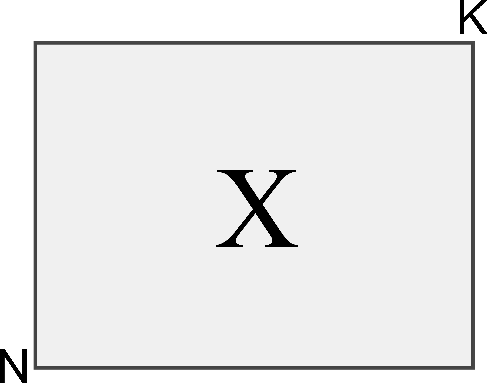

Consider the case of 2 variables, :math:`K=2` (left) and :math:`K=3` variables (right) for the room thermometers example :ref:`from earlier <LVM-room-temperature-example>`:

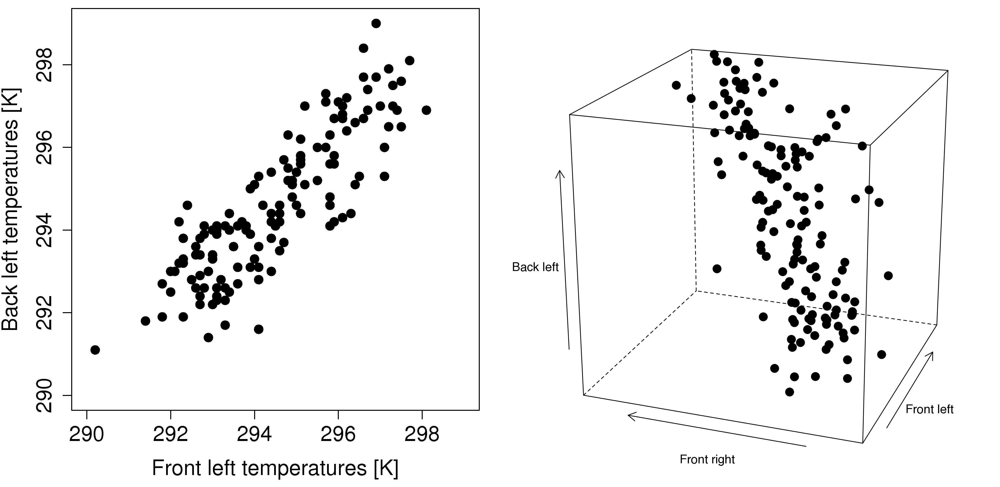

Each point in the plot represents one *object*, also called an *observation*.  There are about 150 observations in each plot here.  We sometimes call these plots *data swarms*, but they are really just ordinary scatterplots that we saw in the :ref:`visualization section <SECTION-data-visualization>`. Notice how the variables are correlated with each other, there is a definite trend.  If we want to explain this trend, we could draw a line through the cloud swarm that *best explains* the data.   This line now represents our best summary and estimate of what the data points are describing. If we wanted to describe that relationship to our colleagues we could just give them the equation of the best-fit line.

.. _LVM_visualization_scatterplot_matrix:

Another effective way to visualize small multivariate data sets is to use a scatterplot matrix. Below is an example for :math:`K = 5` measurements on :math:`N=50` observations. Scatterplot matrices require :math:`K(K-1)/2` plots and can be enhanced with univariate histograms (on the diagonal plots), and linear regressions and loess smoothers on the off-diagonals to indicate the level of correlation between any two variables.

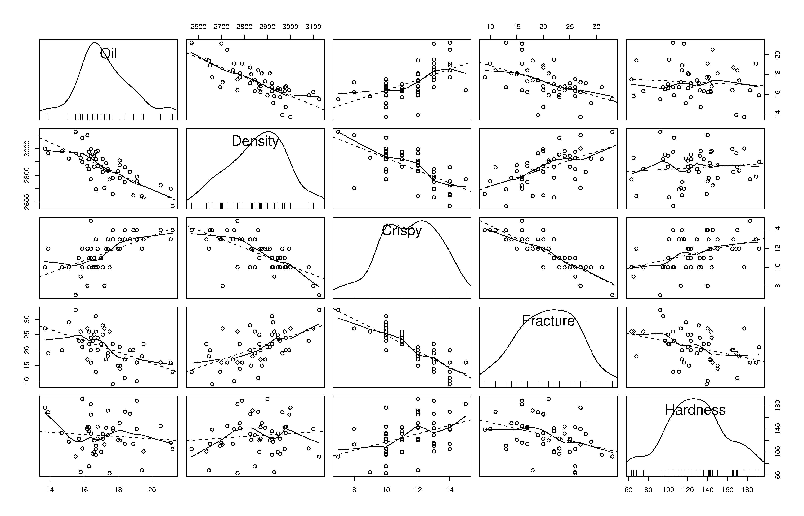

.. _LVM_PCA_geometric_interpretation:

Geometric explanation of PCA
====================================

.. index::
	pair: principal component analysis; latent variable modelling

We refer to a :math:`K`-dimensional space when referring to the data in |X|.  We will start by looking at the geometric interpretation of PCA when |X| has 3 columns, in other words a 3-dimensional space, using measurements: :math:`[x_1, x_2, x_3]`.

.. figure:: images/geometric-PCA-1-and-2-swarm-with-mean.png
	:alt: 	images/geometric-interpretation-of-PCA.svg
	:width: 900px
	:scale: 100
	:align: center

The raw data in the cloud swarm show how the 3 variables move together.  The first step in PCA is to move the data to the center of the coordinate system.  This is called mean-centering and removes the arbitrary bias from measurements that we don't wish to model.  We also scale the data, usually to unit-variance.  This removes the fact that the variables are in different units of measurement.  Additional discussion on centering and scaling is :ref:`in the section on data preprocessing <LVM_preprocessing>`.

After centering and scaling we have moved our raw data to the center of the coordinate system and each variable has equal scaling.

The best-fit line is drawn through the swarm of points.  The more correlated the original data, the better this line will explain the actual values of the observed measurements. This best-fit line will *best explain* all the observations with minimum residual error.   Another, but equivalent, way of expressing this is that the line goes in the direction of *maximum variance of the projections onto the line*.  Let's take a look at what that phrase means.

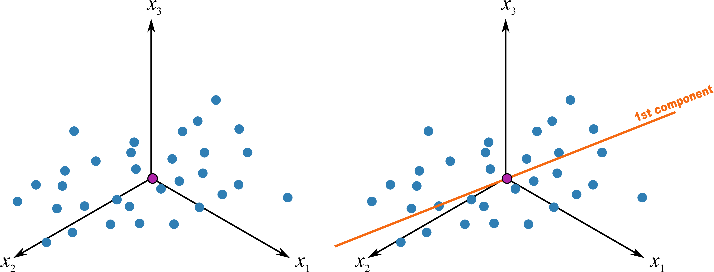

When the direction of the best-fit line is found we can mark the location of each observation along the line.  We find the 90 degree projection of each observation onto the line (see the next illustration).  The distance from the origin to this projected point along the line is called the *score*.  Each observation gets its own score value.  When we say the best-fit line is in the direction of maximum variance, what we are saying is that the variance of these scores will be maximal. (There is one score for each observation, so there are :math:`N` score values; the variance of these :math:`N` values is at a maximum).  Notice that some score values will be positive and others negative.  

After we have added this best-fit line to the data, we have calculated the first principal component, also called the first latent variable.  Each principal component consists of two parts:

	*	The direction vector that defines the best-fit line.  This is a :math:`K`-dimensional vector that tells us which direction that best-fit line points, in the :math:`K`-dimensional coordinate system.  We call this direction vector |p1|, it is a :math:`K \times 1` vector.  This vector starts at the origin and moves along the best-fit line.  Since vectors have both magnitude and direction, we chose to rescale this vector so that it has magnitude of exactly 1, making it a unit-vector.
	
	*	The collection of :math:`N` score values along this line.  We call this our score vector, :math:`\mathbf{t}_1`, and it is an :math:`N \times 1` vector.
	
	*	The subscript of "1" emphasizes that this is the first latent variable.

.. image:: images/geometric-PCA-5-and-6-first-component-with-projections-and-second-component.png
	:alt: 	images/geometric-interpretation-of-PCA.svg
	:width: 900px
	:scale: 100
	:align: center

This first principal component is fixed and we now add a second component to the system.  We find the second component so that it is perpendicular to the first component's direction.  Notice that this vector also starts at the origin, and can point in any direction as long as it remains perpendicular to the first component.  We keep rotating the second component's direction vector around until we find a direction that gives the greatest variance in the score values when projected on this new direction vector.

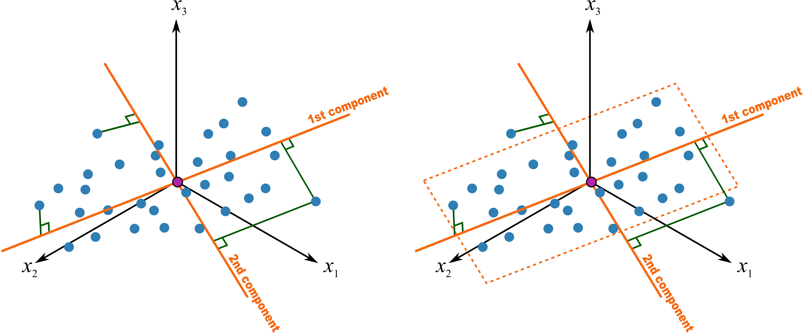

What that means is that once we have settled on a direction for the second component, we calculate the scores values by perpendicularly projecting each observation towards this second direction vector.  The score values for the second component are the locations along this line.  As before, there will be some positive and some negative score values.  This completes our second component:

	* This second direction vector, called :math:`\mathbf{p}_2`, is also a :math:`K \times 1` vector.  It is a unit vector that points in the direction of next-greatest variation.
	
	* The scores (distances), collected in the vector called :math:`\mathbf{t}_2`, are found by taking a perpendicular projection from each observation onto the :math:`\mathbf{p}_2` vector.
	
Notice that the |p1| and :math:`\mathbf{p}_2` vectors jointly define a plane.  This plane is the *latent variable model* with two components.  With one component the latent variable model is just a line, with two components, the model is a plane, and with 3 or more components, the model is defined by a hyperplane.  We will use the letter :math:`a` to identify the number of components.  The PCA model is said to have :math:`A` components, or :math:`A` latent variables, where :math:`a = 1, 2, 3, \ldots A`.

This hyperplane is really just the best approximation we can make of the original data.  The perpendicular distance from each point onto the plane is called the *residual distance* or *residual error*.  So what a principal component model does is break down our raw data into two parts:

 	#.	a latent variable model (given by vectors :math:`\mathbf{p}` and :math:`\mathbf{t}`), and 

 	#.	a residual error.

A principal component model is one type of latent variable model.  A PCA model is computed in such a way that the latent variables are oriented in the *direction that gives greatest variance* of the scores.   There are other latent variable models, but they are computed with different objectives.

.. _LVM-mathematical-geometric-derivation:

Mathematical derivation for PCA
====================================

Geometrically, when finding the *best-fit line* for the swarm of points, our objective was to minimize the error, i.e. the residual distances from each point to the best-fit line is the smallest possible.  This is also mathematically equivalent to maximizing the variance of the scores, :math:`\mathbf{t}_a`.

..	See Normal Cliff, Analyzing Multivariate Data, 1987, p 295 to 300

We briefly review here what that means. Let :math:`\mathbf{x}'_i` be a row from our data, so :math:`\mathbf{x}'_i` is a :math:`1 \times K` vector. We defined the score value for this observation as the distance from the origin, along the direction vector, |p1|, to the point where we find the perpendicular projection onto |p1|. This is illustrated below, where the score value for observation :math:`\mathbf{x}_i` has a value of :math:`t_{i,1}`.

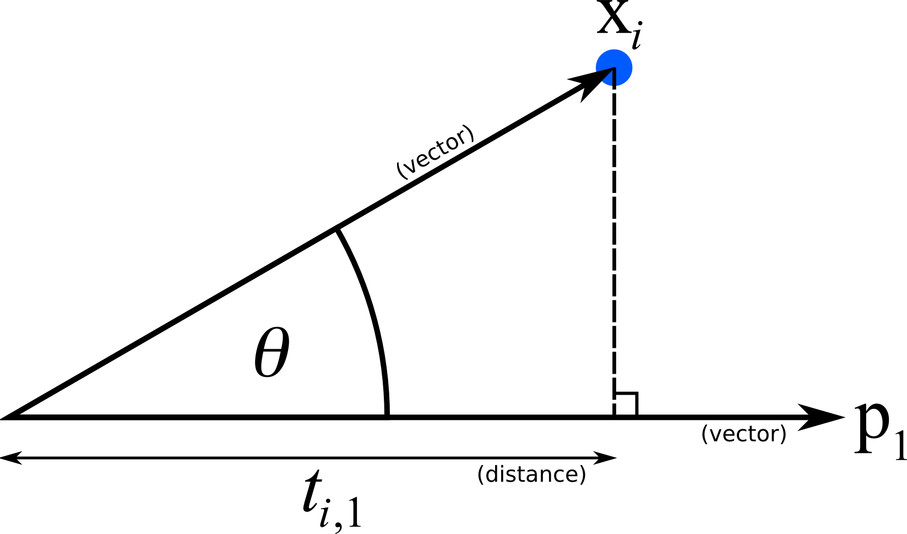

Recall from geometry that the cosine of an angle in a right-angled triangle is the ratio of the adjacent side to the hypotenuse. But the cosine of an angle is also used in linear algebra to define the dot-product. Mathematically:

.. math::	
	\cos \theta = \dfrac{\text{adjacent length}}{\text{hypotenuse}} = \dfrac{t_{i,1}}{\| \mathbf{x}_i\|} \qquad &\text{and also} \qquad \cos \theta = \dfrac{\mathbf{x}'_i \mathbf{p}_1}{\|\mathbf{x}_i\| \|\mathbf{p}_1\|} \\
	\dfrac{t_{i,1}}{\| \mathbf{x}_i\|} &= \dfrac{\mathbf{x}'_i \mathbf{p}_1}{\|\mathbf{x}_i\| \|\mathbf{p}_1\|} \\
	t_{i,1} &= \mathbf{x}'_i \mathbf{p}_1 \\
	(1 \times 1) &= (1 \times K)(K \times 1)
		
where :math:`\| \cdot \|` indicates the length of the enclosed vector, and the length of the direction vector, |p1| is 1.0, by definition.

Note that :math:`t_{i,1} = \mathbf{x}'_i \mathbf{p}_1` represents a :ref:`linear combination <LVM_linear_combination>`

.. math:: 
	t_{i,1} = x_{i,1} p_{1,1} + x_{i,2} p_{2,1} + \ldots + x_{i,k} p_{k,1}  + \ldots + x_{i,K} p_{K,1}

So :math:`t_{i,1}` is the score value for the :math:`i^\text{th}` observation along the first component, and is a linear combination of the :math:`i^\text{th}` row of data, :math:`\mathbf{x}_i` and the direction vector |p1|.  Notice that there are :math:`K` terms in the linear combination: each of the :math:`K` variables *contributes* to the overall score.

We can calculate the second score value for the :math:`i^\text{th}` observation in a similar way:

.. math:: 
	t_{i,2} = x_{i,1} p_{1,2} + x_{i,2} p_{2,2} + \ldots + x_{i,k} p_{k,1}  + \ldots + x_{i,K} p_{K,2}

And so on, for the third and subsequent components.  We can compactly write in matrix form for the :math:`i^\text{th}` observation that:

.. math::
	\mathbf{t}'_i &= \mathbf{x}'_i \mathbf{P} \\
	(1 \times A)   &= (1 \times K)(K \times A)

which calculates all :math:`A` score values for that observation in one go. This is exactly what we :ref:`derived earlier <LVM_linear_combination>` in the example with the 4 thermometers in the room.

Finally, for an entire matrix of data, |X|, we can calculate all scores, for all observations:

.. math::
	\mathbf{T}   &= \mathbf{X} \mathbf{P} \\
	(N \times A) &= (N \times K)(K \times A)
	:label: LVM-score-values

More about the direction vectors (loadings)
=============================================

The direction vectors |p1|, :math:`\mathbf{p}_2` and so on, are each :math:`K \times 1` unit vectors.  These are vectors in the original coordinate space (the :math:`K`-dimensional real-world) where the observations are recorded.

But these direction vectors are also our link to the latent-variable coordinate system.  These direction vectors create a (hyper)plane that is embedded inside the :math:`K`-dimensional space of the :math:`K` original variables.  You will see the terminology of *loadings* - this is just another name for these direction vectors:

.. math::
	\text{Loadings, a $K \times A$ matrix:}\qquad\qquad \mathbf{P} = \begin{bmatrix} \mathbf{p}_1 & \mathbf{p}_2 & \ldots & \mathbf{p}_A \end{bmatrix}

Once this hyperplane is mapped out, then we start to consider how each of the observations lie on this hyperplane. We start to be more and more interested in this reduced dimensional plane, because it is an :math:`A`-dimensional plane, where :math:`A` is often much smaller than :math:`K`.  Returning back to the case of the thermometers in a room: we had 4 thermometers (:math:`K=4`), but only one latent variable, :math:`A=1`.  Rather than concern ourself with the original 4 measurements, we only focus on the single column of score values, since this single variables is the best summary possible of the 4 original variables.

How do we get the score value(s): we just use equation :eq:`LVM-score-values` and multiply the data by the loadings vectors.  That equation, repeated here:

.. math::
	\mathbf{T}   &= \mathbf{X} \mathbf{P} \\
	(N \times A) &= (N \times K)(K \times A)

shows how the loadings are our link from the :math:`K`-dimensional, real-world, coordinate system to the :math:`A`-dimensional, latent variable-world, coordinates.

Let's return to the :ref:`example of the 4 temperatures <LVM-room-temperature-example>`.  We derived there that a plausible summary of the 4 temperatures could be found from:

.. math::
	t_1 &= \begin{bmatrix} x_1 & x_2 & x_3 & x_4 \end{bmatrix}\begin{bmatrix} p_{1,1} \\ p_{2,1} \\ p_{3,1} \\ p_{4,1} \end{bmatrix} = \begin{bmatrix} x_1 & x_2 & x_3 & x_4 \end{bmatrix}\begin{bmatrix} 0.25 \\ 0.25 \\ 0.25 \\ 0.25 \end{bmatrix}  = \mathbf{x}_i \mathbf{p}_1

So the loading vector for this example points in the direction :math:`\mathbf{p}'_1 = [0.25, 0.25, 0.25, 0.25]`.  This isn't a unit vector though; but we can make it one:

	*	Current magnitude of vector = :math:`\sqrt{0.25^2 + 0.25^2 + 0.25^2 + 0.25^2} = 0.50`
	
	*	Divide the vector by current magnitude: :math:`\mathbf{p}_1 = \dfrac{1}{0.5} \cdot [0.25, 0.25, 0.25, 0.25]`
	
	*	New, unit vector = :math:`\mathbf{p}_1 = [0.5, 0.5, 0.5, 0.5]`
	
	*	Check new magnitude = :math:`\sqrt{0.5^2 + 0.5^2 + 0.5^2 + 0.5^2} = 1.0`

What would be the entries in the |p1| loading vector if we had 6 thermometers? (*Ans* = 0.41; in general, for :math:`K` thermometers, :math:`1/\sqrt{K}`).

This is very useful, because now instead of dealing with :math:`K` thermometers we can reduce the columns of data down to just a single, average temperature. This isn't a particularly interesting case though; you would have likely done this anyway as an engineer facing this problem.  But the next :ref:`food texture example <LVM_food_texture_example>` will illustrate a more realistic case.

.. _LVM_food_texture_example:

Food texture example
====================================

Let's take a look at an example to consolidate and extend the ideas introduced so far.  This `data set is from a food manufacturer <http://datasets.connectmv.com/info/food-texture>`_ making a pastry product.  Each sample (row) in the data set is taken from a batch of product where 5 quality attributes are measured:

	#.	Percentage oil in the pastry
	#.	The product's density (the higher the number, the more dense the product)
	#.	A crispiness measurement, on a scale from 7 to 15, with 15 being more crispy.
	#.	The product's fracturability: the angle, in degrees, through which the pasty can be slowly bent before it fractures.
	#.	Hardness: a sharp point is used to measure the amount of force required before breakage occurs. 
	
A scatter plot matrix of these :math:`K = 5` measurements is shown for the :math:`N=50` observations.

We can get by with this visualization of the data because :math:`K` is small in this case.  This is also a good starting example, because you can refer back to these scatterplots to confirm your findings.

**Preprocessing the data**

The first step with PCA is to center and scale the data.  The box plots show how the raw data are located at different levels and have arbitrary units.  

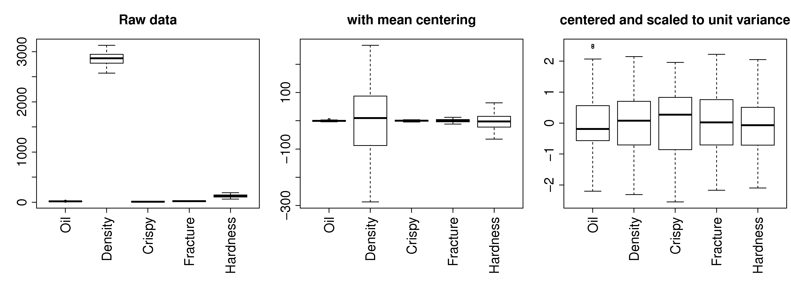

Centering removes any bias terms from the data by subtracting the mean value from each column in the matrix |X|. For the :math:`k^\text{th}` column:

.. math::

 	\mathbf{x}_{k,\text{center}} = \mathbf{x}_{k,\text{raw}} - \text{mean}\left(\mathbf{x}_{k,\text{raw}}\right)

Scaling removes the fact that the raw data could be in diverse units: 

.. math::

	\mathbf{x}_{k} = \dfrac{\mathbf{x}_{k,\text{center}}}{ \text{standard deviation}\left(\mathbf{x}_{k,\text{center}}\right) }

Then each column :math:`\mathbf{x}_{k}` is collected back to form matrix |X|.  This preprocessing is so common it is called :index:`autoscaling`: center each column to zero mean and then scale it to have unit variance.  After this preprocessing each column will have a mean of 0.0 and a variance of 1.0.  (Note the box plots don't quite show this final result, because they use the median instead of the mean, and show the interquartile range instead of the standard deviation).

Centering and scaling does not alter the overall interpretation of the data: if two variables were strongly correlated before preprocessing they will still be strongly correlated after preprocessing.

For reference, the mean and standard deviation of each variable is recorded below.  In the last 3 columns we show the raw data for observation 33, the raw data after centering, and the raw data after centering and scaling:

.. tabularcolumns:: |l||l|l||r|r|r|

.. csv-table:: 
   :header: Variable, Mean, Standard deviation, Raw data, After centering, After autoscaling
   :widths: 30, 30, 30, 30, 30, 30

	Oil,      17.2,      1.59, 15.5, -1.702, -1.069
	Density,  2857.6,  124.5,  3125, 267.4, +2.148  
	Crispy,   11.52,     1.78, 7, -4.52, -2.546 
	Fracture, 20.86,     5.47, 33,  12.14, +2.221
	Hardness,  128.18,   31.13, 92, -36.18, -1.162

**Loadings:** :math:`\,\mathbf{p}_1`

We will discuss how to determine the number of components to use :ref:`in a future section <LVM-number-of-components>`, and :ref:`how to compute them <LVM-algorithms-for-PCA>`, but for now we accept there are two important components, |p1| and :math:`\mathbf{p}_2`.  They are:

.. math:: 
	\mathbf{p}_1 = \begin{bmatrix} +0.46 \\  -0.47 \\ +0.53 \\ -0.50 \\ +0.15 \end{bmatrix} \qquad \text{and} \qquad 
	\mathbf{p}_2 = \begin{bmatrix} -0.37 \\  +0.36 \\ +0.20 \\ -0.22 \\ +0.80 \end{bmatrix}

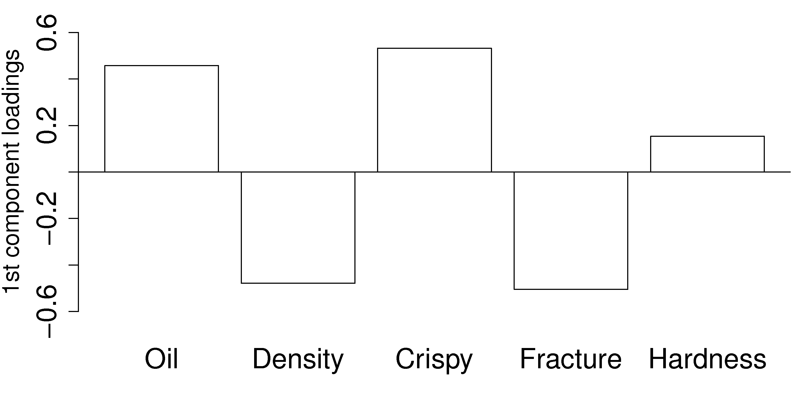

This plot shows the first component.  All variables, except for hardness have large values in :math:`\mathbf{p}_1`.  If we write out the equation for :math:`t_1` for an observation :math:`i`:

.. math::
	t_{i,1} = 0.46 \,\, x_\text{oil} - 0.47 \,\, x_\text{density} + 0.53 \,\, x_\text{crispy} - 0.50 \,\, x_\text{fracture}  + 0.15 \,\, x_\text{hardness}
	:label: LVM_t1_food_texture_

Once we have centered and scaled the data, remember that a negative :math:`x`-value is a value below the average, and that a positive :math:`x`-value lies above the average.

For a pastry product to have a high :math:`t_1` value would require it to have some combination of above-average oil level, low density, and/or be more crispy and/or only have a small angle by which it can be bent before it fractures, i.e. low fracturability.  So pastry observations with high :math:`t_1` values sound like they are brittle, flaky and light.  Conversely, a product with low :math:`t_1` value would have the opposite sort of conditions: it would be a heavier, more chewy pastry (higher fracture angle) and less crispy.

**Scores:** :math:`\,\mathbf{t}_1`

Let's examine the score values calculated.  As shown in equation :eq:`LVM_t1_food_texture_`, the score value is a linear combination of the data, :math:`\mathbf{x}`, given by the weights in the loadings matrix, |P|.  For the first component, :math:`\mathbf{t}_1 = \mathbf{X} \mathbf{p}_1`.  The plot here shows the values in vector :math:`\mathbf{t}_1` (an :math:`N \times 1` vector):

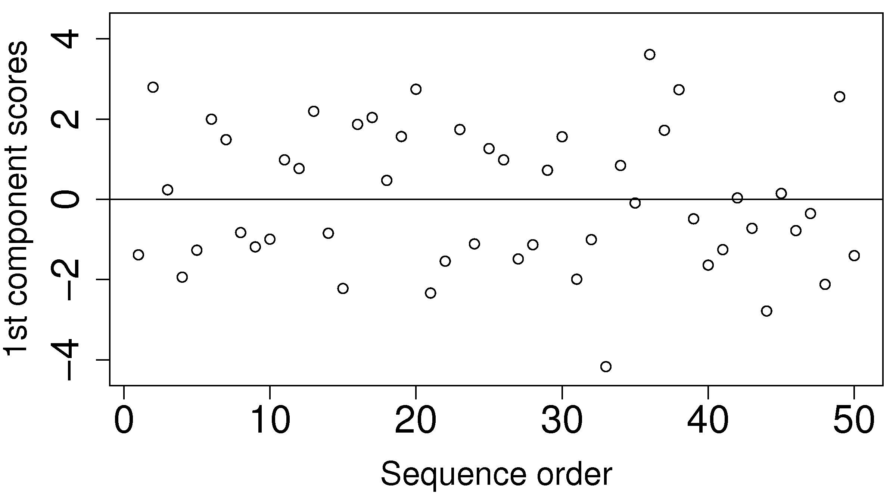
	
The samples appear to be evenly spread, some high and some low on the :math:`t_1` scale.  Sample 33 has a :math:`t_1` value of -4.2, indicating it was much denser than the other pastries, and had a high fracture angle (it could be bent more than others).  In fact, if we `refer to the raw data <http://datasets.connectmv.com/info/food-texture>`_ we can confirm these findings: :math:`\mathbf{x}_{i=33} = [15.5, \,\, 3125, \,\, 7, \,\, 33, \,\, 92]`.  Also refer back to the scatterplot matrix and mark the point which has density of 3125, and fracture angle of 33.  This pastry also has a low oil percentage (15.5%) and low crispy value (7).

We can also investigate sample 36, with a :math:`t_1` value of 3.6.  The raw data again confirm that this pastry follows the trends of other, high :math:`t_1` value pastries.  It has a high oil level, low density, high crispiness, and a low fracture angle: :math:`x_{36} = [21.2, \,\, 2570, \,\, 14, \,\, 13, \,\, 105]`.  Locate again on the scatterplot matrices sample 36 where oil level is 21.2 and the crispiness is 14.  Also mark the point where density = 2570 and the fracture value = 13 for this sample.

We note here that this component explains 61% of the original variability in the data.  It's hard to say whether this is high or low, because we are unsure of the degree of error in the raw data, but the point is that a single variable summarizes about 60% of the variability from all 5 columns of raw data.

.. TODO: summarize here the correlation vs causality effects

**Loadings:** :math:`\,\mathbf{p}_2`

The second loading vector is shown as a bar plot:

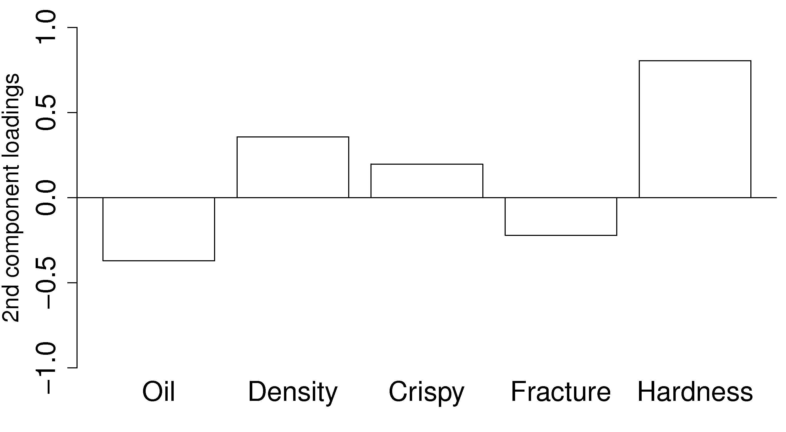

This direction is aligned mainly with the hardness variable: all other variables have a small coefficient in :math:`\mathbf{p}_2`. A high :math:`t_2` value is straightforward to interpret: it would imply the pastry has a high value on the hardness scale.  Also, this component explains an additional 26% of the variability in the dataset. 

Because this component is orthogonal to the first component, we can be sure that this hardness variation is independent of the first component.  One valuable way to interpret and use this information is that you can adjust the variables in :math:`\mathbf{p}_2`, i.e. the process conditions that affect the pastry's hardness, without affecting the other pastry properties, i.e the variables described in :math:`\mathbf{p}_1`.

.. _LVM_interpreting_scores:

Interpreting score plots
====================================

.. index::
	pair: interpret score plot; latent variable modelling

Before summarizing some points about how to interpret a score plot, let's quickly repeat what a score value is.  There is one score value for each observation (row) in the data set, so there are are :math:`N` score values for the first component, another :math:`N` for the second component, and so on.

The score value for an observation, for say the first component, is the distance from the origin, along the direction (loading vector) of the first component, up to the point where that observation projects onto the direction vector.  We repeat :ref:`an earlier figure here <LVM_PCA_geometric_interpretation>`, which shows the projected values for 2 of the observations.

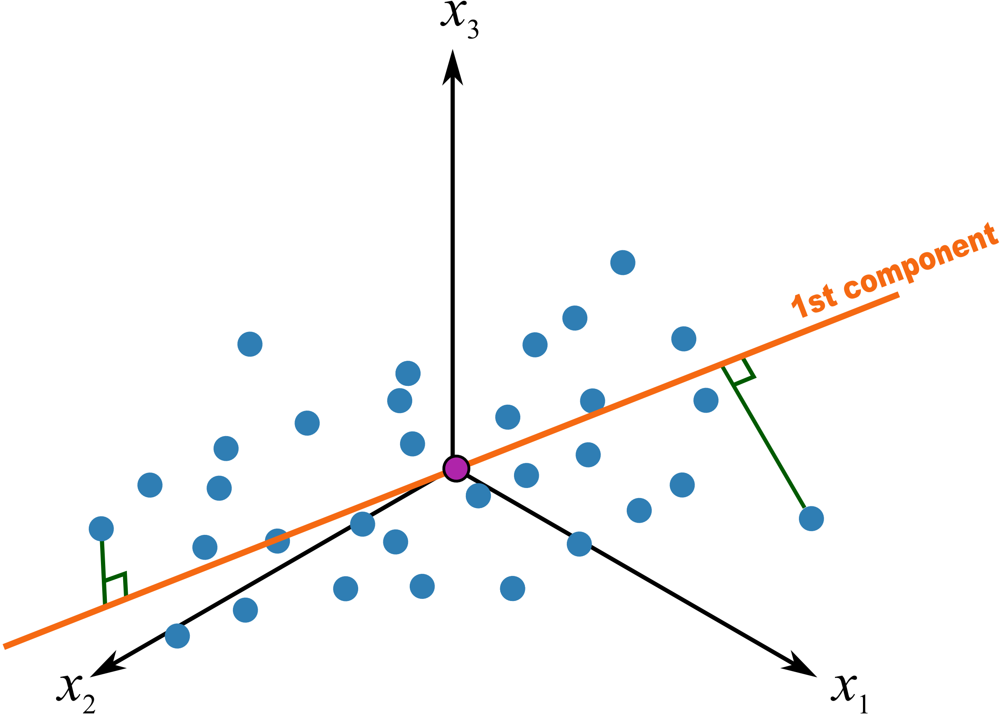

We used :ref:`geometric concepts in another section <LVM-mathematical-geometric-derivation>` that showed we can write: :math:`\mathbf{T} = \mathbf{X}\mathbf{P}` to get all the scores value in one go.  In this section we are plotting values from the columns of :math:`\mathbf{T}`.  In particular, for a single observation, for the :math:`a^\text{th}` component:

.. math:: 
	t_{i,a} = x_{i,1}\,\, p_{1,a} + x_{i,2}\,\, p_{2,a} + \ldots + x_{i,k}\,\, p_{k,a} + \ldots + x_{i,K}\,\, p_{K,a}

The first score vector, :math:`\mathbf{t}_1`,explains the greatest variation in the data; it is considered the most important score from that point of view, at least when we look at a data set for the first time.  (After that we may find other scores that are more interesting).  Then we look at the second score, which explains the next greatest amount of variation in the data, then the third score, and so on.  Most often we will plot:

	*	time-series plots of the scores, or sequence order plots, depending on how the rows of |X| are ordered
	
	*	scatter plots of one score against another score
	
An important point with PCA is that because the matrix |P| is orthonormal (see the :ref:`later section on PCA properties <LVM-PCA-properties>`), any relationships that were present in |X| are still present in :math:`\mathbf{T}`.  We can see this quite easily using the previous equation. Imagine two observations taken from a process at different points in time.  It would be quite hard to identify those similar points by looking at the :math:`K` columns of raw data, especially when the two rows are not close to each other.  But with PCA, these two similar rows are multiplied by the same coefficients in |P| and will therefore give similar values of :math:`t`. So score plots allow us to rapidly locate similar observations.

When investigating score plots we look for *clustering*, *outliers*, time-based *patterns*.  We can also colour-code our plots to be more informative.  Let's take a look at each of these.

**Clustering**

We usually start by looking at the :math:`(\mathbf{t}_1, \mathbf{t}_2)` scatterplot of the scores, the two directions of greatest variation in the data. As just previously explained, observations in the rows of |X| that are similar will fall close to each other, i.e. they cluster together, in these score plots.  Here is an example of a score plot, calculated from data from a fluidized catalytic cracking (FCC) process [Taken from the Masters thesis of Carol Slama (McMaster University, p 78, 1991)].
	
.. _LVM_slama_thesis_screenshot_:

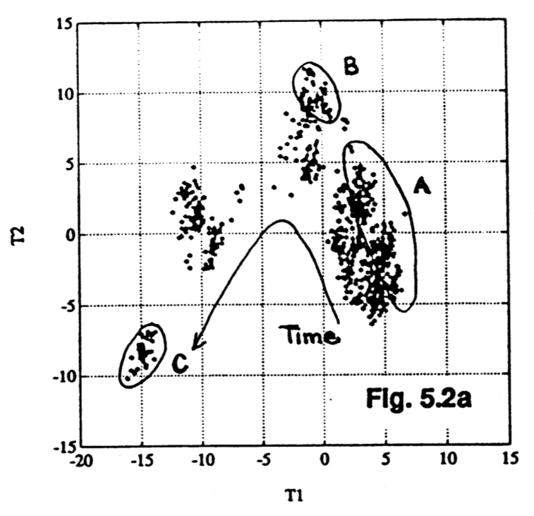

It shows how the process was operating in region A, then moved to region B and finally region C. This provides a 2-dimensional window into the movements from the :math:`K=147` original variables.

**Outliers**

Outliers are readily detected in a score plot, and using the equation below we can see why.  Recall that the data in |X| have been centered and scaled, so the :math:`x`-value for a variable that is operating at the mean level will be roughtly zero.  An observation that is at the mean value for all :math:`K` variables will have a score vector of :math:`\mathbf{t}_i = [0, 0, \ldots, 0]`.  An observation where many of the variables have values far from their average level is called a multivariate outlier.  It will have one or more score values that are far from zero, and will show up on the outer edges of the score scatterplots.  

Sometimes all it takes is for one variable, :math:`x_{i,k}` to be far away from its average to cause :math:`t_{i,a}` to be large:

.. math:: 
	t_{i,a} = x_{i,1}\,\, p_{1,a} + x_{i,2} \,\, p_{2,a} + \ldots + x_{i,k} \,\, p_{k,a} + \ldots + x_{i,K} \,\, p_{K,a} 
	
But usually it is a combination of more than one :math:`x`-variable.  There are :math:`K` terms in this equation, each of which *contribute* to the score value.  A bar plot of each of these :math:`K` terms, :math:`x_{i,k} \,\, p_{k,a}`, is called a contribution plot.  It shows which variable(s) most contribute to the large score value.

As an example from the :ref:`food texture data <LVM_food_texture_example>` from earlier, we saw that observation 33 had a large negative :math:`\mathbf{t}_1` value.  From equation :eq:`LVM_t1_food_texture_`:

.. math::

	t_{33,1} &= 0.46 \,\, x_\text{oil} - 0.47 \,\, x_\text{density} + 0.53 \,\, x_\text{crispy} - 0.50 \,\, x_\text{fracture}  + 0.15 \,\, x_\text{hardness}\\
	t_{33,1} &= 0.46 \times -1.069 - 0.47 \times +2.148 + 0.53 \times  -2.546 - 0.50 \times 2.221 + 0.15 \times -1.162\\
	t_{33,1} &= -4.2
	
The :math:`K=5` terms that contribute to this value are illustrated as a bar plot, where the sum of the bar heights add up to :math:`-4.2`:

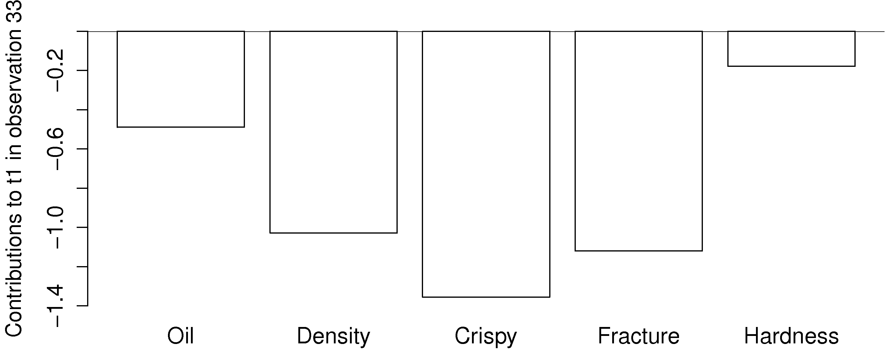
	
This gives a more accurate indication of exactly how the low :math:`t_i` value was achieved. Previously we had said that pastry 33 was denser than the other pastries, and had a higher fracture angle; now we can see the relative contributions from each variable more clearly.

In the figure from the FCC process (in the :ref:`preceding subsection on clustering <LVM_slama_thesis_screenshot_>`), the cluster marked C was far from the origin, relative to the other observations.  This indicates problematic process behaviour around that time.  Normal process operation is expected to be in the center of the score plot.  These outlying observations can be investigated as to why they are unusual by constructing contribution bar plots for a few of the points in cluster C.

**Time-based or sequence-based trends**

Any strong and consistent time-based or sequence-order trends in the raw data will be reflected in the scores also.  Visual observation of each score vector may show interesting phenomena such as oscillations, spikes or other patterns of interest.  As just described, contribution plots can be used to see which of the original variables in |X| are most related with these phenomena.

**Colour-coding**

Plotting any two score variables on a scatter plot provides good insight into the relationship between those independent variables.  Additional information can be provided by :ref:`colour-coding the points on the plot <reference_to_use_of_colour>` by some other, 3rd variable of interest.  For example, a binary colour scheme could denote success of failure of each observation. 

A continuous 3rd variable can be implied using a varying colour scheme, going from reds to oranges to yellows to greens and then blue, together with an accompanying legend. For example profitability of operation at that point, or some other process variable. A 4th dimension could be inferred by plotting smaller or larger points.  We saw an example of these :ref:`high-density visualizations <reference_to_use_of_colour>` earlier.

**Summary**

*	Points close the average appear at the origin of the score plot.

*	Scores further out are either outliers or naturally extreme observations.

*	We can infer, *in general*, why a point is at the outer edge of a score plot by cross-referencing with the loadings.  This is because the scores are a linear combination of the data in |X| as given by the coefficients in |P|.

*	We can *determine exactly why* a point is at the outer edge of a score plot by constructing a contribution plot to see which of the original variables in |X| are most related with a particular score.  This provides a more precise indication of exactly why a score is at its given position.

*	Original observations in |X| that are similar to each other will be similar in the score plot, while observations much further apart are dissimilar.  This comes from the way the scores are computed: they are found so that span the greatest variance possible.  But it is much easier to detect this similarity in an :math:`A`-dimensional space than the original :math:`K`-dimensional space.

.. _LVM-interpreting-loadings:

Interpreting loading plots
====================================
	
Recall that the :index:`loadings plot <pair: loadings plot, interpretation of; latent variable modelling>` is a plot of the direction vectors that define the model.  Returning back to a previous illustration:

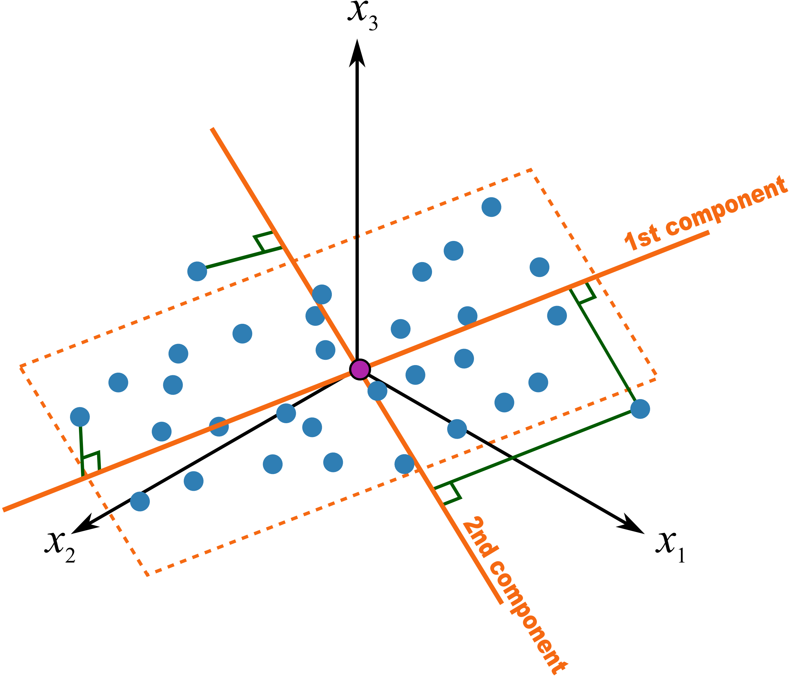

In this system the first component, :math:`\mathbf{p}_1`, is oriented primarily in the :math:`x_2` direction, with smaller amounts in the other directions. A loadings plot would show a large coefficient (negative or positive) for the :math:`x_2` variable and smaller coefficients for the others. Imagine this were the only component in the model, i.e. it is a one-component model.  We would then correctly conclude the other variables measured have little importance or relevance in understanding the total variability in the system.  Say these 3 variables represented the quality of our product, and we had been getting complaints about the variability of it.  This model indicates we should focus on whatever aspect causes in variance in :math:`x_2`, rather than other variables.

Let's consider another visual example where two variables, :math:`x_1` and :math:`x_2`, are the predominant directions in which the observations vary; the :math:`x_3` variable is only "noise". Further, let the relationship between :math:`x_1` and :math:`x_2` have a negative correlation.

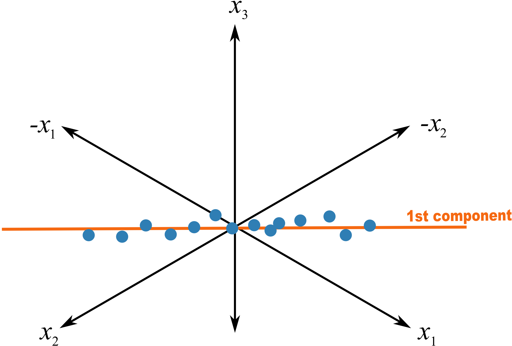

A model of such a system would have a loading vector with roughly equal weight in the :math:`+x_1` direction as it has in the :math:`-x_2` direction.  The direction could be represented as :math:`p_1 = [+1,\, -1,\, 0]`, or rescaled as a unit vector:  :math:`p_1 = [+0.707,\, -0.707,\, 0]`. An equivalent representation, with exactly the same interpretation, could be :math:`p_1 = [-0.707,\, +0.707,\, 0]`.

This illustrates two points: 

	*	Variables which have little contribution to a direction have almost zero weight in that loading.  
	*	Strongly correlated variables, will have approximately the same weight value when they are positively correlated. In a loadings plot of :math:`p_i` vs :math:`p_j` they will appear near each other, while negatively correlated variables will appear diagonally opposite each other.
	*	Signs of the loading variables are useful to compare within a direction vector; but these vectors can be rotated by 180° and still have the same interpretation.
	
This is why they are called loadings: the show how the original variables load, (contribute), to creating the component.
	
Another issue to consider is the case when one has many highly correlated variables.  Consider the :ref:`room temperature example <LVM-room-temperature-example>` where the four temperatures are highly correlated with each other.  The first component from the PCA model is shown here:

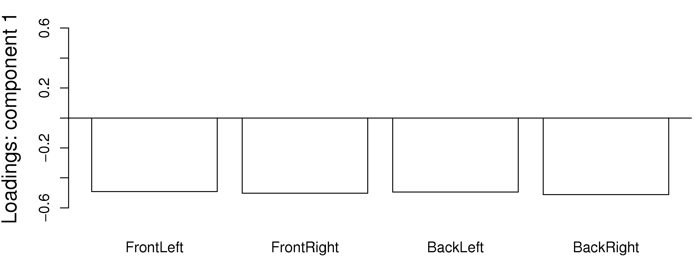

Notice how the model spreads the weights out evenly over all the correlated variables.  Each variable is individually important. The model could well have assigned a weight of 1.0 to one of the variables and 0.0 to the others. This is a common feature in latent variable models: variables which have roughly equal influence on defining a direction are correlated with each other and will have roughly equal numeric weights.

Finally, one way to locate unimportant variables in the model is by finding which variables which have small weights in all components.  These variables can generally be removed, as they show no correlation to any of the components or with other variables.

Interpreting loadings and scores together
==========================================

It is helpful to visualize any two score vectors, e.g. :math:`\mathbf{t}_1` *vs* :math:`\mathbf{t}_2`, in a scatterplot: the :math:`N` points in the scatterplot are the projection of the raw data onto the model plane described by the two loadings vectors, :math:`\mathbf{p}_1` and :math:`\mathbf{p}_2`.  

Any two loadings can also be shown in a scatterplot and interpreted by recalling that each loading direction is orthogonal and independent of the other direction.

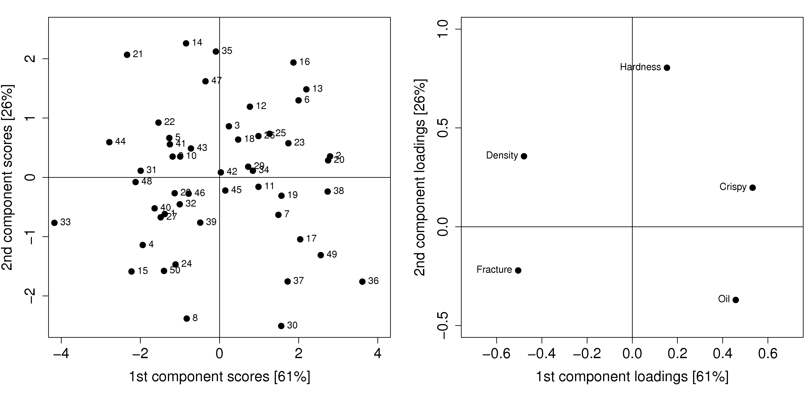
	
Side-by-side, these 2 plots very helpfully characterize all the observations in the data set.  Recall observation 33 had a large, negative :math:`t_1` value.  It had an above average fracture angle, an above average density, a below average crispiness value of 7, and below average oil level of 15.5.

It is no coincidence that we can mentally superimpose these two plots and come to exactly the same conclusions, using only the plots.  This result comes from the fact that the scores (left) are just a linear combination of the raw data, with weighting given by the loadings (right).

Use these two plots to characterize what values the 5 measurements would have been for these observations:

	* sample 8:	
	* sample 20:
	* sample 35:
	* sample 42:

.. _LVM_geometric_predictions:

Predicted values for each observation
======================================

An interesting aspect of a PCA model is that it provides an estimate of each observation in the data set.  Recall the latent variable model was oriented to create the best-fit plane to the data.  This plane was oriented to minimize the errors, which implies the best estimate of each observation is its *perpendicular projection* onto the model plane.

Referring to the illustration and assume we have a PCA model with a single component, the best estimate of observation :math:`\mathbf{x}_i` is the point along the direction vector, |p1|, where the original observation is projected.  Recall that the distance along that direction vector was :math:`t_{i,1}`, but the actual point along |p1| is a vector, and it is our best estimate of the original observation.  We will call that estimate :math:`\widehat{\mathbf{x}}_{i,1}`, indicating that it is an estimate of :math:`\mathbf{x}_i` along the first component.

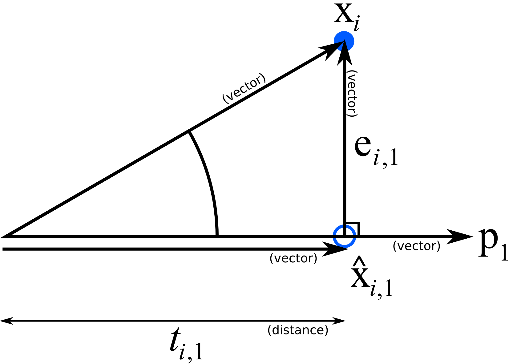

Since :math:`\widehat{\mathbf{x}}_{i,1}` is a vector, we can write it as the product of a magnitude value and a direction vector. The magnitude of :math:`\widehat{\mathbf{x}}_i` is :math:`t_i` in the direction of |p1|, which is a unit vector, then mathematically we can write:

.. math::
	\widehat{\mathbf{x}}_{i,1}' &= t_{i,1} \,\,\mathbf{p}'_1 \\
	(1 \times K) &= (1 \times 1)(1 \times K)
		
This is the best prediction of the original observation using one component.  If we added a second component to our model, then our estimate improves:

.. math::
	\widehat{\mathbf{x}}_{i,2}' &= t_{i,1}\,\, \mathbf{p}'_1 + t_{i,2}\,\, \mathbf{p}'_2 \\
	(1 \times K) &= (1 \times K) + (1 \times K)

With multiple components, we write:

.. math::
	\widehat{\mathbf{x}}_{i,A}' &= \begin{bmatrix}t_{i,1} & t_{i,2}, \,\,\ldots, \,\, t_{i,A} \end{bmatrix} \mathbf{P}'\\
	\widehat{\mathbf{x}}_{i,A}' &= \mathbf{t}'_i \, \mathbf{P}'\\
	(1 \times K) &= (1 \times A) (A \times K)

This is interesting: :math:`\widehat{\mathbf{x}}_{i,A}` is a prediction of every variable in the :math:`i^\text{th}` observation.  We only require the score values for that :math:`i^\text{th}` observation in order to get this prediction.  We multiply the scores :math:`\mathbf{t}_i` by the direction vectors in matrix |P| to get the prediction.  

.. TODO: image here showing vector arms

The preceding equation can be written in a way that handles the entire matrix |X|:

.. math:: 
	\widehat{\mathbf{X}} &= \mathbf{T}\mathbf{P}'\\
	(N \times K) &= (N \times A) (A \times K)
	:label: LVM-X-hat-prediction-PCA

Once we have the predicted value for an observation, we are also interested in the residual vector between the actual and predicted observation:

.. math::
	\mathbf{e}'_{i,A} &= \mathbf{x}'_i - \widehat{\mathbf{x}}'_{i,A} \\
	(1 \times K) &= (1 \times K) - (1 \times K)

.. You can add this to the above, but it doesn't advance the concepts for this particular section.  Rather leave it out for now.		
	\mathbf{e}_{i,A}'  &= \mathbf{x}'_i - \mathbf{t}'_i \mathbf{P}' \\
					   &= \mathbf{x}'_i - \mathbf{x}'_i \mathbf{P} \mathbf{P}' \\
					   &= \mathbf{x}'_i \left(I_{K \times K} - \mathbf{P} \mathbf{P}' \right)

The residual *length* or *distance* is the sum of squares of this residual, then we take the square root to form a distance.  Technically the *squared prediction error* (SPE) is just the sum of squares for each observation, but often we refer to the square root of this quantity as the SPE as well.  Some software packages will scale the root of the SPE by some value; you will see this referred to as the DModX, distance to the model plane for |X|. 

.. math::
	\text{SPE}_i &= \sqrt{\mathbf{e}'_{i,A} \mathbf{e}_{i,A}} \\
	(1 \times 1) &= (1 \times K)(K \times 1)
	
where :math:`\mathbf{e}_{i,A}` is the residual vector of the :math:`i^\text{th}` observation using :math:`A` components.

Interpreting the residuals
====================================

We consider three types of residuals: residuals within each row of |X|, called squared prediction errors (SPE); residuals for each column of |X|, called :math:`R^2_k` for each column, and finally residuals for the entire matrix |X|, usually just called :math:`R^2` for the model.

.. _LVM-interpreting-SPE-residuals:

Residuals for each observation: the square prediction error
~~~~~~~~~~~~~~~~~~~~~~~~~~~~~~~~~~~~~~~~~~~~~~~~~~~~~~~~~~~~~~~

We have already introduced the :ref:`squared prediction error geometrically <LVM_geometric_predictions>`. We showed in that section that the residual distance from the actual observation to the model plane is given by:

.. math:: 
	\mathbf{e}'_{i,A} &= \mathbf{x}'_i - \widehat{\mathbf{x}}'_{i,A} \\
	\mathbf{e}'_{i,A} &= \mathbf{x}'_i - \mathbf{t}'_i \mathbf{P}'

Turning this last equation around we have:
	
.. math:: 
	\mathbf{x}'_i &= \mathbf{t}'_i \mathbf{P}' + \mathbf{e}'_{i,A} \\
	(1 \times K) &= (1 \times A)(A \times K)  + (1 \times K) 

Or in general, for the whole data set

.. math::
	\mathbf{X} &= \mathbf{T} \mathbf{P}' + \mathbf{E} =  \widehat{\mathbf{X}} + \mathbf{E} \\
		(N \times K) &= (N \times A)(A \times K)  + (N \times K) 

This shows that each observation (row in |X|) can be split and interpreted in two portions: a vector on-the-plane, :math:`\mathbf{t}'_i \mathbf{P}' `, and a vector perpendicular to the plane, :math:`\mathbf{e}'_{i,A}`.  This residual portion, a vector, can be reduced to a single number, a distance value called SPE, as :ref:`previously described <LVM_geometric_predictions>`.

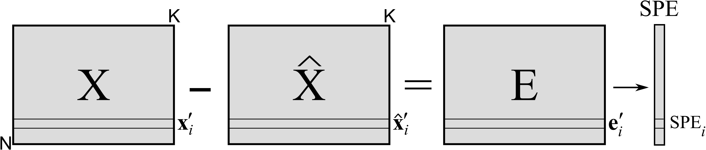

An observation in |X| that has :math:`\text{SPE}_i = 0` is exactly on the plane and follows the model structure exactly; this is the smallest SPE value possible.  For a given data set we have a distribution of SPE values.  We can calculate a confidence limit below which we expect to find a certain fraction of the data, e.g. a 95% confidence limit.  We won't go into how this limit is derived, suffice to say that most software packages will compute it and show it.

The most convenient way to visualize these SPE values is as a sequence plot, or a line plot, where the :math:`y`-axis has a lower limit of 0.0, and the 95% and/or 99% SPE limit is also shown.  Remember that we would expect 5 out of 100 points to naturally fall above the 95% limit.

If we find an observation that has a large squared prediction error, i.e. the observation is far off the model plane, then we say this observation is *inconsistent with the model*.  For example, if you have data from a chemical process, taken over several days, your first 300 observations show SPE values below the limit.  Then on the 4th day you notice a persistent trend upwards in SPE values: this indicates that those observations are inconsistent with the model, indicating a problem with the process, as reflected in the data captured during that time.

We would like to know why, specifically which variable(s) in |X|, are most related with this deviation off the model plane.  As we did in the section on :ref:`interpreting scores <LVM_interpreting_scores>`, we can generate a contribution plot.

.. math:: 
	\mathbf{e}'_{i,A} 	&= \mathbf{x}'_i - \widehat{\mathbf{x}}'_{i,A}
		
Dropping the :math:`A` subscript for convenience we can write the :math:`1 \times K` vector as:

.. math::
	\mathbf{e}'_{i} 	&= \mathbf{x}'_i - \widehat{\mathbf{x}}'_{i} \\
	(1 \times K)		&= \begin{bmatrix}(x_{i,1} - \hat{x}_{i,1}) & (x_{i,2} - \hat{x}_{i,2}) & \ldots & (x_{i,k} - \hat{x}_{i,k}) &  \ldots & (x_{i,K} - \hat{x}_{i,K})\end{bmatrix}

The SPE is just the sum of the squares of these :math:`K` terms, so a residual contribution plot, most conveniently shown as a bar chart of these :math:`K` terms, indicates which of the original :math:`K` variable(s) are most associated with the deviation off the model plane.  We say that the *correlation structure among these variables has been broken*. This is because PCA provides a model of the correlation structure in the data table.  When an observation has a large residual, then that observation is said to break the correlation structure, and is inconsistent with the model.

Looking back at the :ref:`room-temperature example <LVM-room-temperature-example>`: if we fit a model with one component, then the residual distance, shown with the 95% limit, appears as follows:

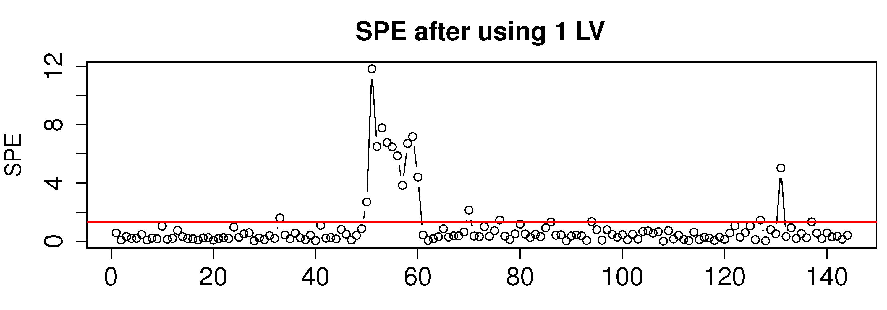

Using the `raw data for this example <http://datasets.connectmv.com/info/room-temperature>`_, shown below, can you explain why we see those unusual points in the SPE plot around time 50 to 60?

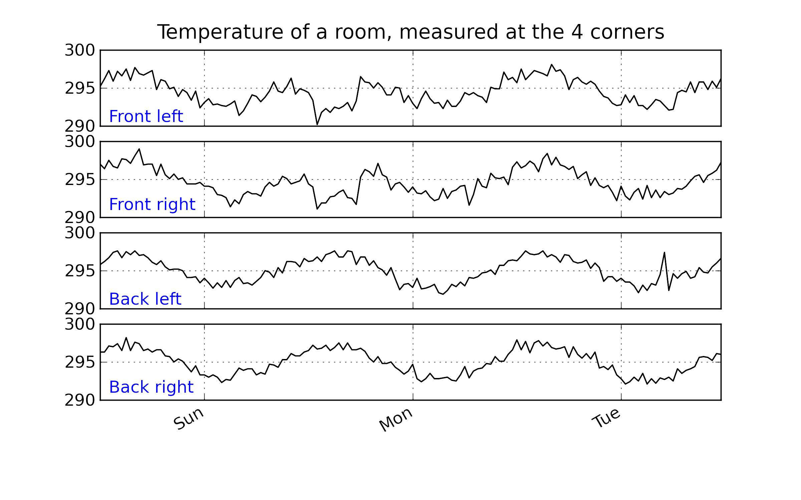

Finally, the SPE value is a complete summary of the residual vector.  As such, it is sometimes used to colour-code  score plots, as we mentioned back in the section on :ref:`score plots <LVM_interpreting_scores>`.   Another interesting way people sometimes display SPE is to plot a 3D data cloud, with :math:`\mathbf{t}_1` and :math:`\mathbf{t}_2`, and use the SPE values on the third axis.  This gives a fairly complete picture of the major dimensions in the model: the explained variation on-the-plane, given by :math:`\mathbf{t}_1` and :math:`\mathbf{t}_2`, and the residual distance off-the-plane, summarized by SPE.

Residuals for each column (:math:`R^2` for each column in |X|)
~~~~~~~~~~~~~~~~~~~~~~~~~~~~~~~~~~~~~~~~~~~~~~~~~~~~~~~~~~~~~~~

Using the residual matrix :math:`\mathbf{E} = \mathbf{X} - \mathbf{T} \mathbf{P}' = \mathbf{X} - \widehat{\mathbf{X}}`, we can calculate the residuals for each column in the original matrix.  This gives an indication of how well the PCA model describes the data from that column.

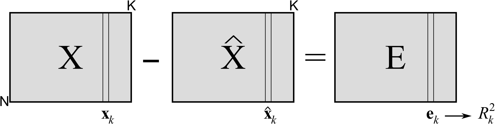

In the section on :ref:`least squares modelling <SECTION-least-squares-modelling>`, the :math:`R^2` number was shown to be the ratio between the variance remaining in the residuals over the total variances we started off with, subtracted from 1.0.  Using the notation in the previous illustration:

.. math::
	R^2_k = 1 - \dfrac{\text{Var}(\mathbf{x}_k - \widehat{\mathbf{x}}_k)}{\text{Var}(\mathbf{x}_k)} = 1 -  \dfrac{\text{Var}(\mathbf{e}_k)}{\text{Var}(\mathbf{x}_k)}

The :math:`R^2_k` value for each variable will increase with every component that is added to the model.  The minimum value is 0.0 when there are no components (since :math:`\widehat{\mathbf{x}}_k = \mathbf{0}`), and the maximum value is 1.0, when the maximum number of components have been added (and :math:`\widehat{\mathbf{x}}_k = \mathbf{x}_k`, or :math:`\mathbf{e}_k = \mathbf{0}`).  This latter extreme is usually not reached, because such a model would be fitting the noise inherent in :math:`\mathbf{x}_k` as well.

The :math:`R^2` values for each column can be visualized as a bar plot for dissimilar variables (chemical process data), or as a line plot if there are many similar variables that have a logical left-to-right relationship, such as the case with :ref:`spectral variables <lvm_spectral_data_example>` (wavelengths).

Residuals for the whole matrix X (:math:`R^2` for |X|)
~~~~~~~~~~~~~~~~~~~~~~~~~~~~~~~~~~~~~~~~~~~~~~~~~~~~~~~~~~~~

Finally, we can calculate an :math:`R^2` value for the entire matrix |X|.  This is the ratio between the variance of |X| we can explain with the model over the ratio of variance initially present in |X|.

.. math::
	R^2 = 1 - \dfrac{\text{Var}(\mathbf{X} - \widehat{\mathbf{X}})}{\text{Var}(\mathbf{X})} = 1 - \dfrac{\text{Var}(\mathbf{E})}{\text{Var}(\mathbf{X})}

The variance of a general matrix, :math:`\mathbf{G}`, is taken as the sum of squares of every element in :math:`\mathbf{G}`.  The example in the next section illustrates how to interpret these residuals.  The smallest value of  :math:`R^2` value is :math:`R^2_{a=0} = 0.0` when there are no components.  After the first component is added we can calculate :math:`R^2_{a=1}`.  Then after fitting a second component we get :math:`R^2_{a=2}`.  Since each component is extracting new information from |X|, we know that :math:`R^2_{a=0} > R^2_{a=1} > R^2_{a=2} > \ldots > R^2_{a=A} = 1.0`.

.. _lvm_spectral_data_example:

Example: spectral data
====================================

A data set, `available on the book website <http://datasets.connectmv.com/info/tablet-spectral-data>`_, contains data on 460 tablets, measured at 650 different wavelengths.

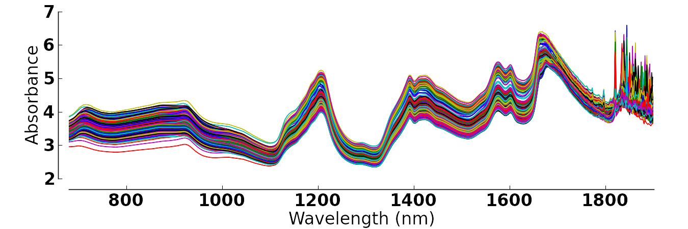
	
The following R code will calculate principal components for this data:

.. code-block:: s

	> spectra <- read.csv('tablet-spectra.csv', header=FALSE)
	> model.pca <- prcomp(spectra, scale=TRUE)
	> summary(model.pca)
	Importance of components:
	                          PC1    PC2    PC3    PC4 ... 
	Standard deviation     21.883 10.975 3.6008 3.2708 ...
	Proportion of Variance  0.737  0.185 0.0199 0.0165 ...
	Cumulative Proportion   0.737  0.922 0.9420 0.9585

These are the :math:`R^2_a` values: the first component explains 73.7% of the variability in |X|, the second explains an additional 18.5%, and the third component explains 1.99%.  These three components together explain 94.2% of all the variation in X.  This means we have reduced |X| from a :math:`460 \times 650` matrix to the :math:`460 \times 3` matrix of scores, |T|, and the :math:`650 \times 3` matrix of loadings, |P|.  

Let's visually show what the :math:`R^2` values are for each column.  Shown below are these values for the first 3 components.  The first component (green thin line) explains the certain regions of the spectra very well, particularly the region around 1100nm.  Wavelengths beyond 1800 nm are not well explained at all.  The second component is primarily responsible for explaining additional variability in the 700 to 1100nm region.  The third component only seems to explain the additional variability from 1700 to 1800nm.  Fitting a fourth component is only going to start fitting the noisy regions of the spectrum.

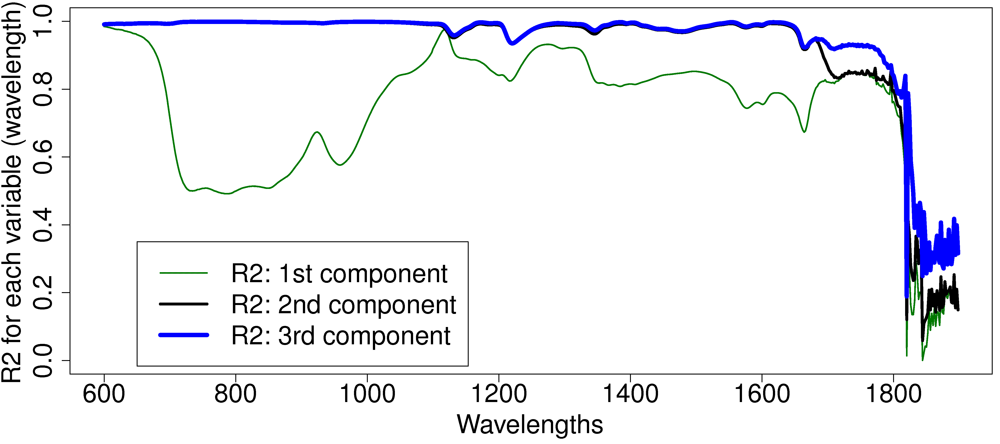

Finally, we can show the SPE plot for each observation. These SPE values for each tablet become smaller and smaller as each successive component is added. There don't appear to be any major outliers off the model's plane.

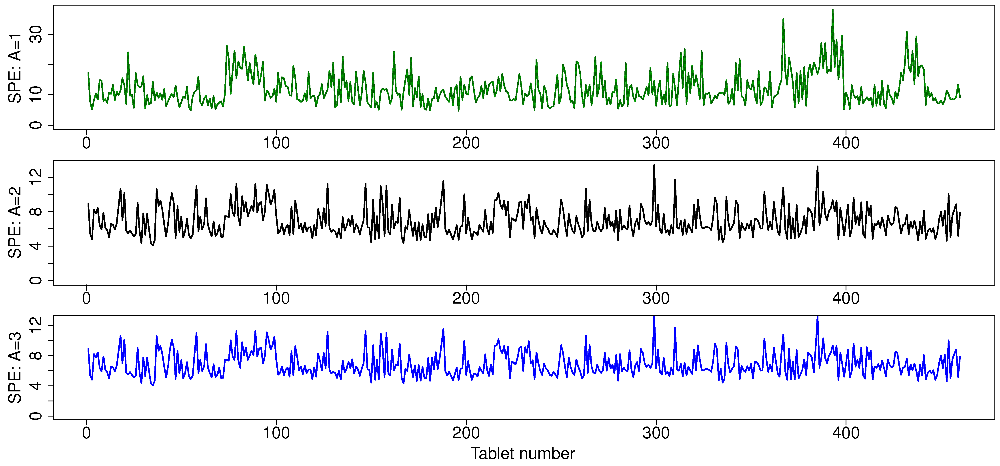

.. _LVM-Hotellings-T2:

Hotelling's |T2|
====================================

The final quantity from a PCA model that we need to consider is called Hotelling's |T2| value.  Some PCA models will have many components, :math:`A`, so an initial screening of these components using score scatterplots will require reviewing :math:`A(A-1)/2` scatterplots.  The |T2| value for the :math:`i^\text{th}` observation is defined as:

.. math::
	T^2 = \sum_{a=1}^{a=A}{\left(\dfrac{t_{i,a}}{s_a}\right)^2}
	
where the :math:`s_a^2` values are constants, and are the variances of each component.  The easiest interpretation is that |T2| is a scalar number that summarizes all the score values.  Some other properties regarding |T2|:

*	It is a positive number, greater than or equal to zero.
*	It is the distance from the center of the (hyper)plane to the projection of the observation onto the (hyper)plane.
*	An observation that projects onto the model's center (usually the observation where every value is at the mean), has :math:`T^2 = 0`.
*	The |T2| statistic is distributed according to the :math:`F`-distribution and is calculated by the multivariate software package being used.  For example, we can calculate the 95% confidence limit for |T2|, below which we expect, under normal conditions, to locate 95% of the observations.

	.. figure:: images/spectral-data-T2-lineplot.png
		:alt:	images/spectral-data.R
		:scale: 80
		:width: 750px
		:align: center

*	It is useful to consider the case when :math:`A=2`, and fix the |T2| value at its 95% limit, for example, call that :math:`T^2_{A=2, \alpha=0.95}`.  Using the definition for |T2|:

	.. math::
		T^2_{A=2, \alpha=0.95} = \dfrac{t^2_{1}}{s^2_1} + \dfrac{t^2_{2}}{s^2_2}
		
	On a scatterplot of :math:`t_1` vs :math:`t_2` for all observations, this would be the equation of an ellipse, centered at the origin.  You will often see this ellipse shown on :math:`t_i` vs :math:`t_j` scatterplots of the scores.  Points inside this elliptical region are within the 95% confidence limit for |T2|. 
	
*	The same principle holds for :math:`A>2`, except the ellipse is called a hyper-ellipse (think of a rugby-ball shaped object for :math:`A=3`).  The general interpretation is that if a point is within this ellipse, then it is also below the |T2| limit, if |T2| were to be plotted on a line.

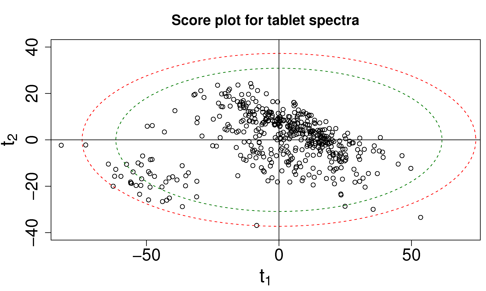
	
	
.. Take a look at Anderson, 1958 (An introduction to multivariate statistical analysis).  Paper by MacGregor (http://dx.doi.org/10.1002/aic.690400509) cites this as the distribution for T2, with F as 2 and 48 DOF (2=because PC1 and PC2, and 48 = 50-2, where N=50 and A=2).
	

.. The PCA model as a way to extract information from noise
	~~~~~~~~~~~~~~~~~~~~~~~~~~~~~~~~~~~~~~~~~~~~~~~~~~~~~~~~~~

..	We saw model is fit by minimizing error.  Large error, poorer fit of the data:

		- little systematic (repeatable) variation in the data
		- we inspect the residuals to learn more about the system
			-structure in the residuals?
		

	X = TP' + E
	- data = information + error

.. _LVM_preprocessing:

Preprocessing the data before building a model
==================================================

The previous sections of this chapter considered the interpretation of a PCA latent variable model.  From this section onwards we return to filling important gaps in our knowledge:  

	#.	Preprocessing the data 
	#.	Building the latent variable model in the :ref:`algorithms section <LVM-algorithms-for-PCA>`
	#.	:ref:`Testing the model <LVM_testing_PCA_models>`, including testing for the number of components to use

There are a number of possibilities for data preprocessing.  We mainly discuss centering and scaling in this section, but outline a few other tools first. These steps are usually univariate, i.e. they are applied separately to each column in the raw data matrix |Xraw|.  We call the matrix of preprocessed data |X|, this is the matrix that is then presented to the algorithm to build the PCA model.  PCA algorithms seldom work on the raw data.

**Transformations**

	The columns in |Xraw| can be transformed: log, square-root and various powers (-1, -0.5, 0.5, 2) are popular options.  These are used to reduce the effect of extreme measurements (e.g. log transforms), or because the transformed variable is known to be more correlated with the other variables.  An example of this is in a distillation column: the inverse temperature is known to more correlated to the vapour pressure, which we know from first-principles modelling.  Using the untransformed variable will lead to an adequate model, but the transformed variable can lead to a better model.
	
	The tools we considered at the start of this course on visualization and univariate distributions (histograms) can help assess which variables require transformation.  But one's knowledge of the system is often the most useful guide for knowing which transformations to apply.

**Expanding the X-matrix**

	Additional columns can be added to the |X|-matrix.   This is frequently done in engineering systems where we can augment |Xraw| with columns containing heat, mass, and energy balances.  It might be useful to add certain dimensionless numbers or other quantities that can be derived from the raw data.  

	Another step that is applied, usually to experimental data, is to add square and cross terms. For example, if 3 of the columns in |Xraw| were from a factorial designed experiment with center points, then augment |Xraw| with columns containing interaction terms: :math:`x_1x_2, x_1x_3, x_2x_3`.  If face points or axial points (such as from a central composite design) were used, then also add the square terms to estimate the quadratic effects: :math:`x_1^2, x_2^2, x_3^2`.  When studying experimental data with PCA (or PLS), also add columns related to disturbance variables and blocking variables - you won't know if they are important if they are not included.

	The *general rule* is: add as many columns into |Xraw| as possible for the initial analysis.  You can always prune out the columns later on if they are shown to be uninformative.

	..	** Shifting rows: lagging **

		COME BACK TO THIS LATER

		Recall that latent variable models such as PCA consider the data in each row of |Xraw| as one unit. But when considering data from chemical plants or larger scale systems, it is not uncommon that there are time-delays.  This means that certain columns in |Xraw| will have 

		.. TODO lagging picture here

**Dealing with outliers**

	Users often go through a phase of pruning outliers prior to building a latent variable model.   There are often *uninteresting* outliers, for example when a temperature sensor goes off-line and provides a default reading of 0.0 instead of its usual values in the range of 300 to 400K.   The automated tools used to do this are known by names such as trimming and winsorizing.  These tools remove the upper and lower :math:`\alpha` percent of the column's tails on the histogram. But care should be taken with these automated approaches, since the most interesting observations are often in the outliers. 

	The course of action when removing outliers is to always mark their values as missing just for that variable in |Xraw|, rather than removing the entire row in |Xraw|.  We do this because we can use the algorithms to calculate the PCA model when missing data are present within a row.

**Centering**

	Centering moves the coordinate system to a new reference point, usually the origin of the coordinate system in :math:`K` variables (i.e. in :math:`K`-dimensional space).  Mean centering is effective and commonly used: after mean centering the mean of every column in |Xraw| will be exactly 0.0.

	But as we learned in the section on :ref:`univariate data analysis <SECTION-univariate-review>`, the mean has a low resistance to outliers: any large outlier will distort the value of the mean.  So users often resort to trimming their data and then mean centering.  In this regard, centering each column around its median is a better choice.  It is my preference to do this as it avoids the trimming step, and simultaneously highlights the outliers.
	
**Scaling**

	Scaling is an important important step in latent variable modelling. Scaling can be seen as a way of assigning weights, or relative importance, to each column in |Xraw|.  If we don't know much about our data, then it is common to assign an equal weight to each column.  We can do this by simply dividing each column by its standard deviation.  After this scaling each column will have variance (and standard deviation) of exactly 1.0.  This allows each column an equal opportunity of contributing to the model.

	This sort of scaling is called unit-variance scaling.  When combined with mean centering you will see the terminology that the data have been *autoscaled*.  

	Imagine a variable that is mostly constant, just noise.  It will have a small standard deviation.  When dividing by the standard deviation we artificially inflate its variance to the level of the other, truly-varying variables.  These noisy, uninformative variables can be removed from |Xraw|, or they can simply be multiplied by a smaller weight, so that their variance after preprocessing is less than 1.0. 

	In the paper by `Bro and Smilde on centering and scaling <http://dx.doi.org/10.1002/cem.773>`_ they show how centering is far more influential on the model than scaling.  Centering can be seen as adding a new principal component to the model, while scaling has much less of an effect.  Once could use the median absolute deviation (MAD) instead of the standard deviation to scale the columns, but it most cases, any approximate scaling vector will work adequately.

.. _LVM-algorithms-for-PCA:

Algorithms to build a PCA model
====================================

The different algorithms used to build a PCA model provide a different insight into the model's structure and how to interpret it.  These algorithms are a reflection of how PCA has been used in different disciplines: PCA is called by different names in each areas.

.. _LVM-eigenvalue-decomposition:

Eigenvalue decomposition
~~~~~~~~~~~~~~~~~~~~~~~~~~~~~~

.. Note:: The purpose of this section is not the theoretical details, but rather the interesting interpretation of the PCA model that we obtain from an eigenvalue decomposition.

Recall that the latent variable directions (the loading vectors) were oriented so that the variance of the scores in that direction were maximal.  We can cast this as an optimization problem.  For the first component:

.. math:: 
	  \max        \quad & \phi = \mathbf{t}'_1 \mathbf{t}_1 = \mathbf{p}'_1\mathbf{X}' \mathbf{X} \mathbf{p}_1 \\
	  \text{s.t.} \quad &  \mathbf{p}'_1 \mathbf{p}_1 = 1

This is equivalent to :math:`\max \quad \phi = \mathbf{p}'_1 \mathbf{X}' \mathbf{X} \mathbf{p}_1 - \lambda \left(\mathbf{p}'_1 \mathbf{p}_1 - 1\right)`, because we can move the constraint into the objective function with a Lagrange multiplier, :math:`\lambda_1`.

The maximum value must occur when the partial derivatives with respect to :math:`\mathbf{p}_1`, our search variable, are zero:

.. math::
	  \dfrac{\partial \phi}{\partial \mathbf{p}_1} &= \mathbf{0} = \mathbf{p}'_1 \mathbf{X}' \mathbf{X} \mathbf{p}_1 - \lambda_1\left(\mathbf{p}'_1 \mathbf{p}_1 - 1\right) \\
										\mathbf{0} &= 2 \mathbf{X}' \mathbf{X} \mathbf{p}_1 - 2\lambda_1 \mathbf{p}_1 \\
										\mathbf{0} &= (\mathbf{X}' \mathbf{X} - \lambda_1 I_{K\times K}) \mathbf{p}_1 \\
										\mathbf{X}' \mathbf{X}\mathbf{p}_1  &= \lambda_1 \mathbf{p}_1

which is just the eigenvalue equation, indicating that :math:`\mathbf{p}_1` is the eigenvector of :math:`\mathbf{X}' \mathbf{X}` and :math:`\lambda_1` is the eigenvalue. One can show that :math:`\lambda_1 = \mathbf{t}'_1 \mathbf{t}_1`, which is proportional to the variance of the first component.

In a similar manner we can calculate the second eigenvalue, but this time we add the additional constraint that :math:`\mathbf{p}_1 \perp \mathbf{p}_2`.  This eventually leads to :math:`\mathbf{X}' \mathbf{X}\mathbf{p}_2 = \lambda_2 \mathbf{p}_2`.  

From this we learn that:

	* The loadings are the eigenvalues of :math:`\mathbf{X}'\mathbf{X}`.
	* Sorting the eigenvalues in order from largest to smallest gives the order of the corresponding eigenvectors, the loadings.
	* We know from the theory of eigenvalues that if there are distinct eigenvalues, then their eigenvectors are linearly independent (orthogonal).
	* We also know the eigenvalues of :math:`\mathbf{X}'\mathbf{X}` must be real values and positive; this matches with the interpretation that the eigenvalues are proportional to the variance of each score vector.
	* Also, the sum of the eigenvalues must add up to sum of the diagonal entries of :math:`\mathbf{X}'\mathbf{X}`, which represents of the total variance of the :math:`\mathbf{X}` matrix, if all eigenvectors are extracted.
	  So plotting the eigenvalues is equivalent to showing the proportion of variance explained in :math:`\mathbf{X}`.  This is not necessarily a good way to judge the number of components to use, but it is a rough guide.  Use a Pareto plot of the eigenvalues (though in the context of eigenvalue problems, this plot is called a Scree plot).

		.. figure:: images/eigenvalue-scree-plot.png
			:alt:	images/eigenvalue-scree-plot.R
			:align: center
			:scale: 70
			:width: 700px

The general approach to using the eigenvalue decomposition would be:

	#.	Preprocess the raw data, particularly centering and scaling, to create a matrix :math:`\mathbf{X}`.
	#.	Calculate the correlation matrix :math:`\mathbf{X}'\mathbf{X}`.
	#.	Calculate the eigenvectors and eigenvalues of this square matrix and sort the results from largest to smallest eigenvalue.
	#.	A rough guide is to retain only the first :math:`A` eigenvectors (loadings), using a Scree plot of the eigenvalues as a guide.  A better method is introduced later to determine the number of components.

..	Some R-code
	X <- as.matrix(X)
	X.mean <- apply(X, 2, mean, na.rm=TRUE)
	X.mc <- sweep(X, 2, X.mean)
	X.scale <- apply(X.mc, 2, sd, na.rm=TRUE)
	X.mcuv <- sweep(X.mc, 2, X.scale, FUN='/')
	XtX <- t(X.mcuv) %*% X.mcuv
	ev <- eigen(XtX, symmetric=TRUE)
	ev$sum <- sum(ev$values)
	K <- 10
	library(lattice)
	barchart(as.matrix(ev$values[1:K] / ev$sum * 100), horizontal=FALSE, col=0, ylab = "Proportion of variance explained (%)", xlab="Component number", scales=list(x=list(labels=seq(1,K))))

However, we should note that calculating the PCA model using an eigenvalue algorithms is usually not recommended, since it calculates all eigenvectors (loadings), even though only the first few will be used.  The maximum number of components possible is :math:`A_\text{max} = \min(N, K)`.  The eigenvalue algorithm cannot handle missing data.
	
Singular value decomposition
~~~~~~~~~~~~~~~~~~~~~~~~~~~~~~

.. TODO: Provide additional insight here on how this is equivalent to rotation, scaling, rotation: break down the data into these 3 SVD components

The singular value decomposition (SVD), in general, decomposes a given matrix |X| into three other matrices:

.. math::
	\mathbf{X} = \mathbf{U} \mathbf{\Sigma} \mathbf{V}'
	
Matrices :math:`\mathbf{U}` and :math:`\mathbf{V}` are orthonormal (each column has unit length and each column is orthogonal to the others), while :math:`\mathbf{\Sigma}` is a diagonal matrix.  The relationship to principal component analysis is that:

.. math::
	\mathbf{X} = \mathbf{T}  \mathbf{P}'
	
where matrix :math:`\mathbf{P}` is also orthonormal.  So taking the SVD on our preprocessed matrix |X| allows us to get the PCA model by setting :math:`\mathbf{P} = \mathbf{V}`, and :math:`\mathbf{T} = \mathbf{U} \mathbf{\Sigma}`.  The diagonal terms in :math:`\mathbf{\Sigma}` are related to the variances of each principal component and can be plotted as a scree plot, as was done for the :ref:`eigenvalue decomposition <LVM-eigenvalue-decomposition>`. 

Like the eigenvalue method, the SVD method calculates all principal components possible, :math:`A=\min(N, K)`, and also cannot handle missing data.  

Non-linear iterative partial least-squares (NIPALS)
~~~~~~~~~~~~~~~~~~~~~~~~~~~~~~~~~~~~~~~~~~~~~~~~~~~~~~~~~~~~

The NIPALS algorithm is a sequential method of computing the principal components.  The calculation may be terminated early, when the user deems that enough components have been computed.

We won't go through the algorithm here, but only mention a few points of interest:

	*	The NIPALS algorithm computes one component at a time.  The first component computed is equivalent to the :math:`\mathbf{t}_1` and |p1| vectors that would have been found from an eigenvalue or singular value decomposition.
	*	The algorithm can handle missing data in |X|.
	*	The algorithm always converges, but the convergence can sometimes be slow.
	*	It is also known as the Power algorithm to calculate eigenvectors and eigenvalues.
	*	It works well for very large data sets.
	*	It is used by most software packages, especially those that handle missing data.
	*	Of interest: it is well known that Google used this algorithm for their first search engine (`called PageRank <http://ilpubs.stanford.edu:8090/422/>`_).
	
.. Kernel methods for PCA
.. ^^^^^^^^^^^^^^^^^^^^^^

..	We will also mention here, but not go into the details of kernel algorithms.  For example, when we have long and narrow |X| matrix of size :math:`N \times K` we can calculate a kernel matrix, :math:`\mathbf{X}'\mathbf{X}` which then has size :math:`K \times K`.  This is a much, much smaller matrix to work with than the original :math:`N \times N` matrix.  The eigenvalue decomposition on :math:`\mathbf{X}'\mathbf{X}` will yield eigenvectors which are just the loadings :math:`\mathbf{P}`.  Once we have the loadings, then we can calculate the scores: :math:`\mathbf{T}=\mathbf{X}\mathbf{P}`.

	For short and wide matrices where :math:`N << K` we can form the matrix of squares and cross-products, :math:`\mathbf{X}\mathbf{X}'`, an :math:`N \times N` matrix.  Had we calculated the singular value decomposition on matrix |X|, where we have set :math:`A = \min(N,K)`,  we would have obtained:

	.. math::
		\mathbf{X}   &= \mathbf{U} \mathbf{\Sigma} \mathbf{V}'
		(N \times K) &= (N \times A)(A \times A)(A \times K)

	and we showed earlier that :math:`\mathbf{V}' = \mathbf{P}'`, which is an orthonormal matrix.  Now write:

	.. math::
		\mathbf{X}\mathbf{X}' &= \mathbf{U} \mathbf{\Sigma} \mathbf{V}' (\mathbf{U} \mathbf{\Sigma} \mathbf{V}')' \\
		\mathbf{X}\mathbf{X}' &= \mathbf{U} \mathbf{\Sigma} \mathbf{V}' \mathbf{V} \mathbf{\Sigma}' \mathbf{U}' \\
		\mathbf{X}\mathbf{X}' &= \mathbf{U} (\mathbf{\Sigma} \mathbf{\Sigma}') \mathbf{U}' \\
		(N \times N)          &= (N \times A)(N \times A)(A \times N) 
		
	This indicates that if we take the singular value decomposition on the small matrix :math:`\mathbf{X}\mathbf{X}'` that the left singular vectors in :math:`\mathbf{U}` are the scores.
	How do we get the loadings?  
		If we have calculated all the scores (A = N): X = TP' + 0; inv(T)X = inv(T)TP' = P' ?
		p'_i = t'_i X, and normalize p_i to unit length
	
	Lindgren, Geladi, Wold; J Chemo, 1993
	Rannar, Lingren and Geladi, J Chemo, 1994
	DeJong and TerBraak, J Chemo, 1994
	Dayal and MacGregor, J Chemo 1997: deflate only one
	

.. _LVM_testing_PCA_models:

Testing the model
====================================

As mentioned previously there are 3 major steps to building a PCA model for engineering applications: 

	#.	Preprocessing the data 
	#.	Building the latent variable model
	#.	Testing the model, including testing for the number of components to use

This last step of testing, interpreting and using the model is where one will spend the most time.  Preparing the data can be time-consuming the first time, but generally the first two steps are less time-consuming.  In this section we investigate how to determine the number of components that should be used in the model and how to use an existing PCA model.  The issue of interpreting a model has been addressed in the section on :ref:`interpreting scores <LVM_interpreting_scores>` and :ref:`interpreting loadings <LVM-interpreting-loadings>`.

.. _LVM-number-of-components:

How many components to use in the model
~~~~~~~~~~~~~~~~~~~~~~~~~~~~~~~~~~~~~~~~~~

..	Any recorded values we have from a system, in |X|, can be broken down into 2 parts: the data structure that is systematic, :math:`\mathbf{TP}'`, and an error component, :math:`\textbf{E}`.

Still to come. 

.. The problem of determining "*how many components*" is related to knowing when we have extracted all the systematic variables from the data, |X|, into the latent variable model, :math:`\mathbf{TP}'`.  Step back for a minute and think what that means: it says we should stop adding latent variables to the model when there is no more systematic correlation remaining between the variables in |X|.  That's all the PCA does: extract the variability in |X|.  We should stop adding components when we have extracted, *reproducibly*, all systematic variation.

..	- scree plot
	- size of eigenvalue: :math:`\sum_a^{a=K}{\lambda_a} = K`
	- cross-validation: page 49 of pencil notes
	
.. _LVM-using-a-PCA-model:

Using an existing PCA model
~~~~~~~~~~~~~~~~~~~~~~~~~~~~~~

In this section we outline the workflow required to use an existing PCA model.  What this means is that you have already calculated the model and validated its usefulness.  Now you would like to use the model on a new observation, which we call :math:`\mathbf{x}_{\text{new, raw}}`.

	#.	Preprocess your vector of new data in the same way as you did when you built the model.  For example, if you took the log transform of a certain variable, then you must do so for the corresponding entry in :math:`x'_{\text{new, raw}}`.  Also apply mean centering and scaling, using the mean centering and scaling information you calculated when you originally built the model.
	
	#.	Call this preprocessed vector :math:`\mathbf{x}_{\text{new}}` now; it has size :math:`K \times 1`, so :math:`\mathbf{x}'_{\text{new}}` is a :math:`1 \times K` vector.
	
	#.	Calculate the location, on the model (hyper)plane, where the new observation would project.  In other words, we are calculating the scores: 
	
		.. math::
			\mathbf{t}'_\text{new} = \mathbf{x}'_{\text{new}} \mathbf{P}
			
		where |P| is your :math:`K \times A` matrix of loadings calculated when building the model, and :math:`\mathbf{t}'_\text{new}` is a :math:`1 \times A` vector of scores for the new observation.
	
	#.	Calculate the residual distance off the model plane.  To do this, we require the vector called :math:`\widehat{\mathbf{x}}'_\text{new}`, the point on the plane, a :math:`1 \times K` vector:
	
	 	.. math::
			\widehat{\mathbf{x}}'_\text{new} = \mathbf{t}'_\text{new} \mathbf{P}'
			
	
	#.	The residual vector is the difference between the actual observation and its projection onto the plane.  The individual entries inside this residual vector are also the called the *contributions* to the error.
	
		.. math:: 
			\mathbf{e}'_\text{new} = \mathbf{x}'_{\text{new}} - \widehat{\mathbf{x}}'_\text{new}
	
	#.	And the residual distance is the sum of squares of the entries in the residual vector, followed by taking a square root.  
	
		.. math::
			\text{SPE}_\text{new} = \sqrt{\mathbf{e}'_\text{new} \mathbf{e}_\text{new}}
	
	
		This is called the squared prediction error, SPE, even though it is more accurately a distance.
	
	
	#.	Another quantity of interest is Hotelling's :math:`T^2` value for the new observation:
	
		.. math::
			T^2_\text{new} = \sum_{a=1}^{a=A}{\left(\dfrac{t_{\text{new},a}}{s_a}\right)^2}
			
		where the :math:`s_a` values are the standard deviations for each component's scores, calculated when the model was built.
		
The above outline is for the case when there is no missing data in a new observation. When there are missing data present in :math:`\mathbf{x}'_{\text{new}}`, then we require a method to estimate the score vector, :math:`\mathbf{t}_\text{new}` in step 3.  Methods for doing this are outlined and compared in the paper by `Nelson, Taylor and MacGregor <http://dx.doi.org/10.1016/S0169-7439(96)00007-X>`_ and the paper by `Arteaga and Ferrer <http://dx.doi.org/10.1002/cem.750>`_.  After that, the remaining steps are the same, except of course that missing values do not contribute to the residual vector.

.. _LVM-PCA-properties:

Some properties of PCA models
====================================

..	Show the 3D to 2D projection

We summarize various properties of the PCA model, most have been described in the previous sections.  Some are only of theoretical interest, but others are more practical.

*	The model is defined by the direction vectors, or loadings vectors, called :math:`\mathbf{p}_1, \mathbf{p}_2, \ldots, \mathbf{p}_A`; each are a :math:`K \times 1` vector, and can be collected into a single matrix, :math:`\mathbf{P}`, a :math:`K \times A` loadings matrix.
*	These vectors form a line for one component, a plane for 2 components, and a hyperplane for 3 or more components.
*	These loadings vectors are of unit length: :math:`\| \mathbf{p}_a \| = \sqrt{\mathbf{p}'_a \mathbf{p}_a} = 1.0`
*	They are independent or orthogonal to one another: :math:`\mathbf{p}'_i \mathbf{p}_j  = 1.0` for :math:`i \neq j`; in other words :math:`\mathbf{p}_i \perp \mathbf{p}_j` 
*	These last two properties imply that :math:`\mathbf{P}` is an orthonormal matrix.  From matrix algebra and geometry you will recall that this means |P| is a rigid rotation matrix.  We are rotating our real-world data in |X| to a new set of values, scores, using the rotation matrix |P|.  But a rigid rotation implies that distances and angles between observations are preserved.  Practically, this means that by looking at our data in the score space, points which are close together in the original :math:`K` variables will be close to each other in the scores, :math:`\mathbf{T}`.
*	Orthonormal matrices have the property that :math:`\mathbf{P}'\mathbf{P} = \mathbf{I}_A`, an identity matrix of size :math:`A \times A`.
*	This plane is calculated with respect to a given data set, |X|, an :math:`N \times K` matrix, so that the direction vectors best-fit the data.  We can say then that with one component, the best estimate of the original matrix |X| is:

	.. math::
		\widehat{\mathbf{X}}_1 = \mathbf{t}_1 \mathbf{p}_1 \qquad \text{or equivalently:} \qquad \mathbf{X}_1 = \mathbf{t}_1 \mathbf{p}_1 + \mathbf{E}_1
		
	where :math:`\mathbf{E}_1` is the residual matrix after fitting one component.  The estimate for |X| will have smaller residuals if we fit a second component:
	
	.. math::
		\widehat{\mathbf{X}}_2 = \mathbf{t}_1 \mathbf{p}_1 + \mathbf{t}_2 \mathbf{p}_2 \qquad \text{or equivalently:} \qquad \mathbf{X}_2 = \mathbf{t}_1 \mathbf{p}_1 + \mathbf{t}_1 \mathbf{p}_1 + \mathbf{E}_2
		
	In general we can illustrate this:
	
		.. figure:: images/decomposition-of-PCA-X-matrix.png
			:alt:	images/decomposition-of-PCA-X-matrix.svg
			:scale: 75
			:width: 750px
			:align: center
	
*	An equivalent interpretation of the model plane is that these direction vectors are oriented in such a way that the scores have maximal variance for that component.  No other direction of the loading vector will give a greater variance.
*	The variance of the :math:`\mathbf{t}_1` vector must be greater than the variance of the :math:`\mathbf{t}_2` vector.  This is because we intentionally find the components in this manner.  In our notation: :math:`s_1 > s_2 > \ldots > s_A`.
*	The maximum number of components that can be extracted is the smaller of :math:`N` or :math:`K`; but usually we will extract only :math:`A << K` number of components.  If we do extract all components, :math:`A^* = \min(N, K)`, then our loadings matrix, |P|, merely rotates our original coordinate system to a new system without error.
* 	The singular value decomposition of X is given by :math:`\mathbf{X} = \mathbf{U \Sigma V}'`, so :math:`\mathbf{V}' = \mathbf{P}'` and :math:`\mathbf{U\Sigma} = \mathbf{T}`, showing the equivalence between PCA and this method.
*	The eigenvalue decomposition of :math:`\mathbf{X}'\mathbf{X}` gives the loadings, |P|, as the eigenvectors, and the eigenvalue for each eigenvector is the variance of the score vector.
*	If there are no missing values in |X|, then the mean of each score vector is 0.0, which allows us to calculate the variance of each score simply from :math:`\mathbf{t}'_a \mathbf{t}_a`.
*	Notice that some score values are positive and others negative.  Each loading direction, :math:`\mathbf{p}_a`, must point in the direction that best explains the data; but this direction is not unique, since :math:`-\mathbf{p}_a` also meets this criterion.  If we did select :math:`-\mathbf{p}_a` as the direction, then the scores would just be :math:`-\mathbf{t}_a` instead.  This does not matter too much, because :math:`(-\mathbf{t}_a)(-\mathbf{p}'_a) = \mathbf{t}_a \mathbf{p}'_a`, which is used to calculate the predicted |X| and the residuals.  But this phenomena can lead to a confusing situation for newcomers when different computer packages give different-looking loading plots and score plots for the same data set.  

Visualization topic: Linking and Brushing
===========================================

*Linking* is when the same data point(s), are highlighted in two or more plots.  This is used to highlight outliers or interesting points in a multivariate data set.  The points could be highlighted in terms of colour and/or shape.

*Brushing* is the same as linking, except it is done in real-time as the user moves a mouse over a plot.  This concept was described by Becker and Cleveland in their original article called `Brushing Scatterplots <http://www.jstor.org/stable/1269768>`_, *Technometrics*, **29**, 127-142, 1987.

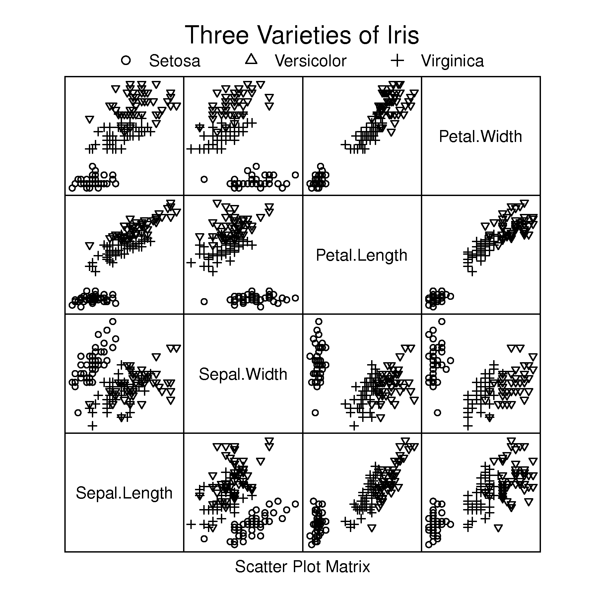

In this illustration we are considering the well-known iris data set, a multivariate data set consisting of the 4 length measurements taken on 3 species of iris.  There are 150 observations (50 for each species).  Linking is used to mark each iris species with a different marker shape (a different colour could also have been used).  Brushing cannot be illustrated, but as shown in the paper by Becker and Cleveland, it would amount to dynamically changing the marker shape or colour of points in one plot, while the user selects those same observations in another plot.

We will use this concept extensively in the software package to learn from and interrogate the model.  For example, when we see interesting observations in the score plot, we can brush through the scores, while having a time series plot of the raw data open alongside.  This would highlight what that score feature means in the context of the raw data.

.. _LVM-PCA-NIPALS-algorithm:

Calculating the principal components model
============================================

While we learned in an earlier class that the PCA model can be calculated with either the eigenvalue or the singular value decomposition, most computer packages will use the NIPALS algorithm.  The non-linear iterative partial least squares algorithm has the two main advantages of being able to handle missing data and calculating the components sequentially.

.. rubric:: The NIPALS algorithm

.. Add MATLAB, R and Python code 

The original name for this technique was non-linear iterative partial least squares (NIPALS) algorithm. The algorithm extracts each component sequentially, starting with the first component (direction of greatest variance), and then the second component, and so on.

The purpose of considering this algorithm here is three-fold:  it gives additional insight into what the loadings and scores mean; it shows how each component is independent of (orthogonal to) the other components, and it shows how the algorithm can handle missing data.

We will show the algorithm here for the :math:`a^\text{th}` component, where :math:`a=1` for the first component.  The matrix |X| that we deal with below is the preprocessed (usually centered and scaled) matrix, not the raw data.

#.	The NIPALS algorithm starts by arbitrarily creating an initial column for :math:`\mathbf{t}_a`.  You can use a column of random numbers, or some people use a column from the |X| matrix; anything can be used as long as it is not a column of zeros.

#.	Then we take every column in |X|, call it :math:`\mathbf{x}_k`, and regress it onto this initial column :math:`\mathbf{t}_a`;  store the regression coefficient as the entry in :math:`p_{k,a}`.  What this means, and it is illustrated below, is that we perform an ordinary least squares regression (:math:`\mathbf{y} = \boldsymbol{\beta} \mathbf{x}`), except our |x|-variable is this column of :math:`\mathbf{t}_a` values, and our |y|-variable is the particular column from |X|, i.e. :math:`\mathbf{x}_k`.

	.. figure:: images/NIPALS-iterations-PCA-columns.png
		:alt:	images/NIPALS-iterations-PCA.svg
		:scale: 35
		:width: 750px
		:align: center

	For ordinary least squares, you will remember that the solution for :math:`\widehat{\boldsymbol\beta} = \dfrac{\mathbf{x'y}}{\mathbf{x'x}}`.  Using our notation, this means:

	.. math::
		p_{k,a} = \dfrac{\mathbf{t}'_a \mathbf{x}_k}{\mathbf{t}'_a\mathbf{t}_a}

	This is repeated for each column in |X| until we fill the entire vector :math:`\mathbf{p}_k`.  In practice we don't do this one column at time; we can regress all columns in |X| in go: :math:`\mathbf{p}'_a = \dfrac{1}{\mathbf{t}'_a\mathbf{t}_a} \cdot \mathbf{t}'_a \mathbf{X}_a`, where :math:`\mathbf{t}_a` is an :math:`N \times 1` column vector, and :math:`\mathbf{X}_a` is an :math:`N \ times K` matrix, explained more clearly in step 6.

#.	The loading vector :math:`\mathbf{p}'_a` won't have unit length (magnitude).  So we simply rescale it to have magnitude of 1.0:

	.. math::
		\mathbf{p}'_a = \dfrac{1}{\sqrt{\mathbf{p}'_a \mathbf{p}_a}} \cdot \mathbf{p}'_a  

#.	The next step is to regress every row in |X| onto this normalized loadings vector.  As illustrated below, in our linear regression the rows in |X| are our |y|-variable each time, while the loadings vector is our |x|-variable.  The regression coefficient becomes the score value for that :math:`i^\text{th}` row:

	.. figure:: images/NIPALS-iterations-PCA-rows.png
		:alt:	images/NIPALS-iterations-PCA.svg
		:scale: 35
		:width: 750px
		:align: center

	.. math::
		t_{i,a} = \dfrac{\mathbf{x}'_i \mathbf{p}_a}{\mathbf{p}'_a\mathbf{p}_a}
		
	where :math:`\mathbf{x}_i` is an :math:`N \times 1` column vector.  We can combine these :math:`N` separate least-squares models and calculate them in one go to get the entire vector, :math:`\mathbf{t}_a = \dfrac{1}{\mathbf{p}'_a\mathbf{p}_a} \cdot \mathbf{X} \mathbf{p}_a`, where :math:`\mathbf{p}_a` is a :math:`K \times 1` column vector.

#.	We keep iterating steps 2, 3 and 4 until the change in vector :math:`\mathbf{t}_a` from one iteration to the next is small (usually around :math:`1 \times 10^{-6}` to :math:`1 \times 10^{-9}`).  Most data sets require no more than 200 iterations before achieving convergence.

#.	On convergence, the score vector and the loading vectors, :math:`\mathbf{t}_a` and :math:`\mathbf{p}_a` are stored is the column in matrix :math:`\mathbf{T}` and :math:`\mathbf{P}` respectively.  We also now deflate the |X| matrix.  This crucial step removes the variability captured in this component (:math:`\mathbf{t}_a` and :math:`\mathbf{p}_a`) from |X|:

	.. math::
		\mathbf{E}_a &= \mathbf{X}_{a} - \mathbf{t}_a \mathbf{p}'_a \\
		\mathbf{X}_{a+1} &= \mathbf{E}_a
		
	For the first component, :math:`\mathbf{X}_{a}` is just the preprocessed raw data.  So we can see that the second component works is actually being calculated on the residuals after the first component, :math:`\mathbf{E}_1`.  
	
	This is called *deflation*, and nicely shows why each component is orthogonal to the other.  Each subsequent component is only seeing variation remaining after removing all the others; there is no possibility that two components can explain the same type of variability.
	
	After deflation we go back to step 1 and repeat the entire process for the next component.  Just before accepting the new component we can use a test, such as a randomization test, or :ref:`cross-validation <LVM-PCA-cross-validation>`, to decide whether to keep that component or not.
	
The final reason for outlining the NIPALS algorithm is to show one way in which data can be handled.  All that step 2 and step 4 are doing is a series of regressions.  Let's take step 2 to illustrate, but the same idea holds for step 4.  In step 2, we were regression columns from |X| onto the score :math:`\mathbf{t}_a`.  We can visualize this for a hypothetical system with :math:`N = 15` observations, below.

There are 3 missing observations (open circles), but despite this, the regression's slope can still be adequately determined.  The slope is unlikely to change by very much if we did have the missing values.  In practice though we have no idea where these open circles would fall, but the principle is the same: we calculate the slope coefficient just ignoring any missing entries.

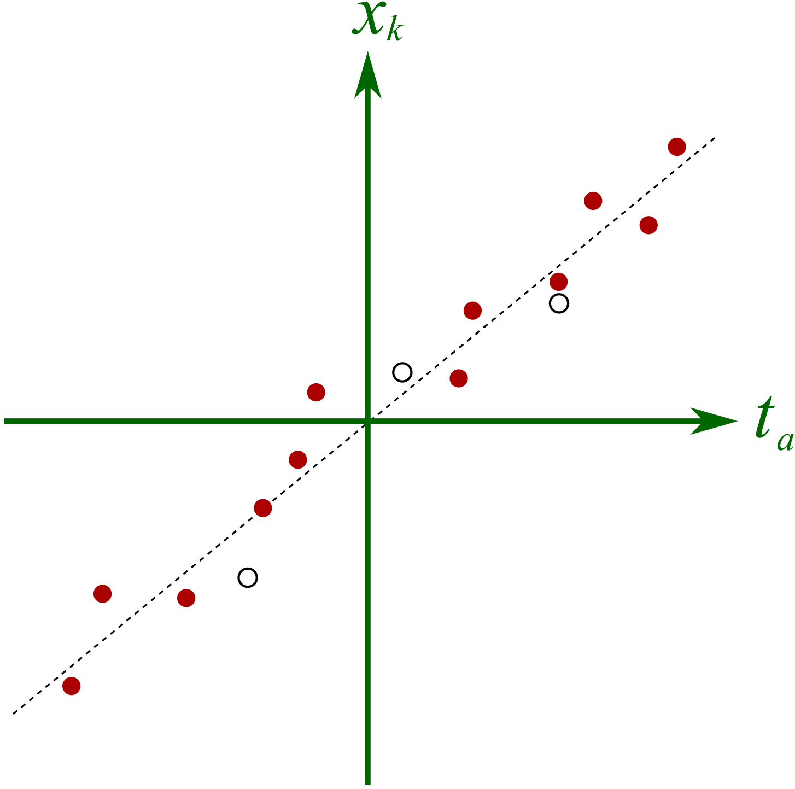

.. _LVM-PCA-cross-validation:

Determining the number of components by cross-validation
========================================================================

.. Review the ICS-L newsgroup postings around September 2009.

.. Check Q2 values: in ProMV they keep increasing, never decreasing.

Cross-validation is a general tool that helps to avoid over-fitting - it can be applied to any model.  As we add successive components to a model we are increasing the size of the model, |A|, and we are explaining the model-building data, |X|, better and better.  The model's :math:`R^2` value will increase with every component.  As the following equation shows, the variance of the :math:`\widehat{\mathbf{X}}` matrix increases with every component, while the residual variance in matrix :math:`\mathbf{E}` must decrease.

.. math::
	\mathbf{X} &= \mathbf{TP'} + \mathbf{E}  \\
	\mathbf{X} &= \widehat{\mathbf{X}} + \mathbf{E}  \\
	\mathcal{V}(\mathbf{X}) &= \mathcal{V}(\widehat{\mathbf{X}}) + \mathcal{V}(\mathbf{E})

since the :math:`\widehat{\mathbf{X}}` and :math:`\mathbf{E}` matrices are completely orthogonal to each other: :math:`\widehat{\mathbf{X}}'\mathbf{E} = \mathbf{0}` (a matrix of zeros).

.. Also see "images/testing-orthogonality-of-Xhat-and-E.R" for a quick test of this

There comes a point for any real data set where the number of components, |A| = the number of columns in :math:`\mathbf{T}` and :math:`\mathbf{P}`, extracts all systematic variance from :math:`\mathbf{X}`, leaving unstructured residual variance in :math:`\mathbf{E}`.  Fitting any further components will start to fit this noise, and unstructured variance, in :math:`\mathbf{E}`.

Cross-validation for multivariate data sets was originally described by Svante Wold in his paper on `Cross-validatory estimation of the number of components in factor and principal components models <http://www.jstor.org/stable/1267639>`_, in *Technometrics*, **20**, 397-405, 1978.  

The general idea is to divide the matrix |X| into :math:`G` groups of rows.  These rows should be selected randomly, but are often selected in order: row 1 goes in group 1, row 2 goes in group 2, and so on.  We can collect the rows belonging to the first group into a new matrix called :math:`\mathbf{X}_{(1)}`, and leave behind all the other rows from all other groups, which we will call group :math:`\mathbf{X}_{(-1)}`.  So in general, for the :math:`g^\text{th}` group, we can split matrix |X| into :math:`\mathbf{X}_{(g)}` and :math:`\mathbf{X}_{(-g)}`.

Wold's cross-validation procedure asks to build the PCA model on the data in :math:`\mathbf{X}_{(-1)}` using |A| components. Then use data in :math:`\mathbf{X}_{(1)}` as new, testing data.  In other words, we preprocess the :math:`\mathbf{X}_{(1)}` rows, calculate their score values, :math:`\mathbf{T}_{(1)} = \mathbf{X}_{(1)} \mathbf{P}`, calculate their predicted values, :math:`\widehat{\mathbf{X}}_{(1)} = \mathbf{T}_{(1)} \mathbf{P'}`, and their residuals, :math:`\mathbf{E}_{(1)} = \mathbf{X}_{(1)} - \widehat{\mathbf{X}}_{(1)}`.   We repeat this process, building the model on :math:`\mathbf{X}_{(-2)}` and testing it with :math:`\mathbf{X}_{(2)}`, to eventually obtain :math:`\mathbf{E}_{(2)}`.

After repeating this on :math:`G` groups, we gather up :math:`\mathbf{E}_{1}, \mathbf{E}_{2}, \ldots, \mathbf{E}_{G}` and assemble a type of residual matrix, :math:`\mathbf{E}_{A,\text{CV}}`, where the |A| represents the number of components used in each of the :math:`G` PCA models. The :math:`\text{CV}` subscript indicates that this is not the usual error matrix, :math:`\mathbf{E}`. From this we can calculate a type of :math:`R^2` value.  We won't call this :math:`R^2`, but it follows the same definition for an :math:`R^2` value.  We will call it :math:`Q^2_A` instead, where |A| is the number of components used to fit the :math:`G` models.

.. math::
	Q^2_A = 1 - \dfrac{\text{Var}(\mathbf{E}_{A, \text{CV}})}{\text{Var}(\mathbf{X})}
	
We also calculate the usual PCA model on all the rows of |X| using |A| components, then calculate the usual residual matrix, :math:`\mathbf{E_A}`.  This model's :math:`R^2` value is:

.. math::
	R^2_A = 1 - \dfrac{\text{Var}(\mathbf{E}_A)}{\text{Var}(\mathbf{X})}
	
The :math:`Q^2_A` behaves exactly as :math:`R^2`, but with two important differences.  Like :math:`R^2`, it is a number less than 1.0 that indicates how well the testing data, in this case testing data that was generated by the cross-validation procedure, are explained by the model.  The first difference is that :math:`Q^2_A` is always less than the :math:`R^2` value.  The other difference is that :math:`Q^2_A` will not keep increasing with each successive component, it will, after a certain number of components, start to decrease.  This decrease in :math:`Q^2_A` indicates the new component just added is not systematic: it is unable to explain the cross-validated testing data.  We often see plots such as this one:

.. figure:: images/barplot-for-R2-and-Q2.png
	:alt:	images/barplot-for-R2-and-Q2.R
	:scale: 100
	:width: 750px
	:align: center

This is for a real data set, so the actual cut off for the number of components could be either :math:`A =2` or :math:`A=3`, depending on what the 3rd component shows to the user and how interested they are in that component.  Likely the 4th component, while boosting the :math:`R^2` value from 66% to 75%, is not really fitting any systematic variation.  The :math:`Q^2` value drops from 32% to 25% when going from component 3 to 4.  The fifth component shows :math:`Q^2` increasing again.  Whether this is fitting actual variability in the data or noise is for the modeller to determine, by investigating that 5th component.  These plots show that for this data set we would use between 2 and 5 components, but not more.

Cross-validation, as this example shows is never a precise answer to the number of components that should be retained when trying to learn more about a dataset.  Many studies try to find the "true" or "best" number of components. I consider this fruitless; each data set means something different to the modeller. The number of components to use should be judged by the relevance of each component.  Use cross-validation as guide, and always look at a few extra components and step back a few components; then make a judgement that is relevant to your intended use of the model.

However, cross-validation is useful for predictive models, such as PLS, so we avoid overfitting components.

.. _LVM-PCA-randomization:

Determining the number of components by randomization 
========================================================================

*	Concept of randomization is not new: Fisher's example of 5!6! playing cards for randomization of A/B fertilizer testing
*	The key is contrast a particular (statistical) outcome against a large body of data which could have only occurred by pure chance.  We then calculate a risk value -- the risk of accepting the statistical outcome relative to the data occurring by chance.  
*	In many cases our statistical outcome is clearly different to the randomized body of data <IMAGE OF histogram with a line to the far right>
*	In other cases it is clear the statistical outcome is quite similar to what could have occurred from chance alone.
*	There is obviously a transitionary area where the data analyst/modeller must make an informed decision.  However, transferring the statistical value to a risk value is more interpretable in many cases, and can be understood even by non-experts (colleagues, managers and so forth, who are not statistically trained.)
  
*	Any statistic can be used: t's covariance with u (PLS objective function)
*	Eigenvalue in PCA?  

*	PCA models?
*	Multiblock methods?
*	PLS-DA models? DOI:  10.1007/s11306-007-0099-6  (also see other paper by Westerhuis on this topic)
*	Batch data?
*	Does it work well for DOE data (the usual shortcoming for Q2 calculations)
*	Use a robust correlation estimate to guard against outliers in score correlations
	*	http://www.eric.ed.gov/ERICWebPortal/search/detailmini.jsp?_nfpb=true&_&ERICExtSearch_SearchValue_0=ED201658&ERICExtSearch_SearchType_0=no&accno=ED201658
	*	http://www.jstor.org/pss/2349088
	*	``covRob`` function in ``robust`` package in R
	*	http://www.unt.edu/benchmarks/archives/2001/december01/rss.htm

*	Risk metric more interpretably for automated model fitting (quite common nowadays)
*	Helpful to see the risk metric on a per-component basis, even if it is not used to determine the number of components.

*	Drawbacks: for dataset with large N, large K (batch datasets) the model rebuilding with :math:`G` in the order of 50 to 500 can be substantial.  Contrast this to cross validation where the number of groups typically used is :math:`G = 7`.   Fortunately, this model rebuilding can be trivially parallelized, which is attractive on multicore CPUs, common on desktop computers.

PLS models
~~~~~~~~~~~~~~~~~~~~~~~~~~~~~~

*	Statistic used: correlation between the :math:`t`-score and the :math:`u`-score
*	Details:

	#.	Deflate the |X| and |Y| matrices from the previous component (for the first component, this would just be the data after preprocessing)
	#.	Calculate the current component, called :math:`a`: we are going to test whether this :math:`a^\text{th}` additional component is significant or not
	#.	Calculate the correlation between the :math:`t_a` and the :math:`u_a` score vectors: it is a number between 0 and 1, because these scores are positively correlated.
	#.	Repeat a certain number, say :math:`G=1000` times:
		
		*	randomize the rows in |X|, but not in |Y| (these are the same |X| and |Y| matrices that were just used to calculate the :math:`t_a` and the :math:`u_a` score vectors)
		*	fit a PLS component to calculate the :math:`t_{a,g}` and the :math:`u_{a,g}` score vectors, where :math:`g = 1, 2, \ldots, G`
		*	calculate the :math:`G` correlation values, in the same was as was done in step 3.
	
	#.	Use the reference :math:`t_a` vs :math:`u_a` correlation, call it :math:`S_0`, and compare it to the :math:`G` other randomized correlation values, called :math:`S_1, S_2, \ldots, S_g, \ldots, S_G`.  Determine whether or not to retain this :math:`a^\text{th}` component by assessing the risk.  
	
	One way to assess the risk that provides a clear signal whether or not to retain the component is to use a risk count of violations. We use two factors to make up the risk evaluation: the number of randomization trials that exceed the base statistic under test (:math:`S_0`), and the strength of the correlation, which is related to the PLS objective function.
	
		*	Let risk = \frac{\text{number of}\,\,S_g\,\,\text{values exceeding}\,\,S_0}{G}
		
			*	If risk :math:`\geq 0.08`, then ``points = points + 2``, as there is a high risk, one in 12 chance, we are accepting a component that should not be accepted.
		
			*	or, if :math:`0.03 \leq \text{risk} < 0.08` then ``points = points + 1``  (moderately risky to accept this component) 
		
			*	or, if :math:`0.01 \leq \text{risk} < 0.03` then we accept the component without accumulating any points, however, but we might still add some points if the correlation, :math:`S_0` is small (see next step). 
			
			*	finally, if :math:`risk \leq 0.01` then accept the component unconditionally, since the risk is very low.  
			
			
				..	I'm reluctant to implement this: more complexity, hard to justify (ad hoc)
				
					In addition, remove 1.0 risk points, or fewer if currently less than 1.0, from the current risk count.  The reason is that sometimes we just cumulate half points (below) over several components, leading to early termination.See for example, the ISO_brightness.mat data file (Wiklund et al, 2007, J. Chemometrics paper DOI:10.1002/cem.1086)
		
		*	Note that :math:`S_0` represents the correlation between :math:`t_a` and the :math:`u_a`, which is nothing more than a scaled version of the objective function of the PLS model, which each component is trying to maximize, subject to certain constraints.  We accumulate risk based on the strength of this correlation as follows:
		
			*	If :math:`S_0 \geq 0.50`, then we do not augment our risk, as this is a strong correlation
		
			*	Or, if :math:`0.35 \leq S_0 < 0.50`, then ``points = points + 0.5`` (weak correlation between :math:`t_a` and :math:`u_a`)
		
			*	Or, if :math:`S_0 \leq 0.35` then ``points = points + 1.0`` (very weak correlation between :math:`t_a` and :math:`u_a`)

		We stop adding components when the total risk points *accumulated on the current and all previous components* equals or exceeds 2.0.  We revert to the component where we had a risk points of 1.0 or less and stop adding components.
		
	#.	Once we decide to accept this :math:`a^\text{th}` component then we deflate the |X| and |Y| matrices; increment the value of :math:`a` by one and repeat the process to decide whether the next component is significant.

Fitting :math:`G=1000` models can be prohibitive on some data sets, however this can be easily mitigated as follows.  Fit :math:`G=200` permutations; if the risk is between 0.5% and 10%, then fit the greater number, say :math:`G=1000` permutations.  Risk values outside this range will not likely change by using more permutations.  The numbers of :math:`G=200` (fast) and :math:`G=1000` (slow) are just an example, and should obviously be adjusted in proportion to the size of the dataset.

Contribution plots
====================================

We have previously seen how contribution plots are constructed for a score value, for the SPE and for |T2|.  We breakdown the value, such as SPE, into its individual terms, one from each variable.  Then we plot these |K| contribution values as a bar chart. 

For a score: :math:`t_{i,a} = \mathbf{x}_{i} \mathbf{p}_a`

.. math::
	\begin{bmatrix}x_{i,1} p_{1,a} & x_{i,2} p_{2,a} & \ldots & x_{i,k} p_{k,a} & \ldots & x_{i,K} p_{K,a} \end{bmatrix}

The contribution to |T2| is similar to a score contribution, except we calculate the weighted summation over all the scores, :math:`t_{i,a}`, where the weights are the variances of the :math:`a^\text{th}` score.

For SPE = :math:`\sqrt{\mathbf{e}'_{i}\mathbf{e}_{i}}`, where :math:`\mathbf{e}'_{i} = \mathbf{x}'_i - \widehat{\mathbf{x}}'_{i}`, the bars in the contribution plots are:

.. math::
	\begin{bmatrix}(x_{i,1} - \hat{x}_{i,1}) & (x_{i,2} - \hat{x}_{i,2}) & \ldots & (x_{i,k} - \hat{x}_{i,k}) &  \ldots & (x_{i,K} - \hat{x}_{i,K})\end{bmatrix}
	
The SPE contributions are usually shown as the square of the values in brackets, accounting for the sign, as in :math:`e_{i,k} = (x_{i,k} - \hat{x}_{i,k})`, and then plot each bar: :math:`\text{sign}(e_{i,k}) \times e^2_{i,k}`.  The squared values is more a more realistic indicator of the contribution, while the sign information might be informative in some cases.
	
The other point to mention here is that contributions are calculated *from* one point *to* another point.  Most often, the *from* point is the model center or the model plane.  So for SPE, the contributions are *from* the model plane *to* the :math:`i^\text{th}` observation off the model plane.  The score contributions are *from* the model center *to* the observation's projection on the (hyper)plane.  

But sometimes we would like to know, as in the figure below, what are the contribution from one point to another.  And these start and end points need not be an actual point; for a group of points we can use a suitable average of the points in the cluster.  So there are point-to-point, point-to-group, group-to-point, and group-to-group contributions in the scores.

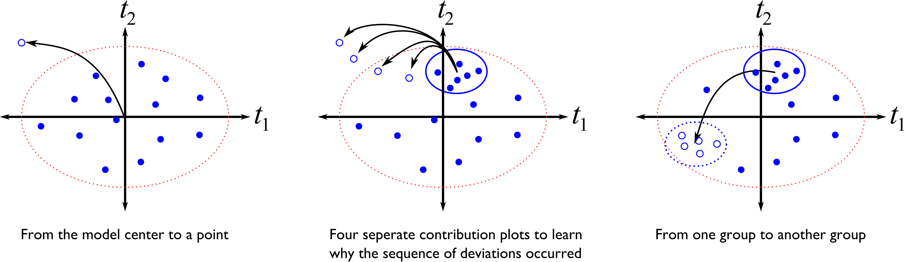

The calculation procedure is actually the same in all cases: for a group of points, collapse it down to the center point in the group, then calculate the point-to-point contribution.  If the starting point is not specified, then the contribution will be from the model center, i.e. :math:`(t_i, t_j) = (0, 0)` to the point.

.. _LVM-using-indicator-variables:

Using indicator variables
====================================

Indicator variables, also called dummy variables, are most often a binary variable that indicates the presence or absences of a certain effect.  For example, a variable that shows if reactor A or reactor B was used.  Its value is either a 0 or a 1 in the data matrix |X|.  It is quite valid to include these sort of variables in a principal component analysis model.

Sometimes these variables are imported into the computer software, but *not used in the model*.  They are only used to display the results, where the indicator variable is then shown in a different colour or a different marker shape.  We have seen :ref:`an example of this before <LVM-troubleshooting>`:

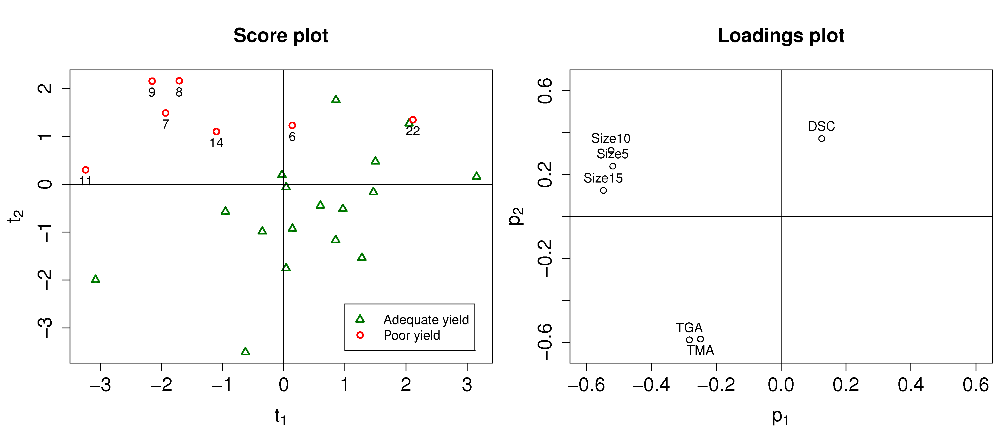
	
If the variable is included in the model then it is centered and scaled (preprocessed) like any other variable.  Care must be taken to make sure this variable is reasonably balanced.  There is no guide to exactly how balanced it needs to be, but there should be a good number of observations of both zeros and ones. The extreme case is where there are :math:`N` observations, and only 1 of them is a zero or a one, and the other :math:`N-1` observations are the rest.  You are not likely to learn much from this variable in any case; furthermore, the scaling for this variable will be poor (the variance will be small, so dividing by this small variance will inflate that variable's variance).

Interpreting these sort of variables in a loading plot is also no different; strong correlations with this variable are interpreted in the usual way.

Exercises
=========

.. index::
	pair: exercises; latent variable modelling
	
We will use the following exercises in class; please work in groups of 2 people.   Each exercise introduces a new topic or highlights some interesting aspect of PCA.

Room temperature data
~~~~~~~~~~~~~~~~~~~~~~~~~~

* :math:`N = 144`
* :math:`K = 4` + 1 column containing the date and time at which the 4 temperatures were recorded
* Web address: http://datasets.connectmv.com/info/room-temperature
* Description: Temperature measurements from 4 corners of a room

**Objectives**

Before even fitting the model:

#.	How many latent variables do you expect to use in this model?  Why?
#.	What do you expect the first loading vector to look like?

Now build a PCA model in the software. 

#.	How many latent variables were found using cross-validation?
#.	Plot a time series plot (also called a line plot) of :math:`t_1`.  Did this match your expectations?  Why/why not?
#.	Plot a bar plot of the loadings for the second component.  Given this bar plot, what do you expect the characteristics do you expect an observation with a large, positive value of :math:`t_2` to have; and a large, negative :math:`t_2` value?
#.	Now plot the time series plot for :math:`t_2`.  Again, does this plot match your expectations?

Now we use the concept of brushing to interrogate and learn from the model.

#.	Plot a score plot of :math:`t_1` against :math:`t_2`.
#.	Also plot the time series plot of the raw data.
#.	Select a cluster of interest in the score plot and see the brushed values in the raw data.  Are these the values you expected to be highlighted?
#.	Next plot the Hotelling's |T2| line plot.  We learned about the Hotelling's |T2| value :ref:`in a previous section <LVM-Hotellings-T2>`, where we explained how this is the distance across the model's plane from the center, to the projection of each observation.  Does the 95% limit in the Hotelling's |T2| line plot correspond to the 95% limit in the score plot?
#.	Also plot the SPE line plot.  Brush the outlier in the SPE plot and find its location in the score plot.  
#.	Why does this point have a large SPE value?
#.	Describe to your partner how a 3-D scatter plot would look with :math:`t_1` and :math:`t_2` as the :math:`(x,y)` axes, and SPE as the :math:`z`-axis.

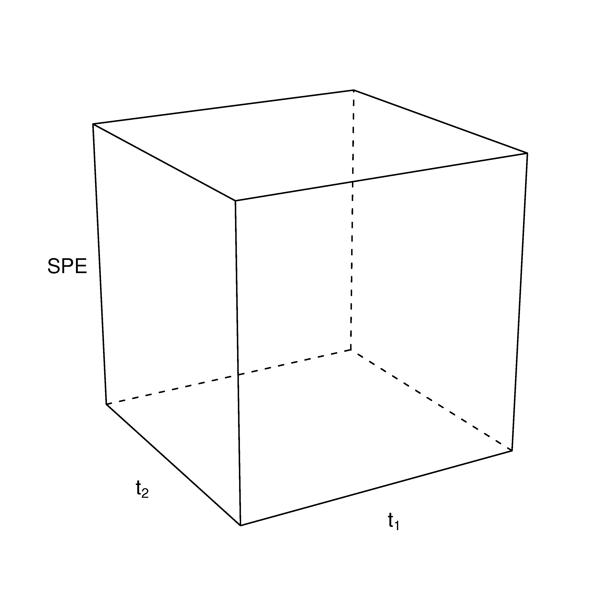

What have we learned?

*	Interpreted that a latent variable is often a true driving force in the system under investigation.
*	How to interpret a loadings vector and its corresponding score vector.
*	Brushing multivariate and raw data plots to confirm our understanding of the model.
*	Learned about Hotelling's |T2|, whether we plot it as a line plot, or as an ellipse on a scatter plot.
*	We have confirmed how the scores are on the model plane, and the SPE is the distance from the model plane to the actual observation.

Food texture data set
~~~~~~~~~~~~~~~~~~~~~~~~~~

* :math:`N = 50`
* :math:`K = 5` + 1 column containing the labels for each batch
* Web address: http://datasets.connectmv.com/info/food-texture
* Description: Data from a food manufacturer making a pastry product.  Each row contains the 5 quality attributes of a batch of product.

#.	Fit a PCA model; use auto-fit (cross-validation feature) to calculate the number of components.
#.	Add an extra component; by how much does :math:`R^2` increase; and :math:`Q^2`?  Use a table of numbers to get the exact values of :math:`R^2` and :math:`Q^2`, no just reading the values off a graph.
#.	Plot the loadings plot as a bar plot for :math:`p_1`.  Does this match the values from the class notes?  Interpret what kind of pastry would have a large positive :math:`t_1` value?
#.	What feature(s) of the raw data does the second component explain?  Plot sequence-ordered plots of the raw data to confirm your answer.
#.	Look for any observations that are unusual.  Are there any unusual scores? SPE values?  Plot a contribution plot for the unusual observations and interpret it.

Food consumption data set
~~~~~~~~~~~~~~~~~~~~~~~~~~

This data set has become a classic data set when learning about multivariate data analysis.  It consists of 

* :math:`N=16` countries in the European area
* :math:`K=20` food items
* Missing data: yes
* Web address: http://datasets.connectmv.com/info/food-consumption
* Description: The data table lists for each country the relative consumption of certain food items, such as tea, jam, coffee, yoghurt, and others.

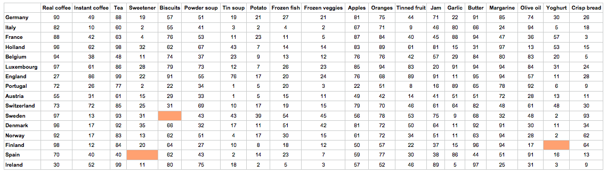

#.	Fit a PCA model to the data; use cross-validation to determine the number of components.
#.	Plot a loadings plot of :math:`p_1` against :math:`p_2`.  Which are the important variables in the first component? And the second component?
#.	Since each column represents food consumption, how would you interpret a country will a high (positive or negative) :math:`t_1` value?  Find countries that meet this criterion.   Verify that this country does indeed have this interpretation (*hint*: use a contribution plot to help you).
#.	Now plot SPE after 2 components (don't plot the default SPE, make sure it is the SPE only after two components).  Please use the contribution tool to interpret any interesting outliers.
#.	Now plot SPE after 3 components.  What has happened to the observations you identified in the previous question?  Investigate the loadings plot for the third component now (as a bar plot)  and see which variables are heavily loaded in the 3rd component.
#.	Also plot the :math:`R^2` values for each variable, after two components, and after 3 components.  Which variables are modelled by the 3rd component?  Does this match with your interpretation of the loadings bar plot in the previous question?
#.	Now plot a score plot of the 3rd component against the 1st component.  Generate a contribution plot in the score from the interesting observation(s) you selected in part 4.  Does this match up with your interpretation of what the 3rd component is modelling?

What we learned:

* Further practice of our skills in interpreting score plots and loading plots.
* How to relate contribution plots to the loadings and the :math:`R^2` values for a particular component.

Silicon wafer thickness
~~~~~~~~~~~~~~~~~~~~~~~~~~

* :math:`N=184`
* :math:`K=9`
* Web address: http://datasets.connectmv.com/info/silicon-wafer-thickness
* Description: These are nine thickness measurements recorded from various batches of silicon wafers.  One wafer is removed from each batch and the thickness of the wafer is measured at the nine locations, as shown in the illustration. 

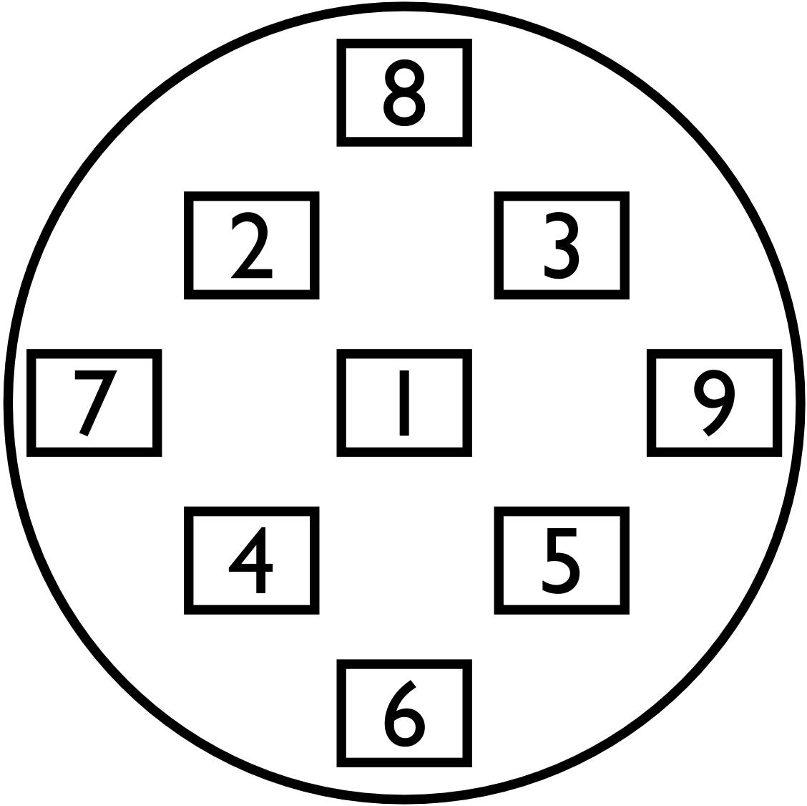

#.	Build a PCA model on all the data.
#.	Plot the scores for the first two components.  What do you notice?  Investigate the outliers, and the raw data for each of these unusual observations.  What do you conclude about those observations?
#.	Exclude the unusual observations and refit the model.  
#.	Now plot the scores plot again; do things look better?  Record the :math:`R^2` and :math:`Q^2` values for the first three components.  Are the :math:`R^2` and :math:`Q^2` values close to each other; what does this mean?
#.	Plot a loadings plot for the first component.  What is your interpretation of :math:`p_1`?  Given the :math:`R^2` and :math:`Q^2` values for this first component (previous question), what is your interpretation about the variability in this process?
#.	And the interpretation of :math:`p_2`?  From a quality control perspective, if you could remove the variability due to :math:`p_2`, how much of the variability would you be removing from the process?
#.	Also plot the corresponding time series plot for :math:`t_1`.  What do you notice in the sequence of score values?
#.	Repeat the above question for the second component.
#.	Finally, plot both the :math:`t_1` and :math:`t_2` values on the same plot, but in time-order, to see the smaller variance that :math:`t_2` explains.

What we learned:

* Identifying outliers; removing them and refitting the model.
* Variability in a process can very often be interpreted.  The :math:`R^2` and :math:`Q^2` values for each component show which part of the variability in the system is due the particular phenomenon modelled by that component.

	
.. _LVM-process-troubleshooting-plastic-pellets:

Process troubleshooting
~~~~~~~~~~~~~~~~~~~~~~~~~~

Recent trends show that the yield of your company's flagship product is declining. You are uncertain if the supplier of a key raw material is to blame, or if it is due to a change in your process conditions. You begin by investigating the raw material supplier.

The data available has:

* :math:`N = 24`
* :math:`K = 6` + 1 designation of process outcome.
* Web address: http://datasets.connectmv.com/info/raw-material-characterization
* Description: 3 of the 6 measurements are size values for the plastic pellets, while the other 3 are the outputs from thermogravimetric analysis (TGA), differential scanning calorimetry (DSC) and thermomechanical analysis (TMA), measured in a laboratory. These 6 measurements are thought to adequately characterize the raw material. Also provided is a designation ``Adequate`` or ``Poor`` that reflects the process engineer's opinion of the yield from that lot of materials.

Import the data, and set the ``Outcome`` variable as a secondary identifier for each observation, as shown in the illustration below.  The observation's primary identifier is its batch number.

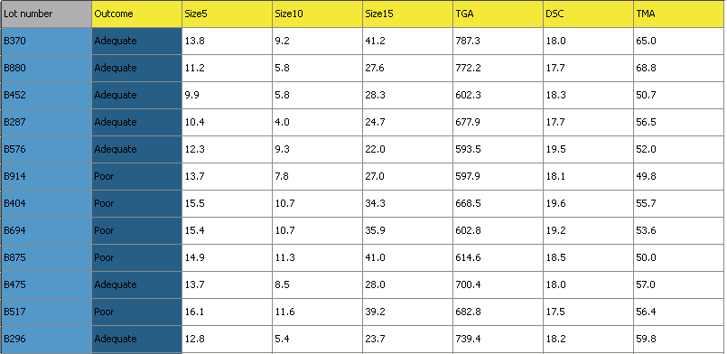

#. Build a latent variable model for all observations and use auto-fit to determine the number of components. 
#. Interpret component 1, 2 and 3 separately (using the loadings bar plot).
#. Now plot the score plot for components 1 and 2, and colour code the score plot with the ``Outcome`` variable.  Interpret why observations with ``Poor`` outcome are at their locations in the score plot (use a contribution plot). 
#. What would be your recommendations to your manager to get more of your batches classified as ``Adequate`` rather than ``Poor``?

What we learned so far:

* How to use an indicator variable in the model to learn more from our score plot.
* How to build a data set, and bring in new observations as testing data.

#. Now build a model only on the observations marked as ``Adequate`` in the Outcome variable.
#. Re-interpret the loadings plot for :math:`p_1` and :math:`p_2`.  Is there a substantial difference between this new loadings plot and the previous one?

Principal properties of surfactants
~~~~~~~~~~~~~~~~~~~~~~~~~~~~~~~~~~~~

* :math:`N=38`
* :math:`K=19`
* :math:`M=4`
* Missing data: yes
* Web address: http://datasets.connectmv.com/info/surfactants
* Description: These 38 non-ionic surfactants, ingredients for making a detergent, were characterized (described) by taking 19 measurements (the other 4 columns will be used in a future study).  The first purpose of this data set was to understand how these 19 properties are related to each other, and to find a representative sub-sample from the rows in |X| which could be selected for further study.

#.	Import the data, making sure you exclude the ``YDet``, ``YConc``, ``YTemp``, and ``YTox`` variables.  Build a PCA model on the 19 columns in remaining in |X|.
#.	Study the first two components.  What do you notice in the score plot?  Investigate this feature that seems interesting and try to explain why it occurs.
#.	Exclude the cluster (they were related to surfactants which were too lipophilic) for the rest of the study.
#.	Rebuild the model.  
#.	Since the purpose of the original data set was to find a smaller group of samples that are representative of all surfactants, which samples would you select for further study and why?
#.	Save the :math:`t_1` *vs* :math:`t_2` score plot to a figure (e.g. BMP) and mark these samples on it to show your colleagues/manager.
