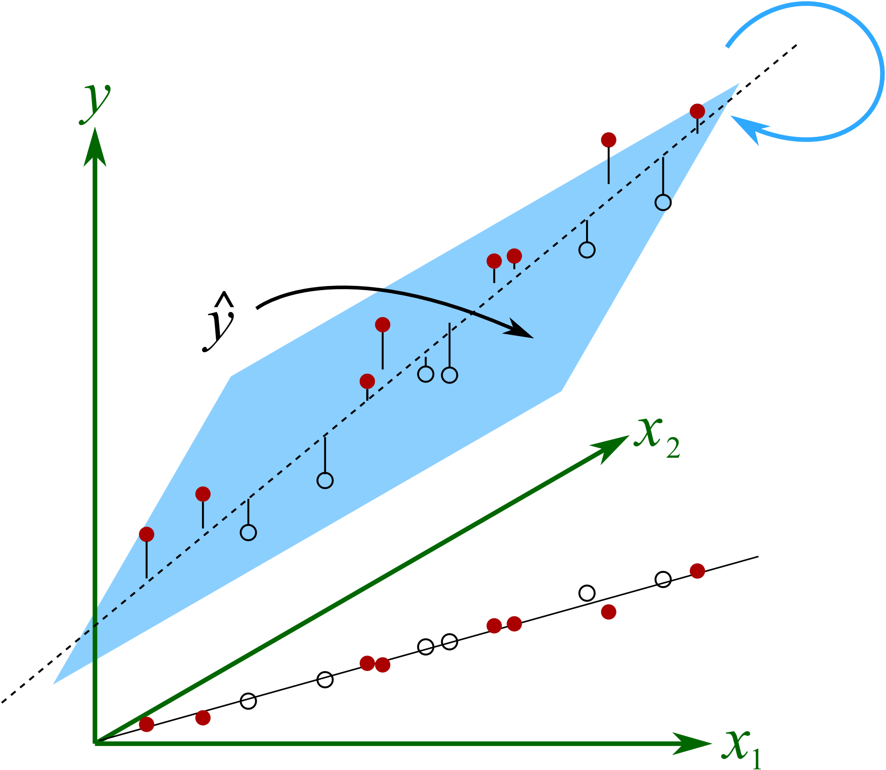
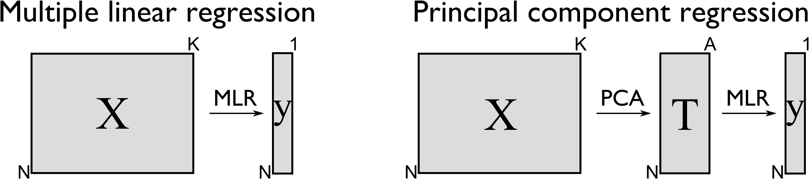
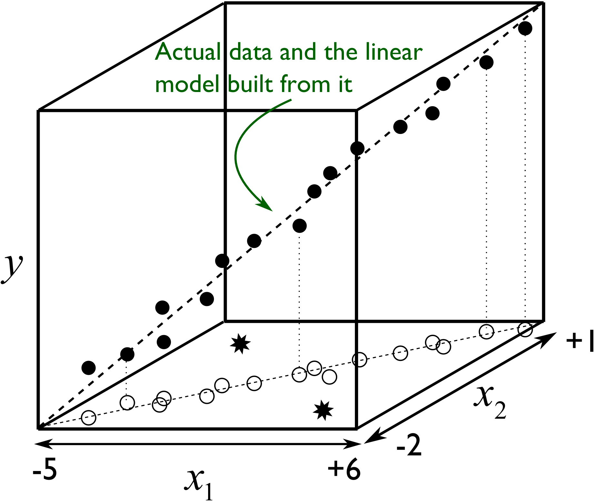
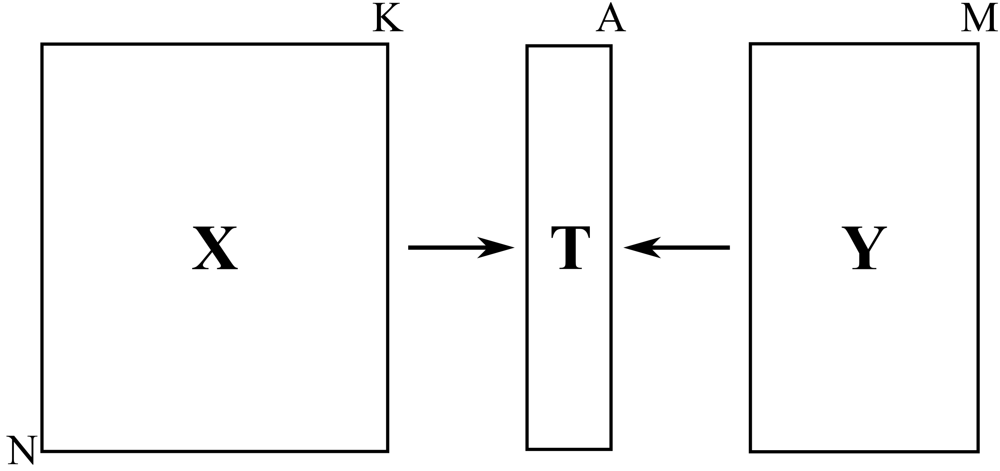
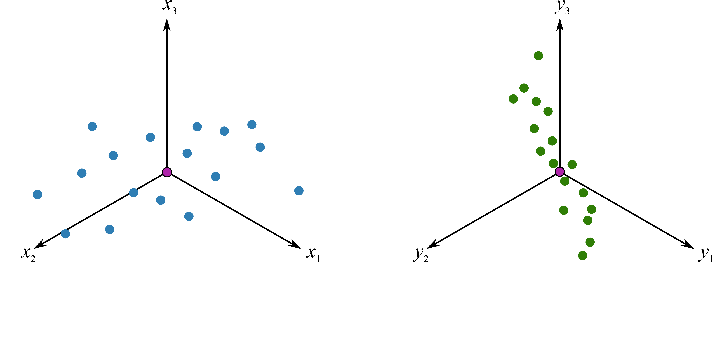
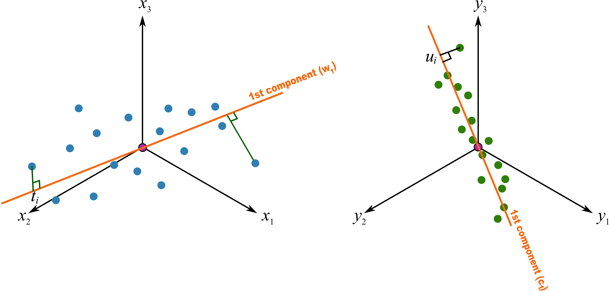
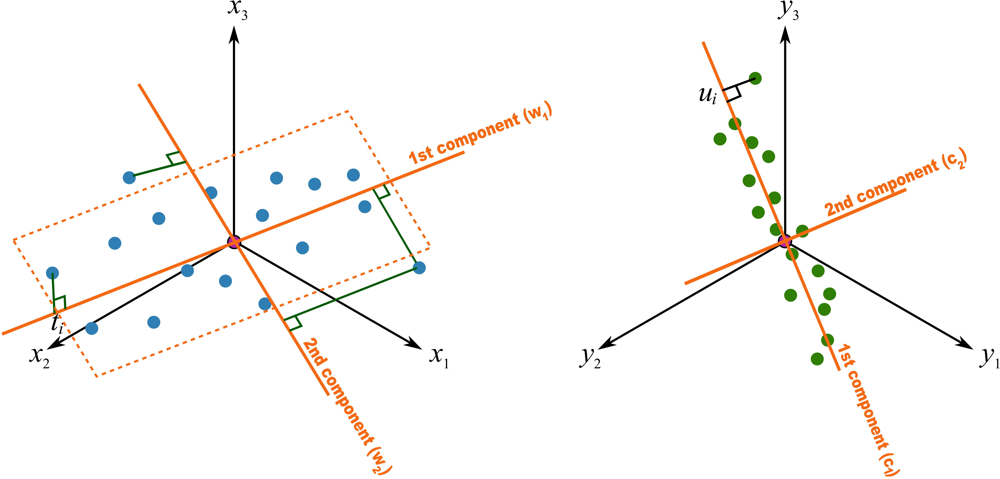
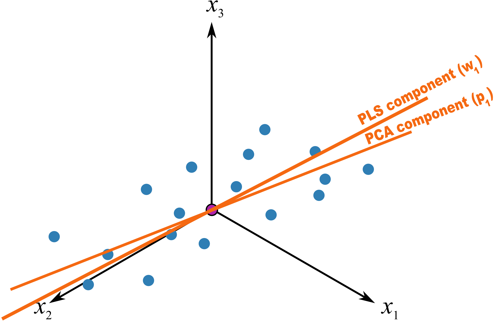
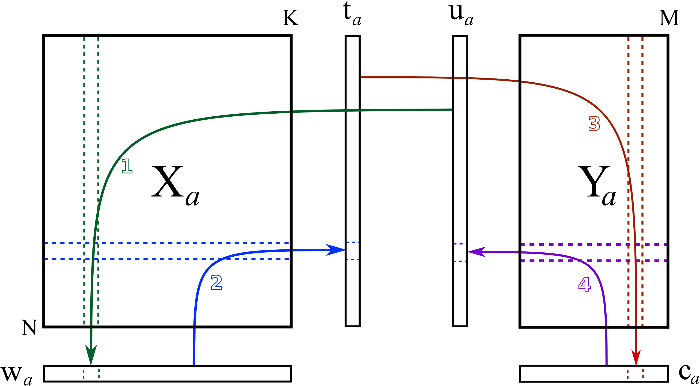
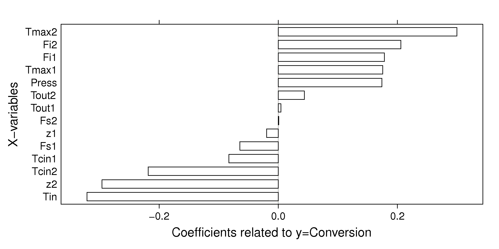

References and readings
========================

.. index::
	pair: references and readings; projection to latent structures
	see: PLS; projection to latent structures
	see: partial least squares; projection to latent structures

These readings cover a variety of topics in the area of latent variable methods:

*	**PLS**: Svante Wold, Michael Sjöström, Lennart Eriksson: "`PLS-regression: A Basic Tool of Chemometrics <http://dx.doi.org/10.1016/S0169-7439(01)00155-1>`_", *Chemometrics and Intelligent Laboratory Systems*, **58**, 109-130, 2001.

*	**PLS**: S. Wold, S. Hellberg, T. Lundstedt, M. Sjöström and H. Wold, "PLS Modeling With Latent Variables in Two or More Dimensions", Frankfurt PLS meeting, 1987 (*available on request, by email to papers@connectmv.com*)

*	**PLS**: Paul Geladi and Bruce Kowalski, "`Partial Least-Squares Regression: A Tutorial <http://dx.doi.org/10.1016/0003-2670(86)80028-9>`_", *Analytica Chimica Acta*, **185**, 1-17, 1986.

*	**PLS**: Paul Garthwaite, "`An Interpretation of Partial Least Squares <http://www.jstor.org/pss/2291207>`_", Journal of the American Statistical Association, **89**, 122-127, 1994.

*	**General**: Ericsson, Johansson, Kettaneth-Wold, Trygg, Wikström, Wold: "Multivariate and Megavariate Data Analysis" (`Part I <http://books.google.com/books?id=B-1NNMLLoo8C&lpg=PP1&pg=PP1#v=onepage&q&f=false>`_ and `Part II <http://books.google.com/books?id=2CHrDa-kBSYC&lpg=PP1&pg=PP1#v=onepage&q&f=false>`_).

.. _LVM-PCR:
 
Principal component regression (PCR)
=====================================

Principal component regression (PCR) is an alternative to multiple linear regression (MLR) and has many advantages over MLR.

In multiple linear regression we have two matrices: :math:`\mathbf{X}`, an :math:`N \times K` matrix whose columns we relate to the single vector, :math:`\mathbf{y}`, an :math:`N \times 1` vector, using a model of the form: :math:`\mathbf{y} = \mathbf{Xb}`.  The solution vector :math:`\mathbf{b}` is found by solving :math:`\mathbf{b} = \left(\mathbf{X'X}\right)^{-1}\mathbf{X'y}`.  The variance of the estimated solution is given by :math:`\mathcal{V}(\mathbf{b}) = \left(\mathbf{X'X}\right)^{-1}S_E^2`.

In the section on :ref:`factorial experiments <DOE-two-level-factorials>` we intentionally set our process to generate a matrix :math:`\mathbf{X}` that has independent columns.  This means that each column is orthogonal to the others, you cannot express one column in terms of the other, and it results in a diagonal :math:`\mathbf{X'X}` matrix.

On most data sets though the columns in |X| are correlated.  Correlated columns are not too serious if they are mildly correlated.  But the illustration here shows the problem with strongly correlated variables, in this example :math:`x_1` and :math:`x_2`, which are being used to create a predictive model for :math:`y`.  The model plane, :math:`\hat{y}=b_0 + b_1x_1 + b_2x_2` is found so that it minimizes the residual error. There is a unique minimum for the sum of squares of the residual error (i.e. the objective function).  But very small changes in the raw data in these cases will lead to almost no change in the objective function, but will show large fluctuations in the solution for :math:`\mathbf{b}`.  This can be visualized in this illustration.

The plane will rotate around the axial, dashed line if we make small changes in the raw data.  At each new rotation we will get very different values of :math:`b_1` and :math:`b_2`, but the objective function's minimum value does not change very much.  This phenomena shows up in the least squares solution as wide confidence intervals for the coefficients, since the off-diagonal elements in :math:`\mathbf{X'X}` will be large. This has important consequences when you are trying to learn about your process from this model: you have to use caution.  A model with low or uncorrelated variables is well-supported by the data, and cannot be arbitrarily rotated.

The common "solution" to this problem of collinearity is to revert to variable selection.  The modeller selects a subset of uncorrelated columns from |X| rather than using the full matrix.  When :math:`K` is large, then this becomes a large computational burden.

We face another problem with MLR: the assumption that the variables in |X| are measured without error, which we know to be untrue in many practical engineering situations.  Furthermore, MLR cannot handle missing data. 

The main idea with principal component regression is to replace the many columns in |X| with their uncorrelated score vectors from PCA. 

In other words, we replace the :math:`N \times K` matrix of raw data with a smaller :math:`N \times A` matrix of data that summarizes the original |X| matrix.  Then we relate these scores to the |y| variable.  Mathematically it is a two-step process:

.. math::
	1.&\qquad \mathbf{T} = \mathbf{XP}\\
	2.&\qquad \widehat{\mathbf{y}} = \mathbf{Tb} \qquad \text{and can be solved as}\qquad \mathbf{b} = \left(\mathbf{T'T}\right)^{-1}\mathbf{T'y}

This has a number of advantages:

#.	The columns in |T|, the scores from PCA, are orthogonal to each other.
#.	These scores can be calculated even if there are missing data in |X|.
#.	We have removed the assumption of errors in X, since :math:`\widehat{\mathbf{X}} = \mathbf{TP' + E}`.  We have replaced it with the assumption that there is no error in |T|, a more realistic assumption, since PCA separates the noise from the systematic variation in |X|.  The :math:`\mathbf{T}`'s are expected to have much less noise than the  :math:`\mathbf{X}`'s.
#.	The relationship of each score column in |T| to vector |y| can be interpreted independently of each other.
#.	Using MLR requires that :math:`N > K`, but with PCR this changes to :math:`N > A`; an assumption that is easily met for short and wide |X| matrices with many correlated columns.
#.	There is much less need to resort to selecting variables in |X|; the general approach is to use the entire |X| matrix to fit the PCA model.  We actually use the correlated columns in |X| to stabilize the PCA solution, much in the same way that extra data improves the estimate of a mean (recall the central limit theorem).
#.	To me one of the greatest advantages of MLR though is the free consistency check that one gets on the raw data, which you don't have for MLR.  Always check the SPE and Hotelling's |T2| value for an observation in |X| in the first step. If SPE is close to the model plane, and |T2| is within the range of the previous |T2| values, then the prediction from the second step should be reasonable.

Illustrated as follows we see the misleading strategy that is regularly seen with MLR.  The modeller has build a least squares model relating :math:`x_1` and :math:`x_2` to :math:`y`, over the given ranges of :math:`x`. The closed circles represent the actual data, while the open circles are the projections of the :math:`x_1` and :math:`x_2` values on that plane. The predictive model works adequately.

But the misleading strategy often used by engineers is to say that the model is valid as long as :math:`-5 \leq x_1 \leq +6` and :math:`-2 \leq x_2 \leq +1`.  If the engineer wants to use the model at the points marked with \*, the results will be uncertain, even though those marked points obey the given constraints.  The problem is that the engineer has not taken the correlation between the variables into account.  With PCR we would immediately detect this: the points marked as * would have a large SPE values, indicating they are not consistent with the model.

Here then is the procedure for **building** a principal component regression model.

#.	Collect the |X| and |y| data required for the model.
#.	Build a PCA model on the data in |X|, fitting :math:`A` components. We usually set :math:`A` by cross-validation, but often components beyond this will be useful.  Iterate back to this point after the initial model to assess if :math:`A` should be increased.
#.	Examine the SPE and |T2| plots from the PCA model to ensure the model is not biased by unusual outliers.
#.	Use the columns in |T| from PCA as your data source for the usual multiple linear regression model (i.e. they are now the |X|-variables in an MLR model).
#.	Solve for the MLR model parameters, :math:`\mathbf{b} = \left(\mathbf{T'T}\right)^{-1}\mathbf{T'y}`, an :math:`A \times 1` vector.

**Using** the principal component regression model for a new observation:

#.	Obtain your vector of new data, :math:`\mathbf{x}'_\text{new, raw}`, a :math:`1 \times K` vector.
#.	Preprocess this vector in the same way that was done when building the PCA model (usually just mean centering and scaling) to obtain :math:`\mathbf{x}'_\text{new}`
#.	Calculate the scores for this new observation: :math:`\mathbf{t}'_\text{new} = \mathbf{x}'_{\text{new}} \mathbf{P}`.
#.	Find the predicted value of this observation: :math:`\widehat{\mathbf{x}}'_\text{new} = \mathbf{t}'_\text{new} \mathbf{P}'`.
#.	Calculate the residual vector: :math:`\mathbf{e}'_\text{new} = \mathbf{x}'_{\text{new}} - \widehat{\mathbf{x}}'_\text{new}`.
#.	Then compute the residual distance from the model plane: :math:`\text{SPE}_\text{new} = \sqrt{\mathbf{e}'_\text{new} \mathbf{e}_\text{new}}`
#.	And the Hotelling's |T2| value for the new observation: :math:`T^2_\text{new} = \displaystyle \sum_{a=1}^{a=A}{\left(\dfrac{t_{\text{new},a}}{s_a}\right)^2}`.
#.	Before calculating the prediction from the PCR model, first check the :math:`\text{SPE}_\text{new}` and :math:`T^2_\text{new}` value against their 95% or 99% limits.  If the new observation is below these limits, then go on to calculate the prediction: :math:`\widehat{y}_\text{new} = \mathbf{t}'_\text{new}\mathbf{b}`.
#.	If either of the limits is exceeded, then one should investigate the contributions to SPE, |T2| or the individuals scores to see why the new observation is unusual.

Multiple linear regression, though relatively simpler to implement, has no such consistency check on the new observation's x-values.  It simply calculates a direct prediction for :math:`\widehat{y}_\text{new}`.

One of the main applications in engineering for PCR is in the use of software sensors, also called :ref:`inferential sensors <LVM-inferential-sensors>`.
	
..	* page 52 of pencil notes

	Linear regression:
		* Assumes no noise in X 
		* No missing data
		* Correlation: resort to variable selection
		* Correlation in X inflates regression coefficient’s confidence interval
		* Single Y-variable only

	Projection to latent structures:
		* No such assumptions 
		* Handles missing data 
		* No need for variable selection
		* Handles correlated data 
		* Handles multiple correlated Y’s

	X-space model: allows us to judge if the X-data are reasonable:
		*	Hotelling’s T2 (on-the-plane metric)
		*	SPE (off-the-plane metric)
		*	If T2 and SPE value are below their limits, then we go ahead and make our prediction with confidence from the new X-vector.
	
	* MLR shortcomings
	

..	From Carlos' paper:
		
	Projection to Latent Structures (PLS) is a multivariate regression 
	tool that helps to reveal correlation amongst input-variables or
	predictors (X-space) and also their impact on several responses
	(Y-space). This is done by separating regularities from noise in
	the data. PLS handles data with strong collinearity, noise and miss-
	ing values in both the X- and Y-spaces. This tool reduces the
	dimension of the system to smaller number of ‘‘latent variables”
	(referred to as principal components or scores) that can simultaneously explain the signifiant variance in X, and also predict Y.
	The higher the correlation in the data the fewer the principal components that are computed. The scores are independent of each
	other and are a linear combination of the original predictors. The
	weight of each predictor that is used to calculate the scores is directly related to their level of influence on the measured Y-space
	properties. An important aspect of PLS is the ability to show the
	interrelationship among all predictors, the relationship among all
	responses, and simultaneously the predictors’ influence on the
	measured responses, all of them in a single plot, the w*c plot. All
	these calculations are usually carried out by first centering the data
	to have a mean of zero and then scaling to unit variance. This process of mean centering and scaling is done in order to give each
	variable the same weight and importance prior to the analysis. This
	is done to counteract the effect of scaling in different measurements units, and to allow each variable to contribute equally to
	the model. As a regression tool, PLS provides a measure of the
	goodness of fit, R2. R2 is an indication of how much variance in
	the data is explained by the model. R2, for any regression tool,
	including PLS, can always be increased by adding more terms
	(complexity) to the hypothesized model. A far better metric to
	gauge model performance is by using the so-called Q2 metric. Q2
	is an indicator that measures how well the regression model can
	predict new data. One technique to estimate Q2 is by cross-validation. This method consists of dividing the data into a number of
	groups. Models are built with a group of data left out – one group
	at a time. With each model, the corresponding omitted data are
	predicted and the total prediction error sum of squares calculated.
	Q2, like R2, varies between 0 and 1, where values closer to 1 indicate better prediction ability. The Q2 value will always be smaller
	than R2. Finally, Q2 is used to select the number of principal components (model complexity) to avoid over-fitting.
	PLS models can be converted to a standard linear regression
	form as given by the following equation:
	
	:math:`\hat{y} = b_0 + \sum{b_i x_i}`
	
	where k is a constant, bn is the coefficient corresponding to the pre-
	dictor xn and y is the predicted y-property. Details of the PLS calcu-
	^
	lations can be found elsewhere [Wold S, Sjöström M, Eriksson L. PLS-regression: a basic tool of chemometrics.
	Chemom Intell Lab Syst 2001;58(2):109–30.
	]. Several software packages are
	available to create PLS models. The SIMCA-P software by Umetrics
	was used in this work.
	
Projection to Latent Structures (PLS)
========================================================

Projection to Latent Structures (PLS) is the first step we will take to extending latent variable methods to using more than one block of data.  In the PLS method we divide our variables (columns) into two blocks: called |X| and |Y|.  

We will :ref:`cover later on <LVM-PLS-what-in-X-and-Y>` how to choose which variables go in each block, but for now you can use the rule of thumb that says |X| takes the variables which are always available when using the model.  Both |X| and |Y| must be available when building the model, but later, when using the model, only |X| is required.  As you can guess, one of the major uses of PLS is for predicting variables in |Y| using variables in |X|, but this is not its only purpose as a model.

PLS can be used for process monitoring and for optimizing the performance of a process.  It is also widely used for new product development, or for improving existing products.  In all these cases the |Y| block most often contains the outcome, or quality properties.

However, PLS is most commonly used for prediction.  And this is also a good way to introduce PLS.  In (chemical) engineering processes we use it to develop software sensors (also known as inferential sensors) that predict time-consuming lab measurement in real-time, using the on-line data from our processes.  In laboratories we use spectral data (e.g. NIR spectra) to predict the composition of a liquid; this is known as the calibration problem; once calibrated with samples of known composition we can predict the composition of future samples.

So for predictive uses, a PLS model is very similar to :ref:`principal component regression <LVM-PCR>` (PCR) models.  And PCR models were a big improvement over using multiple linear regression (MLR).  In brief, PCR was shown to have these advantages:

* It handles the correlation among variables in |X| by building a PCA model first, then using those orthogonal scores, |T|, instead of |X| in an ordinary multiple linear regression.  This prevents us from having to resort to variable selection.
* It extracts these scores |T| even if there are missing values in |X|.
* We reduce, but don't remove, the severity of the assumption in MLR that the predictor's, |T| in this case, are noise-free.  This is because the PCA scores are less noisy than the raw data |X|.
* With MLR we require that :math:`N > K` (number of observations is greater than the number of variables), but with PCR this is reduced to :math:`N > A`, and since :math:`A<<K` this requirement is often true, especially for spectral data sets.
* We get the great benefit of a consistency check on the raw data, using SPE and |T2| from PCA, before moving to the second prediction step.

An important point is that PCR is a two-step process:

In other words, we replace the :math:`N \times K` matrix of raw data with a smaller :math:`N \times A` matrix of data that summarizes the original |X| matrix.  Then we relate these scores to the |y| variable.  Mathematically it is a two-step process:

.. math::
	1.&\qquad \mathbf{T} = \mathbf{XP}\\
	2.&\qquad \widehat{\mathbf{y}} = \mathbf{Tb} \qquad \text{and can be solved as}\qquad \mathbf{b} = \left(\mathbf{T'T}\right)^{-1}\mathbf{T'y}

The PLS model goes a bit further and introduces some additional advantages over PCR:

* A single PLS model can be built for multiple, correlated |Y| variables.  The eliminates having to build |M| PCR models, one for each column in |Y|.
* The PLS model directly assumes that there is error in |X| and |Y|.  We will return to this important point of an |X|-space model later on.
* PLS is more efficient than PCR in two ways: with PCR, one or more of the score columns in |T| may only have a small correlation with |Y|, so these scores are needlessly calculated.  Or as is more common, we have to extract many PCA components, going beyond the level of what would normally be calculated (essentially overfitting the PCA model), in order to capture sufficient predictive columns in |T|.  This augments the size of the PCR model, and makes interpretation harder, which is already strained by the two-step modelling required for PCR.

Like PCR, PLS also extracts sequential components, but it does so, simultaneously using the data in |X| and |Y|. So it can be seen to be very similar to PCR, but that it calculates the model in one go.  From the last point just mentioned, it is not surprising that PLS often requires fewer components than PCR to achieve the same level of prediction.  In fact when compared to several regression methods, MLR, ridge regression and PCR, a PLS model is often the most "compact" model.

We will get into the details shortly, but as a starting approximation, you can visualize PLS as a method that extracts a single set of scores, |T|, from both |X| and |Y| simultaneously.

From an engineering point of view this is quite a satisfying interpretation.  After all, the variables we chose to be in |X| and in |Y| come from the same system.  That system is driven (moved around) by the *same underlying latent variables*. 

.. _LVM-PLS-conceptual-interpretation:

A conceptual explanation of PLS
~~~~~~~~~~~~~~~~~~~~~~~~~~~~~~~~~~~~

Now that you are comfortable with the concept of a latent variable using PCA and PCR, you can interpret PLS as a latent variable model, but one that has a different objective function.  In PCA the objective function was to calculate each latent variable so that it best explains the available variance in :math:`\mathbf{X}_a`.  In case you are wondering what the subscript |A| refers to: it is the matrix :math:`\mathbf{X}` before extracting the :math:`a^\text{th}` component.

In PLS, we also find these latent variables, but we find them so they best explain :math:`\mathbf{X}_a` and best explain :math:`\mathbf{Y}_a`, and so that these latent variables have the strongest possible relationship between :math:`\mathbf{X}_a` and :math:`\mathbf{Y}_a`.

In other words, there are three simultaneous objectives with PLS:

	#. The best explanation of the |X|-space.
	#. The best explanation of the |Y|-space.
	#. The greatest relationship between the |X|- and |Y|-space.

.. _LVM-PLS-mathematical-interpretation:

A mathematical/statistical interpretation of PLS 
~~~~~~~~~~~~~~~~~~~~~~~~~~~~~~~~~~~~~~~~~~~~~~~~~~~~

We will get back to the :ref:`mathematical details later on <LVM-PLS-calculation>`, but we will consider our conceptual explanation above in terms of mathematical symbols.

In PCA, the objective was to best explain |X|.  To do this we calculated scores, |T|, and loadings |P|, so that each component, :math:`\mathbf{t}_a`, had the greatest variance, while keeping the loading direction, :math:`\mathbf{p}_a`, constrained to a unit vector.

.. math::
	\max : \mathbf{t}'_a \mathbf{t}_a \qquad \text{subject to}\quad \mathbf{p}'_a \mathbf{p}_a = 1.0

The above was shown to be a concise mathematical way to state that these scores and loadings best explain |X|; no other loading direction will have greater variance of :math:`\mathbf{t}'_a`.  (The scores have mean of zero, so their variance is proportional to :math:`\mathbf{t}'_a \mathbf{t}_a`).

For PCA, for the :math:`a^\text{th}` component, we can calculate the scores as follows (we are projecting the values in :math:`\mathbf{X}_a` onto the loading direction :math:`\mathbf{p}_a`):

.. math::
	\mathbf{t}_a &= \mathbf{X}_a \mathbf{p}_a
	

Now let's look at PLS.  Earlier we said that PLS extracts a single set of scores, |T|, from |X| and |Y| simultaneously.  That wasn't quite true, but it is still an accurate statement!  PLS actually extracts two sets of scores, one set for |X| and another set for |Y|.  We write these scores for each space as:

.. math::
	\begin{array}{rcl}
	\mathbf{t}_a &= \mathbf{X}_a \mathbf{w}_a \qquad &\text{for the $\mathbf{X}$-space} \\
	\mathbf{u}_a &= \mathbf{Y}_a \mathbf{c}_a \qquad &\text{for the $\mathbf{Y}$-space}
	\end{array}
	
The objective of PLS is to extract these scores so that they have *maximal covariance*.  Let's take a look at this.  Covariance was shown to be:
	
.. math::
	\text{Cov}\left(\mathbf{t}_a, \mathbf{u}_a\right) = \mathcal{E}\left\{ (\mathbf{t}_a - \overline{\mathbf{t}}_a) (\mathbf{u}_a - \overline{\mathbf{u}}_a)\right\} 
	
Using the fact that these scores have mean of zero, the covariance is proportional (with a constant scaling factor of :math:`N`) to :math:`\mathbf{t}'_a \mathbf{u}_a`.  So in summary, each component in PLS is maximizing that covariance, or the dot product: :math:`\mathbf{t}'_a \mathbf{u}_a`.

Now covariance is a hard number to interpret; about all we can say with a covariance number is that the larger it is, the greater the relationship, or *correlation*, between two vectors. So it is actually more informative to consider the correlation of :math:`\mathbf{t}'_a` with :math:`\mathbf{u}_a`.

.. math::
	\text{Cov}\left(\mathbf{t}_a, \mathbf{u}_a\right) &= \text{Correlation}\left(\mathbf{t}_a, \mathbf{u}_a\right) \times \sqrt{\text{Var}\left(\mathbf{t}_a\right)}\times \sqrt{\text{Var}\left(\mathbf{u}_a\right)} \\
	\text{Cov}\left(\mathbf{t}_a, \mathbf{u}_a\right) &= \text{Correlation}\left(\mathbf{t}_a, \mathbf{u}_a\right) \times \sqrt{\mathbf{t}'_a \mathbf{t}_a}  \times \sqrt{\mathbf{u}'_a \mathbf{u}_a} \\

As this shows then, maximizing the covariance between :math:`\mathbf{t}'_a` and :math:`\mathbf{u}_a` is actually maximizing the 3 simultaneous objectives mentioned earlier:

	#. The best explanation of the |X|-space: given by :math:`\mathbf{t}'_a \mathbf{t}_a`
	#. The best explanation of the |Y|-space. given by :math:`\mathbf{u}'_a \mathbf{u}_a`
	#. The greatest relationship between the |X|- and |Y|-space: given by :math:`\text{correlation}\left(\mathbf{t}_a, \mathbf{u}_a\right)`

These scores, :math:`\mathbf{t}'_a` and :math:`\mathbf{u}_a`, are found subject to the constraints that :math:`\mathbf{\mathbf{w}'_a \mathbf{w}_a} = 1.0` and :math:`\mathbf{\mathbf{c}'_a \mathbf{c}_a} = 1.0`.  This is similar to PCA, where the loadings :math:`\mathbf{p}_a` were constrained to unit length.  In PLS we constrain the loadings for |X|, called :math:`\mathbf{w}_a`, and the loadings for |Y|, called :math:`\mathbf{c}_a`, to unit length.

The above is a description of one variant of PLS, `known as SIMPLS <http://dx.doi.org/10.1016/0169-7439(93)85002-X>`_ (simple PLS).  

.. _LVM-PLS-geometric-interpretation:

A geometric interpretation of PLS 
~~~~~~~~~~~~~~~~~~~~~~~~~~~~~~~~~~~~

:ref:`As we did with PCA <LVM-PCA-geometric-interpretation>`, let's take a geometric look at the PLS model space.  In the illustration below we happen to have :math:`K=3` variables in |X|, and :math:`M=3` variables in |Y|.  Once the data are centered and scaled we have just shifted our coordinate system to the origin.  Notice that there is one dot in |X| for each dot in |Y|.  Each dot represents the row from the corresponding |X| and |Y| matrix.

We assume here that you understand how the scores are the perpendicular projection of each data point onto direction vector (if not, please review the :ref:`relevant section <LVM-PCA-geometric-interpretation>` in the PCA notes).  In PLS though, the direction vectors, :math:`\mathbf{w}_1` and :math:`\mathbf{c}_1`, are found and each observation is projected onto the direction.  The point at which each observation lands is called the |X|-space score, :math:`t_i`, or the |Y|-space score, :math:`u_i`.  These scores are found so that the covariance between the :math:`t`-values and :math:`u`-values is maximized.

As :ref:`explained above <LVM-PLS-conceptual-interpretation>`, this means that the latent variable directions are  oriented so that they best explain |X|, and best explain |Y|, and have the greatest possible relationship between |X| and |Y|.

The second component is then found so that it is orthogonal to the first component in the |X| space (the second component is not necessarily orthogonal in the |Y|-space, though it often is close to orthogonal).

Interpreting the scores in PLS
~~~~~~~~~~~~~~~~~~~~~~~~~~~~~~~~~

Like in PCA, our |T| scores in PLS are a summary of the data from *both* blocks.  The reason for saying that, even though there are two sets of scores, |T| and |U|, for each of |X| and |Y| respectively, is that they have maximal covariance.  We can interpret one set of them.  In this regard, the |T| scores are more readily interpretable, since they are always available.  The |U| scores are not available until |Y| is known.  We have the |U| scores during model-building, but when we use the model on new data (e.g. when making predictions using PLS), then we only have the |T| scores.  We will revisit this point again :ref:`later on <LVM-PLS-on-new-data>`.

The scores for PLS are interpreted in exactly the :ref:`same way as for PCA <LVM-interpreting-scores>`.  Particularly, we look for clusters, outliers and interesting patterns in the line plots of the scores.

The only difference that must be remembered is that these scores have a different orientation to the PCA scores.  As illustrated below, the PCA scores are found so that only explain the variance in |X|; the PLS scores are calculated so that they also explain |Y| and have a maximum relationship between |X| and |Y|.  Most time these directions will be close together.

Interpreting the loadings in PLS
~~~~~~~~~~~~~~~~~~~~~~~~~~~~~~~~~

:ref:`Like with the loadings from PCA <LVM-interpreting-loadings>`, :math:`\mathbf{p}_a`,we interpret the loadings :math:`\mathbf{w}_a` from PLS in the same way.  Highly correlated variables have similar weights in the loading vectors and appear close together in the loading plots of all dimensions.  

We tend to refer to the PLS loadings, :math:`\mathbf{w}_a`, as weights; this is for reasons that will be explained soon.

There are two important difference though when plotting them.  The first is that we superimpose the loadings plots for the |X| and |Y| space simultaneously.  This is very powerful, because we not only see the relationship between the |X| variables (from the :math:`\mathbf{w}` vectors), we also see the relationship between the |Y| variables (from the :math:`\mathbf{c}` vectors), and even more usefully, the relationship between all these variables.

This agrees again with our (engineering) intuition that the |X| and |Y| variables are from the same system, they have just been, some what arbitrarily, put into different blocks.  The variables in |Y| could just have easily been in |X|, but they are usually not available at a high enough rate, or at a low enough cost.  So it makes sense to consider the :math:`\mathbf{w}_a` and :math:`\mathbf{c}_a` weights simultaneously.

The second important difference is that we don't actually look at the :math:`\mathbf{w}` vectors directly, we consider rather what is called a :math:`\mathbf{w*}` vector (w-star).  The |w*| vectors show the effect of each of the original variables, in undeflated form, rather that using the :math:`\mathbf{w}` vectors which are the deflated vectors.  This is explained next.

.. _LVM-PLS-calculation:

How the PLS model is calculated
~~~~~~~~~~~~~~~~~~~~~~~~~~~~~~~~~~~~~~

This section assumes that you are comfortable with the :ref:`NIPALS algorithm for calculating a PCA model <LVM-PCA-NIPALS-algorithm>` from |X|.  The NIPALS algorithm proceeds in exactly the same way for PLS, except we iterate through both blocks of |X| and |Y|.

The algorithm starts by selecting a column from :math:`\mathbf{Y}_a` as our estimate for :math:`\mathbf{u}_a`.  The :math:`\mathbf{X}_a` and  :math:`\mathbf{Y}_a` matrices are just the preprocessed version of the raw data when :math:`a=1`. 

   **Arrow 1**
      Perform |K| regressions, regressing each column from :math:`\mathbf{X}_a` onto the vector :math:`\mathbf{u}_a`.  The slope coefficients are stored as the entries in :math:`\mathbf{w}_a`. Columns in :math:`\mathbf{X}_a` which are strongly correlated with :math:`\mathbf{u}_a` will have large weights in :math:`\mathbf{w}_a`, while unrelated columns will have small, close to zero, weights.  We can perform these regression in one go:

      .. math::
			\mathbf{w}_a = \dfrac{1}{\mathbf{u}'_a\mathbf{u}_a} \cdot \mathbf{X}'_a\mathbf{u}_a
		
      Normalize the weight vector to unit length: :math:`\mathbf{w}_a = \dfrac{1}{\sqrt{\mathbf{w}'_a}\mathbf{w}_a} \cdot \mathbf{w}_a`.

   **Arrow 2**
      Regress every row in :math:`\mathbf{X}_a` onto the weight vector.  The slope coefficients are stored as entries in :math:`\mathbf{t}_a`.  This means that rows in :math:`\mathbf{X}_a` that have a similar pattern to that described by the weight vector will have large values in :math:`\mathbf{t}_a`.  Observations that are totally different to :math:`\mathbf{w}_a` will have near-zero score values.  These :math:`N` regressions can be performed in one go:

	.. math::
			\mathbf{t}_a = \dfrac{1}{\mathbf{w}'_a\mathbf{w}_a} \cdot \mathbf{X}_a\mathbf{w}_a

   **Arrow 3**
      Regress every column in :math:`\mathbf{Y}_a` onto this score vector now.  The slope coefficients are stored in :math:`\mathbf{c}`.   We can calculate all |M| slope coefficients:

      .. math::
			\mathbf{c}_a = \dfrac{1}{\mathbf{t}'_a\mathbf{t}_a} \cdot \mathbf{Y}'_a\mathbf{t}_a
			
   **Arrow 4**
      And finally, regress each of the :math:`N` rows in :math:`\mathbf{Y}_a` onto this weight vector, :math:`\mathbf{c}_a`.  Observations in :math:`\mathbf{Y}_a` that are strongly related to :math:`\mathbf{c}_a` will have large positive or negative slope coefficients in vector :math:`\mathbf{u}`:

      .. math::
		\mathbf{u}_a = \dfrac{1}{\mathbf{c}'_a\mathbf{c}_a} \cdot \mathbf{Y}_a\mathbf{c}_a

This is one round of the NIPALS algorithm.  We iterate through these 4 arrow steps until the :math:`\mathbf{u}_a` vector does not change much.  On convergence, we store these 4 vectors: :math:`\mathbf{w}_a, \mathbf{t}_a, \mathbf{c}_a`, and :math:`\mathbf{u}_a`.

.. Research topic: if we deflate |X| using the u's, predicted from |Y| and |c|, then how does the second component look?  Can we calculate all the |P| loadings after NIPALS has completed all components? 

Then we deflate.  Deflation removes variability already explained from :math:`\mathbf{X}_a` and :math:`\mathbf{Y}_a`.  Deflation proceeds as follows:

   **Step 1: Calculate a loadings vector for the X space**
      We calculate the loadings for the |X| space, called :math:`\mathbf{p}_a`, using the |X|-space scores: :math:`\mathbf{p}_a = \dfrac{1}{\mathbf{t}'_a\mathbf{t}_a} \cdot \mathbf{X}'_a\mathbf{t}_a`. This loadings vector is actually just a regression of every column in :math:`\mathbf{X}_a` onto the scores, :math:`\mathbf{t}_a` (in this regression the |x|-variable is the score vector, and the |y| variable is the column from :math:`\mathbf{X}_a`).

      If this is your first time reading through the notes, you should probably skip ahead to the next step in deflation.  Come back to this section after reading about how to use a PLS model on new data, then it will make more sense.

      Because it is a regression, it means that if we have a vector of scores, :math:`\mathbf{t}_a`, in the future, we can predict each column in :math:`\mathbf{X}_a` using the slope coefficients in :math:`\mathbf{p}_a`.  So for the :math:`k^\text{th}` column, our prediction of column :math:`\mathbf{X}_k` is the product of the slope coefficient, :math:`p_{k,a}`, and the score vector, :math:`\mathbf{t}_a`.  Or, we can simply predict the entire matrix in one operation: :math:`\widehat{\mathbf{X}} = \mathbf{t}_a\mathbf{p}'_a`.

      Notice that the loading vector :math:`\mathbf{p}_a` was calculated *after* convergence of the 4-arrow steps.  In other words, these regression coefficients in :math:`\mathbf{p}_a` are not really part of the PLS model, they are merely calculated to later predict the values in the |X|-space.  But why can't we use the :math:`\mathbf{w}_a` vectors to predict the :math:`\mathbf{X}_a` matrix?  Because after all, in arrow step 1 we were regressing columns of :math:`\mathbf{X}_a` onto :math:`\mathbf{u}_a` in order to calculate regression coefficients :math:`\mathbf{w}_a`.  That would imply that a good prediction of :math:`\mathbf{X}_a` would be :math:`\widehat{\mathbf{X}} = \mathbf{u}_a \mathbf{w}'_a`.

      OK, but that means we require the scores :math:`\mathbf{u}_a`.  How can we calculate these?  We get them from :math:`\mathbf{u}_a = \dfrac{1}{\mathbf{c}'_a\mathbf{c}_a} \cdot \mathbf{Y}_a\mathbf{c}_a`.  And there's the problem: the values in :math:`\mathbf{Y}_a` are not available when the PLS model is being used in the future, on new data.  In the future we will only have the new values of :math:`\mathbf{X}`.  This is why we would rather predict :math:`\mathbf{X}_a` using the :math:`\mathbf{t}_a` scores, since those scores are available in the future from new values of :math:`\mathbf{X}`.

      This whole discussion might also leave you asking why we even bother to have predictions of the :math:`\mathbf{X}`.  We do this primarily to ensure orthogonality among the |t|-scores, by removing everything from :math:`\mathbf{X}_a` that those scores explain (see the next deflation step).

      These predictions of :math:`\widehat{\mathbf{X}}` are also used to calculate the squared prediction error, a very important consistency check when using the PLS model on new data.  

   **Step 2: Remove the predicted variability from X and Y**
      Using the loadings, :math:`\mathbf{p}_a` just calculated above, we remove from :math:`\mathbf{X}_a` the best prediction of :math:`\mathbf{X}_a`, in other words, remove everything we can explain about it.  

      .. math::
          \widehat{\mathbf{X}}_a &= \mathbf{t}_a \mathbf{p}'_a \\
          \mathbf{E}_a &= \mathbf{X}_a - \widehat{\mathbf{X}}_a = \mathbf{X}_a - \mathbf{t}_a \mathbf{p}'_a  \\
          \mathbf{X}_{a+1} &= \mathbf{E}_a

      For the first component, the :math:`\mathbf{X}_{a=1}` matrix contains the preprocessed raw data.  By convention, :math:`\mathbf{E}_{a=0}` is the residual matrix *before*  fitting the first component and is just the same matrix as :math:`\mathbf{X}_{a=1}`.

      We also remove any variance explained from :math:`\mathbf{Y}_a`:

      .. math::
          \widehat{\mathbf{Y}}_a &= \mathbf{t}_a \mathbf{c}'_a \\
          \mathbf{F}_a &= \mathbf{Y}_a - \widehat{\mathbf{Y}}_a = \mathbf{Y}_a - \mathbf{t}_a \mathbf{c}'_a  \\
          \mathbf{Y}_{a+1} &= \mathbf{F}_a

      For the first component, the :math:`\mathbf{Y}_{a=1}` matrix contains the preprocessed raw data.  By convention, :math:`\mathbf{F}_{a=0}` is the residual matrix *before*  fitting the first component and is just the same matrix as :math:`\mathbf{Y}_{a=1}`.

      Notice how in both deflation steps we only use the scores, :math:`\mathbf{t}_a`, to deflate.  The scores, :math:`\mathbf{u}_a`, are not used.

The algorithm repeats all over again using the deflated matrices for the subsequent iterations.

Variability explained with each component
~~~~~~~~~~~~~~~~~~~~~~~~~~~~~~~~~~~~~~~~~~~~~~~

We can calculate :math:`R^2`-like values, since PLS explains both the |X|-space and the |Y|-space.  We use the :math:`\mathbf{E}_a` matrix to calculate the cumulative variance explained for the |X|-space.  

.. math::
	R^2_{\mathbf{X}, a, \text{cum}} = 1 - \dfrac{\text{Var}(\mathbf{E}_a)}{\text{Var}(\mathbf{X}_{a=1})}
	
Before the first component is extracted we have :math:`R^2_{\mathbf{X}, a=0} = 0.0`, since :math:`\mathbf{E}_{a=0} = \mathbf{X}_{a=1}`.  After the second component, the residuals, :math:`\mathbf{E}_{a=1}`, will have decreased, so :math:`R^2_{\mathbf{X}, a}` would have increased.

We can construct similar :math:`R^2` values for the |Y|-space using :math:`\mathbf{Y}_a` and :math:`\mathbf{F}_a` matrices.  Furthermore, we construct in an analogous manner the :math:`R^2` values for each column of :math:`\mathbf{X}_a` and :math:`\mathbf{Y}_a`.  

These :math:`R^2` values help us understand which components best explain different sources of variation.  Bar plots of the :math:`R^2` values for each column in |X| and |Y|, after a certain number of |A| components are one the best ways to visualize this information.

Common questions about PLS models
~~~~~~~~~~~~~~~~~~~~~~~~~~~~~~~~~~~~~~

.. _LVM-PLS-what-in-X-and-Y:

What goes in |X| and what goes in |Y| ?
^^^^^^^^^^^^^^^^^^^^^^^^^^^^^^^^^^^^^^^^^

.. Still to come.

.. 	* handles collinear variables
.. 	* handles multiple Y
.. 	* PLS1 vs PLS2
.. 
.. Uses:
.. 
.. 	* Predictive modelling; QSAR
.. 	* Monitoring
	

One Y or many Y's?
^^^^^^^^^^^^^^^^^^^^^^^^^^^^^^^^^^^^^^^^^

.. Still to come.

.. Do PLS2 first, then do PLS1 if the Y's are relatively orthogonal.

.. Wold 2001, p 116

	
.. _LVM-PLS-number-of-components:

How many components?
^^^^^^^^^^^^^^^^^^^^^^^^^^^^^^^^^^^^^^^^^

.. Still to come.

..  One technique to estimate Q2 is by cross-validation. This method consists of dividing the data into a number of groups. Models are built with a group of data left out – one group at a time. With each model, the corresponding omitted data are predicted and the total prediction error sum of squares calculated. Q2, like R2, varies between 0 and 1, where values closer to 1 indicate better prediction ability. The Q2 value will always be smaller than R2. Finally, Q2 is used to select the number of principal components (model complexity) to avoid over-fitting. PLS models can be converted to a standard linear regression form as given by the following equation:

.. Almost all software packages will use cross-validation for PLS to determine the number of components.  The cross-validation for PLS only considers the predictive capability of |Y|; in other words the cross-validation criterion stops adding components once the variance explained in |Y| starts to drop off.

.. This is perfectly adequate in many cases; but is certain instances we would also like the |X|-space to be well explained.  For example, when building a monitoring model, we would like to also monitor the SPE from the |X|-space.  Fortunately, in many cases, just adding one or two components manually, beyond the number from cross-validation will achieve the objective of additionally modelling the |X|-space.

.. * Wold 2001, p 116
.. * Why can we have more than 1 PC when there is only a single y?

.. _LVM-PLS-on-new-data:
	
How do I use a PLS model on new data?
^^^^^^^^^^^^^^^^^^^^^^^^^^^^^^^^^^^^^^^^^^^^

.. Still to come.

.. _LVM-PLS-W-and-Wstar: 

What is the difference between |W| and |W*|?
^^^^^^^^^^^^^^^^^^^^^^^^^^^^^^^^^^^^^^^^^^^^

After reading about the :ref:`NIPALS algorithm for PLS <LVM-PLS-calculation>` you should be aware that we deflate the |X| matrix after every component is extracted.  This means that :math:`\mathbf{w}_1` are the weights that best predict the :math:`\mathbf{t}_1` score values, our summary of the data in :math:`\mathbf{X}_{a=1}` (the preprocessed raw data).  Mathematically we can write the following, dropping the subscript for :math:`\mathbf{X}_{a=1}`, since that is just our preprocessed data.

.. math::
	\mathbf{t}_1 &= \mathbf{X}_{a=1} \mathbf{w}_1 = \mathbf{X} \mathbf{w}_1 

The problem comes once we deflate.  The :math:`\mathbf{w}_2` vector is calculated from the deflated matrix :math:`\mathbf{X}_{a=2}`, so  interpreting these scores is a quite a bit harder.

.. math::
	\mathbf{t}_2 &= \mathbf{X}_{a=2} \mathbf{w}_2 = \left(\mathbf{X} - \mathbf{t}_1 \mathbf{p}_1 \right) \mathbf{w}_2 

The :math:`\mathbf{w}_2` is not really giving us insight into the relationships between the score, :math:`\mathbf{t}_2`, and the data, :math:`\mathbf{X}`, but rather between the score and the *deflated* data, :math:`\mathbf{X}_{a=2}`.  

Ideally we would like a set of vectors we can interpret directly; something like:

.. math::
	\mathbf{t}_a &= \mathbf{X} \mathbf{w*}_a
	
One can show, using repeated substitution, that a matrix |W*|, whose columns contain :math:`\mathbf{w*}_a`, can be found from: :math:`\mathbf{W*} = \mathbf{W}\left(\mathbf{P}'\mathbf{W}\right)^{-1}`.  The first column, :math:`\mathbf{w*}_1 = \mathbf{w}_1`.

In the SIMPLS algorithm mentioned earlier, the |W*| matrix is called :math:`\mathbf{R}`, a slightly better notation that doesn't confuse the asterisk for multiplication.  Unfortunately |W*| is so well entrenched in computer software that it is unlikely to change.

So our preference is to rather interpret the |W*| weights than the |W| weights when interpreting the relationships in a PLS model.

What is the difference between |W| and |P|?
^^^^^^^^^^^^^^^^^^^^^^^^^^^^^^^^^^^^^^^^^^^^

This question is best answered by first reading the subsection above called ":ref:`How do I use a PLS model on new data <LVM-PLS-on-new-data>`".  After that, please read the description of deflation in the section on the :ref:`NIPALS algorithm for PLS <LVM-PLS-calculation>`.

Comparison to MLR (using R)
~~~~~~~~~~~~~~~~~~~~~~~~~~~~~~~~~~~~~~

.. Still to come.

The properties of PLS
~~~~~~~~~~~~~~~~~~~~~~~~

For reference, we list some properties of the PLS model structure:

*	The |A| vectors in the columns on :math:`\mathbf{W}` are orthogonal to each other: :math:`w_i \perp w_j` where :math:`i \neq j`, and :math:`i, j = 1, 2, \ldots, A`.
*	The vectors :math:`t_i` in the scores, |T|, are mutually orthogonal.
*	The vectors :math:`w_i` are orthogonal to the vectors :math:`p_j`, only for :math:`i \leq j`.

More still to come.

..	u't = (c'c)^{-1}(c'Y') t
.. * Is c'c = 1 for each component?  I.e. can we see the u's as an orthogonal projection onto the loadings for Y?  They are not unit length and they are not orthogonal.  So we cannot make that claim.

Coefficient plots in PLS
~~~~~~~~~~~~~~~~~~~~~~~~~~~~~~~~~~~~~~~~~~~~~~~~~~~~~~~~~

After building an initial PLS model one of the most informative plots to investigate are plots of the :math:`\mathbf{w*c}` vectors: using either bar plots or scatter plots.  These plots show the relationship between variables in |X|, between variables in |Y|, as well as the latent variable relationship between these two spaces.  The number of latent variables, |A|, is much smaller number than the original variables, :math:`K + M`, effectively compressing the data into a small number of informative plots.

There are models where the number of components is of moderate size, around |A| = 4 to 8, and there are several combinations of :math:`\mathbf{w*c}` plots to view.  If we truly want to understand how all the |X| and |Y| variables are related, then we must spend time investigating all these plots.  However, the coefficient plot can be very useful if one wants to learn how the |X| variables are related to the |Y| variables using *all* |A| *components*.

.. sidebar:: Caution using the coefficients
	:class:	caution
	
	It is not recommended that PLS be implemented in practice as described here.  In other words, do not try make PLS like multiple linear regression and go directly from the |X|'s to the |Y|'s using :math:`\widehat{\mathbf{y}}'_\text{new} = \mathbf{x}'_\text{new} \boldsymbol{\beta}`.
	
	Instead, one of the major benefits of a PLS model is that we first calculate the scores, then check |T2| and SPE second.  If these are below the limits, then thirdly we go ahead and calculate the predictions of |Y|.  Direct calculation of |Y| bypasses this helpful information.  Furthermore, using the :math:`\boldsymbol{\beta}` coefficients directly means that we cannot handle missing data. 
	
	*Only use the coefficients to learn about your system*.  Do not use them for prediction.

The coefficient plot is derived as follows.  First preprocess the new observation, :math:`\mathbf{x}_\text{new,raw}`, to obtain :math:`\mathbf{x}_\text{new}`.

	*	Project the new observation onto the model to get scores: :math:`\mathbf{t}'_\text{new} = \mathbf{x}'_\text{new} \mathbf{W*}`
	*	Calculate the predicted :math:`\widehat{\mathbf{y}}'_\text{new} = \mathbf{t}'_\text{new} \mathbf{C}'` 
	*	Now combine these steps: 
	
		.. math::
			\begin{array}{rcl}
			    \widehat{\mathbf{y}}'_\text{new} &=& \mathbf{t}'_\text{new} \mathbf{C}' \\
			    \widehat{\mathbf{y}}'_\text{new} &=& \mathbf{x}'_\text{new} \mathbf{W*} \mathbf{C}' \\
			    \widehat{\mathbf{y}}'_\text{new} &=& \mathbf{x}'_\text{new} \boldsymbol{\beta}
			\end{array}
		
		where the matrix :math:`\boldsymbol{\beta}` is a :math:`K \times M` matrix: each column in :math:`\boldsymbol{\beta}` contains the regression coefficients for all |K| of the |X| variables, showing how they are related to each of the |M| |Y|-variables.  
		
From this derivation we see these regression coefficients are a function of *all* the latent variables in the model, since :math:`\mathbf{W*} = \mathbf{W}\left(\mathbf{P}'\mathbf{W}\right)^{-1}` as shown in :ref:`an earlier section of these notes <LVM-PLS-W-and-Wstar>`.

In the example below there were :math:`A=6` components, and :math:`K=14` and :math:`M=5`.  Investigating all 6 of the  :math:`\mathbf{w*c}` vectors is informative, but the coefficient plot provides an efficient way to understand how the |X| variables are related to this particular |Y| variable across all the components in the model.

	
In this example the ``Tin``, ``z2``, ``Tcin2`` and ``Tmax2``, ``Fi2``, ``Fi1``, ``Tmax1``, and ``Press`` variables are all related to conversion, the |y| variable.  This does not imply a cause and effect relationships, rather it just shows they are strongly correlated.

The coefficient plots from PLS-DA models (:ref:`supervised classification <LVM-supervised-classification-PLSDA>`) can be particularly informative if there are many components.  It shows which variables in |X| are important in discriminating (predicting) the particular class.  To see this, one plots the coefficients from the relevant class column in :math:`\boldsymbol{\beta}`.

.. MENTION HERE HOW PCA, with A=K is exactly MLR.

.. YOU NEED AN EXAMPLE HERE.  I can find several contradicting examples; eg. Kamyr digester case study, where Y = YKappa; 4 components by cross; not all the variables in PC 3 and 4 match up with the coefficient plot's expectation.

.. Variable importance to projection (VIP)

	See: http://dx.doi.org/10.1137/0905052

Transformations of process data
~~~~~~~~~~~~~~~~~~~~~~~~~~~~~~~~~~~~~~~~~~~~~~~~~~~~~~~~~

There are many instances in engineering systems that benefit from data transformations.  We will describe how augmenting the |X| matrix assists in two types of data analysis.

.. _LVM-DOE-data:

Analysis of designed experiments
^^^^^^^^^^^^^^^^^^^^^^^^^^^^^^^^^^^^^^^^^^^^^^^^^

.. NOTE: you already have some of these ideas in the section "LVM-preprocessing": combine them; cross reference them?

Data from a designed experiment, particularly factorial experiments, will have independent columns in |X|.  These data tables are adequately analyzed using multiple linear regression (MLR) least squares models.  

These data are also well suited to analysis with PLS.  Since factorial models also support interaction terms, these additional interactions should be added to the |X| matrix.  For example, a full factorial design with variables **A**, **B** and **C** also supports the **AB**, **AC**, **BC** and **ABC** interactions.  These four columns should be added to the |X| matrix so that the loadings for these variables are also estimated.  If a central composite design, or some other design that supports quadratic terms has been performed, then these columns should also be added to |X|, e.g.: :math:`\text{\textbf{A}}^2`, :math:`\text{\textbf{B}}^2` and :math:`\text{\textbf{C}}^2`.

The PLS loadings plots from analyzing these DOE data are interpreted in the usual manner; and the coefficient plot is also helpful if :math:`A>2`.  

.. EXAMPLE: Carlos' thesis.

There are some other advantages of using and interpreting a PLS model built from DOE data, rather than using the MLR approach:

	*	If *additional data* (not the main factors) are captured during the experiments, particularly measurable disturbances, then these additional columns can, and should, be included in |X|.  These additional columns will remove some of the orthogonality in |X|, but this is why a PLS model would be more suitable.
	
	*	If multiple |Y| measurements were recored as the response, and particularly if these |Y| variables are correlated, then a PLS model would be better suited than building |K| separate MLR models.  A good example is where the response variable from the experiment is a complete spectrum of measurements, such as from a NIR probe.
	
One other point to note when analyzing DOE data with PLS is that the |Q2| values are often very small.  This makes intuitive sense: if the factorial levels are suitably spaced, then each experiment is at a point in the process that provides new information.  It is unlikely that cross-validation, when leaving out one or more experiments, is able to accurately predict each corner in the factorial.

Lastly, models built from DOE data allow a much stronger interpretation of the loading vectors, :math:`\mathbf{W*C}`.  This time we can infer cause-and-effect behaviour; normally in PLS models the best we can say is that the variables in |X| and |Y| are correlated.  Experimental studies that are run correctly will break happenstance correlation structures; so if any correlation that is present, then this truly is causal in nature.

.. ALSO, with DOE data we have A=1 usually;  why is this?  Try it with some data sets to verify; particularly interpret w1 and p1.

Analysis with additional first-principles knowledge
^^^^^^^^^^^^^^^^^^^^^^^^^^^^^^^^^^^^^^^^^^^^^^^^^^^^

We rarely only have data from a process; as engineers we also have additional, first-principles knowledge about the system being investigated.  We can always embed this information in the data.

An example that was mentioned in the :ref:`section of data preprocessing <LVM-preprocessing>` was that of a distillation column.  The inverse temperature is known to more correlated to the vapour pressure, known from first-principles modelling.  Using the temperature variable by itself will lead to an adequate model, but the transformed variable can lead to a better model.  We sometimes leave both variables in the model: the temperature and the calculated inverted temperature.

Exercises
==========

.. _LVM-cheddar-cheese-example:

The taste of cheddar cheese
~~~~~~~~~~~~~~~~~~~~~~~~~~~~~~~~~~~~~~~~~~~~~~~~~

* :math:`N=30`
* :math:`K=3`
* :math:`M=1`
* Web address: http://datasets.connectmv.com/info/cheddar-cheese
* Description: This very simple case study considers the taste of mature cheddar cheese.  There are 3 measurements taken on each cheese: lactic acid, acetic acid and :math:`\text{H}_2\text{S}`. 

#.	Import the data into ``R``: ``cheese <- read.csv('cheddar-cheese.csv')``
#.	Use the ``car`` library and plot a scatter plot matrix of the raw data: 

	* ``library(car)``
	* ``scatterplot.matrix(cheese[,2:5])``
	
	.. figure:: images/cheese-plots.png
		:alt:	images/cheese-plots.R
		:scale: 60%
		:width: 750px
		:align: center

#.	Using this figure, how many components do you expect to have in a PCA model on the 3 |X| variables: ``Acetic``, ``H2S`` and ``Lactic``?
#.	What would the loadings look like?
#.	Build a PCA model now to verify your answers.
#.	Before building the PLS model, how many components would you expect?  And what would the weights look like (:math:`\mathbf{w*}_1`, and :math:`\mathbf{c}_1`)?
#.	Build a PLS model and plot the :math:`\mathbf{w*c}_1` bar plot. Interpret it.
#.	Now plot the SPE plot; these are the SPE values for the projections onto the |X|-space.  Any outliers apparent?
#.	In ``R``, build a least squares model that regresses the ``Taste`` variable on to the other 3 |X| variables.  

	*	``model.lm <- lm(cheese$Taste ~ cheese$Acetic + cheese$H2S + cheese$Lactic)``
	*	Report each coefficient :math:`\pm 2 S_E(b_i)`.  Which coefficients does ``R`` find important?
	
		.. math::
			\beta_\text{Acetic} &= \qquad \qquad \pm \\
			\beta_\text{H2S} &= \qquad  \qquad \pm \\
			\beta_\text{Lactic} &= \qquad  \qquad \pm
			
	*	Report the standard error and the :math:`R^2_y` value for this model.
	
#.	Now build a PCR model in ``R`` using firstly 1 component, then using 2 components.  Again calculate the standard error and :math:`R^2_y` values.

	*	``model.pca <- prcomp(cheese[,2:4], scale=TRUE)``
	*	``T <- model.pca$x``
	*	``model.pcr.1 <- lm(cheese$Taste ~ T[,1])``
	*	``model.pcr.2 <- lm(cheese$Taste ~ T[,1:2])``

#.	Compare this to the PLS model's :math:`R^2_y` value.
#.	Plot the observed |y| values against the predicted |y| values for the PLS model.
#.	PLS models do not have a standard error, since the degrees of freedom are not as easily defined.  But you can calculate the RMSEE (root mean square error of estimation) = :math:`\sqrt{\dfrac{\mathbf{e}'\mathbf{e}}{N}}`.  Compare the RMSEE values for all the models just built.

Obviously the best way to test the models is to retain a certain amount of testing data (e.g. 10 observations), then calculate the root mean square error of prediction (RMSEP) on those testing data.  I will leave this for you to do outside class.

Comparing the loadings from a PCA model to a PLS model
~~~~~~~~~~~~~~~~~~~~~~~~~~~~~~~~~~~~~~~~~~~~~~~~~~~~~~~~~

PLS explains both the |X| and |Y| spaces, as well as building a predictive model between the two spaces.  In this question we explore two models: a PCA model and a PLS model on the same data set.

The data are from the :ref:`plastic pellets troubleshooting example <LVM-process-troubleshooting-plastic-pellets>`.  

* :math:`N = 24`
* :math:`K = 6 + 1` designation of process outcome.
* Web address: http://datasets.connectmv.com/info/raw-material-characterization
* Description: 3 of the 6 measurements are size values for the plastic pellets, while the other 3 are the outputs from thermogravimetric analysis (TGA), differential scanning calorimetry (DSC) and thermomechanical analysis (TMA), measured in a laboratory. These 6 measurements are thought to adequately characterize the raw material. Also provided is a designation ``Adequate`` or ``Poor`` that reflects the process engineer's opinion of the yield from that lot of materials.

#.	Build a PCA model on all seven variables, including the 0-1 process outcome variable in the |X| space.  Previously we omitted that variable from the model, this time include it.
#.	How do the loadings look for the first, second and third components?  
#.	Now build a PLS model, where the |Y|-variable is the 0-1 process outcome variable.  In the previous PCA model the loadings were oriented in the directions of greatest variance.  For the PLS model the loadings must be oriented so that they *also* explain the |Y| variable and the relationship between |X| and |Y|.  
#.	How many components were required by cross-validation for the PLS model?
#.	Explain why the PLS loadings are different to the PCA loadings.

.. _LVM-LDPE-case-study:

Predicting final quality from on-line process data: LDPE system
~~~~~~~~~~~~~~~~~~~~~~~~~~~~~~~~~~~~~~~~~~~~~~~~~~~~~~~~~~~~~~~

* :math:`N = 54`
* :math:`K = 14`
* :math:`K = 5`
* Web address: http://datasets.connectmv.com/info/LDPE
* Description: Fourteen process measurements are taken on a reactor

#.	Build a PCA model on the 14 |X|-variables and the first 49 observations.
#.	Build a PCA model on the 5 |Y|-variables: ``Conv``, ``Mn``, ``Mw``, ``LCB``, and ``SCB``.  Use only the first 49 observations
#.	Build a PLS model relating the |X| variables to the |Y| variables (using :math:`N=49`).  How many components are required for each of these 3 models?
#.	Compare the loadings plot from PCA on the |Y| space to the weights plot (:math:`\mathbf{c}_1` vs :math:`\mathbf{c}_2`) from the PLS model.
#.	What is the :math:`R^2_X` (not for |Y|) for the first few components?
#.	Now let's look at the interpretation between the |X| and |Y| space.  Which plot would you use?
	
	*	Which variable(s) in |X| are strongly related to the conversion of the product (``Conv``)?  In other words, as an engineer, which of the 14 |X| variables would you consider adjusting to improve conversion.
	*	Would these adjustments affect any other quality variables? How would they affect the other quality variables?
	*	How would you adjust the quality variable called ``Mw`` (the weight average molecular weight)?

Principal properties of surfactants (continued)
~~~~~~~~~~~~~~~~~~~~~~~~~~~~~~~~~~~~~~~~~~~~~~~~~

* :math:`N=38`
* :math:`K=19`
* :math:`M=4`
* Missing data: yes
* Web address: http://datasets.connectmv.com/info/surfactants
* Description: These 38 non-ionic surfactants, ingredients for making a detergent, were characterized (described) by taking 19 measurements.  4 columns will be used in a future study).  The first purpose of this data set was to understand how these 19 properties are related to each other, and to find a representative sub-sample from the rows in |X| which could be selected for further study.

An earlier exercise had you build a PCA model on the 19 properties of the 38 surfactants; then 10 of the surfactants were chosen and studied in depth to calculate their washing efficiency:

	*	``YDet``: the percentage soil removed from clothes
	*	``YConc``: the optimal concentration required when using that surfactant 
	*	``YTemp``: the optimal washing temperature required when using that surfactant
	*	``YTox``: the surfactant's toxicity

#.	Write down the number of PCA components required to model only the |X| data (this was from a previous exercise).
#.	Build a *PCA model* on these 4 |Y| variables first.
#.	What is the dimensionality of the |Y|-space?
#.	What are the relationships between these four variables?
#.	Now build a PLS model on the 10 observations: the |X|-space will have 10 rows and 19 columns, while the |Y| space will have 10 rows and 4 columns.  You should build this from the previous model, using the ``New model as ...`` feature in the software.
#.	Answer these questions:
	
	* What portion of the variance for |X| and |Y| do the first 3 components explain?
	* Which variables are well/poorly explained in |X|? 
	* And for |Y|?
	
#.	Plot the scores for the |X|-space against the scores for the |Y|-space.  What can you say about the covariance (correlation) between these scores?
#.	Now repeat this plot for the other two components.
#.	Next consider the weights plot: plot :math:`\mathbf{c}_1` for the |Y| space; compare it against :math:`\mathbf{p}_1` from the PCA on the |Y|-variables.
#.	Also plot :math:`\mathbf{w*}_1` and :math:`\mathbf{w*}_2` as bar plots.  Compare these two weight vectors against the PCA loadings vectors that you built earlier.

