.. TODO
	EDIT CONF.PY on server to correctly size mathematical symbols
	=====
	~~~~~
	^^^^^
	-----
	
	Linear regression in Python:
	
	>>> from scipy.stats import linregress
	>>> slope, intercept, r, prob, stderr = linregress(a, b)
	

.. Plots to draw

	Cylinder temp and pressure and humidity
	
.. TO ADD LATER ON

	Transformation: more systematic discussion; see BHH2, p 322
	Linear models: go into details also how to calculate confidence intervals and prediction intervals for MLR
	Show the spinning plane for highly correlated X's
	Include the influecePlot in the notes (PDF): you have it in the slides, but not here
	
	Be clearer on what a CI for the MLR or OLS terms mean (i.e. it shows when a term is necessary; can be used to free up DOF)  Show examples and how to interpret them.
	
	
.. Case studies to consider

	Cigarette: http://www.amstat.org/publications/jse/v2n1/datasets.mcintyre.html
	Car sales: http://www.amstat.org/publications/jse/v16n3/datasets.kuiper.html 

.. Enrichment topics

	Ill-conditioning
	Non-linear least squares
	Generalized linear models

.. Outline

	Correlation
	Covariance
	Least squares:
		- minimizing errors as the objective function
		- solution to the minimization problem: grid search vs analytically
		- breakdown (allocation) of variance
		- R2 derivation
		- conf. interval for coefficients
		- conf. interval for predictions
		- interpretation of results from software packages
		- assessment of residuals (interpretation)
			- residuals in sequence
			- residuals vs y-hat
			- residuals vs y
			- residuals vs x
		- leverage, outliers and influence
		- matrix approach
			- introduce notation
			- resolve the optimization problem
			- interpretation of coefficients
			- errors on the coefficients
			
In context
==========

This section begins a new part of the book: we start considering more than one variable at a time.  However, you will see the tools of confidence intervals and visualization from the previous sections coming into play so that we can interpret our least squares models both analytically and visually.

The final sections on design and analysis of experiments, and latent variable models will build on the least squares model we learn about here.

Usage examples
==============

.. index::
	pair: usage examples; Least squares models
	
The material in this section is used whenever you need to interpret and quantify the relationship between two or more variables.

	- *Colleague*: How does yield from the lactic acid batch fermentation relate to the purity of sucrose?
 	- *You*: The yield can be predicted from sucrose purity with an error of plus/minus 8\%
 	- *Colleague*: And how about the relationship between yield and glucose purity?
 	- *You*: Over the range of our historical data, there is no discernible relationship.	
	- *Engineer 1*: The theoretical equation for the melt index is non-linearly related to the viscosity
	- *Engineer 2*: The linear model does not show any evidence of that, but the model's prediction ability does improve slightly when we use a non-linear transformation in the least squares model.

What you will be able to do after this section
=================================================

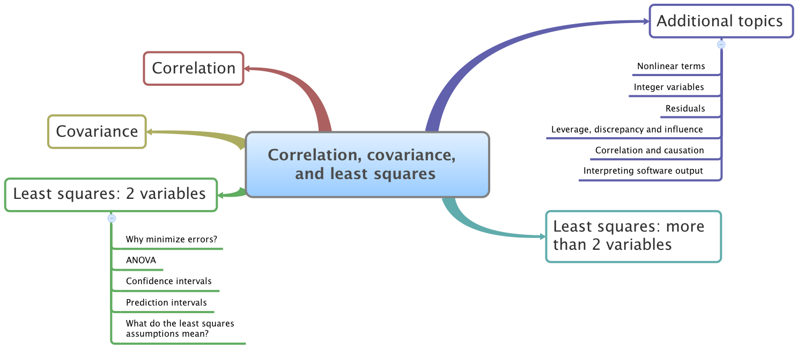

.. Notes
	Specifically, we cover the technical topics of:
	#. Covariance
	#. Correlation
	#. The relationship between correlation, covariance and variance
	#. Introduction to bivariate least squares (the linear relationship between 2 variables).
	#. We will also discuss the short-sighted idiom that is often repeated: *correlation does not imply causation* and complete it by understanding that *correlation is a necessary, but not sufficient, condition for causality*.  We will take a look at an example of correlation and understand that it is impossible to imply causality without doing intentional experimentation.
	
References and readings
=======================

.. index::
	pair: references and readings; Least squares models

- **Recommended**: Fox, *Applied Regression Analysis and Generalized Linear Models*
- **Recommended**: Draper and Smith, *Applied Regression Analysis*
- Box, Hunter and Hunter, *Statistics for Experimenters*, selected portions of Chapter 10 (2nd edition)
- Hogg and Ledolter, *Engineering Statistics*
- Montgomery and Runger, *Applied Statistics and Probability for Engineers*  
- Birkes and Dodge: *Alternative Methods of Regression*, 1993.
- Efron, Hastie, Johnstone and Tibshirani, `Least Angle Regression <http://www.jstor.org/stable/3448465>`_, *The Annals of Statistics*, **32**, p 407-451, 2004, 
- Box, G.E.P.,  `Use and Abuse of Regression <http://www.jstor.org/stable/1266635>`_, *Technometrics*, **8** (4), 625-629, 1966.
- Chatterjee, S. and A.S. Hadi, `Influential Observations, High Leverage Points, and Outliers in Linear Regression <http://www.jstor.org/stable/2245477>`_, *Statistical Science*, **1** (3), 379-416, 1986.
- Cleveland, W.S. `Robust Locally Weighted Regression and Smoothing Scatterplots <http://www.jstor.org/stable/2286407>`_, *Journal of the American Statistical Association*, **74** (368), p. 829-836, 1979.

Covariance
===========

You probably have an intuitive sense for what it means when two things are correlated. We will get to correlation next, but we start by first looking at covariance.  Let's take a look at an example to formalize this, and to see how we can learn from data.

Consider these measurements from a gas cylinder; temperature (K) and pressure (kPa).  We know the ideal gas law applies under moderate condition: :math:`pV = nRT`.

	-	Fixed volume, :math:`V = 20 \times 10^{-3} \text{m}^3` = 20 L
	-	Moles of gas, :math:`n = 14.1` mols of chlorine gas, molar mass = 70.9 g/mol, so this is 1 kg of gas
	-	Gas constant, :math:`R = 8.314` J/(mol.K)

Given these numbers we can simplify the ideal gas law to: :math:`p=\beta_1 T`, where :math:`\beta_1 = \dfrac{nR}{V} > 0`.  These data are collected:

.. wikitable

	{| class="wikitable center"
	|-
	!
	! :math:`T` = Cylinder temperature (K)
	! :math:`p` = Cylinder pressure (kPa)
	! :math:`h` = Room humidity (%)
	|-
	|||273|| 1600|| 42
	|-
	|||285|| 1670|| 48
	|-
	|||297|| 1730|| 45
	|-
	|||309|| 1830|| 49
	|-
	|||321|| 1880|| 41
	|-
	|||333|| 1920|| 46
	|-
	|||345|| 2000|| 48
	|-
	|||357|| 2100|| 48
	|-
	|||369|| 2170|| 45
	|-
	|||381|| 2200|| 49
	|-
	| || ||
	|-
	|'''Mean''' || 327 || 1910 || 46.1
	|-
	|'''Variance''' || 1320 || 43267 || 8.1
	|}
	
.. code-block:: text

	T <- c(273, 285, 297, 309, 321, 333, 345, 357, 369, 381)
	p <- c(1600, 1670, 1730, 1830, 1880, 1920, 2000, 2100, 2170, 2200)
	h <- c(42, 48, 45, 49, 41, 46, 48, 48, 45, 49)
	
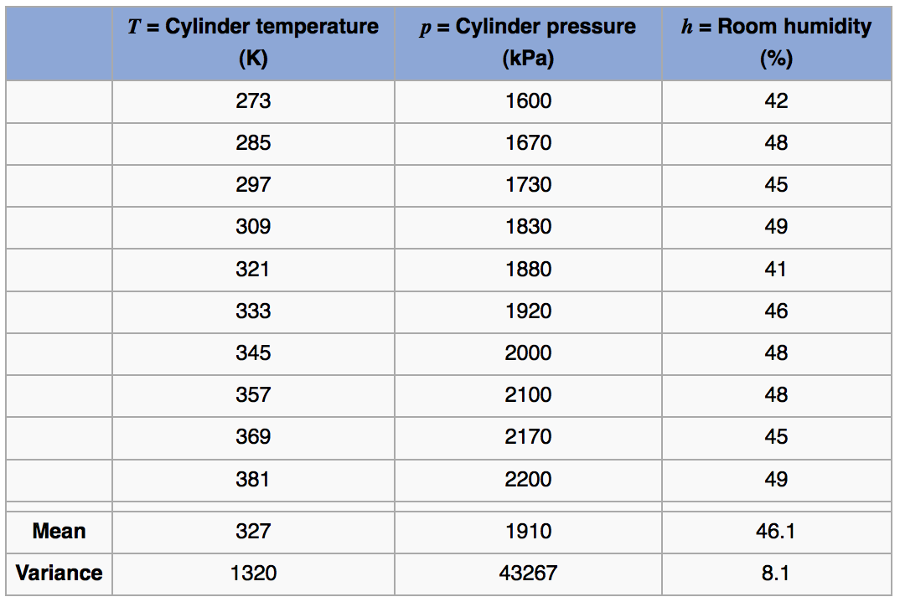
	
The formal definition for covariance between any two variables is given by equation :eq:`definition-covariance`.  Use this to calculate the covariance between temperature and pressure.

.. math::
	:label: definition-covariance
	
		\text{Cov}\left\{x, y\right\} = \mathcal{E}\left\{ (x - \bar{x}) (y - \bar{y})\right\} \qquad \text{where} \qquad \mathcal{E}\left\{ z \right\} = \bar{z}
		
Break the problem into steps:

	- First calculate deviation variables (they are called this because they are now the deviations from the mean): :math:`T - \bar{T}` and :math:`p - \bar{p}`.  Subtracting off the mean from each vector just centers their frame of reference to zero.  For example, if we had measured the temperature in degrees Celsius, the covariance value would **not** have been affected. 
	- Next multiply the corresponding elements of these two vectors to calculate a new vector :math:`(T - \bar{T}) (p - \bar{p})`.
	
		.. code-block:: s
		
			> T.centered <- T - mean(T)
			> p.centered <- p - mean(p)
			> product <- T.centered * p.centered    
			# Note that R does element-by-element multiplication in the above line
			> product
			 [1] 16740 10080  5400  1440   180    60  1620  5700 10920 15660
		
	- The expected value of this product can be estimated in R with: ``mean(product)``, which gives ``6780``.
	- Use the ``cov(T, p)`` function in R gives ``7533.333``.  Why the difference?  Well :math:`6780 \times \dfrac{N}{N-1}= 7533.33`, indicating that R divides by :math:`N-1` rather than :math:`N`.  This inconsistency is explained below, but does not really matter for large values of :math:`N`.
	- The units of covariance between temperature and pressure is [K.kPa].
	
Similarly the covariance between temperature and humidity is 202.

	.. code-block:: text
	
		> p.centered <- p - mean(p)
		> h.centered <- h - mean(h)
		> product <- h.centered * p.centered    
		> product
		 [1] 1271 -456  198 -232  153   -1  171  361 -286  841
		> mean(product)
	
In your own time calculate a rough numeric value and give the units of covariance for these cases:

	===================================================  ===================================================
	:math:`x`                                            :math:`y` 
	===================================================  ===================================================
	:math:`x` = age of married partner 1                 :math:`y` = age of married partner 2
	:math:`x` = gas pressure                             :math:`y` = gas volume at a fixed temperature
	:math:`x` = mid term mark                            :math:`y` = final exam mark
	:math:`x` = hours worked per week                    :math:`y` = weekly take home pay
	:math:`x` = cigarettes smoked per month              :math:`y` = age at death
	===================================================  ===================================================
	
	Also describe what an outlier observation would mean in these cases.
	
.. raw:: latex

	\vspace{4cm}
	
One last point is that the covariance of a variable with itself is the variance: :math:`\text{Cov}\left\{x, x\right\} = \mathcal{V}(x) = \mathcal{E}\left\{ (x - \bar{x}) (x - \bar{x})\right\}`, a definition :ref:`we saw earlier <univariate-variance>`.  Notice in particular that the variance of a centered vector is the same as the variance of an uncentered vector.  The means you can shift the raw data in :math:`x` and :math:`y` up or down and still get the same covariance number.

**Aside**: The above point explains the difference in R with what we calculated earlier.  In R, the variance function for a vector ``x`` is internally called as ``cov(x, x)``.  Since R returns the unbiased variance, it divides through by :math:`n-1`.

.. Another point to note: recall from geometry that the length of a vector, :math:`x`, is calculated from the sum of squares of the elements in vector :math:`x`, and then taking the square root of the sum.  Mathematically the sum of squares is can be written as: math:`x^Tx`.  For a vector :math:`x` that is centered, this corresponds

.. _correlation-section:

Correlation
===========

The variance and covariance are units dependent - you get a very different covariance when calculating in grams vs kilograms.  The correlation on the other hand removes the effect of scaling.  It is defined as:

.. math::
	:label: definition-correlation
	
		r(x, y) = \dfrac{\mathcal{E}\left\{ (x - \bar{x}) (y - \bar{y})\right\}}{\sqrt{\mathcal{V}\left\{x\right\}\mathcal{V}\left\{y\right\}}} = \dfrac{\text{Cov}\left\{x, y\right\}}{\sqrt{\mathcal{V}\left\{x\right\}\mathcal{V}\left\{y\right\}}}
		
It takes the covariance value and divides through by the units of :math:`x` and of :math:`y` to obtain a dimensionless result.  The values of :math:`r(x,y)` range from -1 to +1.

So returning back to our example of the gas cylinder, the correlation between temperature and pressure, and temperature and humidity can be calculated now as:

.. code-block:: text

	> cor(T, p)
	[1] 0.9968355
	> cor(T, h)
	[1] 0.3803919

Study the plots below to get a feeling for the correlation value and its interpretation:

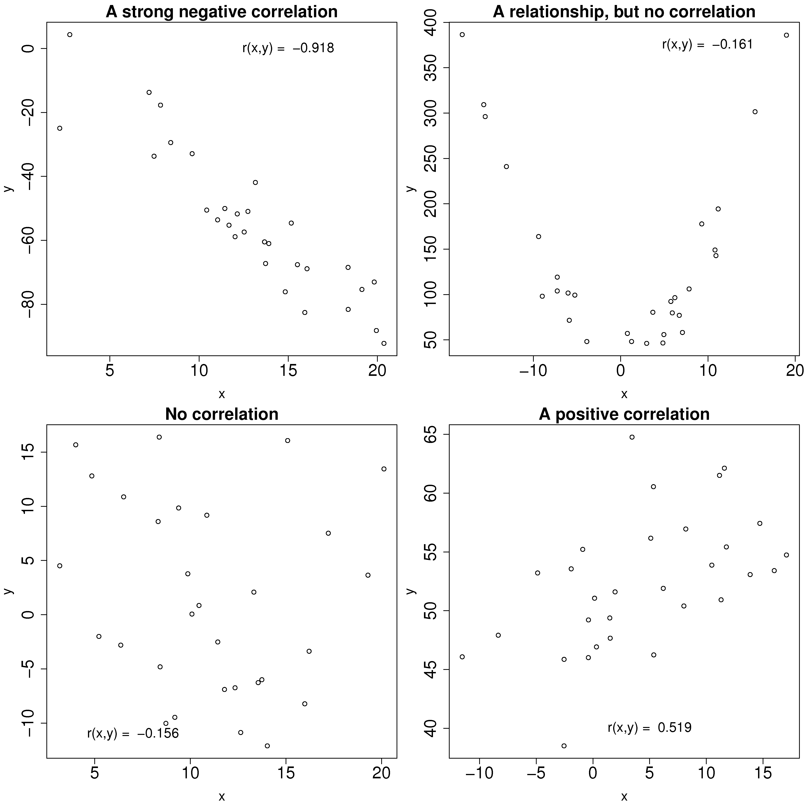

Some definitions
================

Be sure that you can derive (and interpret!) these relationships yourself:

	- :math:`\mathcal{E}\{x\} = \bar{x}`
	- :math:`\mathcal{E}\{x+y\} = \mathcal{E}\{x\} + \mathcal{E}\{y\} = \bar{x} + \bar{y}`
	- :math:`\mathcal{V}\{x\} = \mathcal{E}\{(x-\bar{x})^2\}`
	- :math:`\mathcal{V}\{cx\} = c^2\mathcal{V}\{x\}`
	- :math:`\text{Cov}\{x,y\} = \mathcal{E}\{(x-\bar{x})(y-\bar{y})\}` which we take as the definition for covariance
	- :math:`\mathcal{V}\{x+x\} = 2\mathcal{V}\{x\} + 2\text{Cov}\{x,x\} = 4\mathcal{V}\{x\}`
	- :math:`\text{Cov}\{x,y\} = \mathcal{E}\{xy\} - \mathcal{E}\{x\}\mathcal{E}\{y\}`

	- :math:`\text{Cov}\{x,c\} = 0`
	- :math:`\text{Cov}\{x+a, y+b\} = \text{Cov}\{x,y\}`
	- :math:`\text{Cov}\{ax, by\} = ab \cdot \text{Cov}\{x,y\}`

	- :math:`\mathcal{V}\{x+y\} \neq \mathcal{V}\{x\} + \mathcal{V}\{y\}`, which is counter to what might be expected
	- Rather:
		.. math::
			\mathcal{V}\{x+y\} &= \mathcal{E}\{ \left(  x+y-\bar{x}-\bar{y} \right)^2 \}  \\
	                              &= \mathcal{E}\{ \left( (x-\bar{x}) + (y-\bar{y}) \right)^2 \} \\
	                              &= \mathcal{E}\{ (x-\bar{x})^2 + 2(x-\bar{x})(y-\bar{y}) + (y-\bar{y})^2 \}\\
	                              &= \mathcal{E}\{ (x-\bar{x})^2 \} + 2\mathcal{E}\{(x-\bar{x})(y-\bar{y})\} + \mathcal{E}\{(y-\bar{y})^2 \} \\
	                              &= \mathcal{V}\{ x \}             + 2\text{Cov}\{x,y\} + \mathcal{V}\{ y \} 

Nonparametric modelling
===========================

.. Note:: This is an *enrichment topic*.

Nonparametric modelling is a general model where the relationship between |x| and |y| is of the form: :math:`y = f(x) + \varepsilon`, but the function (model), :math:`f(x)` is left unspecified.  The model is usually a smooth function.

Consider the example of plotting Prestige (the Pineo-Porter prestige score) against Income, from the 1971 Canadian census.  A snippet of the data is given by: 

.. code-block:: s

	                       education income women prestige census type
	ECONOMISTS                 14.44   8049 57.31     62.2   2311 prof
	VOCATIONAL.COUNSELLORS     15.22   9593 34.89     58.3   2391 prof
	PHYSICIANS                 15.96  25308 10.56     87.2   3111 prof
	NURSING.AIDES               9.45   3485 76.14     34.9   3135   bc
	POSTAL.CLERKS              10.07   3739 52.27     37.2   4173   wc
	TRAVEL.CLERKS              11.43   6259 39.17     35.7   4193   wc
	BABYSITTERS                 9.46    611 96.53     25.9   6147 <NA>
	BAKERS                      7.54   4199 33.30     38.9   8213   bc
	MASONS                      6.60   5959  0.52     36.2   8782   bc
	HOUSE.PAINTERS              7.81   4549  2.46     29.9   8785   bc

The plot on the left is the raw data, while on the right is the raw data with the nonparametric model (line) superimposed. The smoothed line is the nonparametric function, :math:`f(x)`, referred to above, and |x| = Income ($), and |y| = Prestige.  

.. figure:: images/nonparametric-plots.png
	:width: 750px
	:align: center

For bivariate cases, the nonparametric model is often called a *scatterplot smoother*.  There are several methods to calculate the model; one way is by locally weighted scatterplot smoother (LOESS), described as follows.  Inside a fixed window along the x-axis:

- collect the |x|- and |y|-values inside this window
- calculate a fitted |y|-value, but use a weighted least squares procedure, with weights that peaks at the center of the window and declines towards the edges, 
- record that average |y|-value against the window's center (|x|-value)
- slide the window along the |x| axis and repeat

The *model* is the collection of these |x|- and |y|-values.  This is why it is called nonparameteric: there are no parameters to quantify the model.  For example: if the relationship between the two variables is linear, then a linear smooth is achieved.  It is hard to express the relationship between |x| and |y| in written form, so usually these models are shown visually.  The nonparametric model is not immune to outliers, but it is resistant to them.

Bivariate least squares
===========================

The general linear least squares model is a very useful tool (in the right circumstances), and it is the workhorse for a number of algorithms in data analysis. 

This part covers the relationship between two variables only: |x| and |y|.  In the next part on general least squares we will consider more than two variables and use matrix notation.  But we start off slowly here, looking carefully at the details for relating two variables first.

We will follow these steps:

#. Model definition (this subsection)
#. Building the model
#. Interpretation of the model parameters and model outputs (coefficients, :math:`R^2`, *etc*)
#. Consider the effect of unusual and influential data
#. Assessment of model residuals

The least squares model postulates that there is a linear relationship between measurements in vector |x| and |y| of the form:

.. math:: 
	:label: define-2-LS
	
		\mathcal{E}\left\{\mathrm{y}\right\} &= \beta_0 + \beta_1 \mathrm{x} \\
		\mathrm{y} &= \beta_0 + \beta_1 \mathrm{x} + \epsilon 
		
The :math:`\beta_0`, :math:`\beta_1` and :math:`\epsilon` terms are *population* parameters, which are unknown (see the :ref:`section on univariate statistics <univariate-population>`).  The :math:`\epsilon` term represents any unmodelled components of the linear model, measurement error, and is simply called *the error* term.  Notice that the error is not due to :math:`x` - we will return to this point later.  Also, if there is no relationship between |x| and |y| then :math:`\beta_1 = 0`.

We develop **a particular method** (there are others) to estimate these parameters; these estimates are defined as :math:`b_0 = \hat{\beta_0}`, :math:`b_1 = \hat{\beta_1}` and :math:`e = \hat{\epsilon}`.  Using this new nomenclature we can write, for a particular observation :math:`i`:

.. math::
	:label: define-2-LS-i
	
		y_i &= b_0 + b_1 x_i + e_i \\
		\hat{y}_i &= b_0 + b_1 x_i
		
The error values, :math:`e_i`, are expected to be non-zero for practical cases.  Presuming we have calculated estimates |b0| and |b1| we can use the model with a new x-observation, :math:`x_i`, and predict its corresponding :math:`\hat{y}_i`.  All this new nomenclature is illustrated in the figure.

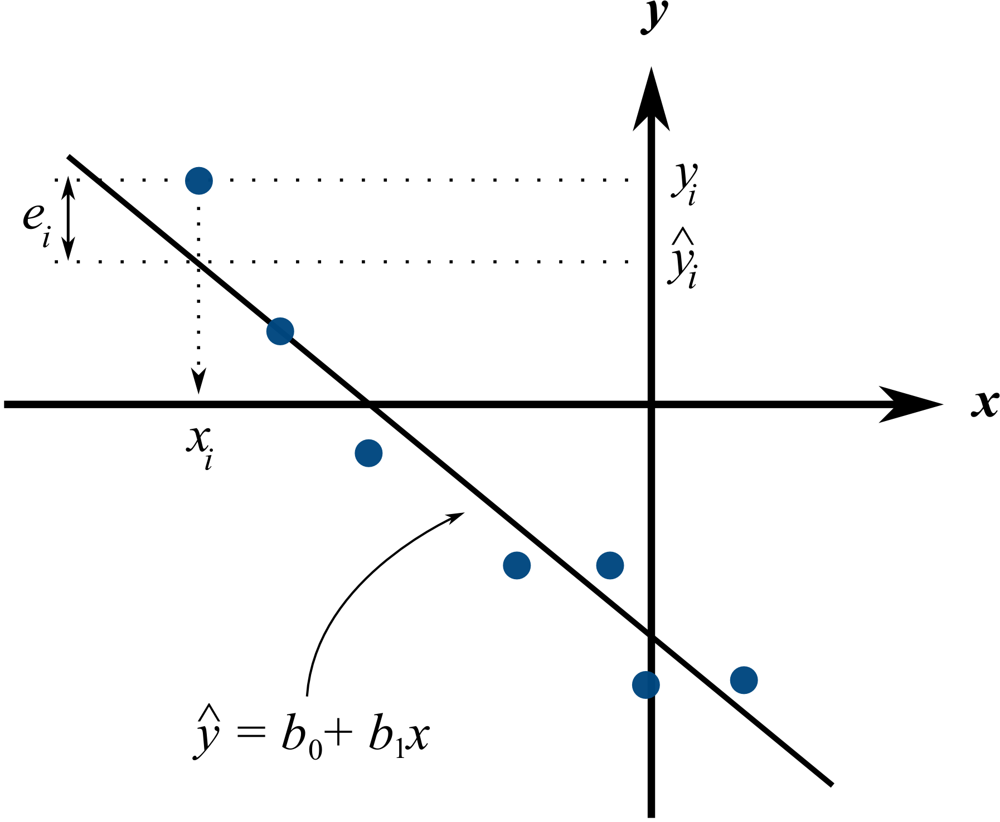
	

Minimizing errors as an objective
~~~~~~~~~~~~~~~~~~~~~~~~~~~~~~~~~~~

Our immediate aim however is to calculate |b0| and |b1|  from the :math:`n` pairs of data collected: :math:`(x_i, y_i)`.  

Here are some approaches to making the :math:`e_i\,` values small, in some way.

 	#.	:math:`\sum_{i=1}^{n}{(e_i)^2}`
	#.	:math:`\sum_{i=1}^{n}{(e_i)^4}`
	#.	sum of perpendicular distances to the line
	#.	:math:`\sum_{i=1}^{n}{\|e_i\|}` is an alternative, known as least absolute deviations or :math:`l`-1 norm problem
	#.	*least median of squared error* model, which a robust form of least squares.

All of these are good alternatives, however the traditional least squares model has the lowest possible variance for |b0| and |b1| when certain additional assumptions are met (more on this further down).  The low variance of these parameter estimates is very desirable, for both model interpretation and using the model.

Other reasons for so much focus on the least squares alternative is because it is computationally tractable by hand and very fast on computers, and it is easy to prove various properties.  The other forms take much longer to calculate, almost always have to be done on a computer, may have multiple solutions, the solutions change dramatically given small deviations in the data (unstable, high variance solutions), and the mathematical proofs are difficult.  Also the interpretation of the sum of squares of the errors is that it penalizes deviations quadratically: large deviations much more than the smaller deviations.

You can read more about these alternatives in the Birkes and Dodge reference above: *Alternative Methods of Regression*.

Solving the least squares problem and interpreting the model
~~~~~~~~~~~~~~~~~~~~~~~~~~~~~~~~~~~~~~~~~~~~~~~~~~~~~~~~~~~~~

Having settled on the least squares objective function, let's construct the problem as an optimization problem and understand it's characteristics.

The least squares problem can be posed as an unconstrained optimization problem:

.. math::
	:label: define-2-LS-optimization
	
		\min_{\displaystyle b_0, b_1} f(b_0, b_1) &= \sum_{i=1}^{n}{(e_i)^2} \\
												  &= \sum_{i=1}^{n}{\left(y_i - b_0 - b_1 x_i\right)^2}

Let's continue our example of the gas cylinder.  In this case we know that :math:`\beta_0 = 0` from theoretical principles.  So we can solve the above problem by trial and error.  We expect :math:`b_1 \approx \beta_1 = \dfrac{nR}{V} = \dfrac{(14.1 \text{~mol})(8.314 \text{~J/(mol.K)})}{20 \times 10^{-3} \text{m}^3} = 5.861 \text{~kPa/K}`.  So constructing equally spaced points between 5.0 and 6.5 we can calculate the objective function value and plot it against trial estimates of :math:`b_1`.

.. figure:: images/cylinder-case-study-objective.png
	:width: 600px
	:align: center
	:scale: 60

In the case where we have both |b0| and |b1|  varying we can construct a grid function and tabulate the objective function values at all points in the grid.  The objective function shape has a bowl shape in general, and a unique minimum can always be found (because the objective function is convex).

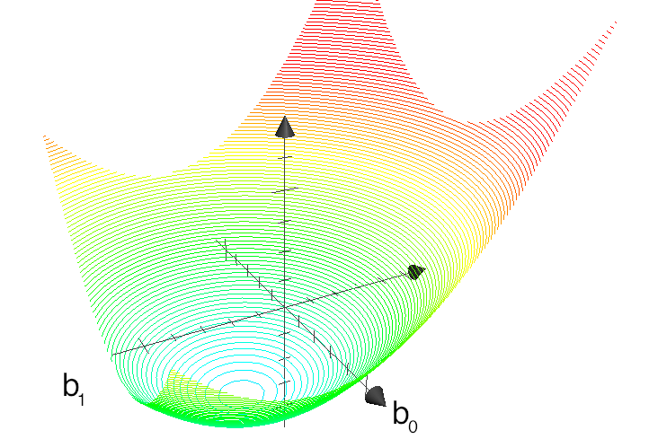
	
The above figure shows the general nature of the least-squares objective function where the two horizontal axes are for |b0| and |b1|, while the vertical axis represents the least squares objective function :math:`f(b_0, b_1)`.

The plot highlights the quadratic nature of the objective function.  To find the minimum analytically we start with equation :eq:`define-2-LS-optimization` and take partial derivatives with respect to :math:`b_0` and :math:`b_1`, and set those equations to zero.  These two equations in two unknowns, are a requirement of optimality (cf. any book on optimization theory).  You can take the second derivative to confirm that the optimum is indeed a minimum.

.. math::
	:label: define-2-LS-b0-b1-partials
	
	\dfrac{\partial f(b_0, b_1)}{\partial{b_0}} &= -2 \sum_i^{n}{(y_i -  b_0 - b_1 x_i)} = 0 \\
 	\dfrac{\partial f(b_0, b_1)}{\partial{b_1}} &= -2 \sum_i^{n}{(x_i)(y_i -  b_0 - b_1 x_i)} = 0\\

Divide the first line through by :math:`n` (the number of data pairs we are using to estimate the parameters) and solve that equation for |b0|.  Then substitute that into the second line to solve for |b1|.  The parameters that provide the least squares optimum for :math:`f(b_0, b_1)` are:

.. math::
	:label: define-2-LS-b0-b1-result
	
	b_0 &= \bar{\mathrm{y}} - b_1\bar{\mathrm{x}} \\
	b_1 &= \dfrac{ \sum_i{\left(x_i - \bar{\mathrm{x}}\right)\left(y_i - \bar{\mathrm{y}}\right) } }{ \sum_i{\left( x_i - \bar{\mathrm{x}}\right)^2} }
	

**Remarks**:

#.	The first part of equation :eq:`define-2-LS-b0-b1-partials` shows :math:`\sum_i{e_i} = 0`.

#.	The first part of equation :eq:`define-2-LS-b0-b1-result` shows that the straight line equation passes through the mean of the data :math:`(\bar{\mathrm{x}}, \bar{\mathrm{y}})` without error.
	
#.	From second part of equation :eq:`define-2-LS-b0-b1-partials` prove to yourself that :math:`\sum_i{(x_i e_i)} = 0`.

#.	Also prove and interpret that :math:`\sum_i{(\hat{y}_i e_i)} = 0`.
	
#.	Notice that the parameter estimate for |b0| depends on the value of |b1|: we say the estimates are correlated - you cannot estimate them independently.

**Questions**:

#. What units does parameter estimate :math:`b_1` have?

		-	The units of :math:`\mathrm{y}` divided by the units of :math:`\mathrm{x}`.
	
#. Recall the temperature and pressure example (start of this section).  Let  :math:`\hat{p}_i = b_0 + b_1 T_i`:

	#.	What is the interpretation of coefficient :math:`b_1`?
			
				-	A one Kelvin increase in temperature is associated, on average, with an increase of :math:`b_1` kPa in pressure.
			
 	#.	What is the interpretation of coefficient :math:`b_0`?
		
				-	It is the expected pressure when temperature is zero.  Note: often the data used to build the model are not close to zero, so this interpretation may have no meaning.

#. What does it mean that :math:`\sum_i{(x_i e_i)} = \mathrm{x}^T\mathrm{e} = 0`:

		-	The residuals are uncorrelated with the input variables, :math:`\mathrm{x}`.  There is no information in the residuals that is in :math:`\mathrm{x}`.
		
#. What does it mean that :math:`\sum_i{(\hat{y}_i e_i)} =  \mathrm{\hat{y}}^T\mathrm{e} = 0`

		-	The fitted values are uncorrelated with the residuals.
		
#. How could the denominator term for :math:`b_1` equal zero?  And what would that mean?

	This shows that as long as there is variation in the x-data that we will obtain a solution.
	
.. _class-example:

Example
~~~~~~~~

Calculate the least squares estimates for the model :math:`y = b_0 + b_1 x` from the given data.  Also calculate the predicted value of :math:`\hat{y}_i` when :math:`x_i = 5.5`

	-	:math:`b_0 =` 
	-	:math:`b_1 =`
	-	When :math:`x_i = 5`, then :math:`\hat{y}_i =`
	
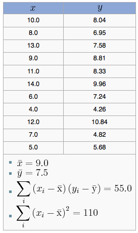
	
..	Raw data
	{| class="wikitable" style="text-align: center; margin-left:auto; margin-right:auto;"  border="1"
	|-
	! :math:`x_1\,` 
	! :math:`y_1\,` 
	|-
	| 10.0 ||  8.04 
	|-              
	|  8.0 ||  6.95 
	|-              
	| 13.0 ||  7.58 
	|-              
	|  9.0 ||  8.81 
	|-              
	| 11.0 ||  8.33 
	|-              
	| 14.0 ||  9.96 
	|-              
	|  6.0 ||  7.24 
	|-              
	|  4.0 ||  4.26 
	|-              
	| 12.0 || 10.84 
	|-              
	|  7.0 ||  4.82 
	|-              
	|  5.0 ||  5.68 
	|-
	| colspan="2" align="left"| 
	* :math:`\bar{x}_1= 9.0` 
	* :math:`\bar{y}_1= 7.5`
	* :math:`\sum_i{\left(x_i - \bar{\mathrm{x}}_1\right)\left(y_i - \bar{\mathrm{y}}_1\right) }= 55.0`
	* :math:`\sum_i{\left( x_i - \bar{\mathrm{x}}_1\right)^2} = 110`
	|}
		
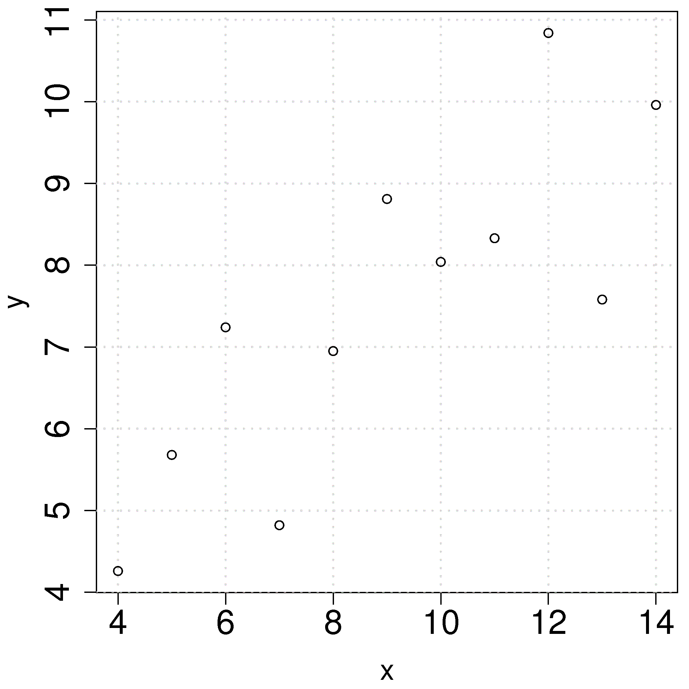
	
To calculate the least squares model in R:

.. code-block:: s

	> x <- c(10, 8, 13, 9, 11, 14, 6, 4, 12, 7, 5)
	> y <- c(8.04, 6.95, 7.58, 8.81, 8.33, 9.96, 7.24, 4.26, 10.84, 4.82, 5.68)
	> lm(y ~ x)  # "The linear model, where y is described by x"
	
	Call:
	lm(formula = y ~ x)

	Coefficients:
	(Intercept)            x  
	     3.0001       0.5001

..	Estimating the parameters when the data are centered
	~~~~~~~~~~~~~~~~~~~~~~~~~~~~~~~~~~~~~~~~~~~~~~~~~~~~~~~~~~

	A small rearrangement of equation :eq:`define-2-LS` is given below.  The modification centers the x-variables to a mean of zero.  One can show, though we don't do it here, that the parameter estimates obtained are still the same (of course the new \beta_0 is zero)

		.. math::
			:label:define-2-LS-modified
	
				\mathrm{y} &= \beta_0 + \beta_1 (\mathrm{x} -\bar{\mathrm{x}}) + \epsilon 

Least squares model analysis
====================================

Once we have fitted the |b0| and |b1| terms using the data and the equations from :eq:`define-2-LS-b0-b1-result`, it is of interest to know how well the model performed.  That is what this section is about.  In particular:

#. Analysis of variance: breakdown the data's variability into components
#. Confidence intervals for the model coefficients, :math:`b_0` and :math:`b_1`
#. Prediction error estimates for the y-variable

In order to perform the second step we need to make a few assumptions about the data, and if the data follow those assumptions, then we can derive confidence intervals for the model parameters in the third part.

The variance breakdown
~~~~~~~~~~~~~~~~~~~~~~~~~~

Recall that :ref:`variability <univariate-about-variability>` is what makes our data interesting.  Without variance (i.e. just flat lines) we would have nothing to do.  The analysis of variance is just a tool to show how much variability in the y-variable is explained by:

 	#. Doing nothing (no model: implies :math:`\hat{y} = \bar{y}`)
 	#. The model (:math:`\hat{y}_i = b_0 + b_1 x_i`)
 	#. How much variance is left over in the errors, :math:`e_i`

These 3 components must add up to the total variance.  By definition, the variance is computed about a mean, so the variance of no model (i.e. the "doing nothing" case) is zero.  So the total variance in |y| is just the sum of the other two variances: the model's variance, and the error variance.  We show this next.

.. The variance breakdown: graphically
.. ^^^^^^^^^^^^^^^^^^^^^^^^^^^^^^^^^^^^^^^^

Using the accompanying figure, we see that geometrically, at any fixed value of :math:`x_i`, that any |y| value above or below the least squares line, :math:`y_i`, would obey the distance relationship:

.. math::	
		\begin{array}{lrcl}
		\text{Distance relationship:}   & (y_i - \bar{\mathrm{y}})         &=& (\hat{y}_i - \bar{\mathrm{y}}) + (y_i - \hat{y}_i) \\
		\text{Squaring:}                & (y_i - \bar{\mathrm{y}})^2       &=& (\hat{y}_i - \bar{\mathrm{y}})^2 + 2(\hat{y}_i - \bar{\mathrm{y}})(y_i - \hat{y}_i) + (y_i - \hat{y}_i)^2 \\
		\text{Summing and simplifying:} & \sum{(y_i - \bar{\mathrm{y}})^2} &=& \sum{(\hat{y}_i - \bar{\mathrm{y}})^2} + \sum{(y_i - \hat{y}_i)^2} \\
		                                & \text{Total sum of squares (TSS)} &=& \text{Regression SS (RegSS)} + \text{Residual SS (RSS)}
	\end{array}

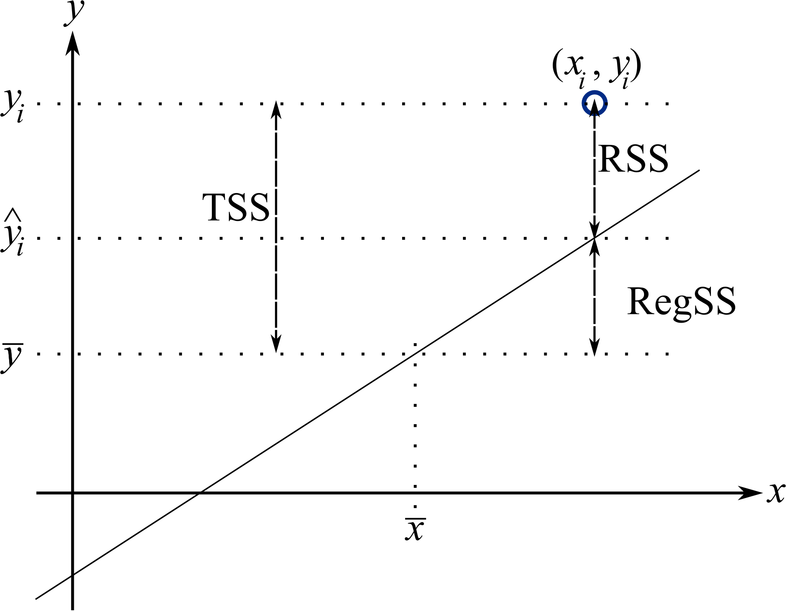

It is convenient to write these sums of squares (variances) in table form, called an Analysis of Variance (ANOVA) table:

	=================== ======================================== ======================================== ======= ======================================== 
	Type of variance    Distance                                 Degrees of freedom                       SSQ     Mean square
	=================== ======================================== ======================================== ======= ======================================== 
	Regression          :math:`\hat{y}_i - \bar{\mathrm{y}}`     :math:`k` (k=2 in the examples so far)   RegSS   :math:`\text{RegSS}/k`
	------------------- ---------------------------------------- ---------------------------------------- ------- ----------------------------------------
	Error               :math:`y_i - \hat{y}_i`                  :math:`n-k`                              RSS     :math:`\text{RSS}/(n-k)`
	------------------- ---------------------------------------- ---------------------------------------- ------- ----------------------------------------
	Total               :math:`y_i - \bar{\mathrm{y}}`           :math:`n`                                TSS     :math:`\text{TSS}/n`
	=================== ======================================== ======================================== ======= ======================================== 

..	Original table in wiki form

		{| class="wikitable"
		|-
		! Type of variance
		! Distance
		! Degrees of freedom
		! SSQ
		! Mean square
		|-
		| Regression
		| :math:`\hat{y}_i - \bar{\mathrm{y}}`
		| :math:`k` (k=2 in the examples so far)
		| RegSS
		| :math:`RegSS/k`
		|-
		| Error
		| :math:`y_i - \hat{y}_i`
		| :math:`n-k`
		| RSS
		| :math:`RSS/(n-k)`
		|-
		|
		|
		|
		|
		|-
		| Total
		| :math:`y_i - \bar{\mathrm{y}}`
		| :math:`n`
		| TSS
		| :math:`TSS/n`
		|}

.. _standard-error-section:

Judging the standard error
^^^^^^^^^^^^^^^^^^^^^^^^^^^^^^^^^^^^^^^^

The term :math:`S_E^2 = \text{RSS}/(n-k)` is one way of quantifying the model's performance.  The value :math:`S_E = \sqrt{\text{RSS}/(n-k)} = \sqrt{(e^Te)/(n-k)}` is called the standard error.  It is really just the standard deviation of the error term, accounting correctly for the degrees of freedom.  

*Example*: Assume we have a model for predicting batch yield in kilograms from |x| = raw material purity, what does it mean for the standard error to be 3.4 kg? 

*Answer*: Recall if the assumption of normally distributed errors is correct, then this value of 3.4 kg indicates that about two thirds of the yield predictions will lie within :math:`\pm 3.4` kg, and that 95% of the yield predictions will lie within :math:`\pm 2 \times 3.4` kg.  We will quantify the prediction interval more precisely, but the standard error is a good approximation for the error of |y|.

Exercise
^^^^^^^^^

For each of these cases:

#. :math:`y_i = e_i`, i.e. where :math:`b_0 = 0` and :math:`b_1 = 0`
#. :math:`y_i = b_0 + b_1 x_i + e_i`, for any values of :math:`b_0` and :math:`b_1`, and the models fits the data perfectly

Do the following:

 	- draw a generic plot 
	- create an ANOVA table with fake values
 	- write down the value of the ratio :math:`\dfrac{\text{RegSS}}{\text{TSS}}`
	- interpret what this ratio means: :math:`F_0 = \dfrac{\text{mean square of regression}}{\text{mean square of residuals}}`

.. raw:: latex

	\vspace{2cm}

From this exercise we learn that:

-	The null model (:math:`y_i = e_i`) has ratio :math:`\dfrac{\text{RegSS}}{\text{TSS}} = 0`.  
-	Models where the fit is perfect have a ratio :math:`\dfrac{\text{RegSS}}{\text{TSS}} = 1`.  This number is called :math:`R^2`, and we will see why it is called that next.

.. The variance breakdown: algebraically
	^^^^^^^^^^^^^^^^^^^^^^^^^^^^^^^^^^^^^^

	For those of you that prefer to understand concepts algebraically, you can get the equivalent result by starting with the definition of the variance of :math:`\mathrm{y}`.

	.. todo:: check this still: there is a mistake in the middle line

	.. math::

		\mathcal{V}\{\mathrm{y}\} 	&= \mathcal{E}\{(\mathrm{y}-\bar{\mathrm{y}})^2\} \\
						 			&= \mathcal{E}\{(b_0 + b_1 \mathrm{x} + e - \bar{\mathrm{y}})^2\} \\
						 			&= \mathcal{E}\{(b_0 + b_1 \mathrm{x} + e)^2\} \\
						 			&= \mathcal{E}\{(b_0 + b_1 \mathrm{x} + e)^2\} \\
						 			&= \mathcal{V}\{b_0 + b_1 \mathrm{x}\} + \mathcal{V}\{e\} + 2\text{Cov}\{b_0 + b_1 \mathrm{x}, e\}
					
	Since the covariance between the predicted |y| value and the residuals is zero (we proved that earlier with :math:`\mathrm{\hat{y}}^T\mathrm{e} = 0`), we have:

	.. math::

		\mathcal{V}\{\mathrm{y}\} 	&= \mathcal{V}\{b_0 + b_1 \mathrm{x}\} + \mathcal{V}\{e\} \\
									&= \mathcal{V}\{\hat{\mathrm{y}}\} + \mathcal{V}\{e\}

Derivation of :math:`R^2`
^^^^^^^^^^^^^^^^^^^^^^^^^^^^^^^^^^^^^^^^

.. To use this derivation you have to work in deviation variables (x-mean(x)) and (y-mean(y)).  Too early in the notes to do that.
	.. figure:: images/angle-between-two-vectors.png
		:width: 400px
		:align: center
	
	Recall, perhaps from your second year math course, that the cosine of the angle between any two vectors, :math:`a` and :math:`b` is related to the vector dot product

	.. math::
		\cos \theta_{ab} = \dfrac{a^Tb}{\|a\| \|b\|}

As introduced by example in the previous part, :math:`R^2 = \dfrac{\text{RegSS}}{\text{TSS}} = \dfrac{\sum_i{ \left(\hat{y}_i - \bar{\mathrm{y}}\right)^2}}{\sum_i{ \left(y_i - \bar{\mathrm{y}}\right)^2}}`: simply the ratio between the variance we can explain with the model (RegSS) and the total variance we started off with (TSS).  Of course :math:`R^2 = 1-\dfrac{\text{RSS}}{\text{TSS}}`, based on the fact that TSS = RegSS + RSS.

From the above ratios it is straightforward to see that if :math:`R^2 = 0`, it requires that :math:`\hat{y}_i = \bar{\mathrm{y}}`: we are predicting just a flat line, the mean of the |y| data.  On the other extreme, an :math:`R^2 = 1` implies that :math:`\hat{y}_i = y_i`, we have perfect predictions for every data point.

The nomenclature :math:`R^2` comes from the fact that it is the square of the correlation between |x| and |y|.  Recall from the :ref:`correlation section <correlation-section>` that

.. math::

	r(x, y) = \dfrac{\mathcal{E}\left\{ (x - \bar{x}) (y - \bar{y})\right\}}{\sqrt{\mathcal{V}\left\{x\right\}\mathcal{V}\left\{y\right\}}} = \dfrac{\text{Cov}\left\{x, y\right\}}{\sqrt{\mathcal{V}\left\{x\right\}\mathcal{V}\left\{y\right\}}}
	
and can range in value from -1 to +1.  The :math:`R^2` ranges from 0 to +1, and is just the square of :math:`r(x,y)`. :math:`R^2` is just a way to tell how far we are between predicting a flat line (no variation) and the extreme of being able to predict the model building data :math:`(y_i)` exactly.

The :math:`R^2` value is likely well known to anyone that has encountered least squares before.    This number must be interpreted with caution.  It is most widely **abused** as a way to measure "*how good is my model*".  

These two common examples illustrate the abuse:

	#.	"the :math:`R^2` value is really high, 90%, this is a good model". 
	#.	"Wow, that's a really low :math:`R^2`, this model can't be right - it's no good".

How **good** a model is *for a particular purpose* is almost never related to the :math:`R^2` value.  The goodness of a model is better assessed by:

- your engineering judgment: does the interpretation of model parameters make sense?
- use testing data to verify the model's predictive performance, 
- using cross-validation tools (we will see this topic later on).

We will see later on that :math:`R^2` can be arbitrarily inflated by adding terms to the linear model.  So sometimes you will see the adjusted :math:`R^2` used to account for this:

.. math::

	R^2_\text{adj} = 1 - \dfrac{\text{RSS}/(n-k)}{\text{TSS}/(n-1)}

where :math:`k=2` for the case of estimating a model :math:`y_i = b_0 + b_1 x_i` as there are 2 parameters.

.. raw:: latex

	\vspace{2cm}
	

Confidence intervals for the model coefficients |b0| and |b1|
~~~~~~~~~~~~~~~~~~~~~~~~~~~~~~~~~~~~~~~~~~~~~~~~~~~~~~~~~~~~~~~~~~~~~~~~

.. Note:: A good reference for this section is the book by Fox (Chapter 6), and the book by Draper and Smith.

Up to this point we have made no assumptions about the data.  In fact we can calculate the model estimates, |b0| and |b1| as well as predictions from the model without any assumptions on the data.  It is only when we need additional information such as confidence intervals for the coefficients and prediction error estimates that we must make assumptions.

Recall the |b1| coefficient represents the average effect on |y| of changing the |x|-variable by 1 unit.  If you are estimating reaction rates (kinetics) from a linear least squares model, a standard step in reactor design, you would want a measure of confidence of your coefficient.  For example, if you calculate the reaction rate as :math:`k = 0.81 \text{~s}^{-1}` you would benefit from knowing whether the 95% confidence interval was :math:`k = 0.81 \pm 0.26 \text{~s}^{-1}` or :math:`k = 0.81 \pm 0.68 \text{~s}^{-1}`.  A point estimate of the least square model is satisfactory, but the confidence interval information is more desirable to interpret and use the model.

.. _LS-assumptions:

Assumptions required for analysis of the least squares model
^^^^^^^^^^^^^^^^^^^^^^^^^^^^^^^^^^^^^^^^^^^^^^^^^^^^^^^^^^^^^^

Recall that the population (true) model is :math:`y_i = \beta_0 + \beta_1 x_i + \epsilon_i` and let :math:`b_0` and :math:`b_1` be our estimates of the model's coefficients, and :math:`\mathrm{e}` be the estimate of the true error :math:`\epsilon`.  Note we are assuming imperfect knowledge of the :math:`y_i` by lumping all errors in :math:`e_i`: measurement error, structural error (we are not sure the process follows a linear structure), inherent randomness, and so on.

Furthermore, our derivation for the confidence intervals of |b0| and |b1| requires that we assume:

#.	Linearity of the model, and that the values of |x| are fixed (have no error).  This implies that the error in :math:`\epsilon` is the error of |y|, since the :math:`\beta_0 + \beta_1 \mathrm{x}` terms are fixed.

	-	In an engineering situation this would mean that your |x| variable has much less uncertainty than the |y| variable; and is often true in many situations.

#.	The variance of |y| is the same (constant) at all values of |x|, known as the constant error variance assumption.

	-	The variability of |y| can be non-constant in several practical cases (e.g. our measurement accuracy deteriorates at extreme conditions of |x|).

	.. figure:: images/constant-error-variance.png
		:width: 500px
		:align: center
		:scale: 60
	
#.	The errors are normally distributed: :math:`e_i \sim \mathcal{N}(0, \sigma_\epsilon^2)`.  This also implies that :math:`y_i \sim \mathcal{N}(\beta_0 + \beta_1x_i, \sigma_\epsilon^2)` from the first linearity assumption.

#.	Each error is independent of the other.  This assumption is often violated in cases where the observations are taken in time order on slow moving processes (e.g. if you have a positive error now, your next sample is also likely to have a positive error).   The autocorrelation problem.

#.	In addition to the fact that the |x| values are fixed, we also assume they are independent of the error.  Of course if the |x| value is fixed (i.e. measured without error), then it is already independent of the error.   

	- When the |x| values are not fixed, there are cases where the error gets larger as |x| gets smaller/larger.
	
#.	All :math:`y_i` values are independent of each other.  This again is violated in cases where the data are collected in time order and the :math:`y_i` values are autocorrelated.

**Note**: derivation of the model's coefficients do not require these assumptions, only the derivation of the coefficient's confidence intervals require this.  

.. _CI-for-model-parameters:

Back to deriving confidence intervals for :math:`\beta_0` and :math:`\beta_1`
^^^^^^^^^^^^^^^^^^^^^^^^^^^^^^^^^^^^^^^^^^^^^^^^^^^^^^^^^^^^^^^^^^^^^^^^^^^^^^^^

Recall from our discussions on :ref:`confidence intervals <univariate-confidence-intervals>` that we need to know the mean and variance of the population from which |b0| and |b1| come.  Specifically:

.. math::

	\begin{array}{lcr}
		b_0 \sim \mathcal{N}(\beta_0, \mathcal{V}\{\beta_0\}) &\qquad\text{and}\qquad& b_1 \sim \mathcal{N}(\beta_1,\mathcal{V}\{\beta_1\})
	\end{array}
	
Once we know those parameters, we can create a :math:`z`-value for |b0| and |b1|, and then calculate the confidence interval for :math:`\beta_0` and :math:`\beta_1`.  So our quest now is to calculate :math:`\mathcal{V}\{\beta_0\}` and :math:`\mathcal{V}\{\beta_1\}`, and we will use the 6 assumptions we made in the previous part.

Start from equation :eq:`define-2-LS-b0-b1-result`, where we showed earlier that:

.. math::

	\begin{array}{rclrcl}
		b_0 &=& \bar{\mathrm{y}} - b_1\bar{\mathrm{x}}  \\ \\
    	b_1 &=& \dfrac{ \sum_i{\left(x_i - \bar{\mathrm{x}}\right)\left(y_i - \bar{\mathrm{y}}\right) } }{ \sum_i{\left( x_i - \bar{\mathrm{x}}\right)^2}}\\ \\
    	b_1 &=& \sum{m_iy_i} &\text{where} \qquad m_i &=& \dfrac{x_i - \bar{\mathrm{x}}}{\sum_j{\left( x_j - \bar{\mathrm{x}} \right)^2}}
	\end{array}

That last form of expressing :math:`b_1` shows that every data point contributes a small amount to the coefficient :math:`b_1`. But notice how it is broken into 2 pieces: each term in the sum has a component due to :math:`m_i` and one due to :math:`y_i`.  The :math:`m_i` term is a function of the x-data only, and since we assume the x's are measured without error, that term has no error.  The :math:`y_i` component is the only part that has error.

So we can write:

.. math::

        b_1 &= m_1y_1 + m_2y_2 + \ldots + m_Ny_N \\
        \mathcal{E}\{b_1\} &= \mathcal{E}\{m_1y_1\} + \mathcal{E}\{m_2y_2\} + \ldots + \mathcal{E}\{m_Ny_N\} \\ 
        \mathcal{V}\{b_1\} &= m_1^2\mathcal{V}\{y_1\} + m_2^2 \mathcal{V}\{y_2\} + \ldots + m_N^2\mathcal{V}\{y_N\} \\ 
        \mathcal{V}\{b_1\} &= \sum_i{ \left( \dfrac{x_i - \bar{\mathrm{x}}}{\sum_j{\left( x_j - \bar{\mathrm{x}} \right)^2}} \right)^2   } \mathcal{V}\{y_i\} \\
        \mathcal{V}\{b_1\} &= \dfrac{\mathcal{V}\{y_i\}}{\sum_j{\left( x_j - \bar{\mathrm{x}} \right)^2}}

**Questions**:

#.	So now apart from the numerator term, how could you decrease the error in your model's |b1| coefficient?

	.. only:: studentlatex

		- 
		-

	.. only:: inst

		- Use samples that are far from the mean of the |x|-data.
		- Use more samples.

#.	What do we use for the numerator term :math:`\mathcal{V}\{y_i\}`?  

	* This term represents the variance of the :math:`y_i` values at a given point :math:`x_i`.  If (a) there is no evidence of lack-of-fit, and (b) if |y| has the same error at all levels of |x|, then we can write that :math:`\mathcal{V}\{y_i\}` = :math:`\mathcal{V}\{e_i\}  = \dfrac{\sum{e_i^2}}{n-k}`, where :math:`n` is the number of data points used, and :math:`k` is the number of coefficients estimated (2 in this case).  The :math:`n-k` quantity is the degrees of freedom.

Now for the variance of :math:`b_0 = \bar{\mathrm{y}} - b_1 \bar{\mathrm{x}}`.  The only terms with error are :math:`b_1`, and :math:`\bar{\mathrm{y}}`.  So we can derive that:

.. math::
	\mathcal{V}\{b_0\} = \left(\dfrac{1}{N} + \dfrac{\bar{\mathrm{x}}^2}{\sum_j{\left( x_j - \bar{\mathrm{x}} \right)^2}} \right)\mathcal{V}\{y_i\}

**Summary of important equations**

.. math::

	\mathcal{V}\{\beta_0\} \approx \mathcal{V}\{b_0\} &= \left(\dfrac{1}{N} + \dfrac{\bar{\mathrm{x}}^2}{\sum_j{\left( x_j - \bar{\mathrm{x}} \right)^2}} \right)\mathcal{V}\{y_i\} \\ \\
	\mathcal{V}\{\beta_1\} \approx \mathcal{V}\{b_1\} &= \dfrac{\mathcal{V}\{y_i\}}{\sum_j{\left( x_j - \bar{\mathrm{x}} \right)^2}} \\ \\
	\text{where}\qquad \mathcal{V}\{y_i\} &= \mathcal{V}\{e_i\}  = \dfrac{\sum{e_i^2}}{n-k}, \text{~if there is no lack-of-fit and the y's are independent of each other}.

For convenience we will define some short-hand notation, which is common in least squares:

.. math::

	S_E^2 &= \mathcal{V}\{e_i\}  = \mathcal{V}\{y_i\} = \dfrac{\sum{e_i^2}}{n-k} \qquad\qquad \text{or~~} S_E = \sqrt{ \dfrac{\sum{e_i^2}}{n-k} }\\
	S_E^2(b_0) &= \mathcal{V}\{b_0\} = \left(\dfrac{1}{N} + \dfrac{\bar{\mathrm{x}}^2}{\sum_j{\left( x_j - \bar{\mathrm{x}} \right)^2}} \right)S_E^2\\
	S_E^2(b_1) &= \mathcal{V}\{b_1\} = \dfrac{S_E^2}{\sum_j{\left( x_j - \bar{\mathrm{x}} \right)^2}}
	
You will see that :math:`S_E` is an estimate of the standard deviation of the error (residuals), while :math:`S_E(b_0)` and :math:`S_E(b_1)` are the standard deviations of estimates for |b0| and |b1| respectively.

Now it is straight forward to construct **confidence intervals for the least squares model parameters**.  You will also realize that we have to use the :math:`t`-distribution, because we are using an estimate of the variance.

.. math::
	:label: least-squares-CI
	
	\begin{array}{rccclrcccl} 
		- c_t                &\leq& \dfrac{b_0 - \beta_0}{S_E(b_0)} &\leq &  +c_t               &\qquad- c_t                &\leq& \dfrac{b_1 - \beta_1}{S_E(b_1)} &\leq &  +c_t\\
		b_0 - c_t S_E(b_0)   &\leq& \beta_0                         &\leq&	b_0 + c_t S_E(b_0)  &\qquad b_1 - c_t S_E(b_1)   &\leq& \beta_1                         &\leq&	b_1 + c_t S_E(b_1)
	\end{array}	

Example
--------

Returning :ref:`back to the example <class-example>`, we can now calculate the confidence interval for :math:`\beta_0` and :math:`\beta_1`.  We calculated earlier already that |b0| = 3.0 and |b1| = 0.5.  Using these values we can calculate the standard error:

.. code-block:: s

	# Assume you have calculated "b0" and "b1" already using vectors "x" and "y"
	
	> predictions <- b0 + x*b1
	> predictions
	[1]  8.001  7.000  9.501  7.501  8.501  10.001  6.00  5.000  9.001  6.500  5.501
	> error <- y - predictions
	> SE <- sqrt(sum(error^2) / (N-2))
	> SE
	1.236603

Use that :math:`S_E` value to calculate the confidence intervals for :math:`\beta_0` and :math:`\beta_1`, and use that :math:`c_t = 2.26` at the 95% confidence level.  You can calculate  this value in R using ``qt(0.975, df=(N-2))``.  There are :math:`n-2` degrees of freedom, the number of degrees of freedom used to calculate :math:`S_E`.

.. only:: studentlatex

	- Confidence interval for :math:`\beta_0` and :math:`\beta_1`: 
	
		.. math:: 
		
			\begin{array}{rccclrcccl} 
				- c_t                &\leq& \dfrac{b_0 - \beta_0}{S_E(b_0)} &\leq &  +c_t \qquad\qquad - c_t                &\leq& \dfrac{b_1 - \beta_1}{S_E(b_1)} &\leq &  +c_t             \\
				   &\leq& \beta_0                         &\leq&                           \qquad\qquad	                          &\leq& \beta_1                         &\leq&
			\end{array}
			

	- Also use the accompanying plot of the data to illustrate what these confidence intervals imply.
	
	.. figure:: images/show-anscome-solution-unmarked.png
		:width: 750px
		:align: center
		:scale: 40

.. only:: inst

	First calculate the :math:`S_E` value and the standard errors for the |b0| and |b1|.  Substitute these into the equation for the confidence interval and solve as shown below.

	.. math:: 
		S_E & = 1.237 \\
		S_E^2(b_1) &= \dfrac{S_E^2}{\sum_j{\left( x_j - \bar{\mathrm{x}} \right)^2}} = \dfrac{1.237^2}{110} = 0.0139\\
		S_E^2(b_0) &= \left(\dfrac{1}{N} + \dfrac{\bar{\mathrm{x}}^2}{\sum_j{\left( x_j - \bar{\mathrm{x}} \right)^2}} \right)S_E^2 = \left(\dfrac{1}{11} + \dfrac{9^2}{110} \right)1.237^2 = 1.266
		
	The confidence interval for :math:`\beta_0`:
	
	.. math:: 
	
		\begin{array}{rccclrcccl} 
			- c_t                &\leq& \dfrac{b_0 - \beta_0}{S_E(b_0)} &\leq &  +c_t               \\
			3.0 - 2.26 \times \sqrt{1.266}  &\leq& \beta_0   &\leq&	3.0 + 2.26 \times \sqrt{1.266}   \\
			0.457 &\leq& \beta_0   &\leq&	5.54 
		\end{array}
		
	
	The confidence interval for :math:`\beta_1`:
	
	.. math::
	
		\begin{array}{rccclrcccl} 
			- c_t                &\leq& \dfrac{b_1 - \beta_1}{S_E(b_1)} &\leq &  +c_t               \\
			0.5 - 2.26 \times \sqrt{0.0139}   &\leq& \beta_1                         &\leq& 0.5 + 2.26 \times \sqrt{0.0139}\\
			0.233  &\leq& \beta_1                         &\leq& 0.767	\\
		\end{array}
		
	The plot below shows the effect of varying the slope parameters from the lower bound to the upper bound.  Notice that the slope always passes through the mean of the data :math:`(\bar{x}, \bar{y})`.
	
	.. figure:: images/show-anscome-solution-marked.png
		:width: 750px
		:align: center
		:scale: 70

In many cases the confidence interval for the intercept is not of any value because the data for |x| is so far away from zero, or the true value of the intercept is not of real concern.

Prediction error estimates for the y-variable
~~~~~~~~~~~~~~~~~~~~~~~~~~~~~~~~~~~~~~~~~~~~~~~~~~~~~~~~~~~~~~~~~~~~~~~~

Apart from understanding the error in the model's coefficient, we also would like an estimate of the error when predicting :math:`\hat{y}_i` from the model, :math:`y_i = b_0 + b_1 x_i + e_i` for a new value of :math:`x_i`.

A naive first attempt
^^^^^^^^^^^^^^^^^^^^^^^

We might expect the error is related to the average size of the residuals.  After all, :ref:`our assumptions we made earlier <LS-assumptions>` showed the standard error of the residuals as the standard error of the |y|: :math:`S_E^2 = \mathcal{V}\left\{e_i\right\} = \mathcal{V}\left\{y_i\right\} = \dfrac{\sum{e_i^2}}{n-k}`.  

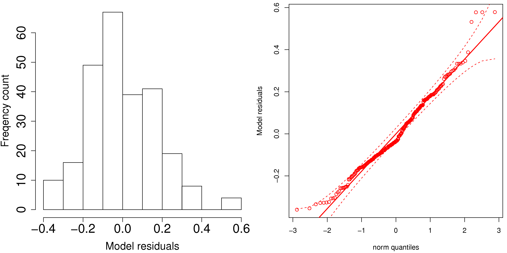

A typical histogram of the residuals looks as shown above: it is always centered around zero, and appears to be normally distributed.  So we could expect to write our prediction error as :math:`\hat{y}_\text{new} = \left(b_0 + b_1 x_\text{new}\right) \pm c \cdot S_E`, where :math:`c` is the number of standard deviations around the average residual, for example we could have set :math:`c=2`, approximating the 95% confidence limit.

But there is something wrong with that error estimate.  It says that our prediction error is constant at any value of :math:`x_i`, even at values outside the range where we built the model. This is a naive estimate of the prediction error.  We have forgotten that coefficients :math:`b_0` and :math:`b_1` have error, and that error must be propagated into :math:`\hat{y}_\text{new}`.

A better attempt to construct prediction intervals for the least squares model
^^^^^^^^^^^^^^^^^^^^^^^^^^^^^^^^^^^^^^^^^^^^^^^^^^^^^^^^^^^^^^^^^^^^^^^^^^^^^^^^^^^^^^^^^^^^
           
.. Note:: A good reference for this section is Draper and Smith, *Applied Regression Analysis*, page 79.

.. As is Devore, Probability and statistics for engineering and the sciences, page 506

The derivation is similar to that for |b1|.  We require an estimate for the variance of the predicted |y| at at given value of |x|.  Let's fix our |x| value at :math:`x_*` and since :math:`b_0 = \bar{\mathrm{y}} - b_1 \bar{\mathrm{x}}`, we can write the prediction at this fixed |x| value as :math:`\hat{y}_* = \bar{\mathrm{y}} - b_1(x_* - \bar{\mathrm{x}})`. 
 
.. math::

        \mathcal{V}\{y_*\} &= \mathcal{V}\{\bar{\mathrm{y}}\} + \mathcal{V}\{b_1(x_* - \bar{\mathrm{x}})\} + 2 \text{Cov}\{\bar{\mathrm{y}}, b_1(x_* - \bar{\mathrm{x}})\} \\
        \mathcal{V}\{y_*\} &= \dfrac{S_E^2}{n} + (x_* - \bar{\mathrm{x}})^2 S_E^2(b_1)

You may read the reference texts for the interesting derivation of this variance.  However, this is only the variance of the average predicted value of |y|.  In other words, it is the variance we expect if we repeatedly brought in observations at :math:`x_*`.  The prediction error of an individual observation, :math:`x_i`, and its corresponding prediction, :math:`\hat{y}_i`, is inflated slightly further:
                                                         
:math:`\mathcal{V}\{\hat{y}_i\} = S_E^2\left(1 + \dfrac{1}{n} + \dfrac{(x_i - \bar{\mathrm{x}})^2}{\sum_j{\left( x_j - \bar{\mathrm{x}} \right)^2}}\right)`.

We may construct a prediction interval in the standard manner, assuming that :math:`\hat{y}_i \sim \mathcal{N}\left( \overline{\hat{y}_i}, \mathcal{V}\{\hat{y}_i\} \right)`.  We will use an estimate of this variance since we do not know the population variance.  This requires we use the :math:`t`-distribution with :math:`n-k` degrees of freedom, at a given degree of confidence, e.g. 95%.

.. math::

    \begin{array}{rcccl} 
        -c_t &<& \dfrac{\hat{y}_i - \overline{\hat{y}_i}}{\sqrt{V\{\hat{y}_i\}}} &<& +c_t \\
        \hat{y}_i -c_t \sqrt{V\{\hat{y}_i\}} &<& \overline{\hat{y}_i} &<& \hat{y}_i + c_t \sqrt{V\{\hat{y}_i\}}
    \end{array}

This is a prediction interval for a new prediction, :math:`\hat{y}_i` from a new |x| value, :math:`x_i`. For example, if :math:`\hat{y}_i` = 20 at a given value of :math:`x_i`, and if :math:`c_t \sqrt{V\{\hat{y}_i\}}` = 5, then you will usually see written in reports and documents that, the prediction was :math:`20 \pm 5`.  A more correct way of expressing this concept is to say the true prediction at the value of :math:`x_i` lies within a bound from 15 to 25, with 95% confidence.

Implications of the prediction error of a new |y|
^^^^^^^^^^^^^^^^^^^^^^^^^^^^^^^^^^^^^^^^^^^^^^^^^^^^^^^^^^^^^^^^^^^^^^^^^^^^^^^^^^^^^^^^^^^^

Let's understand the interpretation of :math:`\mathcal{V}\{\hat{y}_i\} = S_E^2 \left(1 + \dfrac{1}{n} + \dfrac{(x_i - \bar{\mathrm{x}})^2}{\sum_j{\left( x_j - \bar{\mathrm{x}} \right)^2}}\right)` as the variance of the predicted :math:`\hat{y}_i` at the given value of :math:`x_i`. Using the previous example where we calculated the least squares line, now:

#.	Let :math:`x_\text{new} = \bar{\mathrm{x}}`, the center point of our data.  Write down the upper and lower value of the prediction bounds for the corresponding :math:`\hat{y}`, given that :math:`c_t = 2.26` at the 95% confidence level. 

	.. only:: studentlatex

		- The LB = :math:`\hat{y}_i - c_t \sqrt{V\{\hat{y}_i\}}` = 
		- The UB = :math:`\hat{y}_i + c_t \sqrt{V\{\hat{y}_i\}}` =
		- What do you notice that is special about these bounds at the point :math:`x_\text{new} = \bar{\mathrm{x}}`?
		
	.. only:: inst
	
		- The LB = :math:`\hat{y}_i - c_t \sqrt{V\{\hat{y}_i\}} = 7.5 - 2.26 \times (1.236)^2 \times \sqrt{\left(1+\dfrac{1}{11} + \dfrac{(\bar{\mathrm{x}} - \bar{\mathrm{x}})^2}{\sum_j{\left( x_j - \bar{\mathrm{x}} \right)^2}}\right)} = 7.5 - 2.26 \times 1.527 \times 1.044 = 7.50 - 3.60`
		- The UB = :math:`\hat{y}_i + c_t \sqrt{V\{\hat{y}_i\}} = 7.5 + 2.26 \times (1.236)^2 \times \sqrt{\left(1+\dfrac{1}{11} + \dfrac{(\bar{\mathrm{x}} - \bar{\mathrm{x}})^2}{\sum_j{\left( x_j - \bar{\mathrm{x}} \right)^2}}\right)} = 7.5 + 2.26 \times 1.527 \times 1.044 = 11.1`

	
#.	Now move left and right, away from :math:`\bar{\mathrm{x}}`, and mark the confidence intervals.  What general shape do they have?  

	-	The confidence intervals have a quadratic shape due to the square term under the square root.  The smallest prediction error occurs at the center of the model, and expands progressively wider as one moves away from the model center.  This is illustrated in the figure and makes intuitive sense as well.
	
	.. figure:: images/show-anscome-solution-with-yhat-bounds.png
		:width: 750px
		:align: center
		:scale: 59

Interpretation of software output
~~~~~~~~~~~~~~~~~~~~~~~~~~~~~~~~~~~~~

To complete this section we show how to interpret the output from computer software packages.  Most packages have very standardized output, and you should make sure that whatever package you use, that you can interpret the estimates of the parameters, their confidence regions and get a feeling for the model's performance.

The following output is obtained in R for the :ref:`example <class-example>` we have been using in this section.  

.. code-block:: text

	> x <- c(10, 8, 13, 9, 11, 14, 6, 4, 12, 7, 5)
	> y <- c(8.04, 6.95, 7.58, 8.81, 8.33, 9.96, 7.24, 4.26, 10.84, 4.82, 5.68)
	> model <- lm(y ~ x)    # "The linear model, where y is described by x"
	> summary(model)
	
	Call:
	lm(formula = y ~ x)

	Residuals:
	     Min       1Q   Median       3Q      Max 
	-1.92127 -0.45577 -0.04136  0.70941  1.83882 

	Coefficients:
	            Estimate Std. Error t value Pr(>|t|)   
	(Intercept)   3.0001     1.1247   2.667  0.02573 * 
	x             0.5001     0.1179   4.241  0.00217 **
	---
	Signif. codes:  0 `***' 0.001 `**' 0.01 `*' 0.05 `.' 0.1 ` ' 1 

	Residual standard error: 1.237 on 9 degrees of freedom
	Multiple R-squared: 0.6665,	Adjusted R-squared: 0.6295 
	F-statistic: 17.99 on 1 and 9 DF,  p-value: 0.002170
	
Make sure you can calculate from the equations given in the notes the following values.

	- The intercept term |b0| = 3.0001.
	- The slope term |b1| = 0.5001.
	- The standard error of the model, :math:`S_E` = 1.237, using :math:`n-k = 11 - 2 = 9` degrees of freedom.
	- Using the standard error, calculate the standard error of :math:`S_E(b_0) = 1.1247`.
	- Using the standard error, calculate the standard error of :math:`S_E(b_1) = 0.1179`.
	- The :math:`z`-value for the |b0| term is 2.667 (R calls this the ``t value``, in our notes we have called this :math:`z = \dfrac{b_0 - \beta_0}{S_E(b_0)}`; the value that we compare to the :math:`t`-statistic to create the confidence interval).
	- The :math:`z`-value for the |b1| term is 4.241 (see the above comment again).
	- The two probability values for |b0| and |b1| are familiar to you; they are the probability with which we expect to find a value of :math:`z` greater than the calculated :math:`z`-value (called ``t value`` in the output above).  The smaller the number, the more confident we can be the confidence interval contains the parameter estimate.
	- You can construct the confidence interval for |b0| or |b1| by using their reported standard errors and multiplying by the corresponding :math:`t`-value.  For example, if you want 99% confidence limits, then look up the 99% values for the :math:`t`-distribution using :math:`n-k` degrees of freedom, in this case it would be ``qt((1-0.99)/2, df=9)``, which is :math:`\pm 3.25`.  So the 99% confidence limits for the slope coefficient would be :math:`[0.5 - 3.25 \times 0.1179; 0.5 + 3.25 \times 0.1179] = [0.12; 0.88]`.
	- The :math:`R^2 = 0.6665` value.
	- Be able to calculate the residuals: :math:`e_i = y_i - \hat{y}_i = y_i - b_0 - b_1 x_i`.  We expect the median of the residuals to be around 0, and the rest of the summary of the residuals gives a feeling for how far the residuals range about zero.

Investigation of an existing linear model
=============================================

Summary so far
~~~~~~~~~~~~~~~~~~~

We have introduced the linear model, :math:`y = \beta_0 + \beta_1 x + \varepsilon` and shown how to estimate the 2 model parameters, :math:`b_0 = \hat{\beta}_0` and :math:`b_1 = \hat{\beta}_1`.  This can be done on any data set without any additional assumptions.  But, in order to calculate confidence intervals so we can better understand our model's performance, we must make several assumptions of the data.  In the next sections we will learn how to interpret various plots that indicate when these assumptions are violated.

Along the way, while investigating these assumptions, we will introduce some new topics:

	*	Transformations of the raw data to better meet the assumptions
	*	Leverage, outliers, influence and discrepancy of the observations
	*	Inclusion of additional terms in the linear model (multiple linear regression, MLR)
	*	The use of training and testing data

It is a common theme in any modelling work that the most informative plots are those of the residuals - the unmodelled component of our data.   We expect to see no structure in the residuals, and since the human eye is excellent at spotting patterns in plots, it is no surprise that various types of residual plots are used to diagnose problems with our model.

Normally distributed errors
~~~~~~~~~~~~~~~~~~~~~~~~~~~~

We look for normally distributed errors because if they are non-normal, then the standard error, :math:`S_E` and the other variances that depend on :math:`S_E`, such as :math:`\mathcal{V}(b_1)`, are inflated.  This could, for example, lead us to infer that a slope coefficient is not important when it actually is.

This is one of the easiest assumptions to verify: use a qq-plot to assess the distribution of the residuals.  Do *not* plot the residuals in sequence or some other order to verify normality - it is extremely difficult to see that.  A qq-plot highlights very clearly when tails from the residuals are too heavy.  A histogram may also be used, but for real data sets, the choice of bin width can dramatically distort the interpretation - rather use a qq-plot.  Some code for R:

.. code-block:: s

	model = lm(...)
	library(car)
	qq.plot(model)            # uses studentized residuals
	qq.plot(resid(model))     # uses raw residuals

If the residuals appear non-normal, then attempt the following:
	
	-	Remove the outlying observation(s) in the tails, but only after careful investigation
	-	Use a suitable transformation of the y-variable
	-	add additional terms

The simple example shown here builds a model that predicts the price of a used vehicle using only the mileage as an explanatory variable.  

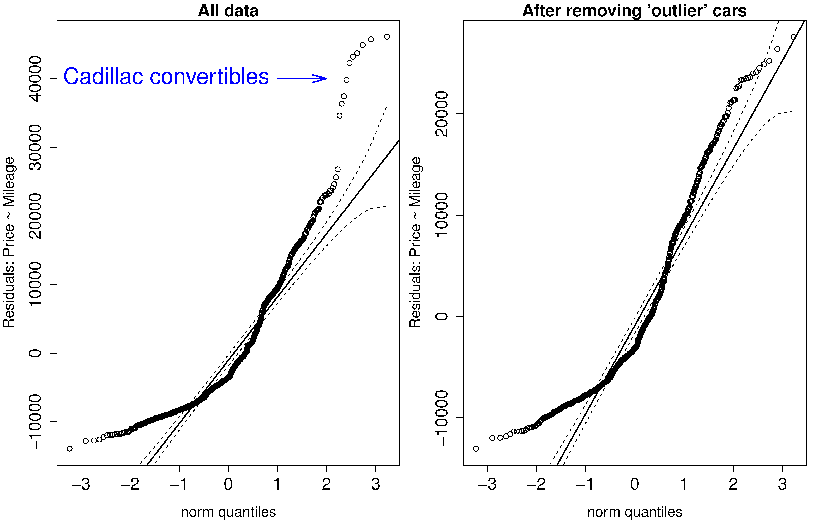

The group of outliers were due to 10 observations a certain class of vehicle (Cadillac convertibles) that distort the model.  We can remove these observations, which limits our model to be useful only for other vehicle types, but we gain a smaller standard error and a tighter confidence interval.  These residuals are still very non-normal though.

.. math::
	
	\begin{array}{rcccl}
		\text{Before}: \qquad & b_1 = -0.173 & \qquad -0.255 \leq \beta_1 \leq -0.0898 &\qquad S_E = \text{\$} 9789\\
		\text{After}:  \qquad & b_1 = -0.155 & \qquad -0.230 \leq \beta_1 \leq -0.0807 &\qquad S_E = \text{\$} 8655
	\end{array}

The slope coefficient (each extra mile on the odometer reduces the sale price on average by 15 to 17 cents) has a tighter confidence interval after removing those unusual observations.

In the next fictitious example the |y|-variable is non-linearly related to the |x|-variable.  This non-linearity in the |y| shows up as non-normality in the residuals if only a linear model is used.  The residuals become more linearly distributed when using a square root transformation of the |y| before building the linear model.

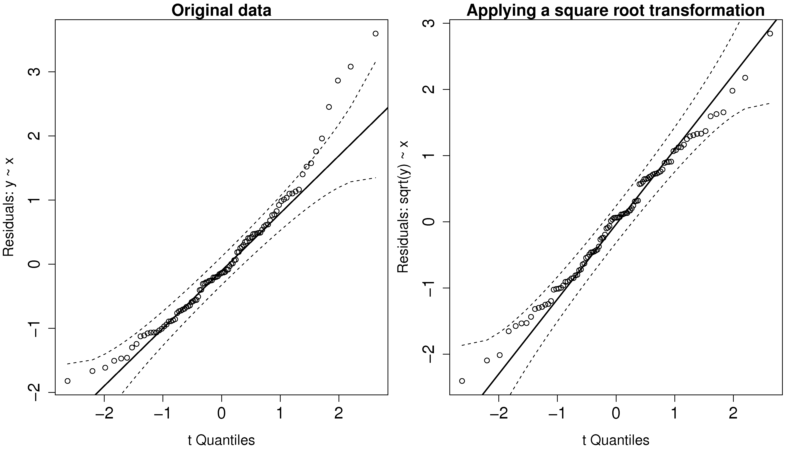
	
More discussion about transformations of the data is given in the section on :ref:`model linearity <LS-model-linearity>`.

Non-constant error variance
~~~~~~~~~~~~~~~~~~~~~~~~~~~~

It is common in many situations that the variability in |y| increases or decreases as |y| is increased (e.g. certain properties are more consistently measured at low levels than at high levels).  Similarly, variability in |y| increases or decreases as |x| is increased (e.g. as temperature, |x|, increases our variability in a particular |y| increases).

Violating the assumption of non-constant error variance increases the standard error, :math:`S_E`, undermining the estimates of the confidence intervals, and other analyses that depend on the standard error.  Fortunately, it is only problematic if the non-constant variance is extreme.

To detect this problem you should plot:

 	- the predicted values of |y| (on the x-axis) against the residuals (y-axis)
	- the |x| values against the residuals (y-axis)

This problem reveals itself by showing a fan shape across the plot; an example is shown below.

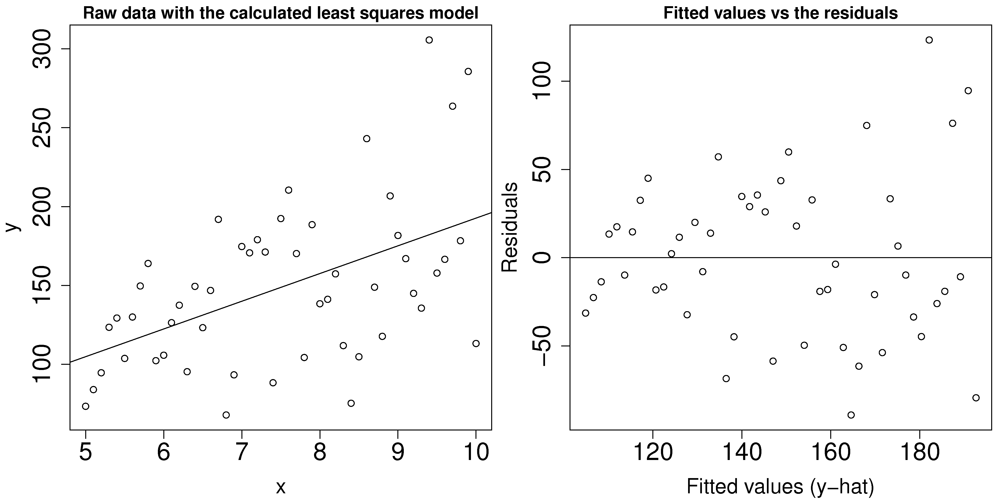

To counteract this problem one can use weighted least squares, with smaller weights on the high-variance observations (i.e. apply a weight inversely proportional to the variance).  Weighted least squares minimizes: :math:`f(\mathrm{b}) = \sum_i^n{(w_ie_i)^2}`, with different weights, :math:`w_i` for each error term. We do not cover weighted-least squares in this book.  More on this topic can be found in the book by Draper and Smith (p 224 to 229, 3rd edition).

.. _LS-autocorrelation-test:

Lack of independence in the data
~~~~~~~~~~~~~~~~~~~~~~~~~~~~~~~~~~~~~~~~~~~~~~~~~~~~~~~~

The assumption of independence in the data requires that values in the |y| variable are independent.  Given that we have assumed the |x| variable to be fixed, this implies that the error, :math:`e_i` are independent.  The reason for independence is required for the central limit theorem, which was used to derive the various standard errors.

Data are not independent when they are correlated with each other.  This is common on slow moving processes: for example, measurements of concentration in a large reactor are unlikely to change much from one minute to the next.

Treating this problem properly comes under the topic of time-series analysis, for which a number of excellent textbooks exist, particular the one by Box and Jenkins.  But we will show how to detect autocorrelation, and provide a make-shift solution to avoid it.

If you suspect that there may be lack of independence, use plots of the residuals in time order.  Look for patterns such as slow drifts, or rapid criss-crossing of the zero axis.

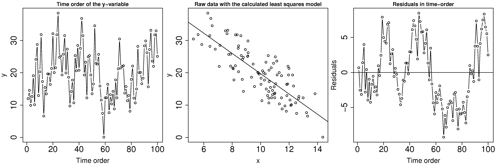
	
One way around the autocorrelation is to subsample - use only every :math:`k^\text{th}` sample, where :math:`k` is a certain number of gaps between the points.  How do we know how many gaps to leave?  Use the `autocorrelation function <http://en.wikipedia.org/wiki/Autocorrelation>`_ to determine how many samples.  You can use the ``acf(...)`` function in R, which will show how many significant lags there are between observations.  Calculating the autocorrelation accurately requires a large data set, which is a requirement anyway if you need to subsample your data to obtain independence.

Here are some examples of the autocorrelation plot: in the first case you would have to leave at least 16 samples between each sub-sample, while the second and third cases require a gap of 1 sample.

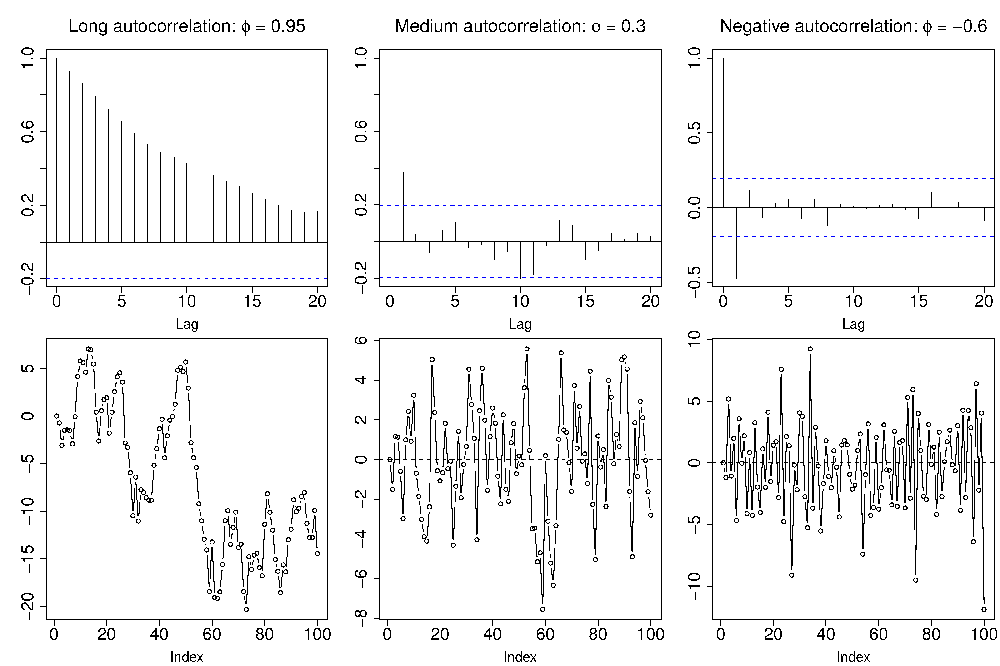

Another test for autocorrelation is the Durbin-Watson test.  For more on this test see the book by Draper and Smith (Chapter 7, 3rd edition); in R you can use the ``durbin.watson(model)`` function in ``library(car)``

.. Box and Newbold describe a case where the lack of independence lead to serious mis-interpretation:  J Royal Statist. Soc. Series A, v134, p229-240, 1971
.. Also see: /Users/kevindunn/Statistics course/Course notes/Correlation, covariance and least squares/images/autocorrelated-data-problem.R
..             where I try to reproduce this problem.

.. _LS-model-linearity:

Linearity of the model (incorrect model specification)
~~~~~~~~~~~~~~~~~~~~~~~~~~~~~~~~~~~~~~~~~~~~~~~~~~~~~~~~

Recall that the linear model is just a tool to either learn more about our data, or to make predictions.  Many cases of practical interest are from systems where the general theory is either unknown, or too complex, or known to be non-linear.  

Certain cases of non-linearity can be dealt with by simple transformations of the raw data: use a **non-linear transformation** of the raw data and then build a *linear model* as usual.  An alternative method which fits the non-linear function, using concepts of optimization, by minimizing the sum of squares is covered in a section on non-linear regression.  Again the book by Draper and Smith (Chapter 24, 3rd edition), may be consulted if this topic is of further interest to you.  Let's take a look at a few examples.

We saw earlier a case where a square-root transformation of the |y| variable made the residuals more normally distributed.  There is in fact a sequence of transformations that can be tried to modify the distribution of a single variable: :math:`x_\text{transformed} \leftarrow x^p_\text{original}`.
		
	* When :math:`p` goes from 1 up to 1.5, 1.75, 2.0, *etc*, it compresses small values of :math:`x` and inflates larger values.
	* When :math:`p` goes down from 1, 0.5 (:math:`\sqrt{x}`), 0.25, -0.5, -1.0 (:math:`1/x`), -1.5, -2.0, *etc*, it compresses large values of :math:`x` and inflates smaller values.
	* The case of :math:`\log(x)` approximates :math:`p=0` in terms of the severity of the transformation.
	
In other instances we may know from first-principles theory, or some other means what the expected relationship is between an |x| and |y| variable.

	*	In a distillation column the temperature, :math:`T` is inversely proportional to the logarithm of the vapour pressure, :math:`P`.  So fit a linear model, :math:`y = b_0 + b_1x` where :math:`x \leftarrow 1/T` and where :math:`y \leftarrow P`.  The slope coefficient will have a different interpretation and a different set of units as compared to the case when predicting vapour pressure directly from temperature.
	*	If :math:`y = p \times q^x`, then we can take logs and estimate this equivalent linear model: :math:`\log(y) = \log(p) + x \log(q)`, which is of the form :math:`y = b_0 + b_1 x`.  So the slope coefficient will be an estimate of :math:`\log(q)`.
	*	If :math:`y = \dfrac{1}{p+qx}`, then invert both sides and estimate the model :math:`y = b_0 + b_1 x` where :math:`b_0 \leftarrow p`, :math:`b_1 \leftarrow q` and :math:`y\leftarrow 1/y`
	*	There are plenty of other examples, some classic cases being the non-linear models that arise during reactor design and biological growth rate models.  With some ingenuity (taking logs, inverting the equation), these can often be simplified into linear models.
	*	Some cases cannot be linearized and are best estimated by non-linear least squares methods.  However, a make-shift approach which works quite well for simple cases is to perform a grid search.  For example imagine the equation to fit is :math:`y = \beta_1\left(1-e^{-\beta_2 x} \right)`, and you are given some data pairs :math:`(x_i, y_i)`.  Then for example, create a set of trial values :math:`\beta_1 = [10, 20, 30, 40, 50]` and :math:`\beta_2 = [0.0, 0.2, 0.4, 0.8]`.  Build up a grid for each combination of :math:`\beta_1` and :math:`\beta_2` and calculate the sum of squares objective function for each point in the grid.  By trial-and-error you can converge to an approximate value of :math:`\beta_1` and :math:`\beta_2` that best fit the data.  You can then calculate :math:`S_E`, but not the confidence intervals for :math:`\beta_1` and :math:`\beta_2`.
	
Before launching into various transformations or non-linear least squares models, bear in mind that the linear model may be useful over the region of interest.  In the case below, we might only be concerned with using the model over the region shown, even though the system under observation behaves non-linearly over a wider region of operation.

	.. figure:: images/nonlinear-linear-region.png
		:align: center
		:width: 500px
		:scale: 70
			
How can we detect when the linear model is not sufficient anymore?  While a qq-plot might hint at problems, better plots are the same two plots for detecting non-constant error variance:

	-	the predicted values of |y| (on the x-axis) against the residuals (y-axis)
	-	the |x| values against the residuals (y-axis)
	
Here we show both plots for the example just prior (where we used a linear model for a smaller sub-region).  The last two plots look the same, because the predicted :math:`\hat{\mathrm{y}}` values are just a linear transformation of the |x| values.

	.. figure:: images/nonlinear-detection.png
		:align: center
		:width: 750px

Transformations are considered successful once the residuals appear to have no more structure in them.  Also bear in mind that structure in the residuals might indicate the model is missing an additional explanatory variable (see the section on :ref:`multiple linear regression <LS-multiple-X-MLR>`).

Another type of plot to diagnose non-linearity present in the linear model is called a *component-plus-residual plot* or a *partial-residual plot*.  This is an advanced topic not covered here.

.. Also see:  http://www.apsnet.org/education/advancedplantpath/topics/RModules/doc1/05_Nonlinear_regression.html

Summary of steps to build and investigate a linear model
==========================================================

#.	Plot the data to assess model structure and degree of correlation between the |x| and |y| variable.

	.. code-block:: s
		
		plot(x, y)              # plot the raw data
		lines(lowess(x,y))      # superimpose non-parametric smoother to see the correlation
		
#.	Fit the model and examine the printed output.

	.. code-block:: s
	
		model <- lm(y ~ x)      # fit the model: "y as described by variable x"
		summary(model)
		confint(model)
	
	- Investigate the model's standard error, how does it compare to the range of the |y| variable?
	- Calculate the confidence intervals for the model parameters and interpret them.

#.	Visualize the model's predictions in the context of the model building data.

	.. code-block:: s

		plot(x, y)
		lines(lowess(x,y))        # show the smoother
		abline(model, col="red")  # and show the least squares model
		
#.	Plot a normal probability plot, or a qq-plot, of the residuals.  Are they normally distributed?  If not, investigate if a transformation of the |y| variable might improve them.  But also see the additional plots on checking for non-linearity and missing terms.

	.. code-block:: s

		library(car)
		qq.plot(resid(model))

#.	Plot the residuals against the |x|-values. We expect to see no particular structure.  If you see trends in the data, it indicates that a transformation of the |x| variable might be appropriate, or that there are unmodelled phenomena in the |y| variable - we might need an additional |x| variable.

	.. code-block:: s

		plot(x, resid(model))
		abline(h=0, col="red")
		
#.	Plot the residuals in time (sequence) order. We expect to see no particular trends in the data.  If there are patterns in the plot, assess whether autocorrelation is present in the |y| variable (use the ``acf(y)`` function in R).  If so, you might have to sub-sample the data, or resort to proper time-series analysis tools.

	.. code-block:: s

		plot(resid(model))
		abline(h=0, col="red")
		lines(lowess(resid(model), f=0.2))   # use a shorter smoothing span

#.	Plot the residuals against the fitted-values.  By definition of the least-squares model, the covariance between the residuals and the fitted values is zero.  You can verify that :math:`e^T\hat{y} = \sum_i^n{e_i\hat{y}_i} = 0`.  A fan-shape to the residuals indicates the residual variance is not constant over the range of data: you will have to use weighted least squares to counteract that.  It is better to use studentized residuals (we cover this later), rather than the actual residuals, since the actual residuals can show non-constant variance even though the errors have constant error.

	.. That last line was from Fox's notes; cross reference it still

	.. code-block:: s

		plot(predict(model), rstudent(model))
		lines(lowess(predict(model), rstudent(model)))
		abline(h=0, col="red")

#.	Plot the predictions of |y| against the actual values of |y|.  We expect the data to fall around a 45 degree line.
		
	.. code-block:: s

		plot(y, predict(model))
		lines(lowess(y, predict(model), f=0.5))     # a smoother
		abline(a=0, b=1, col="red")                 # a 45 degree line

..	R2 = corr(x,y) = cov(X,Y)/SD(X)/SD(Y): notice the symmetry, R2 is the same whether y~x or x~y

.. Notes for this section

	p 288 of Hogg and Ledolter:
	
	1.	Plot residuals (y) against fitted values(x): 
	2.	Outliers should be investigated - they are often the most interesting points
	3.	Increase in variance in residuals vs fitted values
	4.	Residuals in sequence (trends?)
	5.	Residuals vs x-variable: model structure deficiency

	Residuals due to (a) experimental error or (b) model structure deficiency

	(b) Model structure deficiency:

		- residual-pattern-forgottern-term.png shows forgotten term

	Pure (experimental) error: assessed with replicate data.  How to test for model deficiency?

	Show that the sum of squares of the errors = sum(e^2) = e^Te = y^Ty - beta^TX^Ty

	Leverage, outliers, influence and discrepancy
	- Chatterjee and Hadi paper (see PDF)

More than one variable: multiple linear regression (MLR)
================================================================================

We now move to including more than one explanatory |x| variable in the linear model.  We will:

 	#.	introduce some matrix notation for this section
	#.	show how the optimization problem is solved to estimate the model parameters
	#.	how to interpret the model coefficients
	#.	extend our tools to analyze the linear model
	#.	use integer (yes/no or on/off) variables in our model.

First some motivating examples:

	-	A relationship exists between :math:`x_1` = reactant concentration and :math:`x_2` = temperature with respect to :math:`y` = reaction rate.  We already have a linear model between :math:`y = b_0 + b_1x_1`, but we want to improve our understanding of the system by learning about the temperature effect, :math:`x_2`.
	-	We want to predict melt index in our reactor from the reactor temperature, but we know that the feed flow and pressure are also good explanatory variables.  How do these additional variables improve the predictions?
	-	We know that the quality of our plastic product is a function of the mixing time, and also the mixing tank in which the raw materials are blended.  How do we incorporate the concept of a mixing tank indicator in our model?
	
..	- Ian Nichols example
..	- Case study/Example: http://www.amstat.org/publications/jse/v16n3/datasets.kuiper.html 
..	- Show that R2 increases when adding a new variable to the equation (also see p105 of Fox)
	- Consider summarizing p223-225 of Fox here regarding t- and F-tests
	- Add Q5.11 from assignment 3 here to show how adding terms increases R2
	
Multiple linear regression: notation
~~~~~~~~~~~~~~~~~~~~~~~~~~~~~~~~~~~~~~~~~~~~~~~~~~~~~~~~~~~~~~~~~~~~~~~~

To help the discussion below it is useful to omit the least squares model's intercept term.  We do this by first centering the data.

.. math::

	y_i &= b_0 + b_1 x_i \\
	\bar{y} &= b_0 + b_1 \bar{x} \\
	y_i - \bar{y} &= 0 +b_1(x_i - \bar{x}) \qquad \text{by subtracting the previous lines from each other}
	
This indicates that if we fit a model where the |x| and |y| vectors are first mean-centered, i.e. let :math:`x = x_\text{original} - \text{mean}\left(x_\text{original} \right)` and :math:`y = y_\text{original} - \text{mean}\left(y_\text{original} \right)`, then we still estimate the same slope for :math:`b_1`, but the intercept term is zero.  All we gain from this is simplification of the subsequent analysis.  Of course, if you need to know what :math:`b_0` was, you can use the fact that :math:`b_0 = \bar{y} - b_1 \bar{x}`.  Nothing else changes: the :math:`R^2, S_E, S_E(b_1)` and all other model interpretations remain the same.  You will prove this to yourself in the assignment.

In the rest of the this section we will omit the model's intercept term, since it can always be recovered afterwards.
	
The general linear model is given by:

.. math::
	y_i &= \beta_1 x_1 + \beta_2x_2 + \ldots + \beta_kx_k + \epsilon_i \\
	y_i &= [x_1, x_2, \ldots, x_k] \begin{bmatrix} \beta_1 \\ \beta_2 \\ \vdots \\ \beta_k \end{bmatrix} + \epsilon_i \\
	y_i &= \underbrace{\mathit{x}^T}_{(1 \times k)} \underbrace{\beta}_{(k \times 1)} + \,\epsilon_i
	
And writing the last equation |n| times over for each observation in the data:

.. math::
	        \begin{bmatrix} y_1\\ y_2\\ \vdots \\ y_n \end{bmatrix} &=
	        \begin{bmatrix} x_{1,1} & x_{1,2} & \ldots & x_{1,k}\\ 
	                        x_{2,1} & x_{2,2} & \ldots & x_{2,k}\\ 
	                        \vdots  & \vdots  & \ddots & \vdots\\
	                        x_{n,1} & x_{n,2} & \ldots & x_{n,k}\\ 
	        \end{bmatrix}
	        \begin{bmatrix} b_1 \\ b_2 \\ \vdots \\ b_k \end{bmatrix} +
	        \begin{bmatrix} e_1\\ e_2\\ \vdots \\ e_n \end{bmatrix}\\
	        \mathbf{y} &= \mathbf{X} \mathbf{b} + \mathbf{e}

where:

	- :math:`\mathbf{y}`: :math:`n \times 1`
	- :math:`\mathbf{X}`: :math:`n \times k`
	- :math:`\mathbf{b}`: :math:`n \times 1`
	- :math:`\mathbf{e}`: :math:`n \times 1`

Estimating the model parameters via optimization
~~~~~~~~~~~~~~~~~~~~~~~~~~~~~~~~~~~~~~~~~~~~~~~~~~~~~~~~~~~~~~~~~~~~~

As with the bivariate case, we aim to minimize the sum of squares of the errors in vector :math:`\mathbf{e}`.  This least squares objective function can be written compactly as:

	.. math::
	    \begin{array}{rl}
	        f(\mathbf{b}) &= \mathbf{e}^T\mathbf{e} \\
	                      &= \left(\mathbf{y} - \mathbf{X} \mathbf{b} \right)^T \left( \mathbf{y} - \mathbf{X} \mathbf{b} \right) \\
	                      &= \mathbf{y}^T\mathbf{y} - 2 \mathbf{y}^T\mathbf{X}\mathbf{b} + \mathbf{b}\mathbf{X}^T\mathbf{X}\mathbf{b}
	    \end{array}

Taking partial derivative with respect to the entries in :math:`\mathbf{b}` and setting the result equal to a vector of zeros, you can prove to yourself that :math:`\mathbf{b} = \left( \mathbf{X}^T\mathbf{X} \right)^{-1}\mathbf{X}^T\mathbf{y}`.  You might find the `Matrix Cookbook <http://matrixcookbook.com/>`_ useful in solving these equations and optimization problems.

Three important relationships are now noted:

#. :math:`\mathcal{E}\{\mathbf{b}\} = \mathbf{\beta}` 
#. :math:`\mathcal{V}\{\mathbf{b}\} = \left( \mathbf{X}^T\mathbf{X} \right)^{-1} S_E^2`
#. An estimate of the standard error is given by: :math:`\sigma_e \approx S_E = \sqrt{\dfrac{\mathbf{e}^T\mathbf{e}}{n-k}}`, where :math:`k` is the number of parameters estimated in the model and :math:`n` is the number of observations.

These relationships imply that our estimates of the model parameters are unbiased (the first line), and that the variability of our parameters is related to the :math:`\mathbf{X}^T\mathbf{X}` matrix and the model's standard error, :math:`S_E`.  

Going back to the single variable case we showed in the section where we derived :ref:`confidence intervals <CI-for-model-parameters>` for :math:`b_0` and :math:`b_1`  that:

	.. math::
		\mathcal{V}\{b_1\} = \dfrac{S_E^2}{\sum_j{\left( x_j - \bar{\mathrm{x}} \right)^2}}
		
Notice that our matrix definition gives exactly the same result, remembering the |x| variables have already been centered in the matrix form.  Also recall that the variability of these estimated parameters can be reduced by (a) taking more samples, thereby increasing the denominator size, and (b) by including observations away from the center of the model.  
	
Example
~~~~~~~~~~~~~~~~~~~~~~~~~~~~~~~~~~~~~~~~~~~~~~~~~~~~~~~~~~~~~~~~~~~~~

Let :math:`x_1 = [1, 3, 4, 8, 8, 9]`, and :math:`x_2 = [9, 7, 5, 3, 1, 2]`, and :math:`y = [3, 5, 6, 8, 7, 10]`.  By inspection, the :math:`x_1` and :math:`x_2` variables are negatively correlated, and the :math:`x_1` and :math:`y` variables are positively correlated (also positive covariance).  Refer to the definition of covariance in equation :eq:`definition-covariance`.

After mean centering the data we have that :math:`x_1 = [-4.5, -2.5, -1.5 , 1.5 , 3.5,  3.5]`, and :math:`x_2 = [4,  4,  1, -2, -4, -3]` and :math:`y = [-3.5, -1.5, -0.5,  1.5,  0.5,  3.5]`.  So in matrix form:

.. math::
	\begin{array}{lr}
		\mathbf{X} = \begin{bmatrix} -4.5 & 4\\ -2.5 & 4 \\ -1.5 & 1 \\ 1.5 & -2 \\ 3.5 & -4 \\  3.5 & -3 \end{bmatrix}
	&\qquad\qquad
		\mathbf{y} = \begin{bmatrix} -3.5 \\ -1.5\\ -0.5\\  1.5\\  0.5\\  3.5 \end{bmatrix}
	\end{array}

The :math:`\mathbf{X}^T\mathbf{X}` and :math:`\mathbf{X}^T\mathbf{y}` matrices can then be calculated as:

.. math:: 

	\begin{array}{lr}
		\mathbf{X}^T\mathbf{X} = \begin{bmatrix} 55.5 &   -57.0 \\-57.0  & 62\end{bmatrix}
	&\qquad\qquad
		\mathbf{X}^T\mathbf{y} = \begin{bmatrix} 36.5 \\ -36.0 \end{bmatrix}
	\end{array}	 
	
Notice what these matrices imply (remembering that the vectors in the matrices have been centered).  The :math:`\mathbf{X}^T\mathbf{X}` matrix is a scaled version of the covariance matrix of :math:`\mathbf{X}`.  The diagonal terms show how strongly the variable is correlated with itself, which is the variance, and always a positive number.  The off-diagonal terms are symmetrical, and represent the strength of the relationship between, in this case, :math:`x_1` and :math:`x_2`. What would the off-diagonal terms be for uncorrelated variables?

The inverse of the :math:`\mathbf{X}^T\mathbf{X}` matrix is particularly important - it is related to the standard error for the model parameters - as in: :math:`\mathcal{V}\{\mathbf{b}\} = \left( \mathbf{X}^T\mathbf{X} \right)^{-1} S_E^2`.

.. math::

	\begin{array}{lr}
		\left(\mathbf{X}^T\mathbf{X}\right)^{-1}= \begin{bmatrix} 0.323 & 0.297 \\ 0.297 & 0.289 \end{bmatrix}
	\end{array}

The non-zero off-diagonal elements indicate that the variance of the :math:`b_1` coefficient is related to the variance of the :math:`b_2` coefficient as well. 

For two variables, the general relationship is that:

.. math::
	
	\mathcal{V}\left(b_1\right) &= \dfrac{1}{1-r^2_{12}} \times \dfrac{S_E^2}{\sum{x_1^2}} \\
	\mathcal{V}\left(b_2\right) &= \dfrac{1}{1-r^2_{12}} \times \dfrac{S_E^2}{\sum{x_2^2}}

where :math:`r^2_{12}` represents the correlation between variable :math:`x_1` and :math:`x_2`. What happens as the correlation between the two variables increases?

.. We won't go into details here, but these lead to oval-shaped confidence intervals.  Show picture and illustrate the marginal vs elliptical CI; see BHH,v2, page 370

Interpretation of the model coefficients
~~~~~~~~~~~~~~~~~~~~~~~~~~~~~~~~~~~~~~~~~~~~~~~~~~~~~~~~~~~~~~~~~~~~~

Let's take a look at the case where :math:`y = b_1x_1 + b_2x_2`.  We can plot this on a 3D plot, with axes of :math:`x_1`, :math:`x_2` and :math:`y`:

	.. figure:: images/least-squares-two-x-variables.png
		:width: 500px
		:align: center
		:scale: 70

The points are used to fit the plane by minimizing the sum of square distances shown from each point to the plane.  The interpretation of the slope coefficients for :math:`b_1` and :math:`b_2` is **not the same** as for the case with just a single |x| variable.  

When we have multiple |x| variables, then the value of coefficient :math:`b_1` is the average change we would expect in :math:`\mathbf{y}` for a one unit change in :math:`{x}_1` provided we hold :math:`{x}_2` fixed.  It is the last part that is new:  we must assume that other |x| variables are fixed.

For example: :math:`y = b_T T + b_S S = -0.52 T + 3.2 S`, where :math:`T` is reactor temperature in Kelvin, and :math:`S` is substrate concentration in g/L, and :math:`y` is yield in :math:`\mu\text{g}`, for a fixed reactor system. The :math:`b_T = -0.52 \mu\text{g}/\text{K}` coefficient is the decrease in yield for every 1 Kelvin increase in temperature, holding the substrate concentration fixed.

This is a good point to introduce some terminology you might have come across.   Imagine you have a model where :math:`{y}` is the used vehicle price and :math:`{x}_1` is the mileage on the odometer (we expect that :math:`b_1` will be negative) and :math:`{x}_2` is the number of doors on the car.  You might hear the phrase: "the effect of the number of doors, controlling for mileage, is not significant".  The part "controlling for ..." indicates that the controlled variable has been added to regression model, and its effect is accounted for.  In other words, for two vehicles with the same mileage, the coefficient :math:`b_2` indicates whether the second hand price increases or decreases as the number of doors on the car changes (e.g. a 2-door vs a 4-door car). 

In the prior example, we could say: the effect of substrate concentration on yield, controlling for temperature, is to increase the yield by 3.2 :math:`\mu\text{g}` for every increase in 1 g/L of substrate concentration.

Integer (dummy, indicator) variables in the model
~~~~~~~~~~~~~~~~~~~~~~~~~~~~~~~~~~~~~~~~~~~~~~~~~~~~~~~~~~~~~~~~~~~~~

Now that we have introduced multiple linear regression to expand our models, we also consider these sort of cases:

	-	We want to predict yield, but want to indicate whether a radial or axial impeller was used in the reactor and learn whether it has any effect on yield.
	-	Use an indicator variable to show if the raw material came from the supplier in Spain, India, or Vietnam and interpret its effect on yield.
	
	..	figure:: images/Mixing_-_flusso_assiale_e_radiale.jpg
		:width: 500px
		:align: center
		:scale: 40
	
		Axial and radial blades; figure from Wikipedia (http://en.wikipedia.org/wiki/Impeller)
	
We will start with the simplest case, using the example of the radial or axial impeller.  We wish to understand the effect on yield, :math:`y [\mu\text{g}]`, as a function of the impeller type, and impeller speed, :math:`x`.

.. math::
	
	y &= \beta_0 + \beta_1x + \gamma d + \varepsilon \\
	y &= b_0 + b_1 x + g d_i + e_i \\
	
where :math:`d_i = 0` if an axial impeller was used, or :math:`d_i = 1` if a radial impeller was used.  All other least squares assumptions hold, particularly that the variance of :math:`y_i` is unrelated to the value of :math:`d_i`.  For the initial illustration, assume that :math:`\beta_1 = 0`, then geometrically, what is happening here is shown below:

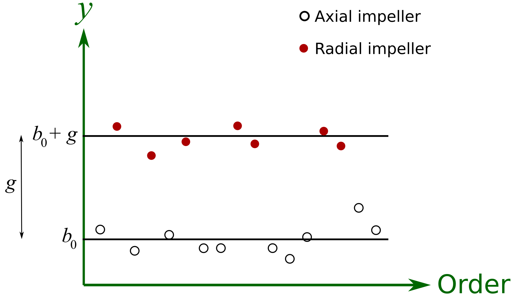

The :math:`\gamma` parameter, estimated by :math:`g`, is the difference in intercept when changing impellers.  Note that the lines are parallel.  

.. math:: 
	\begin{array}{ll}
		\text{Axial impellers:} \qquad &\qquad y = b_0 + 0 \\
		\text{Radial impellers:} \qquad &\qquad y = b_0 + g 
	\end{array}

Now if :math:`\beta_1 \neq 0`, then the horizontal lines in the above figure are tilted, but still parallel to each other. Nothing else is new here, other than the structure of the variable used for :math:`d_i`.  The interpretation of its coefficient, :math:`g`, is the same as with any other coefficient.  In this particular example, had :math:`g = -56 \mu\text{g}`, it would indicate that the average decrease in yield is 56 :math:`\mu\text{g}` when using a radial impeller.  

The rest of the analysis tools for least squares models can be used quite powerfully. For example, this 95% confidence interval for the impeller variable

.. math:: 

	-32 \mu\text{g} \leq \gamma \leq 21 \mu\text{g}
	
would indicate the impeller type has no significant effect on the yield amount.

Integer variables are also called dummy variables or indicator variables.  Really what is happening here is the same concept as for multiple linear regression, the equation of a plane is being estimated.  Even though we only use the equation of the plane at integer values of :math:`d`, but the underlying plane is actually continuous.

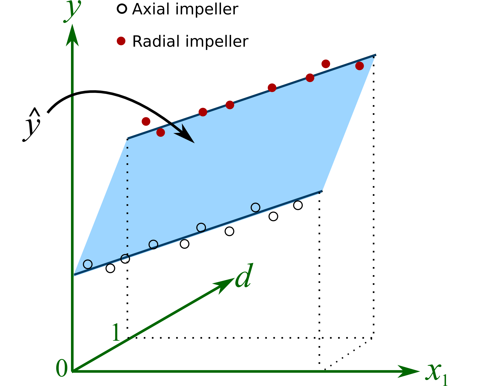
	
We have to introduce additional terms in the model if we have integer variables with more than 2 levels. In general, if there are :math:`p`-levels, then we must include :math:`p-1` new terms.  For example, if we wish to test the effect of :math:`y` = yield achieved from the raw material supplier in Spain, India, or Vietnam, we could code:

	- Spain: :math:`d_{i1} = 0` and :math:`d_{i2} = 0`
	- India: :math:`d_{i1} = 1` and :math:`d_{i2} = 0`
	- Vietnam: :math:`d_{i1} = 0` and :math:`d_{i2} = 1`.

and solve for the least squares model: :math:`y = \beta_0 + \beta_1x_1 + \ldots + \beta_k x_k + \gamma_1 d_1 + \gamma_2 d_2 + \varepsilon`, where :math:`\gamma_1` is the effect of the Indian supplier, holding all other terms constant;  :math:`\gamma_2` is the incremental effect of the Vietnamese supplier in addition to the Indian supplier.  Because of this somewhat confusing interpretation of the coefficients, sometimes people will use an extra degree of freedom, but introduce :math:`p` new terms for the :math:`p` levels of the integer variable.
	
	- Spain: :math:`d_{i1} = 1` and :math:`d_{i2} = 0` and :math:`d_{i3} = 0`
	- India: :math:`d_{i1} = 0` and :math:`d_{i2} = 1` and :math:`d_{i3} = 0`
	- Vietnam: :math:`d_{i1} = 0` and :math:`d_{i2} = 0` and :math:`d_{i3} = 1`
	
and :math:`y = \beta_0 + \beta_1x_1 + \ldots + \beta_k x_k + \gamma_1 d_1 + \gamma_2 d_2 + \gamma_3 d_3 + \varepsilon`, where the coefficients are more easily interpretable.

Outliers: discrepancy, leverage, and influence of the observations
==========================================================================================

Unusual observations will influence the model parameters and also influence the analysis from the model (standard errors and confidence intervals).  In this section we will examine how these outliers influence the model.  

Outliers are in many cases the most interesting data in a data table.  They indicate whether there was a problem with the data recording system, they indicate sometimes when the system is operating really well, though more likely, they occur when the system is operating under poor conditions.  Nevertheless, outliers should be carefully studied for (a) why they occurred and (b) whether they should be retained in the model.

Background
~~~~~~~~~~~~~~

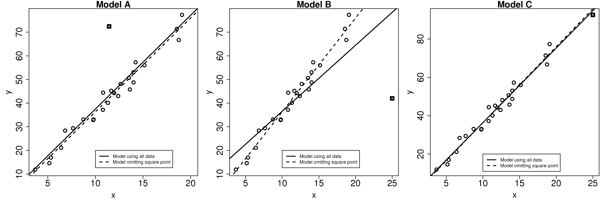
	
	
A discrepancy is a data point that is unusual *in the context of the least squares model*, as shown in the first figure here.  On its own, from the perspective of either |x| or |y| alone, the square point is not unusual.  But it is unusual in the context of the least squares model.  When that square point is removed, the updated least squares line (dashed line) is obtained.  This square point clearly has little influence on the model, even though it is discrepant.

The discrepant square point in model B has much more influence on the model.  Given that the objective function aims to minimize the sum of squares of the deviations, it is not surprising that the slope is pulled towards this discrepant point.  Removing that point gives a different estimate of the slope and intercept.

In model C the square point is not discrepant in the context of the model.  But it does have high leverage on the model: a small change in this point has the potential to be influential on the model.

Can we quantify how much *influence* these *discrepancies* have on the model; and what is *leverage*?   The following general formula is helpful in the rest of this discussion:

	.. math::
		\text{Leverage} \times \text{Discrepancy}  = \text{Influence on the model}
		
Leverage
~~~~~~~~~~~~~~

Leverage measures how much each observation contributes to the model's prediction of :math:`\hat{y}_i`.  It is also called the hat value, :math:`h_i`, and simply measures how far away the data point is from the center of the model, but it takes the model's correlation into account:

	.. math::
	
		h_i &= \dfrac{1}{n} + \dfrac{\left(x_i -\bar{x}\right)^2}{\sum_{j=1}^{n}{\left(x_j -\bar{x}\right)^2}} \qquad \text{and}\qquad \bar{h} = \dfrac{k}{n}  \qquad \text{and}\qquad \dfrac{1}{n} \leq h_i \leq 1.0

The average hat value can be calculated theoretically.  While it is common to plot lines at 2 and 3 times the average hat value, always plot your data and judge for yourself what a large leverage means.  Also notice that smallest hat value is always positive and greater or equal to :math:`1/n`, while the largest hat value possible is 1.0.  The hat values for models B and C are the same, and are shown below.  The last point has very high leverage.

	.. figure:: images/hatvalue-of-outliers.png
		:width: 750px
		:scale: 100
		:align: center
		
	
Discrepancy
~~~~~~~~~~~~~~

Discrepancy can be measured by the residual distance.  However the residual is not a complete measure of discrepancy.  We can imagine cases where the point has such high leverage that it drags the enter model towards it, leaving it only with a small residual.  One way then to isolate these points is to divide the residual by :math:`1-\text{leverage} = 1 - h_i`.  So we introduce a new way to quantify the residuals here, called *studentized residuals*:

	.. math:: 
	
		e_i^* = \dfrac{e_i}{S_{E(-i)}\sqrt{1-h_i}}
	
Where :math:`e_i` is the residual for the :math:`i^\text{th}` point, as usual, but :math:`S_{E(-i)}` is the standard error of the model when deleting the :math:`i^\text{th}` point and refitting the model. This studentized residual accounts for the fact that high leverage observations pull the model towards themselves.  In practice the model is not recalculated by omitting each point one at a time; use the ``rstudent( lm(y~x) )`` function in R to compute the studentized residuals from a given model.

	.. figure:: images/studentized-residuals.png
		:width: 750px
		:scale: 100
		:align: center

This figure illustrates how the square point in model A and B is highly discrepant, while in model C it does not have a high discrepancy.

Influence
~~~~~~~~~~~~~~

The influence of each data point can be quantified by seeing how much the model changes when we omit that data point.  The influence of a point is a combination its leverage and its discrepancy.  In model A, the square point had large discrepancy but low leverage, so its influence on the model parameters (slope and intercept) was small.  For model C, the square point had high leverage, but low discrepancy, so again the change in the slope and intercept of the model was small.  However model B had both large discrepancy and high leverage, so its influence is large.

One such measure is called *Cook's statistic*, usually called :math:`D_i`, and ofter referred to just as *Cook's D*.  Conceptually, it can be viewed as the change in the model coefficients when omitting an observation, however it is much more convenient to calculate it as follows:

	.. math::
		
		D_i = \dfrac{e_i^2}{k \times \frac{1}{n}\sum{e_i^2}} \times \dfrac{h_i}{1-h_i}

where :math:`\frac{1}{n}\sum{e_i^2}` is called the mean square error of the model (the average square error).  It is easy to see here now why influence is the product of discrepancy and leverage.

The values of :math:`D_i` are conveniently calculated in R using the ``cooks.distance(model)`` function.  The results for the 3 models are shown below.  Interestingly for model C there is a point with even higher influence than the square point.  Can you point out which other point gave rise to that large Cook's D?

	.. figure:: images/cooks-distance.png
		:width: 750px
		:scale: 100
		:align: center
		

		
.. THRESHOLD FOR COOK'S D.  BUBBLE PLOT.

.. _LS-multiple-X-MLR:

Topics not covered in this book
==========================================

.. note:: Enrichment

	These topics are not covered in depth in this book, but might be of interest to you.  I provide a small introduction to each topic, showing what their purpose is, together with some examples.  

Robust least squares models
~~~~~~~~~~~~~~~~~~~~~~~~~~~~~~~

Outliers are often the most interesting observations and are usually the points from which we learn the most about the system.  A manual step where we review the outliers and their influence should always done for any important model.  For example, inspection of the residual plots as described in the preceding sections.

However, the ability to build a linear model that is not heavily influenced by outliers might be of interest in certain cases. 

* The model is built automatically and is not reviewed by a human (e.g. as an intermediate step in a data-mining procedure).
* The human reviewer is not skilled to know which plots to inspect for influential and discrepant observations, or may not know how to interpret these plots.

Some criticism of robust methods are that there are too many different robust methods and that these routines are much more computationally expensive than ordinary least squares.  The first point is true, as this as a rapidly evolving field, however the latter objection is not of too much concern these days.  Robust methods are now available in most decent software packages.

If you would like to read up some more, a nice introduction targeted at engineering readers is given in PJ Rousseeuw's "Tutorial to Robust Statistics", *Journal of Chemometrics*, **5**, 1-20, 1991. `Link to the paper <http://dx.doi.org/10.1002/cem.1180050103>`_.

In R the various efforts of international researchers is being consolidated.  The ``robustbase`` package provides basic functionality that is now well established in the field; use that package if you want to assemble various robust tools yourself.  On the other hand, a more comprehensive package called ``robust`` is also available which provides robust tools that you should use if you are not too concerned with the details of implementation.  

For example:

.. code-block:: s

	> data <- read.csv('http://datasets.connectmv.com/file/distillation-tower.csv')
	
	# Using ordinary least squares
	# -----------------------------
	> summary(lm(data$VapourPressure ~ data$TempC2))
	
	Call:
	lm(formula = data$VapourPressure ~ data$TempC2)

	Residuals:
	     Min       1Q   Median       3Q      Max 
	-5.59621 -2.37597  0.06674  2.00212 14.18660 

	Coefficients:
	             Estimate Std. Error t value Pr(>|t|)    
	(Intercept) 195.96141    4.87669   40.18   <2e-16 ***
	data$TempC2  -0.33133    0.01013  -32.69   <2e-16 ***
	---
	Signif. codes:  0 '***' 0.001 '**' 0.01 '*' 0.05 '.' 0.1 ' ' 1 

	Residual standard error: 2.989 on 251 degrees of freedom
	Multiple R-squared: 0.8098,	Adjusted R-squared: 0.8091 
	F-statistic:  1069 on 1 and 251 DF,  p-value: < 2.2e-16
	
	# Use robust least squares (with automatic selection of robust method)
	# --------------------------------------------------------------------
	> library(robust)
	> summary(lmRob(data$VapourPressure ~ data$TempC2))
	
	Call: lmRob(formula = data$VapourPressure ~ data$TempC2)

	Residuals:
	       Min         1Q     Median         3Q        Max 
	-5.2631296 -1.9805384  0.1677174  2.1565730 15.8846460 

	Coefficients:
	            Value        Std. Error   t value      Pr(>|t|)    
	(Intercept) 179.48579886   4.92870640  36.41641120   0.00000000
	data$TempC2  -0.29776778   0.01021412 -29.15256677   0.00000000

	Residual standard error: 2.791 on 251 degrees of freedom
	Multiple R-Squared: 0.636099 

	Test for Bias:
	            statistic     p-value
	M-estimate   7.962583 0.018661525
	LS-estimate 12.336592 0.002094802
	
	
.. - Least angle least squares (regression) 
.. see the Efron paper mentioned above
.. also note the rlm() function in MASS

Logistic modelling (regression)
~~~~~~~~~~~~~~~~~~~~~~~~~~~~~~~~~

There are many practical cases in engineering modelling where our |y|-variable is a discrete entity.  The most common case is pass or failure, naturally coded as |y| = 0 for failure, and |y| = 1 is coded as success.  Some examples:

	*	Predict whether our product specifications are achieved (|y| = 0 or 1) given the batch reaction's temperature as :math:`x_1`, the reaction duration :math:`x_2` and the reactor vessel, where :math:`x_3=0` for reactor A and :math:`x_3=1` for reactor B.
	*	Predict the likelihood of making a sale in your store (|y| = 0 or 1), given the customer's age :math:`x_1`, whether they are a new or existing customers, :math:`x_2` is either 0 or 1, and the day of the week as :math:`x_3`.
	*	Predict if the final product will be |y| = acceptable, medium, or unsellable based on the raw material's properties :math:`x_1, x_2, x_3` and the ambient temperature :math:`x_4`.

We could naively assume that we just code our |y| variable as 0 or 1 (pass/fail) and build our least squares model as usual, using the |x| variables.  While a seemingly plausible approach, the problems are that:

	-	The predictions when using the model are not dichotomous (0 or 1), which is not too much of a problem if we interpret our prediction more as a probability.  That is, our prediction is the probability of success or failure, according to how we coded it originally.  However the predictions often lie outside the range :math:`[0, 1]`.   We can attempt to compensate for this by clamping the output to zero or one, but this non-linearity causes instability in estimation algorithms.
	-	The errors are not normally distributed.
	-	The variance of the errors are not constant and the assumption of linearity breaks down.

A logistic model however accounts for the nature of the y-variable by creating a function, called a logistic function, which is bounded between 0 and 1.  In fact you are already familiar with such a function: the cumulative probability of the normal distribution does exactly this.

	.. figure:: images/logistic-regression-function.png
		:scale: 50
		:width: 500px
		:align: center

Once the data are appropriately transformed, then the model can be calculated.  In R one uses the ``glm(y ~ x1 + x2, family=binomial)`` function to build a model where ``y`` must be a factor variable: type ``help(factor)`` to learn more.  The model output is interpreted as any other.

Testing of least-squares models
~~~~~~~~~~~~~~~~~~~~~~~~~~~~~~~~~~~~~~~~~~~~~~~~~~~~~~~~~~~~~

Before launching into this concept, first step back and understand why we are building least squares models.  One objective is to learn more about our systems: (a) what is the effect of one variable on another, or (b) is it significant (examine the confidence interval).  Another objective is purely predictive: build a model so that we can use it to make predictions.  For this last case we must test our model's capability for accurate predictions.

The gold standard is always to have a testing data set available to quantify how good (adequate) your least squares model is.  It is important that (a) the test set has no influence on the calculation of the model parameters, and (b) is representative of how the model will be used in the future.  We will illustrate this with 2 examples: you need to build a predictive model for product viscosity from 3 variables on your process.  You have data available, once per day, for 2006 and 2007 (730 observations).

	*	Use observation 1, 3, 5, 7, ... 729 to build the least squares model; then use observation 2, 4, 6, 8, ... 730 to test the model.
	*	Use observations 1 to 365 (data from 2006) to build the model, and then use observations 366 to 730 (data from 2007) to test the model.
	
In both cases, the testing data has no influence on the model parameters.  However the first case is not representative of how the model will be used in the future.  The results from the first case are likely to give over-optimistic results, while the second case represents the intended use of the model more closely, and will have more honest results.  Find out sooner, rather than later, that the model's long-term performance is not what you expect.  It may be that you have to keep rebuilding the model every 3 months, updating the model with the most recent data, in order to maintain it's predictive performance.

How do we quantify this predictive performance?  A common way is to calculate the root mean square of the prediction error (RMSEP), this is exactly like the :ref:`standard error <standard-error-section>` that we saw earlier for regression models.  Assuming the errors are centered at zero and follow a normal distribution, this can be interpreted to be the standard deviation of the prediction residuals.  It is important the RMSEP be calculated only from new, unseen testing data.  By contrast, you might see the term RMSEE (root mean square error of estimation), which is the RMSEP, but calculated from the training (model-building) data.  The RMSEE :math:`\approx S_E` = standard error; the small difference being due to the denominator used.

.. math::

	\text{RMSEP} = \sqrt{\dfrac{1}{n}\sum_{i}^{n}{\left(y_{\text{new}, i} - \hat{y}_{\text{new}, i}\right)^2}} \\
	

The units of RMSEP and RMSEE are the same as the units of the |y|-variable.

In the :ref:`latent variable modelling <SECTION-latent-variable-modelling>` section of the book we will introduce the concept of cross-validation to test a model.  Cross-validation uses the model training data to simulate the testing process.  So it is not as desirable as having a fresh testing data set, but it works well in many cases.  Cross-validation can be equally well applied to least squares models. We will revisit this topic later.

.. TODO: cf the book by Esbensen for other methods

Bootstrapping 
~~~~~~~~~~~~~~~~~~~~~~~~~~~~~~~~~~~~~~~~~~~~~~~~~~~~~~~~~~~~~

Bootstrapping is an extremely useful tool when theoretical techniques to estimate confidence intervals and uncertainty are not available to us.

Let's give an example where bootstrapping is strictly not required, but is definitely useful.  When fitting a least squares model of the form :math:`y = \beta_0 + \beta_1 x` we are interested in the confidence interval of the slope coefficient, :math:`\beta_1`.  Recall this coefficient indicates by how much the |y|-variable changes on average when changing the |x| variable by one unit.  The slope coefficient might represent a rate constant, or be related to the magnitude of the feedback control loop gain: so it is important we understand the degree of uncertainty associated with it.

In the preceding section we derived this confidence interval for :math:`\beta_1` in equation :eq:`least-squares-CI`, repeated here:

	.. math::
	
		\begin{array}{rcccl} 
			- c_t                  &\leq& \dfrac{b_1 - \beta_1}{S_E(b_1)} &\leq &  +c_t\\
			  b_1 - c_t S_E(b_1)   &\leq& \beta_1                         &\leq&	b_1 + c_t S_E(b_1)
		\end{array}

Visualize this confidence in the context of the following example where |x| is the dose of radiation administered (rads) to rats, and |y| is the survival percentage of a batch of rats.  The plot below shows the data and the least square slope coefficient (notice the |y| variable is ``log(survival)``). 

The thick line represents the slope coefficient (:math:`-0.0059`) using all the data.  Clearly the unusual point number 13 has some influence on that coefficient.  Eliminating it and refitting the model makes the slope coefficient more steep (:math:`-0.0078`), which could change our interpretation of the model. This raises the question though: what happens to the slope coefficient when we eliminate other points in the training data?  How sensitive are our model parameters to the data themselves?

	.. figure:: images/bootstrap-example.png
		:align: center
		:width: 750px
		:scale: 90

Bootstrapping gives us an indication of that, as shown in the other plot.  The original data set had 14 observations.  What bootstrapping does is to randomly select 14 rows from the original data, allowing for duplicate selection. These selected rows are used to build a least squares model, and the slope coefficient is recorded.  Then another 14 random rows are selected and this process is repeated ``R`` times (in this case ``R=1000``).  On some of these occasions the outlier points will be included, and other times they will be excluded.  A histogram of the 1000 computed slope coefficients is shown here.  This histograms gives as an additional indication of the uncertainty of the slope coefficient.  For completeness the confidence interval at the 95% level for :math:`\beta_1` is calculated here, and also superimposed on the histogram.

.. math::

	\begin{array}{rcccl} 
		- c_t                  					&\leq& \dfrac{b_1 - \beta_1}{S_E(b_1)} &\leq &  +c_t\\
		  -0.005915 - 2.1788 \times 0.001047  	&\leq& \beta_1   &\leq&	-0.005915 + 2.1788 \times 0.001047 \\
		  -0.0082 								&\leq& \beta_1   &\leq& -0.0036
	\end{array}

The above example was inspired from an example in `ASA Statistics Computing and Graphics <http://stat-computing.org/newsletter/>`_, **13** (1), 2002.

.. Give R example source code for bootstrapping.

.. Ridge least squares (regression)
   ~~~~~~~~~~~~~~~~~~~~~~~~~~~~~~~~~

.. Variable selection and stepwise regression
	~~~~~~~~~~~~~~~~~~~~~~~~~~~~~~~~~~~~~~~~~~~~

	The variable selection problem is ...

	We will start off by saying that variable selection is a topic that is widely and actively researched. 

Exercises
=========

.. index::
	pair: exercises; Least squares models

.. question::

	Use the `distillation column data set <http://datasets.connectmv.com/info/distillation-tower>`_ and choose any two variables, one for |x| and one as |y|.  Then fit the following models by least squares in any software package you prefer:

		-	:math:`y_i = b_0 + b_1 x_i`
		-	:math:`y_i = b_0 + b_1 (x_i - \bar{x})` (what does the :math:`b_0` coefficient represent in this case?)
		-	:math:`(y_i - \bar{y}) = b_0 + b_1 (x_i - \bar{x})`
	
		Prove to yourself that centering the |x| and |y| variables gives the same model for the 3 cases in terms of the :math:`b_1` slope coefficient, standard errors and other model outputs.

.. answer::

	Once you have created an ``x`` and ``y`` variable in R, compare the output from these 3 models:
	
	.. code-block:: s
	
		# Model 1
		summary(lm(y ~ x))
		
		# Model 2
		x.mc <- x - mean(x)
		summary(lm(y ~ x.mc))
		
		# Model 3
		y.mc <- y - mean(y)
		summary(lm(y.mc ~ x.mc))		
		
.. question::

	For a :math:`x_{\text{new}}` value and the linear model :math:`y = b_0 + b_1 x` the prediction interval for :math:`\hat{y}_\text{new}` is:

		.. math::
			\hat{y}_i \pm c_t \sqrt{V\{\hat{y}_i\}}
		
		where :math:`c_t` is the critical t-value, for example at the 95% confidence level.
	
	Use the `distillation column data set <http://datasets.connectmv.com/info/distillation-tower>`_ and with |y| as ``VapourPressure`` (units are kPa) and |x| as ``TempC2`` (units of degrees Farenheit) fit a linear model.  Calculate the prediction interval for vapour pressure at these 3 temperatures: 430, 480, 520 °F.
	
.. answer::

	The prediction interval is dependent on the value of :math:`x_\text{new, i}` used to make the prediction.  For this model, :math:`S_E = 2.989` kPa, :math:`n=253`,  :math:`\sum_j{(x_j - \bar{x})^2} = 86999.6`, and :math:`\bar{x} = 480.82`.
	
	.. math::
	
		\mathcal{V}\left(\hat{y}_\text{new,i}\right) = S_E^2 \left(1 + \dfrac{1}{n} + \dfrac{\left(x_\text{new}-\bar{x}\right)^2}{ \sum_j{(x_j - \bar{x})^2}} \right)
	
	Calculating this term manually, or using the ``predict(model, newdata=..., int="p")`` function in R gives the 95% prediction interval:
	
		*	:math:`x_\text{new} = 430` °F: :math:`\hat{y}_\text{new} = 53.49 \pm 11.97`, or [47.50, 59.47]
		*   :math:`x_\text{new} = 480` °F: :math:`\hat{y}_\text{new} = 36.92 \pm 11.80`, or [31.02, 42.82]
		*	:math:`x_\text{new} = 520` °F: :math:`\hat{y}_\text{new} = 23.67 \pm 11.90`, or [17.72, 29.62]
		
	.. figure:: images/distillation-prediction-interval.png
		:align: center
		:width: 750px
		:scale: 50
		
	.. literalinclude:: code/distillation-column-questions.R
		:language: s
		:lines: 1-25,30-33
	
.. question::

	 Refit the distillation model from the previous question with a transformed temperature variable.  Use :math:`1/T` instead of the actual temperature.

		-	Does the model fit improve?
		-	Are the residuals more normally distributed with the untransformed or transformed temperature variable?
		-	How do you interpret the slope coefficient for the transformed temperature variable?
		-	Use the model to compute the predicted vapour pressure at a temperature of 480 °F, and also calculate the corresponding prediction interval at that new temperature.

.. answer::

	-	Using the ``model.inv <- lm(VapourPressure ~ I(1/TempC2))`` instruction, one obtains the model summary below.  The model fit has improved slightly: the standard error is 2.88 kPa, reduced from 2.99 kPa.

		.. code-block:: text
		
			Call:
			lm(formula = VapourPressure ~ I(1/TempC2))

			Residuals:
			     Min       1Q   Median       3Q      Max 
			-5.35815 -2.27855 -0.08518  1.95057 13.38436 

			Coefficients:
			             Estimate Std. Error t value Pr(>|t|)    
			(Intercept)  -120.760      4.604  -26.23   <2e-16 ***
			I(1/TempC2) 75571.306   2208.631   34.22   <2e-16 ***
			---
			Signif. codes:  0 ‘***’ 0.001 ‘**’ 0.01 ‘*’ 0.05 ‘.’ 0.1 ‘ ’ 1 

			Residual standard error: 2.88 on 251 degrees of freedom
			Multiple R-squared: 0.8235,	Adjusted R-squared: 0.8228 
			F-statistic:  1171 on 1 and 251 DF,  p-value: < 2.2e-16
			
	-	The residuals have roughly the same distribution as before, maybe a little more normal on the left tail, but hardly noticeable.
	
		.. figure:: images/distillation-prediction-qqplots.png
			:align: center
			:width: 750px
			:scale: 80
			
	-	The slope coefficient of 75571 has units of ``kPa.°F``, indicating that each one unit *decrease* in temperature results in an *increase* in vapour pressure.  Since division is not additive, the change in vapour pressure when decreasing 10 degrees from 430 °F is a different decrease to that when temperature is 530 °F.  The interpretation of transformed variables in linear models is often a lot harder.  The easiest interpretation is to show a plot of 1/T against vapour pressure.
	
		.. figure:: images/distillation-prediction-inverted-temperature.png
			:align: center
			:width: 750px
			:scale: 40
		
	-	The predicted vapour pressure at 480 °F is 36.68 kPa :math:`\pm 11.37`, or within the range [31.0 to 42.4] with 95% confidence, very similar to the prediction interval from question 2.
		
	Code added from question 2 to complete this question:
	
	.. literalinclude:: code/distillation-column-questions.R
		:language: s
		:lines: 36-39,43-45,48-56,60-63
		

.. question::

	Again, for the distillation model, use the data from 2000 and 2001 to build the model (the first column in the data set contains the dates). Then use the remaining data to test the model.  Use |x| = ``TempC2`` and |y| = ``VapourPressure`` in your model.

		-	Calculate the RMSEP for the testing data.  How does it compare to the standard error from the model?
		-	Now use the ``influencePlot(...)`` function from the ``car`` library, to highlight the influential observations in the model building data (2000 and 2001).  Show your plot with observation labels (observation numbers are OK).  See part 5 of the `R tutorial <http://connectmv.com/tutorials/r-tutorial>`_ for some help.
		-	Explain how the points you selected are influential on the model?
		-	Remove these influential points, and refit the model on the training data.  How has the model's slope and standard error changed?
		-	Recalculate the RMSEP for the testing data; how has it changed?

.. answer::

	-	The testing data starts at index 160.  The code at the end of this question shows how RMSEP was calculated as 4.18 kPa, as compared to the standard error from the model building data (observations 1 to 159) of 2.679 kPa.  This indicates the predictions on totally new data have greater error that those observations used to build the model - an expected result.
	
	-	The influence plot from the model building data is given below.
	
		.. figure:: images/distillation-influence-plot.png
			:align: center
			:width: 750px
			:scale: 45
			
	-	The points considered as influential would be 38 and 84, which have both high leverage and high discrepancy.  Points 53 and 101 would also be considered influential: they have high leverage, though moderately sized residuals.  The other points marked in red have a large Cook's D value, however, their leverage is low, so it is unlikely that their removal will change the plot and its interpretation by very much.
	
	-	The points selected for removal are [38, 53, 84, 101].  The model was rebuilt and the slope coefficient changed from -0.368 to -0.358, while the standard error decreased from 2.679 to 2.455.  So their removal has decreased the size of the confidence intervals (before: :math:`-0.395 \leq \beta_T \leq - 0.342`, and after: :math:`-0.385 \leq \beta_T \leq -0.332`), however the slope coefficient is roughly comparable to that from before.  

	-	The RMSEP has reduced from 4.18kPa to 3.92 kPa, a smallish reduction, given the range of the |y| variable.  
	
	.. literalinclude:: code/distillation-column-questions.R
		:language: s
		:lines: 1-3,8,66-89,93-94,96-108
	
.. question::

	The `Kappa number data set <http://datasets.connectmv.com/info/kappa_number>`_ was used in an :ref:`earlier question <monitoring-kappa-number-question>` to construct a Shewhart chart.  The :ref:`"Mistakes to avoid" <monitoring-mistakes-to-avoid>` section (Process Monitoring), warns that the subgroups for a Shewhart chart must be independent to satisfy the assumptions used to derived the Shewhart limits. If the subgroups are not independent, then it will increase the type I (false alarm) rate.

	This is no different to the independence required for least squares models. Use the autocorrelation tool to determine a subgroup size for the Kappa variable that will satisfy the Shewhart chart assumptions.  Show your autocorrelation plot and interpret it as well.
	
.. answer::

	The autocorrelation plot shows significant lags up to lag 3, or even 4.  So subsampling the vector with every 4th or 5th element should yield independent samples.  The autocorrelation with every 5th observation confirms this.  You could also use every 6th, 7th, *etc* observation.  Using every 30th observation though is not too useful, since it would lead to a long delay before the control chart showed any problems.

	.. figure:: images/kappa-number-autocorrelation.png
		:align: center
		:width: 750px
		:scale: 50

	The ACF plot indicates that there is significant reappearance of correlation around lags 9 to 15.  It wasn't required for you to identify why for this assignment, but usually this would be related to a recycle stream that reenters a reactor, or due to an oscillation in a control loop.
	
	You can also verify the autocorrelation by plotting scatterplots of the vector against itself.  The first plot below shows what an ACF coefficient of 1.0 means, while the second plot shows what it means to use a lag offset of 1 position.  The correlation value = :math:`\sqrt{R^2}` is shown on each plot.  Compare that value shown to the y-axis of the ACF plots.
	
	.. figure:: images/kappa-number-autocorrelation-scatterplots.png
		:align: center
		:width: 900px
		:scale: 100
		
	.. literalinclude:: code/kappa-number-autocorrelation.R
	       :language: s
	       :lines: 1-9,13-15,21-37
		
.. question::

	You presume the yield from your lab-scale bioreactor, :math:`y`, is a function of reactor temperature, batch duration, impeller speed and reactor type (one with with baffles and one without).  You have collected these data from various experiments.
	
	.. tabularcolumns:: |C|p{5em}|C|C|C|

	.. csv-table:: 
	   :header: Temp = :math:`T` [°C], Duration = :math:`d` [minutes], Speed = :math:`s` [RPM], Baffles = :math:`b` [Yes/No], Yield = :math:`y` [g]
	   :widths: 30, 30, 30, 30, 30

			82,      260,  4300,       No,      51
			90,      260,  3700,       Yes,     30
			88,      260,  4200,       Yes,     40
			86,      260,  3300,       Yes,     28
			80,      260,  4300,       No,      49
			78,      260,  4300,       Yes,     49
			82,      260,  3900,       Yes,     44
			83,      260,  4300,       No,      59
			64,      260,  4300,       No,      60
			73,      260,  4400,       No,      59
			60,      260,  4400,       No,      57
			60,      260,  4400,       No,      62
			101,     260,  4400,       No,      42
			92,      260,  4900,       Yes,     38

	-	Use software to fit a linear model that predicts the yield from these variables (the `data set is available from the website <http://datasets.connectmv.com/info/bioreactor_yields>`_).  See the `R tutorial <http://connectmv.com/tutorials/r-tutorial>`_ for building linear models with integer variables in R.
	-	Interpret the meaning of each effect in the model.  If you are using R, then the ``confint(...)`` function will be helpful as well. Show plots of each |x| variable in the model against yield.  Use a box plot for the baffles indicator variable.
	-	Now calculate the :math:`\mathbf{X}^T\mathbf{X}` and :math:`\mathbf{X}^T\mathbf{y}` matrices; include a column in the :math:`\mathbf{X}` matrix for the intercept. Since you haven't mean centered the data to create these matrices, it would be misleading to try interpret them.
	-	Calculate the least squares model estimates from these two matrices.  See the `R tutorial <http://connectmv.com/tutorials/r-tutorial>`_ for doing matrix operations in R, but you might prefer to use MATLAB for this step.  Either way, you should get the same answer here as in the first part of this question.

.. answer::

	-	After importing the data, just make sure the ``baffles`` variable is imported as a factor.  Then build the model as usual.  The computer output below shows the linear model's coefficients.
	
		.. literalinclude:: code/bioreactor-yields-problem.R
			:language: s
			:lines: 17-45
			
	-	The confidence intervals for each variable is significant at the 95% level.  The duration variable must be omitted from the model, because it has no variation.  While it might affect the yield, there is no variability in this data set to assess that.  
	
		* :math:`0.00034 \leq b_\text{speed} \leq 0.017`: a 100rpm increase in impeller speed serves to increase yield by 0.87g on average, keeping all other variables constant
		* :math:`-15.9 \leq b_\text{baffles} \leq -2.30`: the use of baffles decreases yield, on average, by 9.1g, keeping all other variables constant
		* :math:`-0.74 \leq b_\text{temp} \leq -0.21`: each one degree increase in temperature lowers yield by 0.47g on average, keeping all other variables constant
		* We cannot say anything about the effect of batch duration
		
		The plots are not shown here, they can be drawn with ``plot(bio)`` to obtain a scatterplot matrix of plots.
		
	-	For the model :math:`y = b_0  + b_\text{speed}x_\text{speed} + b_\text{baffles}x_\text{baffles} + b_\text{temp}x_\text{temp}` let the coefficient vector be :math:`\mathrm{b} = [b_0, b_\text{speed},  b_\text{baffles}, b_\text{temp}]`, then we can write down the following X matrix to estimate it:
	
		.. math::
			\mathrm{X} = \begin{bmatrix}
							1 &  4300 & 0 & 82  \\
							1 &  3700 & 1 & 90  \\
							1 &  4200 & 1 & 88  \\
							1 &  3300 & 1 & 86  \\
							1 &  4300 & 0 & 80  \\
							1 &  4300 & 1 & 78  \\
							1 &  3900 & 1 & 82  \\
							1 &  4300 & 0 & 83  \\
							1 &  4300 & 0 & 64  \\
							1 &  4400 & 0 & 73  \\
							1 &  4400 & 0 & 60  \\
							1 &  4400 & 0 & 60  \\
							1 &  4400 & 0 & 101 \\
							1 &  4900 & 1 & 92  
						\end{bmatrix}
						
		You can obtain the above :math:`\mathrm{X}` matrix in R using the ``model.matrix(model)`` function.  The :math:`\mathrm{X}^T\mathrm{X}` and :math:`\mathrm{X}^T\mathrm{y}` matrices are:
		
		.. math::
			\mathrm{X}^T\mathrm{X} = \begin{bmatrix}
							14      &   59100      &    6  &  1119 \\
							59100   & 251330000    & 24300 & 4714700 \\
							6       & 24300        & 6     & 516     \\
							1119    & 4714700      & 516   & 91351 
						\end{bmatrix}  
			\qquad \text{and} \qquad 
			\mathrm{X}^T\mathrm{y} = \begin{bmatrix}
							668 \\
							2849600 \\
							229 \\
							52082
						\end{bmatrix}
						
	-	Using these matrices to solve for :math:`\mathrm{b}`
	
	 	.. math::
			\mathrm{b} = \left(\mathrm{X}^T\mathrm{X} \right)^{-1}\mathrm{X}^T\mathrm{y} =  \begin{bmatrix} 52.48 \\ 0.00871 \\ -9.09 \\ -0.471 \end{bmatrix}
			
		
		This result matches the results from R.  Note however that R, like most decent software packages, will not solve for the inverse of :math:`\left(\mathrm{X}^T\mathrm{X} \right)^{-1}` directly to compute :math:`\mathrm{b}`; instead it uses the `QR decomposition <http://en.wikipedia.org/wiki/QR_decomposition>`_.
		
		.. literalinclude:: code/bioreactor-yields-problem.R
			:language: s
			:lines: 46- 	
			
.. question::

	In the section on comparing differences between two groups we used, without proof, the fact that: 

	.. math::

		\mathcal{V}\left\{\bar{x}_B - \bar{x}_A\right\} = \mathcal{V}\left\{\bar{x}_B\right\} + \mathcal{V}\left\{\bar{x}_A\right\}

	Prove this statement, and clearly explain all steps in your proof.
	
.. answer::

	I don't normally concentrate on proofs in the book, unless they show something interesting, or are used over and over.  This short mathematical statement fits both criteria.

	The important point with this proof is that :math:`\bar{x}_A` and :math:`\bar{x}_B` are the variables, not :math:`x`.  These variables come from a normal distribution (Central limit theorem), as long as we assume independent sampling: :math:`\bar{x}_A \sim \mathcal{N} \left(\mu; \sigma^2/n_A\right)`, and similarly for :math:`\bar{x}_B`.

	.. math::

		\mathcal{V}\left\{\bar{x}_B - \bar{x}_A\right\}	&= \mathcal{V}\left\{\bar{x}_B + \left(-\bar{x}_A\right) \right\} \\
														&= \mathcal{V}\left\{\bar{x}_B \right\} + 2\text{Cov}\left\{\bar{x}_B, \left(-\bar{x}_A\right)\right\} + \mathcal{V}\left\{-\bar{x}_A \right\} \\
														&= \mathcal{V}\left\{\bar{x}_B \right\} + 0 + \left(-1\right)^2\mathcal{V}\left\{\bar{x}_A \right\} \\
														&= \mathcal{V}\left\{\bar{x}_B\right\} + \mathcal{V}\left\{\bar{x}_A\right\}

	The second line is a result shown earlier. The third line requires that we assume the between-group means :math:`\bar{x}_B` and :math:`\bar{x}_A` are independent, and so they are uncorrelated (their covariance is zero).  This was one of the key assumptions when we studied between-group differences; and is one assumption that is often true in many real cases.
	
.. question::

	The production of low density polyethylene is carried out in long, thin pipes at high temperature and pressure (1.5 kilometres long, 50mm in diameter, 500 K, 2500 atmospheres).  One quality measurement of the LDPE is its melt index.  Laboratory measurements of the melt index can take between 2 to 4 hours.  Being able to predict this melt index, in real time, allows for faster adjustment to process upsets, reducing the product's variability.  There are many variables that are predictive of the melt index, but in this example we only use a temperature measurement that is measured along the reactor's length.

	These are the data of temperature (K) and melt index (units of melt index are "grams per 10 minutes").

	.. Previous table
		======================= ======================                           
		Temperature = :math:`T` Melt index = :math:`m`                          
		----------------------- ----------------------                      
		(Kelvin)       			(g per 10 mins)                             
		======================= ======================                      
		     441       			  9.3                                       
		     453       			  6.6                                       
		     461       			  6.6                                       
		     470       			  7.0                                       
		     478       			  6.1                                       
		     481       			  3.5                                       
		     483       			  2.2                                       
		     485       			  3.6                                       
		     499       			  2.9                                       
		     500       			  3.6                                       
		     506       			  4.2                                       
		     516       			  3.5                                       
		======================= ======================

	=============================================  === === === === === === === === === === === === 
	**Temperature** = :math:`T` [Kelvin]           441 453 461 470 478 481 483 485 499 500 506 516 
	---------------------------------------------  --- --- --- --- --- --- --- --- --- --- --- --- 
	**Melt index** = :math:`m`  [g per 10 mins]    9.3 6.6 6.6 7.0 6.1 3.5 2.2 3.6 2.9 3.6 4.2 3.5 
	=============================================  === === === === === === === === === === === === 

	The following calculations have already been performed:

		* Number of samples, :math:`n = 12`
		* Average temperature = :math:`\bar{T} = 481` K
		* Average melt index, :math:`\bar{m} = 4.925` g per 10 minutes.
		* The summed product, :math:`\sum_i{\left(T_i-\bar{T}\right)\left(m_i - \bar{m}\right)} = -422.1`
		* The sum of squares, :math:`\sum_i{\left(T_i-\bar{T}\right)^2} = 5469.0`

	#.	Use this information to build a predictive linear model for melt index from the reactor temperature.
	#.	What is the model's standard error and how do you interpret it in the context of this model?  You might find the following software software output helpful, but it is not required to answer the question.

		.. code-block:: text

			Call:
			lm(formula = Melt.Index ~ Temperature)

			Residuals:
			    Min      1Q  Median      3Q     Max 
			-2.5771 -0.7372  0.1300  1.2035  1.2811 

			Coefficients:
			            Estimate Std. Error t value Pr(>|t|)    
			(Intercept) --------    8.60936   4.885 0.000637
			Temperature --------    0.01788  -4.317 0.001519

			Residual standard error: 1.322 on 10 degrees of freedom
			Multiple R-squared: 0.6508,	Adjusted R-squared: 0.6159 
			F-statistic: 18.64 on 1 and 10 DF,  p-value: 0.001519

	#.	Quote a confidence interval for the slope coefficient in the model and describe what it means.  Again, you may use the above software output to help answer your question.
	
.. answer::

	#.	The simplest linear predictive model possible is :math:`m = \beta_0 + \beta_1 T + \varepsilon`, predicting the melt index from temperature.  Once we find estimates for these coefficients we write: :math:`m = b_0 + b_1 T + e`.  And one way to calculate these coefficients is by least squares.  In the class notes we showed that for a variable :math:`x` used to predict a variable :math:`y` that:

	.. math::

		b_0 &= \bar{\mathrm{y}} - b_1\bar{\mathrm{x}} \\
		b_1 &= \dfrac{ \sum_i{\left(x_i - \bar{\mathrm{x}}\right)\left(y_i - \bar{\mathrm{y}}\right) } }{ \sum_i{\left( x_i - \bar{\mathrm{x}}\right)^2} }

	Using the pre-calculated values, and that in our case :math:`T = x`, and that :math:`m = y`

	.. math::

		b_1 &= \dfrac{ -422.1 }{ 5469.0 } = - 0.0772 \frac{\text{g per 10 minutes}}{K}\\ 
		b_0 &= 4.925 + 0.0772 \times 481 = 42.0 \text{g per 10 minutes}

	A predictive model of melt flow is: :math:`\hat{m} = 42.0 - 0.0772 \times T`

	#.	The standard error, :math:`S_E` can be read directly from the software output as 1.322 g per 10 minutes.  If you like, you could also have calculated it by hand, using the above predictive model, calculating residuals (:math:`e_i = m_i - \hat{m}_i`), from which the standard error is :math:`\sqrt{\dfrac{\sum_i^n{e_i^2}}{n-k}}`, where :math:`n=12` and :math:`k=2` (there are 2 parameters in the model).  However I recommend you always use the software output and avoid these tedious hand calculations.

	The interpretation of the standard error for this model is that the approximate prediction error of melt index has a standard deviation of 1.322 grams per 10 minutes (if the residuals are normally distributed).

	#.	The slope coefficient estimate, :math:`b_1` has standard error of 0.01788 (from the software output), or it could be calculated as :math:`S_E^2(b_1) = \dfrac{S_E^2}{\sum_j{\left( T_j - \bar{T} \right)^2}} = \dfrac{1.322^2}{5469.0} = 0.01788^2 = 3.19 \times 10^{-4}`.

	From this we can construct the confidence interval for the actual slope coefficient, :math:`\beta_1`.  I have used the 95% confidence level, but you could use any level you prefer.  The degrees of freedom to use for the :math:`t`-distribution are :math:`n-k = 12 -2 = 10`.

	.. math::

		\begin{array}{rcccl} 
			- c_t                			&\leq& \dfrac{b_1 - \beta_1}{S_E(b_1)} &\leq &  +c_t\\
			b_1 - c_t S_E(b_1)   			&\leq& \beta_1                         &\leq&	b_1 + c_t S_E(b_1) \\
			-0.0772 - 2.23 \times 0.01788	&\leq& \beta_1                         &\leq&	-0.0772 + 2.23 \times 0.01788 \\
			-0.117							&\leq& \beta_1                         &\leq&	-0.037
		\end{array}

	You may also have chosen to answer at the 99% confidence level:

	.. math::

		\begin{array}{rcccl} 
			b_1 - c_t S_E(b_1)   			&\leq& \beta_1                         &\leq&	b_1 + c_t S_E(b_1) \\
			-0.0772 - 3.17 \times 0.01788	&\leq& \beta_1                         &\leq&	-0.0772 + 3.17 \times 0.01788 \\
			-0.134							&\leq& \beta_1                         &\leq&	-0.0205
		\end{array}

	This shows, at which ever confidence level (95% or 99%), the range within which we can expect to find the true slope coefficient.  This slope represents the magnitude by which the melt index changes, on average, for a one degree change in temperature.  If we plan to manipulate the melt index using temperature, then this range will help us estimate an upper and lower bound for the effort required to adjust the melt index.

.. question::

	For a distillation column, it is well known that the column temperature directly influences the purity of the product, and this is used in fact for feedback control, to achieve the desired product purity.  Use the `distillation data set <http://datasets.connectmv.com/info/distillation-tower>`_ , and build a least squares model that predicts ``VapourPressure`` from the temperature measurement, ``TempC2``.  Report the following values:

	#.	the slope coefficient, and describe what it means in terms of your objective to control the process with a feedback loop
	#.	the interquartile range and median of the model's residuals
	#.	the model's standard error
	#.	a confidence interval for the slope coefficient, and its interpretation.

	You may use any computer package to build the model and read these values off the computer output.  

.. answer::

	The solution to this question can be almost entirely solved using R, though any other language could be used.  These commands, with the output that follows, were used:

		.. code-block:: text

			> distillation <- read.csv('http://datasets.connectmv.com/file/distillation-tower.csv')
			> model <- lm(distillation$VapourPressure ~ distillation$TempC2)
			> summary(model)

			Call:
			lm(formula = distillation$VapourPressure ~ distillation$TempC2)

			Residuals:
			     Min       1Q   Median       3Q      Max 
			-5.59621 -2.37597  0.06674  2.00212 14.18660 

			Coefficients:
			                     Estimate Std. Error t value Pr(>|t|)    
			(Intercept)         195.96141    4.87669   40.18   <2e-16 ***
			distillation$TempC2  -0.33133    0.01013  -32.69   <2e-16 ***
			---
			Signif. codes:  0 '***' 0.001 '**' 0.01 '*' 0.05 '.' 0.1 ' ' 1 

			Residual standard error: 2.989 on 251 degrees of freedom
			Multiple R-squared: 0.8098,	Adjusted R-squared: 0.8091 
			F-statistic:  1069 on 1 and 251 DF,  p-value: < 2.2e-16

	#.	This predictive model allows us to achieve better control of the vapour pressure, because we can predict it from temperature (measured in real-time), rather than wait several hours for the laboratory vapour pressure value. The slope coefficient is -0.331, and since no units were given, I can't expect any in your solution; however one should report the units, which is this case would be units of pressure divided by units temperature (e.g. psi/K).  What this means, in terms of feedback control of the vapour pressure is that we must decrease the temperature to raise the vapour pressure.  This is important when tuning the feedback control loop in 2 ways: (a) firstly, the the sign of the gain in the feedback controller (i.e. negative gain) must be the same as the process gain to achieve a stable feedback loop, (b) the magnitude of the slope provides an estimate of how sensitive the vapour pressure is to temperature.  For example: do we have to add a large amount of energy into the distillation column to achieve a smallish reduction in vapour pressure?  The answer of course depends heavily on the units, which I omitted to provide.

	#.	These are reported in the above software output: (a) the residual IQR is 2.00 - (-2.38) = 4.38 units of vapour pressure, while (b) the median residual is close to zero, as expected.

	#.	The model's standard error is 2.989 in the output, or around 3.00 units of vapour pressure.

	#.	The slope coefficient's confidence interval can be calculated from its :math:`z`-value = :math:`\dfrac{b_1 - \beta_1}{S_E(b_1)}`; but we require the standard error of the slope coefficient, which is :math:`S_E(b_1) = 0.01013` from the software output.  The value for :math:`c_t = 1.969` from the :math:`t`-distribution at the 95% confidence level, with :math:`n-k = 253 - 2 = 251` degrees of freedom (a normal distribution would work equally well in this case).

		.. math::

			\begin{array}{rcccl} 
				- c_t                			&\leq& \dfrac{b_1 - \beta_1}{S_E(b_1)} &\leq &  +c_t\\
				-0.33133 - 1.969 \times 0.01013	&\leq& \beta_1                         &\leq&	-0.33133 + 1.969 \times 0.01013 \\
				-0.35							&\leq& \beta_1                         &\leq&	-0.31
			\end{array}

		This shows, at the 95% confidence level, the range within which we can expect to find the true slope coefficient. This range is remarkably narrow; i.e. our feedback controller gain is unlikely to change on either extreme.  So we can likely design our control loop at the center point, and be sure it will work over the entire range of expected operation.  Please also cross reference the solutions to question 2.4 in the written midterm to correctly understand what a confidence interval is.

		If you used 99% confidence levels, the answer should be: :math:`-0.358 \leq \beta_1 \leq -0.305`.

		I have illustrated the actual slope (thick, solid line) at the upper and lower bounds of the slope coefficient (thin, dashed lines) in the accompanying figure.  Not required for this question, but added nevertheless, are the prediction intervals for :math:`\hat{y}_i`, which we will discuss in the class on 22 February 2010.

		.. figure:: images/distillation-least-squares.png
			:align: center
			:width: 750px
			:scale: 90%

	For this question I recommended that you should be able to reproduce R's output yourself.  The code below calculates these same values. 

	.. literalinclude:: code/distillation-least-squares.R
	       :language: s
	       :lines: 1-67,70-82

	