.. Header notes
   -------------
	
	=====
	~~~~~
	^^^^^
	-----
	

.. MIT courseware: http://ocw.mit.edu/OcwWeb/Mechanical-Engineering/2-830JSpring-2008/VideoLectures/index.htm	
		
.. TODO list of plots
    Plot of Shewhart chart
        - just showing target + data
        - with UB and LB and data initial IC then OOC
        - with action and warning limits
	Real-time demo of monitoring lines (matplotlib animation?)
	Picture that shows (Inkscape): region of stable operation (common cause), vs region of assignable cause
	Boards thickness monitoring chart
	Show chart for Shewhart example in class
	Case study: total energy input
	
	Explain how to change Cpk if it is undesireable
	

In context
==========

In the first section we learned about :ref:`visualizing data <SECTION-data-visualization>`, then we moved on to reviewing :ref:`univariate statistics <SECTION-univariate-review>`.  This section combines those two areas, showing how to create a system that monitors any process, using graphical tools, to enable you to rapidly detect problems.  The next logical step after detection is to diagnose the problem, but we will cover diagnosis in the section on :ref:`latent variable models <SECTION-latent-variable-modelling>`.

This section is the last section where we deal with univariate data; after this section we start to use and deal with 2 or more variables.  

.. index::
	pair: usage examples; Process monitoring
	
Usage examples
==============

The material in this section is used whenever you need to rapidly detect problems.  It has tangible application in many areas - in fact, you have likely encountered these monitoring charts in areas such as a hospital (monitoring patients), stock market charts (intraday trading), or in a processing/manufacturing facility.

	- *Co-worker*: We need a tailored system to ensure the thickness of our boards is stable
	- *Yourself*: In addition to that, we need to rapidly detect if one of the saws has moved out of alignment and the boards have become too thick, or too thin.
	- *Manager*: the hourly average profit, and process throughput is important to the head-office; can we create a system for them to track that?
	- *Potential customer*: what is your process capability - we are looking for a new supplier that can provide low variability raw material for us with |Cpk| of at least 1.6, preferably higher.
	
What we will cover
==================

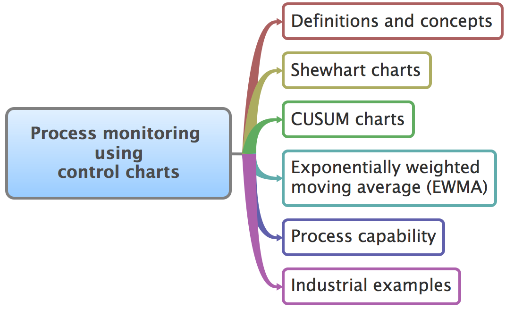

.. index::
	pair: references and readings; Process monitoring

References and readings
=======================

Some references to refer to:
	
#. **Recommended**: Box, Hunter and Hunter, *Statistics for Experimenters*, Chapter 14 (2nd edition)
#. **Recommended**: Montgomery and Runger, *Applied Statistics and Probability for Engineers*
#. Hogg and Ledolter, *Engineering Statistics*
#. Macgregor, John F. "`Using On-Line Process Data to Improve Quality: Challenges for Statisticians <http://dx.doi.org/10.1111/j.1751-5823.1997.tb00311.x>`_", *International Statistical Review*, **65**, p 309-323, 1997.
#. Bisgaard, S., *`The Quality Detective: A Case Study <http://dx.doi.org/10.1098/rsta.1989.0006>`_*, Philosophical Transactions of the Royal Society-A, **327**, p 499-511, 1989.
#. Rocke, D.M., `Robust Control Charts <http://www.jstor.org/pss/1268815>`_, *Technometrics*, **31** (2), p 173 - 184, 1989.

.. Box, The R. A. Fisher Memorial Lecture, 1988- Quality Improvement- An Expanding Domain for the Application of Scientific Method, Phil. Trans. R. Soc. Lond. A February 24, 1989 327:617-630, [http://dx.doi.org/10.1098/rsta.1989.0017 DOI]
.. (Not available): Box critique of Taguchi methods: http://dx.doi.org/10.1002/qre.4680040207

.. UMetrics book: review chapter on (M)SPC
.. MacGregors 1997 paper on MSPC
.. * Controversy between control charts and hypothesis tests, Woodall, Woodall, W. Controversies and Contradictions in Statistical Process Control, JQT, 32(4), 341-350, 2000 ([http://filebox.vt.edu/users/bwoodall/ Link])
.. EWMA paper by Hunter
.. EWMV paper by MacGregor?
.. Box, G.E.P., Comparisons, Absolute Values, and How I Got to Go to the Folies Bergeres, Quality Engineering, 14(1), p167-169, 2001.

.. p 669 of Devore: see also Technometrics, 1989, p173-184, by David M Rocke

Concepts
========

Concepts that you must be familiar with by the end of this section: 

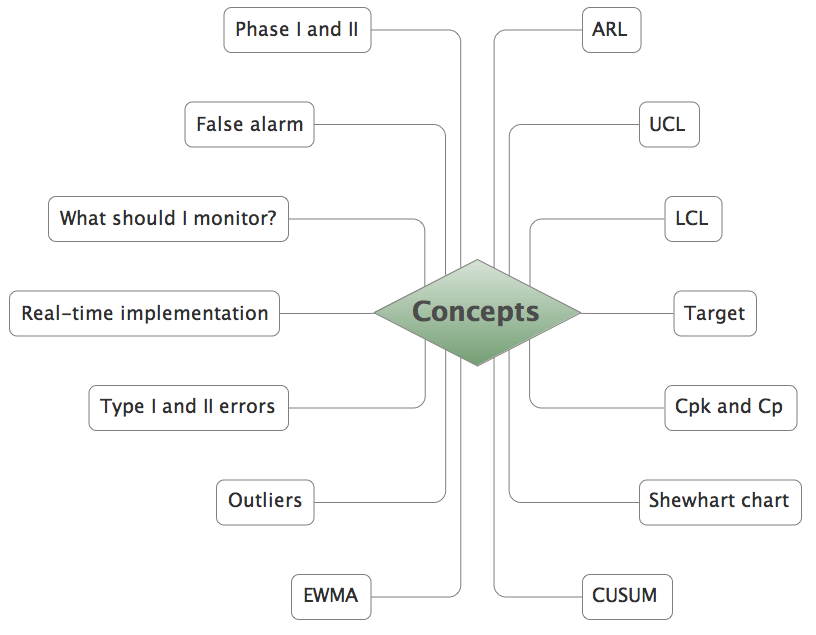

So what is process monitoring?
===============================

Most industries have now realized that product quality is not an option.  There was historical thinking that quality is equivalent of "gold-plating" your product, but that has mostly fallen away.  Product quality is not a cost-benefit trade-off: it is always beneficial to you in the long-term to improve your product quality, and to your customers as well.

As we spoke about in the `univariate review section <univariate-review-chapter>`, good quality products (low variability) actually boost your profits by lowering costs.  You have lower costs when you *do not* have to scrap off-specification product, or have to rework bad product.  You have increased long-term sales with more loyal customers and improved brand reputation.  

An example that most people in North America can relate to is the rise in Asian car manufacturers' market share, at the expense American manufacturers' market share.  The market has the perception that Asian cars are more reliable than American cars and resale rates certainly reflect that. That is an illustration of how variability in your product can benefit you.

In order to achieve this high level of final product quality, our systems should be producing low variability product at every step of the manufacturing process.  Rather than wait till the end of the process to discover poor quality product, we should be monitoring, in real-time, the intermediate parts of our process.  When we discover unusual variability the lofty aim is to make (permanent) process adjustments to avoid that variability from ever occurring again.

Notice here that process monitoring is not intended to be automatic feedback control.  It has the same principles of quantifying unusual operation (errors), but the intention with process monitoring is that our process adjustments are **infrequent**, usually **manual**, and take place due to **special causes**.

.. index::
	single: control charts
	
Control charts
~~~~~~~~~~~~~~~~~~~~

We use control charts to display and detect this unusual variability. A control chart is a display of one value (variable), against time.  These time-based plots also show some additional information: usually a target value, and one or more limits lines are superimposed on the plot.  The plots are most useful when displayed in real-time, or close to real-time.  There are various technical ways to express what a control chart does exactly, but a general definition is that a control chart helps you detect outliers and other unusual behaviour.

The key points are:

	- it is most often a time-series plot, or some sort of sequence
	- a target value may be shown (for some plots, e.g. those that monitor variance, the target is implied to be small, or even zero)
	- one or more limit lines are shown,
	- they are displayed in real-time, or pretty close to real-time

Here is an example that shows these properties.

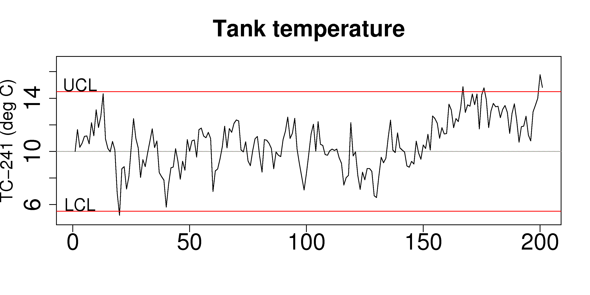

General approach
~~~~~~~~~~~~~~~~~~~~

Generally, one applies the concept of control charts in 2 phases.  You will see the terminology sometimes called:

	* **Phase I**: building and testing the control chart from off-line data that you have collected.  This phase is very iterative, and you will spend most of your time here.
	* **Phase II**: Using the control chart, on new, unseen data.  This phase is most often implemented with computer hardware and software for real-time display of the charts.

What should we monitor?
========================

Any variable can be monitored.  However, the purpose of process monitoring is so that you can **react early** to bad, or unusual operation.  This implies we should monitor variables that are available in near real-time; they are more suitable than variables that take a long time to acquire (e.g. laboratory measurements).  We shouldn't have to wait to the end of the production line to find our process was out of statistical control.  

These intermediate system variables are (a) available much more frequently and without delay, (b) are more precise, (c) are usually more meaningful to the operating staff than final quality variables from the lab, and (d) contain the "fingerprint" of the fault, helping the engineers with diagnosis and process adjustment.

Note that we don't have to monitor variables that are measured only from on-line sensors.  The variable could be a calculation made from the on-line measurements.  For example, an energy balance could be calculated from various thermocouples on the process and the degree of mismatch in the energy balance could be critical to quality - so monitor the mismatch, rather than the temperatures.

	..	SLIDE: organoleptic properties, Particle size distribution

Discuss one of these unit operations with your colleague.  Which variables would you monitor?

- Waste water treatment process
- Tablet/pharmaceutical manufacturing
- Oil and gas (e.g. a distillation column)
- Food-processing unit
- Mineral processing plant (e.g. a flotation cell)
- Plastics processing (e.g. a twin-screw extruder)

In-control vs out-of-control
=============================

Every book on statistical quality control gives a slightly different viewpoint, or uses different terminology for what is statistical process control.

In this book we will take "in-control" to mean that the behaviour of the process is stable over time.  Note though, that in-control does not mean the variable of interest meets the required specifications - all that "in control" means is that there are no **special causes** in the data.  A special cause, or an assignable cause is an event that occurs to move the process, or destabilize it.  Process monitoring charts aim to detect these events.

.. Note:: Our objective: quickly detect abnormal variation, and fix it by finding the root cause.  In this section we look at the "detection" problem.  Diagnosis and process adjustment are two separate steps that follow.

.. index::
	pair: Shewhart chart; Process monitoring

Shewhart chart
==============

.. For the mean: p174 to p186 of Barnes.  KGD: what does "Barnes" refer to?

A Shewhart chart, named after Walter Shewhart from Bell Telephone and Western Electric, is to monitor that a process variable remains on target and within given upper and lower limits. It is a monitoring chart for *location*.  It answers the question whether the variable's location is stable over time.

The defining characteristics are: a target, upper and lower control limits (UCL and LCL).  These action limits are defined so that no action is required as long as the variable plotted remains within the limits.

Derivation
~~~~~~~~~~~~~

Define the variable of interest as |x|, and assume that we have samples of |x| available in sequence order.  No assumption is made regarding the distribution of |x|.  The average of :math:`n` of these |x|-values is defined as :math:`\bar{x}`, which from the Central limit theorem we know will be more normally distributed with unknown population mean :math:`\mu` and unknown population variance :math:`\sigma^2/n`.  The figure below shows the case for :math:`n=5`.

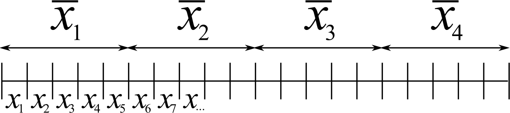

So by taking subgroups of size :math:`n` values, we now have a new variable, :math:`\bar{x}` and we will define a shorthand symbol for its standard deviation: :math:`\sigma_{\bar{X}} = \sigma/\sqrt{n}`.  Writing a |z|-value for :math:`\bar{x}`, and its associated confidence interval for :math:`\mu` is now easy after studying :ref:`the previous section <univariate-confidence-intervals>` of the book:

.. math::
	z = \dfrac{\bar{x} - \mu}{\sigma_{\bar{X}}}

Assuming we know :math:`\sigma_{\bar{X}}`, which we usually do not in practice, we can invoke the normal distribution and calculate the probability of finding a value of |z| between :math:`c_n = -3` to :math:`c_n = +3`:

.. math::
	:label: shewhart-theoretical
	
	\begin{array}{rcccl} 
		  - c_n                                              &\leq& \dfrac{\bar{x} - \mu}{\sigma_{\bar{X}}} &  +c_n\\ \\
		\bar{x}  - c_n\sigma_{\bar{X}}                       &\leq&  \mu                                                 &\leq& \bar{x}  + c_n\sigma_{\bar{X}} \\ \\
		\text{LCL}                                           &\leq&  \mu                                                 &\leq& \text{UCL}
	\end{array}

The total area between that lower and upper bound spans 99.73% of the area (in R: ``pnorm(+3) - pnorm(-3)`` gives 0.9973).  So it is highly unlikely, a chance of 1 in 370 that a data point, :math:`\bar{x}`, calculated from a subgroup of :math:`n` raw |x|-values, will lie outside these bounds.

.. Explain-shewhart.png

Using estimated parameters instead
~~~~~~~~~~~~~~~~~~~~~~~~~~~~~~~~~~~~~~~~

The derivation in equation :eq:`shewhart-theoretical` requires knowing the population variance, :math:`\sigma`, and assuming that our target for |x| is :math:`\mu`.  

The latter assumption is reasonable, so create a new variable |xdb| :math:`= \dfrac{1}{K} \displaystyle \sum_{k=1}^{K}{ \bar{x}_k}`, where :math:`K` is the number of :math:`\bar{x}` samples we have available to build the control chart (phase 1 data).  Alternatively, just set |xdb| to the desired target value for :math:`x`.  Note that |xdb| is sometimes called the  *grand mean* in control chart textbooks.

The next hurdle is :math:`\sigma`.  We do not show it here, but for a subgroup of :math:`n` samples, an unbiased estimator of :math:`\sigma` is given by :math:`\dfrac{\bar{S}}{a_n}`.  Now :math:`\bar{S} =  \dfrac{1}{K} \displaystyle \sum_{k=1}^{K}{s_k}` (simply the average standard deviation calculated from :math:`K` subgroups).  Values for :math:`a_n` are looked up from a table and depend on the number of samples we use within each subgroup.

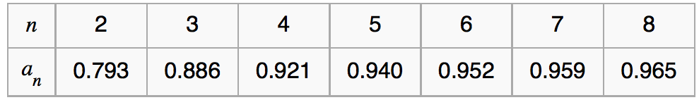
	
.. table code
	{| class="wikitable center"
	|-
	| <math>n</math>
	|2
	|3
	|4
	|5
	|6
	|7
	|8
	|-
	| <math>a_n</math>
	| 0.793
	| 0.886
	| 0.921
	| 0.940
	| 0.952
	| 0.959
	| 0.965
	|}

Now that we have an unbiased estimator for the standard deviation from these :math:`K` subgroups, we can write down suitable lower and upper control limits for the Shewhart chart:

.. math::
	:label: shewhart-limits
	
	\begin{array}{rcccl} 
		 \text{LCL} = \Bar{\Bar{x}} - 3 \cdot \dfrac{\bar{S}}{a_n\sqrt{n}} &&  &&  \text{UCL} = \Bar{\Bar{x}} + 3 \cdot \dfrac{\bar{S}}{a_n\sqrt{n}} 
	\end{array}

Example
~~~~~~~~~~~~~~~~~~~~~~~~~~

Bales of rubber are being produced, with every 10th bale automatically removed from the line.  Five measurements of colour are made on the bale, using calibrated digital cameras under standard lighting conditions. The rubber compound is used for medical devices, so it needs to have the correct whiteness (colour).  The average of the 5 colour measurements is to be plotted on a Shewhart chart.  So we have a new data point appearing on the monitoring chart after every 10th bale.  

In the above example the raw data are the bale's colour.  There are :math:`n = 5` values in each subgroup.  Collect say :math:`K=20` samples of normal operating data, these are bales that are considered to be from stable operation. No special process events occurred while collecting the data.

The data below represent the average of the :math:`n=5` samples from each bale, there are :math:`K=20` subgroups.

.. math::
 	\bar{x} = [245, 239, 239, 241, 241, 241, 238, 238, 236, 248, 233, 236, 246, 253, 227, 231, 237, 228, 239, 240]

The overall average is :math:`\Bar{\Bar{x}} = 238.8` and :math:`\bar{S} = 9.28`.  Calculate the lower and upper control limits for this Shewhart chart.  Were there any points in the phase I data (training phase) that exceeded these limits?

	- LCL = :math:`238.8 - 3 \cdot \dfrac{9.28}{(0.94)(\sqrt{5})} = 225.6`
	- UCL = :math:`238.8 + 3 \cdot \dfrac{9.28}{(0.94)(\sqrt{5})} = 252.0`
	- The sample with value of 253 exceeds these limits.  If this point is excluded and the limits recomputed, the new LCL = 224 and UCL = 252 (the new :math:`\Bar{\Bar{x}} = 238.0` and :math:`\bar{S} = 9.68`)
	
.. todo: show chart in class
	
	
.. todo:  use explain-shewhart.R still

.. todo: in the future, describe more clearly the difference between phase I and phase II.  Students were asking a lot of questions around this.

Assessing the chart's performance
~~~~~~~~~~~~~~~~~~~~~~~~~~~~~~~~~~~~~~~~~~~~~~~~~~~~

There are 2 ways to assess performance:

#.	Error probability.  We define two types of errors, Type I and Type II, which are a function of the lower and upper control limits (LCL and UCL).

	You make a **type I error** when your sample is typical of normal operation, yet, it falls outside the UCL or LCL limits.  We showed in the theoretical derivation that the area covered by the upper and lower control limits is 99.73%.  The probability of making a type I error, usually denoted as :math:`\alpha` is then 100 - 99.73 = 0.27%.
	
	*Synonyms* for a **type I error**: false alarm, false positive (used mainly for testing of diseases), producer's risk (used for acceptance sampling)
	
	You make a **type II error** when your sample really is abnormal, but falls within the the UCL and LCL limits.  This error rate is denoted by :math:`\beta`, and it is a function of the degree of abnormality, which we derive next.
	
	*Synonyms* for a **type II error**: false negative (used mainly for testing of diseases), consumer's risk (used for acceptance sampling)
	
	To quantify the probability of :math:`\beta`, make an assumption that the new, abnormal sample comes from a distribution which has shifted its location from :math:`\mu` to :math:`\mu + \Delta\sigma` (e.g. :math:`\Delta` can be positive or negative).  Now, what is the probability this new sample, which come from the shifted distribution, will fall within the existing LCL and UCL? This figure show the probability is :math:`\beta = 1 - \text{the shaded area}`.

	.. figure:: images/show-shift-beta-error.png
		:width: 500px
		:align: center
		:scale: 90
	
	.. todo  How did Devore calculate these numbers: see p 667 of his book - it doesn't make sense to me.  See my attempt in "show-shift-typeII-error.R"
	
	.. figure:: images/type-II-error-shift.png
		:width: 500px
		:align: center
		:scale: 90

	The table here shows that :math:`\beta` is a function of the amount by which the process shifts = :math:`\Delta`, where :math:`\Delta=1` implies the process has shifted up by :math:`1\sigma`.  The table was calculated for :math:`n=4` and used critical limits of :math:`\pm 3 \sigma_{\bar{X}}`.

	The key point you should note from the table is that a Shewhart chart is not good at detecting a change in the level of a variable.  Even a moderate shift of :math:`0.75\sigma` units :math:`(\Delta=0.75)` will only be detected around 6.7% of the time (100-93.3%) when :math:`n=4`.  We will discuss CUSUM charts as a way to overcome this issue next.
	
	It is straightforward to see how the type I (:math:`\alpha`) error rate can be adjusted - simply move the LCL and UCL up and down, as required.  
	
	However what happens to the type II error rate as the LCL and UCL bounds are shifted?  Imagine the case where you want to have :math:`\alpha \rightarrow 0`.  As you make the UCL higher and higher, the value for :math:`\alpha` drops, but the value for :math:`\beta` will also increase!  **You cannot simultaneously have low type I and type II error**.

#. 	The **average run length (ARL)** is defined as the average number of sequential samples we expect before seeing an out-of-bounds, or out-of-control signal.  This is given by the inverse of :math:`\alpha`, as ARL = :math:`\frac{1}{\alpha}`.  Recall for the theoretical distribution we had :math:`\alpha = 0.0027`, so the ARL = 370.  Thus we expect a run of 370 samples before we get an out-of-control signal.

	The run length is changed when the process level shifts.  What is the ARL if the process has shifted up by :math:`0.75\sigma`?
	
	*Answer*
	
		ARL = 1/(1-0.9332) = 15 samples

Extensions to the basic Shewhart chart
~~~~~~~~~~~~~~~~~~~~~~~~~~~~~~~~~~~~~~~~~~~~~~~~~~~~

*	What are the **Western Electric rules**?  We saw above how the ARL is only decreased by a small amount if a true shift in the process mean occurs, from :math:`\mu` to :math:`\mu + \Delta\sigma`. The Western Electric (then known as AT&T) rules are an attempt to more rapidly detect a process shift, by raising an alarm when these *improbable* events occur:

	#. 2 out of 3 points lie beyond :math:`2\sigma` on the same side of the centre line
	#. 4 out of 5 points lie beyond :math:`1\sigma` on the same side of the centre line
	#. 8 successive points lie on the same side of the center line
	
	However, an alternative chart, the CUSUM chart is more effective at detecting a shift in the mean.  Notice also that the theoretical ARL (:math:`1/\alpha`) is reduced by using these rules in addition to the LCL and UCL.

*	**Adding robustness**: the phase I derivation of a control chart is iterative.  If you find a point that violates the LCL and UCL limits, then the approach is to remove that point, and recompute the LCL and UCL values.  That is because the LCL and UCL limits would have been biased up or down by these points.

	This iterative approach can be tiresome with data that has spikes, missing values, outliers, and other problems typical of data pulled from a process historian (database). Robust control charts are procedures to calculate the limits so the LCL and UCL are resistant to the effect of outliers. For example, a robust procedure might use the medians and MAD instead of the mean and standard deviation.  An examination of various robust procedures, especially that of the interquartile range, is given by the paper in the reading list by Rocke, *Robust Control Charts*.

	*Note*: do not use robust methods to calculate the values plotted on the charts, only use robust methods to calculate the chart limits!
	
*	**Warning limits**: it is common to see warning limits on a control chart at :math:`\pm 2 \sigma`, while the :math:`\pm 3\sigma` limits are called the action limits.  Real-time computer systems usually use a colour scheme to distinguish between the warning state and the action state.  For example, the chart background changes between green, orange or red depending on the state of the current observation plotted.

*	**Adjusting the limits**: The :math:`\pm 3\sigma` limits are not set in stone.  Depending on the degree to which the source data obey the assumptions, and the frequency with which spikes and outliers contaminate your data, you may need to adjust your limits, usually wider, to avoid frequent false alarms.  Nothing makes a control chart more useless to operators than frequent false alarms ("`crying wolf <http://en.wikipedia.org/wiki/The_Boy_Who_Cried_Wolf>`_").

	It is perhaps a counterintuitive result that increasing the subgroup size, :math:`n`, leads to a more sensitive detection system for shifts in the mean, because the control limits are pulled in tighter.  However, the larger :math:`n` also means that it will take longer to see the detection signal.  So there is a trade-off between subgroup size and the run length (time to detection of a signal).

.. _monitoring-mistakes-to-avoid:

Mistakes to avoid
~~~~~~~~~~~~~~~~~~~~~~~

Imagine you are monitoring an aspect of the final product's quality, e.g. viscosity, and you have a product specification that requires that viscosity to be within, say 40 to 60 cP.  It is a mistake to place those **specification limits** on the control chart.  It is also a mistake to use the required specification limits instead of the LCL and UCL.  The control chart is to detect abnormal variation in the process, not to inspect for quality specifications.  You can certainly have another chart for that, but the process monitoring chart's limits are intended to monitor process stability, and these Shewhart limits are calculated differently.

Shewhart chart limits were calculated with the assumption of **independent subgroups** (e.g. subgroup :math:`i` has no effect on subgroup :math:`i+1`).  For a process with mild autocorrelation, the act of creating subgroups, with :math:`n` samples in each group, removes most, if not all, of the relationship between subgroups.  However processes with heavy autocorrelation (slow moving processes sampled at a high rate, for example), will have LCL and UCL calculated from equation :eq:`shewhart-limits` that will raise false alarms too frequently.  In these cases you can widen the limits, or remove the autocorrelation from the signal.  More on this in the section on exponentially weighted moving average (EWMA) charts.

Using Shewhart charts on **highly correlated quality variables**, usually on your final product measurement, can increase your type II (consumer's risk) dramatically.  We will come back to this very important topic in the section on :ref:`latent variable models <SECTION-latent-variable-modelling>`.

.. index::
	pair: CUSUM chart; Process monitoring

CUSUM charts
==============

The Shewhart chart is not too sensitive to detecting shifts in the mean.  Depending on the subgroup size, :math:`n`, we showed that it can take several consecutive samples before a warning or action limit is triggered. The cumulative sum (CUSUM) chart allows more rapid detection of these shifts away from a target value, :math:`T`.

.. math::
	:label: CUSUM-derivation
	
	S_0 &= (x_0 - T) \\
	S_1 &= (x_0 - T) + (x_1 - T) = S_0 + (x_1 - T) \\
	S_2 &= (x_0 - T) + (x_1 - T) + (x_2 - T) = S_1 + (x_2 - T) \\
	\\
	\text{In general}\qquad S_t &= S_{t-1} + (x_t - T) 
	
Values of :math:`S_t` for an in-control process are really just random errors, with mean of zero.  The long-term sum of :math:`S_t` is also zero, as the positive and negative errors keep cancelling out.

So imagine a CUSUM chart where at some time point the process mean shifts up by :math:`\Delta` units, causing future values of :math:`x_t` to be :math:`x_t + \Delta` instead.  Now the summation in the last equation of :eq:`CUSUM-derivation` has an extra :math:`\Delta` term added at each step to :math:`S_t`.  Every point will build up an accumulation of :math:`\Delta`, which shows up as a positive or negative slope in the CUSUM chart. 

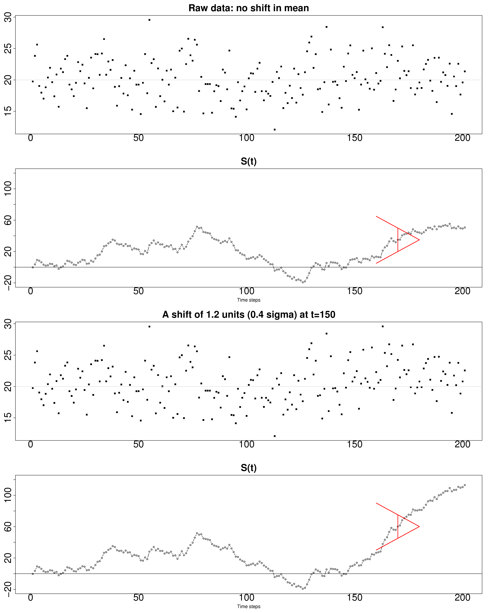

The CUSUM chart is extremely sensitive to small changes.  The chart is drawn for a process where the mean is :math:`\mu=20`, and :math:`\sigma=3`.  A small shift of 0.4*3 = 1.2 units (i.e from 20 to 21.2) occurs at :math:`t=150`.  This shift is imperceptible (see the 3rd row in the figure).  The CUSUM chart rapidly picks up the shift by showing a consistent slope.

This figure also shows how the CUSUM chart is used with the 2 masks.  Notice that there are no lower and upper bounds for :math:`S_t`.  A process that is on target will show a "wondering" value of S, moving up and down.  In fact, as the second row shows, a surprising amount of movement up and down occurs even when the process is in control.

What is of interest is a persistent change in slope.  The angle of the superimposed V-mask is the control limit: the narrower the mouth of the mask, the more sensitive the CUSUM chart is to deviations from the target.  Both the type I and II error are set by the angle of the V and the leading distance (the distance from the short vertical line to the apex of the V).

The process is considered in control as long as all points are within the arms of the V shape.   The mask in the second row of the plot shows "in control" behaviour, while the mask in the fourth row detects the process mean has shifted, and an alarm should be raised.

Once the process has been investigated the CUSUM value, :math:`S_t` is often reset to zero; though other resetting strategies exist. A tabular version of the CUSUM chart also exists, but these days the charts are entirely automated in software.

.. todo:: MUCH LESS FOCUS on the V-mask, more on how it is currently done

.. index::
	single: exponentially weighted moving average chart
	pair: EWMA chart; Process monitoring

EWMA charts
==============

The two previous charts highlight the 2 extremes of control chart.  On the one hand, a Shewhart chart assumes each subgroup sample is independent (unrelated) to the next - implying there is no "memory" in the chart.  On the other hand, a CUSUM chart has an infinite memory, back to the time the chart was started at :math:`t=0` (see equation :eq:`CUSUM-derivation`).

As an introduction to the exponentially weighted moving average (EWMA) chart, consider first a moving average (MA) chart, which is used just like a Shewhart chart, except the samples that make up the subgroup are calculated using a moving window of width :math:`n`.

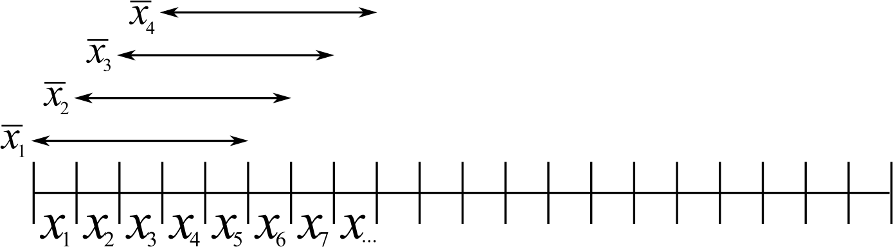

The MA chart plots values of :math:`x_t`, calculated from groups of size :math:`n`, with equal weight for each of the :math:`n` most recent raw data.

.. math::	
	
	\bar{x}_t = \dfrac{1}{n}x_{t-1} + \dfrac{1}{n}x_{t-2} + \ldots + \dfrac{1}{n}x_{t-n}

The EWMA is similar to the MA, but with different weights; heavier weights for more recent observations, tailing off exponentially to very small weights further back.  Let's take a look at a derivation. 

Define the process target as :math:`T`.

.. math:: 
	:label: ewma-derivation-1
	
		\begin{array}{lcrclcl}
			x_t = \text{new data}\qquad\qquad	&& \hat{x}_t     &=& \hat{x}_{t-1} + \lambda e_{t-1}	\qquad\qquad	& \text{where~} e_t = x_t - \hat{x}_t \\
			\text{Shifting one step:}			&& \hat{x}_{t+1} &=& \hat{x}_{t}   + \lambda e_{t}    \\
		\end{array}
		
To start the EWMA sequence we define the value for :math:`\hat{x}_0 = T`, and :math:`e_0 = 0`, so that :math:`\hat{x}_1 = T`.  An alternative way of writing the above equation is:

.. math:: 
	:label: ewma-derivation-2
	
		\begin{array}{lcrclcl}
			x_t = \text{new data}\qquad		&& \hat{x}_{t+1} &=& \hat{x}_{t}   + \lambda e_{t}\qquad\qquad	& \text{where~} e_t = x_t - \hat{x}_t \\
			\text{Substituting in the error}&& \hat{x}_{t+1} &=& \hat{x}_{t}   + \lambda \left(x_t - \hat{x}_t\right)     \\
											&& \hat{x}_{t+1} &=& \left(1-\lambda \right)\hat{x}_{t}   + \lambda x_t  \\
		\end{array}

That last line shows the one-step-ahead prediction for :math:`x` at time :math:`t+1` is a weighted sum of two components: the predicted value and the measured value, weighted to add up to 1.  The plot below shows visually what happens as the weight of :math:`\lambda` is changed.  In this data a step increase in the raw data of 3 units occurs at :math:`t=150`; the process mean is :math:`\mu=20` and the raw data :math:`\sigma = 3`.  The plots show the one-step-ahead prediction value from equation :eq:`ewma-derivation-2`, :math:`\hat{x}_{t+1}` = EWMA value plotted.

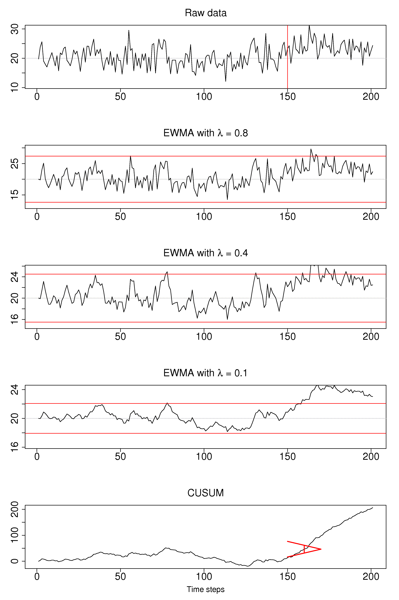

As :math:`\lambda` gets smaller, the chart is smoother, because as equation :eq:`ewma-derivation-2` shows, less of the current data (:math:`x_t`) is used, and more historical data (:math:`\hat{x}_{t}`) is used (i.e. the "memory" of the EWMA statistic is increased).  To see why :math:`\hat{x}_{t}` represents historical data, you can recursively substitute and show that:

.. math::
	
	\hat{x}_{t+1} &= \sum_{i=0}^{i=t}{w_i x_i} = w_0x_0 + w_1x_1 + w_2x_2 + \ldots \\
	\text{where the weights are:} \qquad w_i &= \lambda (1-\lambda)^{t-i}

which shows that the one-step-ahead prediction is a just a weighted sum of the raw measurements, with weights declining in time.  In the next figure, we show the weights for the 4 control charts studied so far.

From the above discussion and the weights shown for the 4 different charts, it should be clear now how an EWMA chart is a tradeoff between a  Shewhart chart and a CUSUM chart.  As :math:`\lambda \rightarrow 1`, the EWMA chart behaves more as a Shewhart chart, giving only weight to the most recent observation.  While as :math:`\lambda \rightarrow 0` the EWMA chart starts to have an infinite memory (like a CUSUM chart).

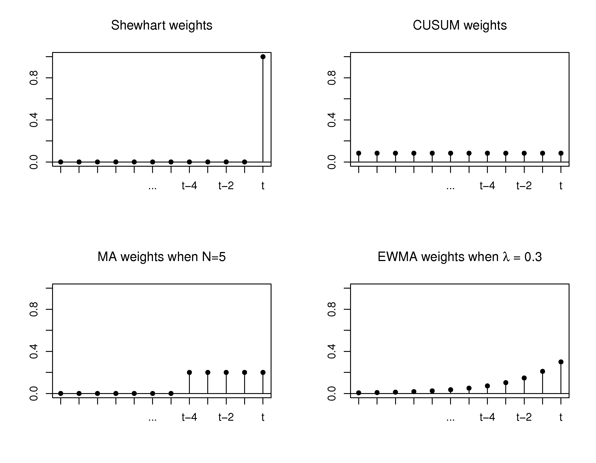
	
The upper and lower control limits for the EWMA plot are plotted in the same way as the Shewhart limits:

.. math::
	:label: ewma-limits
	
	\begin{array}{rcccl} 
		 \text{LCL} = \Bar{\Bar{x}} - 3 \cdot \sigma_{\text{Shewhart}}\sqrt{\dfrac{\lambda}{2-\lambda}} &&  &&  \text{UCL} = \Bar{\Bar{x}} + 3 \cdot \sigma_{\text{Shewhart}} \sqrt{\dfrac{\lambda}{2-\lambda}}
	\end{array} 

where :math:`\sigma_{\text{Shewhart}}` represents the standard deviation as used on the Shewhart chart.  Actually one neat implementation is to show both the Shewhart and EWMA plot on the same chart, with both sets of limits.  The EWMA value plotted is actually the one-step ahead prediction of the next :math:`x`-value, which can be informative for slow-moving processes.

The R code here shows one way of calculating the EWMA values for a vector of data.  Once you have pasted this function into R, use it as ``ewma(x, lambda=..., target=...)``.

.. code-block:: s

	ewma <- function(x, lambda, target=x[1]){
	    N <- length(x)
	    y <- numeric(N)
	    y[1] = target
	    for (k in 2:N)
	    {
	        error = x[k-1] - y[k-1]
	        y[k] = y[k-1] + lambda*error
	    }
	return(y)
	}

.. EWMA can detect both changes in level and changes in variance
.. Todo After introducing concept, show why Shewhart fails with heavy autocorr.  Have to increase Shewhart N, or widen the limits.

Other charts
=============

You may encounter other charts in practice:

	*	The *S chart* is for monitoring the subgroup standard deviation.  Take the group of :math:`n` samples and show their standard deviation on a Shewhart-type chart.  The limits for the chart are calculated using similar correction factors as were used in the derivation for the standard :math:`\bar{x}` Shewhart chart.  This chart has a LCL :math:`\geq 0`.
	
	*	The *R chart* was a precursor for the *S chart*, where the *R* stands for range, the subgroup's maximum minus minimum.  It was used when charting was done manually, as standard deviations were tedious to calculate by hand.
	
	*	The *np chart* and *p chart* are used when monitoring the proportion of defective items using a pass/fail criterion.  In the former case the sample size taken is constant, while in the latter the proportion of defective items is monitored.  These charts are derived using the binomial distribution.

	*	The *exponentially weight moving variance* (EWMV) chart is an excellent chart for monitoring for an increase in product variability. Like the :math:`\lambda` from an EWMA chart, the EWMV also has a sliding parameter that can balance current information and historical information to trade-off sensitivity.  More information is available in the paper by MacGregor, J.F. and Harris, T.J., "The Exponentially Weighted Moving Variance", *Journal of Quality Technology*, **25**, p 106-118, 1993.

.. index::
	pair: process capability; Process monitoring
	single: capability, process
	
Process capability
===================

.. Note:: This section is not about a particular control chart, but is relevant to the topic of process monitoring.

Centered processes
~~~~~~~~~~~~~~~~~~~~

Purchasers of your product will require a process capability ratio (PCR) for each of the quality attributes of your product.  For example, your plastic product is characterized by its Mooney viscosity and melting point.  A PCR value can be calculated for both properties, using the definition below:

.. math::
	:label: process-capability-ratio-centered
	
	\text{PCR} &= \dfrac{\text{Upper specification limit} - \text{Lower specification limit}}{6\sigma}
	
Since the population standard deviation, :math:`\sigma`, is not known, an estimate of it is used.  Note that the lower specification limit (LSL) and upper specification limit (USL) are **not the same** as the lower control limit (LCL) and upper control limit (UCL) as where calculated for the Shewhart chart.  The LSL and USL are the tolerance limits required by your customers, or from your internal specifications.  

Interpretation of the PCR:
	
	* assumes the property follows a normal distribution
	* assumes the process is centered (i.e. your long term mean is halfway between the upper and lower specification limits)
	* assumes the PCR value was calculated when the process was stable

The PCR is often called the process width.  Let's see why by taking a look at a process with PCR=0.5 and then PCR=2.0.  In the first case :math:`\text{USL} - \text{LSL} = 3\sigma`.  Since the interpretation of PCR assumes a centered process, we can draw a diagram as shown below:

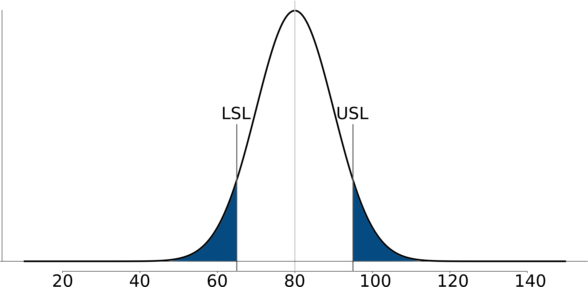

The diagram is from a process with mean of 80 and where LSL=65 and USL=95.  These specification are fixed, set by our production guidelines.  If the process variation :math:`\sigma = 10`, then this implies that PCR=0.5.  Assuming further that the our production is centered at the mean of 80, we can calculate how much defective product is produced in the shaded region of the plot.  Assuming a normal distribution:

	-	:math:`z` for LSL = (65 - 80)/10 = -1.5

	-	:math:`z` for USL = (95 - 80)/10 = 1.5

	-	Shaded area probability = ``pnorm(-1.5) + (1-pnorm(1.5))`` = 13.4% of production is out of the specification limits.

Contrast this to the case where PCR = 2.0 for the same system.  To achieve that level of process capability, using the *same upper and lower specifications* we have to  reduce the standard deviation by a factor of 4, down to :math:`\sigma = 2.5`.   The figure below illustrates that almost no off-specification product is produced for a centered process at PCR = 2.0.  There is a width of :math:`12 \sigma` units from the LSL to the USL, giving the process ample room to move. 

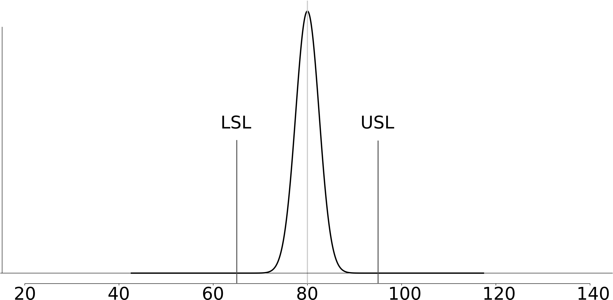

.. Note:: You will probably come across the terminology C\ :sub:`p`, especially when dealing with 6 sigma programs.  This is the same as PCR for a centered process.

.. index::
	pair: uncentered process capability; Process monitoring
	single: capability, process

Uncentered processes
~~~~~~~~~~~~~~~~~~~~

Processes are not very often centered between their upper and lower specification limits.  So a measure of process capability for an uncentered processes is defined:

.. math::
	:label: process-capability-ratio-uncentered

		\text{PCR}_\text{k} = \text{C}_\text{pk} = \min \left( \dfrac{\text{Upper specification limit} - \Bar{\Bar{x}}}{3\sigma};  \dfrac{\Bar{\Bar{x}} - \text{Lower specification limit}}{3\sigma} \right)
		
The |xdb| term would be the process target from a Shewhart chart, or simply the actual operating point.  Notice that |Cpk| is a one-sided ratio, only the side closest to the specification is reported.  So even an excellent process with C\ :sub:`p` = 2.0 that is running off-center will have a lower |Cpk|.

It is the |Cpk| value that is requested by your customer.  Values of 1.3 are usually a minimum requirement, while 1.67 and higher are requested for safety and other critical applications.  A value of |Cpk| :math:`\geq 2.0` is termed a six-sigma process, because the distance from the current operating point, |xdb|, to the closest specification is at least :math:`6\sigma` units.

You can calculate that a shift of :math:`1.5\sigma` from process center will introduce only 3.4 defects per million.  This shift would reduce your |Cpk| from 2.0 to 1.5.

.. Note:: It must be emphasized that |Cpk| and C\ :sub:`p` numbers are only useful for a process which is stable.  Furthermore the assumptions of normally distributed samples is also required to interpret the |Cpk| results.

.. index::
	pair: industrial practice; Process monitoring

Industrial practice
===================

This section of the book is only intended to give an overview of the concepts of process monitoring.  As you move into an industrial environment you will find there are many such systems already in place.  Higher levels of management track statistics from a different point of view, often summarizing data from an entire plant, geographic region, or country.  The techniques learned in this book, while focusing mainly on unit operations, are equally applicable though.

You may come across systems called dashboards, which are often part of ERP (enterprise resource planning) systems.  These dashboards are supposed to monitor the pulse of a company and are tracked like any other control chart discussed above.  Another area is called business intelligence (BI) systems.  These typically track sales and other financial information.  And yet another acronym is the KPI, key performance indicator, which is a summary variable, such as profit per hour, or energy cost per unit of production.  These are often monitored and acted on by site managers on a daily or weekly basis.

But at the unit operation and plant level, you will likely find the hardest part of getting a control chart going is the part where you need to access the data.  Getting the data out of most historical systems is not easy, though it has improved quite a bit in the last few years.

It is critical that your control chart display the quantity as close to real-time as possible.  It is almost as if the monetary value of the information in a chart decays exponentially from the time an event occurs.  It is also much harder to diagnose and correct those problems.

You will also realize that good operator training is time-consuming; operators keep moving to new units or plants, so frequent re-training is required.  Concepts from the :ref:`data visualization <SECTION-data-visualization>` section are helpful to minimize training effort - make sure the online plots contain the right level of information, without clutter.

Another side effect of the large quantities of data are that you will have to work with IT groups to manipulate large chunks of data on dedicated networks, separate from the rest of the plant.  The last thing you want to be responsible for is clogging the company network with your data.  The concept of a "production" network in parallel to the "company" network is now common in most industries.

Workflow to implement a monitoring chart in an industrial setting
~~~~~~~~~~~~~~~~~~~~~~~~~~~~~~~~~~~~~~~~~~~~~~~~~~~~~~~~~~~~~~~~~~~~~~~~~~~~~~~~~~~~~~~~~~~~

Here is some general guidance; feel free to adjust the steps as required for your unique situation.

	#. Identify the variable(s) to monitor.  Make sure the variables show different, uncorrelated phenomena.
	#. Retrieve historical data from your computer systems, or lab data, or paper records.
	#. Import the data and just plot it.  Do you see any time trends, outliers, spikes, missing data gaps?
	#. Locate any regions of data which are from generally stable operation.  Remove spikes and outliers that will bias your control limits calculations.  In other words, find regions of common-cause operation.
	#. Estimate limits that you would expect to contain this stable region of operation just by looking at the plots.
	#. Then calculate preliminary control limits (UCL, LCL), using the formula shown in this section.
	#. Test your chart on **new, unused** data.  This new data should contain both common and special cause operation.
	#. How does your chart work?  Quantify the type I and II error. Adjust the limits and control chart parameters (e.g. :math:`\lambda`) if necessary.  You may even have to resort to a different variable to plot.
	#. Run the chart on your desktop computer for a couple of days.  When you detect an unusual event, go and check with the process operators and verify the event.  Would they have reacted to it, had they known about it?  Or, would this have been a false alarm?  You may need to refine your limits, or the value you are plotting again.
	#. Remember that this form of control charting is not an expert system - it will not diagnose problems: you have to use your head by looking at patterns in the chart, and use knowledge of other process events.
	#. Demonstrate the system to your colleagues and manager.  But show them economic estimates of the value of early detection.  They are usually not interested in the plots alone.
	#. Installation and operator training will take time.  This assumes that you have real-time data acquisition systems and real-time processing systems in place - most companies do.
	#. Listen to your operators for what they want to see.  Use principles of :ref:`good data visualization <SECTION-data-visualization>` to reduce unnecessary information.  Make your plots interactive - if you click on an unusual point it should "drill-down" and give you more information and historical context.
	#. Future monitoring charts are easier to get going, once the first system is in place.

.. Workflow for what happens with a new observation, once you have the monitoring settings
	~~~~~~~~~~~~~~~~~~~~~~~~~~~~~~~~~~~~~~~~~~~~~~~~~~~~~~~~~~~~~~~~~~~~~~~~~~~~~~~~~~~~~~~~~~~~

	Once you have the monitoring settings for your variable (i.e the control limits, the target point), you are now in a 

	These steps are generally followed in sequence 
	 - check for gross error (HI/LOW limits)
	 - calculate the number to plot (what happens with missing data)
	 - plot the new observation in relation to prior operating data
	 - diagnose if outside limits

Industrial case study
==========================

ArcelorMittal (Dofasco)
~~~~~~~~~~~~~~~~~~~~~~~~~~~~~~~~~~~~~~~~

ArcelorMittal's steel mill in Hamilton, Ontario, (formerly called Dofasco) has used multivariate process monitoring tools in many areas of their plant for decades now.  One of their most successful applications is that applied to their casting operation.  In this section we just focus on the application; the sort of multivariate calculations used by Dofasco are discussed :ref:`later on <SECTION-latent-variable-modelling>`.

The computer screenshot shows the monitoring system, called Caster SOS (Stable Operation Supervisor), which is followed by the operators.  There are several charts on the screen: two charts, called "Stability Index 1" and "Stability Index 2", are one-sided monitoring charts.  Notice the warning limits and the action limits.  We will cover what they are plotting in a later section of the book.  In the middle is a two-sided chart.  A wealth of information is presented on the screen - their design was heavily influenced and iterated on several times, by the *operators*.  The screen shot is used with permission of Dr. John MacGregor. 

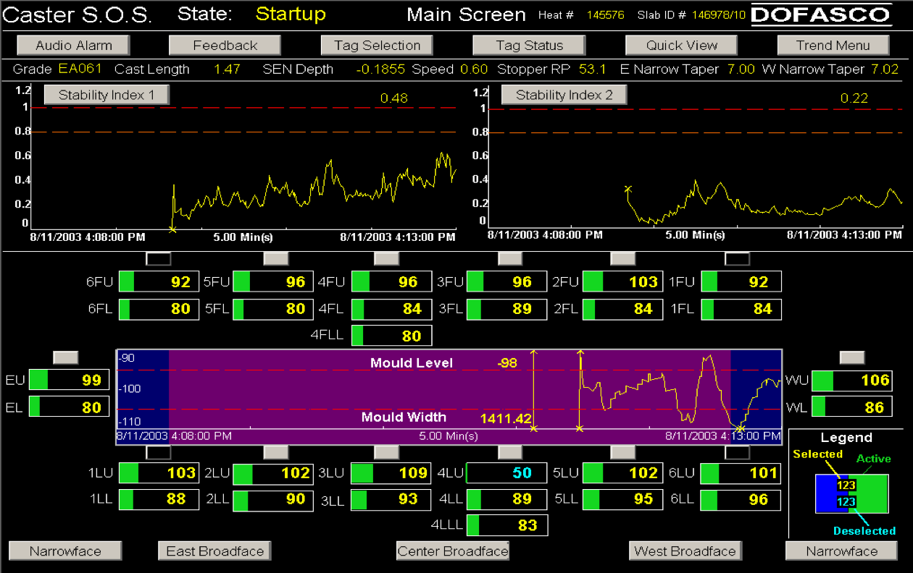
	
The economics of control charting cannot be overstated. The ArcelorMittal example above was introduced around 1997.  The calculations required by this system are complex - however the computer performs them in near real-time, allowing the operators to take corrective action within a few seconds.  The data show a significant reduction in breakouts since 1997 (*used with permission of Dr. John MacGregor*).  The economic savings and increased productivity is in the millions of dollars per year, as each breakout costs around $200,000 to $500,000 due to process shutdowns and/or equipment damage.

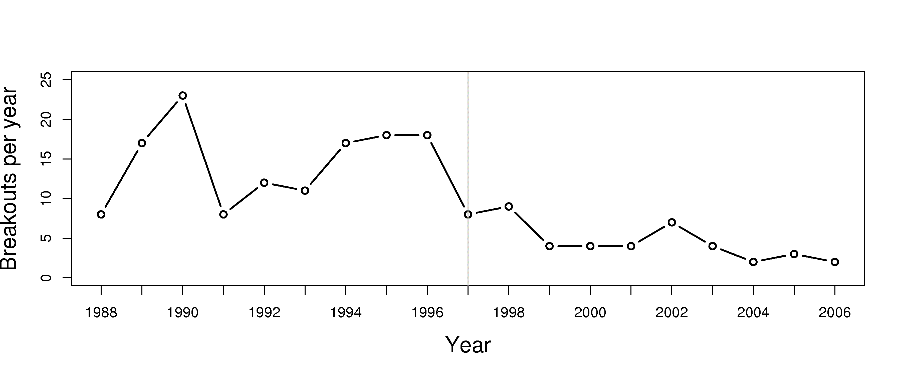

.. FUTURE: Agnico-Eagle monitoring 
.. FUTURE: show how a scatter plot can be used
.. FUTURE: show how a spectral plot can be used (or a distribution, e.g. size distribution)

.. Software for control charts

	* Quality control charts in R: http://cran.r-project.org/web/packages/qcc/

Summary
==========

Montgomery and Runger list 5 reasons why control charts are widely used.  After this section of the book you should understand the following about control charts and process monitoring:

	#.	These tools are proven to improve productivity (i.e. to reduce scrap and rework, as described above), and to increase process throughput.
	#.	They detect defective production, consistent with the concept of "doing it right the first time", a mantra that you will increasingly hear in the manufacturing workplace.
	#.	A control chart with good limits will prevent over-control of the process.  Operators are trained not to make process adjustments unless there is a signal from the chart.
	#.	The patterns generated by the plots often help determine what went wrong - providing some diagnostic value to the operators.  We will see a more formal tool for process diagnosis though in the last section, using multivariate data methods.
	#.	Control charts are required to judge if a process is stable over time.  A stable process allows us to calculate our process capability, which is a tremendously important metric for consumers.

.. index::
	pair: exercises; Process monitoring

Exercises
=========

.. question::

	Is it fair to say that a control chart is like an online version of a :ref:`confidence interval <univariate-confidence-intervals>`?  Explain your answer.

.. answer::

	This question is likely to generate a wide range of answers.  No surprise, since there are strong feelings on this point in the `quality control literature <http://filebox.vt.edu/users/bwoodall/2000%20JQT%20Controversies%20and%20Contradictions.pdf>`_ as well.  The confusion stems from the fact that if you are in phase I, then no, a control chart is not a confidence interval, but in phase II, then you can argue that confidence intervals have many similarities to control charts.

	But, in general, I feel the above statement is incorrect.  Even in phase II a monitoring chart is not really like an on-line confidence interval.  Mainly because a monitoring chart is intended to check for *system stability*, and to alarm quickly if the system moves away from the assumed distribution (usually a normal distribution).  The monitoring limits are calculated to provide the required alarm level (the ARL).  A confidence interval, on the other hand, defines the limits within which we expect to find the true population mean with a certain degree of confidence (e.g. 95% probability that the true mean lies within the limits), when we use a particular data set.

	The similarity comes from the way the monitoring chart's limits are calculated: by using the concept of a confidence interval.  But a monitoring chart's limits can and *should be adjusted* up or down to improve your type I and II error levels, while for a confidence interval, the only way to alter the limits is to take a different sample size, take a new sample of data, and choose a different level of confidence.  But doing this, will still only find you bounds within which you expect the population mean to lie.  A monitoring chart's bounds are only there to signal when things are not the same any more.

.. question::

    Use the `batch yields data <http://datasets.connectmv.com/info/batch-yields>`_ and construct a control chart using the 300 yield values.  Use a subgroup of size 5.  Report your target value, lower control limit and upper control limit, showing the calculations you made.  I recommend that you write your code so that you can reuse it for other questions.

.. answer::

	Please see the code below.  The Shewhart chart's parameters are as below, with plots generated from the R code.

	-	Target = 80.4
	-	Lower control limit at 3 standard deviations = 71.1
	-	Upper control limit at 3 standard deviations = 89.6

	.. figure:: images/batch-yields-monitoring.png
		:align: center
		:width: 750px

	.. literalinclude:: code/batch-yields-monitoring-assignment4-2010.R
	       :language: s
	       :lines: 1-29, 32-

.. question::

    The `boards data <http://datasets.connectmv.com/info/board-thickness>`_ on the website are from a line which cuts spruce, pine and fir (SPF) to produce general quality lumber that you could purchase at Rona, Home Depot, etc.  The price that a saw mill receives for its lumber is strongly dependent on how accurate the cut is made.  Use the data for the 2 by 6 boards (each row is one board) and develop a monitoring system using these steps.

    	a) Plot all the data.  
    	b) Now assume that boards 1 to 500 are the phase I data; identify any boards in this subset that appear to be unusual (where the board thickness is not consistent with most of the other operation)
    	c) Remove those unusual boards from the phase I data. Calculate the Shewhart monitoring limits and show the phase I data with these limits.  Note: choose a subgroup size of 7 boards.
    	d) Test the Shewhart chart on boards 501 to 2000, the phase II data.  Show the plot and calculate the type I error rate (:math:`\alpha`) from the phase II data; assuming, of course, that all the phase II data are from in-control operation.
    	e) Calculate the ARL and look at the chart to see if the number looks about right. Use the time information in the raw data and your ARL value to calculate how many minutes between a false alarm.  Will the operators be happy with this?
    	f) Describe how you might calculate the consumer's risk (:math:`\beta`).
    	g) How would you monitor if the saws are slowly going out of alignment? 

.. answer::

	This questions answers are derived in the source code (at the end).

	#.	A plot of the raw data:

		.. figure:: images/boards-monitoring-raw-data.png
			:width: 750px
			:align: center
	#.	A plot of just the phase I data shows no particular outliers.  Most people found a few outliers, that's OK - remember it is a subjective test, and if this were a process you were responsible for, then you would know more clearly what an outlier was.  For me though, I didn't think any of these points were particularly unusual.

		.. figure:: images/boards-monitoring-find-outliers-phase1.png
			:width: 750px
			:align: center
		
	#.	The initial Shewhart parameters found were:
	
		-	UCL = 1701
		-	Target = 1676
		-	LCL	= 1652
	
		When plotting these limits on the phase I data, there was only one subgroup that was found outside the limits (the first subgroup).  This subgroup is removed and the limits recalculated.  (For this case there was only one, very moderate, subgroup outside the limits - the new limits are basically the same).  The new limits
	
		-	UCL = 1700
		-	Target = 1676
		- 	LCL = 1651
	
		A Shewhart chart of all the phase 1 data (including outliers, to highlight them) is shown here.  The limits were the final limits, after iteratively removing the first unusual subgroup	.  The code contains all the calculation steps.
	
		.. figure:: images/boards-monitoring-Shewhart-phase1.png
			:width: 750px
			:align: center
	
	#.	Using these parameters on the phase II data generates the following plot:

		.. figure:: images/boards-monitoring-Shewhart-phase2.png
			:width: 750px
			:align: center
		
		Assuming the subgroups in phase II are all in control, the :math:`\alpha` value is sum of the points outside the limits, divided by the total number of subgroups in phase II = 9/214 = 4.2%.  This is much greater than the theoretically expected :math:`\alpha` of 0.27%.
	
		Notice though there is a group of points all on one side of the target line.  According to the Western Electric rules, a group of more than 8 points on one side of the target line is highly improbable and an alarm should be raised.  This indicates that these phase II testing data are likely not from in-control operation.

	#.	The ARL = :math:`1/\alpha = 1/0.042` = 23.8; i.e. 1 subgroup in every 24 will lie outside the control limits, even if that subgroup is from in-control operation.  That number looks about right from the above phase II chart, although, most of the outliers seem to occur in the last half of the chart (see answer to part 4).  The data set comes from about 5 hours and 15 minutes (315 minutes) of operation; during this time there were 286 subgroups that would have been shown on a real Shewhart chart.  With an ARL of 24 subgroups, there would be about 12 (286/24) false alarms over these 315 minutes.  In other words a false alarm about once every 26 minutes.  This is much too high for practical use.  Either the limits must be made wider, or this data really is not from in-control operation.

		
	#.	To calculate the consumer's risk (:math:`\beta`) we require a period of data where we know the blades have shifted, so that the board thickness has been increased or decreased to a new level (mean operating point).   Using that out of control, or unstable data, we calculate Shewhart subgroups as usual, and count the number of data points falling within the current LCL and UCL.  A count of those in control subgroups divided by the total number of these out of control subgroups would be an estimate of :math:`\beta`.

	#.	As the blades go out of alignment, the variability in the thickness values increases.  Two ways to monitor this are

		-	To plot the subgroup standard deviation over time.  I have added the nonparametric regression lines against time on the plot to highlight how the variability increases over time.  This indicates to me that this data probably was not from in control operation.  This is the reality in most processes: we are never sure that the data are from in-control operation; it is always trial and error.
	
		-	Use a CUSUM chart.
	
		-	A more sensitive monitoring chart for this would be the exponentially weighted moving variance: MacGregor, J.F. and Harris, T.J., "The Exponentially Weighted Moving Variance", *Journal of Quality Technology*, **25**, p 106-118, 1993.

		.. figure:: images/boards-monitoring-subgroup-standard-deviation.png
			:width: 750px
			:align: center
		

	.. literalinclude:: code/boards-monitoring-assignment4-2010.R
	       :language: s
	       :lines: 1-8, 12,14-15,19-20,22-57,61-65,67-69,73-77,79-101,105-106

.. question::

	Your process with Cpk of 2.0 experiences a drift of :math:`1.5\sigma` away from the current process operating point towards the closest specification limit.  What is the new Cpk value; how many defects per million items did you have before the drift?  And after the drift?

.. answer::

	The new Cpk value is 1.5.  The number of defects per million items at Cpk = 2.0 is 0.00098 (essentially no defects), while at Cpk = 1.5 it is 3.4 defects per million items.  You only have to consider one-side of the distribution, since Cpk is by definition for an uncentered process, and deals with the side closest to the specification limits.

	.. code-block:: s

		Cpk <- 1.5
		n.sigma.distance <- 3 * Cpk
		defects.per.million <- pnorm(-n.sigma.distance, mean=0, sd=1) * 1E6
	
.. question::

	Which type of monitoring chart would be appropriate to detect unusual spikes (outliers) in your production process?
	
.. answer::

	A Shewhart chart has no memory, and is suited to detecting unusual spikes in your production.  CUSUM and EWMA charts have memory, and while they would pick up this spike, they would also create a long duration of false alarms after that.  So those charts are much less appropriate.
	
.. question::

	A tank uses small air bubbles to keep solid particles in suspension.  If too much air is blown into the tank, then excessive foaming occurs; if too little air is blown into the tank the particles sink and drop out of suspension.  Which monitoring chart would you use to ensure the airflow is always near target?

	.. figure:: images/tank-suspension.png
		:scale: 70%
		:align: center
		:width: 400px
		
.. answer::

	A CUSUM chart would be a suitable chart to monitor that the airflow is near target.  While a Shewhart chart is also intended to monitor the location of a variable, it has a much larger run length for detecting small shifts.  An EWMA chart with small :math:`\lambda` (long memory) would approximate a CUSUM chart, and so would also be suitable.

.. question::

	Do you think a Shewhart chart would be suitable for monitoring the closing price of a stock on the stock market?  Please explain your answer if you agree, or describe an alternative if you disagree.
	
.. answer::

	No, a Shewhart chart is not suitable for monitoring stock prices.  Stock prices are volatile variables (not stable), so there is no sense in monitoring their location.  Hopefully the stock is moving up, which it should on average, but the point is that stock prices are not stable.  Nor are stock prices independent day-to-day.
	
		So what aspect of a stock price is stable?  The difference between the opening and closing price of a stock is remarkably stationary.  Monitoring the day-to-day change in a stock price would work.  Since you aren't expected to know this fact, any reasonable answer that attempts to monitor a *stable* substitute for the price will be accepted.  E.g. another alternative is to remove the linear up or down trend from a stock price and monitor the residuals. 
		
		There are many alternatives; if this sort of thing interests you, you might find the area called `technical analysis <http://en.wikipedia.org/wiki/Technical_analysis>`_ worth investigating.  An EWMA chart is widely used in this sort of analysis.
	
	
.. question::

	Describe how a control chart could be used to prevent over-control of a batch-to-batch process.  (A batch-to-batch process is one where a batch of materials is processed, followed by another batch, and so on).

.. answer::

	Over-control of any process takes place when too much corrective action is applied.  Using the language of feedback control, your gain is the right sign, but the magnitude is too large. Batch processes are often subject to this phenomenon: e.g. the operator reduces the set-point temperature for the next batch, because the current batch produced product with a viscosity that was too high.  But then the next batch has a viscosity that is too low, so the operator increases the temperature set-point for the following batch.  This constant switching is known as over-control (the operator is the feedback controller and his/her gain is too high, i.e. they are over-reacting).
		
	A control chart such as a Shewhart chart would help the operator: if the previous batch was within the limits, then s/he should not take any corrective action.  Only take action when the viscosity value is outside the limits.  An EWMA chart would additionally provide a one-step ahead prediction, which is an advantage.
	
.. question::

	You need to construct a Shewhart chart.  You go to your company's database and extract data from 10 periods of time lasting 6 hours each.  Each time period is taken approximately 1 month apart so that you get a representative data set that covers roughly 1 year of process operation.  You choose these time periods so that you are confident each one was from in control operation.  Putting these 10 periods of data together, you get one long vector that now represents your phase I data.

		-	There are 8900 samples of data in this phase I data vector.
		-	You form subgroups: there are 4 samples per subgroup and 2225 subgroups.
		-	You calculate the mean within each subgroup (i.e. 2225 means).  The mean of those 2225 means is 714.
		-	The standard deviation within each subgroup is calculated; the mean of those 2225 standard deviations is 98.

	#.	Give an unbiased estimate of the process standard deviation? 

	#.	Calculate lower and upper control limits for operation at :math:`\pm 3` of these standard deviations from target.  These are called the action limits.

	#.	Operators like warning limits on their charts, so they don't have to wait until an action limit alarm occurs.  Discussions with the operators indicate that lines at 590 and 820 might be good warning limits.  What percentage of in control operation will lie inside the proposed warning limit region?
	
.. answer::

	#.	An unbiased estimate of the process standard deviation is :math:`\hat{\sigma} = \dfrac{\bar{S}}{a_n} = \dfrac{98}{0.921} = \mathrm{106.4}`, since the subgroup size is :math:`n=4`.
	#.	Using the data provided in the question:

		.. math::

			\text{UCL} &= \bar{\bar{x}} + 3 \dfrac{\bar{S}}{a_n \sqrt{n}} = 714 + 3 \times \dfrac{98}{0.921 \times 2 } = \mathrm{874} \\
			\text{LCL} &= \bar{\bar{x}} - 3 \dfrac{\bar{S}}{a_n \sqrt{n}} = 714 - 3 \times \dfrac{98}{0.921 \times 2 } = \mathrm{554}

	#.	Since Shewhart charts assume a normal distribution in their derivation, we can use the same principle to calculate a :math:`z`-value, and the fraction of the area under the distribution.  But you have to be careful here: which standard deviation do you use to calculate the :math:`z`-value?   You should use the subgroup's standard deviation, not the process standard deviation. The Shewhart chart shows the subgroup averages, so the values of 590 and 820 refer to the subgroup values.

	If that explanation doesn't make sense, think of the central limit theorem: the mean of a group of samples, :math:`\bar{x} \sim \mathcal{N}\left(\mu, \sigma^2/n\right)`, where :math:`\sigma^2` is the process variance, and :math:`\sigma^2/n` is the subgroup variance of :math:`\bar{x}`.

	.. math::
		z_{\text{low}}  &= \dfrac{x_\text{low} - \bar{\bar{x}}}{\hat{\sigma}/\sqrt{n}} = \dfrac{590 - 714}{106.4/\sqrt{4}} = -2.33 \\
		z_{\text{high}} &= \dfrac{x_\text{high} - \bar{\bar{x}}}{\hat{\sigma}/\sqrt{n}} =\dfrac{820 - 714}{106.4/\sqrt{4}} = +2.00

	The area below -2.33 is ``pnorm(-2.33) = 0.009903076``, though I will accept any value around 1%, eyeballed from the printed tables.  The area below +2.00 is 97.73%, which was on the tables already.  So the total amount of normal operation within the warning limits is 97.73-1.00 = **96.7%**.

	The asymmetry in their chosen warning limits might be because a violation of the lower bound is more serious than the upper bound.
	
.. question::

	A bagging system fills bags with a target weight of 37.4 grams and the lower specification limit is 35.0 grams.  Assume the bagging system fills the bags with a standard deviation of 0.8 grams:

	#.	What is the current Cpk of the process? 
	#.	To what target weight would you have to set the bagging system to obtain Cpk=1.3? 
	#.	How can you adjust the Cpk to 1.3 without adjusting the target weight (i.e. keep the target weight at 37.4 grams)?

.. answer::

	#.	Recall the Cpk is defined relative to the closest specification limit.  So in this case it must be due to the lower limit. Cpk = :math:`\dfrac{\bar{\bar{x}} - LSL}{3\sigma} = \dfrac{37.4 - 35.0}{3 \times 0.8} = \mathrm{1.0}` 
	#.	To obtain Cpk = 1.3 we solve the above equation for :math:`\bar{\bar{x}} = 1.3 \times 3 \times 0.8 + 35.0 = \mathrm{38.12}` grams.
	#.	Changing the lower specification limit is not an option to raise Cpk, because the bags are sold as containing 35.0 grams of snackfood. Changing the specification limit is in general an artificial way of changing Cpk.  The only practical way to improve Cpk is to decrease the process variance (e.g. using better equipment with tighter control).  The new :math:`\sigma = \dfrac{37.4 - 35.0}{3 \times 1.3} = \mathrm{0.615}` grams.
	
.. question::

	Plastic sheets are manufactured on your blown film line.  The Cp value is 1.7.  You sell the plastic sheets to your customers with specification of 2 mm :math:`\pm` 0.4 mm.

		#.	List three important assumptions you must make to interpret the Cp value.
		#.	What is the theoretical process standard deviation, :math:`\sigma`?
		#.	What would be the Shewhart chart limits for this system using subgroups of size :math:`n=4`?
		#.	Illustrate your answer from part 2 and 3 of this question on a diagram of the normal distribution.

.. answer::

	#.	The notes show that Cp values require us to assume that (a) the process values follow a normal distribution, the process was centered when the data were collected, and (c) that the process was stable (use a monitoring chart to verify this last assumption).
	#.	The range from the lower to the upper specification limit is 0.8 mm, which spans 6 standard deviations.  Given the Cp value of 1.7, the process standard deviation must have been :math:`\sigma = \dfrac{0.8}{1.7 \times 6} = \mathrm{0.0784}` mm.
	#.	This time we have the process standard deviation, so there is no need to estimate it from historical phase I data (remember the assumption that Cp and Cpk value are calculated from stable process operation?).  The Shewhart control limits would be: :math:`\bar{\bar{x}} \pm 3 \times \dfrac{\sigma}{\sqrt{n}} = 2 \pm 3 \times 0.0784 / 2`.  The LCL = 1.88 mm and the UCL = 2.12 mm.
	#.	An illustration is shown here with the USL, LSL, LCL and UCL, and target values.  This question merely required you to show the LCL and UCL within the LSL and USL, on any normal distribution curve.  However, for illustration, I have added to the diagram the distribution for the Shewhart chart (thicker line) and distribution for the raw process data (thinner line).  

	.. figure:: images/plastic-sheet-control-specification-limits.png
		:scale: 80%
		:align: center
		:width: 600px

	The R code used to generate this figure:

		literalinclude:: code/plastic-sheet-control-specification-limits.R
			:language: s
			:lines: 3-44
			
.. question::

	You will come across these terms in the workplace. Investigate one of these topics, using the Wikipedia link below to kick-start your research.  Write a paragraph that (a) describes what your topic is and (b) how it can be used when you start working in a company after you graduate, or how you can use it now if you are currently working.

		- `Lean manufacturing <http://en.wikipedia.org/wiki/Lean_manufacturing>`_
		- `Six sigma <http://en.wikipedia.org/wiki/Six_Sigma>`_ and the DMAIC cycle.  See the `list of companies <http://en.wikipedia.org/wiki/List_of_Six_Sigma_companies>`_ that use six sigma tools.
		- `Kaizen <http://en.wikipedia.org/wiki/Kaizen>`_ (a component of `The Toyota Way <http://en.wikipedia.org/wiki/The_Toyota_Way>`_)
		- `Genchi Genbutsu <http://en.wikipedia.org/wiki/Genchi_Genbutsu>`_  (also a component of `The Toyota Way <http://en.wikipedia.org/wiki/The_Toyota_Way>`_)

		In early 2010 Toyota experienced some of its worst press coverage on this very topic.  `Here is an article <http://www.reuters.com/article/idUSTRE6161RV20100207>`_ in case you missed it.

.. _monitoring-kappa-number-question:

.. question::

	The Kappa number is a widely used measurement in the pulp and paper industry.  It can be measured on-line, and indicates the severity of chemical treatment that must be applied to a wood pulp to obtain a given level of whiteness (i.e. the pulp's bleachability).  Data on the `website <http://datasets.connectmv.com/info/kappa-number>`_ contain the Kappa values from a pulp mill.  Use the first 2000 data points to construct a Shewhart monitoring chart for the Kappa number.  You may use any subgroup size you like.  Then use the remaining data as your phase II (testing) data.  Does the chart perform as expected?

.. answer::

	The intention of this question is for you to experience the process of iteratively calculating limits from phase I data and applying them to phase 2 data.

	The raw data for the entire data set looks as follows.  There are already regions in the phase II data that we expect to not be from normal operation (around 2500 and 2900)

	.. figure:: images/Kappa-raw-data.png
		:align: center
		:width: 750px
	
	I used subgroups of size 6 for the figures in this answer, however, the code below is very general, and you can regenerate the plots if you chose a different subgroup size.  Just change one of the lines near the top. 

	The upper and lower control limits are calculated, and with a subgroup size of :math:`n=6`, there are 333 subgroups and the limits are: UCL = 18.26, target = 21.73, and UCL = 25.21.  This is illustrated on the phase I data here:

	.. figure:: images/Kappa-phaseI-first-round.png
		:align: center
		:width: 750px
	
	Next we remove the subgroups which lie outside the limits.  Please try using he R code to see how to do it automatically.  The new limits, after removing the subgroups beyond the limits from the first round are: LCL = 18.24, target = 21.71 and UCL = 25.18.  They barely changed.  But the updated plot with subgroups removed is now shown below.  There is no need to perform another round of pruning.  Only if you used a subgroup size of 4 would you need to do a third round.  You could also have just shifted the limits to a different level, for example, to :math:`\pm 4` standard deviations.  We can do this if we have enough process knowledge to understand the implication of it, in terms of profit.

	.. figure:: images/Kappa-phaseI-second-round.png
		:align: center
		:width: 750px

	Now apply these control limits to the phase II data.  The plot is shown below:

	.. figure:: images/Kappa-phaseII-testing.png
		:align: center
		:width: 750px
	
	The limits identify 2 prolonged periods of unusual operation at sequence point 80 and 140.  If we apply the Western Electric rules, we see a third unusual region around sequence step 220.  A few other alarms are scattered in the phase II data.  About 7% of the subgroups lie outside these control limits, so these phase II data are definitely not from in-control operation; which we expected from the raw data plot at the start of this question.

	The code for all the calculation steps is provided here:

	.. literalinclude:: code/Kappa-number-monitoring.R
	       :language: s
	       :lines: 18-32,36-40,42-80,84-89,91-108,112-117,119-136,140-145,147-151,155-160,162-

.. question::

	In this section we showed how one can monitor any variable in a process.  Modern instrumentation though capture a wider variety of data.  It is common to measure point values, e.g. temperature, pressure, concentration and other hard-to-measure values.  But it is increasingly common to measure spectral data. These spectral data are a vector of numbers instead of a single number.  
	
	Below is an example from a pharmaceutical process: a complete spectrum can be acquired many times per minute, and it gives a complete chemical fingerprint or signature of the system.  There are 460 spectra in figure below; they could have come, for example, from a process where they are measured 5 seconds apart. It is common to find fibre optic probes embedded into pipelines and reactors to monitor the progress of a reaction or mixing.

	Write a few bullet points how you might monitor a process where a spectrum (a vector) is your data source, and not a "traditional" single point measurement, like a temperature value.

	.. /Users/kevindunn/ConnectMV/Datasets/Spectral data set - NIR/plot_spectra.py

	.. figure:: images/pharma-spectra.png
		:width: 750px
		:align: center

.. answer::

	A complete spectrum (vector) of values is obtained with every observation.  To monitor a process using one of the charts learned about so far (Shewhart, CUSUM, or EWMA chart) we have to reduce this vector down to a single number.  Any of these methods will do:

	-	Use a single point at a particular wavelength in the spectrum (e.g. the peak at 1200 nm or 1675 nm).
	-	Use a weighted sum of a region of the spectrum, or the integrated area under a region in the spectrum (these 2 approaches are similar/equivalent)
	-	Use the spectrum to predict a certain property of interest, and then monitor that property instead.  One group gave a nice example: use the spectrum to predict the colour of cookies (i.e. how well baked they are).

	Later on we will learn about :ref:`multivariate monitoring methods <LVM-monitoring>`.
	