.. To cover in the class

	variability
	histograms
	long-term: probability
	nomenclature
	robustness
	binary
	uniform
	normal
		- CLT
		- area
	t-dist
		- independence
		- using the t-distribution example
	Confidence interval and what it means

	Order of section headers
	
	=====
	~~~~~
	^^^^^
	-----
	
.. To Do

	* see p 295 of Devore here for in-class example
	* Put "paired" tests under the main section of testing for differences
	
	* Explain more clearly when a paired test is required vs a test of differences
	* 
	
In context
==========

This section is an introduction to the area of data analysis.  We cover concepts from univariate data analysis, specifically the concepts shown in the pictorial outline below. This section is only a *review of these concepts*; for a more comprehensive treatment, please consult an introductory statistics textbook (see the recommended readings further down).

.. glossary::

	environment
	   A structure where information about all documents under the root is
	   saved, and used for cross-referencing.  The environment is pickled
	   after the parsing stage, so that successive runs only need to read
	   and parse new and changed documents.

	source directory
	   The directory which, including its subdirectories, contains all
	   source files for one Sphinx project.

.. index::
	pair: usage examples; Univariate data
	
Usage examples
==============

The material in this section is used whenever you want to learn more about a single variable in your data set:

	- *Co-worker*: Here are the yields from a batch system for the last 3 years (1256 data points)
		
		- what sort of distribution do the data have?
		- yesterday our yield was less than 50%, what are the chances of that happening under typical conditions?
		
	- *Yourself*: We have historical failure rate data of the pumps in a section of the process.  What is the probability that 3 pumps will fail this month?
	
	- *Manager*: does reactor 1 have better final product purity than reactor 2?
	
	- *Potential customer*: what is the 95% confidence interval for the density of your powder ingredient, measured using a helium pycnometer?

What we will cover
==================

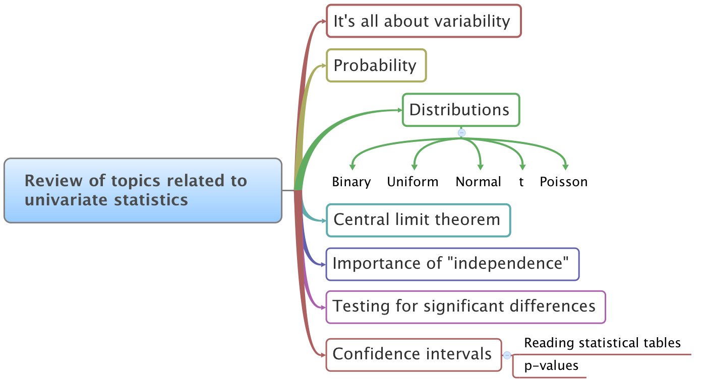

.. index::
	pair: references and readings; Univariate data
	
References and readings
=======================

Any standard statistics text book will cover the topics from this part of the book in much greater depth than these notes. Some that you might refer to before the class:
	
#. **Recommended**: Box, Hunter and Hunter, *Statistics for Experimenters*, Chapter 2 (both 1st and 2nd edition)
#. Hodges and Lehmann, *Basic Concepts of Probability and Statistics*
#. Hogg and Ledolter, *Engineering Statistics*
#. Montgomery and Runger, *Applied Statistics and Probability for Engineers*

Concepts
========

Concepts that you must be familiar with by the end of this section: 

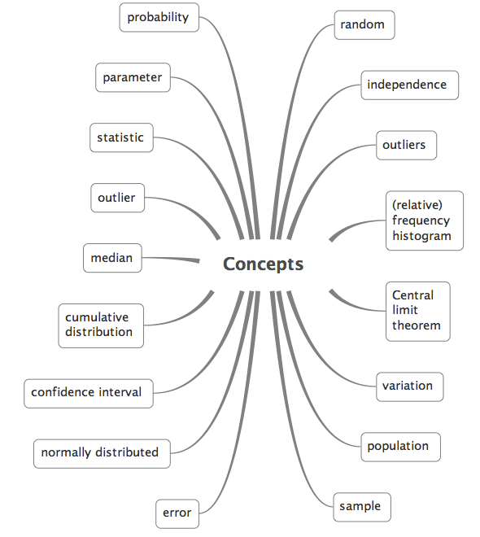

.. index::
	single: variability
	
.. _univariate-about-variability:

Variability
===========

Life is pretty boring without variability, and this book, and almost all the field of statistics would be unnecessary if things did not naturally vary.

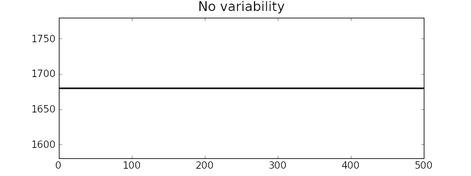
		
Fortunately, we have plenty of variability in our recorded data:

	- Raw material properties are not constant
	- Production disturbances:
	
		- external conditions change (ambient temperature, humidity)
		- pieces of plant equipment break down, wear out and are replaced
		
	.. figure:: images/variation-spikes.png
		:scale: 50
		:align: center
	
	- Feedback control systems introduce variability in your process, in order to reduce variability in another part of the process (think of what a feedback control system does)
		
	- Operating staff: introduce variability into a process
	- Measurement and sampling variability: sensor drift, spikes, noise, recalibration shifts, errors in our sample analysis
	
	.. figure:: images/variation-more.png
		:scale: 50
		:align: center	
	
	- Other unknown sources, often called "*error*" (note that the word *error* in statistics does not have the usual negative connotation from English).  These errors are all sources of variation which our imperfect knowledge of physics cannot account for.
	
	.. figure:: images/variation-some.png
		:scale: 50
		:align: center
	
All this variability, although a good opportunity to keep us process engineers employed, comes at a price as described next.

.. index::
	single: variability; cost of
	
The high cost of variability in your final product
~~~~~~~~~~~~~~~~~~~~~~~~~~~~~~~~~~~~~~~~~~~~~~~~~~~~~~~~~~~~~~~~
	
**Assertion**
	Customers expect both uniformity and low cost when they buy your product.  Variability defeats both objectives. 
	
Three broad outcomes are possible when you sell a variable product:

#. The customer may be totally unable to use your product for the intended purpose.  Imagine a food ingredient such as fresh milk, or a polymer with viscosity that is too high, or a motor oil with unsuitable properties that causes engine failure.

#. Your product leads to poor performance.   The user must compensate for the poor properties through additional cost: more energy will be required to work with a polymer whose melting point is higher than expected, longer reaction times will be required if the catalyst is not on specification.

#. Your brand is diminished: your products, even though good/acceptable will be considered with suspicion in the future.

	An extreme example was with the food poisoning and deaths that occurred due to the listeriosis outbreak at Maple Leaf Foods in 2008.  The bacterial count in food products is always 	non-zero, however there are established tolerance limits.

In addition to the risk of decreasing your market share (see the above 3 points), variability in your product also has these costs:

#. Inspection costs: to mitigate the above risks you must inspect your product before you ship it to your customers.  It is prohibitively expensive and inefficient to test every product (known as "*inspecting quality into your product*").  A production line with low variability on the other hand, does not require us to inspect every product.

#. Off-specification products: must be reworked, disposed of, or sold at a loss or much lower profit.  These costs are ultimately passed onto your customers, costing you money.
 
Note: the above discussion assumes that you are able to quantify product quality with one or more univariate quality metrics and that these metrics are independent of each other.  Quality is almost always a multivariate attribute of the product.  We :ref:`discuss multivariate methods <SECTION-latent-variable-modelling>` later in this book.

The high cost of variability in your raw materials
~~~~~~~~~~~~~~~~~~~~~~~~~~~~~~~~~~~~~~~~~~~~~~~~~~~~~~~~~~~~~~~~

.. TODO: Add a feedforward arrow to the diagram

Turning the above discussion around, with you on the receiving end of highly variable raw materials:

- If you do not implement any sort of process control system, then any variability in your raw materials is manifest as variability in your final product.

	.. figure:: images/feedback-control-variance-reduction-reduced-svg.png
		:width: 750px
		:align: center
		:scale: 50
	
- If you do take feedback or feed-forward corrective control: you have to incur additional cost, since you have to process materials that are not to specification: this will require energy and time, reducing your profit due to the supplier's raw material variability.

Dealing with variability
~~~~~~~~~~~~~~~~~~~~~~~~~~~~~~~~~~~~~~~~~~~~~~~~~~~~~~~~~~~~~~~~

So, how do we make progress despite this variability?  This whole book, and all of statistical data analysis, is about variability:

- in the :ref:`data visualization section <SECTION-data-visualization>` we gave some hints how to plot graphics that **show the variability** in our process clearly
- in this section we learn how to **quantify variability** and then **compare variability**
- later we consider how to :ref:`construct monitoring charts <SECTION-process-monitoring>` to **track variability**
- in the section on :ref:`least squares modelling <SECTION-least-squares-modelling>` we learn how **variation in one variable might affect another variable**
- with :ref:`designed experiments <SECTION-design-analysis-experiments>` we intentionally **introduce variation** into our process to learn more about the process (e.g. so that we can optimize our process for improved profitability); and
- and in the :ref:`latent variable modelling <SECTION-latent-variable-modelling>` section we learn how to deal with **multiple variables**, simultaneously extracting information from the data to understand how variability affects the process.

.. index::
	single: histograms
	
Histograms, probability and distributions
=========================================

A histogram is a summary of the variation in a measured variable.  It shows the *number* of samples that occur in a *category*: this is called a **frequency distribution**.  For example: number of children born, categorized against their gender: male or female.

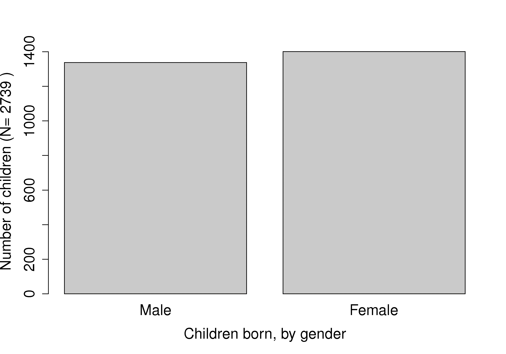

The category bins can be derived from a continuous variable.  Here is an example showing the mass of cartons of 1 kg of flour.  The continuous variable, mass, is divided into equal-size bins that cover the range of the available data.   Notice how the packaging system has to overfill each carton so that the vast majority of packages weight over 1 kg (what is the mean package mass?).  If the variability in the packaging system could be reduced, then the histogram can be shifted to the left reducing overfill.

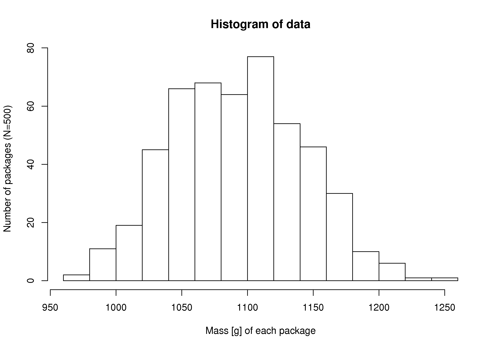

Plot histograms for the following:

- The grades for this class for a really easy test:

.. raw:: latex

	\vspace{3cm}
		
- The numbers thrown from a 6-sided die:

.. raw:: latex

	\vspace{3cm}

- The bacterial count per cubic inch, in packages of meat product shipped over the last year:

.. raw:: latex

	\vspace{3cm}

.. - seeds with the same size later become plants of different heights and yield of fruit
.. - people born in the same year have lives of different duration due to environmental, genetic, health and societal factors
.. - games such as poker, roulette, lotteries, dice
.. - analytical measurements taken in a laboratory, even by the same person or computerized process have different outcomes

In preparing the above histograms, what have you implicitly inferred about time-scales?  These histograms show the long-term probabilities of the process under consideration.  This is why  *concepts of chance and random phenomena* can be use to described a deterministic process.  Probabilities describe long-term expectations:

- The long-term sex ratio at birth 1.06:1 (boy:girl) is expected in Canada; but a newly pregnant mother would not know the sex.
- The long-term data from a process shows an 85% yield from our batch reactor; but tomorrow it could be 59% and the day after that 86%.
- Canadian life tables from 2002 (`Statistics Canada website <http://www.statcan.gc.ca/bsolc/olc-cel/olc-cel?catno=84-537-XIE&lang=eng>`_) show that females have a 98.86% chance of reaching age 30 and a 77.5% chance of reaching age 75; but people die at different ages due to different causes.
- We know that a fair die has a 16.67% chance of showing a 4 when thrown, but we cannot predict the value of the next throw.

Even if we have complete mechanistic knowledge of our process, the concepts from probability and statistics are useful to summarize and communicate information about past behaviour, and the expected future behaviour. 

How to create a frequency distribution:

	#. Decide what you are measuring:
	
		- acceptable or unacceptable metal appearance (yes/no, or categorical)
		- yield from the batch reactor (somewhat continuous - quantized due to rounding)
		- daily ambient temperature, in Kelvin (continuous)
	
	#. Decide on a resolution for the measurement axis
	
		- acceptable/unacceptable (1/0) code for the metal's appearance, or perhaps use a scale from 0 to 5 that grades the metal's appearance
		- batch yield is measured in 2% increments: reported either as 78, 80, 82, 84%, etc
		- temperature is measured to a 0.1 K precision, but we can report the values in bins of 5K
	
	#. Report the number of observations in the sample or population that fall within each bin (resolution step):
	
		- number of metal pieces with appearance level "acceptable" and "unacceptable", or number of pieces with appearance level 0, 1, 2, 3, 4, 5
		- number of batches with yield inside each bin level
		- number of temperature values inside each bin level
		
	#. Plot the number of observations in category as a bar plot.  If you plot the number of observations divided by the total number of observations, :math:`N`, then you are plotting the **relative frequency**.
	
A relative frequency is sometimes preferred:

- we do not need to report the total number of observations, :math:`N`
- it can be compared to other distributions
- if :math:`N` is large enough, then the relative frequency histogram starts to resemble the population's distribution
- the area under the histogram is equal to 1, and related to probability

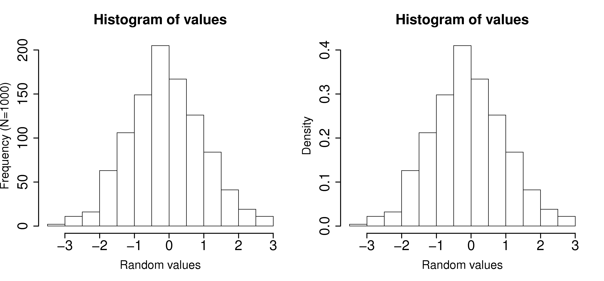
	
Some nomenclature
~~~~~~~~~~~~~~~~~~~~~~~~~~~~~~~~~~~~~~~~~~~~~~~~~~~~~~~~~~~~~~~~

We review here a couple of concepts that you should have seen in prior statistical work.

.. _univariate-population:

**Population**
	A large collection of observations that *might* occur; a set of *potential* measurements.  Some texts consider an infinite collection of observations, but a large number of observations is good enough.  We will use capital :math:`N` in this section to denote the population size.
	
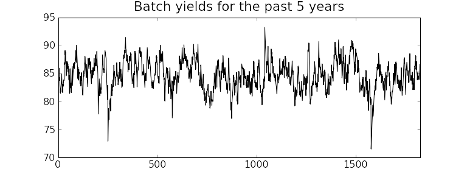

**Sample**
	A collection of observations that have *actually* occurred; a set of *existing* measurements.  We will use lowercase :math:`n` in this section to denote the sample size.
	
	In engineering applications where we have plenty of data, we can characterize the population from all available data.  *Example*: the viscosity of the polymer product, from all batches over the last 5 years (about 1 batch per day), is an excellent surrogate for the population viscosity.  Once we have characterized those measurements, future viscosity values will likely follow that same.

**Probability**
	The area under a plot of relative frequency distribution is equal to 1.  Probability is then a fraction of the area under the curve.
	
	Draw on your histograms from earlier:
	
	- The probability of a test grades less than 80%
	- The probability that the number thrown from a 6-sided die is less than or equal to 2
	- The bacterial count per cubic inch, in packages of meat product shipped over the last year is greater that 10,000.

**Parameter**
	A parameter is a value that describes the population's **distribution** in some way.  For example, the population mean.
	
**Statistic**
	A statistic is an estimate of one of the population's parameters.

**Mean (location)**

	The mean (average) is a measure of location (position) of the distribution.  For each measurement, :math:`x_i`, in your sample

	.. math::
		:nowrap:

			\begin{alignat*}{2}
				\text{Population mean:} &\qquad&  \mathcal{E}\left\{x \right\} = \mu &= \frac{1}{N}\sum{x} \\
				\text{Sample mean:}     &\qquad&                            \bar{x}  &= \frac{1}{n}\sum_{i=1}^{n}{x_i}
			\end{alignat*}
		
	.. code-block:: s

		x <- rnorm(50)   # a vector of 50 normally distributed random numbers
		mean(x)
	
	This is only one of several statistics that describes your data: if you told your customer that the average density of your liquid product was 1.421 g/L, and nothing further, the customer might believe that some lots of the same product could have a density of 0.824 g/L, or 2.519 g/L.  We need information in addition to the mean: the spread.

.. _univariate-variance:

**Variance (spread)**

	A measure of spread, or variance, is useful to quantify your distribution.  

	.. math::
		:nowrap:

	   	\begin{alignat*}{2}
	      	\text{Population variance}: &\qquad& \mathcal{V}\left\{x\right\} = \mathcal{E}\left\{ (x - \mu )^2\right\} = \sigma^2 &= \frac{1}{N}\sum{(x-\mu)^2} \\
			\text{Sample variance}:     &\qquad&                                                                             s^2  &= \frac{1}{n-1}\sum_{i=1}^{n}{(x_i - \bar{x})^2}
		\end{alignat*}

	Dividing by :math:`n-1` makes the variance statistic, :math:`s^2`, an unbiased estimator of the population variance, :math:`\sigma^2`.  However, in most engineering data sets our value for :math:`n` is large, so using a divisor of :math:`n` (which you might come across in computer software or other texts) rather than :math:`n-1` as shown here, has little difference.

	.. code-block:: s

		sd(x)     # for standard deviation
		var(x)    # for variance

..	Comment here on DOF

	**Degrees of freedom**: The denominator in the sample variance calculation, :math:`n-1`, is called the degrees of freedom.  We have one fewer than :math:`n` degrees of freedom, because there is a constraint that the sum of the deviations around :math:`\bar{x}` must add up to zero.  This constraint is from the definition of the mean.  However, if we knew what the sample mean was without having to estimate it, then we could subtract each :math:`x_i` from that value, and our degrees of freedom would be :math:`n`.

**Outliers**

	Outliers are hard to define precisely, but an acceptable definition is that an outlier is a point that is unusual, given the context of the surrounding data, as the following 2 sequences of numbers show (4024 is an outlier in the second sequence).

	* 4024, 5152, 2314, 6360, 4915, 9552, 2415, 6402, 6261
	* 4, 61, 12, 64, 4024, 52, -8, 67, 104, 24

**Median (location)**

	The median is an alternative measure of location.  It is a sample statistic, not a population statistic, and is computed by sorting the data and taking the middle value (or average of the middle 2 values, for even :math:`n`). It is also called a robust statistic, because it is insensitive (robust) to outliers in the data.  

	*Enrichment fact*: The median is the most robust estimator of the sample location: it has a breakdown of 50%, which means that 50% of the data need to be replaced with unusual values before the median breaks down as a suitable estimate. The mean on the other hand has a breakdown value of :math:`1/n`, as only one of the data points needs to be unusual to cause the mean to be a poor estimate.

	.. code-block:: s

		median(x)

**Median absolute deviation, MAD (spread)**

	A robust measure of spread is the MAD, *median absolute deviation*.   The name is descriptive of how the MAD is computed:

	.. math::
	
			\text{mad}\left\{ x_i \right\} = c \cdot \text{median}\left\{ \| x_i - \text{median}\left\{ x_i \right\}  \|  \right\} \qquad\qquad \text{where}\qquad c = 1.4826

	The constant :math:`c` makes the MAD consistent with the standard deviation when the observations :math:`x` are normally distributed. The MAD has a breakdown point of 50%, because like the median, we can replace half the data with outliers before the estimate becomes unbounded.

	.. code-block:: s

		mad(x)

	Enrichment reading (mandatory for 600-level students): read pages *1 to 8* of "Tutorial to Robust Statistics", Rousseeuw, PJ, *Journal of Chemometrics*, **5**, 1-20, 1991. `Link to the paper <http://dx.doi.org/10.1002/cem.1180050103>`_.

Distributions
===============

For each of the distributions we will:

#. show a typical plot of the probability function :math:`p(x)` against the variable's value :math:`x`
#. learn when to use that distribution with examples
#. know what the parameters of the distribution are

.. _univariate-binary-distribution:

Binary (Bernoulli distribution)
~~~~~~~~~~~~~~~~~~~~~~~~~~~~~~~~~~~~~~~~~~~~~~~~~~~~~~~~~~~~~~~~

Systems that have binary outcomes (pass/fail; yes/no) must obey the probability principle that: :math:`p(\text{pass}) + p(\text{fail}) = 1`.  For example, a histogram for a system that produces 70% acceptable product looks like:

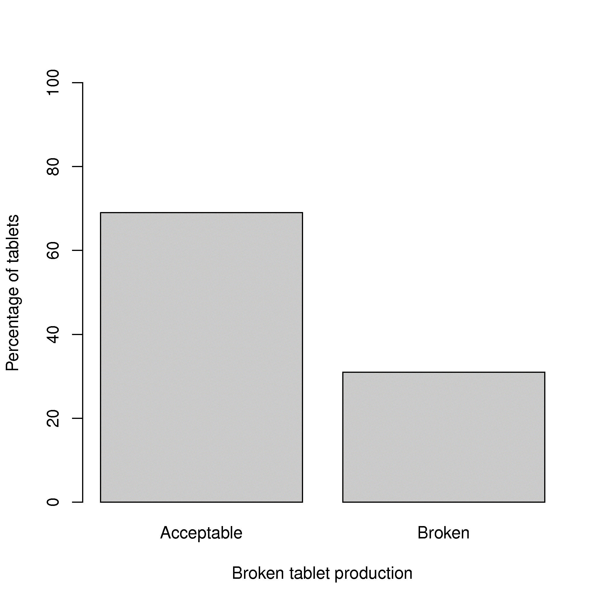

If the each observation is independent of the other, then:

	- For the above system where :math:`p(\text{pass}) = 0.7`, what is probability of seeing the following outcome: **pass**, **pass**, **pass** (3 times in a row)?

		.. only:: inst

			:math:`(0.7)(0.7)(0.7) = 0.343`, about one third of 3-element sequences

	- What is the probability of seeing: **pass**, **fail**, **pass**, **fail**, **pass**, **fail**?

		.. only:: inst

			:math:`(0.7)(0.3)(0.7)(0.3)(0.7)(0.3) = 0.0093`, less than 1% of 6-element sequences
	
You work in a company that produces tablets.  The machine creates acceptable, unbroken tablets 97% of the time.

	- In a batch of 144 tablets, how many tablets are unacceptable?
	
		.. only:: inst

			:math:`144 \times (1-0.97) = 4.32`, or about 5 per batch
		
	- You take a random sample of :math:`n` tablets; what is the chance that all :math:`n` tablets are acceptable:
	
		=========== ========= ========
		Sample size p=97%     p=95%
		=========== ========= ========
		n=10
		n=50
		n=100
		=========== ========= ========
		
	- Repeat the question above for a machine that creates acceptable tablets 95% of the time.  Are you surprised by the difference in the answers?
	
Uniform distribution
~~~~~~~~~~~~~~~~~~~~

A uniform distribution arises when an observation is the outcome, where each possibility is equally as likely to occur as all the others.  The classic example are dice: each face of a die is equally as likely to show up as any of the others.  This is a discrete, uniform distribution.

The probability distribution for an event with 4 possible outcomes is shown below:

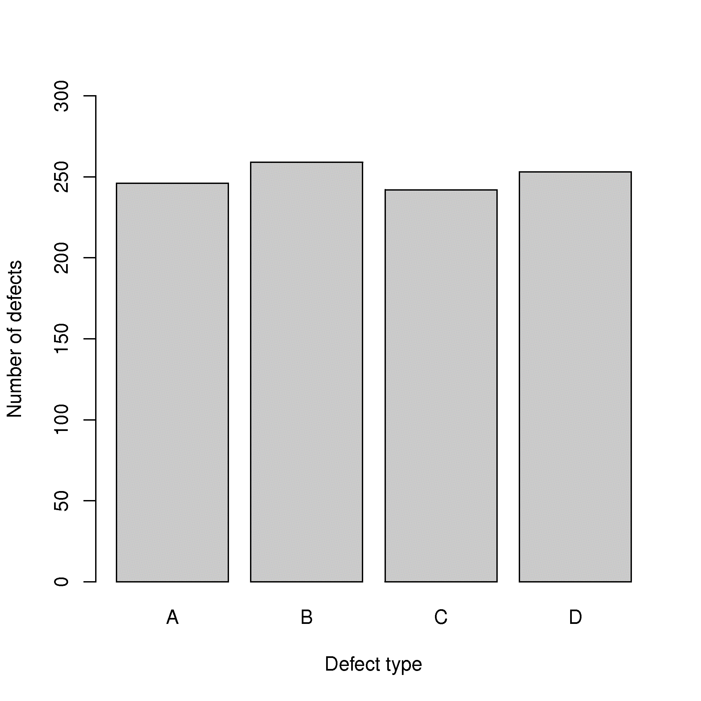

You can simulate uniformly distributed random numbers in most software packages.  As an example, to generate 50 uniformly distributed random *integers* between values of 2 and 10, inclusive::

			x <- as.integer(runif(50, 2, 11))

.. Other codes		
	**MATLAB/Octave**:
	
		.. code-block:: matlab

			round(rand(50, 1) * 8 + 2) 
		
	**Python**:
		
		.. code-block:: python
		
			import numpy as np
			(np.random.rand(50, 1) * 8 + 2).round()

A continuous, uniform distribution arises when there is equal probability of every measurement occurring within a given lower- and upper-bound.  This sort of phenomena is not often found in practice.  Usually, continuous measurements follow some other distribution, of which we will discuss the normal and :math:`t`-distribution next.

Normal distribution
~~~~~~~~~~~~~~~~~~~

Central limit theorem 
^^^^^^^^^^^^^^^^^^^^^^^^^^^^^^^^^^^^^^^^^^^

The limit theorem plays a central role in the theory of probability and in the derivation of the normal distribution.  We don't prove this theorem here, but we only use the result that the average of a sequence of values from any distribution will approach the normal distribution, provided the original distribution has finite variance.
	
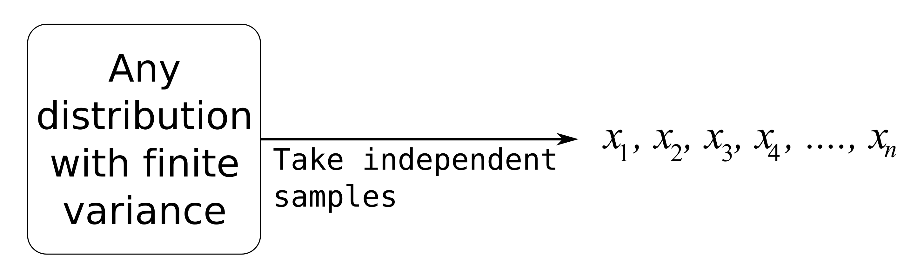
	
The only assumption we require for the central limit theorem is that the samples used to compute the average are independent.  In particular, we **do not** require the original data to be normally distributed.  The average produced from these data will be be more nearly normal though.

Imagine a case where we are throwing dice.  The following distributions are obtained when we throw a die :math:`M` times and we plot the distribution of the *average* of these :math:`M` throws.

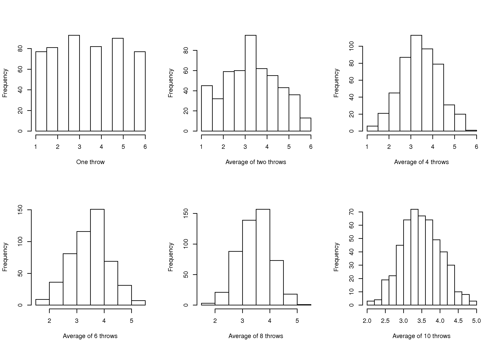

As one sees from the above figures, the distribution from these averages quickly takes the shape of the so-called *normal distribution*.  As :math:`M` increases, the y-axis starts to form a peak.  

What is the engineering significance of this averaging process (which is really just a weighted summation)?  Many of the quantities we measure are bulk properties.  We can conceptually imagine that the bulk property measured is the combination of the same property, measured on smaller and smaller components. Even if the measurement on the smaller component is not normally distributed, the bulk property will be much more normally distributed.

Independence 
^^^^^^^^^^^^^^^^^^^^^^^^^^^^^^^^^^^^^^^^^^^

The assumption of independence is widely used in statistical work and is a condition for using the central limit theorem.  

.. note:: The assumption of independence means the the samples we have in front of us are *randomly* taken from a population.  If two samples are independent, there is no possible relationship between them.

We frequently violate this assumption of independence in both engineering work and other data samples.  Discuss these examples with your classmates:

- A questionnaire is given to students. What happens if students discuss the questionnaire prior to handing it in?

 	.. only:: inst	
		
		We are not going to receive :math:`n` independent answers.
		
- The snowfall, recorded in inches, for the last 30 days.

	.. only:: inst
	
		These data are not independent - if it snows today, it can likely snow tomorrow.  These data are not useful as a sample of typical snowfall, however they are useful for complaining about the weather.
		
- Snowfall, recorded on 3 January for every year since 1976: independent or not? 

	.. only:: inst
	
		These sampled data will be independent. 
		
- The impurity values in the last 10 batches of product produced.    Which of the 3 time sequences shown is independent?

 	.. only:: inst

		In chemical processes there is often a transfer from batch-to-batch: we usually use the same lot of raw materials for successive batches, the batch reactor may not have be cleaned properly between each run, and so on.  It is very likely that two successive batches (:math:`k` and :math:`k+1`) are somewhat related, and less likely that batch :math:`k` and :math:`k+2` are related.  In the figure below, can you see which sequence of values are independent?
		
 	.. figure:: images/simulate-independence.png
		:align: center
		:scale: 90
		
- We need a highly reliable pressure release system.  Manufacturer A sells a system that fails 1 in every 100 occasions, and manufacturer B sells a system that fails 3 times in every 1000 occasions.  What is
	
	- :math:`p(\text{A}_\text{fails}) =` 
	- :math:`p(\text{B}_\text{fails}) =` 
	- :math:`p(\text{both A and B fail}) =` 
	- For the previous question, what does it mean for system A to be totally independent of system B?
	
		.. only:: inst
		
			It means the 2 systems must be installed in parallel, so that there is no interaction between them at all.
	
.. See Hodges and Lehmann (1970): there is a whole Chapter devoted to it.

.. See: http://www.rsscse.org.uk/ts/gtb/contents.html: article on Teaching Independence

		
Formal definition for the normal distribution
^^^^^^^^^^^^^^^^^^^^^^^^^^^^^^^^^^^^^^^^^^^^^^

.. math:: p(x) = \dfrac{1}{\sqrt{2\pi \sigma^2}}e^{-\dfrac{\left(x-\mu\right)^2}{2\sigma^2}}
	:label: CLT
	
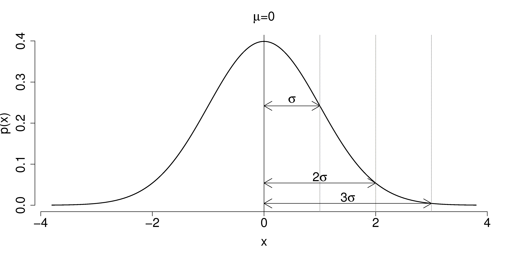
	
- :math:`x` is the variable of interest
- :math:`p(x)` is the probability of obtaining that value of :math:`x`
- :math:`\mu` is the population average for variable :math:`x`
- :math:`\sigma` is the population standard deviation for variable :math:`x`, and is a positive quantity.

#. What is the maximum value of :math:`p(x)` and where does it occur, using the formula in equation :eq:`CLT`
#. What happens to the shape of :math:`p(x)` as :math:`\sigma` gets larger ?
#. What happens to the shape of :math:`p(x)` as :math:`\sigma \rightarrow 0` ?
#. Fill out this table:

	.. csv-table:: 
	   :header: :math:`\\mu`, :math:`\\sigma`, :math:`x`, :math:`p(x)`
	   :widths: 30, 30, 30, 80

		0, 1, 0,
		0, 1, 1,
		0, 1, -1,
		
Some useful points:

	- :math:`\sigma` is the distance from the mean to the point of inflection
	- the area from :math:`-\sigma` to :math:`\sigma` is about 70% (68.3% exactly) of the distribution, with about 15% outside the :math:`\pm \sigma` tails
	- the tail area outside :math:`\pm 2\sigma` is about 5% (2.275 outside each tail)

How can you calculate these in R?

	.. code-block:: s

		> dnorm(-1, mean=0, sd=1)    # gives value of p(x = -1) when mu=0, sigma=1
		[1] 0.2419707
		
		> pnorm(-1, mean=0, sd=1)    # gives area from -inf to -1, for mu=0, sigma=1
		[1] 0.1586553
		
		> pnorm(1, mean=0, sd=1)     # gives area from -inf to +1, for mu=0, sigma=1
		[1] 0.8413447
		
		> pnorm(3, mean=0, sd=3)     # spread is wider, but fractional area the same
		[1] 0.8413447

In software packages we can set the mean and standard deviation (as shown above in the source code output) and get area of the normal distribution.  However, you might still find yourself having to refer to tables of cumulative area in the normal distribution, instead of using the ``pnorm()`` function.  If you page to the appendix of most statistical texts you will find these tables.  Since the tables cannot be produced for all combinations of mean and standard deviation, they use a standard form.

.. math::

	z_i = \frac{x_i - \text{mean}}{\text{standard deviation}}
	
What is the value that you should use for the ``mean`` and ``standard deviation``?  It depends on the context.  Imagine our values of :math:`x_i` come from the normal distribution, with mean of 34.2 and variance of 55.  Then we could write :math:`x \sim \mathcal{N}(34.2, 55)`, which is short-hand notation of saying the same thing.  The equivalent :math:`z`-values for these :math:`x` data would be: :math:`z_i = \dfrac{x_i - 34.2}{\sqrt{55}}`.   This transformation **does not** change the distribution of the original :math:`x`, it only changes the parameters of the distribution.  Now :math:`z` is distributed according to the normal distribution as :math:`z \sim \mathcal{N}(0.0, 1.0)`.  What are the units of :math:`z` if :math:`x` were measured in kg, for example?

This is a common statistical technique, to standardize a variable, which we will see several times.  Standardization takes our variable from :math:`x \sim \mathcal{N}(\text{some mean}, \text{some variance})` and converts it to :math:`z \sim \mathcal{N}(0.0, 1.0)`.  Standardization allows us to straightforwardly compare 2 variables that may have different means and spreads. 

Enrichment (strongly suggested): consult a statistical table found in most statistical textbooks for the normal distribution.  Make sure you can firstly understand how to read the table, should you need to do so in the future.  Secondly, duplicate a few entries in the table using R.  Then complete these small exercises using both the tables and R.

#. Assume :math:`x`, the measurement of biological activity for a drug, is normally distributed with mean of 26.2 and standard deviation of 9.2.  What is the probability of obtaining an activity reading less than or equal to 30.0?

	.. raw:: latex

		\vspace{3.5cm}

#. Assume :math:`x` is the yield for a batch process, with mean of 85% and variance of 16.  What proportion of batch yield values lie between 70 and 95% ?

	.. raw:: latex

		\vspace{3cm}

Checking for normality: using a qq-plot
^^^^^^^^^^^^^^^^^^^^^^^^^^^^^^^^^^^^^^^^^^^

Often we are not sure if a sample of data can be assumed to be normally distributed.  This section shows you how to assess if data are normally distributed, or not. 

Before we look at this method, we need to introduce the concept of the inverse cumulative distribution function (inverse CDF).  Recall the **cumulative distribution** is the area underneath the distribution function, :math:`p(x)`, which goes from :math:`-\infty` to :math:`x`.  For example, the area from :math:`-\infty` to :math:`x=-1` is about 15%, as we showed earlier, and we use the ``pnorm()`` function in R to calculate that.  
	
Now the **inverse cumulative distribution** is used when we know the area, but want to get back to the value along the :math:`x-\text{axis}`.  For example, below which value of :math:`x` does 95% of the area lie for a standardized normal distribution?  Answer: :math:`z=1.64`.  In R we use the ``qnorm(0.95, mean=0, sd=1)`` to calculate these values.  The ``q`` stands for `quantile <http://en.wikipedia.org/wiki/Quantile>`_, because we give it the quantile at it returns the x-value: e.g. ``qnorm(0.5)`` gives 0.0.

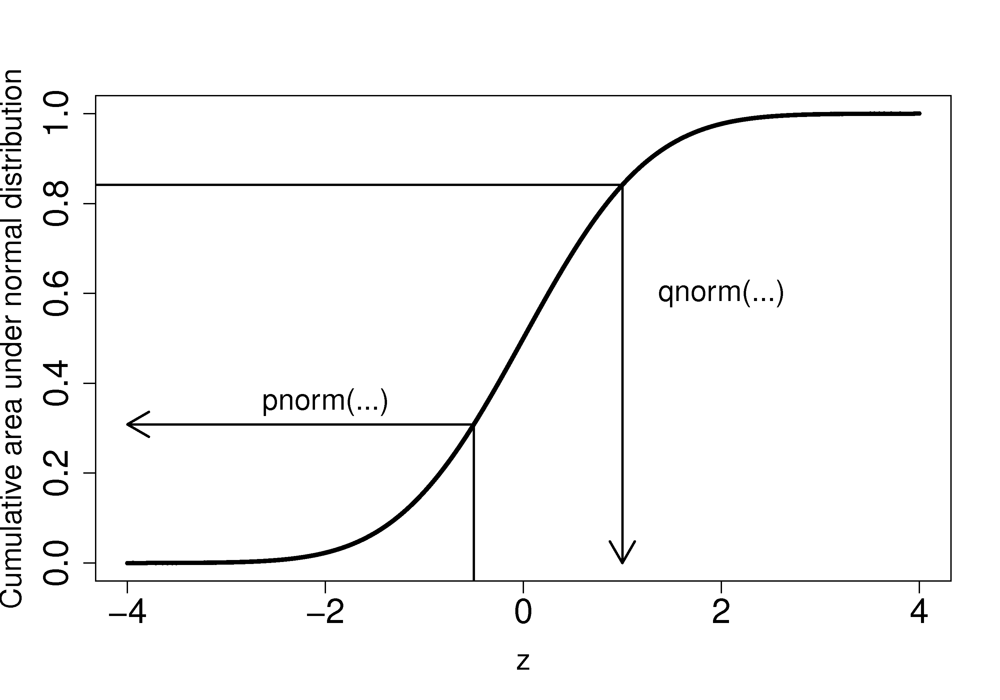
		
On to checking for normality.  We approach this problem by first constructing quantities that we would expect for truly normally distributed data.  Then, secondly, we construct the same quantities for the actual data.  A plot of these 2 quantities against each other will reveal if the data are normal, or not.

*	Imagine we have :math:`N` observations which are normally distributed.  Sort the data from smallest to largest.  The first data point should be the :math:`(1/N \times 100)` percentile, the next data point is the :math:`(2/N \times 100)/N` percentile, the middle, sorted data point is the 50th percentile, :math:`(1/2 \times 100)`, and the last, sorted data point is the :math:`(N/N \times 100)` percentile.

	The middle, sorted data point has a :math:`z`-value on the standardized scale of 0.0, which we known from using ``qnorm(0.5)``, from the inverse cumulative distribution function.  By definition, 50% of the data should lie below this point. The first data point will be at ``qnorm(1/N)``, the second at ``qnorm(2/N)``, and so on.  In general, the :math:`i^\text{th}` sorted point should be at ``qnorm((i-0.5)/N)``, for values of :math:`i = 1, 2, \ldots, N`.  We subtract off 0.5 to account for the fact that ``qnorm(1.0) = Inf``.  So we construct this vector of theoretically expected quantities from the inverse cumulative distribution function.
	
	.. code-block:: s
	
		N = 10
		index <- seq(1, N)
		P <- (index - 0.5) / N
		theoretical.quantity <- qnorm(P)
		[1] -1.64 -1.04 -0.674 -0.385 -0.126  0.125  0.385  0.6744 1.036  1.64

*	We also construct the actual quantities for the data.  First, standardize the data by subtracting off the mean and dividing by the standard deviation.  Here is an example of 10 batch yields (see actual values below).  The mean yield is 80.0 and the standard deviation is 8.35.  The standardized yields are shown by subtracting off the mean and dividing by the standard deviation.  Then the standardized values are sorted.  Compare them to the theoretical quantities.

	.. code-block:: s

		yields = c(86.2, 85.7, 71.9, 95.3, 77.1, 71.4, 68.9, 78.9, 86.9, 78.4)
		mean.yield = mean(yields)		# 80.0
		sd.yield = sd(yields)			# 8.35
	
		yields.z = (yields - mean.yield)/sd.yield
		[1] 0.734  0.674 -0.978  1.82 -0.35 -1.04 -1.34 -0.140  0.818 -0.200
	
		yields.z.sorted = sort(yields.z)
		[1] -1.34 -1.04 -0.978 -0.355 -0.200 -0.140  0.674  0.734  0.818  1.82
		
		theoretical.quantity  # numbers are rounded in the printed output
		[1] -1.64 -1.04 -0.674 -0.385 -0.126  0.125  0.385  0.6744 1.036  1.64
	
*	The final step is to plot this data in a suitable way.  If the sampled quantities match the theoretical quantities, then a scatter plot of these numbers should form a 45 degree line.  

	.. code-block:: s
		
		plot(theoretical.quantity, yields.z.sorted, type="p")
		
	.. figure:: images/qqplot-derivation.png
		:align: center
		:width: 750px
		:scale: 50

A ready-made function already exists in R that runs the calculations and shows a scatter plot.  The 45 degree line is added using the ``qqline(...data...)`` function.

	.. code-block:: s
		
		qqnorm(yields)
		qqline(yields)

	.. figure:: images/qqplot-from-R.png
		:align: center
		:width: 750px
		:scale: 50
	
The R plot rescales the Y-axis (sample quantiles) back to the original units to make interpretation easier.  We expect some departure from the 45 degree line due to the fact that these are only a sample of data.  However, large deviation indicates the data are not normally distributed.  An error region can be superimposed around the 45 degree line, but this is not discussed here (see enrichment topics).

The qq-plot, quantile-quantile plot, shows the quantiles of 2 distributions against each other.  In fact, we can use the horizontal axis for any distribution, it need not be the theoretical normal distribution.  We might be interested if our data follow an `F-distribution <http://en.wikipedia.org/wiki/F-distribution>`_ (not covered in this book), then we could use the quantiles for that theoretical distribution on the horizontal axis.

**Enrichment topics**

#. Add the ``car`` library to R (see the *Package Installer* menu option) and use the ``qq.plot(yields)`` function to see the error bars for the yield data.

	.. code-block:: s

		library(car)		# Install the car library before running this command
		qq.plot(yields)		# Draws a qq-plot with error lines

#. We can use the qq-plot to compare any 2 *samples of data*, even if they have different values of :math:`N`, by calculating the quantiles for each sample at different step quantiles (e.g. 1, 2, 3, 4, 5, 10, 15, .... 95, 96, 97, 98, 99), then plot the qq-plot for the two samples.  You can calculate quantiles for any sample of data using the ``quantile`` function in R.  The simple example below shows how to compare the qq-plot for 1000 normal distribution samples against 2000 :math:`t`-distribution samples

	.. code-block:: s
	
		rand.norm <- rnorm(1000)
		rand.t <- rt(2000, df=3)   # Use heavy tails
		quantiles <- c(1, 2, 3, 4, seq(5, 95, 5), 96, 97, 98, 99)/100
		norm.quantiles <- quantile(rand.norm, quantiles)
		t.quantiles <- quantile(rand.t, quantiles)
		plot(t.quantiles, norm.quantiles)

t-distribution
~~~~~~~~~~~~~~~~~~~~~~~~~~~~~~~~~~~~~~~~~~~~~~~~~~~~~~~~~~~~~~~~

Suppose we have a quantity of interest for a process, such as the daily profit per kilogram of raw material, or the viscosity of the final product.  After using the methods just described to check for normality, we might be reasonably certain that the data follow a normal distribution.  So assuming the quantity is distributed as :math:`\mathcal{N}(\mu, \sigma^2)` **and** by taking independent samples, as shown here in the figure,

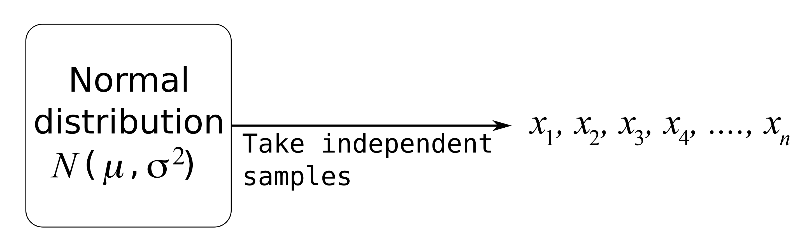

we can make the following statements:

#. An estimate of the population mean is given by :math:`\bar{x} = \displaystyle  \dfrac{1}{n}  \sum_i^{i=n}{x_i}\qquad\qquad` (*this is not new*)
#. The estimated population variance is :math:`s^2 =\displaystyle  \frac{1}{n-1}\sum_i^{i=n}{(x_i - \bar{x})^2}\qquad\qquad` (*we've seen this already*)
#. This is new: the estimated mean, :math:`\bar{x}`, is also normally distributed with mean of :math:`\mu` and variance of :math:`\sigma^2/n`; mathematically: :math:`\displaystyle \bar{x} \sim \mathcal{N}\left(\mu, \sigma^2/n\right)`.  What does this mean and why are we interested in this?  It says that repeated estimates of the mean will be an accurate (unbiased) estimate of the population mean, and interestingly, the variance of that estimate is decreased by using a greater number of samples, :math:`n`, to estimate that mean.  This makes intuitive sense: the more **independent** samples of data we have, the lower the error (variance) in our estimate.
#. Create a new variable :math:`z = \dfrac{\bar{x} - \mu}{s/\sqrt{n}}`, which subtracts off the population mean from our estimate of the mean, and divide through by the variance for :math:`\bar{x}`.  If our estimate of the population mean, :math:`\bar{x}`, is accurate, then the numerator is close to zero.  Dividing through by :math:`s/\sqrt{n}` firstly makes the :math:`z` variable dimensionless, and secondly, scales :math:`z` up or down according to the certainty we have in our estimate of :math:`\bar{x}`.  This new variable :math:`z` is distributed according to the :math:`t`-distribution.  We say that :math:`z` follows the :math:`t`-distribution with :math:`n-1` degrees of freedom, where the degrees of freedom refer to those from the calculating the standard deviation.
#. Note that the new variable :math:`z` only requires we know the population mean (:math:`\mu`), not the population variance; rather we use our estimate of the variance :math:`s/\sqrt{n}` in place of the population variance.

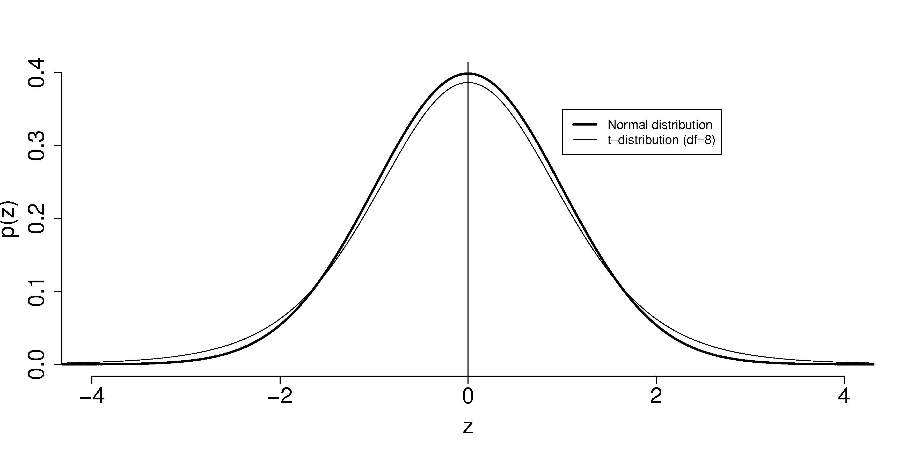

..  
	From Box, Hunter and Hunter, 1st edition, p 50-51
	To use the :math:`t`-distribution we must ensure that these 3 conditions are true:

	#. the sampled values :math:`y_i` are normally distributed around the mean :math:`\mu` and have variance :math:`\sigma` (note that we do not need to know the value of :math:`\sigma`)
	#. the variance estimate, :math:`s` is distributed independently of :math:`y`
	#. the quantity :math:`s^2` is calculated from normally and independently distributed observations having variance :math:`\sigma^2`.

.. todo:: see p 295 of Devore here for in-class example

Calculating the t-distribution
^^^^^^^^^^^^^^^^^^^^^^^^^^^^^^

- In R we use the function ``dt(x=..., df=...)`` to give us the values of the probability density values, :math:`p(x)`, of the :math:`t`-distribution (compare this to the ``dnorm(x, mean=..., sd=...)`` function for the normal distribution).

- The cumulative area from :math:`-\infty` to :math:`x` under the probability density curve gives us the probability that values less than or equal to :math:`x` could be observed.  It is calculated in R using ``pt(q=..., df=...)``.  For example, ``pt(1.0, df=8)`` is 0.8267.  Compare this to the R function for the normal distribution: ``pnorm(1.0, mean=0, sd=1)`` which returns 0.8413.

- And similarly to the ``qnorm`` function which returns the ordinate for a given area under the normal distribution, the function ``qt(0.8267, df=8)`` returns 0.9999857, close enough to 1.0, which is the inverse of the previous example.

Using the t-distribution
^^^^^^^^^^^^^^^^^^^^^^^^^^^^^^

There is no practical engineering sense is showing the formula for the :math:`t`-distribution, `look it up in a reference <http://en.wikipedia.org/wiki/Student%27s_t-distribution>`_ if you are interested.  But in R, we use the ``dt(x, df=...)`` function to give us the values of the :math:`t`-distribution for a given value of :math:`x` which has been computed with ``df`` degrees of freedom.  We use the :math:`t`-distribution in calculations related to a sample *mean*, and it is the sample mean that is used as the :math:`x` value in the distribution.  This is why the distribution is only a function of the degrees of freedom.

Let's return to our viscosity example.  We take a large bale of polymer composite from our line and using good sampling techniques, we take 9 independent samples from the bale and measure the viscosity in the lab for each sample.  These samples are independent estimates of the population (bale) viscosity.  We will believe these samples follow a normal distribution (we could confirm this in practice by running tests and verifying the samples are normally distributed). 

Here are 9 sampled values:  ``23, 19, 17, 18, 24, 26, 21, 14, 18``. The sample average is 20 units.

#. Calculate an estimate of the standard deviation.

	.. only:: inst

		:math:`s = 3.81`
	
#. What is the distribution of the sample average?  What are the parameters of that distribution?

	.. only:: inst

		The sample average is normally distributed as :math:`\mathcal{N}\left(\mu, \sigma^2/n \right)`
	
#. Construct an interval, symbolically, that will contain, with 95% certainty (probability), the population mean of the viscosity.  Now assume that for some hypothetical reason we know the standard deviation of the bale's viscosity is :math:`\sigma=3.5` units.  Using a computer, calculate the population mean's interval numerically.

	.. only:: inst
	
		The interval is :math:`\displaystyle \bar{x}  - c_n\frac{\sigma}{\sqrt{n}} < \mu < \bar{x}  + c_n\frac{\sigma}{\sqrt{n}}`.  The values of :math:`c_n` are ``qnorm(1 - 0.05/2) = 1.95996``.  So there is 95% chance that the interval :math:`\pm \ 2.286` contains :math:`\mu` (2.286 = 3.5/sqrt(9)*1.95996).
	
#. Now construct the :math:`z`-value for the sample average.  

	- What distribution does this :math:`z`-value follow?  Be specific in your answer.
	
		.. only:: inst

			It follows the :math:`t`-distribution with 8 degrees of freedom.
		
	- Calculate the lower and upper bounds of the interval that spans 95\% of the area of this distribution.
	
		.. raw:: latex

			\vspace{3cm}
	
		.. only:: inst
		
			From the R software::
		
				qt(0.025, df=8)  # also check qt(0.975, df=8)
			
	- Substitute the :math:`z`-value, symbolically, into this interval.  What is the interval for the population mean?
	
		.. raw:: latex

			\vspace{5cm}
	
		.. only:: inst

			The interval is :math:`\displaystyle \bar{x}  - c_t\frac{s}{\sqrt{n}} < \mu < \bar{x}  + c_t\frac{s}{\sqrt{n}}`. The values of :math:`c_t` are :math:`\pm` ``qt(1 - 0.05/2, df=8) = 2.306004``.  So there is 95% chance that the interval :math:`\pm \ 2.929` contains :math:`\mu` (2.929 = 3.81/sqrt(9)*2.306).
		
#. Compare the answers for parts 3 and 4 of the above questions. What is the advantage of the interval calculated in part 4?

	.. raw:: latex

		\vspace{2cm}

	.. only:: inst
	
		The interval calculation in part 3 requires knowledge of the standard deviation, which is not always available.  The confidence interval when we use the estimate of the standard deviation, :math:`s` is often wider, because the :math:`c_t` value is bigger, indicating our lower certainty in using an estimate of :math:`\sigma`.
	
.. sum((x-20) * (x-20)) = 116, DOF=8, s^2 = 116/8 = 14.5, s=3.81.  Distribution is normal, mean=\mu, stddev=3.5/sqrt(9) = (3.5^2)/9 = 2.286
.. s/sqrt(n) = 3.81/sqrt(9) = 1.27

.. The value of :math:`\bar{x}` is not normally distributed, it is :math:`t`distributed.  This means that if we had to repeatedly calculate :math:`\bar{x}`, those averages would follow a :math:`t`distribution, even though the source values, :math:`x_i` are normally distributed. 

.. another example
	
Poisson distribution
~~~~~~~~~~~~~~~~~~~~~~~~~~~~~~~~~~~~~~~~~~~~~~~~~~~~~~~~~~~~~~~~

.. note::

	This section is for enrichment for 400-level, but mandatory for 600-level students (self-study).

The Poisson distribution is useful to characterize rare events (number of cell divisions in a small time unit), system failures and breakdowns, or number of flaws on a product (contaminations per cubic millimetre).  These are events that have a very small probability of occurring within a given time interval or unit area (e.g. pump failure probability per minute = 0.000002), but there are many opportunities for the event to possibly occur (e.g. the pump runs continuously, but there are many minutes in the day).  A key assumption is that the events must be independent.  If one pump breaks down, then the other pumps must not be affected; if one flaw is produced per unit area of the product, then other flaws that appear on the product must be independent of the first flaw.

Let :math:`n` = number of opportunities for the event to occur.  If this is a time-based system, then it would be the number of minutes the pump is running.  If it were an area/volume based system, then it might be the number of square inches or cubic millimetres of the product.  Let :math:`p` = probability of the event occurring: e.g. :math:`p = 0.000002` chance per minute of failure, or :math:`p = 0.002` of a flaw being produced per square inch.   The rate at which the event occurs is then given by :math:`\eta = np` and is a count of events per unit time or per unit area.  A value for :math:`p` can be found using historical data.

There are two important properties:

#. The mean of the distribution is the rate at which the unusual events occur = :math:`\eta = np`
#. The variance of the distribution is also :math:`\eta`.  This property is particularly interesting - state in your own words what this implies.

Formally, the Poisson distribution can be written as :math:`\displaystyle \frac{e^{-\eta}\eta^{x}}{x!}`, with a plot as shown for :math:`\eta = 4`.  Please note the lines are only guides, the probability is only defined at the integer values marked with a circle.  

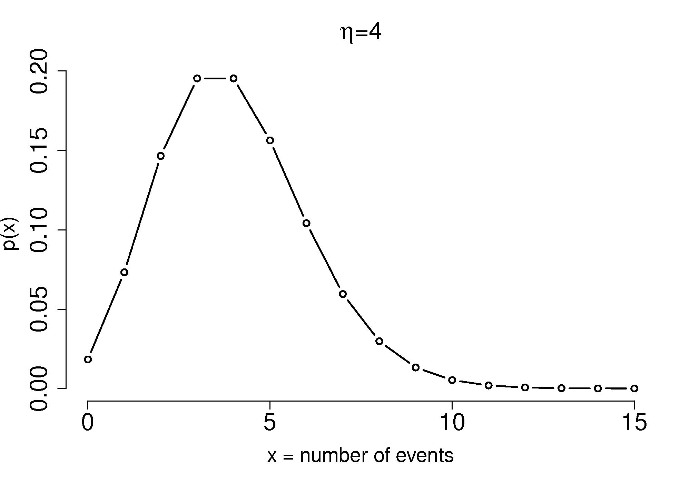
	
:math:`p(x)` expresses the probability that there will be :math:`x` occurrences (must be an integer) of this rare event in the same interval of time or unit area as :math:`\eta` was measured.

*Example*: Equipment in a chemical plant can and will fail.  Since it is a rare event, let's use the Poisson distribution to model the failure rates.  Historical records on a plant show that a particular supplier's pumps are, on average, prone to failure in a month with probability :math:`p = 0.01` (1 in 100 chance of failure each month).  There are 50 such pumps in use throughout the plant. *What is the probability that* :math:`x` *pumps will fail this year?*

	:math:`\eta = 12\,\frac{\displaystyle \text{months}}{\displaystyle \text{year}} \times 50\,\text{pumps} \times 0.01\,\frac{\displaystyle\text{failure}}{\displaystyle\text{month}} = 6\,\frac{\displaystyle\text{pump failures}}{\displaystyle\text{year}}`

	.. csv-table:: 
	   :header: :math:`x`, :math:`p(x)`
	   :widths: 30, 80

		0, 0.25% chance
		1, 1.5%
		3, 8.9
		6, 16%
		10, 4.1%
		15, 0.1%
		
.. code-block:: s

    > x <- c(0, 1, 3, 6, 10, 15)
    > dpois(x, lambda=6)    # Note: R calls the Poisson parameter 'lambda'
	[1] 0.0025 0.0149 0.0892 0.161 0.0413 0.001
	
	
.. _univariate-confidence-intervals:

Confidence Intervals
====================

.. See code in yield-exercise.R for the R source code

So far we have calculated point estimates of parameters, called statistics.  In the last section in the :math:`t`-distribution we already calculated a confidence interval.  In this section we formalize the idea, starting with an example.

*Example*: a new customer is evaluating your product, they would like a confidence interval for the impurity level in your sulphuric acid.  You can tell them: "*the range from 429ppm to 673ppm contains the true impurity level with 95% confidence*".  This is a compact representation of the impurity level.  You could have told your potential customer that

	- the sample mean from the last year of data is 551 ppm
	- the sample standard deviation from the last year of data is 102 ppm
	- the last year of data are normally distributed

But a confidence interval conveys a similar concept, in a useful manner.  It gives an estimate of the location and spread and uncertainty associated with that parameter (e.g. impurity level in this case).

Let's return to the previous viscosity example, where we had the 9 viscosity measurements ``23, 19, 17, 18, 24, 26, 21, 14, 18``. The sample average was :math:`\bar{x} = 20.0` and the standard deviation was :math:`s = 3.81`.  The :math:`z`-value (also called a deviate) is: :math:`z = \dfrac{\bar{x} - \mu}{s/\sqrt{n}}`.  And we showed this was distributed according to the :math:`t`-distribution with 8 degrees of freedom.  

Calculating a confidence interval requires we find a range within which that :math:`z`-value occurs.  Most often we are interested in symmetrical confidence intervals, so the procedure is:

.. math::
		:label: CI-mean-variance-unknown
		
		\begin{array}{rcccl} 
			  - c_t                                              &\leq& \displaystyle \frac{\bar{x} - \mu}{s/\sqrt{n}} &\leq &  +c_t\\
			\bar{x}  - c_t \dfrac{s}{\sqrt{n}}                   &\leq&  \mu                                                 &\leq& \bar{x}  + c_t\dfrac{s}{\sqrt{n}} \\
			  \text{LB}                                          &\leq&  \mu                                                 &\leq& \text{UB}
		\end{array}
	
The values of :math:`c_t` are ``qt(1 - 0.05/2, df=8) = 2.306004`` when we used the 95% confidence interval (2.5% in each tail).  We calculated that LB = 20.0 - 2.92 = 17.1 and that UB = 20.0 + 2.92 = 22.9.   

Interpreting the confidence interval
~~~~~~~~~~~~~~~~~~~~~~~~~~~~~~~~~~~~~~~~~~~~~~~~~~~~~~~~~~~~~~~~

- The expression in :eq:`CI-mean-variance-unknown` **does not** mean that :math:`\bar{x}` lies in the interval from LB (lower-bound) to UB (upper-bound).  It would be incorrect to say that the viscosity is 20 units and lies inside the range of 17.1 to 22.9 with a 95% probability.
	
- What the expression in :eq:`CI-mean-variance-unknown` **does mean**  is that :math:`\mu` lies in this interval.  The confidence interval is a range of possible values for :math:`\mu`, not for :math:`\bar{x}`.  Confidence intervals are for parameters, not for statistics.
	
- Notice that the upper and lower bounds are a function of the data sample used to calculate :math:`\bar{x}` and the number of points, :math:`n`.  If we take a different sample of data, we will get different bounds.
	
- What does the level of confidence mean?  It is the probability that the true population viscosity, :math:`\mu` is in the given range.  At 95% confidence, it means that 5% of the time the interval *will not contain* the true mean.  So if we collected 20 sets of samples, 19 times out of 20 the confidence interval range will contain the true mean, but one of those 20 confidence intervals is expected to not contain the true mean.

- What happens if the level of confidence changes?  Calculate the viscosity confidence intervals for 90%, 95%, 99%.

	.. csv-table:: 
		   :header: Confidence, LB, UB
		   :widths: 33, 33, 33

			90%, 
			95%, 17.1, 22.9
			99%, 

	.. only::	inst
	
		.. csv-table:: 
		   :header: Confidence, LB, UB
		   :widths: 33, 33, 33

			90%, 17.6, 22.4
			95%, 17.1, 22.9
			99%, 15.7, 24.2
			
			
		As the confidence value is increased, our interval widens, indicating that we have a more reliable region, but it is less precise.
			
..	show the confidence ranges, like BHH, p114 (1st edition)

- What happens if the level of confidence is 100%?

	.. raw:: latex
	
		\vspace{1cm}

	.. only:: inst
	
		The confidence interval is then infinite.  We are 100% certain this infinite range contains the population mean, however this is not a useful interval.

- What happens if we increase the value of :math:`n`?

	.. only:: inst

		As the value of :math:`n` increases, the confidence interval decreases.
		
- Returning to the case above, where at the 95% level we found the confidence interval was :math:`[17.1; 22.9]` for the bale's viscosity.  What if we were to analyze the bale thoroughly, and found the population viscosity to be 23.2.  What is the probability of that occurring?

	.. only:: inst

		Less than 5% of the time.

Confidence interval for the mean from a normal distribution
~~~~~~~~~~~~~~~~~~~~~~~~~~~~~~~~~~~~~~~~~~~~~~~~~~~~~~~~~~~~~~~~

The aim here is to calculate the confidence interval for :math:`\bar{x}`, given a sample of :math:`n` independent points, taken from the normal distribution.  Be sure to check those two assumptions before going ahead.

There are 2 cases: one where you know the population variance (unlikely), and one where you do (the usual case).  Knowing the population variance, :math:`\sigma` is uncommon.  Our processes move around, in other words the population level, :math:`\mu` varies, so the variance about this mean is also not constant.  It is safer to use the confidence interval for the case when you do not know the variance, as it is a more conservative (i.e. wider) interval. 

Variance is known
^^^^^^^^^^^^^^^^^^^

When the variance is known, the confidence interval is given by :eq:`CI-mean-variance-known` below, derived from this :math:`z`-deviate:  :math:`z = \dfrac{\bar{x} - \mu}{\sigma/\sqrt{n}}`:

.. math::
		:label: CI-mean-variance-known
		
		\begin{array}{rcccl} 
			  - c_n                                              &\leq& \displaystyle \frac{\bar{x} - \mu}{\sigma/\sqrt{n}}  &\leq &  +c_n\\
			\bar{x}  - c_n \dfrac{\sigma}{\sqrt{n}}              &\leq&  \mu                                                 &\leq& \bar{x}  + c_n\dfrac{\sigma}{\sqrt{n}} \\
			  \text{LB}                                          &\leq&  \mu                                                 &\leq& \text{UB}
		\end{array}

The values of :math:`c_n` are ``qnorm(1 - 0.05/2) = 1.96`` when we use the 95% confidence interval (2.5% in each tail).  

Variance is unknown
^^^^^^^^^^^^^^^^^^^

In the more realistic case when the variance is unknown we use equation :eq:`CI-mean-variance-unknown`, repeated here below.  This is derived from the :math:`z`-deviate: :math:`z = \dfrac{\bar{x} - \mu}{s/\sqrt{n}}`:

.. math::
	:label: CI-mean-variance-unknown-again
		
	\begin{array}{rcccl} 
		  - c_t                                              &\leq& \displaystyle \frac{\bar{x} - \mu}{s/\sqrt{n}} &\leq &  +c_t\\
		\bar{x}  - c_t \dfrac{s}{\sqrt{n}}                   &\leq&  \mu                                                 &\leq& \bar{x}  + c_t\dfrac{s}{\sqrt{n}} \\
		  \text{LB}                                          &\leq&  \mu                                                 &\leq& \text{UB}
	\end{array}
		
The values of :math:`c_t` are ``qt(1 - 0.05/2, df=...)`` when we use the 95% confidence interval (2.5% in each tail).  This :math:`z`-deviate is distributed according to the :math:`t`-distribution, since we have additional uncertainty when using the variance estimate, :math:`s^2`, instead of the population variance, :math:`\sigma^2`.

Comparison
^^^^^^^^^^^^^^^^^^^

If we have the fortunate case where our estimated variance, :math:`s^2`, is equal to the population variance, :math:`\sigma^2`, then we can compare the 2 intervals in equations :eq:`CI-mean-variance-known` and :eq:`CI-mean-variance-unknown-again`.  The only difference would be the value of the :math:`c_n` from the normal distribution and :math:`c_t` from the :math:`t`-distribution.  For typical values used as confidence levels, 90% to 99.9%, values of :math:`c_t > c_n` for any degrees of freedom.  

This implies the confidence limits are wider for the case when the variance is unknown, leading to more conservative results, reflecting our uncertainty of the variance parameters.

.. Plot these in R to verify:  plot(seq(0,1,0.01), qt(seq(0,1,0.01), df=2)); lines(seq(0,1,0.01), qnorm(seq(0,1,0.01)))

	
Testing for differences and similarity
========================================

These sort of questions often arise in data analysis:

	- We want to change to a cheaper material, B.  Does it work as well as A?
	- We want to introduce a new catalyst B.  Does it improve our product properties over the current catalyst A?
	
Either we want to confirm things are statistically the same, or confirm they have changed.  Notice that in both the above cases we are testing the population mean (location).  Has the mean shifted or is it the same?  There are tests for changes in variance (spread), and there are tests for distribution as well.  We will work with an example throughout this section.  

*Example*: A process operator needs to verify that a new form of feedback control on the batch reactor leads to improved yields.  Yields under the current control system, A, are compared with yields under the new system, B.  The last ten runs with system A are compared to 10 sequential runs with system B.  The data are shown in the table, and shown in graphical form as well.  (Note that the box plot uses the median, while the plots on the right show the mean.)  
 
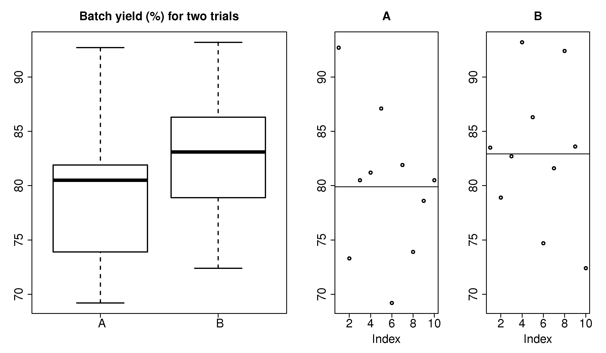

.. wikicode for table:

	{| class="wikitable center"
	|-
	! Experiment number
	! Feedback system
	! Yield
	!
	! Experiment number
	! Feedback system
	! Yield
	|-                  
	| 1 || A ||  92.7 ||  || 11 || B || 83.5
	|-                     
	| 2 || A ||  73.3 ||  || 12 || B || 78.9
	|-                     
	| 3 || A ||  80.5 ||  || 13 || B || 82.7
	|-                     
	| 4 || A ||  81.2 ||  || 14 || B || 93.2
	|-                     
	| 5 || A ||  87.1 ||  || 15 || B || 86.3
	|-                     
	| 6 || A ||  69.2 ||  || 16 || B || 74.7
	|-                     
	| 7 || A ||  81.9 ||  || 17 || B || 81.6
	|-                     
	| 8 || A ||  73.9 ||  || 18 || B || 92.4
	|-                     
	| 9 || A ||  78.6 ||  || 19 || B || 83.6
	|-                     
	| 10 || A || 80.5 ||  || 20 || B || 72.4
	|-
	| colspan="7" | 
	|-
	| colspan="2" |Mean  || 79.89|| || colspan="2" | Mean || 82.93
	|-
	| colspan="2" |Standard deviation  || 6.81|| || colspan="2" | Standard deviation || 6.70
	|}

.. figure:: images/system-comparison-wikitable.png
	:align: center
	:scale: 75

	
We address the question of whether or not there was a *significant difference* between system A and B.  A significant difference means that when system B is compared to a suitable reference, that we can be sure that the long run implementation of B will lead to an improved yield (%), and that the improvement shown from these 10 runs is not just due to chance.  We need to be sure, because system B will cost us $100,000 to install, and $20,000 in annual software license fees.

So how do we compare if control system B will better in the long term?

Comparison to a long-term reference set
~~~~~~~~~~~~~~~~~~~~~~~~~~~~~~~~~~~~~~~~~~~~~~~~~~~~~~~~~~~~~~~~

We can compare the past 10 runs from system B with the 10 runs from system A.  The average difference between these runs is :math:`\bar{x}_B - \bar{x}_A = 82.93 - 79.89 = 3.04` units of improved yield.  Now, if we have a long-term reference data set available, we can compare if any 10 historical, sequential runs, followed by another 10 historical, sequential runs had a difference that was this great.  If not, then we know that system B leads to a definite improvement, not likely to be caused by chance alone.

	#. Imagine that we have have 300 historical data points from this system, tabulated in time order: yield from batch 1, 2, 3 ...  (the data appear on the `book website <http://datasets.connectmv.com/info/batch-yields>`_).
	#. Calculate the average yields from batches 1 to 10. Then calculate the average yield from batches 11 to 20.  Notice that this is exactly like the experiment we performed when we acquired data for system.  Two groups of 10 batches, with the groups formed from sequential batches.
	#. Now subtract these two averages: (group average 11 to 20) minus (group average 1 to 10).
	#. Repeat steps 2 and 3, but use batches 2 to 11 and 12 to 21.  Repeat until all historical batch data are used up and the plot below can be drawn from these difference values.
	
	.. figure:: images/system-comparison-dotplot-grouped.png
		:width: 750px
		:align: center
		:scale: 100
	
The vertical line at 3.04 is the difference value recorded between system B and system A.   From this we can see that historically, there were 31 out of 281 batches (11% of historical data) that had a difference value of 3.04 or greater.  So there is a 11% probability that system B was better than system A purely by chance, and not due to any technical superiority.  Given this information, we can now judge, if the improved control system will be economically viable and judge, based on internal company criteria, if this is a suitable investment.

Notice that no assumption of independence or any form of distributions was required for this work!   The only assumption made is that the historical data are relevant.  We might know this if, for example, no substantial modification was made to the batch system for the duration over which the 300 samples were acquired.  If however, a different batch recipe were used for sample 200 onwards, then we may have to discard those first 200 samples: it is not fair to judge control system B to the first 200 samples under system A, when a different operating procedure was in use.

So to summarize: we can use a historical data set if it is relevant.  And there are no assumptions of independence or shape of the distribution.

In fact, for this example, the data were not independent, they were autocorrelated.  There was a relationship from one batch to the next: :math:`x[k] = \phi x[k-1] + a[k]`, with :math:`\phi = -0.3`, and  :math:`a[k] \sim \mathcal{N}\left(\mu=0, \sigma^2=6.7^2\right)`.

.. code-block:: s

	N <- 300
	phi <- -0.3
	spread <- 6.7
	location <- 79.9
	A.historical <- numeric(N)   # create a vector of zeros
	for (k in 2:N)
	{
		A.historical[k] <- phi*(A.historical[k-1]) + rnorm(1, mean=0, sd=spread)
	}
	A.historical <- A.historical + location

We can visualize this autocorrelation by plotting the values of :math:`x[k]` against :math:`x[k+1]`:

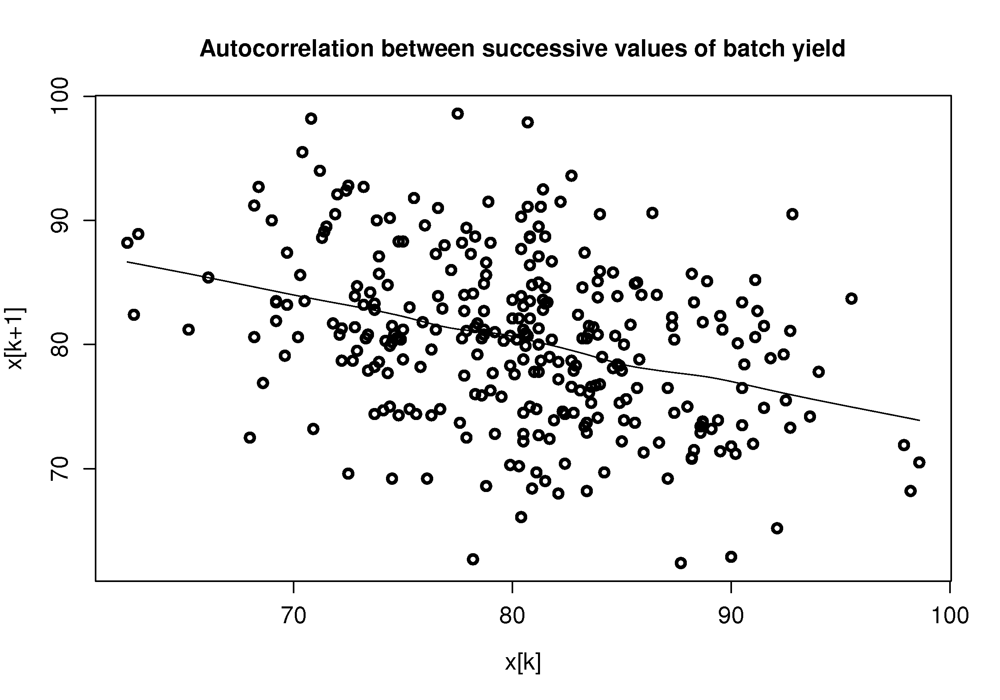

Comparison when a reference set is not available
~~~~~~~~~~~~~~~~~~~~~~~~~~~~~~~~~~~~~~~~~~~~~~~~~~~~~~~~~~~~~~~~

A reference data set may not always be available, only the data from the 20 experimental runs, shown in the table.  However, this will require that we make the strong assumption of random sampling (independence), which is often not valid in engineering data sets.  Fortunately, engineering data sets are usually large - we are good at collecting data - so the methodology in the preceding section should be used when possible.

How could the assumption of independence (random sampling) be made more realistically?  How is the lack of independence detrimental?  We show below that the assumption of independence is made twice: the samples within group A and B must be independent; furthermore, the samples between the groups should be independent. But first we have to understand why the assumption of independence is required, by understanding the usual approach for estimating if differences are significant or not.

The usual approach for assessing if the difference between :math:`\bar{x}_B - \bar{x}_A` is significant follows this approach:

	#.  Assume the data for sample A and sample B are normally distributed (we can verify that as shown in the section on the normal distribution - using qq-plots) 
	#.  Assume the data for sample A and sample B have the same population variance, :math:`\sigma_A = \sigma_B = \sigma` (there is a test for this, see the next section)
	#.  Let the sample A have population mean :math:`\mu_A` and sample B have population mean :math:`\mu_B`
	#.  From the central limit theorem (this is where the assumption of independence of the samples within each group comes), we know that:

		.. math::
			:nowrap:

				\begin{alignat*}{2}
					\mathcal{V}\left\{\bar{x}_A\right\} = \frac{\sigma^2_A}{n_A} &\qquad\qquad & \mathcal{V}\left\{\bar{x}_B\right\} = \frac{\sigma^2_B}{n_B}
				\end{alignat*}
	
	#.  Assuming independence again, but this time between groups, the means of each sample group would be independent as well, i.e. :math:`\bar{x}_A` and :math:`\bar{x}_B` are independent.  This implies that (as you will prove to yourself in the assignment):
	
		.. math::
		   :label: add-variance
		
					\mathcal{V}\left\{\bar{x}_B - \bar{x}_A\right\} = \frac{\sigma^2}{n_A} + \frac{\sigma^2}{n_B} = \sigma^2 \left(\frac{1}{n_A} + \frac{1}{n_B}\right)
			
	#. Using the central limit theorem, even if the samples in A and the samples in B are non-normal, the sample averages :math:`\bar{x}_A` and :math:`\bar{x}_B` will be much more normal, even for small sample sizes.  So the difference between these means will also be more normal: :math:`\bar{x}_B - \bar{x}_A`.  Now express this difference in the form of a :math:`z`-deviate:
	
		.. math::
			:label: zvalue-for-difference

			z = \frac{(\bar{x}_B - \bar{x}_A) - (\mu_B - \mu_A)}{\sqrt{\sigma^2 \left(\displaystyle \frac{1}{n_A} + \frac{1}{n_B}\right)}}
				
	 We could ask, what is the probability of seeing a :math:`z` value from equation :eq:`zvalue-for-difference` of that magnitude?  Recall that this :math:`z`-value is the equivalent of :math:`\bar{x}_B - \bar{x}_A`, expressed in deviation form, and we are interested if this difference is due to chance.  So we should ask, what is the probability of getting a value of :math:`z` **greater** than this? 
		
	 The only question remains is what is a suitable value for :math:`\sigma`?  As we have seen before, when we have a large enough reference set, then we can use the value of :math:`\sigma` from the historical data, called an *external estimate*.  Or we can use an *internal estimate* of spread; both approaches are discussed below.
	

..	ON USING CONFIDENCE INTERVAL  #. A confidence limit for :math:`z` can be formed, and if this limit includes zero, then we have some evidence that there may not be long term improvement, i.e. we have some evidence that :math:`\mu_B - \mu_A` may be zero. 

				.. math::
					:nowrap:

						\begin{alignat*}{4}
							(\bar{x}_B - \bar{x}_A) - c_n \sqrt{\sigma^2 \left(\displaystyle \frac{1}{n_A} + \frac{1}{n_B}\right)}  &\qquad<\qquad& \mu_B - \mu_A &\qquad<\qquad& (\bar{x}_B - \bar{x}_A) + c_n \sqrt{\sigma^2 \left(\displaystyle \frac{1}{n_A} + \frac{1}{n_B}\right)}
						\end{alignat*}

		 		The value for :math:`c_n` is determined by confidence level, and is taken from the normal distribution (e.g. :math:`c_n` = ``qnorm(0.975)`` for a 95% confidence limit).
		
		HOWEVER, DO NOT INTRODUCE it with this example, because this example is actually a one-sided t-test, where as the CI is usually 2-sided.  To introduce a 1-sided CI in addition to the other topics is a mess.
	
	
Now we know the approach required, using the above 6 steps, to determine if there was a significant difference.  And we know the assumptions that are required: normally distributed and independent samples.  But how can we be sure our data are independent?  This is the most critical aspect, so let's look at a few cases and discuss, then we will return to our example and calculate the :math:`z`-values with both an *external* and *internal* estimate of spread.

Discuss whether these experiments lead to independent data or not, and how we might improve the situation.

	a)	We are testing a new coating to repel moisture.  The coating is applied to packaging sheets that are already hydrophobic, however this coating enhances the moisture barrier property of the sheet.  In the lab, we take a large packaging sheet and divide it into 16 blocks.  We coat the sheet as shown in the figure and then use the :math:`n_A=8` and :math:`n_B=8` data points to determine if coating B is better than coating A.
	
		.. figure:: images/sheet-coating-application.png
			:width: 600px
			:align: center
			:scale: 50
		
		Some problems with this approach:
		
		-	The packaging sheet to which the new coating is applied may not be uniform.  The sheet is already hydrophobic, but the hydrophobicity is probably not evenly spread over the sheet, nor are any of the other physical properties of the sheet.  When we measure the moisture repelling property with the different coatings applied, we will not have an accurate measure of whether coating A or B worked better.  We must randomly assign blocks A and B on the packaging sheet.  
			
		-	Even so, this may still be inadequate, because what if the packaging sheet selected has overly high or low hydrophobicity (i.e. it is not representative of regular packaging sheets).  What should be done is that random packaging sheets should be selected, and they should be selected across different lots from the sheet supplier (sheets within one lot are likely to be more similar than between lots).  Then on each sheet we randomly apply coatings A and B, in random order.
		
		-	It is tempting to apply coating A and B to one half of the various sheets and measure the *difference* between the moisture repelling values from each half.  It is tempting because this approach would cancel out any base variation within the sheet.  Then we can go on to assess if this difference is significant.  There is nothing wrong with this methodology, however, there is a different, specific test for paired data (see the last section of these notes).  If you use the above test, you violate the assumption in step 5, which requires that :math:`\bar{x}_A` and :math:`\bar{x}_B` be independent.  Values within group A and B are independent, but not their sample averages (because you cannot calculate :math:`\bar{x}_A` and :math:`\bar{x}_B` independently - recall the analogy with selecting lottery tickets).
	
	b)	We are testing an alternative, cheaper raw material in our process, but want to be sure our product's final properties are unaffected.  Our raw material dispensing system will need to be modified to dispense material B.  This requires the production line to be shut down for 15 hours while the new dispenser, lent from the supplier, is installed.  The new supplier has given us 8 representative batches of their new material to test, and each test will take 3 hours.  We are inclined to run these 8 batches over the weekend: set up the dispenser on Friday night (15 hours), run the tests from Saturday noon to Sunday noon, then return the line back to normal for Monday's shift.  How might we violate the assumptions required by the data analysis steps above when we compare 8 batches of material A (collected on Thursday and Friday) to the 8 batches from material B?  What might we do to avoid these problems?
	
		- The 8 tests are run sequentially, so **any changes** in conditions between these 8 runs and the 8 runs from material A will be confounded (confused) in the results. 
	
			.. only:: studentlatex
		
				- 
				-
				-
				-
			
		.. only:: inst
		
			- For example, the staff running the equipment on the weekend are likely not the same staff that run the equipment on weekdays.  
			- The change in the dispenser may have inadvertently modified other parts of the process, and in fact the dispenser itself might be related to product quality.  
			- The samples from the tests will be collected and only analyzed in the lab on Monday, whereas the samples from material A are normally analyzed on the same day - that waiting period may degrade the sample.  
			
		 This confounding with all these other, potential factors means that we will not be able to determine whether material B caused a true difference, or whether it was due to the other conditions.
		
		- It is certainly expensive and impractical to randomize the runs in this case.  Randomization would mean we randomly run the 16 tests, with the A and B chosen in random order, e.g. ``A B A B A A B B A A B B B A B A``.  This particular randomization sequence would require changing the dispenser 9 times.  
		
			
		- One suboptimal sequence of running the system is ``A A A A B B B B A A A A B B B B``.  This requires changing the dispenser 4 times (one extra change to get the system back to material A).  We run each (``A A A A B B B B``) sequence on two different weekends, changing the operating staff between the two groups of 8 runs, making sure the sample analysis follows the usual protocols, and so on, then we reduced the chance of confounding the results.  
		
Randomization might be expensive and time-consuming in some studies, but it is the insurance we require to avoid being misled. These two examples demonstrate this principle: **block what you can and randomize what you cannot**.  We will review these concepts again in the :ref:`design and analysis of experiments section <design-analysis-experiments-chapter>`.  If the change being tested is expected to improve the process, then we must follow these precautions to avoid a process upgrade/modification  that does not lead to the expected improvement; or the the converse - a missed opportunity.  

External and internal estimates of spread
^^^^^^^^^^^^^^^^^^^^^^^^^^^^^^^^^^^^^^^^^^^^^^

So to recap the progress so far, we are aiming to test if there is a *significant, long-term difference* between two systems: A and B.  We showed the most reliable way to test this difference is to compare it with a body of historical data, with the comparison made in the same way as when the data from system A and B were acquired; this requires no additional assumptions. 

But, because we do not always have a large and relevant body of data available, we can calculate the difference between A and B and test if this difference could have occurred by chance alone.  For that we use equation :eq:`zvalue-for-difference`, but we need an estimate of spread.

.. Then, because we do not always have a large, relevant body of data available, we can calculate the difference between A and B and test if this difference lies in a confidence interval that includes zero.  We highlighted several assumptions required to generate this confidence interval, noting that these assumptions are quite demanding.

	.. math::
	
		\begin{alignat*}{4}
			(\bar{x}_B - \bar{x}_A) - c_n \sqrt{\sigma^2 \left(\displaystyle \frac{1}{n_A} + \frac{1}{n_B}\right)}  &\qquad<\qquad& \mu_B - \mu_A &\qquad<\qquad& (\bar{x}_B - \bar{x}_A) + c_n \sqrt{\sigma^2 \left(\displaystyle \frac{1}{n_A} + \frac{1}{n_B}\right)}
		\end{alignat*}
	
	.. todo:: this is a one-sided t-test: why is the CI symmetric?
	
.. AS BEFORE, DO NOT use confidence limits here.  Perhaps if you rework the example to be one where we test for no-difference, then a CI would work nicely.

**External estimate of spread**

The question we turn to now is what value to use for :math:`\sigma`  in equation :eq:`zvalue-for-difference`.  We got to that equation by assuming we have no historical, external data.  But what if we did have even some external data?  We could at least estimate :math:`\sigma` from that.   For example, the 300 historical batch yields has :math:`\sigma = 6.61`:

.. At the 95% confidence level: IGNORE THIS SECTION FOR NOW

	.. math::
		:nowrap:
	
		\begin{alignat*}{3}
			(82.93-79.89) - 1.96 \sqrt{6.61^2 \left(\displaystyle \frac{1}{10} + \frac{1}{10}\right)}  &\qquad<\qquad \mu_B - \mu_A &\qquad<\qquad& (82.93-79.89) + 1.96 \sqrt{6.61^2 \left(\displaystyle \frac{1}{10} + \frac{1}{10}\right)} \\
			-2.75  &\qquad<\qquad \mu_B - \mu_A &\qquad<\qquad& 8.83
		\end{alignat*}
		
.. AGAIN, avoid using CI's here
	
Check the probability of obtaining the :math:`z`-value in :eq:`zvalue-for-difference` by using the hypothesis that the value :math:`\mu_B - \mu_A = 0`.  In other words we are making a statement, or a test of significance.  Then we calculate this :math:`z`-value and its associated *cumulative probability*:

.. math::
	:nowrap:
	
	\begin{alignat*}{2}
	    z &= \dfrac{(\bar{x}_B - \bar{x}_A) - (\mu_B - \mu_A)}{\sqrt{\sigma^2 \left( \dfrac{1}{n_A} + \dfrac{1}{n_B}\right)}} \\
		z &= \dfrac{(82.93-79.89) - (\mu_B - \mu_A)}{\displaystyle \sqrt{6.61^2 \left(\displaystyle \frac{1}{10} + \frac{1}{10}\right)}} \\
		z &= \dfrac{3.04 - 0}{2.956} = 1.03
	\end{alignat*}
	
	
The probability of seeing a :math:`z`-value from :math:`-\infty` up to 1.03 is 84.8% (use the ``pnorm(1.03)`` function in R).  But we are interested in the probability of obtaining a :math:`z`-value **larger** than this. Why?  Because :math:`z=0` represents no improvement, and a value of :math:`z<0` would mean that system B is worse than system A.  So what are the chances of obtaining :math:`z=1.03`?  It is (100-84.8)% = 15.2%, which means that system B's performance could have been obtained by pure luck in 15% of cases.  

We interpret this number in the summary section, but let's finally look at what happens if we have no historical data - then we generate an *internal* estimate of :math:`\sigma` from the 20 experimental runs alone.

**Internal estimate of spread**

The sample variance from each system was :math:`s_A^2 = 6.81^2` and :math:`s_B^2 = 6.70^2`, and in this case it happened that :math:`n_A = n_B = 10`, although the sample sizes do not necessarily have to be the same.

If the variances are comparable (there is a :ref:`test for that below <univariate-pooled-variance>`), then we can calculate a pooled variance, :math:`s_P^2`, which is a weighted sum of the sampled variances:

.. math:: 
	:label: pooled-variance

	s_P^2 &= \frac{(n_A -1) s_A^2 + (n_B-1)s_B^2}{n_A - 1 + n_B - 1} \\
	      &= \frac{9\times 6.81^2 + 9 \times 6.70^2}{18} \\
	      &= 45.63

Now using this value of :math:`s_P` instead of :math:`\sigma` in :eq:`zvalue-for-difference`:

.. math::
 

	z &= \frac{(\bar{x}_B - \bar{x}_A) - (\mu_B - \mu_A)}{\sqrt{\sigma^2 \left(\displaystyle \frac{1}{n_A} + \frac{1}{n_B}\right)}} \\
	  &= \frac{(82.93 - 79.89) - (\mu_B - \mu_A)}{\sqrt{s_P^2 \left(\displaystyle \frac{1}{10} + \frac{1}{10}\right)}} \\
	  &= \frac{3.04 - 0}{\sqrt{45.63 \times 2/10}} \\
	  &= 1.01

..	FUTURE: add the equation for the confidence interval here

The probability of obtaining a :math:`z`-value greater than this can be calculated as 16.3% using the :math:`t`-distribution with 18 degrees of freedom (use ``1-pt(1.01, df=18)`` in R).  We use a :math:`t`-distribution because an estimate of the variance is used, :math:`s_p^2`, not a large, population variance, :math:`\sigma^2`.  

As an aside: we used a normal distribution for the external :math:`\sigma` and a :math:`t`-distribution for the internal :math:`s`.  Both cases had a similar value for :math:`z` (compare :math:`z = 1.01` to :math:`z = 1.03`).  Note however that the probabilities are higher in the :math:`t`-distribution's tails, which means that even though we have similar :math:`z`-values, the probability is greater: 16.3% against 15.2%.  While this difference is not much from a practical point of view, it illustrates the difference between the :math:`t`-distribution and the normal distribution.

The results from this section were achieved by only using the 20 experimental runs, no external data.  However, it made some strong assumptions: 

	- The variances of the two samples are comparable, and can :ref:`therefore be pooled <univariate-pooled-variance>` to provide an estimate of :math:`\sigma` 
	- The usual assumption of independence within each sample is made (which we know not to be true for many practical engineering cases)
	- The assumption of independence between the samples is also made (this is more likely to be true, because the first runs to acquire data for A are not likely to affect the runs for system B)
	- Each sample, A and B, is assumed to be normally distributed

Summary
^^^^^^^^^^^^^^^^^^^^^^^^^^^^^^^^^^^^^^^^^^^^^^

Let's compare the 3 estimates.  Recall our aim is to convince ourself/someone that system B will have better long-term performance than the current system A. 

If we play devil's advocate, our *null hypothesis* is that system B has no effect.  Then it is up to us to prove, convincingly, that the change has a systematic, permanent effect.  That is what the calculated probabilities represent, the probability of us being wrong.  

	#. Using only reference data: 11% (about 1 in 10)
	#. Using the 20 experimental runs, but an external estimate of :math:`\sigma`: 15.2% (about 1 in 7)
	#. Using the 20 experimental runs only, no external data: 16.3% (about 1 in 6)

The reference data method shows that the trial with 10 experiments of method B could have actually been taken from the historical data with a chance of 11%.  A risk adverse company may want this number to be around 5%, or as low as 1% (1 in 100), which essentially guarantees the new system will have better performance.  

When constructing the reference set, we have to be sure the reference data are appropriate.  Were the reference data acquired under conditions that were similar to the time in which data from system B were acquired?  In this example, they were, but in practice, careful inspection of plant records must be made to verify this.

The other two methods mainly use the experimental data, and provide essentially the same answer *in this case study*, though that is not always the case.  The main point here is that our experimental data are usually not independent.  However, by careful planning, and expense, we can meet the requirement of independence by randomizing the order in which we acquire the data.  Randomization is the insurance (cost) we pay so that we do not have to rely of a large body of prior reference data.  But in some cases it is not possible to randomize, so blocking is required.  More on this in the DOE section, section 4.

Other confidence intervals
~~~~~~~~~~~~~~~~~~~~~~~~~~~~~~~~~~~~~~~~~~~~~~~~~~~~~~~~~~~~~~~~

**Enrichment**: There are several other confidence intervals that you might come across in your career.  Rather than cover all of them in this book, we merely mention them here.  Chances are you won't remember all the details even if we do cover them (even I look these things up).  What is important is that you understand *how* to interpret a confidence interval.   Hopefully the previous discussion achieved that.

Confidence interval for the variance
^^^^^^^^^^^^^^^^^^^^^^^^^^^^^^^^^^^^^^

This confidence interval finds a region in which the normal distribution's variance parameter, :math:`\sigma`, lies.  The range is obviously positive, since variance is a positive quantity.  For reference, this range is:

.. math::
	\left[\frac{(n-1)S^2}{\chi^2_{n-1, \alpha/2}} \quad\text{to}\quad \frac{(n-1)S^2}{\chi^2_{n-1, 1-\alpha/2}} \right]

- :math:`n` is the number of samples
- :math:`S^2` is the sample variance
- :math:`\chi^2_{n-1, \alpha/2}` are values from the :math:`\chi^2` distribution with :math:`n-1` and :math:`\alpha/2` degrees of freedom 
- :math:`1-\alpha`: is the level of confidence, usually 95%, so :math:`\alpha = 0.05` in that case.

	.. todo:: give some R code still
	
.. _univariate-pooled-variance:

.. index::
	single: pool variances

Confidence interval for the ratio of two variances
^^^^^^^^^^^^^^^^^^^^^^^^^^^^^^^^^^^^^^^^^^^^^^^^^^^

One way to test whether we can pool (combine) two variances, taken from two different *normal distributions*, is to construct the ratio: :math:`\dfrac{s^2_1}{s^2_2}`.  We can construct a confidence interval, and if this interval contains the value of 1.0, then we have no evidence to presume they are different (i.e. we can assume the two population variances are similar).

.. math::
	:nowrap:

		\begin{alignat*}{4}
			  F_{1-\alpha/2, \nu_1, \nu_2}\dfrac{s_1^2}{s_2^2} &\qquad<\qquad& \dfrac{\sigma_1^2}{\sigma_2^2} &\qquad<\qquad& F_{\alpha/2, \nu_1, \nu_2}\dfrac{s_1^2}{s_2^2}
		\end{alignat*}

Where :math:`F_{1-\alpha/2, \nu_1, \nu_2}` and :math:`F_{\alpha/2, \nu_1, \nu_2}` are values from the F-distribution using :math:`\nu_1` degrees of freedom for estimating :math:`s_1` and :math:`\nu_2` degrees of freedom for estimating :math:`s_2`.  The values of F can be calculated in R using ``qf(alpha/2, df1=..., df2=...)``, and :math:`\alpha` is the level of confidence, usually :math:`\alpha = 0.05`.

Confidence interval for proportions: the binomial proportion confidence interval
^^^^^^^^^^^^^^^^^^^^^^^^^^^^^^^^^^^^^^^^^^^^^^^^^^^^^^^^^^^^^^^^^^^^^^^^^^^^^^^^^^^^^^^^^^^^^^^^^^^^^^^^^^^^^^^

Sometimes we measure the proportion of successes (passes). For example, if we take a sample of :math:`n` independent items from our production line, and with an inspection system we can judge pass or failure.  The proportion of passes is what is important, and we wish to construct a confidence region for the population *proportion*.  This allows one to say the population proportion of passes lies between the given range.  As in *the proportion of packaged pizzas with 20 or more pepperoni slices is between 86 and 92\%*.

Incidentally, it is this confidence interval that is used in polls to judge the proportion of people that prefer a political party.  One can run this confidence interval backwards and ask: how many independent people do I need to poll to achieve a population proportion that lies within a range of :math:`\pm 2\%`, 19 times out of 20?  The answer actually is function of the poll result!  But the worst case scenario is a split-poll, and that requires 2400 respondents.

.. Hypothesis tests; test of significance
	=======================================

	A confidence interval gives an engineer a sense of the precision of a parameter from a distribution.  The engineer can then use their judgement to determine if that confidence interval is important to them or not.  For example, knowing that your plastic product has a melting point of 455K to 495K, with 95% probability, can be used by your customer, e.g. 3M, to judge whether that product is suitable in their extruders.  

	A hypothesis test, or test of significance as it is also known, is use to make a statement, and then verify that statement.  For example, 3M could say, we tried 8 samples of your plastic, and the average melting point for the 8 samples was 500K.  Is that normal?  You product specification says your melting point is in the range 455K to 495K, with 95% probability. 

	 455K to 495K. So then you go perform a hypothesis test to verify if 500K is reasonable.  Your hypothesis is that 500K is not unusual.  The alternative hypothesis is that 500K is unusual.

	  What is the significance level?  How do you get to a test statistic?
	  You must present strong evidence to 

	reject that statement (hypothesis), otherwise it is accepted; sometimes we are prone to say this with a double-negative: "*there is no evidence to show that the melting point is not 472K*". 

	Hypothesis tests always work in this way:

		#. Specify your *null hypothesis*, a statement of what you want to test: the melting point is 472K.  The null hypothesis will be accepted as long as there is no evidence to show otherwise.
		#. Specify an alternative hypothesis, which will be accepted if you do have evidence to reject (disprove) the null hypothesis.  The alternative hypothesis is not always the opposite of the null hypothesis, though it may be.  We'll see some examples shortly.
		#. Specify a level of significance, a low probability number that indicates the threshold between a significant and insignificant difference, e.g. :math:`p = 0.05`.  This number represents the strength of evidence we require
		#. Then construct a test statistic, which is a function of the sampled data that ....
		#. And define a rejection region, which is a region for the test statistic's values that will result in you rejecting the null hypothesis.
	
		.. todo:: how does this level change our answer as it varies?

.. _univariate-paired-tests:

.. index::
	pair: paired tests; Univariate data

Paired tests
============

.. todo:: verify this section against other notes.

A paired test is a test that is run twice on the same object or batch of materials.  You might see the nomenclature of "two treatments" being used in the literature.  For example: 

	- A drug trial is run in two parts: each person randomly receives a placebo or the drug, then 3 weeks later they receive the opposite, for another 3 weeks.  Tests are run at 3 weeks and 6 weeks and the difference in the test result is recorded.
	- We are testing two different additives, A and B, where the additive is applied to a base package.  Several base packages are received from a supplier, supposedly uniform.  Split that base package into 2 parts, and run additive A and B on each half.  Measure the outcome variable and record the difference.
	- We are testing a new coating to repel moisture.  The coating is applied to randomly selected sheets in a pattern [AB] or [BA] (the pattern choice is made randomly).  We measure the repellent property value and record the difference.
	
.. Is this really a paired test? A new polymer is tested for surgical gloves. Physicians are randomly assigned a glove with the new polymer on one hand and the current polymer on the other hand.  There is no visual difference.

In each case we have a table of :math:`n` samples recording the difference values.  The question now is whether the difference is significant, or is it essentially zero?

The advantage of the paired test is that any systematic error in our measurement system, what ever it might be, is removed as long as that error is consistent.  Say for example we are measuring blood pressure, and the automated blood pressure device has a bias of +10 mmHg.  This systematic error will cancel out when we subtract the 2 test readings.  The disadvantage of the paired test is that we loose degrees of freedom.  Let's see how:

	#.	Calculate the :math:`n` differences: :math:`w_1 = x_{B,1} - x_{A,1}; w_2 = x_{B,2} - x_{A,2}, \ldots` to create the sample of values :math:`w = [w_1, w_2, \ldots, w_n]`
	#.	Assume these values, :math:`w`, are independent, because they are taken on independent objects (people, base packages, sheets of paper, *etc*)
	#.	Calculate the mean, :math:`\bar{w}` and the standard deviation, :math:`s_w`, of these :math:`n` difference values.  
	#.	What do we need to assume about the population from which :math:`w` comes?  Nothing.  We are not interested in the :math:`w` values, we are interested in :math:`\bar{w}`. OK, so what distribution would values of :math:`\bar{w}` come from?  By the central limit theorem, the :math:`\bar{w}` values should be normally distributed.  What are the population parameters?  We will say :math:`\bar{w} \sim \mathcal{N}\left(\mu_w, \sigma_w^2/n \right)`, where :math:`\mu_w = \mu_{A-B}`.
	
	#.	Now calculate the :math:`z`-value, but use the sample standard deviation, instead of the population standard deviation.
	
		.. math::			
			z = \frac{\bar{w} - \mu_w}{s_w / \sqrt{n}}
			
	#.	Because we have used the sample standard deviation, :math:`s_w`, we have to resort to the :math:`t`-distribution with :math:`n-1` degrees of freedom.
	
	#.	We can calculate a confidence interval, below, and if this interval includes zero, then the change from treatment A to treatment B had no effect.

		.. math::		
			\bar{w} - c_t \frac{s_w}{\sqrt{n}} < \mu_w < \bar{w} + c_t \frac{s_w}{\sqrt{n}}
			
		The value of :math:`c_t` is taken from the :math:`t`-distribution with :math:`n-1` degrees of freedom at the level of confidence required (use the ``qt(...)`` function in R to obtain the values of :math:`c_t`).

	#.	The loss in degrees of freedom can be seen when we use exactly the same data and treat the problem as one where we have :math:`n_A` and :math:`n_B` samples in groups A and B and want to test for a difference between :math:`\mu_A` and :math:`\mu_B`.  600-level students are encouraged to try this out.  There are more degrees of freedom, :math:`n_A + n_B - 2` in fact when we use the :math:`t`-distribution with the pooled variance from equation :eq:`pooled-variance`.  Compare this to the case just described above where there are :math:`n` degrees of freedom.
	
.. This example illustrates:
.. todo:: example showing loss of DOF (boys shoes example in BHH2). particularly, show the plots (p98 on BHH2- edition 1)

.. index::
	pair: exercises; Univariate data
	
Exercises
==========

.. question::

	Recall that :math:`\mu = \mathcal{E}(x) = \dfrac{1}{N}\sum{x}` and :math:`\mathcal{V}\left\{x\right\} = \mathcal{E}\left\{ (x - \mu )^2\right\} = \sigma^2 = \dfrac{1}{N}\sum{(x-\mu)^2}`. 

	#. What is the expected value thrown of a fair 6-sided die? (Note: plural of die is dice)
	#. What is the expected variance of a fair 6-sided die?
	
.. answer::

	Often the mean and standard deviation of a uniform distribution are not actual values from the distribution, however the definitions for them hold:

	#. :math:`\mu = \mathcal{E}(x) = \dfrac{1}{N}\sum{x} = \dfrac{1}{6}(1+2+3+4+5+6) = \mathbf{3.5}`
	#. :math:`\mathcal{V}\left\{x\right\} = \mathcal{E}\left\{ (x - \mu )^2\right\} =  \dfrac{1}{N}\sum{(1-3.5)^2 + (2-3.5)^2 + (3-3.5)^2 + (4-3.5)^2 + (5-3.5)^2 + (6-3.5)^2} = 17.5/6 = \mathbf{2.92}`

	If you're feeling adventurous, you can simulate random dice rolls and verify your answers::

		> N = 10000
		> hist(as.integer(runif(N, 1, 7)))      # make sure you get a uniform distribution
		> mean(as.integer(runif(N, 1, 7)))      # 3.4929
		> var(as.integer(runif(N, 1, 7)))       # 2.885426

.. question::

	Characterizing a distribution: 

	#.	Compute the mean, median, standard deviation and MAD for salt content for the various soy sauces given `in this report <http://beta.images.theglobeandmail.com/archive/00245/Read_the_report_245543a.pdf>`_ (page 41) as described in the the article from the `Globe and Mail <http://www.theglobeandmail.com/life/health/salt-variation-between-brands-raises-call-for-cuts/article1299117/>`_ on 24 September 2009.  Plot a boxplot of the data and report the interquartile range (IQR). Comment on the 3 measures of spread you have calculated: standard deviation, MAD, and interquartile range.
	
		The raw data are::
		
			[460, 520, 580, 700, 760, 770, 890, 910, 920, 940, 960, 1060, 1100]

.. answer::

	.. literalinclude:: code/soy-salt-content.R
	   :language: s
	   :lines: 1-11,13,15-

	.. figure:: images/soy-salt-content.png
		:width: 400px
		:scale: 50
	
	Note that the units of spread are the same as the variable being quantified.  The IQR is 240 mg salt/15 mL serving.  The standard deviation (202 mg salt/15 mL serving), and MAD (193 mg salt/15 mL serving), are 2 other ways to quantify the spread of the data.   Note that the IQR, for normally distributed data, will only be consistent if you divide the result by 1.349.  Read the help for the ``IQR`` function in R for more details.  Note from the code how the IQR is a *distance* between two points.

	In this example the numbers are mostly in agreement, because there are no major outliers.  The MAD and IQR are two robust methods of quantifying spread, while the standard deviation is extremely sensitive to outliers - due to the squaring of residuals about the mean.   You can verify this by replacing one of the values and recalculating the numbers.

.. question::

	Give a reason why Statistics Canada reports the median income when reporting income by geographic area.  Where would you expect the mean to lie, relative to the median?  Use `this table <http://www40.statcan.gc.ca/l01/cst01/famil107a-eng.htm>`_ to look up the income for Hamilton.  How does it compare to Toronto?  And all of Canada?

.. answer::

	In the example on salt content we saw how easily the mean is influenced by unusual data points.  Take any group of people anywhere in the world, and there will always be a few who earn lots of money (not everyone can be the CEO, especially of a bank!).  Also, since no one earns negative income, the distribution piles up at the left, with fewer people on the right. This implies that the mean will lie above the median, since 50% of the histogram area must lie below the median, by definition. One student pointed out that low income earners are less likely to file tax returns, so they are underrepresented in the data.

	Even though the median is a more fair way of reporting income, and robust to unusual earners (many low, very few super-rich), I would prefer if Statistics Canada released a histogram - that would tell a lot more - even just the the MAD, or IQR would be informative.  It was surprising that Hamilton showed higher median earnings per family than Toronto. I infer from this that there are more low income earners in Toronto and Canada than in Hamilton, but without the histograms it is hard to be sure.  Also, I wasn't able to find exactly what StatsCan means by a family - did they include single people as a "family"?  Maybe there are more, wealthy singles in Toronto, but they are aren't included in the numbers.  The median income per person would be a useful statistic to help judge that.

.. question::

	Use the data set on `raw materials <http://datasets.connectmv.com/info/raw-material-properties>`_.

		- How many variables in the data set?
		- How many observations?
		- The data are properties of a powder.  Plot each variable, one at a time, and locate any outliers.  Students using R will benefit from `part 2 of the tutorial <http://connectmv.com/tutorials/R_tutorial>`_ (see the use of the ``identify`` function).
		
.. answer::

	See the code below that generates the plots.   Outliers were identified by visual inspection of these plots.  Recall an outlier is an unusual/interesting point, and a function of the surrounding data.  You can use a boxplot to locate *preliminary* outliers, but recognize that you are leaving the computer to determine what is unusual.  Automated outlier detection systems work moderately well, but there is no substitute (yet!) for visual inspection of the data.

	The same few samples appear to be outliers in most of the variables.

	.. literalinclude:: code/raw-materials-univariate-checks.R
	   :lines: 1-27
	   :language: s

	.. figure:: images/size1.png
		:width: 300px
		:scale: 50
	.. figure:: images/size2.png
		:width: 300px
		:scale: 50
	.. figure:: images/size3.png
		:width: 300px
		:scale: 50
	.. figure:: images/density1.png
		:width: 300px
		:scale: 50
	.. figure:: images/density2.png
		:width: 300px
		:scale: 50
	.. figure:: images/density3.png
		:width: 300px
		:scale: 50
	

.. question::

	Use the section on `Historical data <http://www.climate.weatheroffice.ec.gc.ca/climateData/canada_e.html>`_ from Environment Canada's website and use the ``Customized Search`` option to obtain data for the ``HAMILTON A`` station from 2000 to 2009.  Use the settings as ``Year=2000``, and ``Data interval=Monthly`` and request the data for 2000, then click ``Next year`` to go to 2001 and so on. 

		-	For each year from 2000 to 2009, get the total snowfall and the average of the ``Mean temp`` over the whole year (the sums and averages are reported at the bottom of the table).

				.. Snow:     170.9, 94.1, 138.0, 166.2, 175.8, 218.4, 56.6, 182.4, 243.2,   avg=161.8
				.. MeanTemp: 7.6,   8.8,  8.8,   7.3,   7.7,   8.2,   9.1 , 8.2,  7.7
		-	Plot these 2 variables against time
		-	Now retrieve the long-term averages for these data `from a different section of their website <http://www.climate.weatheroffice.ec.gc.ca/climate_normals/index_e.html>`_ (use the same location, ``HAMILTON A``, and check that the data range is 1971 to 2000).  Superimpose the long-term average as a horizontal line on your previous plot.
		-	Note: the purpose of this exercise is more for you to become comfortable with web-based data retrieval, which is common in most companies.

.. answer::

	These are the data, and the code to plot the results.  The temperature for the last decade trended higher than the average for the prior 3 decades, 1971 to 2000.
 
	.. literalinclude:: code/hamilton-weather-data.R
		:language: s
		:lines: 1-7,9-11,13,15-17

	.. figure:: images/snowfall-data.png
		:width: 750px
		:scale: 75
	
	.. figure:: images/temperature-data.png
		:width: 750px
		:scale: 75
	
.. question::

	Does the number of visits in the `website traffic <http://datasets.connectmv.com/info/website-traffic>`_ data set follow a normal distribution?  If so, what are the parameters for the distribution?  What is the likelihood that you will have between 10 and 30 visits to the website?
	
.. answer:: 

	.. literalinclude:: code/website-visits-univariate.R
		:language: s
		:lines: 1-19

	The above source code was used to generate these plots to answer the question.  The data do appear to follow a normal distribution.  This means we can calculate the mean and standard deviation from the data.

		-	Mean number of visits = 22 visits
		-	Standard deviation of the number of visits = 8.3 visits
		-	Probability that there are between 10 and 30 visits to the site each day: 75.3%
		
	We should use the t-distribution to answer the last part, but at this stage we had not yet looked at the t-distribution.  However, the large number of observations (214) means the t-distribution is no different than the normal distribution (see Assignment 3).

.. question::

	The ammonia concentration in your wastewater treatment plant is measured every 6 hours.  The data for one year are available from the `dataset website <http://datasets.connectmv.com/info/ammonia>`_. 

	#. What appears to be a suitable distribution?  
	#. Estimate values for the distribution's parameters.
	#. What if I told you that these values are not independent.  How does it affect your answer?
	#. What is the probability of having an ammonia concentration greater than 50 mg/L when:

		- you use only the data (do not use any estimated parameters)
		- you use the estimated parameters for the distribution?

	.. could use "fitdistr" in R in the MASS package?

.. answer:: 

	.. literalinclude:: code/ammonia-in-wastewater.R
		:language: s

	An appropriate distribution appears to be the normal distribution, however the right hand side tail (upper tail) is slightly heavier (outside the given limits) than would be found on the normal distribution.  Assuming the 	data are normal, we can calculate the distribution's parameters as :math:`\bar{x} = \hat{\mu} = 36.1` and :math:`s= \hat{\sigma} = 8.52`.

	The fact that the data are not independent is not an issue.  To calculate estimates of the parameter's distribution (the mean and standard deviation) we do not need to assume independence.  One way to see this: if I randomly reorder the data, I will still get the same value for the mean and standard deviation.  The assumption of independence is required for the central limit theorem, but we have not used that theorem here.

	The probability of having an ammonia concentration greater than 50 mg/L:

		- when using only the data: 4.5% (see code above)
		- when using the estimated parameters of the distribution: 5.1% (see code above)
	
	We should use the t-distribution to answer the last part, but at this stage we had not yet looked at the t-distribution.  However, the large number of observations (1440) means the t-distribution is no different than the normal distribution.

.. question::

	We take a large bale of polymer composite from our production line and using good sampling techniques, we take 9 samples from the bale and measure the viscosity in the lab for each sample. These samples are independent estimates of the population (bale) viscosity. We will believe these samples follow a normal distribution (we could confirm this in practice by running tests and verifying that samples from any bale are normally distributed).  Here are 9 sampled values: ``23, 19, 17, 18, 24, 26, 21, 14, 18``.  

		- The sample average
		- An estimate of the standard deviation
		- What is the distribution of the sample average, :math:`\bar{x}`? What are the parameters of that distribution?

	              *Additional information*: I use a group of samples and calculate the mean, :math:`\bar{x}`, then I take another group of samples and calculate another :math:`\bar{x}`, and so on.  Those values of :math:`\bar{x}` are not going to be the same, but they should be similar.  In other words, the :math:`\bar{x}` also has a distribution.  So this question asks what that distribution is, and what its parameters are.

		- Construct an interval, symbolically, that will contain, with 95% certainty (probability), the population mean of the viscosity.  We didn't get to cover this in class, but read point 3 under the section *t-distribution* in the notes.  

	              *Additional information*: To answer this part, you should move everything to :math:`z`-coordinates first.  Then you need to find the points :math:`-c` and :math:`+c` in the following diagram that mark the boundary for a 95% of the total area under the distribution.  This region is an interval that will contain, with 95% certainty, the population mean of the viscosity, :math:`\mu`.  Write your answer in form: :math:`\text{LB} < \mu < \text{UB}`.

	                 .. figure:: images/show-confidence-interval.png
	                     :width: 500px

		- Now assume that for some hypothetical reason we know the standard deviation of the bale's viscosity is :math:`\sigma=3.5` units, calculate the population mean's interval numerically.

	              *Additional information*: In this part you are just finding the values of :math:`\text{LB}` and :math:`\text{UB}`

		Note: we will interpret this interval, called a confidence interval, in the next class.
	
.. answer::  

	.. literalinclude:: code/polymer-bale-samples.R
		:language: s
	
	-	Sample average = 20
	-	Sample standard deviation = 3.81
	-	By the central limit theorem, and if the samples are taken independently, the mean, :math:`\bar{x} \sim \mathcal{N}\left(\mu, \sigma/\sqrt{n}\right)`
	-	The z-value for :math:`\bar{x}` can be constructed as :math:`z = \dfrac{\bar{x} - \mu}{\sigma/\sqrt{n}}`.  An interval within which we can find :math:`\mu` with 95\% certainty is given below where :math:`c_n` is found from the normal distribution, and in R: ``qnorm(0.975) = 1.959964``, approximately 1.96.

	.. math::
		\begin{array}{rcccl} 
			  - c_n                                              &\leq& \displaystyle \frac{\bar{x} - \mu}{\sigma/\sqrt{n}} &\leq &  +c_n\\
			\bar{x}  - c_n \dfrac{\sigma}{\sqrt{n}}              &\leq&  \mu                                                &\leq& \bar{x}  + c_n\dfrac{\sigma}{\sqrt{n}} \\
			  \text{LB}                                          &\leq&  \mu                                                 &\leq& \text{UB}
		\end{array}
		
	-	The 95% confidence interval for :math:`\mu` is from 17.7 to 22.3.
	
.. question::

	You are responsible for the quality of maple syrup produced at your plant.  Historical data show that the standard deviation of the syrup viscosity is 40 cP.  How many lab samples of syrup must you measure so that an estimate of the syrup's long-term average viscosity is inside a **range** of 60 cP, 95% of the time.  This question is like the previous one: except this time you are given the range of the interval :math:`\text{UB}\,-\,\text{LB}`, and you need to find :math:`n`.
	
.. answer::

	We can write the range symbolically as:
	
	.. math::
	
		\text{LB} &= \bar{x} - c_n \dfrac{\sigma}{\sqrt{n}} \\
		\text{UB} &= \bar{x} + c_n \dfrac{\sigma}{\sqrt{n}}
	
	Subtracting and setting equal to 60 cP:
	
	.. math::
	
		\text{UB} - \text{LB} &= 60 = 2 c_n \cdot \dfrac{\sigma}{\sqrt{n}} \\
		n &= \left( \dfrac{(2)(1.96)(40)}{60}\right)^2 \\
		n &\approx 7 \text{~samples}

.. question::

	A new wastewater treatment plant is being commissioned and part of the commissioning report requires a statement of the confidence interval of the `biochemical oxygen demand (BOD) <http://en.wikipedia.org/wiki/Biochemical_oxygen_demand>`_.  How many samples must you send to the lab to be sure the true BOD is within a range of 2 mg/L, centered about the sample average?  If there isn't enough information given here, specify your own numbers and assumptions and work with them to answer the question.

.. answer::

	The objective is to calculate |n|, the number of samples.  Let :math:`\bar{x}` be the average of these |n| samples, and this will be distributed according to the normal distribution with mean and standard deviation as shown below, if the samples are taken independently (which may not be possible in practice!):

	.. math::
		z = \dfrac{\bar{x}_{\text{BOD}} - \mu_{\text{BOD}}}{\sigma_{\text{BOD}}}
	
	The value of |z| will lie within this confidence interval:

	.. math::
	
			\begin{array}{rcccl} 
			  - c_n                                                             &\leq& \dfrac{\bar{x}_{\text{BOD}} - \mu_{\text{BOD}}}{\sigma_{\text{BOD}}/\sqrt{n}}    &\leq&  +c_n \\
			\bar{x}_{\text{BOD}}  - c_n \dfrac{\sigma_{\text{BOD}}}{\sqrt{n}}   &\leq& \mu_{\text{BOD}}                                                                 &\leq& \bar{x}_{\text{BOD}}  + c_n\dfrac{\sigma_{\text{BOD}}}{\sqrt{n}} \\
			  \text{LB}                                                         &\leq& \mu_{\text{BOD}}                                                                 &\leq& \text{UB}
			\end{array}

	At this point all we know is that UB - LB = 2 mg/L.  These are the rest of the assumptions we have to make: 

		- assume a standard deviation of :math:`\hat{\sigma}_{\text{BOD}}` = 4 mg/L
		- use 95% confidence intervals
		- assume we know the population standard deviation, so we use the normal distribution to calculate :math:`c_n` as ``qnorm(1-0.05/2)`` in R.
	
	Solving for |n| at these values, similar to the approach in assignment 2, gives: :math:`n = \left(\dfrac{2(1.96)(\hat{\sigma}_{\text{BOD}})}{2}\right)^2 = (1.96 \times 4)^2 \sim 62`.  This large number of samples makes sense: compare the range (2 mg/L) to the standard deviation of 4 mg/L: you have to take a large number of samples to get your precision up when you have so much noise in your signal.

.. question::

    One aspect of your job responsibility is to reduce energy consumption on the plant floor.  You ask the electrical supplier for the energy requirements (W.h) for running a particular light fixture for 24 hours.  They won't give you the raw data, only their histogram when they tested randomly selected bulbs (see the data and code below). 

	.. code-block:: s

		> bin.centers <- c(4025, 4075, 4125, 4175, 4225, 4275, 4325, 4375)
		> bin.counts <- c(4, 19, 14,  5,  4,  1,  2,  1)
		> barplot(bin.counts, names.arg=bin.centers, ylab="Number of bulbs (N=50)", 
		     xlab="Energy required over 24 hours (W.h)", col="White", ylim=c(0,20))
	
	.. figure:: images/bulb-energy-barplot.png
		:width: 500px
		:align: center

	- Calculate an estimate of the mean and standard deviation, even though you don't have the original data.
	- What is a confidence interval for the mean at 95% probability, stating and testing any assumptions you need to make.

.. answer::

	-   The mean and standard deviation can be estimated as shown in the code below.  The estimates are: the mean energy usage is **4127 W.hours**, and the standard deviation is **79 W.hours**.  This corresponds very closely to the raw data I used to generate the assignment question (mean of actual data = 4125, sd of actual data = 77.2).

	    .. literalinclude:: code/bulb-energy-assignment3-2010.R
	       :language: s
	       :lines: 13-17

	-   Strictly speaking we cannot calculate a confidence interval for the mean, as the data are not normally distributed.  We can see that there is a heavy tail to the right hand side.  Why do we require the data to be normally distributed?  To create the confidence interval we have to use an estimate of the standard deviation, and then use the t-distribution to estimate the confidence interval bounds.  However, the t-distribution requires that we assume the raw data come from a normal distribution.

	    But if we do calculate the confidence interval, we have to use the t-distribution at the 95% cumulative area, with 50 - 1 = 49 degrees of freedom.  In R: ``qt(0.025, df=49)`` gives :math:`-c_t = -2.009575`. Using our estimates of :math:`s=79` and :math:`\bar{x} = 4127`
    
	    .. math::
    
	        \begin{array}{rcccl} 
	    		  - c_t                                              &\leq& \displaystyle \frac{\bar{x} - \mu}{s/\sqrt{n}} &\leq &  +c_t\\
	    		\bar{x}  - c_t \dfrac{s}{\sqrt{n}}                   &\leq&  \mu                                                 &\leq& \bar{x}  + c_t\dfrac{s}{\sqrt{n}} \\
	    		4127 - 2.01 \times \dfrac{79}{7}                     &\leq&  \mu                                                 &\leq& 4127 + 2.01 \times \dfrac{79}{7}\\
	    		4104                                                 &\leq&  \mu                                                 &\leq& 4150
	    	\end{array}

	    Look at this answer and compare it to the original histogram; does it make sense to you?

.. question::

    The confidence interval for the population mean takes one of two forms below, depending on whether we know the variance or not.  At the 90% confidence level, for a sample size of 13, compare and comment on the upper and lower bounds for the two cases.  Assume that :math:`s = \sigma = 3.72`.

	.. math::

		\begin{array}{rcccl} 
			  - c_n &\leq& \displaystyle \frac{\bar{x} - \mu}{\sigma/\sqrt{n}}  &\leq &  c_n\\ \\
			  - c_t &\leq& \displaystyle \frac{\bar{x} - \mu}{s/\sqrt{n}}  &\leq &  c_t
		\end{array}

.. answer::

	This question aims for you to prove to yourself that the t-distribution is **wider (more broad)** than the normal distribution.  The 90% region spanned by the t-distribution with 12 degrees of freedom has upper and lower limits at ``qt((1-0.9)/2, df=12)``, i.e. from **-1.782** to **1.782**.  The equivalent 90% region spanned by the normal distribution is ``qnorm((1-0.9)/2)``, spanning from **z=-1.64** to **z=1.64**.  Everything else in the center of the 2 inequalities is the same, so we only need to compare :math:`c_t` and :math:`c_n`.

.. question::

	.. _univariate-CO2-question:

    A major aim of many engineers is/will be to reduce the carbon footprint of their company's high-profile products. Next week your boss wants you to evaluate a new raw material that requires 2.6 :math:`\dfrac{\text{kg CO}_2}{\text{kg product}}` less than the current material, but the final product's brittleness must be the same as achieved with the current raw material.  This is a large reduction in :math:`\text{CO}_2`, given your current production capacity of 51,700 kg of product per year.  Manpower and physical constraints prevent you from running a randomized test, similar to what we discussed in class; you don't have a suitable database of historical data either.

    One idea you come up with is to use to your advantage the fact that your production line has three parallel reactors, TK104, TK105, and TK107.  They were installed at the same time, they have the same geometry, the same instrumentation, *etc*; you have pretty much thought about every factor that might vary between them, and are confident the 3 reactors are identical. Typical production schedules split the raw material between the 3 reactors.  Data `on the book website <http://datasets.connectmv.com/info/brittleness-index>`_ contain the brittleness values from the three reactors for the past few runs on the current raw material.

    #.	Which two reactors would you pick to run your comparative trial on next week?

	#.	Repeat your calculations assuming pairing.

.. answer::

	The purpose of this question is to compare two system.  There are two ways: either compare one group to another group, or to have paired tests.  We could consider this a paired test, because the material is run in both reactors at the same conditions.  In this answer we compare reactor I to reactor J as groups.  Our answer will be to run experiments in the reactors that show the smallest difference.

	.. note:: This question also has missing data, denote as ``NA`` in R.  Most real data sets that you deal with will have missing data and the questions will expect to deal with them.  For example, the degrees of freedom will be reduced because of the missing data.  Use this solution to see how to write code in R that deals with missing values.

	We can start by looking at the data.  A boxplot is a reasonable way to compare both the location and spread of the brittleness values from each reactor.

	.. figure:: images/brittleness-boxplot.png
	    :width: 750px
	    :align: center
	    :scale: 60

	The standard way to test for differences between two groups of samples is given by equation :eq:`zvalue-for-difference` - it is derived as coming from the normal distribution with mean of :math:`\mu_A - \mu_B` and the standard deviation as shown in the denominator.

	.. math::
	    z = \frac{(\bar{x}_B - \bar{x}_A) - (\mu_B - \mu_A)}{\sqrt{\sigma^2 \left(\displaystyle \frac{1}{n_A} + \frac{1}{n_B}\right)}}

	Assuming the two *population* means are identical, the |z|-value is a direct estimate of the probability with which that assumption is wrong.  A |z|-value around zero indicates that the assumption was true, a large or small |z|-value indicates that the assumption was wrong.

	So we can calculate the :math:`z`-value, and the corresponding probability for each pair of reactor differences using the code below.  

	But the next problem we face is that we don't know the value of :math:`\sigma`. We can estimate it however, by pooling the variances of the two groups. Strictly speaking we should do a check for comparable variances before pooling them - described :ref:`in a previous section <univariate-pooled-variance>`.

	When we use the pooled variance now, then the assumption that the |z|-value follows the normal distribution is not correct anymore; it follows the t-distribution, with the pooled number of degrees of freedom.  Once we have the |z|-value we can calculate the probability of finding a |z|-value of at least that big.  Anything beyond that is the risk that we are wrong.

	We can also expand the |z| value into a confidence interval at a given confidence level.  We do this in the code at the 95% level (see ``LB`` and ``UB`` terms).

	    -   :math:`\mu_{104} - \mu_{105}`: |z| = 1.25; risk we are wrong: 89.1%; CI: :math:`-31.4 \leq \mu_{104} - \mu_{105} \leq 134`
	    -   :math:`\mu_{104} - \mu_{107}`: |z| = 1.41; risk we are wrong: 91.6%; CI  :math:`-21.4 \leq \mu_{104} - \mu_{107} \leq 120`
	    -   :math:`\mu_{105} - \mu_{107}`: |z| = -0.0532; risk we are wrong: 52.1% and :math:`-81.8 \leq \mu_{105} - \mu_{107} \leq 77.6` (note that the minimum risk is 50%; the risk is not 47.8%)
    
	While all three reactors have confidence intervals that span zero at the 95% level, notice how the interval gives us a feel for the degree of difference.  Clearly **reactors TK105 and TK107 are the most similar**, however all 3 are statistically equivalent from a confidence interval point of view. Contrast this to using a hypothesis test, which you may have encountered in other statistical courses.  A hypothesis test just tells you  "yes" or "no"; a confidence interval gives a much better engineering feel for the degree of difference.  Also see the solution to question 6 that highlights another advantage of confidence intervals.

	To get full grade for this question you just had to report the z-values and its corresponding risk; confidence intervals were not required.

	.. literalinclude:: code/brittleness-comparison-assignment3-2010.R
	       :language: s
	
	**Using pairing**
	
	Pairing assumes that each reactor was run with the same material, except that the material was split into thirds: one third for each reactor.  As described in the `section on paired tests <univariate-paired-tests>`_, we rely on calculating the difference in brittleness, then calculating the z-value of the average difference.  Contrast this to the unpaired tests, where we calculated the difference of the averages.

	The code below shows how the paired differences are evaluated for each of the 3 combinations.  The paired test highlights the similarity between TK105 and TK107, the same as the unpaired test.  However the paired test shows much more clearly how different tanks TK104 and TK105 are, and especially TK104 and TK107.  

	In the case of TK104 and TK105 the difference might seem surprising - take a look back at the box plots and how much they overlap.   However a paired test cannot be judged by a box plot, because it looks at the case-by-case difference, not the overall between group difference.  A better plot with which to confirm the really large |z|-value for the TK105 and TK107 difference is the plot of the differences.

	.. literalinclude:: code/brittleness-paired-comparison-assignment3-2010.R
	       :language: s
	       :lines: 1-36

	Not required for the full grade, but one can show the confidence intervals are:

	.. math::
	
			\begin{array}{rcccl} 
			  9.81  &\leq& \mu_{105 - 104}    &\leq&  88.4 \\
			  48.3  &\leq& \mu_{107 - 104}    &\leq&  68.7 \\
			  -46.1  &\leq& \mu_{107 - 105}    &\leq&  33.5 \\
			\end{array}

	Advanced students should look at how the reduction in degrees of freedom affects this test; and contrast the results to those when using an unpaired test.

.. question::

	Use the `website traffic data <http://datasets.connectmv.com/info/website-traffic>`_ from the dataset website:

	- Write down, symbolically, the z-value for the difference in average visits on a Friday and Saturday.
	- Estimate a suitable value for the variance and justify your choice.
	- What is the probability of obtaining a z-value of this magnitude or smaller?  Would you say the difference is significant?
	- Pick any other 2 days that you would find interesting to compare and repeat your analysis.

	.. figure:: images/Website-traffic-TS.png
		:width: 750px
		
.. answer::

	-   Let our variable of interest be the difference between the average of the 2 groups: :math:`\bar{x}_{\text{Fri}} - \bar{x}_{\text{Sat}}`.  This variable will be distributed normally (why? - see the notes) according to :math:`\bar{x}_{\text{Fri}} - \bar{x}_{\text{Sat}} \sim \mathcal{N}\left(\mu_{\text{Fri}}-\mu_{\text{Sat}}, \sigma^2_{\text{diff}}\right)`.  So the z-value for this variable is: :math:`z = \dfrac{(\bar{x}_{\text{Fri}} - \bar{x}_{\text{Sat}}) - (\mu_{\text{Fri}}-\mu_{\text{Sat}}) }{\sigma_{\text{diff}}}`

	-   The variance of the difference, :math:`\sigma^2_{\text{diff}} = \sigma^2\left(\dfrac{1}{n_{\text{Fri}}} + \dfrac{1}{n_{\text{Sat}}} \right)`, where :math:`\sigma^2` is the variance of the number of visits to the website on Friday and Saturday.  Since we don't know that value, we can estimate it from pooling the 2 variances of each group.  We should calculate first that these variances are comparable (they are; but you :ref:`should confirm this yourself <univariate-pooled-variance>`).

	.. math::
	   \sigma^2 \approx s_P^2 &= \frac{(n_{\text{Fri}} -1) s_{\text{Fri}}^2 + (n_{\text{Sat}}-1)s_{\text{Sat}}^2}{n_{\text{Fri}} - 1 + n_{\text{Sat}} - 1} \\
	      &= \frac{29 \times 45.56 + 29 \times 48.62}{58} \\
	      &= 47.09
      
	-   The z-value calculated from this pooled variance is:

	    .. math::

	        z = \dfrac{20.77 - 15.27}{47.09 \left(\dfrac{1}{30} + \dfrac{1}{30} \right)} = 3.1
    
	    But since we used an estimated variance, we cannot say that |z| comes from the normal distribution anymore.  It now follows the t-distribution with 58 degrees of freedom (which is still comparable to the normal distribution - see question 7 below).  The corresponding probability that :math:`z<3.1` is 99.85%, using the t-distribution with 58 degrees of freedom.  This difference is significant; there is a very small probability that this difference is due to chance alone.

	-   The code was modified to generate the matrix of z-value results in the comments below.  The largest difference is between Sunday and Wednesday, and the smallest difference is between Monday and Tuesday.

	.. literalinclude:: code/website-differences-assignment3-2010.R
	       :language: s
	       :lines: 32-43,46,48-54,74-
       
.. question::

    There are two analytical techniques for measuring BOD (see question 1).  You wish to evaluate the two testing procedures, so that you can select the test which has lower cost, and fastest turn-around time, but without a compromise in accuracy.  Is there a difference in accuracy between the two methods?  Are you happy with this answer?   These are the data:

	=============== =================
	Dilution method Manometric method
	=============== =================
	11              25
	26              3
	18              27
	16              30
	20              33
	12              16
	8               28
	26              27
	12              12
	17              32
	14              16
	=============== =================

.. answer::

	The temptation is to jump into the code and calculate the t-values and averages differences (:math:`\bar{x}_D = 16.4`, and :math:`\bar{x}_M = 22.6`).  But start with a plot of the data, specifically a plot of the differences between the two methods.  The immediate problem you see is that average difference of 6.2 between the methods is strongly influenced by a single observation (the second one).  In general, the dilution method always produced a smaller result than the manometric method.  We expect to see that in our analytical results.

	.. figure:: images/BOD-comparison-plot.png
	    :width: 750px
	    :align: center
	    :scale: 60

	Now let's look at the analytical answer.  As before, using the code from question 4, we can calculate :math:`z = 1.86 = \dfrac{6.27}{3.375}` (where :math:`s_p^2 = 62.7`), with a probability of 96.1% that we will have a value smaller than this (risk = 3.9% that we are wrong).  A confidence interval would be :math:`-0.77 <  \mu_{\text{M}} - \mu_{\text{D}}< 13.3`.  And it is at this point that you should realize the problem, even if you didn't plot your data.  The fact that the confidence interval only just includes zero is what worries me; if the two methods were roughly equivalent, then the interval should span zero with rough symmetry. But this is too close.

	So omitting the second point and repeating the analysis gives: calculate :math:`z = 3.24 = \dfrac{9.20}{2.84}` (where :math:`s_p^2 = 40.4`), with a probability of 99.8% that we will have a value smaller than this (risk = 0.2% that we are wrong).  A confidence interval would be :math:`3.2 <  \mu_{\text{M}} - \mu_{\text{D}}< 15.2`; this is a result that is much more aligned with the plotted data.

	.. note:: You may have discovered/used the ``t.test(...)`` function in R.  If you know what you are doing with this function, you are welcome to use it; however I'm reluctant to advocate its use at this point, because these exercises are all about understanding what is going on with confidence intervals and calculating them yourself.

.. question::

	Plot the cumulative probability function for the normal distribution and the t-distribution on the same plot.  

		- Use 6 degrees of freedom for t-distribution.  
		- Repeat the plot for a larger number of degrees of freedom.  
		- At which point is the t-distribution indistinguishable from the normal distribution?  
		- What is the practical implication of this result?

.. answer::

	.. literalinclude:: code/t-distribution-normal-comparison-assignment3-2010.R
	       :language: s
	       :lines: 1-3,7-14

	.. figure:: images/normal-t-comparison.png
	    :width: 750px
	    :align: center
    
	The above source code and figure output shows that the t-distribution starts being indistinguishable from the normal distribution after about 35 to 40 degrees of freedom.  This means that when we deal with large sample sizes (over 40 or 50 samples), then we can use critical values from the normal distribution rather than the t-distribution.  Furthermore, it indicates that our estimate of the variance is a pretty good estimate of the population variance for largish sample sizes.

.. question::

	A food production facility fills bags with potato chips.  The advertised bag weight is 35.0 grams.   But, the current bagging system is set to fill bags with a mean weight of 37.4 grams, and this done so that only 1% of bags have a weight of 35.0 grams or less.  

		-	Back-calculate the standard deviation of the bag weights, assuming a normal distribution.
		-	Out of 1000 customers, how many are lucky enough to get 40.0 grams or more of potato chips in their bags?

.. answer::

	-	Calculate the z-value and find which fraction of :math:`z` falls at or below 1% of the probability area.  From the tables this is -2.326.

		Then solve for :math:`\sigma`:

		.. math::
			z &= \dfrac{35 - 37.4}{\sigma} = -2.326 \\
			\sigma &= \dfrac{35-37.4}{-2.326} = \mathrm{1.03} \text{~grams }

	-	Probability of 40.0 grams of more is the area above the corresponding :math:`z`-value:

		.. math::
			z &>	\dfrac{40- 37.4}{1.03} \\
			z &> 2.52

		The exact answer is ``(1 - pnorm(2.52))*1000 = 5.86``, though using tables you could use the value corresponding to :math:`z=2.5`, which is 99.38%, which is the area below that z-value.  The area above it is 0.62%, corresponding to 6.2 people. Either 5, 6 or 7 people is an acceptable answer, depending on your rounding error.
	
.. question::

You are a new engineer at a pharmaceutical company. One of the steps in the flowsheet is to blend three powders for a tablet: the excipient (an inactive magnesium stearate base), a binder, and the active ingredient.  The mixing process is tracked using a wireless near infrared (NIR) probe embedded in a V-blender.  The mixer is stopped when the NIR spectra become stable.  A new supplier of magnesium stearate is being considered that will save $ 294,000 per year.

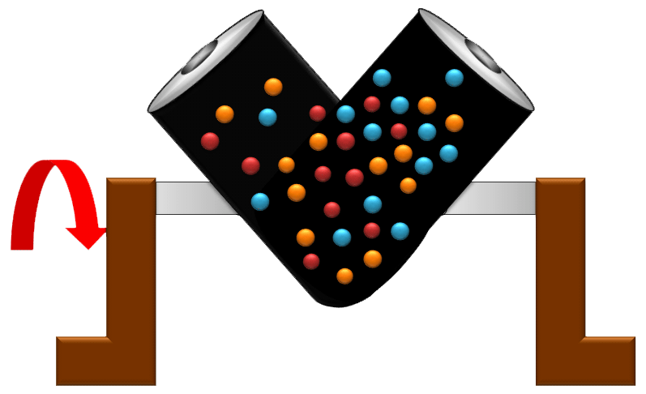
	
	Figure from Wikipedia (http://en.wikipedia.org/wiki/Industrial_mixer)

The 15 most recent runs with the current magnesium stearate supplier had an average mixing time of 2715 seconds, and a standard deviation of 390 seconds.  So far you have run 6 batches from the new supplier, and the average mixing time of these runs is 3115 seconds with a standard deviation of 452 seconds.  Your manager is not happy with these results so far - this extra mixing time will actually cost you more money via lost production.  

The manager wants to revert back to the original supplier, but is leaving the decision up to you; what would be your advice?  Show all calculations and describe any additional assumptions, if required.

.. answer::

	This question, similar to most real statistical problems, is open-ended.  This problem considers whether a significant difference has occurred.  And in many cases, even though there is significant difference, it has to be weighed up whether there is a *practical* difference as well, together with the potential of saving money (increased profit).

	You should always state any assumptions you make, compute a confidence interval for the difference and interpret it.  

	The decision is one of whether the new material leads to a significant difference in the mixing time.  It is desirable, from a production point of view, that the new mixing time is shorter, or at least the same.  Some notation:

	.. math::
		\begin{array}{rclrcl}
			\hat{\mu}_\text{Before} 	= \bar{x}_B &=& 2715 	&\qquad\qquad \hat{\mu}_\text{After} 	= \bar{x}_A &=& 3115\\
			\hat{\sigma}_\text{Before} 	= s_B &=& 390			&\qquad\qquad \hat{\sigma}_\text{After} = s_A &=& 452\\
			n_B 						&=& 15 					&\qquad\qquad n_A 						&=& 6
		\end{array}
	
	Assumptions required to compare the two groups:

		*	The individual samples within each group were taken independently, so that we can invoke the central limit theorem and assume these means and standard deviation are normal distributed.
		*	Assume the individual samples within each group are from a normal distribution as well.
		*	Assume that we can pool the variances, i.e. :math:`\sigma_\text{Before}` and :math:`\sigma_\text{After}` are from comparable distributions.
		*	Using the pooled variance implies that the :math:`z`-value follows the :math:`t`-distribution.
		*	The mean of each group (before and after) is independent of the other (very likely true).
		*	No other factors were changed, other than the raw material (we can only hope, though in practice this is often not true, and a paired test would eliminate any differences like this).

	Calculating the pooled variance:

	.. math::
		s_P^2 &= \dfrac{(n_A -1) s_A^2 + (n_B-1)s_B^2}{n_A - 1 + n_B - 1} \\
		      & = \dfrac{(6-1) 452^2 + (15-1)390^2}{6 - 1 + 15 - 1} \\
		      & = 165837
	
	Computing the z-value for this difference:

	.. math::	
		z &= \dfrac{(\bar{x}_B - \bar{x}_A) - (\mu_B - \mu_A)}{\sqrt{s_P^2 \left(\frac{1}{n_A} + \frac{1}{n_B}\right)}}\\
		z &= \dfrac{(2715 - 3115) - (\mu_B - \mu_A)}{\sqrt{165837 \left(\frac{1}{6} + \frac{1}{15}\right)}} \\
		z &= \dfrac{-400 - (\mu_B - \mu_A)}{196.7} = -2.03 \qquad \text{on the hypothesis that}\qquad \mu_B = \mu_A

	The probability of obtaining this value of :math:`z` can be found using the :math:`t`-distribution at 6 + 15 - 2 = 19 degrees of freedom (because the standard deviation is an estimate, not a population value).  Using tables, a value of 0.025, or 2.5% is found (in R, it would be ``pt(-2.03, df=19) = 0.0283``, or 2.83%).  At this point one can argue either way that the new excipient leads to longer times, though I would be inclined to say that this probability is too small to be due to chance alone.  Therefore there is a significant difference, and we should revert back to the previous excipient.  Factors such as operators, and other process conditions could have affected the 6 new runs.

	Alternatively, and this is the way I prefer to look at these sort of questions, is to create a confidence interval.  At the 95% level, the value of :math:`c_t` in the equation below, using 19 degrees of freedom is ``qt(0.975, df=19) = 2.09`` (any value close to this from the tables is acceptable):

		.. math::
			\begin{array}{rcccl} 
				-c_t &\leq& z	&\leq & +c_t \\
				(\bar{x}_B - \bar{x}_A) - c_t \sqrt{s_P^2 \left(\frac{1}{n_A} + \frac{1}{n_B}\right)}	&\leq& \mu_B - \mu_A	&\leq &  (\bar{x}_B - \bar{x}_A) + c_t \sqrt{s_P^2 \left(\frac{1}{n_A} + \frac{1}{n_B}\right)}\\
				-400 - 2.09 \sqrt{165837 \left(\frac{1}{6} + \frac{1}{15}\right)} 	&\leq& \mu_B - \mu_A	&\leq& -400 + 2.09 \sqrt{165837 \left(\frac{1}{6} + \frac{1}{15}\right)} \\
				-400 - 412	&\leq& \mu_B - \mu_A	&\leq&   -400 + 412 \\
				-812		&\leq& \mu_B - \mu_A	&\leq&   12 
			\end{array}

	The interpretation of this confidence interval is that there is no difference between the current and new magnesium stearate excipient.  The immediate response to your manager could be "*keep using the new excipient*". 

	However, the confidence interval's asymmetry should give you pause, certainly from a practical point of view (this is why I prefer the confidence interval - you get a better interpretation of the result). The 12 seconds by which it overlaps zero is so short when compared to average mixing times of around 3000 seconds, with standard deviations of 400 seconds.  The practical recommendation is that the new excipient has longer mixing times, so "*revert to using the previous excipient*".

	One other aspect of this problem that might bother you is the low number of runs (batches) used.  Let's take a look at how sensitive the confidence interval is to that.  Assume that we perform one extra run with the new excipient (:math:`n_A = 7` now), and assume the pooled variance, :math:`s_p^2 = 165837` remains the same with this new run.  The new confidence interval is:

	.. math::
		\begin{array}{rcccl} 
			(\bar{x}_B - \bar{x}_A) - c_t \sqrt{s_P^2 \left(\frac{1}{n_A} + \frac{1}{n_B}\right)}	&\leq& \mu_B - \mu_A	&\leq &  (\bar{x}_B - \bar{x}_A) + c_t \sqrt{s_P^2 \left(\frac{1}{n_A} + \frac{1}{n_B}\right)}\\
			(\bar{x}_B - \bar{x}_A)- 2.09 \sqrt{165837 \left(\frac{1}{7} + \frac{1}{15}\right)} 	&\leq& \mu_B - \mu_A	&\leq& (\bar{x}_B - \bar{x}_A)  + 2.09 \sqrt{165837 \left(\frac{1}{7} + \frac{1}{15}\right)} \\
			(\bar{x}_B - \bar{x}_A)  - 390	&\leq& \mu_B - \mu_A	&\leq&   (\bar{x}_B - \bar{x}_A) + 390 
		\end{array}

	So comparing this :math:`\pm 390` with 7 runs, to the :math:`\pm 412` with 6 runs, shows that the confidence interval shrinks in quite a bit, much more than the 12 second overlap of zero.  Of course we don't know what the new :math:`\bar{x}_B - \bar{x}_A` will be with 7 runs, so my recommendation would be to perform at least one more run with the new excipient, but I suspect that the new run would show there to be a significant difference, and statistically confirm that we should "*revert to using the previous excipient*".
	
.. question::

	List an advantage of using a paired test over an unpaired test.  Give an example, not from the notes, that illustrates your answer.

.. answer::

	One primary advantage of pairing is that any systematic difference between the two groups (A and B) is eliminated.  For example, a bias in the measurement will cancel out when calculating the pairs of differences.  Any example is suitable as an answer: e.g. laboratory miscalibration; an offset in an on-line sensor, *etc*.

	Other advantages are that the raw data do not need to be normally distributed, only the paired differences.  

	Another advantage is that randomization of the trials is required in the unpaired case (often a costly extra expense), whereas in the paired case, we only need to be sure the pairs are independent of each other (that's much easier to assume, and often true).  For example testing drug A and B on a person, some time apart.  The pairs are run on the same person, but each person in the drug trial is independent of the other.

.. question::

	An *unpaired* test to distinguish between group A and group B was performed with 18 runs: 9 samples for group A and 9 samples for group B.  The pooled variance was 86 units. 

	Also, a *paired* test on group A and group B was performed with 9 runs. After calculating the paired differences, the variance of these differences was found to be 79 units.  

	Discuss, in the context of this example, an advantage of paired tests over unpaired tests.  Assume 95% confidence intervals, and that the true result was one of "no significant difference between method A and method B".  Give numeric values from this example to substantiate your answer.

.. answer::

	One advantage of the paired test is that often a fewer number of samples are required to obtain a more sensitive result than when analyzing the data as from two distinct, unpaired groups.

	Construct the confidence interval for both cases, substitute in these values and then compare the confidence intervals.  The equations for both confidence intervals are derived directly from the :math:`z`-value appearing in the class notes.

	**Unpaired case**:

	.. math::

		\begin{array}{rcccl} 
			  - c_t                                              &\leq& \dfrac{(\bar{x}_B - \bar{x}_A) - (\mu_B - \mu_A)}{\sqrt{s_P^2 \left(\dfrac{1}{n_A} + \dfrac{1}{n_B}\right)}} &\leq &  +c_t\\
			(\bar{x}_B - \bar{x}_A)  - c_t \sqrt{s_P^2 \left(\dfrac{1}{n_A} + \dfrac{1}{n_B}\right)}  &\leq&  \mu_B - \mu_A &\leq& (\bar{x}_B - \bar{x}_A) + c_t \sqrt{s_P^2 \left(\dfrac{1}{n_A} + \dfrac{1}{n_B}\right)} \\
		   	(\bar{x}_B - \bar{x}_A)  - 2.12 \times \sqrt{86 \left(\dfrac{1}{9} + \dfrac{1}{9}\right)}  &\leq&  \mu_B - \mu_A &\leq& (\bar{x}_B - \bar{x}_A) + 2.12 \times \sqrt{86 \left(\dfrac{1}{9} + \dfrac{1}{9}\right)} \\
			(\bar{x}_B - \bar{x}_A)  - 9.27  &\leq&  \mu_B - \mu_A &\leq& (\bar{x}_B - \bar{x}_A) + 9.27 \\
		\end{array}

	The :math:`c_t` value for the unpaired case is from the t-distribution with 16 degrees of freedom, a value of around 2.12.

	**Paired case**:

	In this case the vector of differences is :math:`w`, and by the central limit theorem it is distributed as :math:`w \sim \mathcal{N}\left( \mu_{B-A} , \sigma_w^2/n \right)`, but we use the estimated variance, :math:`s_w^2` instead.

		.. math::

			\begin{array}{rcccl} 
				  - c_t               						&\leq& \dfrac{\bar{w} - \mu_{B-A}}{s_w / \sqrt{n}} 	&\leq &  +c_t\\
				\\
				\bar{w} - c_t \dfrac{s_w}{\sqrt{n}}			&\leq& \mu_w 									&\leq &  \bar{w} + c_t \dfrac{s_w}{\sqrt{n}} \\
				\bar{w} - 2.3 \dfrac{\sqrt{79}}{\sqrt{9}}	&\leq& \mu_w 									&\leq &  \bar{w} + 2.3 \dfrac{\sqrt{79}}{\sqrt{9}} \\
				\bar{w} - 6.81								&\leq& \mu_w 				&\leq&  \bar{w} + 6.81
			\end{array}

	The :math:`c_t` value for the paired case is from the t-distribution with 8 degrees of freedom, a value of around 2.3.

	The key result of this question is that the confidence interval for the paired case is tighter (narrower) than the confidence interval from the unpaired case.  Given that the true result was one of no significant difference, it implies that :math:`\mu_A = \mu_B` and that :math:`\mu_w = 0`.  The tighter confidence interval comes purely from the fact that the standard deviation used for the paired case is smaller, :math:`\sqrt{\dfrac{79}{9}}` *vs* the :math:`\sqrt{86 \left(\dfrac{1}{9} + \dfrac{1}{9}\right)}` from the unpaired case.  This is not due to the variances, since :math:`\sqrt{86} \approx \sqrt{79}`, i.e. (9.27 vs 8.88), but rather due to the fact that that unpaired standard deviation is multiplied by :math:`\sqrt{2/9}`, while the paired standard deviation is multiplied by :math:`\sqrt{1/9}`.

	So while the :math:`c_t` value for the paired case is actually larger (widening the confidence interval due to the fewer degrees of freedom), the overall effect is  that the paired confidence interval is narrower than the unpaired confidence interval. This result holds for most cases of paired and unpaired studies, though not always.
	
.. question::

	You are convinced that a different impeller (mixing blade) shape for your tank will lead to faster, i.e. shorter, mixing times.  The choices are either an axial blade or a radial blade. 

	..	figure:: images/Mixing_-_flusso_assiale_e_radiale.jpg
		:width: 500px
		:align: center
		:scale: 40%

		Axial and radial blades; figure from Wikipedia (http://en.wikipedia.org/wiki/Impeller)

	Before obtaining approval to run some experiments, your team wants you to explain how you will interpret the experimental data. Your reply is that you will calculate the average mixing time from each blade type and then calculate a confidence interval for the difference.  A team member asks you what the following 95% confidence intervals would mean:

		#.	:math:`-453 \text{~seconds} \leq \mu_{\text{Axial}} - \mu_{\text{Radial}} \leq 390 \text{~seconds}`
		#.	:math:`-21 \text{~seconds} \leq \mu_{\text{Axial}} - \mu_{\text{Radial}} \leq 187 \text{~seconds}`

	For both cases (a) explain what the confidence interval means in the context of this experiment, and (b) whether the recommendation would be to use radial or axial impellers to get the shortest mixing time.

	\3. Now assume the result from your experimental test was :math:`-21 \text{~seconds} \leq \mu_{\text{Axial}} - \mu_{\text{Radial}} \leq 187 \text{~seconds}`; how can you make the confidence interval narrower?

.. answer::

	#.	This confidence interval spans zero, and nearly symmetrically.  This implies the population difference is likely zero, while the symmetry implies their is no preference either way: the difference in mixing times is as low as -453 seconds or as high as 390 seconds. The recommendation is that either the axial or radial impeller could be used, with no expected long-term difference.  Use the cheaper impeller; or use the axial impeller if the costs are the same (only because of the very slight imbalance in the CI).  Note that there is a 5% chance that the confidence interval does not contain the true difference.

	#.	This confidence interval also spans zero, so there is **no statistical difference** between the two impellers.  However the CI does not span zero symmetrically.  The asymmetry of the interval makes me much less comfortable recommending that there is no **practical difference** between the impellers.  It often happens in these cases that by removing a single data point that the confidence interval does not span zero anymore. In this case I would recommend either impeller, but if there is no cost difference, I would prefer the radial impeller, as it might have shorter mixing times, especially if the confidence interval quoted here is only due to one observation.  A careful review of the raw data would be useful in this case.

	#.	The confidence interval can be made narrower in 2 ways (as long as the sample mean and sample standard deviation remain stable):

		-	Use more data points, :math:`n` in both groups.
		-	Choose a lower degree of confidence, e.g. 90%  instead of 95%, which is really just an artificial reduction of the interval.

		One can also reduce the interval by shrinking the standard deviation, but that's usually not a practical possibility.  You cannot perform a paired test, as you only have one mixing tank.

	.. sidebar:: Interpreting confidence intervals

		Recall the definition of the confidence interval is subtle: it says 95% of the time, the upper and lower bounds of the confidence interval contain the true value of the parameter; it does *not* say there is a 95% probability the true value of the parameter lies inside the bounds.  That last part is incorrect because it implies the true value of the parameter can vary, which it can't: the true parameter value is fixed, only the bounds change.  
		
.. question::

	The enrichment paper by PJ Rousseeuw, "`Tutorial to Robust Statistics <http://dx.doi.org/10.1002/cem.1180050103>`_`", *Journal of Chemometrics*, **5**, 1-20, 1991 discusses the breakdown point of a statistic.  Describe what the breakdown point is, and give two examples: one with a low breakdown point, and one with a high breakdown point.  Use a vector of numbers to help illustrate your answer.

	*Solution*

	PJ Rousseeuw defines the breakdown point on page 3 of his paper as "... the smallest fraction of the observations that have to be replaced to make the estimator unbounded. In this definition one can choose which observations are replaced, as well as the magnitude of the outliers, in the least favourable way".

	A statistic with a low breakdown point is the mean, of the :math:`n` values used to calculate the mean, only 1 needs to be replaced to make the estimator unbounded; i.e. its breakdown point is :math:`1/n`.  The median though has a breakdown point of 50%, as one would have to replace 50% of the :math:`n` data points in the vector before the estimator becomes unbounded.

	Use this vector of data as an example: :math:`[2, 6, 1, 9151616, -4, 2]`.  The mean is 1525270, while the median is 2.

	